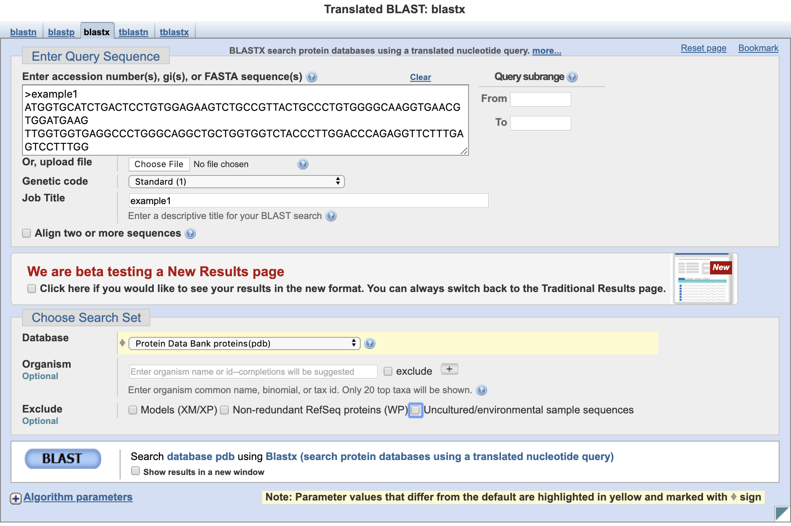
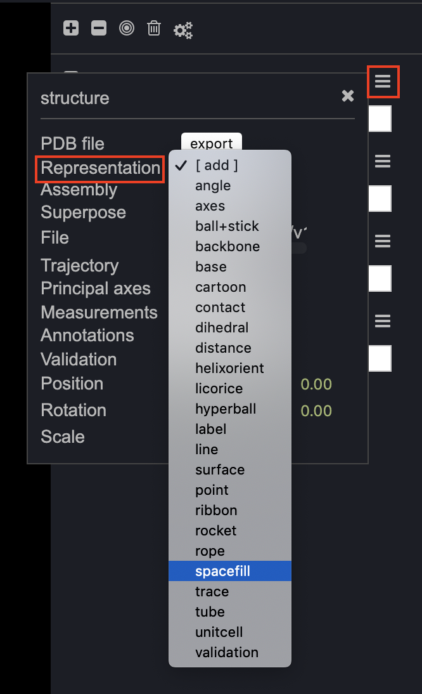
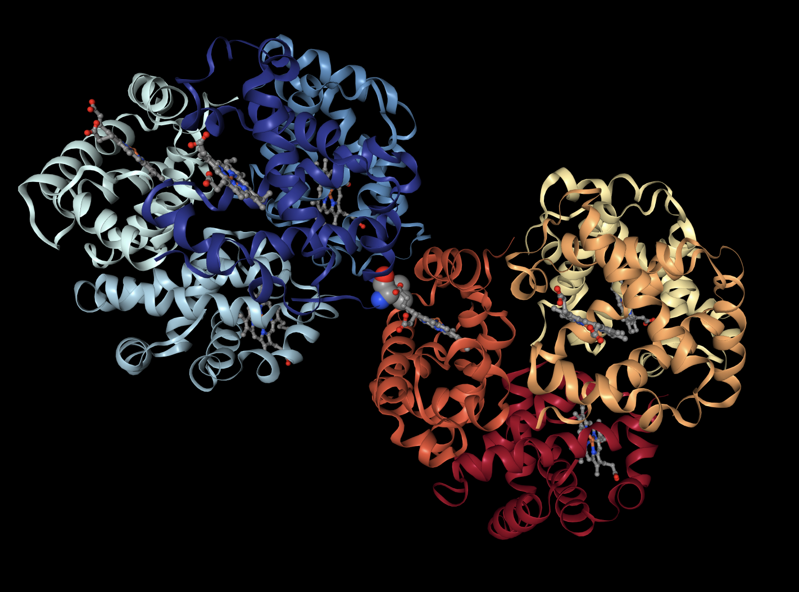

Class 1: Databases and Online Resources
================
Yi Fu
4/2/2019

First, let’s check if “Seaview” has been downloaded. Here is the
website:

> [Seaview download](http://doua.prabi.fr/software/seaview)

We are also going to use these websites:

> [BLAST](https://blast.ncbi.nlm.nih.gov/Blast.cgi)

> [NCBI](http://www.ncbi.nlm.nih.gov)

> [Muscle](https://www.ebi.ac.uk/Tools/msa/muscle/)

> [PDB](http://www.rcsb.org/)

> [NGL Viewer](http://nglviewer.org/ngl/)

Today’s lecture will cover a range of common bioinformatics databases
and associated services available on the Web.

## 1\. BLASTn

Use Nucleotide [BLAST](https://blast.ncbi.nlm.nih.gov/Blast.cgi) and
search against the **Nucleotide collection (NR database)** that includes
GenBank.

> \>example1  
> ATGGTGCATCTGACTCCTGTGGAGAAGTCTGCCGTTACTGCCCTGTGGGGCAAGGTGAACGTGGATGAAG  
> TTGGTGGTGAGGCCCTGGGCAGGCTGCTGGTGGTCTACCCTTGGACCCAGAGGTTCTTTGAGTCCTTTGG  
> GGATCTGTCCACTCCTGATGCAGTTATGGGCAACCCTAAGGTGAAGGCTCATGGCAAGAAAGTGCTCGGT  
> GCCTTTAGTGATGGCCTGGCTCACCTGGACAACCTCAAGGGCACCTTTGCCACACTGAGTGAGCTGCACT  
> GTGACAAGCTGCACGTGGATCCTGAGAACTTCAGGCTCCTGGGCAACGTGCTGGTCTGTGTGCTGGCCCA  
> TCACTTTGGCAAAGAATTCACCCCACCAGTGCAGGCTGCCTATCAGAAAGTGGTGGCTGGTGTGGCTAAT  
> GCCCTGGCCCACAAGTATCACTAAGCTCGCTTTCTTGCTGTCCAATTT

Here is the input.

Here are the BLASTn top 10 results.

The top hit is **Homo sapiens hemoglobin subunit beta (HBB), mRNA**.

Here is the information for this sequence (HBB).

Here is more detailed detailed information by clicking the **Gene** link
and redicted to a new page.

## 2\. NCBI

Use [NCBI](http://www.ncbi.nlm.nih.gov) and search for HBB. Select
**Nucleotide** from the drop menu associated with the top search box,
and choose **RefSeq** of **Homo sapiens** on the left.

Here is the search result (Graphic).

Here is the search result (FASTA).

## 3\. Muscle

Now we have two sequences.

> \>NM\_000518.5 Homo sapiens hemoglobin subunit beta (HBB),
> mRNA  
> ACATTTGCTTCTGACACAACTGTGTTCACTAGCAACCTCAAACAGACACCATGGTGCATCTGACTCCTGA  
> GGAGAAGTCTGCCGTTACTGCCCTGTGGGGCAAGGTGAACGTGGATGAAGTTGGTGGTGAGGCCCTGGGC  
> AGGCTGCTGGTGGTCTACCCTTGGACCCAGAGGTTCTTTGAGTCCTTTGGGGATCTGTCCACTCCTGATG  
> CTGTTATGGGCAACCCTAAGGTGAAGGCTCATGGCAAGAAAGTGCTCGGTGCCTTTAGTGATGGCCTGGC  
> TCACCTGGACAACCTCAAGGGCACCTTTGCCACACTGAGTGAGCTGCACTGTGACAAGCTGCACGTGGAT  
> CCTGAGAACTTCAGGCTCCTGGGCAACGTGCTGGTCTGTGTGCTGGCCCATCACTTTGGCAAAGAATTCA  
> CCCCACCAGTGCAGGCTGCCTATCAGAAAGTGGTGGCTGGTGTGGCTAATGCCCTGGCCCACAAGTATCA  
> CTAAGCTCGCTTTCTTGCTGTCCAATTTCTATTAAAGGTTCCTTTGTTCCCTAAGTCCAACTACTAAACT  
> GGGGGATATTATGAAGGGCCTTGAGCATCTGGATTCTGCCTAATAAAAAACATTTATTTTCATTGCAA

> \>example1  
> ATGGTGCATCTGACTCCTGTGGAGAAGTCTGCCGTTACTGCCCTGTGGGGCAAGGTGAACGTGGATGAAG  
> TTGGTGGTGAGGCCCTGGGCAGGCTGCTGGTGGTCTACCCTTGGACCCAGAGGTTCTTTGAGTCCTTTGG  
> GGATCTGTCCACTCCTGATGCAGTTATGGGCAACCCTAAGGTGAAGGCTCATGGCAAGAAAGTGCTCGGT  
> GCCTTTAGTGATGGCCTGGCTCACCTGGACAACCTCAAGGGCACCTTTGCCACACTGAGTGAGCTGCACT  
> GTGACAAGCTGCACGTGGATCCTGAGAACTTCAGGCTCCTGGGCAACGTGCTGGTCTGTGTGCTGGCCCA  
> TCACTTTGGCAAAGAATTCACCCCACCAGTGCAGGCTGCCTATCAGAAAGTGGTGGCTGGTGTGGCTAAT  
> GCCCTGGCCCACAAGTATCACTAAGCTCGCTTTCTTGCTGTCCAATTT

Use [Muscle](https://www.ebi.ac.uk/Tools/msa/muscle/) available on the
EBI website to align the two sequences above.

Here is the alignment result.

Download the alignment file by clicking **Download Alignment File** link
and redicted to a new page. Then, click **File \> Save Page As \> …**.
The **muscle.clw** is saved in the data folder.

## 4\. Seaview

Open downloaded [Seaview](http://doua.prabi.fr/software/seaview)
application. Then, click **File \> Open \> …** and select
**muscle.clw**.

Here is what it looks like.

As shown in the picture, there is a Glu6 \> Val6 point mutation.

The mutation causing sickle cell anemia is a single nucleotide
substitution (A to T) in the codon for amino acid 6. The change converts
a glutamic acid codon (GAG) to a valine codon (GTG). Changing a
hydrophilic amino acid to a hydrophobic one.
[Here](http://themedicalbiochemistrypage.org/sicklecellanemia.php) is
more about sickle cell anemia.

## 5\. PDB

We could find sickle cell haemoglobin structures via a text search of
main [PDB](http://www.rcsb.org/) website. However, as we know the
nucleotide sequence from our previous work, lets use BLASTX to search
the PDB database from the NCBI site.

Here are the BLASTx top 10 results. Notice that the second PDB structure
has 100% identity as our example sequence. The sequence ID is 1HBS\_B.

## 6\. NGL Viewer

Use online [NGL Viewer](http://nglviewer.org/ngl/) to visualize the
protein structure. NGL Viewer has more advanced display options than the
other currently available viewers.

Find 1HBS by clicking **File \> PDB \> …**, entering **1HBS** and
pressing **\<return\>**.

Here is what **1NBS** looks like.

On the right, click the menu icon next to **1HBS**, set **Assembly** to
**AU**,

and click the menu icon next to **1HBS**, set **Representation** to
**spacefill**,

and set **spacefill** to **6:H**. This will lead to only our mutated
amino acid (namely Val 6 in Chain H) being rendered as spacefill.

Here is what the protein looks like.

