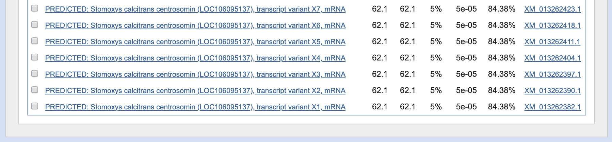

Class 2: Sequence Alignments
================
Yi Fu
4/4/2019

We are going to use these websites:

> [bio3d dotplot](http://bio3d.ucsd.edu/dotplot/) or its
> [mirror](https://bioboot.shinyapps.io/dotplot/)

> [BLAST](https://blast.ncbi.nlm.nih.gov/Blast.cgi)

## 1\. Dot Plot

### 1A. bio3d

Here is explanation about dot plot approach from our [lecture
slides](https://bioboot.github.io/bimm143_S19/class-material/lecture2-BIMM143-large.pdf).

[Here](https://bioboot.shinyapps.io/dotplot/) is the link to try out
different dot plots. It looks like the following.

### 1B. YASS

Let’s use online [YASS](http://bioinfo.lifl.fr/yass/yass.php) tool to
generate dot plot between mRNA sequences for α and β globin.

> \>gi|14456711|ref|NM\_000558.3| Homo sapiens hemoglobin, alpha 1
> (HBA1)
> ACTCTTCTGGTCCCCACAGACTCAGAGAGAACCCACCATGGTGCTGTCTCCTGCCGACAAGACCAACGTC  
> AAGGCCGCCTGGGGTAAGGTCGGCGCGCACGCTGGCGAGTATGGTGCGGAGGCCCTGGAGAGGATGTTCC  
> TGTCCTTCCCCACCACCAAGACCTACTTCCCGCACTTCGACCTGAGCCACGGCTCTGCCCAGGTTAAGGG  
> CCACGGCAAGAAGGTGGCCGACGCGCTGACCAACGCCGTGGCGCACGTGGACGACATGCCCAACGCGCTG  
> TCCGCCCTGAGCGACCTGCACGCGCACAAGCTTCGGGTGGACCCGGTCAACTTCAAGCTCCTAAGCCACT  
> GCCTGCTGGTGACCCTGGCCGCCCACCTCCCCGCCGAGTTCACCCCTGCGGTGCACGCCTCCCTGGACAA  
> GTTCCTGGCTTCTGTGAGCACCGTGCTGACCTCCAAATACCGTTAAGCTGGAGCCTCGGTGGCCATGCTT  
> CTTGCCCCTTGGGCCTCCCCCCAGCCCCTCCTCCCCTTCCTGCACCCGTACCCCCGTGGTCTTTGAATAA  
> AGTCTGAGTGGGCGGC

> \>gi|28302128|ref|NM\_000518.4| Homo sapiens hemoglobin, beta
> (HBB)  
> ACATTTGCTTCTGACACAACTGTGTTCACTAGCAACCTCAAACAGACACCATGGTGCATCTGACTCCTGA  
> GGAGAAGTCTGCCGTTACTGCCCTGTGGGGCAAGGTGAACGTGGATGAAGTTGGTGGTGAGGCCCTGGGC  
> AGGCTGCTGGTGGTCTACCCTTGGACCCAGAGGTTCTTTGAGTCCTTTGGGGATCTGTCCACTCCTGATG  
> CTGTTATGGGCAACCCTAAGGTGAAGGCTCATGGCAAGAAAGTGCTCGGTGCCTTTAGTGATGGCCTGGC  
> TCACCTGGACAACCTCAAGGGCACCTTTGCCACACTGAGTGAGCTGCACTGTGACAAGCTGCACGTGGAT  
> CCTGAGAACTTCAGGCTCCTGGGCAACGTGCTGGTCTGTGTGCTGGCCCATCACTTTGGCAAAGAATTCA  
> CCCCACCAGTGCAGGCTGCCTATCAGAAAGTGGTGGCTGGTGTGGCTAATGCCCTGGCCCACAAGTATCA  
> CTAAGCTCGCTTTCTTGCTGTCCAATTTCTATTAAAGGTTCCTTTGTTCCCTAAGTCCAACTACTAAACT  
> GGGGGATATTATGAAGGGCCTTGAGCATCTGGATTCTGCCTAATAAAAAACATTTATTTTCATTGC

Here is the input.

Here is the by selecting **simple dotplot**.

## 2\. Needleman-Wunsch Alignment

Needleman-Wunsch Alignment is a global alignment technique.

Here is explanation about scoring matrix for Needleman-Wunsch Alignment
from our [lecture
slides](https://bioboot.github.io/bimm143_S19/class-material/lecture2-BIMM143-large.pdf).

Let’s try an example.

## 3\. More on BLAST

Smith & Waterman Alignment is a local alignment technique and used in
[BLAST](https://blast.ncbi.nlm.nih.gov/Blast.cgi) heuristic approach.

### 3A. BLASTp (protein \> protein)

Use Protein [BLAST](https://blast.ncbi.nlm.nih.gov/Blast.cgi) and search
against the **Nucleotide collection (NR database)** in **human
(taxid:9606)**.

> \>fly\_protein  
> MDNHSSVPWASAASVTCLSLDAKCHSSSSSSSSKSAASSISAIPQEETQTMRHIAHTQRCLSRLTSLVAL  
> LLIVLPMVFSPAHSCGPGRGLGRHRARNLYPLVLKQTIPNLSEYTNSASGPLEGVIRRDSPKFKDLVPNY  
> NRDILFRDEEGTGADRLMSKRCKEKLNVLAYSVMNEWPGIRLLVTESWDEDYHHGQESLHYEGRAVTIAT  
> SDRDQSKYGMLARLAVEAGFDWVSYVSRRHIYCSVKSDSSISSHVHGCFTPESTALLESGVRKPLGELSI  
> GDRVLSMTANGQAVYSEVILFMDRNLEQMQNFVQLHTDGGAVLTVTPAHLVSVWQPESQKLTFVFADRIE  
> EKNQVLVRDVETGELRPQRVVKVGSVRSKGVVAPLTREGTIVVNSVAASCYAVINSQSLAHWGLAPMRLL  
> STLEAWLPAKEQLHSSPKVVSSAQQQNGIHWYANALYKVKDYVLPQSWRHD

Here is the input.

Here are the BLASTp top 10 results for **Nucleotide collection (NR
database)** in **human (taxid:9606)**.

It looks like percentage of identity is not satisfying. Let’s try again
with different input parameters. So, search the sequence against the
**refseq\_protein** only.

Here are the BLASTp top 10 results for **refseq\_protein**. All of them
are from *Drosophila* genus.

Now let’s search the sequence against the **refseq\_protein** in **human
(taxid:9606)**.

Here are all the BLASTp results for **refseq\_protein** in **human
(taxid:9606)**.

Let’s find out what is the function of the first hit, by clicking the
**Gene** link, and pick the first one.

Then, we can take a look at **Gene Ontology** section, or moreover
**Phenotype** section. These will contain information of the gene
functions.

Here are what they look like.

### 3B. BLASTn (nucleutide \> nucleotide)

Use Nucleutide [BLAST](https://blast.ncbi.nlm.nih.gov/Blast.cgi) and
search against the **Nucleotide collection (NR database)** in **human
(taxid:9606)**.

> \>fly\_mRNA  
> AGAAGCTCAACCAGGAGAACGAACAGTCGGCAAACAAGGAGAACGACTGCGCTAAGACGGTAATTTCGCCATCCTCC  
> AGCGGCCGTTCCATGAGTGACAACGAGGCCAGCTCCCAGGAAATGTCCACCAACCTCAGGGTGCGCTACGAACTAAA  
> GATCAACGAGCAGGAGGAGAAGATCAAGCAGTTGCAGACGGAAGTAAAGAAGAAGACGGCGAATCTGCAAAATCTGG  
> TCAACAAGGAGCTATGGGAGAAAAATCGTGAGGTGGAGCGCCTCACTAAGCTGCTGGCTAACCAACAGAAGACGTTG  
> CCACAGATAAGTGAGGAATCCGCCGGAGAAGCAGATCTGCAGCAATCCTTCACGGAGGCGGAGTACATGAGGGCATT  
> GGAGCGAAACAAGCTGCTGCAGCGAAAGGTGGATGTGCTCTTCCAGCGCCTGGCAGACGATCAACAGAACAGCGCTG  
> TGATTGGGCAGTTGCGTTTGGAACTTCAACAAGCTCGCACGGAAGTCGAGACGGCGGATAAGTGGCGTCTTGAATGC  
> GTCGATGTCTGCAGTGTGCTGACAAACCGATTGGAAGAGCTGGCTGGTTTCCTCAACTCTCTGCTGAAGCACAAAGA  
> TGTTCTTGGCGTGTTGGCCGCTGATCGACGCAATGCCATGCGTAAGGCGGTGGATCGCAGCTTGGATCTTTCCAAGA  
> GTCTTAATATGACTCTGAATATAACAGCTACATCCTTGGCTGATCAAAGCCTCGCTCAGCTGTGCAATCTATCCGAG  
> ATCTTGTACACCGAAGGTGATGCAAGCCACAAAACTTTCAATTCCCACGAAGAGCTGCACGCCGCTACTTCGATGGC  
> TCCGACTGTAGAGAACTTAAAGGCCGAGAATAAGGCTCTTAAAAAGGAGTTGGAAAAGCGACGCAGCTCAGAAGGAC  
> AGAGGAAAGAGCGCCGCTCCTTACCGCTGCCCTCCCAGCAGTTCGATAACCAGAGCGAGTCAGAGGCCTGGTCAGAG  
> CCTGACCGCAAGGTTTCCTTGGCACGCATTGGCCTGGACGAAACCTCCAACAGTTTGGCAGCGCCTGAGCAGGCGAT  
> CAGCGAGTCGGAGAGCGAGGGA

Here is the input.

Here are the last few results. They are not from *Drosophila* genus, but
are *Stomoxys calcitrans*.

### 3C. BLASTx (translated nucleutide \> protein)

Use [BLASTx](https://blast.ncbi.nlm.nih.gov/Blast.cgi) and search
against the **Nucleotide collection (NR database)** only.

Here is the input.

Here are the BLASTx top 10 results for **Nucleotide collection (NR
database)**.

### 3D. BLAST optional parameters

Now, Let’s play with optional parameters, by setting the E-value
threshold to be 100 and search in **human (taxid:9606)**.

> The BLAST programs report
> [E-value](https://www.ncbi.nlm.nih.gov/blast/tutorial/Altschul-1.html)
> rather than P-values because it is easier to understand the difference
> between, for example, E-value of 5 and 10 than P-values of 0.993 and
> 0.99995. when E \< 0.01, P-values and E-value are nearly identical.

Here is the input.

Here are the BLASTx top 10 results for **Nucleotide collection (NR
database)** in **human (taxid:9606)**.

