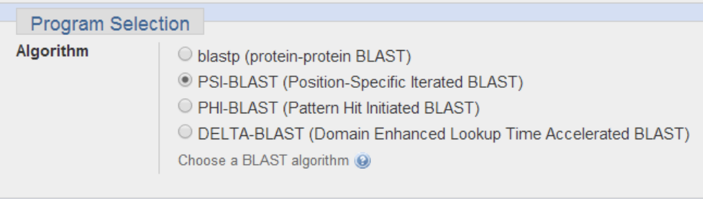
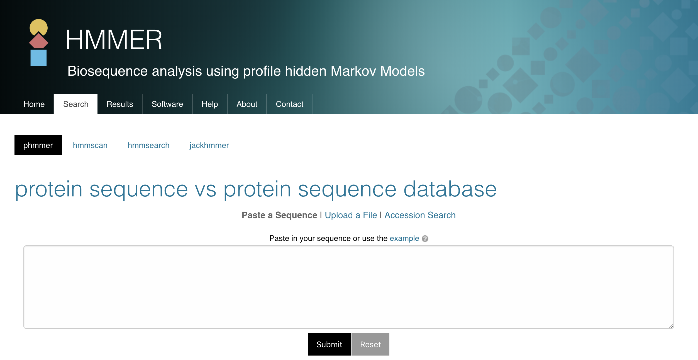

Class 3: Advanced sequence alignment and database searching
================
Yi Fu
4/9/2019

## 1\. PSI-BLAST

There is limit to use BLAST for remote homologue detection.

If two proteins have more than 45% identical residues in their optimal
alignment they typically have very similar structures and are likely to
have a similar function. If two proteins have more than 25% identical
residues (but less than 45% identity), they are likely to have a similar
general folding pattern.

Observations of a lower degree of sequence similarity cannot however
rule out homology. [Russ
Doolittle](http://biology.ucsd.edu/research/faculty/rdoolittle) defined
the region between 18-25% sequence identity as the “twilight zone” in
which the suggestion of homology is tantalizing but dangerous. Below the
twilight zone is a region where pairwise sequence alignments tell us
very little - sometimes called the “midnight zone”.

Although the twilight zone is a treacherous region, we are not entirely
helpless. In deciding whether there is a genuine relationship, we use
PSI-Blast.

## 2\. HMMER

[HMMER](http://www.ebi.ac.uk/Tools/hmmer/search/phmmer) is an
alternative sequence search and alignment method that employees
probabilistic models called profile hidden Markov models (HMMs). HMMER
aims to be significantly more accurate and more able to detect remote
homologs than BLAST because of the strength of its underlying
mathematical models. In the past, this strength came at significant
computational expense, but in the new HMMER3 project, HMMER is now
essentially as fast as BLAST.

