Class 5: Data exploration and visualization in R
================
Yi Fu
4/16/2019

## 1\. Simple plots

### 1A. Line plot

The file **weight\_chart.txt** contains data for a growth chart for a
typical baby over the first 9 months of its life.

``` r
data = read.table("data/weight_chart.txt", header=T)
```

Here is the plot:

``` r
plot(data$Age, data$Weight,
     xlab="Age (months)", ylab="Weight (kg)", ylim=c(2,10),
     pch=15, cex=1.5, lwd=2, type="o",
     main="Baby Weight with Age")
```

<!-- -->

### 1B. Boxplot

The file **feature\_counts.txt** contains a summary of the number of
features of different types in the mouse GRCm38 genome.

``` r
data = read.table("data/feature_counts.txt", header=T, sep="\t")
```

Here is the plot:

``` r
## The margins should be adjusted to accommodate the labels
## (below, left, above, right)
par(mar=c(c(3.1, 11.1, 4.1, 2)))

barplot(data$Count, names.arg=data$Feature,
        xlim=c(0,80000),
        las=1, horiz=T,
        main="Number of features in the mouse GRCm38 genome")
```

<!-- -->

### 1C. Histogram

The *x* variable takes the distribution of 10000 points sampled from a
standard normal distribution along with another 10000 points sampled
from the same distribution but with an offset of 4.

``` r
set.seed(1)
data = c(rnorm(10000), rnorm(10000)+4)
```

Here is the plot:

``` r
hist(data, breaks=80)
```

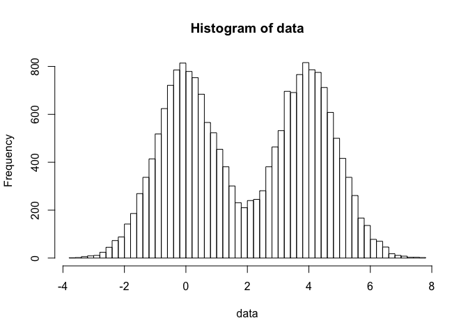<!-- -->

## 2\. Plots with Color

### 2A. Specifying Color Vector

The file **male\_female\_counts.txt** contains a time series split into
male and female count values.

``` r
data = read.table("data/male_female_counts.txt", header=T, sep="\t")
```

Here is the plot for rainbow color:

``` r
barplot(data$Count, names.arg=data$Sample,
        las=2,
        col=rainbow(nrow(data)))
```

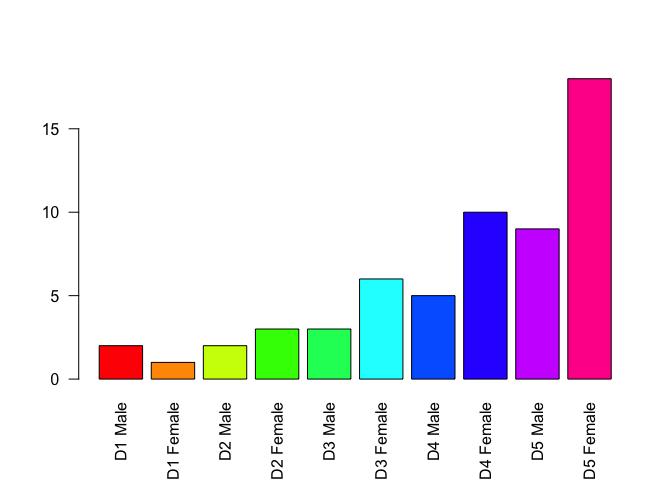<!-- -->

Here is the plot for alternating red and blue:

``` r
barplot(data$Count, names.arg=data$Sample,
        las=2,
        col=c("red","blue"))
```

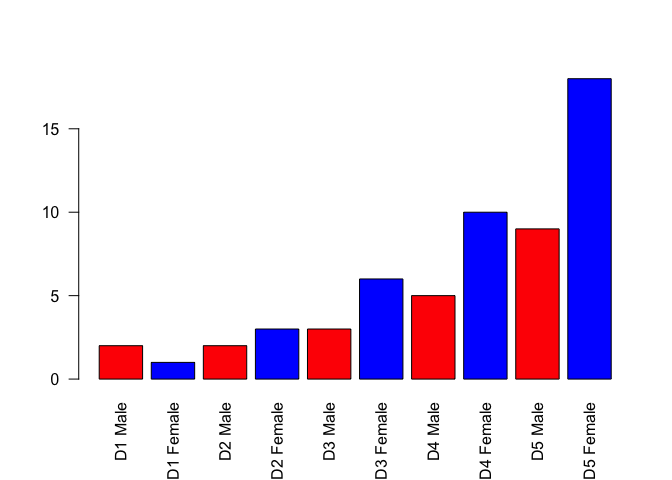<!-- -->

### 2B. Coloring by value

The file **up\_down\_expression.txt** contains an expression comparison
dataset, and an extra column which classifies the rows into one of 3
groups (up, down or unchanging).

``` r
data = read.table("data/up_down_expression.txt", header=T, sep="\t")
table(data$State)
```

    ## 
    ##       down unchanging         up 
    ##         72       4997        127

Here is the plot by classification of up/down regulated expression:

``` r
plot(data$Condition1, data$Condition2,
     xlab="Expression condition 1", ylab="Expression condition 2",
     col=data$State)
```

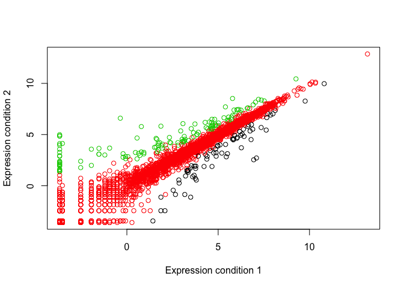<!-- -->

Here is the plot by specifying the color for each classification:

``` r
palette(c("blue","gray","red"))
plot(data$Condition1, data$Condition2,
     xlab="Expression condition 1", ylab="Expression condition 2",
     col=data$State)
```

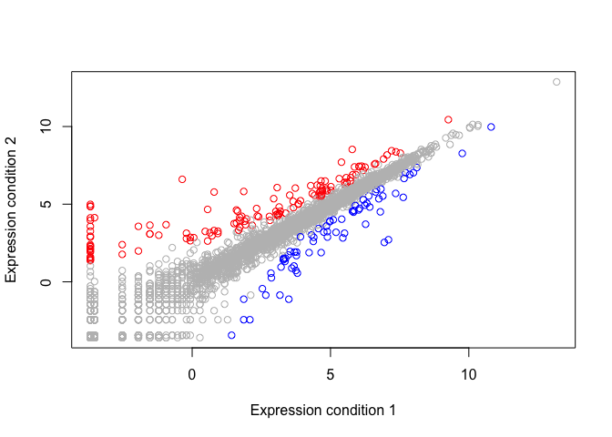<!-- -->

### 2C. Dynamic use of color

The file **expression\_methylation.txt** contains data for gene body
methylation, promoter methylation and gene expression.

``` r
data = read.table("data/expression_methylation.txt", header=T, sep="\t")
```

Here is the plot (expresion vs gene regulation):

``` r
plot(data$gene.meth, data$expression)
```

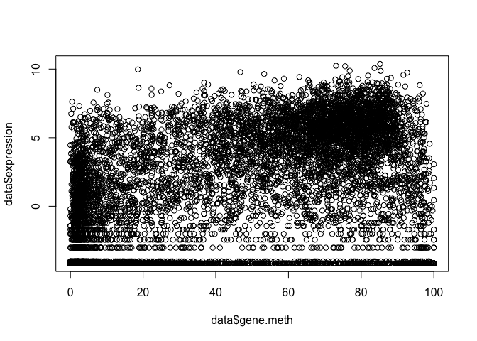<!-- -->

**One common use of dynamic color is to color a scatterplot by the
number of points overlaid in a particular area so that you can get a
better impression for where the majority of points fall.**

Here is the plot (expresion vs gene regulation) with density and points
of solid circles:

``` r
dcols = densCols(data$gene.meth, data$expression)

plot(data$gene.meth, data$expression,
     col=dcols, pch=20)
```

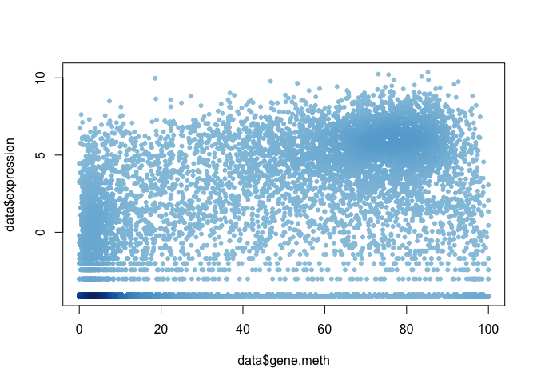<!-- -->

**It looks like most of the data is clustered near the origin. Let’s
restrict ourselves to the genes that have more than zero expresion
values.**

``` r
inds = data$expression > 0
dcols = densCols(data$gene.meth[inds], data$expression[inds])

plot(data$gene.meth[inds], data$expression[inds],
     col=dcols, pch=20)
```

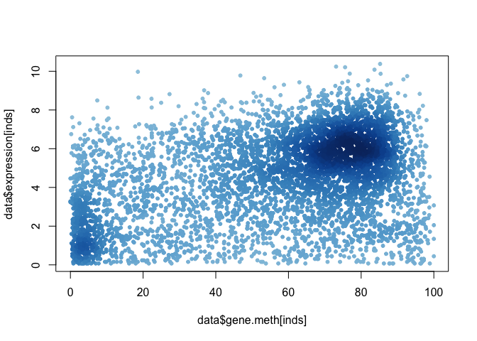<!-- -->

Here is the plot (expresion vs gene regulation) with density, points of
solid circles and customized colors:

``` r
dcols = densCols(data$gene.meth[inds], data$expression[inds],
                 colramp=colorRampPalette(c("blue2", "green2", "red2", "yellow")))

plot(data$gene.meth[inds], data$expression[inds],
     col=dcols, pch=20)
```

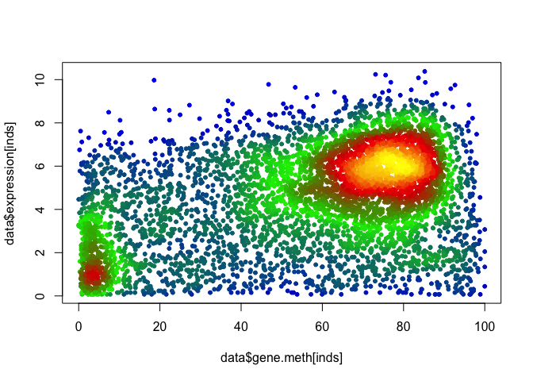<!-- -->

### 2D. Mapping colors

The file, again, **expression\_methylation.txt** contains data for gene
body methylation, promoter methylation and gene expression.

``` r
data = read.table("data/expression_methylation.txt", header=T, sep="\t")
```

Here is the plot (promoter regulation vs gene regulation):

``` r
plot(data$promoter.meth, data$gene.meth)
```

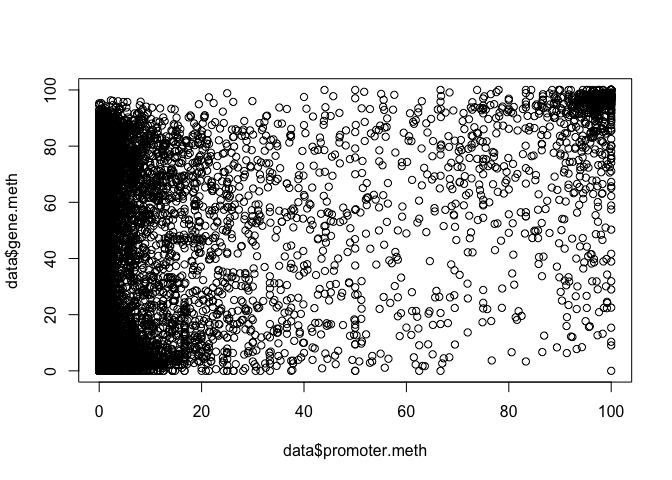<!-- -->

Here is the plot (promoter regulation vs gene regulation) after adding
color based on expression level:

``` r
source("data/color_to_value_map.r")

mycols=map.colors(data$expression,
                  c(max(data$expression), min(data$expression)), 
                  colorRampPalette(c("blue","red"))(100))

plot(data$promoter.meth, data$gene.meth, 
     xlab="Promoter Methylation", ylab="Gene Methylation",
     col=mycols)
```

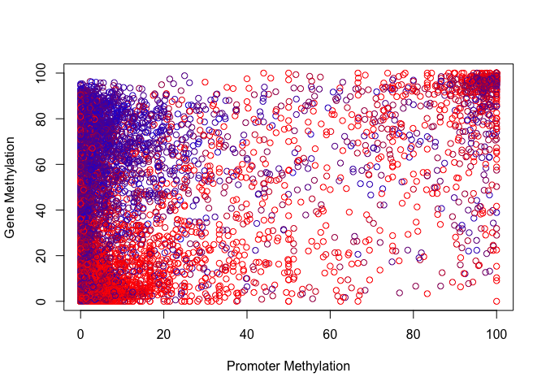<!-- -->

## 3\. Exercises

#### Plot Exercise

``` r
plot(1:10,typ="l",col="blue")
```

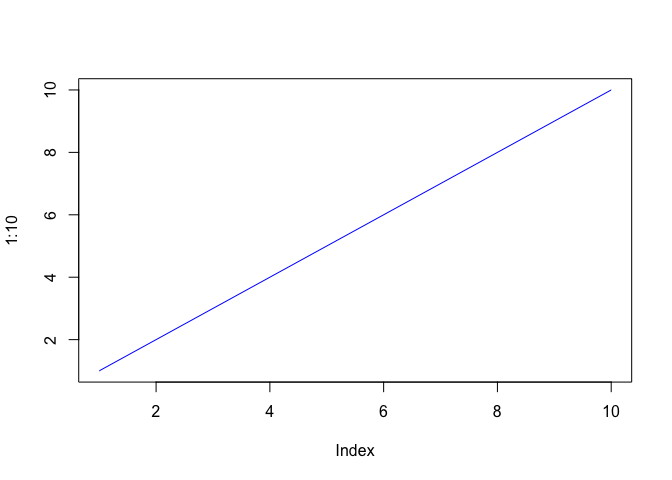<!-- -->

#### Read files Exercises

``` r
read.table("data/test1.txt", header=T, sep=",")
```

    ##   Col1 Col2 Col3
    ## 1    1    2    3
    ## 2    4    5    6
    ## 3    7    8    9
    ## 4    a    b    c

``` r
read.table("data/test2.txt", header=T, sep="$")
```

    ##   Col1 Col2 Col3
    ## 1    1    2    3
    ## 2    4    5    6
    ## 3    7    8    9
    ## 4    a    b    c

``` r
read.table("https://bioboot.github.io/bimm143_S19/class-material/test3.txt")
```

    ##   V1 V2 V3
    ## 1  1  6  a
    ## 2  2  7  b
    ## 3  3  8  c
    ## 4  4  9  d
    ## 5  5 10  e
