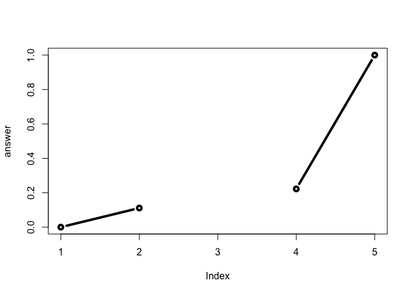

Class 6: Writing and calling first R functions
================
Yi Fu
4/18/2019

Note: the [original](https://tinyurl.com/rescale-R) *rescale* functions

## 1\. *add* function

Add two “vectors”.

``` r
add <- function ( x, y = 1 ) {
  # Sum the inputs x and y
  x + y
}
```

Examples:

``` r
add(10)             # 11
```

    ## [1] 11

``` r
add(10, 10)         # 20
```

    ## [1] 20

``` r
add(c(1, 2, 3), 4)  # 5 6 7
```

    ## [1] 5 6 7

``` r
#add(1, 2, 2)       # error
#add(1, "b")        # error
```

## 2\. *rescale* function

### Version 1:

Rescale so that the smallest element is 0, and the largest element is 1.

``` r
rescale1 <- function (x) {
  rng = range(x)
  (x - rng[1]) / (rng[2] - rng[1])
}
```

Example:

``` r
rescale1(1:10)
```

    ##  [1] 0.0000000 0.1111111 0.2222222 0.3333333 0.4444444 0.5555556 0.6666667
    ##  [8] 0.7777778 0.8888889 1.0000000

### Version 2:

Version 1 + (default to) remove the NA values.

``` r
rescale2 <- function (x, na.rm = T) {
  rng = range(x, na.rm = na.rm)
  (x - rng[1]) / (rng[2] - rng[1])
}
```

Examples:

``` r
rescale2(c(1, 2, NA, 3, 10))
```

    ## [1] 0.0000000 0.1111111        NA 0.2222222 1.0000000

``` r
rescale2(c(1, 2, NA, 3, 10), na.rm=F)
```

    ## [1] NA NA NA NA NA

### Version 3:

Version 2 + print messages + (default to) plot.

``` r
rescale3 <- function (x, na.rm = T, plot = T) {
  
  if (! is.numeric(x)) {
    print ("You need to give only numbers please")
  }
  else {
    rng = range(x, na.rm = na.rm)
    answer = (x - rng[1]) / (rng[2] - rng[1])
  
    if (plot) {
      plot(answer, typ = "b", lwd = 4)
    }
    else {
    }
    return(answer)
  }
}
```

Examples:

``` r
rescale3(c(1, 10, "string"))
```

    ## [1] "You need to give only numbers please"

``` r
rescale3(c(1, 2, NA, 3, 10), plot=F)
```

    ## [1] 0.0000000 0.1111111        NA 0.2222222 1.0000000

``` r
rescale3(c(1, 2, NA, 3, 10))
```

<!-- -->

    ## [1] 0.0000000 0.1111111        NA 0.2222222 1.0000000
