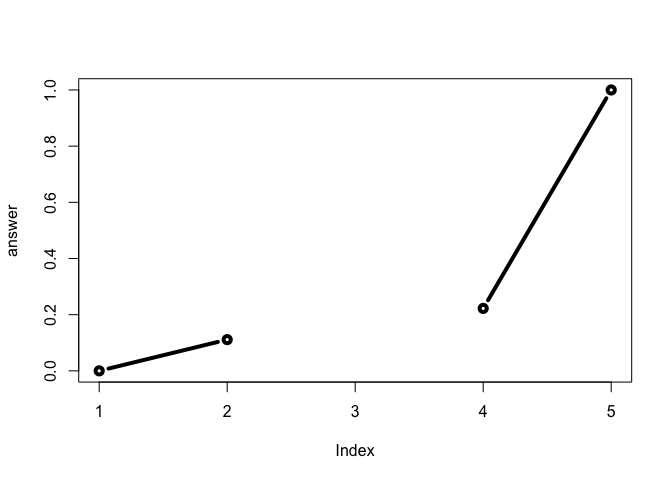

Class 6: R functions
================
Yi Fu
4/18/2019

About
-----

This is my **class 6** R markdown document with my *codes* and notes for the day.

``` r
plot(1:10,typ="l",col="blue")
```

 \#\# Read files Exercises

``` r
read.table("test1.txt", header=T, sep=",")
```

    ##   Col1 Col2 Col3
    ## 1    1    2    3
    ## 2    4    5    6
    ## 3    7    8    9
    ## 4    a    b    c

``` r
read.table("test2.txt", header=T, sep="$")
```

    ##   Col1 Col2 Col3
    ## 1    1    2    3
    ## 2    4    5    6
    ## 3    7    8    9
    ## 4    a    b    c

``` r
read.table("https://bioboot.github.io/bimm143_S19/class-material/test3.txt")
```

    ##   V1 V2 V3
    ## 1  1  6  a
    ## 2  2  7  b
    ## 3  3  8  c
    ## 4  4  9  d
    ## 5  5 10  e

Function
--------

``` r
add <- function ( x, y = 1 ) {
  # Sum the inputs x and y
  x + y
}
```

``` r
add (10)
```

    ## [1] 11

``` r
add (10, 10)
```

    ## [1] 20

``` r
add (c(1, 2, 3), 4)
```

    ## [1] 5 6 7

``` r
#add (1, 2, 2)
```

``` r
#add (x = 1, y = "b")
```

``` r
rescale <- function (x) {
  rng = range (x)
  (x - rng[1]) / (rng[2] - rng[1])
}
```

``` r
rescale (1:10)
```

    ##  [1] 0.0000000 0.1111111 0.2222222 0.3333333 0.4444444 0.5555556 0.6666667
    ##  [8] 0.7777778 0.8888889 1.0000000

``` r
rescale2 <- function (x, na.rm = T) {
  rng = range (x, na.rm = na.rm)
  (x - rng[1]) / (rng[2] - rng[1])
}
```

``` r
rescale2 (c (1, 2, NA, 3, 10))
```

    ## [1] 0.0000000 0.1111111        NA 0.2222222 1.0000000

``` r
rescale2 (c (1, 2, NA, 3, 10), na.rm = F)
```

    ## [1] NA NA NA NA NA

``` r
rescale3 <- function (x, na.rm = T, plot = F) {
  
  if (! is.numeric(x)) {
    stop ("You need to give only numbers please")
  }
  
  rng = range (x, na.rm = na.rm)
  print ("Hello")
  
  answer = (x - rng[1]) / (rng[2] - rng[1])
  
  print ("is it me you are looking for?")
  
  if (plot) {
    plot (answer, typ = "b", lwd = 4)
    print ("Please don't sing again ...")
  }
  else {
    print ("I can see it in ...")
  }
  return (answer)
}
```

``` r
# 11  rescale3 (c (1, 10, "string"))
```

``` r
rescale3 (c (1, 2, NA, 3, 10))
```

    ## [1] "Hello"
    ## [1] "is it me you are looking for?"
    ## [1] "I can see it in ..."

    ## [1] 0.0000000 0.1111111        NA 0.2222222 1.0000000

``` r
rescale3 (c (1, 2, NA, 3, 10), plot = T)
```

    ## [1] "Hello"
    ## [1] "is it me you are looking for?"



    ## [1] "Please don't sing again ..."

    ## [1] 0.0000000 0.1111111        NA 0.2222222 1.0000000
