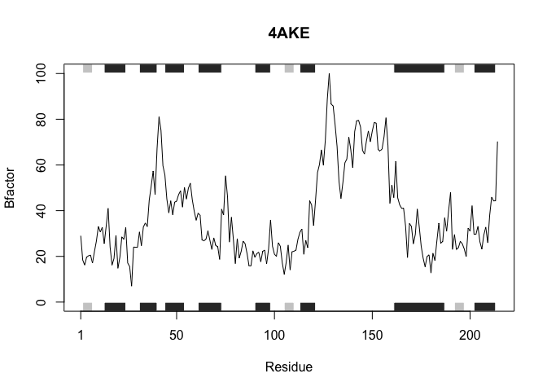

Homework for Class 6
================
Yi Fu
Due on 4/25/2019

## Q6. How would you generalize the original code above to work with any set of input protein structures?

First, let’s check if “bio3d” package is installed. And then, load the
package.

``` r
library(bio3d)
```

### Question: Can you improve this analysis code?

Run through the code to see if it works, fix any copy/paste errors
before simplifying to a core working code snippet, reducing any
calculation duplication. And then, find a way to improve the code by
writing a new function.

``` r
s1 = read.pdb("4AKE") # kinase with drug
s2 = read.pdb("1AKE") # kinase no drug
s3 = read.pdb("1E4Y") # kinase with drug

s1.chainA = trim.pdb(s1, chain="A", elety="CA")
s2.chainA = trim.pdb(s2, chain="A", elety="CA")
s3.chainA = trim.pdb(s3, chain="A", elety="CA")  ### changed the typo "s1" to "s3"

s1.b = s1.chainA$atom$b
s2.b = s2.chainA$atom$b
s3.b = s3.chainA$atom$b

plotb3(s1.b, sse=s1.chainA, typ="l", ylab="Bfactor")
plotb3(s2.b, sse=s2.chainA, typ="l", ylab="Bfactor")
plotb3(s3.b, sse=s3.chainA, typ="l", ylab="Bfactor")
```

### Answer: code for the analysis of protein drug interactions by abstracting the main activities in one more useful function call.

``` r
# The function takes a vector of pdbid's and output the plot of factor of corresponding chain and atoms. 
# The pdbid is required parameter. 
# Usage: 
## plotPDB (pdbid, ...)
# Parameters:
## pdbid: a vector of 4-character identifiers of entries in the PDB
## chain: which chain to look at (chain A is default)
## elety: which atom names to look at (C-alpha is default)
plotPDB <- function (pdbid, chain="A", elety="CA") {

  # examine each id one by one
  for (protein in pdbid) {
    
    # access on-line PDB file and get the PDB structure object
    s <- read.pdb(protein)
    
    # get a subset of the PDB structure object, given chain and elety
    s.chain <- trim.pdb(s, chain=chain, elety=elety)
    
    # get bfactor: the displacement of the atomic positions from an average (mean) value.
    s.b <- s.chain$atom$b
    
    # outputs a plot: Bfactor vs Residue
    plotb3(s.b, sse=s.chain, typ="l", ylab="Bfactor", main=protein)
  }
}
```

Let’s call the function to check the function we just created is
working. This function calling plots for three protein including “4AKE”,
“1AKE”, “1E4Y”.

``` r
plotPDB(c("4AKE", "1AKE", "1E4Y"))
```

    ##   Note: Accessing on-line PDB file

<!-- -->

    ##   Note: Accessing on-line PDB file
    ##    PDB has ALT records, taking A only, rm.alt=TRUE

<!-- -->

    ##   Note: Accessing on-line PDB file

<!-- -->
