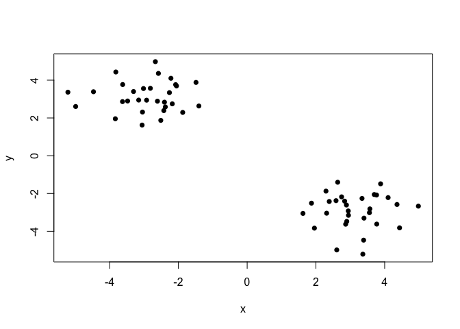
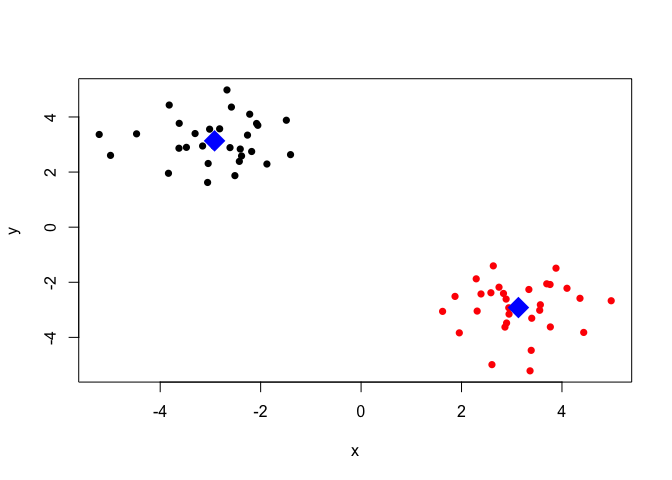
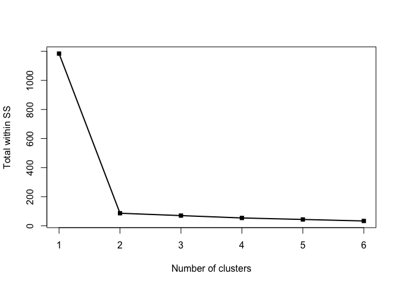
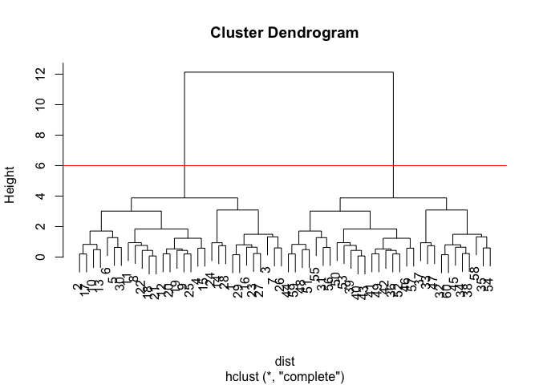
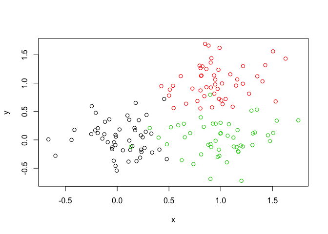
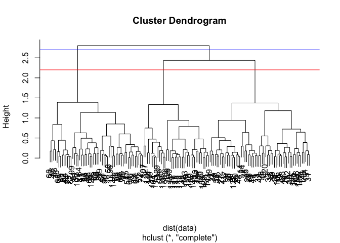
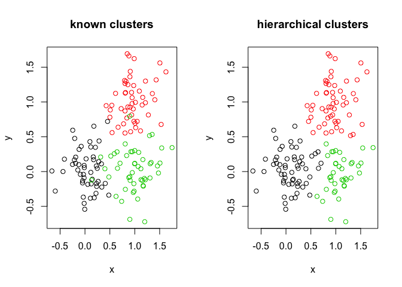
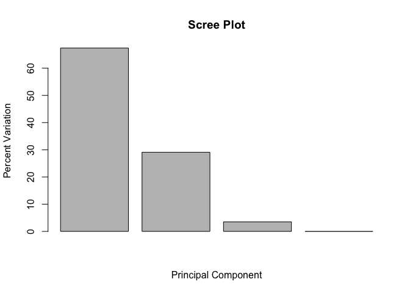
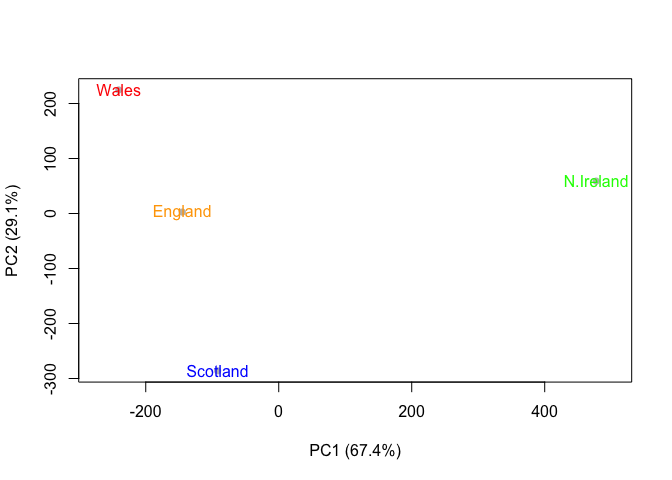
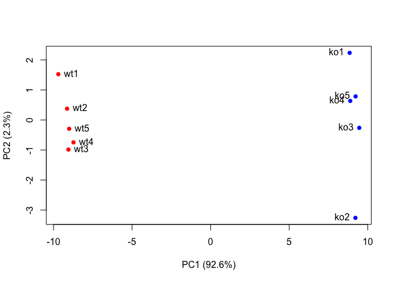

Class 8: Introduction to machine learning
================
Yi Fu
4/25/2019

## 1\. K-means clustering

The *data* is generated by normal distributions, as shown in the plot.

``` r
set.seed(1)
tmp = c(rnorm(30,-3), rnorm(30,3))
data = cbind(x=tmp, y=rev(tmp))
plot(data, pch=16)
```

<!-- -->

Let’s use the *kmeans()* function.

``` r
two_means = kmeans(data, centers=2, nstart=20)
two_means
```

    ## K-means clustering with 2 clusters of sizes 30, 30
    ## 
    ## Cluster means:
    ##           x         y
    ## 1 -2.917542  3.132775
    ## 2  3.132775 -2.917542
    ## 
    ## Clustering vector:
    ##  [1] 1 1 1 1 1 1 1 1 1 1 1 1 1 1 1 1 1 1 1 1 1 1 1 1 1 1 1 1 1 1 2 2 2 2 2
    ## [36] 2 2 2 2 2 2 2 2 2 2 2 2 2 2 2 2 2 2 2 2 2 2 2 2 2
    ## 
    ## Within cluster sum of squares by cluster:
    ## [1] 43.10954 43.10954
    ##  (between_SS / total_SS =  92.7 %)
    ## 
    ## Available components:
    ## 
    ## [1] "cluster"      "centers"      "totss"        "withinss"    
    ## [5] "tot.withinss" "betweenss"    "size"         "iter"        
    ## [9] "ifault"

Here is the plot colored by the kmeans cluster assignment and add
cluster centers as blue points.

``` r
plot(data, col=two_means$cluster, pch=16)
points(two_means$centers, col="blue", pch=18, cex=3)
```

<!-- -->

Here shows the elbow method to determining number of clusters (there is
a large reduction in SS with k=2):

``` r
tot.withinss = c(kmeans(data, centers=1, nstart=20)$tot.withinss,
                 kmeans(data, centers=2, nstart=20)$tot.withinss,
                 kmeans(data, centers=3, nstart=20)$tot.withinss,
                 kmeans(data, centers=4, nstart=20)$tot.withinss,
                 kmeans(data, centers=5, nstart=20)$tot.withinss,
                 kmeans(data, centers=6, nstart=20)$tot.withinss)
plot(seq(1,6),tot.withinss,
     xlab="Number of clusters", ylab="Total within SS", 
     pch=15, lwd=2, type="o")
```

<!-- -->

## 2\. Hierarchical Clustering

### 2A. First Example

The *data*, again, is generated by normal distributions, as shown in the
plot. Note that we need a distance matrix not the raw data as input.

``` r
set.seed(1)
tmp = c(rnorm(30,-3), rnorm(30,3))
data = cbind(x=tmp, y=rev(tmp))
dist = dist(data)
```

Let’s use the *hclust()* function. There are three ways of performing
hierarchical clustering in R: “complete”, “single”, and “average”. See
more [here](https://uc-r.github.io/hc_clustering). We will mainly focus
on “complete” method.

``` r
hc.complete = hclust(dist, method="complete")
hc.single = hclust(dist, method="single")
hc.average = hclust(dist, method="average")
```

Here is the plot:

``` r
plot(hc.complete)
abline(h=6, col="red")
```

<!-- -->

Let’s see which cluster is each point in:

``` r
## at height 6
cutree(hc.complete, h=6)
```

    ##  [1] 1 1 1 1 1 1 1 1 1 1 1 1 1 1 1 1 1 1 1 1 1 1 1 1 1 1 1 1 1 1 2 2 2 2 2
    ## [36] 2 2 2 2 2 2 2 2 2 2 2 2 2 2 2 2 2 2 2 2 2 2 2 2 2

``` r
## divide into 3 groups
cutree(hc.complete, k=3)
```

    ##  [1] 1 1 1 1 1 1 1 1 1 1 1 1 1 1 1 1 1 1 1 1 1 1 1 1 1 1 1 1 1 1 2 3 3 3 3
    ## [36] 2 3 3 2 2 2 2 2 2 3 2 3 2 2 2 2 2 2 3 2 2 2 3 2 3

### 2B. Another example with overlapping data

The *data* is generated by normal distributions, as shown in the plot.
It is clear that the data is generated so that there are three known
clusters

``` r
set.seed(1)
data = rbind(matrix(rnorm(100, mean=0, sd=0.3), ncol=2),
              matrix(rnorm(100, mean=1, sd=0.3), ncol=2),
              matrix(c(rnorm(50, mean=1, sd=0.3), rnorm(50, mean=0, sd=0.3)), ncol = 2))
colnames(data) = c("x", "y")
col = as.factor( rep(c("c1","c2","c3"), each=50) )
plot(data, col=col)
```

<!-- -->

Let’s use the *hclust()* function.

``` r
hc = hclust(dist(data))
```

Here is the plot:

``` r
plot(hc)
abline(h=2.2,col="red")
abline(h=2.7,col="blue")
```

<!-- -->

Let’s compare the known clusters with hierarchically generated clusters.

``` r
gp3 = cutree(hc, k=3)
par(mfrow=c(1,2))
plot(data, col=col, main="known clusters")
plot(data, col=gp3, main="hierarchical clusters")
```

<!-- -->

Let see how are 2-cluster and 3-cluster different:

``` r
gp2 = cutree(hc, k=2)
gp3 = cutree(hc, k=3)
table(gp2,gp3)
```

    ##    gp3
    ## gp2  1  2  3
    ##   1 58  0 38
    ##   2  0 54  0

## 3\. Principal Component Analysis

### 3A. First example

The **UK\_foods.csv** contains the consumption in grams (per person, per
week) of 17 different types of food-stuff measured and averaged in the 4
countries of the United Kingdom in 1997.

``` r
data = read.csv("data/UK_foods.csv",row.names=1)
```

It is hard to interpret major differences and trends from the following
barplots and pairwise plots.

``` r
barplot(as.matrix(data), beside=TRUE, col=rainbow(nrow(data)))
```

<!-- -->

``` r
barplot(as.matrix(data), beside=FALSE, col=rainbow(nrow(data)))
```

<!-- -->

``` r
pairs(data, col=rainbow(10), pch=16)
```

<!-- -->

Let’s use the *prcomp()* function.

``` r
pca = prcomp(t(data))
summary(pca)
```

    ## Importance of components:
    ##                             PC1      PC2      PC3       PC4
    ## Standard deviation     324.1502 212.7478 73.87622 4.189e-14
    ## Proportion of Variance   0.6744   0.2905  0.03503 0.000e+00
    ## Cumulative Proportion    0.6744   0.9650  1.00000 1.000e+00

Here is the plot for the percentage of variance captured by each PC:

``` r
pca.var = pca$sdev^2
pca.var.per = round(pca.var/sum(pca.var)*100, 1)
barplot(pca.var.per, xlab="Principal Component", ylab="Percent Variation", main="Scree Plot")
```

<!-- -->

Here is the plot:

``` r
plot(pca$x[,1], pca$x[,2],
     xlab=paste0("PC1 (", pca.var.per[1], "%)"), ylab=paste0("PC2 (", pca.var.per[2], "%)"), xlim=c(-270,500), 
     col="grey", pch=16)
text(pca$x[,1], pca$x[,2], colnames(data), col=c("orange", "red", "blue", "green"))
```

<!-- -->

Let’s focus on PC1.

``` r
par(mar=c(10, 3, 0.35, 0))
barplot(pca$rotation[,1], las=2)
```

<!-- -->

Here is the biplot (both variables and individuals are shown on the same
diagram) for PCA:

``` r
biplot(pca)
```

<!-- -->

### 3B. Another Example

The **expression.csv** contains expression levels of 100 genes in 5
wild-type and 5 knockout samples.

``` r
data = read.csv("data/expression.csv",row.names=1)
```

Let’s use the *prcomp()* function. The calculation is done by a singular
value decomposition of the (centered and possibly scaled) data matrix.

``` r
pca = prcomp(t(data), scale=TRUE)
summary(pca)
```

    ## Importance of components:
    ##                           PC1    PC2     PC3     PC4     PC5     PC6
    ## Standard deviation     9.6237 1.5198 1.05787 1.05203 0.88062 0.82545
    ## Proportion of Variance 0.9262 0.0231 0.01119 0.01107 0.00775 0.00681
    ## Cumulative Proportion  0.9262 0.9493 0.96045 0.97152 0.97928 0.98609
    ##                            PC7     PC8     PC9      PC10
    ## Standard deviation     0.80111 0.62065 0.60342 3.348e-15
    ## Proportion of Variance 0.00642 0.00385 0.00364 0.000e+00
    ## Cumulative Proportion  0.99251 0.99636 1.00000 1.000e+00

Here is the plot for the percentage of variance captured by each PC:

``` r
pca.var = pca$sdev^2
pca.var.per = round(pca.var/sum(pca.var)*100, 1)
barplot(pca.var.per, xlab="Principal Component", ylab="Percent Variation", main="Scree Plot")
```

<!-- -->

Here is the plot:

``` r
col = colnames(data)
col[grep("wt", col)] = "red"
col[grep("ko", col)] = "blue"

plot(pca$x[,1], pca$x[,2],
     xlab=paste0("PC1 (", pca.var.per[1], "%)"), ylab=paste0("PC2 (", pca.var.per[2], "%)"),
     col=col, pch=16) 
text(pca$x[,1], pca$x[,2], labels = colnames(data), pos=c(rep(4,5), rep(2,5)))
```

<!-- -->

Find the top 10 measurements (genes) that contribute most to pc1 in
either direction (+ or -).

``` r
gene_scores = abs(pca$rotation[,1])
top_10_genes = names(sort(gene_scores, decreasing=TRUE)[1:10])
top_10_genes
```

    ##  [1] "gene100" "gene66"  "gene45"  "gene68"  "gene98"  "gene60"  "gene21" 
    ##  [8] "gene56"  "gene10"  "gene90"
