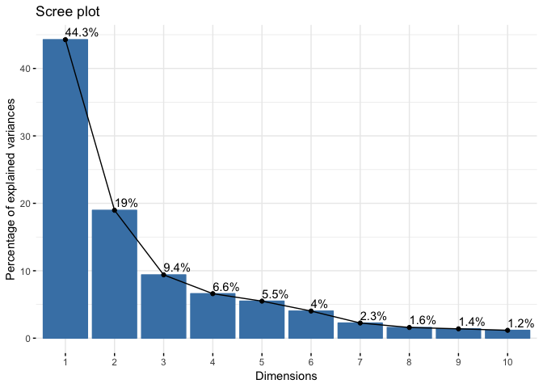

Class 9: Unsupervised learning mini-project
================
Yi Fu
4/30/2019

First, let’s check if “factoextra” and “rgl” package are installed. And
then, load the packages.

``` r
library("factoextra")
library("rgl")
knitr::knit_hooks$set(webgl = hook_webgl)
```

## Preparing the data for Human Breast Cancer Cells

The **WisconsinCancer.csv** containts values describing characteristics
of the cell nuclei present in digitized images of a fine needle
aspiration (FNA) of a breast mass. There are 569 samples. Among these,
there are 212 malignant samples and 357 benign samples.

``` r
df = read.csv("data/WisconsinCancer.csv")
data = as.matrix(df[,3:32])
rownames(data) = df$id
diagnosis = as.numeric(df$diagnosis=="M")
```

**It is important to check if the data need to be scaled before
performing PCA. **

The following suggests that the data should be
    scaled.

``` r
as.vector(round(apply(data,2,mean)))
```

    ##  [1]  14  19  92 655   0   0   0   0   0   0   0   1   3  40   0   0   0
    ## [18]   0   0   0  16  26 107 881   0   0   0   0   0   0

``` r
as.vector(round(apply(data,2,sd)))
```

    ##  [1]   4   4  24 352   0   0   0   0   0   0   0   1   2  45   0   0   0
    ## [18]   0   0   0   5   6  34 569   0   0   0   0   0   0

So, let’s scale the data

``` r
data.scaled = scale(data)
```

## Performing PCA

Let’s use the *prcomp()* function.

``` r
pca = prcomp(data.scaled)
summary(pca)
```

    ## Importance of components:
    ##                           PC1    PC2     PC3     PC4     PC5     PC6
    ## Standard deviation     3.6444 2.3857 1.67867 1.40735 1.28403 1.09880
    ## Proportion of Variance 0.4427 0.1897 0.09393 0.06602 0.05496 0.04025
    ## Cumulative Proportion  0.4427 0.6324 0.72636 0.79239 0.84734 0.88759
    ##                            PC7     PC8    PC9    PC10   PC11    PC12
    ## Standard deviation     0.82172 0.69037 0.6457 0.59219 0.5421 0.51104
    ## Proportion of Variance 0.02251 0.01589 0.0139 0.01169 0.0098 0.00871
    ## Cumulative Proportion  0.91010 0.92598 0.9399 0.95157 0.9614 0.97007
    ##                           PC13    PC14    PC15    PC16    PC17    PC18
    ## Standard deviation     0.49128 0.39624 0.30681 0.28260 0.24372 0.22939
    ## Proportion of Variance 0.00805 0.00523 0.00314 0.00266 0.00198 0.00175
    ## Cumulative Proportion  0.97812 0.98335 0.98649 0.98915 0.99113 0.99288
    ##                           PC19    PC20   PC21    PC22    PC23   PC24
    ## Standard deviation     0.22244 0.17652 0.1731 0.16565 0.15602 0.1344
    ## Proportion of Variance 0.00165 0.00104 0.0010 0.00091 0.00081 0.0006
    ## Cumulative Proportion  0.99453 0.99557 0.9966 0.99749 0.99830 0.9989
    ##                           PC25    PC26    PC27    PC28    PC29    PC30
    ## Standard deviation     0.12442 0.09043 0.08307 0.03987 0.02736 0.01153
    ## Proportion of Variance 0.00052 0.00027 0.00023 0.00005 0.00002 0.00000
    ## Cumulative Proportion  0.99942 0.99969 0.99992 0.99997 1.00000 1.00000

> From your results, 44.27% of the original variance is captured by the
> first principal components.

> 7 principal components are required to describe at least 90% of the
> original variance in the data.

Here is the plot for the percentage of variance captured by each PC:

``` r
pca.var = pca$sdev^2
pca.var.per = round(pca.var/sum(pca.var)*100, 1)
barplot(pca.var.per, 
        ylab="Precent of Variance Explained", names.arg=paste0("PC",1:length(pca.var.per)),
        las=2, axes = FALSE)
axis(2, at=pca.var.per, labels=round(pca.var.per,2))
```

<!-- -->

Here is the side-by-side plot for the percentage and cumulative
percentage of variance captured by each PC:

``` r
par(mfcol=c(1,2))
plot(pca.var.per,
     xlab="Principal Component", ylab="Percentage of Variance Explained (%)", ylim=c(0, 100), 
     type="o")
plot(cumsum(pca.var.per), 
     xlab="Principal Component", ylab="Cumulative Percentage of Variance Explained (%)", ylim=c(0, 100), 
     type="o")
```

<!-- -->

Here is the plot generated by “factoextra” package:

``` r
fviz_eig(pca, addlabels = TRUE)
```

<!-- -->

Here is the biplot:

``` r
biplot (pca)
```

<!-- -->

Here is the plot:

``` r
plot (pca$x[,1], pca$x[,2],
      xlab=paste0("PC1 (", pca.var.per[1], "%)"), ylab=paste0("PC2 (", pca.var.per[2], "%)"),
      col=diagnosis + 1, pch=16)
```

<!-- -->

Here is the plot (PC1 vs PC3):

``` r
plot (pca$x[,1], pca$x[,3],
      xlab=paste0("PC1 (", pca.var.per[1], "%)"), ylab=paste0("PC3 (", pca.var.per[3], "%)"),
      col=diagnosis + 1, pch=16)
```

<!-- -->

Here is the 3D plot (PC1 vs PC2 vs PC3):

``` r
plot3d(pca$x[,1], pca$x[,2], pca$x[,3],
       xlab=paste0("PC1 (", pca.var.per[1], "%)"), ylab=paste0("PC2 (", pca.var.per[2], "%)"), 
       zlab=paste0("PC3 (", pca.var.per[3], "%)"), 
       col=diagnosis + 1, cex=1.5, size=1, type="s")

# this is needed to generate the plot in regular .r file.
#rglwidget(width = 400, height = 400)
```

<script>/*
* Copyright (C) 2009 Apple Inc. All Rights Reserved.
*
* Redistribution and use in source and binary forms, with or without
* modification, are permitted provided that the following conditions
* are met:
* 1. Redistributions of source code must retain the above copyright
*    notice, this list of conditions and the following disclaimer.
* 2. Redistributions in binary form must reproduce the above copyright
*    notice, this list of conditions and the following disclaimer in the
*    documentation and/or other materials provided with the distribution.
*
* THIS SOFTWARE IS PROVIDED BY APPLE INC. ``AS IS'' AND ANY
* EXPRESS OR IMPLIED WARRANTIES, INCLUDING, BUT NOT LIMITED TO, THE
* IMPLIED WARRANTIES OF MERCHANTABILITY AND FITNESS FOR A PARTICULAR
* PURPOSE ARE DISCLAIMED.  IN NO EVENT SHALL APPLE INC. OR
* CONTRIBUTORS BE LIABLE FOR ANY DIRECT, INDIRECT, INCIDENTAL, SPECIAL,
* EXEMPLARY, OR CONSEQUENTIAL DAMAGES (INCLUDING, BUT NOT LIMITED TO,
* PROCUREMENT OF SUBSTITUTE GOODS OR SERVICES; LOSS OF USE, DATA, OR
* PROFITS; OR BUSINESS INTERRUPTION) HOWEVER CAUSED AND ON ANY THEORY
* OF LIABILITY, WHETHER IN CONTRACT, STRICT LIABILITY, OR TORT
* (INCLUDING NEGLIGENCE OR OTHERWISE) ARISING IN ANY WAY OUT OF THE USE
* OF THIS SOFTWARE, EVEN IF ADVISED OF THE POSSIBILITY OF SUCH DAMAGE.
* Copyright (2016) Duncan Murdoch - fixed CanvasMatrix4.ortho,
* cleaned up.
*/
/*
CanvasMatrix4 class
This class implements a 4x4 matrix. It has functions which
duplicate the functionality of the OpenGL matrix stack and
glut functions.
IDL:
[
Constructor(in CanvasMatrix4 matrix),           // copy passed matrix into new CanvasMatrix4
Constructor(in sequence<float> array)           // create new CanvasMatrix4 with 16 floats (row major)
Constructor()                                   // create new CanvasMatrix4 with identity matrix
]
interface CanvasMatrix4 {
attribute float m11;
attribute float m12;
attribute float m13;
attribute float m14;
attribute float m21;
attribute float m22;
attribute float m23;
attribute float m24;
attribute float m31;
attribute float m32;
attribute float m33;
attribute float m34;
attribute float m41;
attribute float m42;
attribute float m43;
attribute float m44;
void load(in CanvasMatrix4 matrix);                 // copy the values from the passed matrix
void load(in sequence<float> array);                // copy 16 floats into the matrix
sequence<float> getAsArray();                       // return the matrix as an array of 16 floats
WebGLFloatArray getAsCanvasFloatArray();           // return the matrix as a WebGLFloatArray with 16 values
void makeIdentity();                                // replace the matrix with identity
void transpose();                                   // replace the matrix with its transpose
void invert();                                      // replace the matrix with its inverse
void translate(in float x, in float y, in float z); // multiply the matrix by passed translation values on the right
void scale(in float x, in float y, in float z);     // multiply the matrix by passed scale values on the right
void rotate(in float angle,                         // multiply the matrix by passed rotation values on the right
in float x, in float y, in float z);    // (angle is in degrees)
void multRight(in CanvasMatrix matrix);             // multiply the matrix by the passed matrix on the right
void multLeft(in CanvasMatrix matrix);              // multiply the matrix by the passed matrix on the left
void ortho(in float left, in float right,           // multiply the matrix by the passed ortho values on the right
in float bottom, in float top,
in float near, in float far);
void frustum(in float left, in float right,         // multiply the matrix by the passed frustum values on the right
in float bottom, in float top,
in float near, in float far);
void perspective(in float fovy, in float aspect,    // multiply the matrix by the passed perspective values on the right
in float zNear, in float zFar);
void lookat(in float eyex, in float eyey, in float eyez,    // multiply the matrix by the passed lookat
in float ctrx, in float ctry, in float ctrz,    // values on the right
in float upx, in float upy, in float upz);
}
*/
CanvasMatrix4 = function(m)
{
if (typeof m == 'object') {
if ("length" in m && m.length >= 16) {
this.load(m[0], m[1], m[2], m[3], m[4], m[5], m[6], m[7], m[8], m[9], m[10], m[11], m[12], m[13], m[14], m[15]);
return;
}
else if (m instanceof CanvasMatrix4) {
this.load(m);
return;
}
}
this.makeIdentity();
};
CanvasMatrix4.prototype.load = function()
{
if (arguments.length == 1 && typeof arguments[0] == 'object') {
var matrix = arguments[0];
if ("length" in matrix && matrix.length == 16) {
this.m11 = matrix[0];
this.m12 = matrix[1];
this.m13 = matrix[2];
this.m14 = matrix[3];
this.m21 = matrix[4];
this.m22 = matrix[5];
this.m23 = matrix[6];
this.m24 = matrix[7];
this.m31 = matrix[8];
this.m32 = matrix[9];
this.m33 = matrix[10];
this.m34 = matrix[11];
this.m41 = matrix[12];
this.m42 = matrix[13];
this.m43 = matrix[14];
this.m44 = matrix[15];
return;
}
if (arguments[0] instanceof CanvasMatrix4) {
this.m11 = matrix.m11;
this.m12 = matrix.m12;
this.m13 = matrix.m13;
this.m14 = matrix.m14;
this.m21 = matrix.m21;
this.m22 = matrix.m22;
this.m23 = matrix.m23;
this.m24 = matrix.m24;
this.m31 = matrix.m31;
this.m32 = matrix.m32;
this.m33 = matrix.m33;
this.m34 = matrix.m34;
this.m41 = matrix.m41;
this.m42 = matrix.m42;
this.m43 = matrix.m43;
this.m44 = matrix.m44;
return;
}
}
this.makeIdentity();
};
CanvasMatrix4.prototype.getAsArray = function()
{
return [
this.m11, this.m12, this.m13, this.m14,
this.m21, this.m22, this.m23, this.m24,
this.m31, this.m32, this.m33, this.m34,
this.m41, this.m42, this.m43, this.m44
];
};
CanvasMatrix4.prototype.getAsWebGLFloatArray = function()
{
return new WebGLFloatArray(this.getAsArray());
};
CanvasMatrix4.prototype.makeIdentity = function()
{
this.m11 = 1;
this.m12 = 0;
this.m13 = 0;
this.m14 = 0;
this.m21 = 0;
this.m22 = 1;
this.m23 = 0;
this.m24 = 0;
this.m31 = 0;
this.m32 = 0;
this.m33 = 1;
this.m34 = 0;
this.m41 = 0;
this.m42 = 0;
this.m43 = 0;
this.m44 = 1;
};
CanvasMatrix4.prototype.transpose = function()
{
var tmp = this.m12;
this.m12 = this.m21;
this.m21 = tmp;
tmp = this.m13;
this.m13 = this.m31;
this.m31 = tmp;
tmp = this.m14;
this.m14 = this.m41;
this.m41 = tmp;
tmp = this.m23;
this.m23 = this.m32;
this.m32 = tmp;
tmp = this.m24;
this.m24 = this.m42;
this.m42 = tmp;
tmp = this.m34;
this.m34 = this.m43;
this.m43 = tmp;
};
CanvasMatrix4.prototype.invert = function()
{
// Calculate the 4x4 determinant
// If the determinant is zero,
// then the inverse matrix is not unique.
var det = this._determinant4x4();
if (Math.abs(det) < 1e-8)
return null;
this._makeAdjoint();
// Scale the adjoint matrix to get the inverse
this.m11 /= det;
this.m12 /= det;
this.m13 /= det;
this.m14 /= det;
this.m21 /= det;
this.m22 /= det;
this.m23 /= det;
this.m24 /= det;
this.m31 /= det;
this.m32 /= det;
this.m33 /= det;
this.m34 /= det;
this.m41 /= det;
this.m42 /= det;
this.m43 /= det;
this.m44 /= det;
};
CanvasMatrix4.prototype.translate = function(x,y,z)
{
if (x === undefined)
x = 0;
if (y === undefined)
y = 0;
if (z === undefined)
z = 0;
var matrix = new CanvasMatrix4();
matrix.m41 = x;
matrix.m42 = y;
matrix.m43 = z;
this.multRight(matrix);
};
CanvasMatrix4.prototype.scale = function(x,y,z)
{
if (x === undefined)
x = 1;
if (z === undefined) {
if (y === undefined) {
y = x;
z = x;
}
else
z = 1;
}
else if (y === undefined)
y = x;
var matrix = new CanvasMatrix4();
matrix.m11 = x;
matrix.m22 = y;
matrix.m33 = z;
this.multRight(matrix);
};
CanvasMatrix4.prototype.rotate = function(angle,x,y,z)
{
// angles are in degrees. Switch to radians
angle = angle / 180 * Math.PI;
angle /= 2;
var sinA = Math.sin(angle);
var cosA = Math.cos(angle);
var sinA2 = sinA * sinA;
// normalize
var length = Math.sqrt(x * x + y * y + z * z);
if (length === 0) {
// bad vector, just use something reasonable
x = 0;
y = 0;
z = 1;
} else if (length != 1) {
x /= length;
y /= length;
z /= length;
}
var mat = new CanvasMatrix4();
// optimize case where axis is along major axis
if (x == 1 && y === 0 && z === 0) {
mat.m11 = 1;
mat.m12 = 0;
mat.m13 = 0;
mat.m21 = 0;
mat.m22 = 1 - 2 * sinA2;
mat.m23 = 2 * sinA * cosA;
mat.m31 = 0;
mat.m32 = -2 * sinA * cosA;
mat.m33 = 1 - 2 * sinA2;
mat.m14 = mat.m24 = mat.m34 = 0;
mat.m41 = mat.m42 = mat.m43 = 0;
mat.m44 = 1;
} else if (x === 0 && y == 1 && z === 0) {
mat.m11 = 1 - 2 * sinA2;
mat.m12 = 0;
mat.m13 = -2 * sinA * cosA;
mat.m21 = 0;
mat.m22 = 1;
mat.m23 = 0;
mat.m31 = 2 * sinA * cosA;
mat.m32 = 0;
mat.m33 = 1 - 2 * sinA2;
mat.m14 = mat.m24 = mat.m34 = 0;
mat.m41 = mat.m42 = mat.m43 = 0;
mat.m44 = 1;
} else if (x === 0 && y === 0 && z == 1) {
mat.m11 = 1 - 2 * sinA2;
mat.m12 = 2 * sinA * cosA;
mat.m13 = 0;
mat.m21 = -2 * sinA * cosA;
mat.m22 = 1 - 2 * sinA2;
mat.m23 = 0;
mat.m31 = 0;
mat.m32 = 0;
mat.m33 = 1;
mat.m14 = mat.m24 = mat.m34 = 0;
mat.m41 = mat.m42 = mat.m43 = 0;
mat.m44 = 1;
} else {
var x2 = x*x;
var y2 = y*y;
var z2 = z*z;
mat.m11 = 1 - 2 * (y2 + z2) * sinA2;
mat.m12 = 2 * (x * y * sinA2 + z * sinA * cosA);
mat.m13 = 2 * (x * z * sinA2 - y * sinA * cosA);
mat.m21 = 2 * (y * x * sinA2 - z * sinA * cosA);
mat.m22 = 1 - 2 * (z2 + x2) * sinA2;
mat.m23 = 2 * (y * z * sinA2 + x * sinA * cosA);
mat.m31 = 2 * (z * x * sinA2 + y * sinA * cosA);
mat.m32 = 2 * (z * y * sinA2 - x * sinA * cosA);
mat.m33 = 1 - 2 * (x2 + y2) * sinA2;
mat.m14 = mat.m24 = mat.m34 = 0;
mat.m41 = mat.m42 = mat.m43 = 0;
mat.m44 = 1;
}
this.multRight(mat);
};
CanvasMatrix4.prototype.multRight = function(mat)
{
var m11 = (this.m11 * mat.m11 + this.m12 * mat.m21 +
this.m13 * mat.m31 + this.m14 * mat.m41);
var m12 = (this.m11 * mat.m12 + this.m12 * mat.m22 +
this.m13 * mat.m32 + this.m14 * mat.m42);
var m13 = (this.m11 * mat.m13 + this.m12 * mat.m23 +
this.m13 * mat.m33 + this.m14 * mat.m43);
var m14 = (this.m11 * mat.m14 + this.m12 * mat.m24 +
this.m13 * mat.m34 + this.m14 * mat.m44);
var m21 = (this.m21 * mat.m11 + this.m22 * mat.m21 +
this.m23 * mat.m31 + this.m24 * mat.m41);
var m22 = (this.m21 * mat.m12 + this.m22 * mat.m22 +
this.m23 * mat.m32 + this.m24 * mat.m42);
var m23 = (this.m21 * mat.m13 + this.m22 * mat.m23 +
this.m23 * mat.m33 + this.m24 * mat.m43);
var m24 = (this.m21 * mat.m14 + this.m22 * mat.m24 +
this.m23 * mat.m34 + this.m24 * mat.m44);
var m31 = (this.m31 * mat.m11 + this.m32 * mat.m21 +
this.m33 * mat.m31 + this.m34 * mat.m41);
var m32 = (this.m31 * mat.m12 + this.m32 * mat.m22 +
this.m33 * mat.m32 + this.m34 * mat.m42);
var m33 = (this.m31 * mat.m13 + this.m32 * mat.m23 +
this.m33 * mat.m33 + this.m34 * mat.m43);
var m34 = (this.m31 * mat.m14 + this.m32 * mat.m24 +
this.m33 * mat.m34 + this.m34 * mat.m44);
var m41 = (this.m41 * mat.m11 + this.m42 * mat.m21 +
this.m43 * mat.m31 + this.m44 * mat.m41);
var m42 = (this.m41 * mat.m12 + this.m42 * mat.m22 +
this.m43 * mat.m32 + this.m44 * mat.m42);
var m43 = (this.m41 * mat.m13 + this.m42 * mat.m23 +
this.m43 * mat.m33 + this.m44 * mat.m43);
var m44 = (this.m41 * mat.m14 + this.m42 * mat.m24 +
this.m43 * mat.m34 + this.m44 * mat.m44);
this.m11 = m11;
this.m12 = m12;
this.m13 = m13;
this.m14 = m14;
this.m21 = m21;
this.m22 = m22;
this.m23 = m23;
this.m24 = m24;
this.m31 = m31;
this.m32 = m32;
this.m33 = m33;
this.m34 = m34;
this.m41 = m41;
this.m42 = m42;
this.m43 = m43;
this.m44 = m44;
};
CanvasMatrix4.prototype.multLeft = function(mat)
{
var m11 = (mat.m11 * this.m11 + mat.m12 * this.m21 +
mat.m13 * this.m31 + mat.m14 * this.m41);
var m12 = (mat.m11 * this.m12 + mat.m12 * this.m22 +
mat.m13 * this.m32 + mat.m14 * this.m42);
var m13 = (mat.m11 * this.m13 + mat.m12 * this.m23 +
mat.m13 * this.m33 + mat.m14 * this.m43);
var m14 = (mat.m11 * this.m14 + mat.m12 * this.m24 +
mat.m13 * this.m34 + mat.m14 * this.m44);
var m21 = (mat.m21 * this.m11 + mat.m22 * this.m21 +
mat.m23 * this.m31 + mat.m24 * this.m41);
var m22 = (mat.m21 * this.m12 + mat.m22 * this.m22 +
mat.m23 * this.m32 + mat.m24 * this.m42);
var m23 = (mat.m21 * this.m13 + mat.m22 * this.m23 +
mat.m23 * this.m33 + mat.m24 * this.m43);
var m24 = (mat.m21 * this.m14 + mat.m22 * this.m24 +
mat.m23 * this.m34 + mat.m24 * this.m44);
var m31 = (mat.m31 * this.m11 + mat.m32 * this.m21 +
mat.m33 * this.m31 + mat.m34 * this.m41);
var m32 = (mat.m31 * this.m12 + mat.m32 * this.m22 +
mat.m33 * this.m32 + mat.m34 * this.m42);
var m33 = (mat.m31 * this.m13 + mat.m32 * this.m23 +
mat.m33 * this.m33 + mat.m34 * this.m43);
var m34 = (mat.m31 * this.m14 + mat.m32 * this.m24 +
mat.m33 * this.m34 + mat.m34 * this.m44);
var m41 = (mat.m41 * this.m11 + mat.m42 * this.m21 +
mat.m43 * this.m31 + mat.m44 * this.m41);
var m42 = (mat.m41 * this.m12 + mat.m42 * this.m22 +
mat.m43 * this.m32 + mat.m44 * this.m42);
var m43 = (mat.m41 * this.m13 + mat.m42 * this.m23 +
mat.m43 * this.m33 + mat.m44 * this.m43);
var m44 = (mat.m41 * this.m14 + mat.m42 * this.m24 +
mat.m43 * this.m34 + mat.m44 * this.m44);
this.m11 = m11;
this.m12 = m12;
this.m13 = m13;
this.m14 = m14;
this.m21 = m21;
this.m22 = m22;
this.m23 = m23;
this.m24 = m24;
this.m31 = m31;
this.m32 = m32;
this.m33 = m33;
this.m34 = m34;
this.m41 = m41;
this.m42 = m42;
this.m43 = m43;
this.m44 = m44;
};
CanvasMatrix4.prototype.ortho = function(left, right, bottom, top, near, far)
{
var tx = (left + right) / (left - right);
var ty = (top + bottom) / (bottom - top);
var tz = (far + near) / (near - far);
var matrix = new CanvasMatrix4();
matrix.m11 = 2 / (right - left);
matrix.m12 = 0;
matrix.m13 = 0;
matrix.m14 = 0;
matrix.m21 = 0;
matrix.m22 = 2 / (top - bottom);
matrix.m23 = 0;
matrix.m24 = 0;
matrix.m31 = 0;
matrix.m32 = 0;
matrix.m33 = -2 / (far - near);
matrix.m34 = 0;
matrix.m41 = tx;
matrix.m42 = ty;
matrix.m43 = tz;
matrix.m44 = 1;
this.multRight(matrix);
};
CanvasMatrix4.prototype.frustum = function(left, right, bottom, top, near, far)
{
var matrix = new CanvasMatrix4();
var A = (right + left) / (right - left);
var B = (top + bottom) / (top - bottom);
var C = -(far + near) / (far - near);
var D = -(2 * far * near) / (far - near);
matrix.m11 = (2 * near) / (right - left);
matrix.m12 = 0;
matrix.m13 = 0;
matrix.m14 = 0;
matrix.m21 = 0;
matrix.m22 = 2 * near / (top - bottom);
matrix.m23 = 0;
matrix.m24 = 0;
matrix.m31 = A;
matrix.m32 = B;
matrix.m33 = C;
matrix.m34 = -1;
matrix.m41 = 0;
matrix.m42 = 0;
matrix.m43 = D;
matrix.m44 = 0;
this.multRight(matrix);
};
CanvasMatrix4.prototype.perspective = function(fovy, aspect, zNear, zFar)
{
var top = Math.tan(fovy * Math.PI / 360) * zNear;
var bottom = -top;
var left = aspect * bottom;
var right = aspect * top;
this.frustum(left, right, bottom, top, zNear, zFar);
};
CanvasMatrix4.prototype.lookat = function(eyex, eyey, eyez, centerx, centery, centerz, upx, upy, upz)
{
var matrix = new CanvasMatrix4();
// Make rotation matrix
// Z vector
var zx = eyex - centerx;
var zy = eyey - centery;
var zz = eyez - centerz;
var mag = Math.sqrt(zx * zx + zy * zy + zz * zz);
if (mag) {
zx /= mag;
zy /= mag;
zz /= mag;
}
// Y vector
var yx = upx;
var yy = upy;
var yz = upz;
// X vector = Y cross Z
xx =  yy * zz - yz * zy;
xy = -yx * zz + yz * zx;
xz =  yx * zy - yy * zx;
// Recompute Y = Z cross X
yx = zy * xz - zz * xy;
yy = -zx * xz + zz * xx;
yx = zx * xy - zy * xx;
// cross product gives area of parallelogram, which is < 1.0 for
// non-perpendicular unit-length vectors; so normalize x, y here
mag = Math.sqrt(xx * xx + xy * xy + xz * xz);
if (mag) {
xx /= mag;
xy /= mag;
xz /= mag;
}
mag = Math.sqrt(yx * yx + yy * yy + yz * yz);
if (mag) {
yx /= mag;
yy /= mag;
yz /= mag;
}
matrix.m11 = xx;
matrix.m12 = xy;
matrix.m13 = xz;
matrix.m14 = 0;
matrix.m21 = yx;
matrix.m22 = yy;
matrix.m23 = yz;
matrix.m24 = 0;
matrix.m31 = zx;
matrix.m32 = zy;
matrix.m33 = zz;
matrix.m34 = 0;
matrix.m41 = 0;
matrix.m42 = 0;
matrix.m43 = 0;
matrix.m44 = 1;
matrix.translate(-eyex, -eyey, -eyez);
this.multRight(matrix);
};
// Support functions
CanvasMatrix4.prototype._determinant2x2 = function(a, b, c, d)
{
return a * d - b * c;
};
CanvasMatrix4.prototype._determinant3x3 = function(a1, a2, a3, b1, b2, b3, c1, c2, c3)
{
return a1 * this._determinant2x2(b2, b3, c2, c3) -
b1 * this._determinant2x2(a2, a3, c2, c3) +
c1 * this._determinant2x2(a2, a3, b2, b3);
};
CanvasMatrix4.prototype._determinant4x4 = function()
{
var a1 = this.m11;
var b1 = this.m12;
var c1 = this.m13;
var d1 = this.m14;
var a2 = this.m21;
var b2 = this.m22;
var c2 = this.m23;
var d2 = this.m24;
var a3 = this.m31;
var b3 = this.m32;
var c3 = this.m33;
var d3 = this.m34;
var a4 = this.m41;
var b4 = this.m42;
var c4 = this.m43;
var d4 = this.m44;
return a1 * this._determinant3x3(b2, b3, b4, c2, c3, c4, d2, d3, d4) -
b1 * this._determinant3x3(a2, a3, a4, c2, c3, c4, d2, d3, d4) +
c1 * this._determinant3x3(a2, a3, a4, b2, b3, b4, d2, d3, d4) -
d1 * this._determinant3x3(a2, a3, a4, b2, b3, b4, c2, c3, c4);
};
CanvasMatrix4.prototype._makeAdjoint = function()
{
var a1 = this.m11;
var b1 = this.m12;
var c1 = this.m13;
var d1 = this.m14;
var a2 = this.m21;
var b2 = this.m22;
var c2 = this.m23;
var d2 = this.m24;
var a3 = this.m31;
var b3 = this.m32;
var c3 = this.m33;
var d3 = this.m34;
var a4 = this.m41;
var b4 = this.m42;
var c4 = this.m43;
var d4 = this.m44;
// Row column labeling reversed since we transpose rows & columns
this.m11  =   this._determinant3x3(b2, b3, b4, c2, c3, c4, d2, d3, d4);
this.m21  = - this._determinant3x3(a2, a3, a4, c2, c3, c4, d2, d3, d4);
this.m31  =   this._determinant3x3(a2, a3, a4, b2, b3, b4, d2, d3, d4);
this.m41  = - this._determinant3x3(a2, a3, a4, b2, b3, b4, c2, c3, c4);
this.m12  = - this._determinant3x3(b1, b3, b4, c1, c3, c4, d1, d3, d4);
this.m22  =   this._determinant3x3(a1, a3, a4, c1, c3, c4, d1, d3, d4);
this.m32  = - this._determinant3x3(a1, a3, a4, b1, b3, b4, d1, d3, d4);
this.m42  =   this._determinant3x3(a1, a3, a4, b1, b3, b4, c1, c3, c4);
this.m13  =   this._determinant3x3(b1, b2, b4, c1, c2, c4, d1, d2, d4);
this.m23  = - this._determinant3x3(a1, a2, a4, c1, c2, c4, d1, d2, d4);
this.m33  =   this._determinant3x3(a1, a2, a4, b1, b2, b4, d1, d2, d4);
this.m43  = - this._determinant3x3(a1, a2, a4, b1, b2, b4, c1, c2, c4);
this.m14  = - this._determinant3x3(b1, b2, b3, c1, c2, c3, d1, d2, d3);
this.m24  =   this._determinant3x3(a1, a2, a3, c1, c2, c3, d1, d2, d3);
this.m34  = - this._determinant3x3(a1, a2, a3, b1, b2, b3, d1, d2, d3);
this.m44  =   this._determinant3x3(a1, a2, a3, b1, b2, b3, c1, c2, c3);
};</script>

<script>// To generate the help pages for this library, use
// jsdoc --destination ../../../doc/rglwidgetClass --template ~/node_modules/jsdoc-baseline rglClass.src.js
// To validate, use
// setwd(".../inst/htmlwidgets/lib/rglClass")
// hints <- js::jshint(readLines("rglClass.src.js"))
// hints[, c("line", "reason")]
/**
* The class of an rgl widget
* @class
*/
rglwidgetClass = function() {
this.canvas = null;
this.userMatrix = new CanvasMatrix4();
this.types = [];
this.prMatrix = new CanvasMatrix4();
this.mvMatrix = new CanvasMatrix4();
this.vp = null;
this.prmvMatrix = null;
this.origs = null;
this.gl = null;
this.scene = null;
this.select = {state: "inactive", subscene: null, region: {p1: {x:0, y:0}, p2: {x:0, y:0}}};
this.drawing = false;
};
/**
* Multiply matrix by vector
* @returns {number[]}
* @param M {number[][]} Left operand
* @param v {number[]} Right operand
*/
rglwidgetClass.prototype.multMV = function(M, v) {
return [ M.m11 * v[0] + M.m12 * v[1] + M.m13 * v[2] + M.m14 * v[3],
M.m21 * v[0] + M.m22 * v[1] + M.m23 * v[2] + M.m24 * v[3],
M.m31 * v[0] + M.m32 * v[1] + M.m33 * v[2] + M.m34 * v[3],
M.m41 * v[0] + M.m42 * v[1] + M.m43 * v[2] + M.m44 * v[3]
];
};
/**
* Multiply row vector by Matrix
* @returns {number[]}
* @param v {number[]} left operand
* @param M {number[][]} right operand
*/
rglwidgetClass.prototype.multVM = function(v, M) {
return [ M.m11 * v[0] + M.m21 * v[1] + M.m31 * v[2] + M.m41 * v[3],
M.m12 * v[0] + M.m22 * v[1] + M.m32 * v[2] + M.m42 * v[3],
M.m13 * v[0] + M.m23 * v[1] + M.m33 * v[2] + M.m43 * v[3],
M.m14 * v[0] + M.m24 * v[1] + M.m34 * v[2] + M.m44 * v[3]
];
};
/**
* Euclidean length of a vector
* @returns {number}
* @param v {number[]}
*/
rglwidgetClass.prototype.vlen = function(v) {
return Math.sqrt(this.dotprod(v, v));
};
/**
* Dot product of two vectors
* @instance rglwidgetClass
* @returns {number}
* @param a {number[]}
* @param b {number[]}
*/
rglwidgetClass.prototype.dotprod = function(a, b) {
return a[0]*b[0] + a[1]*b[1] + a[2]*b[2];
};
/**
* Cross product of two vectors
* @returns {number[]}
* @param a {number[]}
* @param b {number[]}
*/
rglwidgetClass.prototype.xprod = function(a, b) {
return [a[1]*b[2] - a[2]*b[1],
a[2]*b[0] - a[0]*b[2],
a[0]*b[1] - a[1]*b[0]];
};
/**
* Bind vectors or matrices by columns
* @returns {number[][]}
* @param a {number[]|number[][]}
* @param b {number[]|number[][]}
*/
rglwidgetClass.prototype.cbind = function(a, b) {
if (b.length < a.length)
b = this.repeatToLen(b, a.length);
else if (a.length < b.length)
a = this.repeatToLen(a, b.length);
return a.map(function(currentValue, index, array) {
return currentValue.concat(b[index]);
});
};
/**
* Swap elements
* @returns {any[]}
* @param a {any[]}
* @param i {number} Element to swap
* @param j {number} Other element to swap
*/
rglwidgetClass.prototype.swap = function(a, i, j) {
var temp = a[i];
a[i] = a[j];
a[j] = temp;
};
/**
* Flatten a matrix into a vector
* @returns {any[]}
* @param a {any[][]}
*/
rglwidgetClass.prototype.flatten = function(arr, result) {
var value;
if (typeof result === "undefined") result = [];
for (var i = 0, length = arr.length; i < length; i++) {
value = arr[i];
if (Array.isArray(value)) {
this.flatten(value, result);
} else {
result.push(value);
}
}
return result;
};
/**
* set element of 1d or 2d array as if it was flattened.
* Column major, zero based!
* @returns {any[]|any[][]}
* @param {any[]|any[][]} a - array
* @param {number} i - element
* @param {any} value
*/
rglwidgetClass.prototype.setElement = function(a, i, value) {
if (Array.isArray(a[0])) {
var dim = a.length,
col = Math.floor(i/dim),
row = i % dim;
a[row][col] = value;
} else {
a[i] = value;
}
};
/**
* Transpose an array
* @returns {any[][]}
* @param {any[][]} a
*/
rglwidgetClass.prototype.transpose = function(a) {
var newArray = [],
n = a.length,
m = a[0].length,
i;
for(i = 0; i < m; i++){
newArray.push([]);
}
for(i = 0; i < n; i++){
for(var j = 0; j < m; j++){
newArray[j].push(a[i][j]);
}
}
return newArray;
};
/**
* Calculate sum of squares of a numeric vector
* @returns {number}
* @param {number[]} x
*/
rglwidgetClass.prototype.sumsq = function(x) {
var result = 0, i;
for (i=0; i < x.length; i++)
result += x[i]*x[i];
return result;
};
/**
* Convert a matrix to a CanvasMatrix4
* @returns {CanvasMatrix4}
* @param {number[][]|number[]} mat
*/
rglwidgetClass.prototype.toCanvasMatrix4 = function(mat) {
if (mat instanceof CanvasMatrix4)
return mat;
var result = new CanvasMatrix4();
mat = this.flatten(this.transpose(mat));
result.load(mat);
return result;
};
/**
* Convert an R-style numeric colour string to an rgb vector
* @returns {number[]}
* @param {string} s
*/
rglwidgetClass.prototype.stringToRgb = function(s) {
s = s.replace("#", "");
var bigint = parseInt(s, 16);
return [((bigint >> 16) & 255)/255,
((bigint >> 8) & 255)/255,
(bigint & 255)/255];
};
/**
* Take a component-by-component product of two 3 vectors
* @returns {number[]}
* @param {number[]} x
* @param {number[]} y
*/
rglwidgetClass.prototype.componentProduct = function(x, y) {
if (typeof y === "undefined") {
this.alertOnce("Bad arg to componentProduct");
}
var result = new Float32Array(3), i;
for (i = 0; i<3; i++)
result[i] = x[i]*y[i];
return result;
};
/**
* Get next higher power of two
* @returns { number }
* @param { number } value - input value
*/
rglwidgetClass.prototype.getPowerOfTwo = function(value) {
var pow = 1;
while(pow<value) {
pow *= 2;
}
return pow;
};
/**
* Unique entries
* @returns { any[] }
* @param { any[] } arr - An array
*/
rglwidgetClass.prototype.unique = function(arr) {
arr = [].concat(arr);
return arr.filter(function(value, index, self) {
return self.indexOf(value) === index;
});
};
/**
* Shallow compare of arrays
* @returns { boolean }
* @param { any[] } a - An array
* @param { any[] } b - Another array
*/
rglwidgetClass.prototype.equalArrays = function(a, b) {
return a === b || (a && b &&
a.length === b.length &&
a.every(function(v, i) {return v === b[i];}));
};
/**
* Repeat an array to a desired length
* @returns {any[]}
* @param {any | any[]} arr The input array
* @param {number} len The desired output length
*/
rglwidgetClass.prototype.repeatToLen = function(arr, len) {
arr = [].concat(arr);
while (arr.length < len/2)
arr = arr.concat(arr);
return arr.concat(arr.slice(0, len - arr.length));
};
/**
* Give a single alert message, not to be repeated.
* @param {string} msg  The message to give.
*/
rglwidgetClass.prototype.alertOnce = function(msg) {
if (typeof this.alerted !== "undefined")
return;
this.alerted = true;
alert(msg);
};
rglwidgetClass.prototype.f_is_lit = 1;
rglwidgetClass.prototype.f_is_smooth = 2;
rglwidgetClass.prototype.f_has_texture = 4;
rglwidgetClass.prototype.f_depth_sort = 8;
rglwidgetClass.prototype.f_fixed_quads = 16;
rglwidgetClass.prototype.f_is_transparent = 32;
rglwidgetClass.prototype.f_is_lines = 64;
rglwidgetClass.prototype.f_sprites_3d = 128;
rglwidgetClass.prototype.f_sprite_3d = 256;
rglwidgetClass.prototype.f_is_subscene = 512;
rglwidgetClass.prototype.f_is_clipplanes = 1024;
rglwidgetClass.prototype.f_fixed_size = 2048;
rglwidgetClass.prototype.f_is_points = 4096;
rglwidgetClass.prototype.f_is_twosided = 8192;
rglwidgetClass.prototype.f_fat_lines = 16384;
rglwidgetClass.prototype.f_is_brush = 32768;
/**
* Which list does a particular id come from?
* @returns { string }
* @param {number} id The id to look up.
*/
rglwidgetClass.prototype.whichList = function(id) {
var obj = this.getObj(id),
flags = obj.flags;
if (obj.type === "light")
return "lights";
if (flags & this.f_is_subscene)
return "subscenes";
if (flags & this.f_is_clipplanes)
return "clipplanes";
if (flags & this.f_is_transparent)
return "transparent";
return "opaque";
};
/**
* Get an object by id number.
* @returns { Object }
* @param {number} id
*/
rglwidgetClass.prototype.getObj = function(id) {
if (typeof id !== "number") {
this.alertOnce("getObj id is "+typeof id);
}
return this.scene.objects[id];
};
/**
* Get ids of a particular type from a subscene or the whole scene
* @returns { number[] }
* @param {string} type What type of object?
* @param {number} subscene  Which subscene?  If not given, find in the whole scene
*/
rglwidgetClass.prototype.getIdsByType = function(type, subscene) {
var
result = [], i, self = this;
if (typeof subscene === "undefined") {
Object.keys(this.scene.objects).forEach(
function(key) {
key = parseInt(key, 10);
if (self.getObj(key).type === type)
result.push(key);
});
} else {
ids = this.getObj(subscene).objects;
for (i=0; i < ids.length; i++) {
if (this.getObj(ids[i]).type === type) {
result.push(ids[i]);
}
}
}
return result;
};
/**
* Get a particular material property for an id
* @returns { any }
* @param {number} id  Which object?
* @param {string} property Which material property?
*/
rglwidgetClass.prototype.getMaterial = function(id, property) {
var obj = this.getObj(id), mat;
if (typeof obj.material === "undefined")
console.error("material undefined");
mat = obj.material[property];
if (typeof mat === "undefined")
mat = this.scene.material[property];
return mat;
};
/**
* Is a particular id in a subscene?
* @returns { boolean }
* @param {number} id Which id?
* @param {number} subscene Which subscene id?
*/
rglwidgetClass.prototype.inSubscene = function(id, subscene) {
return this.getObj(subscene).objects.indexOf(id) > -1;
};
/**
* Add an id to a subscene.
* @param {number} id Which id?
* @param {number} subscene Which subscene id?
*/
rglwidgetClass.prototype.addToSubscene = function(id, subscene) {
var thelist,
thesub = this.getObj(subscene),
ids = [id],
obj = this.getObj(id), i;
if (typeof obj != "undefined" && typeof (obj.newIds) !== "undefined") {
ids = ids.concat(obj.newIds);
}
thesub.objects = [].concat(thesub.objects);
for (i = 0; i < ids.length; i++) {
id = ids[i];
if (thesub.objects.indexOf(id) == -1) {
thelist = this.whichList(id);
thesub.objects.push(id);
thesub[thelist].push(id);
}
}
};
/**
* Delete an id from a subscene
* @param { number } id - the id to add
* @param { number } subscene - the id of the subscene
*/
rglwidgetClass.prototype.delFromSubscene = function(id, subscene) {
var thelist,
thesub = this.getObj(subscene),
obj = this.getObj(id),
ids = [id], i;
if (typeof obj !== "undefined" && typeof (obj.newIds) !== "undefined")
ids = ids.concat(obj.newIds);
thesub.objects = [].concat(thesub.objects); // It might be a scalar
for (j=0; j<ids.length;j++) {
id = ids[j];
i = thesub.objects.indexOf(id);
if (i > -1) {
thesub.objects.splice(i, 1);
thelist = this.whichList(id);
i = thesub[thelist].indexOf(id);
thesub[thelist].splice(i, 1);
}
}
};
/**
* Set the ids in a subscene
* @param { number[] } ids - the ids to set
* @param { number } subsceneid - the id of the subscene
*/
rglwidgetClass.prototype.setSubsceneEntries = function(ids, subsceneid) {
var sub = this.getObj(subsceneid);
sub.objects = ids;
this.initSubscene(subsceneid);
};
/**
* Get the ids in a subscene
* @returns {number[]}
* @param { number } subscene - the id of the subscene
*/
rglwidgetClass.prototype.getSubsceneEntries = function(subscene) {
return this.getObj(subscene).objects;
};
/**
* Get the ids of the subscenes within a subscene
* @returns { number[] }
* @param { number } subscene - the id of the subscene
*/
rglwidgetClass.prototype.getChildSubscenes = function(subscene) {
return this.getObj(subscene).subscenes;
};
/**
* Start drawing
* @returns { boolean } Previous state
*/
rglwidgetClass.prototype.startDrawing = function() {
var value = this.drawing;
this.drawing = true;
return value;
};
/**
* Stop drawing and check for context loss
* @param { boolean } saved - Previous state
*/
rglwidgetClass.prototype.stopDrawing = function(saved) {
this.drawing = saved;
if (!saved && this.gl && this.gl.isContextLost())
this.restartCanvas();
};
/**
* Generate the vertex shader for an object
* @returns {string}
* @param { number } id - Id of object
*/
rglwidgetClass.prototype.getVertexShader = function(id) {
var obj = this.getObj(id),
userShader = obj.userVertexShader,
flags = obj.flags,
type = obj.type,
is_lit = flags & this.f_is_lit,
has_texture = flags & this.f_has_texture,
fixed_quads = flags & this.f_fixed_quads,
sprites_3d = flags & this.f_sprites_3d,
sprite_3d = flags & this.f_sprite_3d,
nclipplanes = this.countClipplanes(),
fixed_size = flags & this.f_fixed_size,
is_points = flags & this.f_is_points,
is_twosided = flags & this.f_is_twosided,
fat_lines = flags & this.f_fat_lines,
is_brush = flags & this.f_is_brush,
result;
if (type === "clipplanes" || sprites_3d) return;
if (typeof userShader !== "undefined") return userShader;
result = "  /* ****** "+type+" object "+id+" vertex shader ****** */\n"+
"  attribute vec3 aPos;\n"+
"  attribute vec4 aCol;\n"+
" uniform mat4 mvMatrix;\n"+
" uniform mat4 prMatrix;\n"+
" varying vec4 vCol;\n"+
" varying vec4 vPosition;\n";
if ((is_lit && !fixed_quads && !is_brush) || sprite_3d)
result = result + "  attribute vec3 aNorm;\n"+
" uniform mat4 normMatrix;\n"+
" varying vec3 vNormal;\n";
if (has_texture || type === "text")
result = result + " attribute vec2 aTexcoord;\n"+
" varying vec2 vTexcoord;\n";
if (fixed_size)
result = result + "  uniform vec2 textScale;\n";
if (fixed_quads)
result = result + "  attribute vec2 aOfs;\n";
else if (sprite_3d)
result = result + "  uniform vec3 uOrig;\n"+
"  uniform float uSize;\n"+
"  uniform mat4 usermat;\n";
if (is_twosided)
result = result + "  attribute vec3 aPos1;\n"+
"  attribute vec3 aPos2;\n"+
"  varying float normz;\n";
if (fat_lines) {
result = result +   "  attribute vec3 aNext;\n"+
"  attribute vec2 aPoint;\n"+
"  varying vec2 vPoint;\n"+
"  varying float vLength;\n"+
"  uniform float uAspect;\n"+
"  uniform float uLwd;\n";
}
result = result + "  void main(void) {\n";
if ((nclipplanes || (!fixed_quads && !sprite_3d)) && !is_brush)
result = result + "    vPosition = mvMatrix * vec4(aPos, 1.);\n";
if (!fixed_quads && !sprite_3d && !is_brush)
result = result + "    gl_Position = prMatrix * vPosition;\n";
if (is_points) {
var size = this.getMaterial(id, "size");
result = result + "    gl_PointSize = "+size.toFixed(1)+";\n";
}
result = result + "    vCol = aCol;\n";
if (is_lit && !fixed_quads && !sprite_3d && !is_brush)
result = result + "    vNormal = normalize((normMatrix * vec4(aNorm, 1.)).xyz);\n";
if (has_texture || type == "text")
result = result + "    vTexcoord = aTexcoord;\n";
if (fixed_size)
result = result + "    vec4 pos = prMatrix * mvMatrix * vec4(aPos, 1.);\n"+
"   pos = pos/pos.w;\n"+
"   gl_Position = pos + vec4(aOfs*textScale, 0.,0.);\n";
if (type == "sprites" && !fixed_size)
result = result + "    vec4 pos = mvMatrix * vec4(aPos, 1.);\n"+
"   pos = pos/pos.w + vec4(aOfs, 0., 0.);\n"+
"   gl_Position = prMatrix*pos;\n";
if (sprite_3d)
result = result + "   vNormal = normalize((normMatrix * vec4(aNorm, 1.)).xyz);\n"+
"   vec4 pos = mvMatrix * vec4(uOrig, 1.);\n"+
"   vPosition = pos/pos.w + vec4(uSize*(vec4(aPos, 1.)*usermat).xyz,0.);\n"+
"   gl_Position = prMatrix * vPosition;\n";
if (is_twosided)
result = result + "   vec4 pos1 = prMatrix*(mvMatrix*vec4(aPos1, 1.));\n"+
"   pos1 = pos1/pos1.w - gl_Position/gl_Position.w;\n"+
"   vec4 pos2 = prMatrix*(mvMatrix*vec4(aPos2, 1.));\n"+
"   pos2 = pos2/pos2.w - gl_Position/gl_Position.w;\n"+
"   normz = pos1.x*pos2.y - pos1.y*pos2.x;\n";
if (fat_lines) 
/* This code was inspired by Matt Deslauriers' code in https://mattdesl.svbtle.com/drawing-lines-is-hard */
result = result + "   vec2 aspectVec = vec2(uAspect, 1.0);\n"+
"   mat4 projViewModel = prMatrix * mvMatrix;\n"+
"   vec4 currentProjected = projViewModel * vec4(aPos, 1.0);\n"+
"   currentProjected = currentProjected/currentProjected.w;\n"+
"   vec4 nextProjected = projViewModel * vec4(aNext, 1.0);\n"+
"   vec2 currentScreen = currentProjected.xy * aspectVec;\n"+
"   vec2 nextScreen = (nextProjected.xy / nextProjected.w) * aspectVec;\n"+
"   float len = uLwd;\n"+
"   vec2 dir = vec2(1.0, 0.0);\n"+
"   vPoint = aPoint;\n"+
"   vLength = length(nextScreen - currentScreen)/2.0;\n"+
"   vLength = vLength/(vLength + len);\n"+
"   if (vLength > 0.0) {\n"+
"     dir = normalize(nextScreen - currentScreen);\n"+
"   }\n"+
"   vec2 normal = vec2(-dir.y, dir.x);\n"+
"   dir.x /= uAspect;\n"+
"   normal.x /= uAspect;\n"+
"   vec4 offset = vec4(len*(normal*aPoint.x*aPoint.y - dir), 0.0, 0.0);\n"+
"   gl_Position = currentProjected + offset;\n";
if (is_brush)
result = result + "   gl_Position = vec4(aPos, 1.);\n";
result = result + "  }\n";
// console.log(result);
return result;
};
/**
* Generate the fragment shader for an object
* @returns {string}
* @param { number } id - Id of object
*/
rglwidgetClass.prototype.getFragmentShader = function(id) {
var obj = this.getObj(id),
userShader = obj.userFragmentShader,
flags = obj.flags,
type = obj.type,
is_lit = flags & this.f_is_lit,
has_texture = flags & this.f_has_texture,
fixed_quads = flags & this.f_fixed_quads,
sprites_3d = flags & this.f_sprites_3d,
is_twosided = (flags & this.f_is_twosided) > 0,
fat_lines = flags & this.f_fat_lines,
is_transparent = flags & this.f_is_transparent,
nclipplanes = this.countClipplanes(), i,
texture_format, nlights,
result;
if (type === "clipplanes" || sprites_3d) return;
if (typeof userShader !== "undefined") return userShader;
if (has_texture)
texture_format = this.getMaterial(id, "textype");
result = "/* ****** "+type+" object "+id+" fragment shader ****** */\n"+
"#ifdef GL_ES\n"+
"#ifdef GL_FRAGMENT_PRECISION_HIGH\n"+
"  precision highp float;\n"+
"#else\n"+
"  precision mediump float;\n"+
"#endif\n"+
"#endif\n"+
"  varying vec4 vCol; // carries alpha\n"+
"  varying vec4 vPosition;\n";
if (has_texture || type === "text")
result = result + "  varying vec2 vTexcoord;\n"+
" uniform sampler2D uSampler;\n";
if (is_lit && !fixed_quads)
result = result + "  varying vec3 vNormal;\n";
for (i = 0; i < nclipplanes; i++)
result = result + "  uniform vec4 vClipplane"+i+";\n";
if (is_lit) {
nlights = this.countLights();
if (nlights)
result = result + "  uniform mat4 mvMatrix;\n";
else
is_lit = false;
}
if (is_lit) {
result = result + "   uniform vec3 emission;\n"+
"   uniform float shininess;\n";
for (i=0; i < nlights; i++) {
result = result + "   uniform vec3 ambient" + i + ";\n"+
"   uniform vec3 specular" + i +"; // light*material\n"+
"   uniform vec3 diffuse" + i + ";\n"+
"   uniform vec3 lightDir" + i + ";\n"+
"   uniform bool viewpoint" + i + ";\n"+
"   uniform bool finite" + i + ";\n";
}
}
if (is_twosided)
result = result + "   uniform bool front;\n"+
"   varying float normz;\n";
if (fat_lines)
result = result + "   varying vec2 vPoint;\n"+
"   varying float vLength;\n";
result = result + "  void main(void) {\n";
if (fat_lines) {
result = result + "    vec2 point = vPoint;\n"+
"    bool neg = point.y < 0.0;\n"+
"    point.y = neg ? "+
"      (point.y + vLength)/(1.0 - vLength) :\n"+
"     -(point.y - vLength)/(1.0 - vLength);\n";
if (is_transparent && type == "linestrip")
result = result+"    if (neg && length(point) <= 1.0) discard;\n";
result = result + "    point.y = min(point.y, 0.0);\n"+
"    if (length(point) > 1.0) discard;\n";
}
for (i=0; i < nclipplanes;i++)
result = result + "    if (dot(vPosition, vClipplane"+i+") < 0.0) discard;\n";
if (fixed_quads) {
result = result +   "    vec3 n = vec3(0., 0., 1.);\n";
} else if (is_lit) {
result = result +   "    vec3 n = normalize(vNormal);\n";
}
if (is_twosided) {
result = result +   "    if ((normz <= 0.) != front) discard;\n";
}
if (is_lit) {
result = result + "    vec3 eye = normalize(-vPosition.xyz);\n"+
"   vec3 lightdir;\n"+
"   vec4 colDiff;\n"+
"   vec3 halfVec;\n"+
"   vec4 lighteffect = vec4(emission, 0.);\n"+
"   vec3 col;\n"+
"   float nDotL;\n";
if (!fixed_quads) {
result = result +   "   n = -faceforward(n, n, eye);\n";
}
for (i=0; i < nlights; i++) {
result = result + "   colDiff = vec4(vCol.rgb * diffuse" + i + ", vCol.a);\n"+
"   lightdir = lightDir" + i + ";\n"+
"   if (!viewpoint" + i +")\n"+
"     lightdir = (mvMatrix * vec4(lightdir, 1.)).xyz;\n"+
"   if (!finite" + i + ") {\n"+
"     halfVec = normalize(lightdir + eye);\n"+
"   } else {\n"+
"     lightdir = normalize(lightdir - vPosition.xyz);\n"+
"     halfVec = normalize(lightdir + eye);\n"+
"   }\n"+
"    col = ambient" + i + ";\n"+
"   nDotL = dot(n, lightdir);\n"+
"   col = col + max(nDotL, 0.) * colDiff.rgb;\n"+
"   col = col + pow(max(dot(halfVec, n), 0.), shininess) * specular" + i + ";\n"+
"   lighteffect = lighteffect + vec4(col, colDiff.a);\n";
}
} else {
result = result +   "   vec4 colDiff = vCol;\n"+
"    vec4 lighteffect = colDiff;\n";
}
if (type === "text")
result = result +   "    vec4 textureColor = lighteffect*texture2D(uSampler, vTexcoord);\n";
if (has_texture) {
result = result + {
rgb:            "   vec4 textureColor = lighteffect*vec4(texture2D(uSampler, vTexcoord).rgb, 1.);\n",
rgba:           "   vec4 textureColor = lighteffect*texture2D(uSampler, vTexcoord);\n",
alpha:          "   vec4 textureColor = texture2D(uSampler, vTexcoord);\n"+
"   float luminance = dot(vec3(1.,1.,1.), textureColor.rgb)/3.;\n"+
"   textureColor =  vec4(lighteffect.rgb, lighteffect.a*luminance);\n",
luminance:      "   vec4 textureColor = vec4(lighteffect.rgb*dot(texture2D(uSampler, vTexcoord).rgb, vec3(1.,1.,1.))/3., lighteffect.a);\n",
"luminance.alpha":"    vec4 textureColor = texture2D(uSampler, vTexcoord);\n"+
"   float luminance = dot(vec3(1.,1.,1.),textureColor.rgb)/3.;\n"+
"   textureColor = vec4(lighteffect.rgb*luminance, lighteffect.a*textureColor.a);\n"
}[texture_format]+
"   gl_FragColor = textureColor;\n";
} else if (type === "text") {
result = result +   "    if (textureColor.a < 0.1)\n"+
"     discard;\n"+
"   else\n"+
"     gl_FragColor = textureColor;\n";
} else
result = result +   "   gl_FragColor = lighteffect;\n";
//if (fat_lines)
//  result = result +   "   gl_FragColor = vec4(0.0, abs(point.x), abs(point.y), 1.0);"
result = result + "  }\n";
// console.log(result);
return result;
};
/**
* Call gl functions to create and compile shader
* @returns {Object}
* @param { number } shaderType - gl code for shader type
* @param { string } code - code for the shader
*/
rglwidgetClass.prototype.getShader = function(shaderType, code) {
var gl = this.gl, shader;
shader = gl.createShader(shaderType);
gl.shaderSource(shader, code);
gl.compileShader(shader);
if (!gl.getShaderParameter(shader, gl.COMPILE_STATUS) && !gl.isContextLost())
alert(gl.getShaderInfoLog(shader));
return shader;
};
/**
* Handle a texture after its image has been loaded
* @param { Object } texture - the gl texture object
* @param { Object } textureCanvas - the canvas holding the image
*/
rglwidgetClass.prototype.handleLoadedTexture = function(texture, textureCanvas) {
var gl = this.gl || this.initGL();
gl.pixelStorei(gl.UNPACK_FLIP_Y_WEBGL, true);
gl.bindTexture(gl.TEXTURE_2D, texture);
gl.texImage2D(gl.TEXTURE_2D, 0, gl.RGBA, gl.RGBA, gl.UNSIGNED_BYTE, textureCanvas);
gl.texParameteri(gl.TEXTURE_2D, gl.TEXTURE_MAG_FILTER, gl.LINEAR);
gl.texParameteri(gl.TEXTURE_2D, gl.TEXTURE_MIN_FILTER, gl.LINEAR_MIPMAP_NEAREST);
gl.generateMipmap(gl.TEXTURE_2D);
gl.bindTexture(gl.TEXTURE_2D, null);
};
/**
* Get maximum dimension of texture in current browser.
* @returns {number}
*/
rglwidgetClass.prototype.getMaxTexSize = function() {
var gl = this.gl || this.initGL();  
return Math.min(4096, gl.getParameter(gl.MAX_TEXTURE_SIZE));
};
/**
* Load an image to a texture
* @param { string } uri - The image location
* @param { Object } texture - the gl texture object
*/
rglwidgetClass.prototype.loadImageToTexture = function(uri, texture) {
var canvas = this.textureCanvas,
ctx = canvas.getContext("2d"),
image = new Image(),
self = this;
image.onload = function() {
var w = image.width,
h = image.height,
canvasX = self.getPowerOfTwo(w),
canvasY = self.getPowerOfTwo(h),
gl = self.gl || self.initGL(),
maxTexSize = self.getMaxTexSize();
while (canvasX > 1 && canvasY > 1 && (canvasX > maxTexSize || canvasY > maxTexSize)) {
canvasX /= 2;
canvasY /= 2;
}
canvas.width = canvasX;
canvas.height = canvasY;
ctx.imageSmoothingEnabled = true;
ctx.drawImage(image, 0, 0, canvasX, canvasY);
self.handleLoadedTexture(texture, canvas);
self.drawScene();
};
image.src = uri;
};
/**
* Draw text to the texture canvas
* @returns { Object } object with text measurements
* @param { string } text - the text
* @param { number } cex - expansion
* @param { string } family - font family
* @param { number } font - font number
*/
rglwidgetClass.prototype.drawTextToCanvas = function(text, cex, family, font) {
var canvasX, canvasY,
textY,
scaling = 20,
textColour = "white",
backgroundColour = "rgba(0,0,0,0)",
canvas = this.textureCanvas,
ctx = canvas.getContext("2d"),
i, textHeight = 0, textHeights = [], width, widths = [], 
offsetx, offsety = 0, line, lines = [], offsetsx = [],
offsetsy = [], lineoffsetsy = [], fontStrings = [],
maxTexSize = this.getMaxTexSize(),
getFontString = function(i) {
textHeights[i] = scaling*cex[i];
var fontString = textHeights[i] + "px",
family0 = family[i],
font0 = font[i];
if (family0 === "sans")
family0 = "sans-serif";
else if (family0 === "mono")
family0 = "monospace";
fontString = fontString + " " + family0;
if (font0 === 2 || font0 === 4)
fontString = "bold " + fontString;
if (font0 === 3 || font0 === 4)
fontString = "italic " + fontString;
return fontString;
};
cex = this.repeatToLen(cex, text.length);
family = this.repeatToLen(family, text.length);
font = this.repeatToLen(font, text.length);
canvasX = 1;
line = -1;
offsetx = maxTexSize;
for (i = 0; i < text.length; i++)  {
ctx.font = fontStrings[i] = getFontString(i);
width = widths[i] = ctx.measureText(text[i]).width;
if (offsetx + width > maxTexSize) {
line += 1;
offsety = lineoffsetsy[line] = offsety + 2*textHeight;
if (offsety > maxTexSize)
console.error("Too many strings for texture.");
textHeight = 0;
offsetx = 0;
}
textHeight = Math.max(textHeight, textHeights[i]);
offsetsx[i] = offsetx;
offsetx += width;
canvasX = Math.max(canvasX, offsetx);
lines[i] = line;
}
offsety = lineoffsetsy[line] = offsety + 2*textHeight;
for (i = 0; i < text.length; i++) {
offsetsy[i] = lineoffsetsy[lines[i]];
}
canvasX = this.getPowerOfTwo(canvasX);
canvasY = this.getPowerOfTwo(offsety);
canvas.width = canvasX;
canvas.height = canvasY;
ctx.fillStyle = backgroundColour;
ctx.fillRect(0, 0, ctx.canvas.width, ctx.canvas.height);
ctx.textBaseline = "alphabetic";
for(i = 0; i < text.length; i++) {
ctx.font = fontStrings[i];
ctx.fillStyle = textColour;
ctx.textAlign = "left";
ctx.fillText(text[i], offsetsx[i],  offsetsy[i]);
}
return {canvasX:canvasX, canvasY:canvasY,
widths:widths, textHeights:textHeights,
offsetsx:offsetsx, offsetsy:offsetsy};
};
/**
* Set the gl viewport and scissor test
* @param { number } id - id of subscene
*/
rglwidgetClass.prototype.setViewport = function(id) {
var gl = this.gl || this.initGL(),
vp = this.getObj(id).par3d.viewport,
x = vp.x*this.canvas.width,
y = vp.y*this.canvas.height,
width = vp.width*this.canvas.width,
height = vp.height*this.canvas.height;
this.vp = {x:x, y:y, width:width, height:height};
gl.viewport(x, y, width, height);
gl.scissor(x, y, width, height);
gl.enable(gl.SCISSOR_TEST);
};
/**
* Set the projection matrix for a subscene
* @param { number } id - id of subscene
*/
rglwidgetClass.prototype.setprMatrix = function(id) {
var subscene = this.getObj(id),
embedding = subscene.embeddings.projection;
if (embedding === "replace")
this.prMatrix.makeIdentity();
else
this.setprMatrix(subscene.parent);
if (embedding === "inherit")
return;
// This is based on the Frustum::enclose code from geom.cpp
var bbox = subscene.par3d.bbox,
scale = subscene.par3d.scale,
ranges = [(bbox[1]-bbox[0])*scale[0]/2,
(bbox[3]-bbox[2])*scale[1]/2,
(bbox[5]-bbox[4])*scale[2]/2],
radius = Math.sqrt(this.sumsq(ranges))*1.1; // A bit bigger to handle labels
if (radius <= 0) radius = 1;
var observer = subscene.par3d.observer,
distance = observer[2],
FOV = subscene.par3d.FOV, ortho = FOV === 0,
t = ortho ? 1 : Math.tan(FOV*Math.PI/360),
near = distance - radius,
far = distance + radius,
hlen,
aspect = this.vp.width/this.vp.height,
z = subscene.par3d.zoom,
userProjection = subscene.par3d.userProjection;
if (far < 0.0)
far = 1.0;
if (near < far/100.0)
near = far/100.0;
hlen = t*near;
if (ortho) {
if (aspect > 1)
this.prMatrix.ortho(-hlen*aspect*z, hlen*aspect*z,
-hlen*z, hlen*z, near, far);
else
this.prMatrix.ortho(-hlen*z, hlen*z,
-hlen*z/aspect, hlen*z/aspect,
near, far);
} else {
if (aspect > 1)
this.prMatrix.frustum(-hlen*aspect*z, hlen*aspect*z,
-hlen*z, hlen*z, near, far);
else
this.prMatrix.frustum(-hlen*z, hlen*z,
-hlen*z/aspect, hlen*z/aspect,
near, far);
}
this.prMatrix.multRight(userProjection);
};
/**
* Set the model-view matrix for a subscene
* @param { number } id - id of the subscene
*/
rglwidgetClass.prototype.setmvMatrix = function(id) {
var observer = this.getObj(id).par3d.observer;
this.mvMatrix.makeIdentity();
this.setmodelMatrix(id);
this.mvMatrix.translate(-observer[0], -observer[1], -observer[2]);
};
/**
* Set the model matrix for a subscene
* @param { number } id - id of the subscene
*/
rglwidgetClass.prototype.setmodelMatrix = function(id) {
var subscene = this.getObj(id),
embedding = subscene.embeddings.model;
if (embedding !== "inherit") {
var scale = subscene.par3d.scale,
bbox = subscene.par3d.bbox,
center = [(bbox[0]+bbox[1])/2,
(bbox[2]+bbox[3])/2,
(bbox[4]+bbox[5])/2];
this.mvMatrix.translate(-center[0], -center[1], -center[2]);
this.mvMatrix.scale(scale[0], scale[1], scale[2]);
this.mvMatrix.multRight( subscene.par3d.userMatrix );
}
if (embedding !== "replace")
this.setmodelMatrix(subscene.parent);
};
/**
* Set the normals matrix for a subscene
* @param { number } subsceneid - id of the subscene
*/
rglwidgetClass.prototype.setnormMatrix = function(subsceneid) {
var self = this,
recurse = function(id) {
var sub = self.getObj(id),
embedding = sub.embeddings.model;
if (embedding !== "inherit") {
var scale = sub.par3d.scale;
self.normMatrix.scale(1/scale[0], 1/scale[1], 1/scale[2]);
self.normMatrix.multRight(sub.par3d.userMatrix);
}
if (embedding !== "replace")
recurse(sub.parent);
};
self.normMatrix.makeIdentity();
recurse(subsceneid);
};
/**
* Set the combined projection-model-view matrix
*/
rglwidgetClass.prototype.setprmvMatrix = function() {
this.prmvMatrix = new CanvasMatrix4( this.mvMatrix );
this.prmvMatrix.multRight( this.prMatrix );
};
/**
* Count clipping planes in a scene
* @returns {number}
*/
rglwidgetClass.prototype.countClipplanes = function() {
return this.countObjs("clipplanes");
};
/**
* Count lights in a scene
* @returns { number }
*/
rglwidgetClass.prototype.countLights = function() {
return this.countObjs("light");
};
/**
* Count objects of specific type in a scene
* @returns { number }
* @param { string } type - Type of object to count
*/
rglwidgetClass.prototype.countObjs = function(type) {
var self = this,
bound = 0;
Object.keys(this.scene.objects).forEach(
function(key) {
if (self.getObj(parseInt(key, 10)).type === type)
bound = bound + 1;
});
return bound;
};
/**
* Initialize a subscene
* @param { number } id - id of subscene.
*/
rglwidgetClass.prototype.initSubscene = function(id) {
var sub = this.getObj(id),
i, obj;
if (sub.type !== "subscene")
return;
sub.par3d.userMatrix = this.toCanvasMatrix4(sub.par3d.userMatrix);
sub.par3d.userProjection = this.toCanvasMatrix4(sub.par3d.userProjection);
sub.par3d.userProjection.transpose();
sub.par3d.listeners = [].concat(sub.par3d.listeners);
sub.backgroundId = undefined;
sub.subscenes = [];
sub.clipplanes = [];
sub.transparent = [];
sub.opaque = [];
sub.lights = [];
for (i=0; i < sub.objects.length; i++) {
obj = this.getObj(sub.objects[i]);
if (typeof obj === "undefined") {
sub.objects.splice(i, 1);
i--;
} else if (obj.type === "background")
sub.backgroundId = obj.id;
else
sub[this.whichList(obj.id)].push(obj.id);
}
};
/**
* Copy object
* @param { number } id - id of object to copy
* @param { string } reuse - Document id of scene to reuse
*/
rglwidgetClass.prototype.copyObj = function(id, reuse) {
var obj = this.getObj(id),
prev = document.getElementById(reuse);
if (prev !== null) {
prev = prev.rglinstance;
var
prevobj = prev.getObj(id),
fields = ["flags", "type",
"colors", "vertices", "centers",
"normals", "offsets",
"texts", "cex", "family", "font", "adj",
"material",
"radii",
"texcoords",
"userMatrix", "ids",
"dim",
"par3d", "userMatrix",
"viewpoint", "finite",
"pos"],
i;
for (i = 0; i < fields.length; i++) {
if (typeof prevobj[fields[i]] !== "undefined")
obj[fields[i]] = prevobj[fields[i]];
}
} else
console.warn("copyObj failed");
};
/**
* Update the triangles used to display a plane
* @param { number } id - id of the plane
* @param { Object } bbox - bounding box in which to display the plane
*/
rglwidgetClass.prototype.planeUpdateTriangles = function(id, bbox) {
var perms = [[0,0,1], [1,2,2], [2,1,0]],
x, xrow, elem, A, d, nhits, i, j, k, u, v, w, intersect, which, v0, v2, vx, reverse,
face1 = [], face2 = [], normals = [],
obj = this.getObj(id),
nPlanes = obj.normals.length;
obj.bbox = bbox;
obj.vertices = [];
obj.initialized = false;
for (elem = 0; elem < nPlanes; elem++) {
//    Vertex Av = normal.getRecycled(elem);
x = [];
A = obj.normals[elem];
d = obj.offsets[elem][0];
nhits = 0;
for (i=0; i<3; i++)
for (j=0; j<2; j++)
for (k=0; k<2; k++) {
u = perms[0][i];
v = perms[1][i];
w = perms[2][i];
if (A[w] !== 0.0) {
intersect = -(d + A[u]*bbox[j+2*u] + A[v]*bbox[k+2*v])/A[w];
if (bbox[2*w] < intersect && intersect < bbox[1+2*w]) {
xrow = [];
xrow[u] = bbox[j+2*u];
xrow[v] = bbox[k+2*v];
xrow[w] = intersect;
x.push(xrow);
face1[nhits] = j + 2*u;
face2[nhits] = k + 2*v;
nhits++;
}
}
}
if (nhits > 3) {
/* Re-order the intersections so the triangles work */
for (i=0; i<nhits-2; i++) {
which = 0; /* initialize to suppress warning */
for (j=i+1; j<nhits; j++) {
if (face1[i] == face1[j] || face1[i] == face2[j] ||
face2[i] == face1[j] || face2[i] == face2[j] ) {
which = j;
break;
}
}
if (which > i+1) {
this.swap(x, i+1, which);
this.swap(face1, i+1, which);
this.swap(face2, i+1, which);
}
}
}
if (nhits >= 3) {
/* Put in order so that the normal points out the FRONT of the faces */
v0 = [x[0][0] - x[1][0] , x[0][1] - x[1][1], x[0][2] - x[1][2]];
v2 = [x[2][0] - x[1][0] , x[2][1] - x[1][1], x[2][2] - x[1][2]];
/* cross-product */
vx = this.xprod(v0, v2);
reverse = this.dotprod(vx, A) > 0;
for (i=0; i<nhits-2; i++) {
obj.vertices.push(x[0]);
normals.push(A);
for (j=1; j<3; j++) {
obj.vertices.push(x[i + (reverse ? 3-j : j)]);
normals.push(A);
}
}
}
}
obj.pnormals = normals;
};
rglwidgetClass.prototype.getAdj = function (pos, offset, text) {
switch(pos) {
case 1: return [0.5, 1 + offset];
case 2: return [1 + offset/text.length, 0.5];
case 3: return [0.5, -offset];
case 4: return [-offset/text.length, 0.5];
}
}
/**
* Initialize object for display
* @param { number } id - id of object to initialize
*/
rglwidgetClass.prototype.initObj = function(id) {
var obj = this.getObj(id),
flags = obj.flags,
type = obj.type,
is_lit = flags & this.f_is_lit,
is_lines = flags & this.f_is_lines,
fat_lines = flags & this.f_fat_lines,
has_texture = flags & this.f_has_texture,
fixed_quads = flags & this.f_fixed_quads,
is_transparent = obj.is_transparent,
depth_sort = flags & this.f_depth_sort,
sprites_3d = flags & this.f_sprites_3d,
sprite_3d = flags & this.f_sprite_3d,
fixed_size = flags & this.f_fixed_size,
is_twosided = (flags & this.f_is_twosided) > 0,
is_brush = flags & this.f_is_brush,
gl = this.gl || this.initGL(),
polygon_offset,
texinfo, drawtype, nclipplanes, f, nrows, oldrows,
i,j,v,v1,v2, mat, uri, matobj, pass, passes, pmode,
dim, nx, nz, attr;
if (typeof id !== "number") {
this.alertOnce("initObj id is "+typeof id);
}
obj.initialized = true;
if (type === "bboxdeco" || type === "subscene")
return;
if (type === "light") {
obj.ambient = new Float32Array(obj.colors[0].slice(0,3));
obj.diffuse = new Float32Array(obj.colors[1].slice(0,3));
obj.specular = new Float32Array(obj.colors[2].slice(0,3));
obj.lightDir = new Float32Array(obj.vertices[0]);
return;
}
if (type === "clipplanes") {
obj.vClipplane = this.flatten(this.cbind(obj.normals, obj.offsets));
return;
}
if (type === "background" && typeof obj.ids !== "undefined") {
obj.quad = this.flatten([].concat(obj.ids));
return;
}
polygon_offset = this.getMaterial(id, "polygon_offset");
if (polygon_offset[0] != 0 || polygon_offset[1] != 0)
obj.polygon_offset = polygon_offset;
if (is_transparent) {
depth_sort = ["triangles", "quads", "surface",
"spheres", "sprites", "text"].indexOf(type) >= 0;
}
if (is_brush)
this.initSelection(id);
if (typeof obj.vertices === "undefined")
obj.vertices = [];
v = obj.vertices;
obj.vertexCount = v.length;
if (!obj.vertexCount) return;
if (is_twosided) {
if (typeof obj.userAttributes === "undefined")
obj.userAttributes = {};
v1 = Array(v.length);
v2 = Array(v.length);
if (obj.type == "triangles" || obj.type == "quads") {
if (obj.type == "triangles")
nrow = 3;
else
nrow = 4;
for (i=0; i<Math.floor(v.length/nrow); i++)
for (j=0; j<nrow; j++) {
v1[nrow*i + j] = v[nrow*i + ((j+1) % nrow)];
v2[nrow*i + j] = v[nrow*i + ((j+2) % nrow)];
}
} else if (obj.type == "surface") {
dim = obj.dim[0];
nx = dim[0];
nz = dim[1];
for (j=0; j<nx; j++) {
for (i=0; i<nz; i++) {
if (i+1 < nz && j+1 < nx) {
v2[j + nx*i] = v[j + nx*(i+1)];
v1[j + nx*i] = v[j+1 + nx*(i+1)];
} else if (i+1 < nz) {
v2[j + nx*i] = v[j-1 + nx*i];
v1[j + nx*i] = v[j + nx*(i+1)];
} else {
v2[j + nx*i] = v[j + nx*(i-1)];
v1[j + nx*i] = v[j-1 + nx*(i-1)];
}
}
}
}
obj.userAttributes.aPos1 = v1;
obj.userAttributes.aPos2 = v2;
}
if (!sprites_3d) {
if (gl.isContextLost()) return;
obj.prog = gl.createProgram();
gl.attachShader(obj.prog, this.getShader( gl.VERTEX_SHADER,
this.getVertexShader(id) ));
gl.attachShader(obj.prog, this.getShader( gl.FRAGMENT_SHADER,
this.getFragmentShader(id) ));
//  Force aPos to location 0, aCol to location 1
gl.bindAttribLocation(obj.prog, 0, "aPos");
gl.bindAttribLocation(obj.prog, 1, "aCol");
gl.linkProgram(obj.prog);
var linked = gl.getProgramParameter(obj.prog, gl.LINK_STATUS);
if (!linked) {
// An error occurred while linking
var lastError = gl.getProgramInfoLog(obj.prog);
console.warn("Error in program linking:" + lastError);
gl.deleteProgram(obj.prog);
return;
}
}
if (type === "text") {
texinfo = this.drawTextToCanvas(obj.texts,
this.flatten(obj.cex),
this.flatten(obj.family),
this.flatten(obj.family));
}
if (fixed_quads && !sprites_3d) {
obj.ofsLoc = gl.getAttribLocation(obj.prog, "aOfs");
}
if (sprite_3d) {
obj.origLoc = gl.getUniformLocation(obj.prog, "uOrig");
obj.sizeLoc = gl.getUniformLocation(obj.prog, "uSize");
obj.usermatLoc = gl.getUniformLocation(obj.prog, "usermat");
}
if (has_texture || type == "text") {
if (!obj.texture)
obj.texture = gl.createTexture();
obj.texLoc = gl.getAttribLocation(obj.prog, "aTexcoord");
obj.sampler = gl.getUniformLocation(obj.prog, "uSampler");
}
if (has_texture) {
mat = obj.material;
if (typeof mat.uri !== "undefined")
uri = mat.uri;
else if (typeof mat.uriElementId === "undefined") {
matobj = this.getObj(mat.uriId);
if (typeof matobj !== "undefined") {
uri = matobj.material.uri;
} else {
uri = "";
}
} else
uri = document.getElementById(mat.uriElementId).rglinstance.getObj(mat.uriId).material.uri;
this.loadImageToTexture(uri, obj.texture);
}
if (type === "text") {
this.handleLoadedTexture(obj.texture, this.textureCanvas);
}
var stride = 3, nc, cofs, nofs, radofs, oofs, tofs, vnew, fnew,
nextofs = -1, pointofs = -1, alias, colors, key, selection, filter, adj, pos, offset;
obj.alias = undefined;
colors = obj.colors;
j = this.scene.crosstalk.id.indexOf(id);
if (j >= 0) {
key = this.scene.crosstalk.key[j];
options = this.scene.crosstalk.options[j];
colors = colors.slice(0); 
for (i = 0; i < v.length; i++)
colors[i] = obj.colors[i % obj.colors.length].slice(0);
if ( (selection = this.scene.crosstalk.selection) &&
(selection.length || !options.selectedIgnoreNone) )
for (i = 0; i < v.length; i++) {
if (!selection.includes(key[i])) {
if (options.deselectedColor)
colors[i] = options.deselectedColor.slice(0);
colors[i][3] = colors[i][3]*options.deselectedFade;   /* default: mostly transparent if not selected */
} else if (options.selectedColor)
colors[i] = options.selectedColor.slice(0);
}
if ( (filter = this.scene.crosstalk.filter) )
for (i = 0; i < v.length; i++) 
if (!filter.includes(key[i])) {
if (options.filteredColor)
colors[i] = options.filteredColor.slice(0);
colors[i][3] = colors[i][3]*options.filteredFade;   /* default: completely hidden if filtered */
}
}  
nc = obj.colorCount = colors.length;
if (nc > 1) {
cofs = stride;
stride = stride + 4;
v = this.cbind(v, colors);
} else {
cofs = -1;
obj.onecolor = this.flatten(colors);
}
if (typeof obj.normals !== "undefined") {
nofs = stride;
stride = stride + 3;
v = this.cbind(v, typeof obj.pnormals !== "undefined" ? obj.pnormals : obj.normals);
} else
nofs = -1;
if (typeof obj.radii !== "undefined") {
radofs = stride;
stride = stride + 1;
// FIXME:  always concat the radii?
if (obj.radii.length === v.length) {
v = this.cbind(v, obj.radii);
} else if (obj.radii.length === 1) {
v = v.map(function(row, i, arr) { return row.concat(obj.radii[0]);});
}
} else
radofs = -1;
// Add default indices
f = Array(v.length);
for (i = 0; i < v.length; i++)
f[i] = i;
obj.f = [f,f];
if (type == "sprites" && !sprites_3d) {
tofs = stride;
stride += 2;
oofs = stride;
stride += 2;
vnew = new Array(4*v.length);
fnew = new Array(4*v.length);
alias = new Array(v.length);
var rescale = fixed_size ? 72 : 1,
size = obj.radii, s = rescale*size[0]/2;
last = v.length;
f = obj.f[0];
for (i=0; i < v.length; i++) {
if (size.length > 1)
s = rescale*size[i]/2;
vnew[i]  = v[i].concat([0,0,-s,-s]);
fnew[4*i] = f[i];
vnew[last]= v[i].concat([1,0, s,-s]);
fnew[4*i+1] = last++;
vnew[last]= v[i].concat([1,1, s, s]);
fnew[4*i+2] = last++;
vnew[last]= v[i].concat([0,1,-s, s]);
fnew[4*i+3] = last++;
alias[i] = [last-3, last-2, last-1];
}
v = vnew;
obj.vertexCount = v.length;
obj.f = [fnew, fnew];
} else if (type === "text") {
tofs = stride;
stride += 2;
oofs = stride;
stride += 2;
vnew = new Array(4*v.length);
f = obj.f[0];
fnew = new Array(4*f.length);
alias = new Array(v.length);
last = v.length;
adj = this.flatten(obj.adj);
if (typeof obj.pos !== "undefined") {
pos = this.flatten(obj.pos);
offset = adj[0];
}
for (i=0; i < v.length; i++) {
if (typeof pos !== "undefined")
adj = this.getAdj(pos[i % pos.length], offset, obj.texts[i]);
vnew[i]  = v[i].concat([0,-0.5]).concat(adj);
fnew[4*i] = f[i];
vnew[last] = v[i].concat([1,-0.5]).concat(adj);
fnew[4*i+1] = last++;
vnew[last] = v[i].concat([1, 1.5]).concat(adj);
fnew[4*i+2] = last++;
vnew[last] = v[i].concat([0, 1.5]).concat(adj);
fnew[4*i+3] = last++;
alias[i] = [last-3, last-2, last-1];
for (j=0; j < 4; j++) {
v1 = vnew[fnew[4*i+j]];
v1[tofs+2] = 2*(v1[tofs]-v1[tofs+2])*texinfo.widths[i];
v1[tofs+3] = 2*(v1[tofs+1]-v1[tofs+3])*texinfo.textHeights[i];
v1[tofs] = (texinfo.offsetsx[i] + v1[tofs]*texinfo.widths[i])/texinfo.canvasX;
v1[tofs+1] = 1.0-(texinfo.offsetsy[i] -
v1[tofs+1]*texinfo.textHeights[i])/texinfo.canvasY;
vnew[fnew[4*i+j]] = v1;
}
}
v = vnew;
obj.vertexCount = v.length;
obj.f = [fnew, fnew];
} else if (typeof obj.texcoords !== "undefined") {
tofs = stride;
stride += 2;
oofs = -1;
v = this.cbind(v, obj.texcoords);
} else {
tofs = -1;
oofs = -1;
}
obj.alias = alias;
if (typeof obj.userAttributes !== "undefined") {
obj.userAttribOffsets = {};
obj.userAttribLocations = {};
obj.userAttribSizes = {};
for (attr in obj.userAttributes) {
obj.userAttribLocations[attr] = gl.getAttribLocation(obj.prog, attr);
if (obj.userAttribLocations[attr] >= 0) { // Attribute may not have been used
obj.userAttribOffsets[attr] = stride;
v = this.cbind(v, obj.userAttributes[attr]);
stride = v[0].length;
obj.userAttribSizes[attr] = stride - obj.userAttribOffsets[attr];
}
}
}
if (typeof obj.userUniforms !== "undefined") {
obj.userUniformLocations = {};
for (attr in obj.userUniforms)
obj.userUniformLocations[attr] = gl.getUniformLocation(obj.prog, attr);
}
if (sprites_3d) {
obj.userMatrix = new CanvasMatrix4(obj.userMatrix);
obj.objects = this.flatten([].concat(obj.ids));
is_lit = false;
for (i=0; i < obj.objects.length; i++)
this.initObj(obj.objects[i]);
}
if (is_lit && !fixed_quads) {
obj.normLoc = gl.getAttribLocation(obj.prog, "aNorm");
}
nclipplanes = this.countClipplanes();
if (nclipplanes && !sprites_3d) {
obj.clipLoc = [];
for (i=0; i < nclipplanes; i++)
obj.clipLoc[i] = gl.getUniformLocation(obj.prog,"vClipplane" + i);
}
if (is_lit) {
obj.emissionLoc = gl.getUniformLocation(obj.prog, "emission");
obj.emission = new Float32Array(this.stringToRgb(this.getMaterial(id, "emission")));
obj.shininessLoc = gl.getUniformLocation(obj.prog, "shininess");
obj.shininess = this.getMaterial(id, "shininess");
obj.nlights = this.countLights();
obj.ambientLoc = [];
obj.ambient = new Float32Array(this.stringToRgb(this.getMaterial(id, "ambient")));
obj.specularLoc = [];
obj.specular = new Float32Array(this.stringToRgb(this.getMaterial(id, "specular")));
obj.diffuseLoc = [];
obj.lightDirLoc = [];
obj.viewpointLoc = [];
obj.finiteLoc = [];
for (i=0; i < obj.nlights; i++) {
obj.ambientLoc[i] = gl.getUniformLocation(obj.prog, "ambient" + i);
obj.specularLoc[i] = gl.getUniformLocation(obj.prog, "specular" + i);
obj.diffuseLoc[i] = gl.getUniformLocation(obj.prog, "diffuse" + i);
obj.lightDirLoc[i] = gl.getUniformLocation(obj.prog, "lightDir" + i);
obj.viewpointLoc[i] = gl.getUniformLocation(obj.prog, "viewpoint" + i);
obj.finiteLoc[i] = gl.getUniformLocation(obj.prog, "finite" + i);
}
}
obj.passes = is_twosided + 1;
obj.pmode = new Array(obj.passes);
for (pass = 0; pass < obj.passes; pass++) {
if (type === "triangles" || type === "quads" || type === "surface")
pmode = this.getMaterial(id, (pass === 0) ? "front" : "back");
else pmode = "filled";
obj.pmode[pass] = pmode;
}
obj.f.length = obj.passes;
for (pass = 0; pass < obj.passes; pass++) {
f = fnew = obj.f[pass];
pmode = obj.pmode[pass];
if (pmode === "culled")
f = [];
else if (pmode === "points") {
// stay with default
} else if ((type === "quads" || type === "text" ||
type === "sprites") && !sprites_3d) {
nrows = Math.floor(obj.vertexCount/4);
if (pmode === "filled") {
fnew = Array(6*nrows);
for (i=0; i < nrows; i++) {
fnew[6*i] = f[4*i];
fnew[6*i+1] = f[4*i + 1];
fnew[6*i+2] = f[4*i + 2];
fnew[6*i+3] = f[4*i];
fnew[6*i+4] = f[4*i + 2];
fnew[6*i+5] = f[4*i + 3];
}
} else {
fnew = Array(8*nrows);
for (i=0; i < nrows; i++) {
fnew[8*i] = f[4*i];
fnew[8*i+1] = f[4*i + 1];
fnew[8*i+2] = f[4*i + 1];
fnew[8*i+3] = f[4*i + 2];
fnew[8*i+4] = f[4*i + 2];
fnew[8*i+5] = f[4*i + 3];
fnew[8*i+6] = f[4*i + 3];
fnew[8*i+7] = f[4*i];
}
}
} else if (type === "triangles") {
nrows = Math.floor(obj.vertexCount/3);
if (pmode === "filled") {
fnew = Array(3*nrows);
for (i=0; i < fnew.length; i++) {
fnew[i] = f[i];
}
} else if (pmode === "lines") {
fnew = Array(6*nrows);
for (i=0; i < nrows; i++) {
fnew[6*i] = f[3*i];
fnew[6*i + 1] = f[3*i + 1];
fnew[6*i + 2] = f[3*i + 1];
fnew[6*i + 3] = f[3*i + 2];
fnew[6*i + 4] = f[3*i + 2];
fnew[6*i + 5] = f[3*i];
}
}
} else if (type === "spheres") {
// default
} else if (type === "surface") {
dim = obj.dim[0];
nx = dim[0];
nz = dim[1];
if (pmode === "filled") {
fnew = [];
for (j=0; j<nx-1; j++) {
for (i=0; i<nz-1; i++) {
fnew.push(f[j + nx*i],
f[j + nx*(i+1)],
f[j + 1 + nx*(i+1)],
f[j + nx*i],
f[j + 1 + nx*(i+1)],
f[j + 1 + nx*i]);
}
}
} else if (pmode === "lines") {
fnew = [];
for (j=0; j<nx; j++) {
for (i=0; i<nz; i++) {
if (i+1 < nz)
fnew.push(f[j + nx*i],
f[j + nx*(i+1)]);
if (j+1 < nx)
fnew.push(f[j + nx*i],
f[j+1 + nx*i]);
}
}
}
}
obj.f[pass] = fnew;
if (depth_sort) {
drawtype = "DYNAMIC_DRAW";
} else {
drawtype = "STATIC_DRAW";
}
}
if (fat_lines) {
alias = undefined;
obj.nextLoc = gl.getAttribLocation(obj.prog, "aNext");
obj.pointLoc = gl.getAttribLocation(obj.prog, "aPoint");
obj.aspectLoc = gl.getUniformLocation(obj.prog, "uAspect");
obj.lwdLoc = gl.getUniformLocation(obj.prog, "uLwd");
// Expand vertices to turn each segment into a pair of triangles
for (pass = 0; pass < obj.passes; pass++) {
f = obj.f[pass];    
oldrows = f.length;
if (obj.pmode[pass] === "lines") 
break;
}
if (type === "linestrip") 
nrows = 4*(oldrows - 1); 
else
nrows = 2*oldrows;
vnew = new Array(nrows);
fnew = new Array(1.5*nrows);
var fnext = new Array(nrows),
fpt = new Array(nrows), 
pt, start, gap = type === "linestrip" ? 3 : 1;
// We're going to turn each pair of vertices into 4 new ones, with the "next" and "pt" attributes
// added.
// We do this by copying the originals in the first pass, adding the new attributes, then in a 
// second pass add new vertices at the end.
for (i = 0; i < v.length; i++) {
vnew[i] = v[i].concat([0,0,0,0,0]); 
}
nextofs = stride;
pointofs = stride + 3;
stride = stride + 5;
// Now add the extras
last = v.length - 1;
ind = 0;
alias = new Array(f.length);
for (i = 0; i < f.length; i++)
alias[i] = [];
for (i = 0; i < f.length - 1; i++) {
if (type !== "linestrip" && i % 2 == 1)
continue;
k = ++last;
vnew[k] = vnew[f[i]].slice();
for (j=0; j<3; j++)
vnew[k][nextofs + j] = vnew[f[i+1]][j];
vnew[k][pointofs] = -1;
vnew[k][pointofs+1] = -1;
fnew[ind] = k;
last++;
vnew[last] = vnew[k].slice();
vnew[last][pointofs] = 1;
fnew[ind+1] = last;
alias[f[i]].push(last-1, last);
last++;
k = last;
vnew[k] = vnew[f[i+1]].slice();
for (j=0; j<3; j++)
vnew[k][nextofs + j] = vnew[f[i]][j];
vnew[k][pointofs] = -1;
vnew[k][pointofs+1] = 1;
fnew[ind+2] = k;
fnew[ind+3] = fnew[ind+1];
last++;
vnew[last] = vnew[k].slice();
vnew[last][pointofs] = 1;
fnew[ind+4] = last;
fnew[ind+5] = fnew[ind+2];
ind += 6;
alias[f[i+1]].push(last-1, last);
}
vnew.length = last+1;
v = vnew;
obj.vertexCount = v.length;
if (typeof alias !== "undefined" && typeof obj.alias !== "undefined") {  // Already have aliases from previous section?
var oldalias = obj.alias, newalias = Array(obj.alias.length);
for (i = 0; i < newalias.length; i++) {
newalias[i] = oldalias[i].slice();
for (j = 0; j < oldalias[i].length; j++)
Array.prototype.push.apply(newalias[i], alias[oldalias[j]]); // pushes each element 
}
obj.alias = newalias;
} else
obj.alias = alias;
for (pass = 0; pass < obj.passes; pass++)
if (type === "lines" || type === "linestrip" || obj.pmode[pass] == "lines") {
obj.f[pass] = fnew;
}
if (depth_sort) 
drawtype = "DYNAMIC_DRAW";
else
drawtype = "STATIC_DRAW";
}
for (pass = 0; pass < obj.passes; pass++) {
if (obj.vertexCount > 65535) {
if (this.index_uint) {
obj.f[pass] = new Uint32Array(obj.f[pass]);
obj.index_uint = true;
} else
this.alertOnce("Object has "+obj.vertexCount+" vertices, not supported in this browser.");
} else {
obj.f[pass] = new Uint16Array(obj.f[pass]);
obj.index_uint = false;
}
}
if (stride !== v[0].length) {
this.alertOnce("problem in stride calculation");
}
obj.vOffsets = {vofs:0, cofs:cofs, nofs:nofs, radofs:radofs, oofs:oofs, tofs:tofs,
nextofs:nextofs, pointofs:pointofs, stride:stride};
obj.values = new Float32Array(this.flatten(v));
if (type !== "spheres" && !sprites_3d) {
obj.buf = gl.createBuffer();
gl.bindBuffer(gl.ARRAY_BUFFER, obj.buf);
gl.bufferData(gl.ARRAY_BUFFER, obj.values, gl.STATIC_DRAW); //
obj.ibuf = Array(obj.passes);
obj.ibuf[0] = gl.createBuffer();
gl.bindBuffer(gl.ELEMENT_ARRAY_BUFFER, obj.ibuf[0]);
gl.bufferData(gl.ELEMENT_ARRAY_BUFFER, obj.f[0], gl[drawtype]);
if (is_twosided) {
obj.ibuf[1] = gl.createBuffer();
gl.bindBuffer(gl.ELEMENT_ARRAY_BUFFER, obj.ibuf[1]);
gl.bufferData(gl.ELEMENT_ARRAY_BUFFER, obj.f[1], gl[drawtype]);
}
}
if (!sprites_3d) {
obj.mvMatLoc = gl.getUniformLocation(obj.prog, "mvMatrix");
obj.prMatLoc = gl.getUniformLocation(obj.prog, "prMatrix");
}
if (fixed_size) {
obj.textScaleLoc = gl.getUniformLocation(obj.prog, "textScale");
}
if (is_lit && !sprites_3d) {
obj.normMatLoc = gl.getUniformLocation(obj.prog, "normMatrix");
}
if (is_twosided) {
obj.frontLoc = gl.getUniformLocation(obj.prog, "front");
}
};
/**
* Set gl depth test based on object's material
* @param { number } id - object to use
*/
rglwidgetClass.prototype.setDepthTest = function(id) {
var gl = this.gl || this.initGL(),
tests = {never: gl.NEVER,
less:  gl.LESS,
equal: gl.EQUAL,
lequal:gl.LEQUAL,
greater: gl.GREATER,
notequal: gl.NOTEQUAL,
gequal: gl.GEQUAL,
always: gl.ALWAYS},
test = tests[this.getMaterial(id, "depth_test")];
gl.depthFunc(test);
};
rglwidgetClass.prototype.mode4type = {points : "POINTS",
linestrip : "LINE_STRIP",
abclines : "LINES",
lines : "LINES",
sprites : "TRIANGLES",
planes : "TRIANGLES",
text : "TRIANGLES",
quads : "TRIANGLES",
surface : "TRIANGLES",
triangles : "TRIANGLES"};
/**
* Sort objects from back to front
* @returns { number[] }
* @param { Object } obj - object to sort
*/
rglwidgetClass.prototype.depthSort = function(obj) {
var n = obj.centers.length,
depths = new Float32Array(n),
result = new Array(n),
compare = function(i,j) { return depths[j] - depths[i]; },
z, w;
for(i=0; i<n; i++) {
z = this.prmvMatrix.m13*obj.centers[i][0] +
this.prmvMatrix.m23*obj.centers[i][1] +
this.prmvMatrix.m33*obj.centers[i][2] +
this.prmvMatrix.m43;
w = this.prmvMatrix.m14*obj.centers[i][0] +
this.prmvMatrix.m24*obj.centers[i][1] +
this.prmvMatrix.m34*obj.centers[i][2] +
this.prmvMatrix.m44;
depths[i] = z/w;
result[i] = i;
}
result.sort(compare);
return result;
};
rglwidgetClass.prototype.disableArrays = function(obj, enabled) {
var gl = this.gl || this.initGL(),
objLocs = ["normLoc", "texLoc", "ofsLoc", "pointLoc", "nextLoc"],
thisLocs = ["posLoc", "colLoc"], i, attr;
for (i = 0; i < objLocs.length; i++) 
if (enabled[objLocs[i]]) gl.disableVertexAttribArray(obj[objLocs[i]]);
for (i = 0; i < thisLocs.length; i++)
if (enabled[thisLocs[i]]) gl.disableVertexAttribArray(this[objLocs[i]]);
if (typeof obj.userAttributes !== "undefined") {
for (attr in obj.userAttribSizes) {  // Not all attributes may have been used
gl.disableVertexAttribArray( obj.userAttribLocations[attr] );
}
}
}
/**
* Draw an object in a subscene
* @param { number } id - object to draw
* @param { number } subsceneid - id of subscene
*/
rglwidgetClass.prototype.drawObj = function(id, subsceneid) {
var obj = this.getObj(id),
subscene = this.getObj(subsceneid),
flags = obj.flags,
type = obj.type,
is_lit = flags & this.f_is_lit,
has_texture = flags & this.f_has_texture,
fixed_quads = flags & this.f_fixed_quads,
is_transparent = flags & this.f_is_transparent,
depth_sort = flags & this.f_depth_sort,
sprites_3d = flags & this.f_sprites_3d,
sprite_3d = flags & this.f_sprite_3d,
is_lines = flags & this.f_is_lines,
fat_lines = flags & this.f_fat_lines,
is_points = flags & this.f_is_points,
fixed_size = flags & this.f_fixed_size,
is_twosided = (flags & this.f_is_twosided) > 0,
gl = this.gl || this.initGL(),
mat,
sphereMV, baseofs, ofs, sscale, i, count, light,
pass, mode, pmode, attr,
enabled = {};
if (typeof id !== "number") {
this.alertOnce("drawObj id is "+typeof id);
}
if (type === "planes") {
if (obj.bbox !== subscene.par3d.bbox || !obj.initialized) {
this.planeUpdateTriangles(id, subscene.par3d.bbox);
}
}
if (!obj.initialized)
this.initObj(id);
if (type === "clipplanes") {
count = obj.offsets.length;
var IMVClip = [];
for (i=0; i < count; i++) {
IMVClip[i] = this.multMV(this.invMatrix, obj.vClipplane.slice(4*i, 4*(i+1)));
}
obj.IMVClip = IMVClip;
return;
}
if (type === "light" || type === "bboxdeco" || !obj.vertexCount)
return;
if (!is_transparent &&
obj.someHidden) {
is_transparent = true;
depth_sort = ["triangles", "quads", "surface",
"spheres", "sprites", "text"].indexOf(type) >= 0;
}        
this.setDepthTest(id);
if (sprites_3d) {
var norigs = obj.vertices.length,
savenorm = new CanvasMatrix4(this.normMatrix);
this.origs = obj.vertices;
this.usermat = new Float32Array(obj.userMatrix.getAsArray());
this.radii = obj.radii;
this.normMatrix = subscene.spriteNormmat;
for (this.iOrig=0; this.iOrig < norigs; this.iOrig++) {
for (i=0; i < obj.objects.length; i++) {
this.drawObj(obj.objects[i], subsceneid);
}
}
this.normMatrix = savenorm;
return;
} else {
gl.useProgram(obj.prog);
}
if (typeof obj.polygon_offset !== "undefined") {
gl.polygonOffset(obj.polygon_offset[0],
obj.polygon_offset[1]);
gl.enable(gl.POLYGON_OFFSET_FILL);
}
if (sprite_3d) {
gl.uniform3fv(obj.origLoc, new Float32Array(this.origs[this.iOrig]));
if (this.radii.length > 1) {
gl.uniform1f(obj.sizeLoc, this.radii[this.iOrig][0]);
} else {
gl.uniform1f(obj.sizeLoc, this.radii[0][0]);
}
gl.uniformMatrix4fv(obj.usermatLoc, false, this.usermat);
}
if (type === "spheres") {
gl.bindBuffer(gl.ARRAY_BUFFER, this.sphere.buf);
} else {
gl.bindBuffer(gl.ARRAY_BUFFER, obj.buf);
}
gl.uniformMatrix4fv( obj.prMatLoc, false, new Float32Array(this.prMatrix.getAsArray()) );
gl.uniformMatrix4fv( obj.mvMatLoc, false, new Float32Array(this.mvMatrix.getAsArray()) );
var clipcheck = 0,
clipplaneids = subscene.clipplanes,
clip, j;
for (i=0; i < clipplaneids.length; i++) {
clip = this.getObj(clipplaneids[i]);
for (j=0; j < clip.offsets.length; j++) {
gl.uniform4fv(obj.clipLoc[clipcheck + j], clip.IMVClip[j]);
}
clipcheck += clip.offsets.length;
}
if (typeof obj.clipLoc !== "undefined")
for (i=clipcheck; i < obj.clipLoc.length; i++)
gl.uniform4f(obj.clipLoc[i], 0,0,0,0);
if (is_lit) {
gl.uniformMatrix4fv( obj.normMatLoc, false, new Float32Array(this.normMatrix.getAsArray()) );
gl.uniform3fv( obj.emissionLoc, obj.emission);
gl.uniform1f( obj.shininessLoc, obj.shininess);
for (i=0; i < subscene.lights.length; i++) {
light = this.getObj(subscene.lights[i]);
if (!light.initialized) this.initObj(subscene.lights[i]);
gl.uniform3fv( obj.ambientLoc[i], this.componentProduct(light.ambient, obj.ambient));
gl.uniform3fv( obj.specularLoc[i], this.componentProduct(light.specular, obj.specular));
gl.uniform3fv( obj.diffuseLoc[i], light.diffuse);
gl.uniform3fv( obj.lightDirLoc[i], light.lightDir);
gl.uniform1i( obj.viewpointLoc[i], light.viewpoint);
gl.uniform1i( obj.finiteLoc[i], light.finite);
}
for (i=subscene.lights.length; i < obj.nlights; i++) {
gl.uniform3f( obj.ambientLoc[i], 0,0,0);
gl.uniform3f( obj.specularLoc[i], 0,0,0);
gl.uniform3f( obj.diffuseLoc[i], 0,0,0);
}
}
if (fixed_size) {
gl.uniform2f( obj.textScaleLoc, 0.75/this.vp.width, 0.75/this.vp.height);
}
gl.enableVertexAttribArray( this.posLoc );
enabled.posLoc = true;
var nc = obj.colorCount;
count = obj.vertexCount;
if (type === "spheres") {
subscene = this.getObj(subsceneid);
var scale = subscene.par3d.scale,
scount = count, indices;
gl.vertexAttribPointer(this.posLoc,  3, gl.FLOAT, false, 4*this.sphere.vOffsets.stride,  0);
gl.enableVertexAttribArray(obj.normLoc );
enabled.normLoc = true;
gl.vertexAttribPointer(obj.normLoc,  3, gl.FLOAT, false, 4*this.sphere.vOffsets.stride,  0);
gl.disableVertexAttribArray( this.colLoc );
var sphereNorm = new CanvasMatrix4();
sphereNorm.scale(scale[0], scale[1], scale[2]);
sphereNorm.multRight(this.normMatrix);
gl.uniformMatrix4fv( obj.normMatLoc, false, new Float32Array(sphereNorm.getAsArray()) );
if (nc == 1) {
gl.vertexAttrib4fv( this.colLoc, new Float32Array(obj.onecolor));
}
if (has_texture) {
gl.enableVertexAttribArray( obj.texLoc );
enabled.texLoc = true;
gl.vertexAttribPointer(obj.texLoc, 2, gl.FLOAT, false, 4*this.sphere.vOffsets.stride,
4*this.sphere.vOffsets.tofs);
gl.activeTexture(gl.TEXTURE0);
gl.bindTexture(gl.TEXTURE_2D, obj.texture);
gl.uniform1i( obj.sampler, 0);
}
if (depth_sort)
indices = this.depthSort(obj);
for (i = 0; i < scount; i++) {
sphereMV = new CanvasMatrix4();
if (depth_sort) {
baseofs = indices[i]*obj.vOffsets.stride;
} else {
baseofs = i*obj.vOffsets.stride;
}
ofs = baseofs + obj.vOffsets.radofs;
sscale = obj.values[ofs];
sphereMV.scale(sscale/scale[0], sscale/scale[1], sscale/scale[2]);
sphereMV.translate(obj.values[baseofs],
obj.values[baseofs+1],
obj.values[baseofs+2]);
sphereMV.multRight(this.mvMatrix);
gl.uniformMatrix4fv( obj.mvMatLoc, false, new Float32Array(sphereMV.getAsArray()) );
if (nc > 1) {
ofs = baseofs + obj.vOffsets.cofs;
gl.vertexAttrib4f( this.colLoc, obj.values[ofs],
obj.values[ofs+1],
obj.values[ofs+2],
obj.values[ofs+3] );
}
gl.bindBuffer(gl.ELEMENT_ARRAY_BUFFER, this.sphere.ibuf);
gl.drawElements(gl.TRIANGLES, this.sphere.sphereCount, gl.UNSIGNED_SHORT, 0);
}
this.disableArrays(obj, enabled);
if (typeof obj.polygon_offset !== "undefined") 
gl.disable(gl.POLYGON_OFFSET_FILL);
return;
} else {
if (obj.colorCount === 1) {
gl.disableVertexAttribArray( this.colLoc );
gl.vertexAttrib4fv( this.colLoc, new Float32Array(obj.onecolor));
} else {
gl.enableVertexAttribArray( this.colLoc );
enabled.colLoc = true;
gl.vertexAttribPointer(this.colLoc, 4, gl.FLOAT, false, 4*obj.vOffsets.stride, 4*obj.vOffsets.cofs);
}
}
if (is_lit && obj.vOffsets.nofs > 0) {
gl.enableVertexAttribArray( obj.normLoc );
enabled.normLoc = true;
gl.vertexAttribPointer(obj.normLoc, 3, gl.FLOAT, false, 4*obj.vOffsets.stride, 4*obj.vOffsets.nofs);
}
if (has_texture || type === "text") {
gl.enableVertexAttribArray( obj.texLoc );
enabled.texLoc = true;
gl.vertexAttribPointer(obj.texLoc, 2, gl.FLOAT, false, 4*obj.vOffsets.stride, 4*obj.vOffsets.tofs);
gl.activeTexture(gl.TEXTURE0);
gl.bindTexture(gl.TEXTURE_2D, obj.texture);
gl.uniform1i( obj.sampler, 0);
}
if (fixed_quads) {
gl.enableVertexAttribArray( obj.ofsLoc );
enabled.ofsLoc = true;
gl.vertexAttribPointer(obj.ofsLoc, 2, gl.FLOAT, false, 4*obj.vOffsets.stride, 4*obj.vOffsets.oofs);
}
if (typeof obj.userAttributes !== "undefined") {
for (attr in obj.userAttribSizes) {  // Not all attributes may have been used
gl.enableVertexAttribArray( obj.userAttribLocations[attr] );
gl.vertexAttribPointer( obj.userAttribLocations[attr], obj.userAttribSizes[attr],
gl.FLOAT, false, 4*obj.vOffsets.stride, 4*obj.userAttribOffsets[attr]);
}
}
if (typeof obj.userUniforms !== "undefined") {
for (attr in obj.userUniformLocations) {
var loc = obj.userUniformLocations[attr];
if (loc !== null) {
var uniform = obj.userUniforms[attr];
if (typeof uniform.length === "undefined")
gl.uniform1f(loc, uniform);
else if (typeof uniform[0].length === "undefined") {
uniform = new Float32Array(uniform);
switch(uniform.length) {
case 2: gl.uniform2fv(loc, uniform); break;
case 3: gl.uniform3fv(loc, uniform); break;
case 4: gl.uniform4fv(loc, uniform); break;
default: console.warn("bad uniform length");
}
} else if (uniform.length == 4 && uniform[0].length == 4)
gl.uniformMatrix4fv(loc, false, new Float32Array(uniform.getAsArray()));
else
console.warn("unsupported uniform matrix");
}
}
}
for (pass = 0; pass < obj.passes; pass++) {
pmode = obj.pmode[pass];
if (pmode === "culled")
continue;
mode = fat_lines && (is_lines || pmode == "lines") ? "TRIANGLES" : this.mode4type[type];
if (depth_sort && pmode == "filled") {// Don't try depthsorting on wireframe or points
var faces = this.depthSort(obj),
nfaces = faces.length,
frowsize = Math.floor(obj.f[pass].length/nfaces);
if (type !== "spheres") {
var f = obj.index_uint ? new Uint32Array(obj.f[pass].length) : new Uint16Array(obj.f[pass].length);
for (i=0; i<nfaces; i++) {
for (j=0; j<frowsize; j++) {
f[frowsize*i + j] = obj.f[pass][frowsize*faces[i] + j];
}
}
gl.bindBuffer(gl.ELEMENT_ARRAY_BUFFER, obj.ibuf[pass]);
gl.bufferData(gl.ELEMENT_ARRAY_BUFFER, f, gl.DYNAMIC_DRAW);
}
}
if (is_twosided)
gl.uniform1i(obj.frontLoc, pass !== 0);
if (type !== "spheres") 
gl.bindBuffer(gl.ELEMENT_ARRAY_BUFFER, obj.ibuf[pass]);
if (type === "sprites" || type === "text" || type === "quads") {
count = count * 6/4;
} else if (type === "surface") {
count = obj.f[pass].length;
}
count = obj.f[pass].length;
if (!is_lines && pmode === "lines" && !fat_lines) {
mode = "LINES";
} else if (pmode === "points") {
mode = "POINTS";
}
if ((is_lines || pmode === "lines") && fat_lines) {
gl.enableVertexAttribArray(obj.pointLoc);
enabled.pointLoc = true;
gl.vertexAttribPointer(obj.pointLoc, 2, gl.FLOAT, false, 4*obj.vOffsets.stride, 4*obj.vOffsets.pointofs);
gl.enableVertexAttribArray(obj.nextLoc );
enabled.nextLoc = true;
gl.vertexAttribPointer(obj.nextLoc, 3, gl.FLOAT, false, 4*obj.vOffsets.stride, 4*obj.vOffsets.nextofs);
gl.uniform1f(obj.aspectLoc, this.vp.width/this.vp.height);
gl.uniform1f(obj.lwdLoc, this.getMaterial(id, "lwd")/this.vp.height);
}
gl.vertexAttribPointer(this.posLoc,  3, gl.FLOAT, false, 4*obj.vOffsets.stride,  4*obj.vOffsets.vofs);
gl.drawElements(gl[mode], count, obj.index_uint ? gl.UNSIGNED_INT : gl.UNSIGNED_SHORT, 0);
this.disableArrays(obj, enabled);
}
if (typeof obj.polygon_offset !== "undefined") 
gl.disable(gl.POLYGON_OFFSET_FILL);
};
/**
* Draw the background for a subscene
* @param { number } id - id of background object
* @param { number } subsceneid - id of subscene
*/
rglwidgetClass.prototype.drawBackground = function(id, subsceneid) {
var gl = this.gl || this.initGL(),
obj = this.getObj(id),
bg, i;
if (!obj.initialized)
this.initObj(id);
if (obj.colors.length) {
bg = obj.colors[0];
gl.clearColor(bg[0], bg[1], bg[2], bg[3]);
gl.depthMask(true);
gl.clear(gl.COLOR_BUFFER_BIT | gl.DEPTH_BUFFER_BIT);
}
if (typeof obj.quad !== "undefined") {
this.prMatrix.makeIdentity();
this.mvMatrix.makeIdentity();
gl.disable(gl.BLEND);
gl.disable(gl.DEPTH_TEST);
gl.depthMask(false);
for (i=0; i < obj.quad.length; i++)
this.drawObj(obj.quad[i], subsceneid);
}
};
/**
* Draw a subscene
* @param { number } subsceneid - id of subscene
* @param { boolean } opaquePass - is this the opaque drawing pass?
*/
rglwidgetClass.prototype.drawSubscene = function(subsceneid, opaquePass) {
var gl = this.gl || this.initGL(),
sub = this.getObj(subsceneid),
objects = this.scene.objects,
subids = sub.objects,
subscene_has_faces = false,
subscene_needs_sorting = false,
flags, i, obj;
if (sub.par3d.skipRedraw)
return;
for (i=0; i < subids.length; i++) {
obj = objects[subids[i]];
flags = obj.flags;
if (typeof flags !== "undefined") {
subscene_has_faces |= (flags & this.f_is_lit)
& !(flags & this.f_fixed_quads);
obj.is_transparent = (flags & this.f_is_transparent) || obj.someHidden;
subscene_needs_sorting |= (flags & this.f_depth_sort) || obj.is_transparent;
}
}
this.setViewport(subsceneid);
if (typeof sub.backgroundId !== "undefined" && opaquePass)
this.drawBackground(sub.backgroundId, subsceneid);
if (subids.length) {
this.setprMatrix(subsceneid);
this.setmvMatrix(subsceneid);
if (subscene_has_faces) {
this.setnormMatrix(subsceneid);
if ((sub.flags & this.f_sprites_3d) &&
typeof sub.spriteNormmat === "undefined") {
sub.spriteNormmat = new CanvasMatrix4(this.normMatrix);
}
}
if (subscene_needs_sorting)
this.setprmvMatrix();
var clipids = sub.clipplanes;
if (typeof clipids === "undefined") {
console.warn("bad clipids");
}
if (clipids.length > 0) {
this.invMatrix = new CanvasMatrix4(this.mvMatrix);
this.invMatrix.invert();
for (i = 0; i < clipids.length; i++)
this.drawObj(clipids[i], subsceneid);
}
subids = sub.opaque.concat(sub.transparent);
if (opaquePass) {
gl.enable(gl.DEPTH_TEST);
gl.depthMask(true);
gl.disable(gl.BLEND);
for (i = 0; i < subids.length; i++) {
if (!this.getObj(subids[i]).is_transparent) 
this.drawObj(subids[i], subsceneid);
}
} else {
gl.depthMask(false);
gl.blendFuncSeparate(gl.SRC_ALPHA, gl.ONE_MINUS_SRC_ALPHA,
gl.ONE, gl.ONE);
gl.enable(gl.BLEND);
for (i = 0; i < subids.length; i++) {
if (this.getObj(subids[i]).is_transparent)
this.drawObj(subids[i], subsceneid);
}
}
subids = sub.subscenes;
for (i = 0; i < subids.length; i++) {
this.drawSubscene(subids[i], opaquePass);
}
}
};
/**
* Respond to brush change
*/
rglwidgetClass.prototype.selectionChanged = function() {
var i, j, k, id, subid = this.select.subscene, subscene,
objids, obj,
p1 = this.select.region.p1, p2 = this.select.region.p2,
filter, selection = [], handle, keys, xmin, x, xmax, ymin, y, ymax, z, v,
someHidden;
if (!subid)
return;
subscene = this.getObj(subid);
objids = subscene.objects;
filter = this.scene.crosstalk.filter;
this.setmvMatrix(subid);
this.setprMatrix(subid);
this.setprmvMatrix();
xmin = Math.min(p1.x, p2.x);
xmax = Math.max(p1.x, p2.x);
ymin = Math.min(p1.y, p2.y);
ymax = Math.max(p1.y, p2.y);
for (i = 0; i < objids.length; i++) {
id = objids[i];
j = this.scene.crosstalk.id.indexOf(id);
if (j >= 0) {
keys = this.scene.crosstalk.key[j];
obj = this.getObj(id);
someHidden = false;
for (k = 0; k < keys.length; k++) {
if (filter && filter.indexOf(keys[k]) < 0) {
someHidden = true;
continue;
}
v = [].concat(obj.vertices[k]).concat(1.0);
v = this.multVM(v, this.prmvMatrix);
x = v[0]/v[3];
y = v[1]/v[3];
z = v[2]/v[3];
if (xmin <= x && x <= xmax && ymin <= y && y <= ymax && -1.0 <= z && z <= 1.0) {
selection.push(keys[k]);
} else
someHidden = true;
}
obj.someHidden = someHidden && (filter || selection.length);
obj.initialized = false;
/* Who should we notify?  Only shared data in the current subscene, or everyone? */
if (!this.equalArrays(selection, this.scene.crosstalk.selection)) {
handle = this.scene.crosstalk.sel_handle[j];
handle.set(selection, {rglSubsceneId: this.select.subscene});
}
}
}
};
/**
* Respond to selection or filter change from crosstalk
* @param { Object } event - crosstalk event
* @param { boolean } filter - filter or selection?
*/
rglwidgetClass.prototype.selection = function(event, filter) {
var i, j, ids, obj, keys, crosstalk = this.scene.crosstalk,
selection, someHidden;
// Record the message and find out if this event makes some objects have mixed values:
crosstalk = this.scene.crosstalk;
if (filter) {
filter = crosstalk.filter = event.value;
selection = crosstalk.selection;
} else {  
selection = crosstalk.selection = event.value;
filter = crosstalk.filter;
}
ids = crosstalk.id;
for (i = 0; i < ids.length ; i++) {
obj = this.getObj(ids[i]);
obj.initialized = false;
keys = crosstalk.key[i];
someHidden = false;
for (j = 0; j < keys.length && !someHidden; j++) {
if ((filter && filter.indexOf(keys[j]) < 0) ||
(selection.length && selection.indexOf(keys[j]) < 0))
someHidden = true;
}
obj.someHidden = someHidden;
}
this.drawScene();
};
/**
* Clear the selection brush
* @param { number } except - Subscene that should ignore this request
*/
rglwidgetClass.prototype.clearBrush = function(except) {
if (this.select.subscene != except) {
this.select.state = "inactive";
this.delFromSubscene(this.scene.brushId, this.select.subscene);
}
this.drawScene();
};
/**
* Compute mouse coordinates relative to current canvas
* @returns { Object }
* @param { Object } event - event object from mouse click
*/
rglwidgetClass.prototype.relMouseCoords = function(event) {
var totalOffsetX = 0,
totalOffsetY = 0,
currentElement = this.canvas;
do {
totalOffsetX += currentElement.offsetLeft;
totalOffsetY += currentElement.offsetTop;
currentElement = currentElement.offsetParent;
}
while(currentElement);
var canvasX = event.pageX - totalOffsetX,
canvasY = event.pageY - totalOffsetY;
return {x:canvasX, y:canvasY};
};
/**
* Set mouse handlers for the scene
*/
rglwidgetClass.prototype.setMouseHandlers = function() {
var self = this, activeSubscene, handler,
handlers = {}, drag = 0;
handlers.rotBase = 0;
this.screenToVector = function(x, y) {
var viewport = this.getObj(activeSubscene).par3d.viewport,
width = viewport.width*this.canvas.width,
height = viewport.height*this.canvas.height,
radius = Math.max(width, height)/2.0,
cx = width/2.0,
cy = height/2.0,
px = (x-cx)/radius,
py = (y-cy)/radius,
plen = Math.sqrt(px*px+py*py);
if (plen > 1.e-6) {
px = px/plen;
py = py/plen;
}
var angle = (Math.SQRT2 - plen)/Math.SQRT2*Math.PI/2,
z = Math.sin(angle),
zlen = Math.sqrt(1.0 - z*z);
px = px * zlen;
py = py * zlen;
return [px, py, z];
};
handlers.trackballdown = function(x,y) {
var activeSub = this.getObj(activeSubscene),
activeModel = this.getObj(this.useid(activeSub.id, "model")),
i, l = activeModel.par3d.listeners;
handlers.rotBase = this.screenToVector(x, y);
this.saveMat = [];
for (i = 0; i < l.length; i++) {
activeSub = this.getObj(l[i]);
activeSub.saveMat = new CanvasMatrix4(activeSub.par3d.userMatrix);
}
};
handlers.trackballmove = function(x,y) {
var rotCurrent = this.screenToVector(x,y),
rotBase = handlers.rotBase,
dot = rotBase[0]*rotCurrent[0] +
rotBase[1]*rotCurrent[1] +
rotBase[2]*rotCurrent[2],
angle = Math.acos( dot/this.vlen(rotBase)/this.vlen(rotCurrent) )*180.0/Math.PI,
axis = this.xprod(rotBase, rotCurrent),
objects = this.scene.objects,
activeSub = this.getObj(activeSubscene),
activeModel = this.getObj(this.useid(activeSub.id, "model")),
l = activeModel.par3d.listeners,
i;
for (i = 0; i < l.length; i++) {
activeSub = this.getObj(l[i]);
activeSub.par3d.userMatrix.load(objects[l[i]].saveMat);
activeSub.par3d.userMatrix.rotate(angle, axis[0], axis[1], axis[2]);
}
this.drawScene();
};
handlers.trackballend = 0;
this.clamp = function(x, lo, hi) {
return Math.max(lo, Math.min(x, hi));
};
this.screenToPolar = function(x,y) {
var viewport = this.getObj(activeSubscene).par3d.viewport,
width = viewport.width*this.canvas.width,
height = viewport.height*this.canvas.height,
r = Math.min(width, height)/2,
dx = this.clamp(x - width/2, -r, r),
dy = this.clamp(y - height/2, -r, r);
return [Math.asin(dx/r), Math.asin(-dy/r)];
};
handlers.polardown = function(x,y) {
var activeSub = this.getObj(activeSubscene),
activeModel = this.getObj(this.useid(activeSub.id, "model")),
i, l = activeModel.par3d.listeners;
handlers.dragBase = this.screenToPolar(x, y);
this.saveMat = [];
for (i = 0; i < l.length; i++) {
activeSub = this.getObj(l[i]);
activeSub.saveMat = new CanvasMatrix4(activeSub.par3d.userMatrix);
activeSub.camBase = [-Math.atan2(activeSub.saveMat.m13, activeSub.saveMat.m11),
Math.atan2(activeSub.saveMat.m32, activeSub.saveMat.m22)];
}
};
handlers.polarmove = function(x,y) {
var dragCurrent = this.screenToPolar(x,y),
activeSub = this.getObj(activeSubscene),
activeModel = this.getObj(this.useid(activeSub.id, "model")),
objects = this.scene.objects,
l = activeModel.par3d.listeners,
i, changepos = [];
for (i = 0; i < l.length; i++) {
activeSub = this.getObj(l[i]);
for (j=0; j<2; j++)
changepos[j] = -(dragCurrent[j] - handlers.dragBase[j]);
activeSub.par3d.userMatrix.makeIdentity();
activeSub.par3d.userMatrix.rotate(changepos[0]*180/Math.PI, 0,-1,0);
activeSub.par3d.userMatrix.multRight(objects[l[i]].saveMat);
activeSub.par3d.userMatrix.rotate(changepos[1]*180/Math.PI, -1,0,0);
}
this.drawScene();
};
handlers.polarend = 0;
handlers.axisdown = function(x,y) {
handlers.rotBase = this.screenToVector(x, this.canvas.height/2);
var activeSub = this.getObj(activeSubscene),
activeModel = this.getObj(this.useid(activeSub.id, "model")),
i, l = activeModel.par3d.listeners;
for (i = 0; i < l.length; i++) {
activeSub = this.getObj(l[i]);
activeSub.saveMat = new CanvasMatrix4(activeSub.par3d.userMatrix);
}
};
handlers.axismove = function(x,y) {
var rotCurrent = this.screenToVector(x, this.canvas.height/2),
rotBase = handlers.rotBase,
angle = (rotCurrent[0] - rotBase[0])*180/Math.PI,
rotMat = new CanvasMatrix4();
rotMat.rotate(angle, handlers.axis[0], handlers.axis[1], handlers.axis[2]);
var activeSub = this.getObj(activeSubscene),
activeModel = this.getObj(this.useid(activeSub.id, "model")),
i, l = activeModel.par3d.listeners;
for (i = 0; i < l.length; i++) {
activeSub = this.getObj(l[i]);
activeSub.par3d.userMatrix.load(activeSub.saveMat);
activeSub.par3d.userMatrix.multLeft(rotMat);
}
this.drawScene();
};
handlers.axisend = 0;
handlers.y0zoom = 0;
handlers.zoom0 = 0;
handlers.zoomdown = function(x, y) {
var activeSub = this.getObj(activeSubscene),
activeProjection = this.getObj(this.useid(activeSub.id, "projection")),
i, l = activeProjection.par3d.listeners;
handlers.y0zoom = y;
for (i = 0; i < l.length; i++) {
activeSub = this.getObj(l[i]);
activeSub.zoom0 = Math.log(activeSub.par3d.zoom);
}
};
handlers.zoommove = function(x, y) {
var activeSub = this.getObj(activeSubscene),
activeProjection = this.getObj(this.useid(activeSub.id, "projection")),
i, l = activeProjection.par3d.listeners;
for (i = 0; i < l.length; i++) {
activeSub = this.getObj(l[i]);
activeSub.par3d.zoom = Math.exp(activeSub.zoom0 + (y-handlers.y0zoom)/this.canvas.height);
}
this.drawScene();
};
handlers.zoomend = 0;
handlers.y0fov = 0;
handlers.fovdown = function(x, y) {
handlers.y0fov = y;
var activeSub = this.getObj(activeSubscene),
activeProjection = this.getObj(this.useid(activeSub.id, "projection")),
i, l = activeProjection.par3d.listeners;
for (i = 0; i < l.length; i++) {
activeSub = this.getObj(l[i]);
activeSub.fov0 = activeSub.par3d.FOV;
}
};
handlers.fovmove = function(x, y) {
var activeSub = this.getObj(activeSubscene),
activeProjection = this.getObj(this.useid(activeSub.id, "projection")),
i, l = activeProjection.par3d.listeners;
for (i = 0; i < l.length; i++) {
activeSub = this.getObj(l[i]);
activeSub.par3d.FOV = Math.max(1, Math.min(179, activeSub.fov0 +
180*(y-handlers.y0fov)/this.canvas.height));
}
this.drawScene();
};
handlers.fovend = 0;
handlers.selectingdown = function(x, y) {
var viewport = this.getObj(activeSubscene).par3d.viewport,
width = viewport.width*this.canvas.width,
height = viewport.height*this.canvas.height, 
p = {x: 2.0*x/width - 1.0, y: 2.0*y/height - 1.0};
this.select.region = {p1: p, p2: p};
if (this.select.subscene && this.select.subscene != activeSubscene)
this.delFromSubscene(this.scene.brushId, this.select.subscene);
this.select.subscene = activeSubscene;
this.addToSubscene(this.scene.brushId, activeSubscene);
this.select.state = "changing";
if (typeof this.scene.brushId !== "undefined")
this.getObj(this.scene.brushId).initialized = false;
this.drawScene();
};
handlers.selectingmove = function(x, y) {
var viewport = this.getObj(activeSubscene).par3d.viewport,
width = viewport.width*this.canvas.width,
height = viewport.height*this.canvas.height;
if (this.select.state === "inactive") 
return;
this.select.region.p2 = {x: 2.0*x/width - 1.0, y: 2.0*y/height - 1.0};
if (typeof this.scene.brushId !== "undefined")
this.getObj(this.scene.brushId).initialized = false;
this.drawScene();
};
handlers.selectingend = 0;
this.canvas.onmousedown = function ( ev ){
if (!ev.which) // Use w3c defns in preference to MS
switch (ev.button) {
case 0: ev.which = 1; break;
case 1:
case 4: ev.which = 2; break;
case 2: ev.which = 3;
}
drag = ["left", "middle", "right"][ev.which-1];
var coords = self.relMouseCoords(ev);
coords.y = self.canvas.height-coords.y;
activeSubscene = self.whichSubscene(coords);
var sub = self.getObj(activeSubscene), f;
handler = sub.par3d.mouseMode[drag];
switch (handler) {
case "xAxis":
handler = "axis";
handlers.axis = [1.0, 0.0, 0.0];
break;
case "yAxis":
handler = "axis";
handlers.axis = [0.0, 1.0, 0.0];
break;
case "zAxis":
handler = "axis";
handlers.axis = [0.0, 0.0, 1.0];
break;
}
f = handlers[handler + "down"];
if (f) {
coords = self.translateCoords(activeSubscene, coords);
f.call(self, coords.x, coords.y);
ev.preventDefault();
} else
console.warn("Mouse handler '" + handler + "' is not implemented.");
};
this.canvas.onmouseup = function ( ev ){
if ( drag === 0 ) return;
var f = handlers[handler + "end"];
if (f) {
f.call(self);
ev.preventDefault();
}
drag = 0;
};
this.canvas.onmouseout = this.canvas.onmouseup;
this.canvas.onmousemove = function ( ev ) {
if ( drag === 0 ) return;
var f = handlers[handler + "move"];
if (f) {
var coords = self.relMouseCoords(ev);
coords.y = self.canvas.height - coords.y;
coords = self.translateCoords(activeSubscene, coords);
f.call(self, coords.x, coords.y);
}
};
handlers.wheelHandler = function(ev) {
var del = 1.02, i;
if (ev.shiftKey) del = 1.002;
var ds = ((ev.detail || ev.wheelDelta) > 0) ? del : (1 / del);
if (typeof activeSubscene === "undefined")
activeSubscene = self.scene.rootSubscene;
var activeSub = self.getObj(activeSubscene),
activeProjection = self.getObj(self.useid(activeSub.id, "projection")),
l = activeProjection.par3d.listeners;
for (i = 0; i < l.length; i++) {
activeSub = self.getObj(l[i]);
activeSub.par3d.zoom *= ds;
}
self.drawScene();
ev.preventDefault();
};
this.canvas.addEventListener("DOMMouseScroll", handlers.wheelHandler, false);
this.canvas.addEventListener("mousewheel", handlers.wheelHandler, false);
};
/**
* Find a particular subscene by inheritance
* @returns { number } id of subscene to use
* @param { number } subsceneid - child subscene
* @param { string } type - type of inheritance:  "projection" or "model"
*/
rglwidgetClass.prototype.useid = function(subsceneid, type) {
var sub = this.getObj(subsceneid);
if (sub.embeddings[type] === "inherit")
return(this.useid(sub.parent, type));
else
return subsceneid;
};
/**
* Check whether point is in viewport of subscene
* @returns {boolean}
* @param { Object } coords - screen coordinates of point
* @param { number } subsceneid - subscene to check
*/
rglwidgetClass.prototype.inViewport = function(coords, subsceneid) {
var viewport = this.getObj(subsceneid).par3d.viewport,
x0 = coords.x - viewport.x*this.canvas.width,
y0 = coords.y - viewport.y*this.canvas.height;
return 0 <= x0 && x0 <= viewport.width*this.canvas.width &&
0 <= y0 && y0 <= viewport.height*this.canvas.height;
};
/**
* Find which subscene contains a point
* @returns { number } subscene id
* @param { Object } coords - coordinates of point
*/
rglwidgetClass.prototype.whichSubscene = function(coords) {
var self = this,
recurse = function(subsceneid) {
var subscenes = self.getChildSubscenes(subsceneid), i, id;
for (i=0; i < subscenes.length; i++) {
id = recurse(subscenes[i]);
if (typeof(id) !== "undefined")
return(id);
}
if (self.inViewport(coords, subsceneid))
return(subsceneid);
else
return undefined;
},
rootid = this.scene.rootSubscene,
result = recurse(rootid);
if (typeof(result) === "undefined")
result = rootid;
return result;
};
/**
* Translate from window coordinates to viewport coordinates
* @returns { Object } translated coordinates
* @param { number } subsceneid - which subscene to use?
* @param { Object } coords - point to translate
*/
rglwidgetClass.prototype.translateCoords = function(subsceneid, coords) {
var viewport = this.getObj(subsceneid).par3d.viewport;
return {x: coords.x - viewport.x*this.canvas.width,
y: coords.y - viewport.y*this.canvas.height};
};
/**
* Initialize the sphere object
*/
rglwidgetClass.prototype.initSphere = function() {
var verts = this.scene.sphereVerts,
reuse = verts.reuse, result;
if (typeof reuse !== "undefined") {
var prev = document.getElementById(reuse).rglinstance.sphere;
result = {values: prev.values, vOffsets: prev.vOffsets, it: prev.it};
} else
result = {values: new Float32Array(this.flatten(this.cbind(this.transpose(verts.vb),
this.transpose(verts.texcoords)))),
it: new Uint16Array(this.flatten(this.transpose(verts.it))),
vOffsets: {vofs:0, cofs:-1, nofs:-1, radofs:-1, oofs:-1,
tofs:3, nextofs:-1, pointofs:-1, stride:5}};
result.sphereCount = result.it.length;
this.sphere = result;
};
/**
* Set the vertices in the selection box object
*/
rglwidgetClass.prototype.initSelection = function(id) {
if (typeof this.select.region === "undefined")
return;
var obj = this.getObj(id),
width = this.canvas.width,
height = this.canvas.height, 
p1 = this.select.region.p1,
p2 = this.select.region.p2;
obj.vertices = [[p1.x, p1.y, 0.0],
[p2.x, p1.y, 0.0],
[p2.x, p2.y, 0.0],
[p1.x, p2.y, 0.0],
[p1.x, p1.y, 0.0]];
};
/**
* Do the gl part of initializing the sphere
*/
rglwidgetClass.prototype.initSphereGL = function() {
var gl = this.gl || this.initGL(), sphere = this.sphere;
if (gl.isContextLost()) return;
sphere.buf = gl.createBuffer();
gl.bindBuffer(gl.ARRAY_BUFFER, sphere.buf);
gl.bufferData(gl.ARRAY_BUFFER, sphere.values, gl.STATIC_DRAW);
sphere.ibuf = gl.createBuffer();
gl.bindBuffer(gl.ELEMENT_ARRAY_BUFFER, sphere.ibuf);
gl.bufferData(gl.ELEMENT_ARRAY_BUFFER, sphere.it, gl.STATIC_DRAW);
return;
};
/**
* Initialize the DOM object
* @param { Object } el - the DOM object
* @param { Object } x - the scene data sent by JSON from R
*/
rglwidgetClass.prototype.initialize = function(el, x) {
this.textureCanvas = document.createElement("canvas");
this.textureCanvas.style.display = "block";
this.scene = x;
this.normMatrix = new CanvasMatrix4();
this.saveMat = {};
this.distance = null;
this.posLoc = 0;
this.colLoc = 1;
if (el) {
el.rglinstance = this;
this.el = el;
this.webGLoptions = el.rglinstance.scene.webGLoptions;
this.initCanvas();
}
if (typeof Shiny !== "undefined") {
var self = this;
Shiny.addCustomMessageHandler("shinyGetPar3d",
function(message) {
var i, param, 
subscene = self.getObj(message.subscene),
parameters = [].concat(message.parameters),
result = {tag: message.tag, subscene: message.subscene};
if (typeof subscene !== "undefined") {
for (i = 0; i < parameters.length; i++) {
param = parameters[i];
result[param] = subscene.par3d[param];
};
} else {
console.log("subscene "+message.subscene+" undefined.")
}
Shiny.setInputValue("par3d:shinyPar3d", result, {priority: "event"});
});
Shiny.addCustomMessageHandler("shinySetPar3d",
function(message) {
var param = message.parameter, 
subscene = self.getObj(message.subscene);
if (typeof subscene !== "undefined") {
subscene.par3d[param] = message.value;
subscene.initialized = false;
self.drawScene();
} else {
console.log("subscene "+message.subscene+" undefined.")
}
})
}
};
/**
* Restart the WebGL canvas
*/
rglwidgetClass.prototype.restartCanvas = function() {
var newcanvas = document.createElement("canvas"),
self = this;
newcanvas.width = this.el.width;
newcanvas.height = this.el.height;
newcanvas.addEventListener("webglcontextrestored",
this.onContextRestored, false);
newcanvas.addEventListener("webglcontextlost",
this.onContextLost, false);
while (this.el.firstChild) {
this.el.removeChild(this.el.firstChild);
}
this.el.appendChild(newcanvas);
this.canvas = newcanvas;
this.setMouseHandlers();
if (this.gl) 
Object.keys(this.scene.objects).forEach(function(key){
self.getObj(parseInt(key, 10)).texture = undefined; 
});
this.gl = null;
};
/**
* Initialize the WebGL canvas
*/
rglwidgetClass.prototype.initCanvas = function() {
this.restartCanvas();
var objs = this.scene.objects,
self = this;
Object.keys(objs).forEach(function(key){
var id = parseInt(key, 10),
obj = self.getObj(id);
if (typeof obj.reuse !== "undefined")
self.copyObj(id, obj.reuse);
});
Object.keys(objs).forEach(function(key){
self.initSubscene(parseInt(key, 10));
});
this.setMouseHandlers();
this.initSphere();
this.onContextRestored = function(event) {
self.initGL();
self.drawScene();
};
this.onContextLost = function(event) {
if (!self.drawing)
this.gl = null;
event.preventDefault();
};
this.initGL0();
this.lazyLoadScene = function() {
if (typeof self.slide === "undefined")
self.slide = self.getSlide();
if (self.isInBrowserViewport()) {
if (!self.gl || self.gl.isContextLost())
self.initGL();
self.drawScene();
}
};
window.addEventListener("DOMContentLoaded", this.lazyLoadScene, false);
window.addEventListener("load", this.lazyLoadScene, false);
window.addEventListener("resize", this.lazyLoadScene, false);
window.addEventListener("scroll", this.lazyLoadScene, false);
this.slide = this.getSlide();
if (this.slide) {
if (typeof this.slide.rgl === "undefined")
this.slide.rgl = [this];
else
this.slide.rgl.push(this);
if (this.scene.context.rmarkdown) 
if (this.scene.context.rmarkdown === "ioslides_presentation") {
this.slide.setAttribute("slideenter", "this.rgl.forEach(function(scene) { scene.lazyLoadScene.call(window);})");
} else if (this.scene.context.rmarkdown === "slidy_presentation") {
// This method would also work in ioslides, but it gets triggered
// something like 5 times per slide for every slide change, so
// you'd need a quicker function than lazyLoadScene.
var MutationObserver = window.MutationObserver || window.WebKitMutationObserver || window.MozMutationObserver,
observer = new MutationObserver(function(mutations) {
mutations.forEach(function(mutation) {
self.slide.rgl.forEach(function(scene) { scene.lazyLoadScene.call(window); });});});
observer.observe(this.slide, { attributes: true, attributeFilter:["class"] });
}
}
};
/**
* Start the writeWebGL scene. This is only used by writeWebGL; rglwidget has
no debug element and does the drawing in rglwidget.js.
*/
rglwidgetClass.prototype.start = function() {
if (typeof this.prefix !== "undefined") {
this.debugelement = document.getElementById(this.prefix + "debug");
this.debug("");
}
this.drag = 0;
this.drawScene();
};
/**
* Display a debug message
* @param { string } msg - The message to display
* @param { Object } [img] - Image to insert before message
*/
rglwidgetClass.prototype.debug = function(msg, img) {
if (typeof this.debugelement !== "undefined" && this.debugelement !== null) {
this.debugelement.innerHTML = msg;
if (typeof img !== "undefined") {
this.debugelement.insertBefore(img, this.debugelement.firstChild);
}
} else if (msg !== "")
alert(msg);
};
/**
* Get the snapshot image of this scene
* @returns { Object } The img DOM element
*/
rglwidgetClass.prototype.getSnapshot = function() {
var img;
if (typeof this.scene.snapshot !== "undefined") {
img = document.createElement("img");
img.src = this.scene.snapshot;
img.alt = "Snapshot";
}
return img;
};
/**
* Initial test for WebGL
*/
rglwidgetClass.prototype.initGL0 = function() {
if (!window.WebGLRenderingContext){
alert("Your browser does not support WebGL. See http://get.webgl.org");
return;
}
};
/**
* If we are in an ioslides or slidy presentation, get the
* DOM element of the current slide
* @returns { Object }
*/
rglwidgetClass.prototype.getSlide = function() {
var result = this.el, done = false;
while (result && !done && this.scene.context.rmarkdown) {
switch(this.scene.context.rmarkdown) {
case "ioslides_presentation":
if (result.tagName === "SLIDE") return result;
break;
case "slidy_presentation":
if (result.tagName === "DIV" && result.classList.contains("slide"))
return result;
break;
default: return null;
}
result = result.parentElement;
}
return null;
};
/**
* Is this scene visible in the browser?
* @returns { boolean }
*/
rglwidgetClass.prototype.isInBrowserViewport = function() {
var rect = this.canvas.getBoundingClientRect(),
windHeight = (window.innerHeight || document.documentElement.clientHeight),
windWidth = (window.innerWidth || document.documentElement.clientWidth);
if (this.scene.context && this.scene.context.rmarkdown !== null) {
if (this.slide)
return (this.scene.context.rmarkdown === "ioslides_presentation" &&
this.slide.classList.contains("current")) ||
(this.scene.context.rmarkdown === "slidy_presentation" &&
!this.slide.classList.contains("hidden"));
}
return (
rect.top >= -windHeight &&
rect.left >= -windWidth &&
rect.bottom <= 2*windHeight &&
rect.right <= 2*windWidth);
};
/**
* Initialize WebGL
* @returns { Object } the WebGL context
*/
rglwidgetClass.prototype.initGL = function() {
var self = this;
if (this.gl) {
if (!this.drawing && this.gl.isContextLost())
this.restartCanvas();
else
return this.gl;
}
// if (!this.isInBrowserViewport()) return; Return what??? At this point we know this.gl is null.
this.canvas.addEventListener("webglcontextrestored",
this.onContextRestored, false);
this.canvas.addEventListener("webglcontextlost",
this.onContextLost, false);
this.gl = this.canvas.getContext("webgl", this.webGLoptions) ||
this.canvas.getContext("experimental-webgl", this.webGLoptions);
this.index_uint = this.gl.getExtension("OES_element_index_uint");
var save = this.startDrawing();
this.initSphereGL();
Object.keys(this.scene.objects).forEach(function(key){
self.initObj(parseInt(key, 10));
});
this.stopDrawing(save);
return this.gl;
};
/**
* Resize the display to match element
* @param { Object } el - DOM element to match
*/
rglwidgetClass.prototype.resize = function(el) {
this.canvas.width = el.width;
this.canvas.height = el.height;
};
/**
* Draw the whole scene
*/
rglwidgetClass.prototype.drawScene = function() {
var gl = this.gl || this.initGL(),
wasDrawing = this.startDrawing();
if (!wasDrawing) {
if (this.select.state !== "inactive")
this.selectionChanged();
gl.enable(gl.DEPTH_TEST);
gl.depthFunc(gl.LEQUAL);
gl.clearDepth(1.0);
gl.clearColor(1,1,1,1);
gl.depthMask(true); // Must be true before clearing depth buffer
gl.clear(gl.COLOR_BUFFER_BIT | gl.DEPTH_BUFFER_BIT);
this.drawSubscene(this.scene.rootSubscene, true);
this.drawSubscene(this.scene.rootSubscene, false);
}
this.stopDrawing(wasDrawing);
};
/**
* Change the displayed subset
* @param { Object } el - Element of the control; not used.
* @param { Object } control - The subset control data.
*/
rglwidgetClass.prototype.subsetSetter = function(el, control) {
if (typeof control.subscenes === "undefined" ||
control.subscenes === null)
control.subscenes = this.scene.rootSubscene;
var value = Math.round(control.value),
subscenes = [].concat(control.subscenes),
fullset = [].concat(control.fullset),
i, j, entries, subsceneid,
adds = [], deletes = [],
ismissing = function(x) {
return fullset.indexOf(x) < 0;
},
tointeger = function(x) {
return parseInt(x, 10);
};
if (isNaN(value))
value = control.value = 0;
if (control.accumulate)
for (i=0; i <= value; i++)
adds = adds.concat(control.subsets[i]);
else
adds = adds.concat(control.subsets[value]);
deletes = fullset.filter(function(x) { return adds.indexOf(x) < 0; });
for (i = 0; i < subscenes.length; i++) {
subsceneid = subscenes[i];
if (typeof this.getObj(subsceneid) === "undefined")
this.alertOnce("typeof object is undefined");
for (j = 0; j < adds.length; j++)
this.addToSubscene(adds[j], subsceneid);
for (j = 0; j < deletes.length; j++)
this.delFromSubscene(deletes[j], subsceneid);
}
};
/**
* Change the requested property
* @param { Object } el - Element of the control; not used.
* @param { Object } control - The property setter control data.
*/
rglwidgetClass.prototype.propertySetter = function(el, control)  {
var value = control.value,
values = [].concat(control.values),
svals = [].concat(control.param),
direct = values[0] === null,
entries = [].concat(control.entries),
ncol = entries.length,
nrow = values.length/ncol,
properties = this.repeatToLen(control.properties, ncol),
objids = this.repeatToLen(control.objids, ncol),
property, objid = objids[0],
obj = this.getObj(objid),
propvals, i, v1, v2, p, entry, gl, needsBinding,
newprop, newid,
getPropvals = function() {
if (property === "userMatrix")
return obj.par3d.userMatrix.getAsArray();
else if (property === "scale" || property === "FOV" || property === "zoom")
return [].concat(obj.par3d[property]);
else
return [].concat(obj[property]);
};
putPropvals = function(newvals) {
if (newvals.length == 1)
newvals = newvals[0];
if (property === "userMatrix")
obj.par3d.userMatrix.load(newvals);
else if (property === "scale" || property === "FOV" || property === "zoom")
obj.par3d[property] = newvals;
else
obj[property] = newvals;
};
if (direct && typeof value === "undefined")
return;
if (control.interp) {
values = values.slice(0, ncol).concat(values).
concat(values.slice(ncol*(nrow-1), ncol*nrow));
svals = [-Infinity].concat(svals).concat(Infinity);
for (i = 1; i < svals.length; i++) {
if (value <= svals[i]) {
if (svals[i] === Infinity)
p = 1;
else
p = (svals[i] - value)/(svals[i] - svals[i-1]);
break;
}
}
} else if (!direct) {
value = Math.round(value);
}
for (j=0; j<entries.length; j++) {
entry = entries[j];
newprop = properties[j];
newid = objids[j];
if (newprop !== property || newid != objid) {
if (typeof property !== "undefined")
putPropvals(propvals);
property = newprop;
objid = newid;
obj = this.getObj(objid);
propvals = getPropvals();
}
if (control.interp) {
v1 = values[ncol*(i-1) + j];
v2 = values[ncol*i + j];
this.setElement(propvals, entry, p*v1 + (1-p)*v2);
} else if (!direct) {
this.setElement(propvals, entry, values[ncol*value + j]);
} else {
this.setElement(propvals, entry, value[j]);
}
}
putPropvals(propvals);
needsBinding = [];
for (j=0; j < entries.length; j++) {
if (properties[j] === "values" &&
needsBinding.indexOf(objids[j]) === -1) {
needsBinding.push(objids[j]);
}
}
for (j=0; j < needsBinding.length; j++) {
gl = this.gl || this.initGL();
obj = this.getObj(needsBinding[j]);
gl.bindBuffer(gl.ARRAY_BUFFER, obj.buf);
gl.bufferData(gl.ARRAY_BUFFER, obj.values, gl.STATIC_DRAW);
}
};
/**
* Change the requested vertices
* @param { Object } el - Element of the control; not used.
* @param { Object } control - The vertext setter control data.
*/
rglwidgetClass.prototype.vertexSetter = function(el, control)  {
var svals = [].concat(control.param),
j, k, p, a, propvals, stride, ofs, obj, entry,
attrib,
ofss    = {x:"vofs", y:"vofs", z:"vofs",
red:"cofs", green:"cofs", blue:"cofs",
alpha:"cofs", radii:"radofs",
nx:"nofs", ny:"nofs", nz:"nofs",
ox:"oofs", oy:"oofs", oz:"oofs",
ts:"tofs", tt:"tofs"},
pos     = {x:0, y:1, z:2,
red:0, green:1, blue:2,
alpha:3,radii:0,
nx:0, ny:1, nz:2,
ox:0, oy:1, oz:2,
ts:0, tt:1},
values = control.values,
direct = values === null,
ncol,
interp = control.interp,
vertices = [].concat(control.vertices),
attributes = [].concat(control.attributes),
value = control.value, newval, aliases, alias;
ncol = Math.max(vertices.length, attributes.length);
if (!ncol)
return;
vertices = this.repeatToLen(vertices, ncol);
attributes = this.repeatToLen(attributes, ncol);
if (direct)
interp = false;
/* JSON doesn't pass Infinity */
svals[0] = -Infinity;
svals[svals.length - 1] = Infinity;
for (j = 1; j < svals.length; j++) {
if (value <= svals[j]) {
if (interp) {
if (svals[j] === Infinity)
p = 1;
else
p = (svals[j] - value)/(svals[j] - svals[j-1]);
} else {
if (svals[j] - value > value - svals[j-1])
j = j - 1;
}
break;
}
}
obj = this.getObj(control.objid);
// First, make sure color attributes vary in original
if (typeof obj.vOffsets !== "undefined") {
varies = true;
for (k = 0; k < ncol; k++) {
attrib = attributes[k];
if (typeof attrib !== "undefined") {
ofs = obj.vOffsets[ofss[attrib]];
if (ofs < 0) {
switch(attrib) {
case "alpha":
case "red":
case "green":
case "blue":
obj.colors = [obj.colors[0], obj.colors[0]];
break;
}
varies = false;
}
}
}
if (!varies)
this.initObj(control.objid);
}
propvals = obj.values;
aliases = obj.alias;
if (typeof aliases === "undefined")
aliases = [];
for (k=0; k<ncol; k++) {
if (direct) {
newval = value;
} else if (interp) {
newval = p*values[j-1][k] + (1-p)*values[j][k];
} else {
newval = values[j][k];
}       
attrib = attributes[k];
vertex = vertices[k];
alias = aliases[vertex];
if (obj.type === "planes" || obj.type === "clipplanes") {
ofs = ["nx", "ny", "nz", "offset"].indexOf(attrib);
if (ofs >= 0) {
if (ofs < 3) {
if (obj.normals[vertex][ofs] != newval) {  // Assume no aliases here...
obj.normals[vertex][ofs] = newval;
obj.initialized = false;
}
} else {
if (obj.offsets[vertex][0] != newval) {
obj.offsets[vertex][0] = newval;
obj.initialized = false;
}
}
continue;
}
}
// Not a plane setting...
ofs = obj.vOffsets[ofss[attrib]];
if (ofs < 0)
this.alertOnce("Attribute '"+attrib+"' not found in object "+control.objid);
else {
stride = obj.vOffsets.stride;
ofs = ofs + pos[attrib];
entry = vertex*stride + ofs;
propvals[entry] = newval;
if (typeof alias !== "undefined")
for (a = 0; a < alias.length; a++)
propvals[alias[a]*stride + ofs] = newval;
}
}
if (typeof obj.buf !== "undefined") {
var gl = this.gl || this.initGL();
gl.bindBuffer(gl.ARRAY_BUFFER, obj.buf);
gl.bufferData(gl.ARRAY_BUFFER, propvals, gl.STATIC_DRAW);
}
};
/**
* Change the requested vertex properties by age
* @param { Object } el - Element of the control; not used.
* @param { Object } control - The age setter control data.
*/
rglwidgetClass.prototype.ageSetter = function(el, control) {
var objids = [].concat(control.objids),
nobjs = objids.length,
time = control.value,
births = [].concat(control.births),
ages = [].concat(control.ages),
steps = births.length,
j = Array(steps),
p = Array(steps),
i, k, age, j0, propvals, stride, ofs, objid, obj,
attrib, dim, varies, alias, aliases, a, d,
attribs = ["colors", "alpha", "radii", "vertices",
"normals", "origins", "texcoords",
"x", "y", "z",
"red", "green", "blue"],
ofss    = ["cofs", "cofs", "radofs", "vofs",
"nofs", "oofs", "tofs",
"vofs", "vofs", "vofs",
"cofs", "cofs", "cofs"],
dims    = [3,1,1,3,
3,2,2,
1,1,1,
1,1,1],
pos     = [0,3,0,0,
0,0,0,
0,1,2,
0,1,2];
/* Infinity doesn't make it through JSON */
ages[0] = -Infinity;
ages[ages.length-1] = Infinity;
for (i = 0; i < steps; i++) {
if (births[i] !== null) {  // NA in R becomes null
age = time - births[i];
for (j0 = 1; age > ages[j0]; j0++);
if (ages[j0] == Infinity)
p[i] = 1;
else if (ages[j0] > ages[j0-1])
p[i] = (ages[j0] - age)/(ages[j0] - ages[j0-1]);
else
p[i] = 0;
j[i] = j0;
}
}
// First, make sure color attributes vary in original
for (l = 0; l < nobjs; l++) {
objid = objids[l];
obj = this.getObj(objid);
varies = true;
if (typeof obj.vOffsets === "undefined")
continue;
for (k = 0; k < attribs.length; k++) {
attrib = control[attribs[k]];
if (typeof attrib !== "undefined") {
ofs = obj.vOffsets[ofss[k]];
if (ofs < 0) {
switch(attribs[k]) {
case "colors":
case "alpha":
case "red":
case "green":
case "blue":
obj.colors = [obj.colors[0], obj.colors[0]];
break;
}
varies = false;
}
}
}
if (!varies)
this.initObj(objid);
}
for (l = 0; l < nobjs; l++) {
objid = objids[l];
obj = this.getObj(objid);
if (typeof obj.vOffsets === "undefined")
continue;
aliases = obj.alias;
if (typeof aliases === "undefined")
aliases = [];
propvals = obj.values;
stride = obj.vOffsets.stride;
for (k = 0; k < attribs.length; k++) {
attrib = control[attribs[k]];
if (typeof attrib !== "undefined") {
ofs = obj.vOffsets[ofss[k]];
if (ofs >= 0) {
dim = dims[k];
ofs = ofs + pos[k];
for (i = 0; i < steps; i++) {
alias = aliases[i];
if (births[i] !== null) {
for (d=0; d < dim; d++) {
propvals[i*stride + ofs + d] = p[i]*attrib[dim*(j[i]-1) + d] + (1-p[i])*attrib[dim*j[i] + d];
if (typeof alias !== "undefined")
for (a=0; a < alias.length; a++)
propvals[alias[a]*stride + ofs + d] = propvals[i*stride + ofs + d];
}
}
}
} else
this.alertOnce("\'"+attribs[k]+"\' property not found in object "+objid);
}
}
obj.values = propvals;
if (typeof obj.buf !== "undefined") {
gl = this.gl || this.initGL();
gl.bindBuffer(gl.ARRAY_BUFFER, obj.buf);
gl.bufferData(gl.ARRAY_BUFFER, obj.values, gl.STATIC_DRAW);
}
}
};
/**
* Bridge to old style control
* @param { Object } el - Element of the control; not used.
* @param { Object } control - The bridge control data.
*/
rglwidgetClass.prototype.oldBridge = function(el, control) {
var attrname, global = window[control.prefix + "rgl"];
if (global)
for (attrname in global)
this[attrname] = global[attrname];
window[control.prefix + "rgl"] = this;
};
/**
* Set up a player control
* @param { Object } el - The player control element
* @param { Object } control - The player data.
*/
rglwidgetClass.prototype.Player = function(el, control) {
var
self = this,
components = [].concat(control.components),
buttonLabels = [].concat(control.buttonLabels),
Tick = function() { /* "this" will be a timer */
var i,
nominal = this.value,
slider = this.Slider,
labels = this.outputLabels,
output = this.Output,
step;
if (typeof slider !== "undefined" && nominal != slider.value)
slider.value = nominal;
if (typeof output !== "undefined") {
step = Math.round((nominal - output.sliderMin)/output.sliderStep);
if (labels !== null) {
output.innerHTML = labels[step];
} else {
step = step*output.sliderStep + output.sliderMin;
output.innerHTML = step.toPrecision(output.outputPrecision);
}
}
for (i=0; i < this.actions.length; i++) {
this.actions[i].value = nominal;
}
self.applyControls(el, this.actions, false);
self.drawScene();
},
OnSliderInput = function() { /* "this" will be the slider */
this.rgltimer.value = Number(this.value);
this.rgltimer.Tick();
},
addSlider = function(min, max, step, value) {
var slider = document.createElement("input");
slider.type = "range";
slider.min = min;
slider.max = max;
slider.step = step;
slider.value = value;
slider.oninput = OnSliderInput;
slider.sliderActions = control.actions;
slider.sliderScene = this;
slider.className = "rgl-slider";
slider.id = el.id + "-slider";
el.rgltimer.Slider = slider;
slider.rgltimer = el.rgltimer;
el.appendChild(slider);
},
addLabel = function(labels, min, step, precision) {
var output = document.createElement("output");
output.sliderMin = min;
output.sliderStep = step;
output.outputPrecision = precision;
output.className = "rgl-label";
output.id = el.id + "-label";
el.rgltimer.Output = output;
el.rgltimer.outputLabels = labels;
el.appendChild(output);
},
addButton = function(which, label, active) {
var button = document.createElement("input"),
onclicks = {Reverse: function() { this.rgltimer.reverse();},
Play: function() { this.rgltimer.play();
this.value = this.rgltimer.enabled ? this.inactiveValue : this.activeValue; },
Slower: function() { this.rgltimer.slower(); },
Faster: function() { this.rgltimer.faster(); },
Reset: function() { this.rgltimer.reset(); },
Step:  function() { this.rgltimer.step(); }
};
button.rgltimer = el.rgltimer;
button.type = "button";
button.value = label;
button.activeValue = label;
button.inactiveValue = active;
if (which === "Play")
button.rgltimer.PlayButton = button;
button.onclick = onclicks[which];
button.className = "rgl-button";
button.id = el.id + "-" + which;
el.appendChild(button);
};
if (typeof control.reinit !== "undefined" && control.reinit !== null) {
control.actions.reinit = control.reinit;
}
el.rgltimer = new rgltimerClass(Tick, control.start, control.interval, control.stop,
control.step, control.value, control.rate, control.loop, control.actions);
for (var i=0; i < components.length; i++) {
switch(components[i]) {
case "Slider": addSlider(control.start, control.stop,
control.step, control.value);
break;
case "Label": addLabel(control.labels, control.start,
control.step, control.precision);
break;
default:
addButton(components[i], buttonLabels[i], control.pause);
}
}
el.rgltimer.Tick();
};
/**
* Apply all registered controls
* @param { Object } el - DOM element of the control
* @param { Object } x - List of actions to apply
* @param { boolean } [draw=true] - Whether to redraw after applying
*/
rglwidgetClass.prototype.applyControls = function(el, x, draw) {
var self = this, reinit = x.reinit, i, control, type;
for (i = 0; i < x.length; i++) {
control = x[i];
type = control.type;
self[type](el, control);
}
if (typeof reinit !== "undefined" && reinit !== null) {
reinit = [].concat(reinit);
for (i = 0; i < reinit.length; i++)
self.getObj(reinit[i]).initialized = false;
}
if (typeof draw === "undefined" || draw)
self.drawScene();
};
/**
* Handler for scene change
* @param { Object } message - What sort of scene change to do?
*/
rglwidgetClass.prototype.sceneChangeHandler = function(message) {
var self = document.getElementById(message.elementId).rglinstance,
objs = message.objects, mat = message.material,
root = message.rootSubscene,
initSubs = message.initSubscenes,
redraw = message.redrawScene,
skipRedraw = message.skipRedraw,
deletes, subs, allsubs = [], i,j;
if (typeof message.delete !== "undefined") {
deletes = [].concat(message.delete);
if (typeof message.delfromSubscenes !== "undefined")
subs = [].concat(message.delfromSubscenes);
else
subs = [];
for (i = 0; i < deletes.length; i++) {
for (j = 0; j < subs.length; j++) {
self.delFromSubscene(deletes[i], subs[j]);
}
delete self.scene.objects[deletes[i]];
}
}
if (typeof objs !== "undefined") {
Object.keys(objs).forEach(function(key){
key = parseInt(key, 10);
self.scene.objects[key] = objs[key];
self.initObj(key);
var obj = self.getObj(key),
subs = [].concat(obj.inSubscenes), k;
allsubs = allsubs.concat(subs);
for (k = 0; k < subs.length; k++)
self.addToSubscene(key, subs[k]);
});
}
if (typeof mat !== "undefined") {
self.scene.material = mat;
}
if (typeof root !== "undefined") {
self.scene.rootSubscene = root;
}
if (typeof initSubs !== "undefined")
allsubs = allsubs.concat(initSubs);
allsubs = self.unique(allsubs);
for (i = 0; i < allsubs.length; i++) {
self.initSubscene(allsubs[i]);
}
if (typeof skipRedraw !== "undefined") {
root = self.getObj(self.scene.rootSubscene);
root.par3d.skipRedraw = skipRedraw;
}
if (redraw)
self.drawScene();
};
/**
* Set mouse mode for a subscene
* @param { string } mode - name of mode
* @param { number } button - button number (1 to 3)
* @param { number } subscene - subscene id number
* @param { number } stayActive - if truthy, don't clear brush
*/
rglwidgetClass.prototype.setMouseMode = function(mode, button, subscene, stayActive) {
var sub = this.getObj(subscene),
which = ["left", "right", "middle"][button - 1];
if (!stayActive && sub.par3d.mouseMode[which] === "selecting")
this.clearBrush(null);
sub.par3d.mouseMode[which] = mode;
};
/**
* The class of an rgl timer object
* @class
*/
/**
* Construct an rgltimerClass object
* @constructor
* @param { function } Tick - action when timer fires
* @param { number } startTime - nominal start time in seconds
* @param { number } interval - seconds between updates
* @param { number } stopTime - nominal stop time in seconds
* @param { number } stepSize - nominal step size
* @param { number } value - current nominal time
* @param { number } rate - nominal units per second
* @param { string } loop - "none", "cycle" or "oscillate"
* @param { Object } actions - list of actions
*/
rgltimerClass = function(Tick, startTime, interval, stopTime, stepSize, value, rate, loop, actions) {
this.enabled = false;
this.timerId = 0;
/** nominal start time in seconds */
this.startTime = startTime;   
/** current nominal time */      
this.value = value;
/** seconds between updates */                 
this.interval = interval;
/** nominal stop time */           
this.stopTime = stopTime;
/** nominal step size */           
this.stepSize = stepSize;
/** nominal units per second */           
this.rate = rate;
/** "none", "cycle", or "oscillate" */                   
this.loop = loop;
/** real world start time */                   
this.realStart = undefined;
/** multiplier for fast-forward or reverse */         
this.multiplier = 1;                
this.actions = actions;
this.Tick = Tick;
};
/**
* Start playing timer object
*/
rgltimerClass.prototype.play = function() {
if (this.enabled) {
this.enabled = false;
window.clearInterval(this.timerId);
this.timerId = 0;
return;
}
var tick = function(self) {
var now = new Date();
self.value = self.multiplier*self.rate*(now - self.realStart)/1000 + self.startTime;
self.forceToRange();
if (typeof self.Tick !== "undefined") {
self.Tick(self.value);
}
};
this.realStart = new Date() - 1000*(this.value - this.startTime)/this.rate/this.multiplier;
this.timerId = window.setInterval(tick, 1000*this.interval, this);
this.enabled = true;
};
/**
* Force value into legal range
*/
rgltimerClass.prototype.forceToRange = function() {
if (this.value > this.stopTime + this.stepSize/2 || this.value < this.startTime - this.stepSize/2) {
if (!this.loop) {
this.reset();
} else {
var cycle = this.stopTime - this.startTime + this.stepSize,
newval = (this.value - this.startTime) % cycle + this.startTime;
if (newval < this.startTime) {
newval += cycle;
}
this.realStart += (this.value - newval)*1000/this.multiplier/this.rate;
this.value = newval;
}
}
};
/**
* Reset to start values
*/
rgltimerClass.prototype.reset = function() {
this.value = this.startTime;
this.newmultiplier(1);
if (typeof this.Tick !== "undefined") {
this.Tick(this.value);
}
if (this.enabled)
this.play();  /* really pause... */
if (typeof this.PlayButton !== "undefined")
this.PlayButton.value = "Play";
};
/**
* Increase the multiplier to play faster
*/
rgltimerClass.prototype.faster = function() {
this.newmultiplier(Math.SQRT2*this.multiplier);
};
/**
* Decrease the multiplier to play slower
*/
rgltimerClass.prototype.slower = function() {
this.newmultiplier(this.multiplier/Math.SQRT2);
};
/**
* Change sign of multiplier to reverse direction
*/
rgltimerClass.prototype.reverse = function() {
this.newmultiplier(-this.multiplier);
};
/**
* Set multiplier for play speed
* @param { number } newmult - new value
*/
rgltimerClass.prototype.newmultiplier = function(newmult) {
if (newmult != this.multiplier) {
this.realStart += 1000*(this.value - this.startTime)/this.rate*(1/this.multiplier - 1/newmult);
this.multiplier = newmult;
}
};
/**
* Take one step
*/
rgltimerClass.prototype.step = function() {
this.value += this.rate*this.multiplier;
this.forceToRange();
if (typeof this.Tick !== "undefined")
this.Tick(this.value);
};</script>

<div id="unnamed_chunk_14div" class="rglWebGL">

</div>

<script type="text/javascript">
var unnamed_chunk_14div = document.getElementById("unnamed_chunk_14div"),
unnamed_chunk_14rgl = new rglwidgetClass();
unnamed_chunk_14div.width = 673;
unnamed_chunk_14div.height = 481;
unnamed_chunk_14rgl.initialize(unnamed_chunk_14div,
{"material":{"color":"#000000","alpha":1,"lit":true,"ambient":"#000000","specular":"#FFFFFF","emission":"#000000","shininess":50,"smooth":true,"front":"filled","back":"filled","size":3,"lwd":1,"fog":false,"point_antialias":false,"line_antialias":false,"texture":null,"textype":"rgb","texmipmap":false,"texminfilter":"linear","texmagfilter":"linear","texenvmap":false,"depth_mask":true,"depth_test":"less","isTransparent":false,"polygon_offset":[0,0]},"rootSubscene":1,"objects":{"7":{"id":7,"type":"spheres","material":{},"vertices":[[-9.184755,-1.94687,-1.122179],[-2.385703,3.764859,-0.5288274],[-5.728856,1.074229,-0.5512626],[-7.116691,-10.26656,-3.229948],[-3.931843,1.946359,1.388545],[-2.378155,-3.946456,-2.932297],[-2.236915,2.687666,-1.638471],[-2.141414,-2.338187,-0.8711807],[-3.172133,-3.388831,-3.117243],[-6.346163,-7.720381,-4.338099],[0.8097013,2.656938,-0.4884],[-2.64877,-0.0665094,-1.525113],[-8.177839,-2.698602,5.725193],[-0.3418252,0.967428,1.715662],[-4.338562,-4.85681,-2.81364],[-4.072073,-2.974444,-3.122527],[-0.2298528,1.563382,-0.8018137],[-4.414127,-1.417423,-2.268323],[-4.944353,4.110716,-0.3144724],[1.235976,0.1880495,-0.5927619],[1.576774,-0.5723046,-1.799863],[3.554209,-1.661488,0.4507908],[-4.72905,-3.302058,-1.465247],[-4.204824,5.123858,-0.7517406],[-4.945281,1.542395,-1.711688],[-7.092322,-2.016836,-0.02898413],[-3.507177,-2.169716,-3.891123],[-3.06136,1.874903,2.579478],[-4.003741,-0.5367699,-2.759198],[-1.713802,1.522365,0.1460586],[-6.054119,0.7565118,-0.3489324],[-2.899685,-4.001774,-2.998824],[-4.550778,-0.3372394,-0.7536377],[-4.986216,1.131593,-2.575118],[-2.982716,-0.7577565,-3.49069],[-2.763937,0.3540444,-1.895295],[-1.295059,-0.9123935,-1.574383],[3.746017,1.41223,1.730785],[0.9971915,3.348347,4.301789],[-0.7645913,-0.8854648,-2.70254],[2.149063,1.9223,-1.179446],[0.09324934,-2.258765,-1.903052],[-9.08001,-2.016898,2.139344],[-0.989583,-0.9840642,-2.308702],[0.2932885,0.1369786,-3.299029],[-5.37621,0.1347584,-1.677367],[4.577909,-1.482916,0.04203762],[-1.698512,-2.350204,-3.075383],[2.134567,-0.09574536,-1.4911],[1.566101,1.207371,-0.3688346],[3.539791,1.281368,1.017316],[3.155038,1.687474,-0.4958574],[3.447455,0.4977807,-0.1523839],[-3.299648,1.129944,0.8256661],[0.6740262,2.114549,-1.394992],[2.855646,-0.1525889,0.4285578],[-4.644652,2.308301,-0.7281681],[-2.174949,-0.9712614,-1.942179],[3.718187,1.78607,1.278808],[4.132327,-2.401679,-1.241866],[2.383738,-2.755234,1.213018],[2.576616,-3.135913,1.399049],[-4.754928,-3.009033,-0.1660946],[2.312098,-3.265117,2.793766],[-1.690121,-1.539322,-1.798263],[-1.810712,-0.7221048,-1.464961],[2.783476,-2.308617,0.4723097],[3.515555,0.6577308,0.5908551],[-4.326196,-9.194435,1.49165],[3.258412,0.9370136,0.2049497],[-2.702219,4.433241,0.3070752],[0.3075851,-7.381318,3.815728],[-5.498867,-0.9375005,-2.208189],[0.3613912,-0.1196338,-2.039161],[2.627665,0.6966963,-0.5834283],[-1.426912,1.965372,1.110961],[0.8337842,-1.963877,0.7897376],[-6.225419,-0.9192607,0.08974834],[-11.65846,-4.744442,2.004116],[2.0198,0.2546757,-0.6473024],[1.636945,-1.714441,0.4338245],[-1.166435,-2.512305,-1.904043],[-10.75978,2.255998,0.03880165],[-5.030385,-0.7737284,2.67998],[2.172553,-0.4964412,-0.9482574],[-3.285345,1.66677,0.1468027],[-0.6070738,-0.1620719,1.635935],[-3.580413,2.204722,-1.703037],[0.9333369,-0.9268859,-0.04012835],[-1.258497,-1.014684,-0.08052199],[1.586868,1.618233,0.3097267],[-0.2522756,0.5308844,0.5888097],[2.844928,2.891104,0.5275247],[1.963223,0.9643085,-0.08113672],[-2.773425,-0.55751,-0.6052387],[-4.392363,2.121641,0.5790005],[2.589804,-0.2134461,1.034701],[3.900906,-1.18902,1.550617],[2.815754,-0.3675606,-1.350248],[-0.6157391,-0.63835,-0.1997431],[0.4324797,1.390821,-0.08264676],[4.551024,-3.525684,-0.2150747],[3.445152,1.42337,-0.088646],[2.1141,-1.847748,-0.5561846],[2.688986,-1.418813,0.9682988],[-3.211091,-4.043199,-2.712997],[0.7486126,-1.796058,-0.5678661],[3.156229,1.034839,-1.489374],[-13.04464,-0.9806504,0.5982863],[2.226721,-0.6668239,-1.090601],[2.490639,-2.596402,1.668258],[0.1032596,-2.278139,2.107708],[-3.588137,-3.922881,2.045207],[1.347763,-3.553099,1.730668],[2.507911,-3.248461,-1.686141],[2.044231,-0.3046168,-0.5333694],[2.095226,-3.663872,3.629007],[-3.107793,-1.56801,-2.611638],[-4.952368,-2.38275,-1.933406],[-0.8502661,2.304708,0.5669631],[2.963392,-0.3711799,-2.064716],[-3.331202,1.324392,0.7273737],[-12.88328,-2.314586,6.323133],[0.7700661,0.06405286,-1.133412],[2.200579,0.7349585,0.2668453],[3.140649,1.875759,-0.6697797],[0.6383188,0.9105648,-2.140841],[-1.917446,3.534972,1.253821],[-1.40763,-1.303782,0.6408648],[-4.639609,1.480714,-1.169651],[1.875817,-1.421979,-1.069871],[-1.43081,1.048681,-1.260902],[-1.351438,1.153127,-1.20873],[0.7084914,1.566854,-0.6694051],[-2.169507,2.823776,-0.5616133],[1.975102,0.4190187,-0.3802406],[2.598503,0.4819115,1.870727],[3.255143,0.4179536,-0.6911975],[-3.778702,-0.8596252,3.667773],[1.990283,-1.328187,1.134246],[5.0106,-0.5741947,-0.8416975],[-1.343838,1.27365,0.5553549],[2.45381,-0.8976654,0.352823],[1.835666,0.09094674,-1.44401],[4.342669,0.8927867,0.638694],[0.7321687,-3.698928,0.6579261],[-2.397888,-4.833735,-1.027253],[-0.3927531,-1.082116,2.24563],[0.4119653,0.3892888,-1.044851],[3.047244,2.235817,-0.4690403],[1.441296,-0.3056016,0.551063],[-0.08311297,-7.144074,-0.05995721],[-7.087071,-12.56214,7.352239],[3.740114,-0.2502813,-0.09729764],[0.9683208,-0.9441136,-0.8900281],[2.416594,-0.005547532,-0.7976785],[-4.097183,0.3784708,1.445046],[0.7509422,3.067949,1.447908],[3.651434,0.6740556,-0.9061886],[4.676097,1.102887,-0.257082],[0.5972562,-1.784081,1.480433],[-3.384353,2.908478,3.004594],[-6.14448,2.015879,-1.564767],[1.323866,-1.468002,0.8476755],[-5.489323,4.162167,-0.6007322],[2.994768,2.736453,-0.1610421],[4.382876,-0.00686624,-0.9472747],[-1.212568,2.037246,0.979834],[-5.065204,1.783583,1.172615],[1.975963,1.841159,-0.2771159],[2.512666,-0.1141519,-0.4961862],[0.9466549,1.683272,-0.3508776],[-2.81689,-1.263991,-2.151251],[3.480923,-1.618268,2.673117],[4.654634,0.2227188,1.557988],[5.346913,-1.025855,0.3247002],[-1.169868,-7.00832,4.268106],[-2.953703,-0.7058008,-1.041419],[4.971328,3.383228,0.4394517],[4.060453,1.245071,0.5739728],[-9.504307,5.598558,-0.6366792],[-8.999248,-0.5805203,-3.131959],[-0.7582113,1.607118,-1.513764],[2.657022,-0.5394611,1.705514],[0.3896761,0.9883727,-2.582896],[3.885647,-0.8153543,1.014824],[-0.3645554,3.571319,-2.222023],[2.833398,0.3983792,-0.3471397],[3.307374,-0.1556043,0.5410029],[3.354353,1.102762,0.1519561],[-6.517382,-8.004127,-0.3261367],[1.716225,0.542688,3.295475],[5.560843,0.4774275,4.123834],[-1.778097,-2.774146,-0.941934],[-2.609189,-1.560049,-0.2179951],[2.81656,0.9692577,-0.3822551],[-2.496243,-2.27648,1.318319],[-1.275905,2.441111,2.464149],[-3.470144,2.275846,-1.237595],[-1.25557,-0.3820571,-3.834946],[1.472136,-0.1167875,-0.2144791],[-1.648011,2.100443,-0.9744142],[-9.028646,0.6545969,0.2210855],[-4.550586,-3.083926,-2.268408],[0.7805032,-0.6522753,-0.6430911],[0.2228965,0.7012045,-2.268766],[3.451858,-1.30579,-0.02923879],[-0.4461518,2.785257,0.4439916],[-0.3141618,-2.075734,-2.081481],[2.057382,2.470614,-1.460434],[-4.804741,3.02644,2.741606],[2.996074,0.3964292,-0.5959415],[-12.27422,7.536778,10.10353],[-3.369232,-2.58555,7.08584],[-2.506561,-2.61235,0.2061989],[-1.31691,-2.152586,-1.785062],[0.3884145,-2.274796,0.6267806],[2.754509,-1.085879,1.705737],[-4.939235,2.84582,0.9130754],[-4.294299,4.662173,-0.006834994],[2.371415,0.7327578,-1.524686],[0.96634,-0.4380527,-1.446424],[2.973183,-1.809382,-0.2232388],[-1.801662,-0.1663146,-2.626289],[2.476181,1.417329,-0.316255],[0.8253131,1.249148,0.2677252],[3.891273,-0.5380973,-0.8807837],[0.3892356,0.6138753,-1.35168],[1.45604,0.2015494,-1.097913],[-2.753145,-3.462727,-2.471876],[-3.254391,0.1250904,-2.893551],[4.015607,1.353057,-0.3601558],[3.673181,1.290494,0.424237],[-3.313409,3.935689,-0.2052731],[4.033059,-1.161524,0.189581],[2.332181,1.347794,0.2324825],[-8.39646,4.150253,0.04692778],[-2.645241,3.947699,1.370675],[0.6811695,1.134992,1.232582],[-3.34735,2.152676,-1.107969],[2.225762,1.213932,-0.1922446],[4.473649,1.739599,-0.8874263],[-1.321459,-4.785266,-0.6619527],[1.848463,1.582736,1.262806],[-3.792229,1.02533,0.8978456],[2.279313,-2.07586,2.428512],[3.225932,1.171043,0.2644317],[-1.024999,-2.359186,-1.615464],[2.580286,-0.7285721,-0.5476609],[2.483698,-0.4601915,-0.5983938],[-7.137562,2.073018,1.08743],[3.029815,0.6488978,0.3104095],[-7.078782,-0.5277588,-1.278862],[-1.312944,1.773865,-1.671161],[-3.708386,2.805009,-1.75465],[-0.4600743,-0.3938198,-1.003815],[-6.38703,1.821491,0.4794279],[-5.250925,-3.891107,-0.8331204],[-8.726183,-3.276994,2.901147],[-3.688073,-1.064709,-3.512498],[-3.375281,3.368264,-1.765225],[0.839471,3.497008,0.1823232],[-3.281485,0.9898023,2.552141],[1.907091,3.119201,-1.062122],[-1.613362,2.472398,-1.989384],[-6.613907,5.997999,0.988508],[1.463388,-1.685149,1.168877],[2.010384,1.102516,1.336848],[2.282332,-0.009485293,-0.4500436],[0.7390928,-3.149749,1.468566],[4.502601,3.166487,-0.1878963],[3.155977,-0.4099411,-1.107842],[-7.669401,3.072603,1.480657],[3.635937,-1.58819,0.7156501],[-0.3370489,3.141609,-0.1156197],[1.275461,-0.8483065,3.067369],[4.342194,0.321695,0.3881332],[-0.01741547,3.456302,0.306651],[3.489356,2.631767,-0.07212418],[1.864908,0.9012712,-0.8704028],[-4.955907,1.339944,-1.455772],[2.468551,0.1379049,1.793307],[-3.781733,1.900235,-1.742708],[-2.634937,-0.5766476,-1.992946],[1.371478,-0.005800358,1.547927],[4.135244,1.375298,0.8772767],[0.6863364,-1.693519,1.025311],[4.308339,1.976747,-0.2510855],[-0.4029549,-3.720161,4.582437],[3.000965,-0.3538489,1.23293],[-3.131253,-4.269702,5.861122],[0.4174695,0.8078657,-1.09233],[1.418975,-1.392753,-0.836251],[2.868065,0.2684083,-0.468575],[3.362887,0.8068906,-0.8063699],[3.312086,1.440908,-0.5831195],[4.765517,0.5424845,0.8930822],[2.383785,0.8233911,1.982219],[2.784646,2.530807,-0.8832572],[3.390858,-0.7533011,1.770236],[-6.584442,1.483557,0.3610222],[1.454051,-0.5914225,1.145333],[-7.176619,-0.05509758,2.011148],[3.575689,-0.8907992,0.2612575],[3.054345,0.1790558,0.6212268],[3.071733,0.3057894,1.258147],[3.850152,1.523386,-1.143503],[5.385518,-0.5557665,0.5595777],[4.653588,3.062693,-0.07594229],[4.024002,2.540672,0.3529066],[3.344879,0.06850278,-0.2699558],[3.296941,3.13595,0.1487615],[2.134526,0.004388987,-0.05509048],[4.034467,0.2404865,-1.326959],[3.762104,-4.394334,3.946735],[4.866957,2.337158,-0.1681469],[4.743075,1.796821,0.169571],[-1.89365,2.390135,-1.675017],[-1.571548,-6.503377,2.165254],[4.02308,1.400974,3.183699],[1.293728,-3.467757,1.108553],[-1.833227,4.317724,0.3164069],[1.808789,-0.395859,-1.229252],[-7.230124,0.03567041,-2.838569],[3.142885,0.7418738,-0.8615934],[2.88473,0.4643231,-0.4753251],[3.146885,1.769691,-0.03580219],[4.62431,1.834005,0.0641745],[-2.248532,0.3482295,-1.063815],[-2.105948,-1.120988,1.773598],[-1.78438,0.2689849,-1.721001],[0.5272327,-1.264759,-0.919632],[3.210676,-1.102473,1.610564],[4.382567,0.7604346,-0.4002452],[3.806669,0.9091187,0.4427781],[-3.316756,1.575666,1.359532],[2.391172,-0.9891604,-0.756844],[-4.676052,0.9677414,-0.2910162],[3.064998,-1.134839,0.3742932],[-7.346754,5.238014,0.3166772],[-0.2950536,-0.2267355,-1.088459],[1.937265,-2.542751,-1.000543],[2.075353,-1.804931,-1.166053],[-4.970788,1.331401,0.8702119],[2.175003,-0.9580683,-0.2340589],[2.429414,-3.444173,3.453906],[3.365005,0.562434,-0.1924044],[1.205537,1.315886,-0.9299226],[3.323155,-0.4747539,-0.897496],[1.9271,-1.460185,-0.100554],[4.038282,1.355725,0.5378684],[-6.176849,-5.103515,0.5206825],[-10.92469,3.699998,-0.8909101],[-2.116635,-0.2963683,0.8667228],[3.009547,-0.2435457,1.981989],[0.9817847,-0.7965515,2.367338],[-0.3575792,-2.125968,0.7075865],[3.19111,1.847526,0.09931096],[2.990602,-1.629958,2.55447],[3.191106,-0.5788301,0.4893337],[4.587925,2.7587,0.9796806],[2.483731,1.187894,0.3484702],[2.396557,0.2505243,-0.3268502],[0.7789298,2.122476,0.3205069],[3.137228,1.486714,-1.197824],[-2.732607,3.9417,-0.01715439],[-6.221552,1.388888,2.731833],[2.221821,0.3568467,-1.100714],[-5.302474,6.717505,1.484359],[-7.241629,3.652256,-0.1555651],[-4.203522,-1.175209,-1.58862],[2.497439,2.016761,-0.7306317],[-3.631819,1.954721,-0.8280466],[-3.516155,3.855215,-1.02163],[2.612649,1.101505,-1.239645],[0.09602363,0.1297334,-1.669995],[-2.043059,-6.42117,1.273001],[3.064054,2.180177,-0.2788174],[1.602177,-0.292339,-1.584831],[-3.762621,-5.980033,-4.87607],[0.9247529,-2.300457,-1.594709],[3.285459,-0.2011344,-0.6272044],[1.553485,-0.9789963,1.195508],[0.3984293,-2.159313,-0.9447737],[2.298545,0.9312582,-1.12896],[0.5424241,1.31591,0.9948791],[2.057009,-0.3201534,-0.1223508],[3.421508,2.443368,0.04500915],[0.4719912,-3.699574,1.952067],[-4.699366,0.1957835,3.75373],[3.640177,-0.7861682,-1.161124],[3.591529,-2.602797,1.850402],[-4.14545,-0.7668141,-0.887194],[-7.665397,0.8597277,-2.151757],[2.008612,-0.4293118,-0.1039973],[2.918266,1.698978,0.2954673],[0.5002976,-0.1066376,-1.027844],[1.909818,0.6508212,1.449013],[3.781772,0.3258596,-1.05715],[2.706013,0.2194726,-0.3142283],[-6.284144,-2.034757,-3.179285],[3.427755,0.9917374,-0.7310513],[1.999629,0.2930686,0.6186596],[2.471119,0.3347525,-1.481059],[3.644051,1.240274,1.385406],[2.344124,-0.6821411,1.131738],[1.141992,1.960446,-1.239629],[1.34967,-0.369249,2.48449],[-2.760942,1.077685,-1.178587],[1.967592,0.1756939,0.4203615],[2.92861,0.4944212,-1.016177],[2.923802,-0.3770005,-0.8860142],[3.992675,-0.9590123,0.2042244],[-0.1550017,0.4376232,-0.46104],[0.9332696,2.104094,1.431657],[1.927925,-0.8916821,0.04230752],[2.620033,-2.499902,2.432859],[-5.998339,0.0909492,1.709697],[2.919309,0.009204582,-0.9005111],[3.339007,0.02220519,0.5028588],[2.013144,-0.7777678,0.1254684],[-1.986714,-2.314012,1.235217],[1.668136,-0.8615608,-1.009418],[0.3708518,-0.1135128,-0.9974859],[1.847335,-2.538996,2.003585],[4.698908,0.4319224,0.005300424],[1.282059,-2.548667,-0.08378662],[2.312212,-0.4016781,0.2743818],[4.654989,0.781611,0.191953],[3.940006,2.028232,0.6911276],[-4.945507,-3.003422,-1.75253],[0.9149984,-2.476834,0.3622879],[-4.545112,0.8152831,-0.518299],[-4.438437,0.9915664,1.441051],[2.193055,1.803766,-0.4347269],[-0.6638568,-0.4364768,-2.678425],[2.238906,0.4541899,-0.4651183],[2.123312,1.193747,0.4899409],[2.613018,1.83045,0.7636576],[3.208145,2.233178,-0.1660783],[0.3064807,-2.183078,0.0392517],[-2.470183,1.498506,0.5909333],[3.451681,2.134583,0.1969893],[3.897098,-0.7301335,2.134193],[-0.9808645,2.208487,-1.698425],[1.256146,-1.066753,0.2592472],[-3.242561,1.776795,-1.791577],[1.55585,1.037015,-1.300101],[1.24816,1.587442,-0.3261265],[-4.327845,4.045773,-0.1923363],[1.076504,-1.802033,1.779476],[-2.509545,2.526584,0.7975006],[2.215143,-0.02986501,0.6359006],[1.172799,0.4744221,-0.4811476],[2.833808,1.017231,-1.485323],[1.855453,1.570012,0.8257562],[1.327446,-0.7764125,1.255653],[2.800307,1.664837,-0.1938478],[3.171778,2.073909,0.07483442],[4.083484,0.484284,0.6308089],[-3.472438,1.671414,0.8560736],[-16.30489,7.769017,6.229934],[2.557864,2.491853,0.1701629],[2.966279,0.06878661,-0.7777272],[2.755006,1.792342,-0.7571479],[-1.369135,-2.108156,-0.8529697],[0.4172973,-0.1164173,-0.5356712],[3.835024,-0.8983881,0.6999481],[-5.925751,-1.227217,1.720074],[-0.6449112,-3.423,0.6077502],[2.681487,-1.442286,0.3391051],[2.039869,0.9024619,2.840742],[1.398066,1.770668,-1.478261],[3.533306,1.245758,3.382435],[1.98878,-1.897793,-2.029212],[1.996429,0.2061897,-1.639882],[0.5202004,0.9725121,-0.3238504],[3.169582,2.087216,-0.9779453],[2.200774,-1.284909,-0.8866191],[-3.821071,-2.30321,0.02752198],[2.98286,0.6727473,-0.5899708],[2.478874,2.361881,-0.4322343],[1.270993,-0.5093856,-2.237023],[2.233192,1.297563,-0.9006444],[0.05613371,0.2271835,-2.253533],[-2.315353,-4.385276,1.776848],[2.282323,2.464672,-0.8204666],[-4.750435,1.488114,-1.252649],[1.724793,-0.9973003,-0.08016787],[0.7411296,2.449879,-1.995954],[2.891766,0.9770846,-0.804936],[1.653067,4.551659,0.7516617],[-3.100791,1.235067,1.286223],[4.060698,0.5604611,2.174771],[2.790875,1.076941,0.8437997],[1.473623,1.589695,0.3197101],[0.229193,-1.514571,-2.214335],[2.551014,0.763229,-1.607988],[-3.712439,1.057755,0.5214947],[-5.090363,2.017433,-0.7087461],[0.6000881,0.8377175,-0.686438],[-2.787947,-3.382585,-0.7524143],[1.407533,-1.504447,-0.3535849],[-7.252797,5.490904,1.909246],[-1.297725,-7.723057,-0.688309],[-1.075747,-8.287483,0.4338107],[1.248662,-1.594281,-1.355282],[1.255823,-4.113567,-0.4123669],[1.16551,1.664229,-0.7372293],[-4.090543,-2.800463,-0.5069873],[1.88598,-1.670722,0.1196923],[2.765003,2.159149,-0.02107762],[-2.225037,-1.939928,-2.283594],[1.130582,1.409762,-0.5645564],[0.7331274,1.941988,-0.2749942],[2.331619,-0.789452,-0.3497357],[-2.694853,1.942001,-0.95972],[-3.376044,2.331378,-1.200876],[0.1996949,-1.075414,-0.6725571],[1.174992,-1.010481,-0.7111426],[1.2915,-4.95986,0.3456229],[-8.623168,3.456411,-0.1788994],[4.425562,0.785345,-0.4730029],[0.6192938,-0.6357899,-0.4884215],[3.249457,-1.284795,-0.2182844],[3.349979,-2.67095,-1.777523],[0.8590471,-0.09676338,-2.811571],[3.153847,0.8707764,-2.193784],[-0.3462235,-1.53987,2.843952],[2.459243,-0.6003197,-1.170435],[1.528756,-0.4048615,0.6039333],[1.772026,-0.803503,-2.026135],[2.678085,1.483404,-1.740162],[-4.024894,2.938844,1.658026],[2.134473,-1.517246,0.1788079],[-5.16087,2.380109,-0.4219061],[-0.5354608,-0.3803805,-0.4427452],[-0.3428217,-3.531374,0.06960756],[4.19339,-2.365311,1.325978],[1.141827,-5.594536,1.299893],[1.664011,-2.387517,1.500929],[-1.010823,-1.091429,-0.6321422],[1.299786,1.819814,0.3729793],[2.371342,1.680098,0.3841901],[1.664407,0.2137746,-0.1479422],[1.925984,1.13674,0.4777819],[4.233491,-0.1841105,-0.3261314],[2.675517,-2.313757,-0.05380087],[3.833125,-0.4958137,0.9224281],[2.549197,-0.2281292,1.412935],[4.690796,0.7668033,1.542608],[2.023257,-1.260133,0.5044822],[2.893402,1.45036,0.7798598],[3.499122,-1.799249,2.764024],[2.15201,0.8293391,0.5643002],[2.053277,-1.615038,1.837343],[3.873881,-1.083302,1.858309],[4.060289,-0.122061,3.235925],[0.09858059,0.2133721,0.3885875],[1.088418,-1.291711,1.428122],[0.4813474,0.1778632,1.0312],[4.866028,2.129233,3.411187],[-5.91241,-3.479575,-3.259923],[-8.733653,0.5733502,0.8963014],[-6.433654,3.573673,2.457324],[-3.790048,3.580897,2.08664],[-1.255075,1.900624,0.5622358],[-10.36567,-1.67054,-1.875379],[5.47043,0.6700472,1.489133]],"colors":[[1,0,0,1],[1,0,0,1],[1,0,0,1],[1,0,0,1],[1,0,0,1],[1,0,0,1],[1,0,0,1],[1,0,0,1],[1,0,0,1],[1,0,0,1],[1,0,0,1],[1,0,0,1],[1,0,0,1],[1,0,0,1],[1,0,0,1],[1,0,0,1],[1,0,0,1],[1,0,0,1],[1,0,0,1],[0,0,0,1],[0,0,0,1],[0,0,0,1],[1,0,0,1],[1,0,0,1],[1,0,0,1],[1,0,0,1],[1,0,0,1],[1,0,0,1],[1,0,0,1],[1,0,0,1],[1,0,0,1],[1,0,0,1],[1,0,0,1],[1,0,0,1],[1,0,0,1],[1,0,0,1],[1,0,0,1],[0,0,0,1],[1,0,0,1],[1,0,0,1],[1,0,0,1],[1,0,0,1],[1,0,0,1],[1,0,0,1],[1,0,0,1],[1,0,0,1],[0,0,0,1],[1,0,0,1],[0,0,0,1],[0,0,0,1],[0,0,0,1],[0,0,0,1],[0,0,0,1],[1,0,0,1],[1,0,0,1],[0,0,0,1],[1,0,0,1],[1,0,0,1],[0,0,0,1],[0,0,0,1],[0,0,0,1],[0,0,0,1],[1,0,0,1],[0,0,0,1],[1,0,0,1],[1,0,0,1],[0,0,0,1],[0,0,0,1],[0,0,0,1],[0,0,0,1],[1,0,0,1],[0,0,0,1],[1,0,0,1],[1,0,0,1],[0,0,0,1],[1,0,0,1],[0,0,0,1],[1,0,0,1],[1,0,0,1],[0,0,0,1],[0,0,0,1],[0,0,0,1],[1,0,0,1],[1,0,0,1],[0,0,0,1],[1,0,0,1],[1,0,0,1],[1,0,0,1],[0,0,0,1],[0,0,0,1],[0,0,0,1],[1,0,0,1],[0,0,0,1],[0,0,0,1],[1,0,0,1],[1,0,0,1],[0,0,0,1],[0,0,0,1],[0,0,0,1],[1,0,0,1],[1,0,0,1],[0,0,0,1],[0,0,0,1],[0,0,0,1],[0,0,0,1],[1,0,0,1],[0,0,0,1],[0,0,0,1],[1,0,0,1],[0,0,0,1],[0,0,0,1],[0,0,0,1],[0,0,0,1],[0,0,0,1],[0,0,0,1],[0,0,0,1],[0,0,0,1],[1,0,0,1],[1,0,0,1],[1,0,0,1],[0,0,0,1],[1,0,0,1],[1,0,0,1],[0,0,0,1],[0,0,0,1],[0,0,0,1],[1,0,0,1],[1,0,0,1],[0,0,0,1],[1,0,0,1],[0,0,0,1],[1,0,0,1],[1,0,0,1],[0,0,0,1],[1,0,0,1],[1,0,0,1],[0,0,0,1],[0,0,0,1],[1,0,0,1],[0,0,0,1],[0,0,0,1],[1,0,0,1],[0,0,0,1],[0,0,0,1],[0,0,0,1],[0,0,0,1],[1,0,0,1],[0,0,0,1],[0,0,0,1],[0,0,0,1],[0,0,0,1],[0,0,0,1],[0,0,0,1],[0,0,0,1],[0,0,0,1],[0,0,0,1],[1,0,0,1],[0,0,0,1],[0,0,0,1],[0,0,0,1],[0,0,0,1],[1,0,0,1],[1,0,0,1],[0,0,0,1],[1,0,0,1],[0,0,0,1],[0,0,0,1],[1,0,0,1],[1,0,0,1],[0,0,0,1],[0,0,0,1],[1,0,0,1],[1,0,0,1],[0,0,0,1],[0,0,0,1],[0,0,0,1],[0,0,0,1],[1,0,0,1],[0,0,0,1],[0,0,0,1],[1,0,0,1],[1,0,0,1],[1,0,0,1],[0,0,0,1],[1,0,0,1],[0,0,0,1],[1,0,0,1],[0,0,0,1],[0,0,0,1],[0,0,0,1],[1,0,0,1],[0,0,0,1],[0,0,0,1],[1,0,0,1],[1,0,0,1],[0,0,0,1],[1,0,0,1],[1,0,0,1],[1,0,0,1],[1,0,0,1],[0,0,0,1],[1,0,0,1],[1,0,0,1],[1,0,0,1],[0,0,0,1],[1,0,0,1],[0,0,0,1],[1,0,0,1],[0,0,0,1],[0,0,0,1],[1,0,0,1],[0,0,0,1],[1,0,0,1],[1,0,0,1],[1,0,0,1],[1,0,0,1],[0,0,0,1],[0,0,0,1],[1,0,0,1],[1,0,0,1],[0,0,0,1],[0,0,0,1],[0,0,0,1],[1,0,0,1],[0,0,0,1],[0,0,0,1],[0,0,0,1],[0,0,0,1],[0,0,0,1],[1,0,0,1],[1,0,0,1],[0,0,0,1],[0,0,0,1],[1,0,0,1],[0,0,0,1],[0,0,0,1],[1,0,0,1],[1,0,0,1],[0,0,0,1],[1,0,0,1],[0,0,0,1],[0,0,0,1],[0,0,0,1],[0,0,0,1],[1,0,0,1],[0,0,0,1],[0,0,0,1],[0,0,0,1],[0,0,0,1],[0,0,0,1],[1,0,0,1],[0,0,0,1],[1,0,0,1],[1,0,0,1],[1,0,0,1],[1,0,0,1],[1,0,0,1],[1,0,0,1],[1,0,0,1],[1,0,0,1],[1,0,0,1],[1,0,0,1],[1,0,0,1],[1,0,0,1],[1,0,0,1],[1,0,0,1],[0,0,0,1],[0,0,0,1],[0,0,0,1],[0,0,0,1],[0,0,0,1],[0,0,0,1],[1,0,0,1],[0,0,0,1],[1,0,0,1],[0,0,0,1],[0,0,0,1],[1,0,0,1],[0,0,0,1],[0,0,0,1],[1,0,0,1],[0,0,0,1],[1,0,0,1],[1,0,0,1],[0,0,0,1],[0,0,0,1],[0,0,0,1],[0,0,0,1],[0,0,0,1],[0,0,0,1],[0,0,0,1],[0,0,0,1],[0,0,0,1],[0,0,0,1],[0,0,0,1],[0,0,0,1],[0,0,0,1],[1,0,0,1],[0,0,0,1],[0,0,0,1],[1,0,0,1],[0,0,0,1],[1,0,0,1],[0,0,0,1],[0,0,0,1],[0,0,0,1],[0,0,0,1],[0,0,0,1],[0,0,0,1],[0,0,0,1],[0,0,0,1],[0,0,0,1],[0,0,0,1],[0,0,0,1],[0,0,0,1],[0,0,0,1],[0,0,0,1],[1,0,0,1],[0,0,0,1],[0,0,0,1],[0,0,0,1],[1,0,0,1],[0,0,0,1],[1,0,0,1],[0,0,0,1],[0,0,0,1],[0,0,0,1],[0,0,0,1],[1,0,0,1],[1,0,0,1],[1,0,0,1],[0,0,0,1],[0,0,0,1],[0,0,0,1],[0,0,0,1],[1,0,0,1],[0,0,0,1],[1,0,0,1],[0,0,0,1],[1,0,0,1],[0,0,0,1],[0,0,0,1],[0,0,0,1],[1,0,0,1],[0,0,0,1],[0,0,0,1],[0,0,0,1],[0,0,0,1],[0,0,0,1],[0,0,0,1],[0,0,0,1],[1,0,0,1],[1,0,0,1],[1,0,0,1],[0,0,0,1],[0,0,0,1],[0,0,0,1],[0,0,0,1],[0,0,0,1],[0,0,0,1],[0,0,0,1],[0,0,0,1],[0,0,0,1],[0,0,0,1],[0,0,0,1],[1,0,0,1],[1,0,0,1],[0,0,0,1],[1,0,0,1],[1,0,0,1],[1,0,0,1],[0,0,0,1],[1,0,0,1],[1,0,0,1],[0,0,0,1],[0,0,0,1],[0,0,0,1],[0,0,0,1],[0,0,0,1],[1,0,0,1],[0,0,0,1],[0,0,0,1],[0,0,0,1],[0,0,0,1],[0,0,0,1],[1,0,0,1],[0,0,0,1],[0,0,0,1],[0,0,0,1],[1,0,0,1],[0,0,0,1],[0,0,0,1],[1,0,0,1],[1,0,0,1],[0,0,0,1],[0,0,0,1],[0,0,0,1],[0,0,0,1],[0,0,0,1],[0,0,0,1],[1,0,0,1],[0,0,0,1],[0,0,0,1],[0,0,0,1],[0,0,0,1],[0,0,0,1],[0,0,0,1],[0,0,0,1],[1,0,0,1],[0,0,0,1],[0,0,0,1],[0,0,0,1],[0,0,0,1],[0,0,0,1],[1,0,0,1],[0,0,0,1],[0,0,0,1],[1,0,0,1],[0,0,0,1],[0,0,0,1],[0,0,0,1],[0,0,0,1],[0,0,0,1],[0,0,0,1],[0,0,0,1],[0,0,0,1],[0,0,0,1],[0,0,0,1],[0,0,0,1],[0,0,0,1],[1,0,0,1],[0,0,0,1],[1,0,0,1],[1,0,0,1],[0,0,0,1],[1,0,0,1],[0,0,0,1],[0,0,0,1],[0,0,0,1],[0,0,0,1],[0,0,0,1],[1,0,0,1],[0,0,0,1],[0,0,0,1],[1,0,0,1],[0,0,0,1],[1,0,0,1],[0,0,0,1],[0,0,0,1],[1,0,0,1],[0,0,0,1],[1,0,0,1],[0,0,0,1],[0,0,0,1],[0,0,0,1],[0,0,0,1],[0,0,0,1],[0,0,0,1],[0,0,0,1],[0,0,0,1],[1,0,0,1],[1,0,0,1],[0,0,0,1],[0,0,0,1],[0,0,0,1],[0,0,0,1],[0,0,0,1],[0,0,0,1],[1,0,0,1],[0,0,0,1],[0,0,0,1],[0,0,0,1],[0,0,0,1],[0,0,0,1],[0,0,0,1],[0,0,0,1],[0,0,0,1],[0,0,0,1],[0,0,0,1],[1,0,0,1],[0,0,0,1],[0,0,0,1],[0,0,0,1],[0,0,0,1],[0,0,0,1],[0,0,0,1],[0,0,0,1],[1,0,0,1],[0,0,0,1],[1,0,0,1],[0,0,0,1],[0,0,0,1],[1,0,0,1],[0,0,0,1],[0,0,0,1],[0,0,0,1],[0,0,0,1],[0,0,0,1],[1,0,0,1],[1,0,0,1],[0,0,0,1],[1,0,0,1],[0,0,0,1],[1,0,0,1],[0,0,0,1],[0,0,0,1],[0,0,0,1],[0,0,0,1],[0,0,0,1],[1,0,0,1],[0,0,0,1],[0,0,0,1],[1,0,0,1],[0,0,0,1],[1,0,0,1],[0,0,0,1],[1,0,0,1],[1,0,0,1],[0,0,0,1],[0,0,0,1],[0,0,0,1],[1,0,0,1],[0,0,0,1],[0,0,0,1],[0,0,0,1],[0,0,0,1],[0,0,0,1],[0,0,0,1],[0,0,0,1],[0,0,0,1],[0,0,0,1],[0,0,0,1],[0,0,0,1],[1,0,0,1],[0,0,0,1],[1,0,0,1],[1,0,0,1],[0,0,0,1],[0,0,0,1],[0,0,0,1],[0,0,0,1],[0,0,0,1],[0,0,0,1],[0,0,0,1],[0,0,0,1],[0,0,0,1],[0,0,0,1],[0,0,0,1],[0,0,0,1],[0,0,0,1],[0,0,0,1],[0,0,0,1],[0,0,0,1],[0,0,0,1],[0,0,0,1],[0,0,0,1],[0,0,0,1],[0,0,0,1],[0,0,0,1],[0,0,0,1],[0,0,0,1],[0,0,0,1],[1,0,0,1],[1,0,0,1],[1,0,0,1],[1,0,0,1],[1,0,0,1],[1,0,0,1],[0,0,0,1]],"radii":[[0.3214341]],"centers":[[-9.184755,-1.94687,-1.122179],[-2.385703,3.764859,-0.5288274],[-5.728856,1.074229,-0.5512626],[-7.116691,-10.26656,-3.229948],[-3.931843,1.946359,1.388545],[-2.378155,-3.946456,-2.932297],[-2.236915,2.687666,-1.638471],[-2.141414,-2.338187,-0.8711807],[-3.172133,-3.388831,-3.117243],[-6.346163,-7.720381,-4.338099],[0.8097013,2.656938,-0.4884],[-2.64877,-0.0665094,-1.525113],[-8.177839,-2.698602,5.725193],[-0.3418252,0.967428,1.715662],[-4.338562,-4.85681,-2.81364],[-4.072073,-2.974444,-3.122527],[-0.2298528,1.563382,-0.8018137],[-4.414127,-1.417423,-2.268323],[-4.944353,4.110716,-0.3144724],[1.235976,0.1880495,-0.5927619],[1.576774,-0.5723046,-1.799863],[3.554209,-1.661488,0.4507908],[-4.72905,-3.302058,-1.465247],[-4.204824,5.123858,-0.7517406],[-4.945281,1.542395,-1.711688],[-7.092322,-2.016836,-0.02898413],[-3.507177,-2.169716,-3.891123],[-3.06136,1.874903,2.579478],[-4.003741,-0.5367699,-2.759198],[-1.713802,1.522365,0.1460586],[-6.054119,0.7565118,-0.3489324],[-2.899685,-4.001774,-2.998824],[-4.550778,-0.3372394,-0.7536377],[-4.986216,1.131593,-2.575118],[-2.982716,-0.7577565,-3.49069],[-2.763937,0.3540444,-1.895295],[-1.295059,-0.9123935,-1.574383],[3.746017,1.41223,1.730785],[0.9971915,3.348347,4.301789],[-0.7645913,-0.8854648,-2.70254],[2.149063,1.9223,-1.179446],[0.09324934,-2.258765,-1.903052],[-9.08001,-2.016898,2.139344],[-0.989583,-0.9840642,-2.308702],[0.2932885,0.1369786,-3.299029],[-5.37621,0.1347584,-1.677367],[4.577909,-1.482916,0.04203762],[-1.698512,-2.350204,-3.075383],[2.134567,-0.09574536,-1.4911],[1.566101,1.207371,-0.3688346],[3.539791,1.281368,1.017316],[3.155038,1.687474,-0.4958574],[3.447455,0.4977807,-0.1523839],[-3.299648,1.129944,0.8256661],[0.6740262,2.114549,-1.394992],[2.855646,-0.1525889,0.4285578],[-4.644652,2.308301,-0.7281681],[-2.174949,-0.9712614,-1.942179],[3.718187,1.78607,1.278808],[4.132327,-2.401679,-1.241866],[2.383738,-2.755234,1.213018],[2.576616,-3.135913,1.399049],[-4.754928,-3.009033,-0.1660946],[2.312098,-3.265117,2.793766],[-1.690121,-1.539322,-1.798263],[-1.810712,-0.7221048,-1.464961],[2.783476,-2.308617,0.4723097],[3.515555,0.6577308,0.5908551],[-4.326196,-9.194435,1.49165],[3.258412,0.9370136,0.2049497],[-2.702219,4.433241,0.3070752],[0.3075851,-7.381318,3.815728],[-5.498867,-0.9375005,-2.208189],[0.3613912,-0.1196338,-2.039161],[2.627665,0.6966963,-0.5834283],[-1.426912,1.965372,1.110961],[0.8337842,-1.963877,0.7897376],[-6.225419,-0.9192607,0.08974834],[-11.65846,-4.744442,2.004116],[2.0198,0.2546757,-0.6473024],[1.636945,-1.714441,0.4338245],[-1.166435,-2.512305,-1.904043],[-10.75978,2.255998,0.03880165],[-5.030385,-0.7737284,2.67998],[2.172553,-0.4964412,-0.9482574],[-3.285345,1.66677,0.1468027],[-0.6070738,-0.1620719,1.635935],[-3.580413,2.204722,-1.703037],[0.9333369,-0.9268859,-0.04012835],[-1.258497,-1.014684,-0.08052199],[1.586868,1.618233,0.3097267],[-0.2522756,0.5308844,0.5888097],[2.844928,2.891104,0.5275247],[1.963223,0.9643085,-0.08113672],[-2.773425,-0.55751,-0.6052387],[-4.392363,2.121641,0.5790005],[2.589804,-0.2134461,1.034701],[3.900906,-1.18902,1.550617],[2.815754,-0.3675606,-1.350248],[-0.6157391,-0.63835,-0.1997431],[0.4324797,1.390821,-0.08264676],[4.551024,-3.525684,-0.2150747],[3.445152,1.42337,-0.088646],[2.1141,-1.847748,-0.5561846],[2.688986,-1.418813,0.9682988],[-3.211091,-4.043199,-2.712997],[0.7486126,-1.796058,-0.5678661],[3.156229,1.034839,-1.489374],[-13.04464,-0.9806504,0.5982863],[2.226721,-0.6668239,-1.090601],[2.490639,-2.596402,1.668258],[0.1032596,-2.278139,2.107708],[-3.588137,-3.922881,2.045207],[1.347763,-3.553099,1.730668],[2.507911,-3.248461,-1.686141],[2.044231,-0.3046168,-0.5333694],[2.095226,-3.663872,3.629007],[-3.107793,-1.56801,-2.611638],[-4.952368,-2.38275,-1.933406],[-0.8502661,2.304708,0.5669631],[2.963392,-0.3711799,-2.064716],[-3.331202,1.324392,0.7273737],[-12.88328,-2.314586,6.323133],[0.7700661,0.06405286,-1.133412],[2.200579,0.7349585,0.2668453],[3.140649,1.875759,-0.6697797],[0.6383188,0.9105648,-2.140841],[-1.917446,3.534972,1.253821],[-1.40763,-1.303782,0.6408648],[-4.639609,1.480714,-1.169651],[1.875817,-1.421979,-1.069871],[-1.43081,1.048681,-1.260902],[-1.351438,1.153127,-1.20873],[0.7084914,1.566854,-0.6694051],[-2.169507,2.823776,-0.5616133],[1.975102,0.4190187,-0.3802406],[2.598503,0.4819115,1.870727],[3.255143,0.4179536,-0.6911975],[-3.778702,-0.8596252,3.667773],[1.990283,-1.328187,1.134246],[5.0106,-0.5741947,-0.8416975],[-1.343838,1.27365,0.5553549],[2.45381,-0.8976654,0.352823],[1.835666,0.09094674,-1.44401],[4.342669,0.8927867,0.638694],[0.7321687,-3.698928,0.6579261],[-2.397888,-4.833735,-1.027253],[-0.3927531,-1.082116,2.24563],[0.4119653,0.3892888,-1.044851],[3.047244,2.235817,-0.4690403],[1.441296,-0.3056016,0.551063],[-0.08311297,-7.144074,-0.05995721],[-7.087071,-12.56214,7.352239],[3.740114,-0.2502813,-0.09729764],[0.9683208,-0.9441136,-0.8900281],[2.416594,-0.005547532,-0.7976785],[-4.097183,0.3784708,1.445046],[0.7509422,3.067949,1.447908],[3.651434,0.6740556,-0.9061886],[4.676097,1.102887,-0.257082],[0.5972562,-1.784081,1.480433],[-3.384353,2.908478,3.004594],[-6.14448,2.015879,-1.564767],[1.323866,-1.468002,0.8476755],[-5.489323,4.162167,-0.6007322],[2.994768,2.736453,-0.1610421],[4.382876,-0.00686624,-0.9472747],[-1.212568,2.037246,0.979834],[-5.065204,1.783583,1.172615],[1.975963,1.841159,-0.2771159],[2.512666,-0.1141519,-0.4961862],[0.9466549,1.683272,-0.3508776],[-2.81689,-1.263991,-2.151251],[3.480923,-1.618268,2.673117],[4.654634,0.2227188,1.557988],[5.346913,-1.025855,0.3247002],[-1.169868,-7.00832,4.268106],[-2.953703,-0.7058008,-1.041419],[4.971328,3.383228,0.4394517],[4.060453,1.245071,0.5739728],[-9.504307,5.598558,-0.6366792],[-8.999248,-0.5805203,-3.131959],[-0.7582113,1.607118,-1.513764],[2.657022,-0.5394611,1.705514],[0.3896761,0.9883727,-2.582896],[3.885647,-0.8153543,1.014824],[-0.3645554,3.571319,-2.222023],[2.833398,0.3983792,-0.3471397],[3.307374,-0.1556043,0.5410029],[3.354353,1.102762,0.1519561],[-6.517382,-8.004127,-0.3261367],[1.716225,0.542688,3.295475],[5.560843,0.4774275,4.123834],[-1.778097,-2.774146,-0.941934],[-2.609189,-1.560049,-0.2179951],[2.81656,0.9692577,-0.3822551],[-2.496243,-2.27648,1.318319],[-1.275905,2.441111,2.464149],[-3.470144,2.275846,-1.237595],[-1.25557,-0.3820571,-3.834946],[1.472136,-0.1167875,-0.2144791],[-1.648011,2.100443,-0.9744142],[-9.028646,0.6545969,0.2210855],[-4.550586,-3.083926,-2.268408],[0.7805032,-0.6522753,-0.6430911],[0.2228965,0.7012045,-2.268766],[3.451858,-1.30579,-0.02923879],[-0.4461518,2.785257,0.4439916],[-0.3141618,-2.075734,-2.081481],[2.057382,2.470614,-1.460434],[-4.804741,3.02644,2.741606],[2.996074,0.3964292,-0.5959415],[-12.27422,7.536778,10.10353],[-3.369232,-2.58555,7.08584],[-2.506561,-2.61235,0.2061989],[-1.31691,-2.152586,-1.785062],[0.3884145,-2.274796,0.6267806],[2.754509,-1.085879,1.705737],[-4.939235,2.84582,0.9130754],[-4.294299,4.662173,-0.006834994],[2.371415,0.7327578,-1.524686],[0.96634,-0.4380527,-1.446424],[2.973183,-1.809382,-0.2232388],[-1.801662,-0.1663146,-2.626289],[2.476181,1.417329,-0.316255],[0.8253131,1.249148,0.2677252],[3.891273,-0.5380973,-0.8807837],[0.3892356,0.6138753,-1.35168],[1.45604,0.2015494,-1.097913],[-2.753145,-3.462727,-2.471876],[-3.254391,0.1250904,-2.893551],[4.015607,1.353057,-0.3601558],[3.673181,1.290494,0.424237],[-3.313409,3.935689,-0.2052731],[4.033059,-1.161524,0.189581],[2.332181,1.347794,0.2324825],[-8.39646,4.150253,0.04692778],[-2.645241,3.947699,1.370675],[0.6811695,1.134992,1.232582],[-3.34735,2.152676,-1.107969],[2.225762,1.213932,-0.1922446],[4.473649,1.739599,-0.8874263],[-1.321459,-4.785266,-0.6619527],[1.848463,1.582736,1.262806],[-3.792229,1.02533,0.8978456],[2.279313,-2.07586,2.428512],[3.225932,1.171043,0.2644317],[-1.024999,-2.359186,-1.615464],[2.580286,-0.7285721,-0.5476609],[2.483698,-0.4601915,-0.5983938],[-7.137562,2.073018,1.08743],[3.029815,0.6488978,0.3104095],[-7.078782,-0.5277588,-1.278862],[-1.312944,1.773865,-1.671161],[-3.708386,2.805009,-1.75465],[-0.4600743,-0.3938198,-1.003815],[-6.38703,1.821491,0.4794279],[-5.250925,-3.891107,-0.8331204],[-8.726183,-3.276994,2.901147],[-3.688073,-1.064709,-3.512498],[-3.375281,3.368264,-1.765225],[0.839471,3.497008,0.1823232],[-3.281485,0.9898023,2.552141],[1.907091,3.119201,-1.062122],[-1.613362,2.472398,-1.989384],[-6.613907,5.997999,0.988508],[1.463388,-1.685149,1.168877],[2.010384,1.102516,1.336848],[2.282332,-0.009485293,-0.4500436],[0.7390928,-3.149749,1.468566],[4.502601,3.166487,-0.1878963],[3.155977,-0.4099411,-1.107842],[-7.669401,3.072603,1.480657],[3.635937,-1.58819,0.7156501],[-0.3370489,3.141609,-0.1156197],[1.275461,-0.8483065,3.067369],[4.342194,0.321695,0.3881332],[-0.01741547,3.456302,0.306651],[3.489356,2.631767,-0.07212418],[1.864908,0.9012712,-0.8704028],[-4.955907,1.339944,-1.455772],[2.468551,0.1379049,1.793307],[-3.781733,1.900235,-1.742708],[-2.634937,-0.5766476,-1.992946],[1.371478,-0.005800358,1.547927],[4.135244,1.375298,0.8772767],[0.6863364,-1.693519,1.025311],[4.308339,1.976747,-0.2510855],[-0.4029549,-3.720161,4.582437],[3.000965,-0.3538489,1.23293],[-3.131253,-4.269702,5.861122],[0.4174695,0.8078657,-1.09233],[1.418975,-1.392753,-0.836251],[2.868065,0.2684083,-0.468575],[3.362887,0.8068906,-0.8063699],[3.312086,1.440908,-0.5831195],[4.765517,0.5424845,0.8930822],[2.383785,0.8233911,1.982219],[2.784646,2.530807,-0.8832572],[3.390858,-0.7533011,1.770236],[-6.584442,1.483557,0.3610222],[1.454051,-0.5914225,1.145333],[-7.176619,-0.05509758,2.011148],[3.575689,-0.8907992,0.2612575],[3.054345,0.1790558,0.6212268],[3.071733,0.3057894,1.258147],[3.850152,1.523386,-1.143503],[5.385518,-0.5557665,0.5595777],[4.653588,3.062693,-0.07594229],[4.024002,2.540672,0.3529066],[3.344879,0.06850278,-0.2699558],[3.296941,3.13595,0.1487615],[2.134526,0.004388987,-0.05509048],[4.034467,0.2404865,-1.326959],[3.762104,-4.394334,3.946735],[4.866957,2.337158,-0.1681469],[4.743075,1.796821,0.169571],[-1.89365,2.390135,-1.675017],[-1.571548,-6.503377,2.165254],[4.02308,1.400974,3.183699],[1.293728,-3.467757,1.108553],[-1.833227,4.317724,0.3164069],[1.808789,-0.395859,-1.229252],[-7.230124,0.03567041,-2.838569],[3.142885,0.7418738,-0.8615934],[2.88473,0.4643231,-0.4753251],[3.146885,1.769691,-0.03580219],[4.62431,1.834005,0.0641745],[-2.248532,0.3482295,-1.063815],[-2.105948,-1.120988,1.773598],[-1.78438,0.2689849,-1.721001],[0.5272327,-1.264759,-0.919632],[3.210676,-1.102473,1.610564],[4.382567,0.7604346,-0.4002452],[3.806669,0.9091187,0.4427781],[-3.316756,1.575666,1.359532],[2.391172,-0.9891604,-0.756844],[-4.676052,0.9677414,-0.2910162],[3.064998,-1.134839,0.3742932],[-7.346754,5.238014,0.3166772],[-0.2950536,-0.2267355,-1.088459],[1.937265,-2.542751,-1.000543],[2.075353,-1.804931,-1.166053],[-4.970788,1.331401,0.8702119],[2.175003,-0.9580683,-0.2340589],[2.429414,-3.444173,3.453906],[3.365005,0.562434,-0.1924044],[1.205537,1.315886,-0.9299226],[3.323155,-0.4747539,-0.897496],[1.9271,-1.460185,-0.100554],[4.038282,1.355725,0.5378684],[-6.176849,-5.103515,0.5206825],[-10.92469,3.699998,-0.8909101],[-2.116635,-0.2963683,0.8667228],[3.009547,-0.2435457,1.981989],[0.9817847,-0.7965515,2.367338],[-0.3575792,-2.125968,0.7075865],[3.19111,1.847526,0.09931096],[2.990602,-1.629958,2.55447],[3.191106,-0.5788301,0.4893337],[4.587925,2.7587,0.9796806],[2.483731,1.187894,0.3484702],[2.396557,0.2505243,-0.3268502],[0.7789298,2.122476,0.3205069],[3.137228,1.486714,-1.197824],[-2.732607,3.9417,-0.01715439],[-6.221552,1.388888,2.731833],[2.221821,0.3568467,-1.100714],[-5.302474,6.717505,1.484359],[-7.241629,3.652256,-0.1555651],[-4.203522,-1.175209,-1.58862],[2.497439,2.016761,-0.7306317],[-3.631819,1.954721,-0.8280466],[-3.516155,3.855215,-1.02163],[2.612649,1.101505,-1.239645],[0.09602363,0.1297334,-1.669995],[-2.043059,-6.42117,1.273001],[3.064054,2.180177,-0.2788174],[1.602177,-0.292339,-1.584831],[-3.762621,-5.980033,-4.87607],[0.9247529,-2.300457,-1.594709],[3.285459,-0.2011344,-0.6272044],[1.553485,-0.9789963,1.195508],[0.3984293,-2.159313,-0.9447737],[2.298545,0.9312582,-1.12896],[0.5424241,1.31591,0.9948791],[2.057009,-0.3201534,-0.1223508],[3.421508,2.443368,0.04500915],[0.4719912,-3.699574,1.952067],[-4.699366,0.1957835,3.75373],[3.640177,-0.7861682,-1.161124],[3.591529,-2.602797,1.850402],[-4.14545,-0.7668141,-0.887194],[-7.665397,0.8597277,-2.151757],[2.008612,-0.4293118,-0.1039973],[2.918266,1.698978,0.2954673],[0.5002976,-0.1066376,-1.027844],[1.909818,0.6508212,1.449013],[3.781772,0.3258596,-1.05715],[2.706013,0.2194726,-0.3142283],[-6.284144,-2.034757,-3.179285],[3.427755,0.9917374,-0.7310513],[1.999629,0.2930686,0.6186596],[2.471119,0.3347525,-1.481059],[3.644051,1.240274,1.385406],[2.344124,-0.6821411,1.131738],[1.141992,1.960446,-1.239629],[1.34967,-0.369249,2.48449],[-2.760942,1.077685,-1.178587],[1.967592,0.1756939,0.4203615],[2.92861,0.4944212,-1.016177],[2.923802,-0.3770005,-0.8860142],[3.992675,-0.9590123,0.2042244],[-0.1550017,0.4376232,-0.46104],[0.9332696,2.104094,1.431657],[1.927925,-0.8916821,0.04230752],[2.620033,-2.499902,2.432859],[-5.998339,0.0909492,1.709697],[2.919309,0.009204582,-0.9005111],[3.339007,0.02220519,0.5028588],[2.013144,-0.7777678,0.1254684],[-1.986714,-2.314012,1.235217],[1.668136,-0.8615608,-1.009418],[0.3708518,-0.1135128,-0.9974859],[1.847335,-2.538996,2.003585],[4.698908,0.4319224,0.005300424],[1.282059,-2.548667,-0.08378662],[2.312212,-0.4016781,0.2743818],[4.654989,0.781611,0.191953],[3.940006,2.028232,0.6911276],[-4.945507,-3.003422,-1.75253],[0.9149984,-2.476834,0.3622879],[-4.545112,0.8152831,-0.518299],[-4.438437,0.9915664,1.441051],[2.193055,1.803766,-0.4347269],[-0.6638568,-0.4364768,-2.678425],[2.238906,0.4541899,-0.4651183],[2.123312,1.193747,0.4899409],[2.613018,1.83045,0.7636576],[3.208145,2.233178,-0.1660783],[0.3064807,-2.183078,0.0392517],[-2.470183,1.498506,0.5909333],[3.451681,2.134583,0.1969893],[3.897098,-0.7301335,2.134193],[-0.9808645,2.208487,-1.698425],[1.256146,-1.066753,0.2592472],[-3.242561,1.776795,-1.791577],[1.55585,1.037015,-1.300101],[1.24816,1.587442,-0.3261265],[-4.327845,4.045773,-0.1923363],[1.076504,-1.802033,1.779476],[-2.509545,2.526584,0.7975006],[2.215143,-0.02986501,0.6359006],[1.172799,0.4744221,-0.4811476],[2.833808,1.017231,-1.485323],[1.855453,1.570012,0.8257562],[1.327446,-0.7764125,1.255653],[2.800307,1.664837,-0.1938478],[3.171778,2.073909,0.07483442],[4.083484,0.484284,0.6308089],[-3.472438,1.671414,0.8560736],[-16.30489,7.769017,6.229934],[2.557864,2.491853,0.1701629],[2.966279,0.06878661,-0.7777272],[2.755006,1.792342,-0.7571479],[-1.369135,-2.108156,-0.8529697],[0.4172973,-0.1164173,-0.5356712],[3.835024,-0.8983881,0.6999481],[-5.925751,-1.227217,1.720074],[-0.6449112,-3.423,0.6077502],[2.681487,-1.442286,0.3391051],[2.039869,0.9024619,2.840742],[1.398066,1.770668,-1.478261],[3.533306,1.245758,3.382435],[1.98878,-1.897793,-2.029212],[1.996429,0.2061897,-1.639882],[0.5202004,0.9725121,-0.3238504],[3.169582,2.087216,-0.9779453],[2.200774,-1.284909,-0.8866191],[-3.821071,-2.30321,0.02752198],[2.98286,0.6727473,-0.5899708],[2.478874,2.361881,-0.4322343],[1.270993,-0.5093856,-2.237023],[2.233192,1.297563,-0.9006444],[0.05613371,0.2271835,-2.253533],[-2.315353,-4.385276,1.776848],[2.282323,2.464672,-0.8204666],[-4.750435,1.488114,-1.252649],[1.724793,-0.9973003,-0.08016787],[0.7411296,2.449879,-1.995954],[2.891766,0.9770846,-0.804936],[1.653067,4.551659,0.7516617],[-3.100791,1.235067,1.286223],[4.060698,0.5604611,2.174771],[2.790875,1.076941,0.8437997],[1.473623,1.589695,0.3197101],[0.229193,-1.514571,-2.214335],[2.551014,0.763229,-1.607988],[-3.712439,1.057755,0.5214947],[-5.090363,2.017433,-0.7087461],[0.6000881,0.8377175,-0.686438],[-2.787947,-3.382585,-0.7524143],[1.407533,-1.504447,-0.3535849],[-7.252797,5.490904,1.909246],[-1.297725,-7.723057,-0.688309],[-1.075747,-8.287483,0.4338107],[1.248662,-1.594281,-1.355282],[1.255823,-4.113567,-0.4123669],[1.16551,1.664229,-0.7372293],[-4.090543,-2.800463,-0.5069873],[1.88598,-1.670722,0.1196923],[2.765003,2.159149,-0.02107762],[-2.225037,-1.939928,-2.283594],[1.130582,1.409762,-0.5645564],[0.7331274,1.941988,-0.2749942],[2.331619,-0.789452,-0.3497357],[-2.694853,1.942001,-0.95972],[-3.376044,2.331378,-1.200876],[0.1996949,-1.075414,-0.6725571],[1.174992,-1.010481,-0.7111426],[1.2915,-4.95986,0.3456229],[-8.623168,3.456411,-0.1788994],[4.425562,0.785345,-0.4730029],[0.6192938,-0.6357899,-0.4884215],[3.249457,-1.284795,-0.2182844],[3.349979,-2.67095,-1.777523],[0.8590471,-0.09676338,-2.811571],[3.153847,0.8707764,-2.193784],[-0.3462235,-1.53987,2.843952],[2.459243,-0.6003197,-1.170435],[1.528756,-0.4048615,0.6039333],[1.772026,-0.803503,-2.026135],[2.678085,1.483404,-1.740162],[-4.024894,2.938844,1.658026],[2.134473,-1.517246,0.1788079],[-5.16087,2.380109,-0.4219061],[-0.5354608,-0.3803805,-0.4427452],[-0.3428217,-3.531374,0.06960756],[4.19339,-2.365311,1.325978],[1.141827,-5.594536,1.299893],[1.664011,-2.387517,1.500929],[-1.010823,-1.091429,-0.6321422],[1.299786,1.819814,0.3729793],[2.371342,1.680098,0.3841901],[1.664407,0.2137746,-0.1479422],[1.925984,1.13674,0.4777819],[4.233491,-0.1841105,-0.3261314],[2.675517,-2.313757,-0.05380087],[3.833125,-0.4958137,0.9224281],[2.549197,-0.2281292,1.412935],[4.690796,0.7668033,1.542608],[2.023257,-1.260133,0.5044822],[2.893402,1.45036,0.7798598],[3.499122,-1.799249,2.764024],[2.15201,0.8293391,0.5643002],[2.053277,-1.615038,1.837343],[3.873881,-1.083302,1.858309],[4.060289,-0.122061,3.235925],[0.09858059,0.2133721,0.3885875],[1.088418,-1.291711,1.428122],[0.4813474,0.1778632,1.0312],[4.866028,2.129233,3.411187],[-5.91241,-3.479575,-3.259923],[-8.733653,0.5733502,0.8963014],[-6.433654,3.573673,2.457324],[-3.790048,3.580897,2.08664],[-1.255075,1.900624,0.5622358],[-10.36567,-1.67054,-1.875379],[5.47043,0.6700472,1.489133]],"ignoreExtent":false,"flags":3},"9":{"id":9,"type":"text","material":{"lit":false},"vertices":[[-5.372022,-16.462,-7.749408]],"colors":[[0,0,0,1]],"texts":[["PC1 (44.3%)"]],"cex":[[1]],"adj":[[0.5,0.5]],"centers":[[-5.372022,-16.462,-7.749408]],"family":[["sans"]],"font":[[1]],"ignoreExtent":true,"flags":2064},"10":{"id":10,"type":"text","material":{"lit":false},"vertices":[[-20.4991,-2.396562,-7.749408]],"colors":[[0,0,0,1]],"texts":[["PC2 (19%)"]],"cex":[[1]],"adj":[[0.5,0.5]],"centers":[[-20.4991,-2.396562,-7.749408]],"family":[["sans"]],"font":[[1]],"ignoreExtent":true,"flags":2064},"11":{"id":11,"type":"text","material":{"lit":false},"vertices":[[-20.4991,-16.462,2.613732]],"colors":[[0,0,0,1]],"texts":[["PC3 (9.4%)"]],"cex":[[1]],"adj":[[0.5,0.5]],"centers":[[-20.4991,-16.462,2.613732]],"family":[["sans"]],"font":[[1]],"ignoreExtent":true,"flags":2064},"5":{"id":5,"type":"light","vertices":[[0,0,1]],"colors":[[1,1,1,1],[1,1,1,1],[1,1,1,1]],"viewpoint":true,"finite":false},"4":{"id":4,"type":"background","material":{"fog":true},"colors":[[0.2980392,0.2980392,0.2980392,1]],"centers":[[0,0,0]],"sphere":false,"fogtype":"none","flags":0},"6":{"id":6,"type":"background","material":{"lit":false,"back":"lines"},"colors":[[1,1,1,1]],"centers":[[0,0,0]],"sphere":false,"fogtype":"none","flags":0},"8":{"id":8,"type":"bboxdeco","material":{"front":"lines","back":"lines"},"vertices":[[-15,"NA","NA"],[-10,"NA","NA"],[-5,"NA","NA"],[0,"NA","NA"],[5,"NA","NA"],["NA",-10,"NA"],["NA",-5,"NA"],["NA",0,"NA"],["NA",5,"NA"],["NA","NA",-5],["NA","NA",0],["NA","NA",5],["NA","NA",10]],"colors":[[0,0,0,1]],"draw_front":true,"newIds":[19,20,21,22,23,24,25]},"1":{"id":1,"type":"subscene","par3d":{"antialias":16,"FOV":30,"ignoreExtent":false,"listeners":1,"mouseMode":{"left":"trackball","right":"zoom","middle":"fov","wheel":"pull"},"observer":[0,0,84.46569],"modelMatrix":[[0.8820216,0,0,4.738239],[0,0.3244388,1.209842,-2.384665],[0,-0.8913882,0.4403465,-87.75291],[0,0,0,1]],"projMatrix":[[2.665751,0,0,0],[0,3.732051,0,0],[0,0,-3.863703,-304.489],[0,0,-1,0]],"skipRedraw":false,"userMatrix":[[1,0,0,0],[0,0.3420201,0.9396926,0],[0,-0.9396926,0.3420201,0],[0,0,0,1]],"userProjection":[[1,0,0,0],[0,1,0,0],[0,0,1,0],[0,0,0,1]],"scale":[0.8820216,0.9485956,1.287487],"viewport":{"x":0,"y":0,"width":1,"height":1},"zoom":1,"bbox":[-16.66932,5.925272,-12.90099,8.107869,-5.125731,10.35319],"windowRect":[0,45,672,525],"family":"sans","font":1,"cex":1,"useFreeType":true,"fontname":"/Library/Frameworks/R.framework/Versions/3.6/Resources/library/rgl/fonts/FreeSans.ttf","maxClipPlanes":6,"glVersion":2.1,"activeSubscene":0},"embeddings":{"viewport":"replace","projection":"replace","model":"replace","mouse":"replace"},"objects":[6,8,7,9,10,11,5,19,20,21,22,23,24,25],"subscenes":[],"flags":2643},"19":{"id":19,"type":"lines","material":{"lit":false},"vertices":[[-15,-13.21613,-5.357914],[5,-13.21613,-5.357914],[-15,-13.21613,-5.357914],[-15,-13.7571,-5.756497],[-10,-13.21613,-5.357914],[-10,-13.7571,-5.756497],[-5,-13.21613,-5.357914],[-5,-13.7571,-5.756497],[0,-13.21613,-5.357914],[0,-13.7571,-5.756497],[5,-13.21613,-5.357914],[5,-13.7571,-5.756497]],"colors":[[0,0,0,1]],"centers":[[-5,-13.21613,-5.357914],[-15,-13.48662,-5.557206],[-10,-13.48662,-5.557206],[-5,-13.48662,-5.557206],[0,-13.48662,-5.557206],[5,-13.48662,-5.557206]],"ignoreExtent":true,"origId":8,"flags":64},"20":{"id":20,"type":"text","material":{"lit":false},"vertices":[[-15,-14.83906,-6.553661],[-10,-14.83906,-6.553661],[-5,-14.83906,-6.553661],[0,-14.83906,-6.553661],[5,-14.83906,-6.553661]],"colors":[[0,0,0,1]],"texts":[["-15"],["-10"],["-5"],["0"],["5"]],"cex":[[1]],"adj":[[0.5,0.5]],"centers":[[-15,-14.83906,-6.553661],[-10,-14.83906,-6.553661],[-5,-14.83906,-6.553661],[0,-14.83906,-6.553661],[5,-14.83906,-6.553661]],"family":[["sans"]],"font":[[1]],"ignoreExtent":true,"origId":8,"flags":2064},"21":{"id":21,"type":"lines","material":{"lit":false},"vertices":[[-17.00823,-10,-5.357914],[-17.00823,5,-5.357914],[-17.00823,-10,-5.357914],[-17.59004,-10,-5.756497],[-17.00823,-5,-5.357914],[-17.59004,-5,-5.756497],[-17.00823,0,-5.357914],[-17.59004,0,-5.756497],[-17.00823,5,-5.357914],[-17.59004,5,-5.756497]],"colors":[[0,0,0,1]],"centers":[[-17.00823,-2.5,-5.357914],[-17.29914,-10,-5.557206],[-17.29914,-5,-5.557206],[-17.29914,0,-5.557206],[-17.29914,5,-5.557206]],"ignoreExtent":true,"origId":8,"flags":64},"22":{"id":22,"type":"text","material":{"lit":false},"vertices":[[-18.75367,-10,-6.553661],[-18.75367,-5,-6.553661],[-18.75367,0,-6.553661],[-18.75367,5,-6.553661]],"colors":[[0,0,0,1]],"texts":[["-10"],["-5"],["0"],["5"]],"cex":[[1]],"adj":[[0.5,0.5]],"centers":[[-18.75367,-10,-6.553661],[-18.75367,-5,-6.553661],[-18.75367,0,-6.553661],[-18.75367,5,-6.553661]],"family":[["sans"]],"font":[[1]],"ignoreExtent":true,"origId":8,"flags":2064},"23":{"id":23,"type":"lines","material":{"lit":false},"vertices":[[-17.00823,-13.21613,-5],[-17.00823,-13.21613,10],[-17.00823,-13.21613,-5],[-17.59004,-13.7571,-5],[-17.00823,-13.21613,0],[-17.59004,-13.7571,0],[-17.00823,-13.21613,5],[-17.59004,-13.7571,5],[-17.00823,-13.21613,10],[-17.59004,-13.7571,10]],"colors":[[0,0,0,1]],"centers":[[-17.00823,-13.21613,2.5],[-17.29914,-13.48662,-5],[-17.29914,-13.48662,0],[-17.29914,-13.48662,5],[-17.29914,-13.48662,10]],"ignoreExtent":true,"origId":8,"flags":64},"24":{"id":24,"type":"text","material":{"lit":false},"vertices":[[-18.75367,-14.83906,-5],[-18.75367,-14.83906,0],[-18.75367,-14.83906,5],[-18.75367,-14.83906,10]],"colors":[[0,0,0,1]],"texts":[["-5"],["0"],["5"],["10"]],"cex":[[1]],"adj":[[0.5,0.5]],"centers":[[-18.75367,-14.83906,-5],[-18.75367,-14.83906,0],[-18.75367,-14.83906,5],[-18.75367,-14.83906,10]],"family":[["sans"]],"font":[[1]],"ignoreExtent":true,"origId":8,"flags":2064},"25":{"id":25,"type":"lines","material":{"lit":false},"vertices":[[-17.00823,-13.21613,-5.357914],[-17.00823,8.423002,-5.357914],[-17.00823,-13.21613,10.58538],[-17.00823,8.423002,10.58538],[-17.00823,-13.21613,-5.357914],[-17.00823,-13.21613,10.58538],[-17.00823,8.423002,-5.357914],[-17.00823,8.423002,10.58538],[-17.00823,-13.21613,-5.357914],[6.264191,-13.21613,-5.357914],[-17.00823,-13.21613,10.58538],[6.264191,-13.21613,10.58538],[-17.00823,8.423002,-5.357914],[6.264191,8.423002,-5.357914],[-17.00823,8.423002,10.58538],[6.264191,8.423002,10.58538],[6.264191,-13.21613,-5.357914],[6.264191,8.423002,-5.357914],[6.264191,-13.21613,10.58538],[6.264191,8.423002,10.58538],[6.264191,-13.21613,-5.357914],[6.264191,-13.21613,10.58538],[6.264191,8.423002,-5.357914],[6.264191,8.423002,10.58538]],"colors":[[0,0,0,1]],"centers":[[-17.00823,-2.396562,-5.357914],[-17.00823,-2.396562,10.58538],[-17.00823,-13.21613,2.613732],[-17.00823,8.423002,2.613732],[-5.372022,-13.21613,-5.357914],[-5.372022,-13.21613,10.58538],[-5.372022,8.423002,-5.357914],[-5.372022,8.423002,10.58538],[6.264191,-2.396562,-5.357914],[6.264191,-2.396562,10.58538],[6.264191,-13.21613,2.613732],[6.264191,8.423002,2.613732]],"ignoreExtent":true,"origId":8,"flags":64}},"snapshot":"data:image/png;base64,iVBORw0KGgoAAAANSUhEUgAAAqAAAAHgCAIAAAD17khjAAAAHXRFWHRTb2Z0d2FyZQBSL1JHTCBwYWNrYWdlL2xpYnBuZ7GveO8AACAASURBVHic7L0JmBNV9v5/KknvW7Fjs4VNQRGCuKOYcRQdVMyoo4yOGnQUxwWCo476RckIriwBmqVpGpp9x7AJuEDYRESkQVFAUBRFBUdAkZ3u+h/u/Xf9iqS7aZpUkk6/n8fHJ12p3FRVinrPOffcc0gDAAAAQNxB0T4AAAAAAIQfCDwAAAAQh0DgAQAAgDgEAg8AAADEIRB4AAAAIA6BwAMAAABxCAQeAAAAiEMg8AAAAEAcAoEHAAAA4hAIPAAAABCHQOABAACAOAQCDwAAAMQhEHgAAAAgDoHAAwAAAHEIBB4AAACIQyDwAAAAQBwCgQcAAADiEAg8AAAAEIdA4AEAAIA4BAIPAAAAxCEQeAAAACAOgcADAAAAcQgEHgAAAIhDIPAAAABAHAKBBwAAAOIQCDwAAAAQh0DgAQAAgDgEAg8AAADEIRB4AAAAIA6BwAMAAABxCAQeAAAAiEMg8AAAAEAcAoEHAAAA4hAIPAAAABCHQOABAACAOAQCDwAAAMQhEHgAAAAgDoHAAwAAAHEIBB4AAACIQyDwAAAAQBwCgQcAAADiEAg8AAAAEIdA4AEAAIA4BAIPAAAAxCEQeAAAACAOgcADAAAAcQgEHgAAAIhDIPAAAABAHAKBBwAAAOIQCDwAAAAQh0DgAQAAgDgEAg8AAADEIRB4AAAAIA6BwAMAAABxCAQeAAAAiEMg8AAAAEAcAoEHAAAA4hAIPAAAABCHQOABAACAOAQCDwAAAMQhEHgAAAAgDoHAAwAAAHEIBB4AAACIQyDwAAAAQBwCgQcAAADiEAg8AAAAEIdA4AEAAIA4BAIPAAAAxCEQeAAAACAOgcADAAAAcQgEHgAAAIhDIPAAAABAHAKBBwAAAOIQCDwAAAAQh0DgAQAAgDgEAg8AAADEIRB4UF3Yvn37xo0bT548qW/Zu3fvrFmzphlYu3atcYcIHINkw4YNfr9/8+bNpn67TuRPPJQIn3IQsXAFADAbCDyoLtx9990ej+fw4cP6Fn7Ep6amkoH777//0KFDkTwG/rquXbsmJCRkZGQoitK9e3dTD0AS+RM3EpVTDiK6VwCAyACBB3EOP7XXrFnzzDPPJCUlPfnkk0ZxffPNN9u1a/fjjz8eLOHo0aMRPoa+ffvWrl17xYoV7D7Onj2bVSc/P//YsWNmHIZOxE68VKJyykFE9woAEBkg8CDOYQlp2LBhrVq1rFZrkLj26NHD5XL98ccf0ToGVrhmzZr17t1b38LHc8MNN7DemHo8ETvxUKJ1ykFE8QoAEDEg8KC60L59+549exoFvnPnzrxl0aJFOTk506ZN27dvX3FxcSSP4auvvsrIyGD5P3HihNwyYMCAOnXqHDhwwNTDiPyJ60TrlIOI4hUAIGJA4EF1IVTgW7ZsmZaWVqNGjTZt2iQnJ2dnZ3/88cemZloFHUMgEEhPTzemd02dOjU1NXXXrl2m6k3kT1wnWqccRBSvAAARAwIPqgtB4nrkyJGrrrqqd+/ev//+O//JAtOuXTveYmqsOOgYFi9ezDKzcePGoqIiuWXOnDmsdlu3btW3hJ2onLhOVE45iOheAQAiBgQexBUrVqzIysqyCnr16mX010M9+CAmTpzISrNt27ZzdCUrfgzLli1jd3bdunW67zh58mQ+ht27d4fRnS3neCThOvGKEJlTPlsieQUAiBgQeBBXsHrxY3qLYM+ePcbn9RkFXmrPmjVrzjFUW/FjYLc1IyNj7ty5+oT0wIEDa9WqFd4J6XKORxKuE68IkTnlsyWSVwCAiAGBB9WFIHFlv9bpdO7YsUOPDOfm5rL2mDoZHHQM/NXNmzd/8cUXjxw5IrfccccdnTt3NjVWHJUT14nKKQcR3SsAQMSAwIPqQpC47tu3r0GDBrfddtvPP//Mj3X2blu3bt2tWzdTq52ERhH69OnTqFGjL7/8ksVm6dKl7EcWFBQcP37cvGOIyokbifwpBxH1KwBAZIDAg+pCqLguXrw4Ozs7KSmpbt26FovllltuKTWCbeox8Gv+XnYfW7RoYbPZHnnkkXImEcJF5E/cSFROOYjoXgEAIgMEHlRrDh48+O67786aNWvTpk3Rmn9lXVm3bt2MGTM2bNgQsWOI7olH5ZSDiIWfHgBTgcADAAAAcQgEHgAAAIhDIPAAAABAHAKBBwAAAOIQCDwAAAAQh0DgAQAAgDgEAg+qFz6fb//+/VE/hugewM6dOwsKCqJ7DIWFhX6/P7rHEBBE9xgAMA8IPKheOBwOlpboHgNRlP/d8RXg6xDdY2ALw+12R/cY+ACibugAYB4QeFC9gMBrsSHwPp/P4/FE9xgg8CC+gcCD6oXT6Yx6VBYCr8WGwLtcrqhPEwBgHhB4UL2AwGsQ+BIg8CC+gcCD6kUsPNNVVY1uoh8EXsLWXtRvBgDMAwIPqhcs8FGfdoXAM15BdI8hFsI5AJgHBB5UL2IhrwoCr8WGwMdCxiUA5gGBB9ULj8cT9WXoEHgtNgTebrdD4EEcA4EH1YtYEHjWlZ07d0bxAAKBgNPpjOIBaPghADAfCDyoXkBXNAh8CVH/IQAwFQg8qF7ESGQYAh8LAh/1uRIATAUCD6oXMSLw0Z36jQWBj4Vsx6gXJADAVHB/gyoMK4T3LHG5XA6H42w/FV7YcWT/NYoHwOLKRkYUD4DhX4F/i+geAwt8+TtglTyo0kDgQVWFH778gI6uUoL4hm8waDyoukDgQVXF6XTy8xdJUsAk9u/fzzeY3W6P9oEAUEkg8KBKwn4VCzwKlQDzYNuR1Z3vMZNyBbZv375x48aTJ08aN27YsIHv7c2bNwdtB6ASQOBBlURWEYfAA/OQAs83mKqqZox/9913ezyew4cPyz8PHTrUtWvXhISEjIwMRVG6d+/OW8z4XlB9gMCDqod037Xo1RL/MBBYVFAA2yK+0ev9hbd/Acv2mjVrnnnmmaSkpCeffFIX+L59+9auXXvFihXsu8+ePTs1NTU/P//YsWPh+l5QDYHAgyrG/v37+bErdT3yAs/f/rbLtZroU6KFRDOjveIOmAffWlLgw+vEs3g3bNiwVq1aVqtVF3gW9WbNmvXu3VvXe7YqbrjhhoMHD4bre0E1BAIPqhjsS/GzT76OfO/XDwoKWNoP2Wwna9b8mgWeaAGyrOMUKfCFAjYlvV5vYRlULtOzffv2PXv2lIr+1VdfZWRksPafOHFCvjtgwIA6deocOHAgjGcEqhsQeFCVMLrvWjSKpYxzubYSFV12mbZt2++pqUuIBka7qTkwCbYd2XF3lEBEjjKoXGN7o8DzLZ2enr527Vo9t27q1Kmpqam7du0qLi4O51mB6gQEHlQlfD6f7r5r0Sh3OtnjWUP0u81W1KDBdqJpRH0h8HEK245sQep/8uvw3mxGgV+8eHFaWtrGjRuLiorku3PmzGGB37p1q74FgLMFAg+qDOy+2+1246R75AV+586dw4g+IFpF9DbRi6qKVLt4JUjg+acPbzq9UeCXLVvGHvy6det0D37y5Mks8Lt374YHDyoNBB5UGbyi0KxxiyxjF+HDWB4IeB2OPqr6gliqF+FvBxGDbceg2DvrfRjvN6PAs6eekZExd+5cfQ5+4MCBtWrVwhw8OBcg8KBqwO67GuIuy3qi0TokEN+ECry8CcNVPNEo8EVFRc2bN3/xxRePHDki373jjjs6d+6MLHpwLkDgQdUg1H3XSnsEAxAuSjUfw+jEGwWe6dOnT6NGjb788ksW+6VLl6anpxcUFBw/fjws3wWqJxB4UAWQs++hs91Bs6QAhJFSJ4DC6MQHCTy/uOWWWzIyMlq0aGGz2R555BH9LQAqBwQeVAH4OVuqpw6BB+ZRVgqnW2DGNxYXF69bt27GjBkbNmxALXpw7kDgQawj3fdSfSa/3x8atwcgLJRVZUF2mUMbQxD7QOBBrFOW+65B4IGZlFOCnu9JhI5A7AOBBzGN7OhVlrcUCARk1xkAwk45hZDhxIMqAQQexDTlr3TX+30BEHac5dY5gBMPYh8IPIhdpPvO3lJZO7DA8w6RPCRQfSi/V2E5qSEAxAgQeBC7nHHNsbQAInY8oFohW8mVs4OxsSEAMQgEHsQoZ3TftZJFyRE7JFCtOKODXlZ5BgBiBAg8iFEqUjIMAg/MoyIReDjxIJaBwINYJBAInNF9lxDhHgamUMGKdXDiQcyChyOIRdgrqmDFbxb4itgBAJwtFby12InHUg4Qm0DgQcxRcfddE24WBB6YQcWDQ3y7onEwiEEg8CDmcDqdpdYALxUIPDADWcqmgjvDiQexCQQexBbsCVXcfdcwAwrM4WxXYMKJBzEIBB7EFuy+l1UAvFTOuFgZgEpwtgIvDVPzjgeASgCBBzEEPyXPNtTJ+5dTbgyAylGJKsi8/1nZpgCYDQQexBBn675rZ6onCkDlqITAy+RQk44HgEoAgQexArvvlWgNV07LLwAqTeUaFcKJBzEFBB7ECpULtpfTtBuASlM5gWe/H6UVQewAgQcxQeXcd01UtIXAg7DDN2TlatDC4gSxAwQeRJ/9+/dXOlfO4/FUfNE8ABWERbpy7d537twJJx7ECBB4EH1YoSvdsQMCD8yg0gKvwYkHMQMEHkQZ2XOz0pnwXkFYjwiAU0Yn246V+yyceBAjQOBBlDkX912DwANzOBeB1yrW7BgAs4HAg2hyju67ds4PYgBK5RwNR76x4cSDqAOBB9GEn6Hn4r5r5zZXCkBZnHtuB5x4EHUg8CBqSC/nHCvJV3o5EwDlcO7LL+XtvXPnzvAcEABnDwQeRA32b87d+YbAAzMIS30FtyAchwNAZYDAg+ggZ9/PvRFcpSvkAFAOYSmBDCceRBcIPIgO7L6HJTmuciVFASifcPU44JscTjyIFhB4EAVks+2weDaV6PoFwBkJV5dCduKJCE48iAoQeBAFwrh4XdoKYRkKAJ1K104OJSy5JgBUAgg8iDRSktmzCddoWHAMwg4L/LkniEhkugmceBB5IPAg0ng8njCuD0ZFEWAG4ZXkc6/3AEAlgMCDiBJe912DwANzCK/Aw4kHUQECDyKKGeW9iHAbgzDDVmMYzVBNlFyEEw8iDJ6MIHIUFhaG/bmpmfAsBsAMqzEshR8AqDgQeBA5TKrODYEHYccMgWcnHjUbQCSBwIMIsXPnTn5oygy78MICrw/7rMfzoMPxqMtlxheBagLfPHxTmTEy1sSDSAKBBxHC7/fb7XYzHpo8rIwN3OJwuIl6Ej1BdDdRK3Oe0SDuMU/gHQ7HuZe4B6CCQOBBhDCvK4y+ZHmh3f6z1ardc09xixafEb1BhNA9qATmVU8KSw8bACoIBB5ECPOKxsuqoqzlC4j2ssC/+KLWqRML/ECEQ0GlMK/+cbhK3ANQESDwIEKY99DUy4YXOJ3riHZZLNuJ3iF6GSVsQaXg28m8exUCDyIGBB5ECPPCnrpXxF8x1G6fRJRP9LyqzsWTFFQK86JNYSxxD8AZgcCDCGFeybmgeU0We36GIjgPKg3fQiYJPOrZgUgCgQcRwjyB93g8Pp/PjJFB9cS8qnMQeBBJIPAgcphUUxYCD8ILC7xJDV5RlAlEEgg8iBwmPd3C254OALYX+aYyY2T0TQCRBHcbiBwmCbwsIRL2YUG1xSSB55sfAg8iCe42EDn0ijThxTx/C1RPzDAZ9+7dO3LkyDp16kwrYe3atSdPngzvtwBgBAIPIod5Am/SjCmonpgh8LNmzUpNTSUD999//6FDh8L7LQAYgcCDyKFXpAkv5qVEgeqJGWmbb775ZqtWrdq2bXuwhKNHj4b3KwAIAgIPIodJdTrNq3IPqidmVIzv0aPHNddcg3axIJJA4EHkMKnTBgQehBe+ndiD318BKj5m586du3Tp0q5du5ycnGnTpu3bt6+4uNi8UwBAg8CDSGLSgnXzCosCTTQRmOL1jne73642bdBY4NWKUfExW7ZsmSRo06ZNcnJydnb2xx9/jCQ7YCoQeBA5TBJ489rYgCV+/1hVXUG0nmgx0ejqcZ3DPpd05MiRq666qlOnTg888AD/uWvXLnblecvBgwfD+C0ABAGBB5HDpAXrEHjzyLXbPyU6kJR0LD39O6IFRP5q4MeblA1qXM85ceLE1NTUbdu2IVAPzAMCDyKHSQvWzetTV81hy2ks0dcWS9E992jr1x9KTv6QaHA1SHcwaT2n0cBdtmxZenr6mjVrEKUH5gGBB5HDpPVs5rWxqebwhc0j+lxRTtSpo3XpsldRPiAaUw1qCoW9JcyKFSucTue9996rT1Hl5uZmZGTs2rULHjwwDwg8iBwmpbtD4M3D63DMJdpItJWI3XfW++XVoJ152AV+3759DRo0yM7OHjVqFCv6li1bWrdu3a1bNxS6AaYCgQeRw7z1bCjxbRJsPL3ocAwhGk30hqoWVI+ufWwvhr2p6+LFi7Oysmw2W926dS0Wyy233LJnzx6478BU8FgEkcO89WwQeFMpLCxkx7369Dk1qSvSrbfe2qdPn1mzZm3atAlT7yAC4LEIIod56e5osw3CiEn2oknJ+QCUBQQeRA7z0t3DK/A8lBlJ1KBKYF5TV5OS8wEoCwg8iBzmZcOx3RCWRycf4QSPZ6Kqvk00lmgk2sxXP9gMNe8uDfvUPgDlAIEHkcM8gQ+XbzTF611O9LWifE9USDSOaL4J3XFALGNenAkCDyIMBB5EFPOCn2GZ3Zxqt+9QFK1hQ+0f//if1fo+0ZBqUNcFGEGmCIgbIPAgopj0jAtX+tJ0om8UpahDB23atN9SUpYRPYMaedUM8wQeaz1AhMENByKKGSuMNSHwYekOMs7lWkP0g8XyW0LCZqIpRP+GB1/NMGkxJ8oxgcgDgQcRxaREYpfLFZZO89/u3DlEtFRZQjSJ6HlVRdpzdcMkgUfHBBB5IPAgooRrsjwIt9sdFoHXhKc1xut93eV61ePBjGk1xKR6i+h5CCIPBB5EFJNqfZjUaR5UQ0xqiQSBB5EHAg8iCvtGYZksDwICD8KFSQJvXp1mAMoCAg8iShhj6UaMnbbjgP3794/3eMaq6mSifKdzYzXLA/g4EJjt9Y6LksXGlqLHhJa45nVaAqAsIPAgopjkaseZwE/2eN4l2kK0g+gjolHmLD2ITUa4XAvFWS8nGh+NEzdJ4E0KDABQDhB4EFH40WmGEpv0UI4K7L6fWo5PpDVooF1++Y+K8g7RhNgwX8zOOlzo909hs8ZqPVK37kGb7ROicREXRZOMxXi6RUFVAQIPIopJT894co9YRFnkvrNYtK5dtXnzDiQmfkA0NNpnFwgEHA6HqqpEZJ5QTfX5lhDtq1FD27RJ69TpK6IREV9aZlKQCQIPIg8EHkQUTHBWBJ+qfkr0W0LC0dTUraLezuCoevCy/woZMOlqD/X5ZohigsVNmhy2WtcTjY34z4o0ERA3QOBBRDHJ1Y4zgX/X788jWkq0kmgW0fN2e3RX5LMysagnJia2b9++Ro0aUuPNmB3n0+xrt88j+phoFVEB0cKIN/sxSeCx0ANEHgg8iCgmKTEPG2drkOb7/f2czlcdjjFeb9Tr7fBPxoqenp6+aNGi++67T1EU/tOMegaa0Pg33e5+dvvrTmdUWvmZtJLTJLsBgHKAwIOIYpISY5GxqbD3yYrOup6RkWGz2czz4GMBkwTepGEBKAcIPIgoMlcr7MOiTJipyEYpxjn4OM4XM6nYIgQeRB4IPIgorMRmtNyoPp08WGtloqI3sqF7/uFkoJ4NKT6AqM8amIdJ7RJMshsAKAcIPIgoMh+7qgwba0jzyOhJQzPCjkkND00aFoBygMCDiGJSV+zq0Gybz5FFQuq6xWKRL+L+rCMPm1But5svNb8I40wEjxavWQsgZoHAg4jCKsWyZMawcS917P/JTLf69ev/61//qlOnDpx4MwiKkYQreRMCDyIPBB5EGn5omjGDa4bdEFP4/X4p8BdccMGqVauaN28uFQiLr8KItKKY2rVrt27dWi4IDIswm3TbA1AOcf5MBDEIu9pmPOlMGjZ2kMEPxmazZWZm6lF65GaHEd2KcrvdCxcutFqt4TKh4t4ABTEI7jkQaUyKVca9wGslBWciUDK2OsB3i8fj4btRrgvQN8oLm5CQkJSUFK4V/9UkCRTEGhB4EGlMSieuJnOcsmqsTK9jL/NcbBr+7PJAYHUgEPeGUSjGjEWJ1Hhd4MO74r/6LOMEMQUEHkQakxYEV6tlSHym56jKLDnDHY7pRPOJ8ohmlBGF5m/ZdM7fFYPIULzFYmnVqlV2dra+HkEqseyY4HK5wlU9HoWYQFSAwINIA4GPBXKczhVE31ssP1sshURjSwtEzy4omK6q84gmEuWEtUWQsVyPSXEXWZmH1Zr/H3pjyEBIQkLCq6+++thjj8lkOj4qk1xtkwo4AlA+EHgQafiBa0biNyqFVRxWsqlE2xXl5N13a/367bVYFhEVnO6tbiwsnKaqnxPtsVi+JVpClBumbqf87fxjGcPgYbfMQvvbBn2Fni1vs9lkJp1cDmeSq41eCSAqQOBBpHG73Wb0zYTAVxyW2AKirYpS3KqV9uijexTlHSL/6VbXVJ9vGdGB9HRtwoTiBg02EY0Ik2trTCOQrWvCnoAmu+MkJiZeddVVycnJ8itYuY3GpdxHPxJ585gk8PylSIcEkQcCDyKNSY2x0cyj4nxeWPgM0WKirxTlO0X5iGi4quqhcpb/cW73MFX1EU20WrUePYpSUjYQDQ2T8sm1ABkZGatXr7722mulxJ5xmt8Y1T/jV8gIQa1atVauXNmmTZugvDn9PuEXPJqxtL5Jrrac1A/7sACUDwQeRBqvIOzDot82syYQmOn1DjnT5R3tcLB33ldR8sX8ej+iSSWXjqVugsOxnOgLok+JZrD2K8rnLIos8GH61aT6JiUl3XXXXenp6RUR+KCovmowR0pF72/L3yLn1y0WS9OmTWvUqFF+wMCkdsbSNAn7sACUDwQeRBrzBN6MwEDMsrCgIM/pHOV267PLeS7XEqI1RO8SDS5bAnn7TCJ23Iu93sJevd4VGXb6IJN8vnlEPyYkFF922YmMjM1EA4nYm58dvmsrM9iNnNG7lVF9q9Vap04dWeGn/I+EroJLTEycMmUKf6p8e8KkWDoEHkQFCDyINPywMyNcaVLkPzaZ5vGwMG8kWkuUSzTP75/v988Vsn2kTp29VuuK0vLeWdoX+08xUQTnixs10i644Gt23w0p9CM8ng+Ifk9J0QIBrUuX7URjwlSr1Yg+DS+z284Yn5dR/Xr16u3atatDhw78uiK57vJO00WdNV4aB+UEAEyKpZtk1AJQPhB4EGlMcpIqODsbB7A4TSX63mo92a7dkdTU9USDHI4pPt9yokM1avDb+9u0YR998OkSOMvnm6Wq7xHNJnqQaCHR50TsoC8iGmr4OdhQmE7Eun4iNXW/xbIuZJwKwpp9xtz4QCBQwfx5GXJnD579cpn0fla3UGgFwLI03iRXG/NHICpA4EGkYQ/SDIGvPk4S6yI76/uSkrQZM7S//IVFOsdunyc8+B8VZXTNmlOEio83lK/ZWFg4W1VZtvdnZHxHtICoq90+nGiEqr4VUg7vFYeDP76aaBlRPlGuyEGb5fHkORwjXa7lFViqMNDjmaSqc8UE/9vhEDYWYwqB76KKhxZkxD45Oblhw4bSRCjVU4fAg3gCAg8ijUmJyqzu1WSak+WWdfdL9tdttj2KEmAPXhhMgx2O/xO58TuIdhN9JibX5eqvcT4f73ZQVbWtW4saN2a/fID4SGhsnF3q8S7XY0S9WEGJVopCtjLtji2Jj4nGsfdf7mqFKQUFM8Xh8TFsJZolBjn3s+YDC1o9X8FAvUQKfIsWLfbt23fBBRfw61KXw5l0F2GJB4gKEHgQaUxaamzS1H5swq55nkimm0f0lqrqge4BDsdGopMXXaS98spvCQlLWY9FVGOu389e+08WS3GHDgetVnbNfWXIWL6ocPe1omwX4w93u+cUFPhF2l1Rhw5HU1M3EOWU+/MNdblWER2uV08bNOhoRsYaMci5nCyfXUDYGXqh+EaNGnXq1Emmx1ew+IGM0rPv3qRJEzkTX6qQmxQHYtMEAg8iDwQeRBqTqoFWt6XGLHvsl480rOHWxPq3TSzwdepob73FAv8B0agSGfM5HO8RsTyzfg8x2ARBY7LD/YPVqt1+u3bBBV8RjVHVl9zuwURDLZbVo0drHTtuIcot9+fLdTpXs8DXrq0NHHgsMXEt0cTK+sR8asbpc33xG+vlqFGjZKS9gsIZGuQvdZ7IpFRNtmhRhQlEHgg8iDT81DajdaZJU/tVizyvd77IkP/Rai0UU+BGXRnu8eQ4nW+UVptdwio4TQp8t25a+/Y7WFPFCviPxJQ8j7ZQUVayfVDudV4ssvQ/43Esls+JphOtqqy26YounXUdlna9BB7/7hXUTt4tSONDp4pMmixnixaNEkDkgcCDSAOBN5URbvcYomli8fqks3RG+acZZrevFsvtvhVd5sYRbbNYjtSseSQxkdV6sBh245m0aqjHM4Roskjim3oODjHropw4HzhwYGpqqpx0D82205W+/NFYuaW5UKtWLdlBjkJq1Jsn8NWhlzGINSDwIArwgzXsY6KfB+vujIICFhLWab4alVMUHmSQ3T5JJOF3t9vnEO1JTtamTdN69/5ObKygJyqP4Rz7zMqGMeedd97w4cMTExNl6vupQvoFBT6fT4q90bkvX55lPCAhIWHYsGEzZ86UEf6g/U3Khjtj6T0AzAACD6IAP+/C3mK8mnfkzHO7/UTvE01hGS43TYwVeqzXO9bjmVy2FhYKWJPGiYD/iczMYwkJ7MGPrmzoRS6LN5a7r4ihoNeokWJsnHGX7eBY3Rs2bHj33XezbJcTeJfoHnx6enrNmjWDBpSYJPBmWLQAnBHcdiAKmCHwJiXnVwnmFBR8QLSL6EBy8nah8Z+VDXMxnwAAIABJREFUIZ/v+P3jRbmblUQziUYY0hL5F5no8YxyOMbzfyVx9bdcrjmiXt5aUZd+pNe7KhAo8HhGnE0fd/a29eat/BsZ/yx/TVpQxVnjznJCndWad5g1a5b07+XEfDmZd0ER/tA5HTN6Esrkfz6kzZs3nzx5MryDA1AOEHgQBfihbEYLcDOS82ONUq9brtu9nv3sNm207dv/SEpisR9ehhM/2m5fT7QvMfG3lJStIm9ONwXGuFzvivJ2G4hY1GeWaDyL/SCn83Wnc0pBAfv9c4lWEX0gFtmfcTJeM1SeD0qU0/8sR+ODsuiNBpy+ZI6de91979evn2wOa1zqxjeGnLDgjfpobGG4Qyr8aCbcmYcOHercuTOJ7nl8yt27d+ctYRwfgHKAwIMoYIbAm5S7FzuwEk9wOKYLZR1y+oLAPK93BdHvCQnFHTv+pCjziKaXFn7naz6BaKfVWsyaOnfu/6zWJUTjhJDzW1OJvrNYilu1Kqpbd4tIpgv9+ESRc3e4Tp3fEhLWEY2vQFaj1NTU1NTrrruuXr16Ul+TkpLuvPNO+af81eTMOjvQxiC5LFkvg+r6LLs+clDTGnbib7rpJmk36ALP1oMeLSjVUAgi7Nlwffv2rVmzZnZ2Nvvus2fP5uuQn59/7NixMH4FAGUBgQdRwKRAaBwLPJ/dJLv9E6IfFGWHqCTf7/Toer6qrhbtZ5YRvWG3lzoDIkvgfUFUlJlZfMUV3xG9TbRIqCmL5TSin202beBA7cEHvxYp9EGDLBTVcP+Xnq6tWaN16bKNaKQImawNBAY7HPx6Qmm+uIyxZ2ZmLlmy5K677pISyzo3bNiwyy+/XBd4mQGnI9Po5Gd5h1WrVjVr1owMpetYhoe6XC+pahcenIKRqXM8gu7lyxdpaWmyyk1Zi93DK/As6nzY9957r25SsPlyww03HDx4MFxfAUA5QOBBFDCjsJeM2YZ3zNiB7aF3WFxTUrT//re4RYvPid483Zph9/rU1LjTOdHrLSe/Ic/jYbd3k6g7u0w0kpE78/9HC/uAXfP/KcpaouEhbu4pJ1v0oTlZu/Zhi4WtjeFO50ifb7qI6n8p5vVHh8ySyEQ5dqwzMjJ0oSWRzS5fuMS6fBIt2+vWrcu7heg1sUbK/fUEugFO52KiLcLcmUF0UehnhGXA/8/KymLrgUeWWxo0aEBl96oJr8B/9dVXfDovv/zy/zvsAQPq1Klz4MCBcH0FAOUQtw9EEMuYtNq46go8a+dbHs9wVc0lynU6Qxu6LPD7Twl8QgK7usXZ2eysP0Y0yeMZfPZ1VSd4vTlEQ1X1DafTKGYfBgK5opT9QqIcVS21qcybIufuI1EOb6yqrgwEJjid64mO1aqlXXbZTxbLnJDK86X2iTFqMKu7DLbbbLa8vLx/PvywnJxnm6BGjRpB+/tKJhTyRXq/1qbN/nbtnibqIrLY9C60xvl+FniW1caNG5OYGpBvlTXxz8fjrAAVL62Tnp7+6quv6gI/derU1NTUXbt2FRcXV2QEAM6FqvpABFUakwqCmpGcHxnY7faL6m9fCu30hSw35/PKEyH6XYqyjugVovnCY+b/v16pNdalXij+0ifdbofdPqVs82uEzzfS7R7t8cgjHGG3f05U1LGjNn/+bzYb2wfvhsRmeE/2mO2CJkS1S6RXd5f1jLlki+UNovridatWrX788ceGDRsGqbsmJhTGEu2wWDZcd51xil0myScnJ9955521a+vfQzIsb7QqyrpiJGr/nZEKXvDFixenpaW99NJLeurAnDlzWOC3bt1aVFRUkREAOBcg8CAKQOCDmGi3bxE15Isdjh8UhWV7WIiLubGwMNdun0D0uFjvvovot1q1vleU91j5wlSEf4rPN1VVF4nytIMrVl11uNv9vqhKe9Bm+4JofLnWxhCP5/zTPWw9VC6d7/8jmkTUuGSfm266yRjV16d1+Fd+VVXZmLjo9Mx8SWZmZm5ubrt27ULfkpS1UD7sszzLli1jD/6FF17QBX7y5Mks8Lt374YHDyIABB5EAZN6dlXRgqBybvtbRSnu1k1bu/a35ORlRC+VIUJ8gv91OtmVP9qggbZnz8nmzT8lGlja+kCW5xVnU0vuVFkbVd1EtDcl5SeLZRXRm3b76kAgRyTQ5bndpV5bHt9nt88SgX1W97nlzrx4hIfNmt2hQweZNEeGVD7W7/+UljHHdlutWrXo9IlzPrXOJTuwKZCVlWU0BfQF8UZ4EDkBz8i1c2xlGnNBeGN48zTZU8/IyHjggQf0GYGBAwfyYWAOHkQGCDyIAiZ13TZj9V1kGMHuMtFBq/V4aqrMGhtatgGU6/Gw+h6w2YpvvPFwQsIaogGnWwOnMuZcLnaF5xLlE004PVjC765k2fZ6h4tiNR8GAsMcjrGq+pLDMYzoF0XRFizQbr55u+g0M1FV14mMvNVEw8sOkMzz+3N9Pv3il7VbDxFOT0xM5BugR48e0o83lrezlwg2e+G6l9+lSxcZb2f1ZY3XTUO9ag2L6Jo1a6699tqyXHYSUfqePXvOmzfPaAdI9BR3KfCs+uFKECkqKmrevPnVV1+t3+133HFH586dkUUPIgMEHkQBk1q7VkWBPzW57vM95XSOFbPva4Qq9y1jnZtkmMeTK0rLbSH6WEj486dbSyM8nsVE3xD9qCifiYYxesbcDL70qjpLbHyG6FHRluZToq3iq4fw/1ngO3QoSklhUX9WbPwjK2t506YDFcVH1P/0vLxST2eMyzVWjD/C6TSeBb++oaQsXUJCgpwXN3rMMh2Pdb1FixarV6/Wve1SMVa446E6duwoS9wopQXtJWxYsN1Q6lvybjQu1ePxwxIN6tOnD58jGyUs9kuXLk1PT+df4Pjx4+c+MgBnBAIPooBJnd/MWF5vKqx5uU7nAhZgokFEDxO9xkpf7jo3psBuf5qon1iqPkjMW+cb/GBNzOh/rignL7tM69//QGLiUt5BeL28z3hV3cjCb7Wyli5hYRMp8YczM7WOHRfabK8SDWVPXfyf7YzeYkFdYdu2E1T1Y5EDuJIoV1UnCGfd+I16bfmhLhcPu01RvhH2ynCH4x0RA+edfXY7j/mgQVZlCzj5Wf7h9MI1NWvWfP7559PS0soR+LJo06ZN0JZyJF/HbrfLb+ed2Q6QXn5YbNDDhw+zE89jstVis9keeeQR3nLuwwJQESDwIAqYJ/BmdAoxj0le7wdEPxAdSEtjRXyHaGAFRGW83T5SrFkvat2aPcT9Ntu7RMaurGNFZntxvXpa3777rdb3iXKEiz/a53uPaF96upafr9nt7KO/JsY52arVxmnTCkQ8gF35dcJieNrtftPtZuNguFgWfzArq7hVqz0WyyKivwnbYirRWIdjrt8/1uPJUVX2/l8kGi1Xr7Vvr11//S7RDJ53W+r3j3K73xNLAA6kpPBpduNBXC5WfdlBIFRxg/LedVgpL7vssrK0v1atWnK9uy7tRnUPrZVbr1496dPLyDyJ/IApU6Z069aNTo8unAu33347+/EzZszYsGEDatGDSAKBB1HApNaubDSYsbzePMa7XOwiH2/XTlu37rjwkt+sgKjkejyDpTDXrcs++n6LhbVzgCFKP9HrZWXNEXI7QMThZWDjPbmYPjGx+LHHirOy+KsfIOLPfm+xDLVYlhPtT0vTOnX6PSnpQ9Z1l0u2h+8nfPeiK67QNm8+kpy8Snj220TP+E/EPP08scPnokD9C0TbLRatY0etR4/dirJSpNaz/A8TSQbHL71U27jxeGYmn+lwUQpeqrtRepOSkoJku0aNGh06dJBeNUv78uXLW7duXarAB0l448aNH3vsMdmHht9q27Ztly5d9H2Sk5NZy59//nn5p4zP87s8uMzpC1fvIpM61AFwRiDwIAqY1PnNpPo55jHJ7WaNPJKWVvzgg38kJKxml7pil+Vlt3s++8pEP1osG0TNGePcBAvnS6r6vtDdT4lms90g4iW8faxImvtWUT4Wwvw40X/tdj/RWyJWfzQ7W/v006KGDXnMXqo6yuXKVdWH2T4g+sVqPZac/J3oQzOCbYvzz9eefHKF1ZovAvInGzcuPv/8ncJfHyNq2v+kKBtSU791uXaJLvL/Z7evITqcklJ8660HLZaVRI84nbJ/KzvrrN/s5krpHThwoMyB1xvDNGjQYPLkyVKnqWznPpSEhIT77rtPlsDjT7FN+cILL+gf569jY0IOy3ejLHVstBLCtZKzys0cgbgBAg+igEmd30xaXm8eqwOBGWKe+2uWQ6IJRPmG499YWFjg840u44zyPJ58IagjVHX26WbNcjHsLqv1ZKtWJ0TnmNElk/SbCgufUFWf+K5RRE8IN/ouohtEzRwW/iNJSd+L6flrxZL0LxWFhX+wqHC3UtSuf0p0kzvZsKH28stTLJbJ4ouK//MfLS/vF4tloQi/TxW9aD+2Wo9YrXx2A1T1fodjHNF6YZSwhZErQgs9SwT7z3/+87PPPiult9QVbhUhJSWF/fVyUvN4/NAUeoleu15qvIzYh+tXroq5nyA+gMCDKGBSY5gqJ/CaaOWeJ+a8WQUnGw5+vM83Q1U/EDVn3lTVshqzsnKEZuS96/ez0P6alMSiqz3xBMv25JIoPY8zWVXZrd+pKJuEEt/pcAwVk+VPC19/mfDsXxJN5fnABjZoMD41lV32m9jddzp7iZi8HjxYIVx/Hu03m+1IQgJbEgUiY/8lMYmwQla0FVoeIPonUX+ikaIM35NEP9lsnxGllSG9Umh5Y926dfWq9TpZWVlXX311UDCfBf75559v1KiRHPCCCy7Izs4uxyBo3Lixy+WS9oQUeJMWd1TR8gwgDoDAgyhgksCbVD8nArAA7BdM8nhGORzDXa7HVHUz0f7MzJ+tVnadB57NjMapULxIl2N3/HerdYNYwi415m2fbynrcWam9tBDRzIy1hI9L1rF7FIU3v/fROzN/5foC4tlj9VaSDRMOO6fiwA+e/y3qupQUQaf//+6SODv6XazO75ULARgK+F1kQowyut9TuzwjJjm/61GjT9SUljOcyyWk40afa8obEms6NtXa9lyfGnS+2hJ85j09PRPP/20S5cucnubNm1k39iWLVtu2bJFlpcnQ7M4PbrO2p+Xl9ezZ8/QFHp9C3+KDQX5Ws6Rs3VoRnkGCDyIFhB4EB3IhMYwVVTg9X5uBU5nQGTPrRHec77Vqi1dqnXtukX0hqnIOGM8nlxVZVX+q6pOF9rMA04safquicD+cjHrr82YUdyw4adChvex3r/yStF5520U8+Wn5tTvv18bMWKuonQlusdme7tp0wMJCauIXhbvThHV8qeJ6fZ+DkcgEJjg9Y7weGSbmckFBVOFQbBbUbaJCMSCJ57QXnrpezEvsH/16kOJiR8QzerQoSg1dRNRX4cjaPL7lLSL/7Mj3qxZM92D5xf169eX2lxq0zmjivPOuvCzm167du3QSICOTPk0SeCrbgVlUNWBwIPoYMZTz6QHtHmwYzfZ5Zoo5qQfdzoXisD1idatD6akrBPSW9y06bGEhE9YUEM8+I2FhSzbkwyz7+M9nkXC294oouhXsonAel+iu5LlgcBU4dzvF0vh54vI/IHUVO3ll4tr1iwU0+1f8vdmZ/dq29YogePEuwMVZf+f/pRrsawRWfQ7RVX8kaeHtV9yufqLxfT83+jExLV88BbLidTUL0UqwPGMjJ1iLn+SONQ5RD1EP1kW43r16pWj2RWkVq1ad955Z9BGvtk++uijHj16BG1PTk7mL5WGRWFhoUkGIlXZJoegqoM7D0SHcjp6VRqT5lDNg112VspdFssOscCMve2DdepoH32kdeq0WYTBV4qKdeNPT75jpvt8U1T1XaGUA0UEmK2lf/NHFGVf8+bFzZptE9PhpV7hf4tKc/NEHtw/RcIdGwS7LZavxMa/CNWfUCKB6enpetYbS7LPap177bVvC0NEe/xxrXXrT4n6qOpMn29xyUqwYU7ne0RfiP8WiymAgWKF/SyxUH61EPV/OxynQhQOxzhRDZ4MuXVGPz4xMZEPoKzMODKsdOf/p6Sk6J8K3S3Ug+eN7Lh///33clW9tA7DnsNh0mwUABUBAg+igxmpxSzwZtTPKRWpqRXZray3+OOsbD9brRp7jRdfXCBy3HYqyvGsrH2i18tzrJ2i68yC01dR8wcniBn6X7OydivKMqJnnM6hDscM0fEln2j5nXeyez0hpOes/GyBqi4VvvgcobX9RIXa6cIgeEuI8d9VtVuJBI4bN65Xr15SRN1i0fwERWGB322z7e/atbBx4xeFkbFUDDVQ/KaT+SwsluJLLtEuvHCHmCB40eUa5HL92+PpStSd6Gqi/mxY2O2jRLhF7xUryc7Ovvvuu2UCnawrV5a6k8i2Y9mWi9dXr15ds2bNcnaWWCwWfeqdB2/SpIl8zXaGGcssTVowAkBFgMCD6OAQc7fhHdOkAnlBfF5YyK5nvpiH/m/ZFcs/CgRG2u0ThXz6Sgv8srDNFOXitS5diuvW3STyzN8WPu4HIr493mJZJgrCBH1wZSCwhGh/QoK2erXWsSMr/RMix+2Hksy4UcILH1baJMhCv38B0f9SUrQnnyyqV2+DKHa7TVE2nHfe/pYtdwiT4tTkulixJovD6Llsd4h6Nfmi/t1ropDONHGcr7OpkZ6+SzSuvVpVp8iFcz16aD167BKNc+QlYvnng+wrIgcbxOLAd/jiiN+L7wRdgFu1ajVt2rRydJ0VPTU1NWhjRkZGjx49gnz0oBXzbDSUVbbWJar6mCHwJpV8AKAiQOBBdDCj+gcLvBkF8oywDExX1bWiIOsm4bY+V5p/trGwcI6qfiFWlm8QXvW80mqZ5blcK4h2KMqXQpJ9Hs8LHg9L4FsJCTv54lx99SbRszX0GGaLoHpx27bHEhI+JnqDaIuinLzrLm3cOLkY/TFVnWfonj7c6/U5HGMdjm5ipn9fUtKpSfdatdga+DvRAhFO52NYJFaxzyPanppqP70vC/u5T4ojOdWv1uvNJfpExBv8RI8Q3diypSoC6ewa3yNWuvNh/E9R1rOtIH4R1jkW/lUWy2jxXScaNSpq1eprsU5Pyr/sBy9VudSl8Ox2s/bLt2Q0Pih0HyTePM6IESP4I/LP9PT0devWNW/ePHRktygGoJlTcg4CD6IIBB5EBzMepiZVwDUyw+d7X1Z7ve664w0afC7Kui0PsVQW+HwfEh1VVe3xxw+mpi4rqSUXSo7bPUZ0cJnp88mVcvNE/nnx+ef/IXLZ3iztjEa6XO+JJLV1om/bqyJiX1SrVvFtt/0sQuiLDNd2gtfrF07zehEwHyZe/yAm3d8R0YXnRZbfqPPOm+NwrBSvtxCtsVobl0hgR7FUj02QWcLB5QGX8EVITva1aqWWVlfuUWEl8H+jVVVenFPTCkRTLJaxMoD/wguyMM4rRL09HqnxMpe+VFi8r7jiil9//dVYal6PtAfB8q+LvW4rsPt+8803S5uA37Xb7brY61GfKnpPAlAWEHgQHapoODTf41lNdDgjQ5s5U+vWbbvQ1wkhJzLO42HH+gTvNnbs4dTUlaLRajnDrgkEBjkcw+x21vvXnc53iQpFrD5PVeeXITlsEIxyOke4XAv8/vE+39uia/t2kZc34vRusxNVdTv7902bFjVsuEVM7Y+22yeLArcTxNzBeFlAnh307OxtRN1VdbzI+HtfxAberV9fW7/+ZFYWGxNDRSi7p6iDuys9XV/epgfDZWj9GqKeLtfKQMB4GEOcTr/I0v9ENLP/yWZzGVRZryIn4dft27c3uvL8ukmTJuW3hqtI4zgSrv+wYcNycnLk/vo9w0rMGs9/8v/DlSASmWkjAEoFAg+igxkZy2FMaJpbUDDQ6WQ9C0pfZ39UlnQ9mp6+z2I51R6mtGR1loe5oiMLO6mbRSA6t+yTfdfvnyryzD8VQfI37fapPt8Ip3Ogy/VZhWWGP5KvqrmqyodtFKdTWXUiUf9U0vszz+wUHvxOga6+oz2ed0TkfLNwuwd5PDzCaK/3bodjOtHvSUnFd955JDHxQ6LxHg+7pK+INPthJZp67733Pv/881LjZfD8AqIHHA6pl7oZd6o3rtv9L7FY7gOiO0s+HlpbXua379ixo0aNGhURbElGRsZ9992nr49nE8FY6i5I+xME+p8ydsI3j3GfsHjzVW5lB4gnIPAgOrDAh33NcbgEfo7Xu0Ao7irhoPc53QNjp3meWL0WEAvY+pex8n5BQcEEkRjPjvKQclfnT3M4PiM6lpV1okWLr0UZmXKsgUowzOFYJxa+f6Mog4UPzdocdEhsH+Q5HCMdjvFipkBu5OuZK2YBvhLGx3hVlU75ZJFYp1eSZ5f3wQcfLMd7DopRs4mQ4/WmCdHt2LHjuHHjkpOTeTfjKnj213V1Z4e7du3a+lu8c1AwXzr69evXX7FiRYsWLco6jKZNm5Z1kKfa1Ze0i61Tp448nrAsb6tytRlAPAGBB9HBjKIiYVlzzM/6qarKQnukYcPf09M/FRnjQT56gc/3ltP5lss1uYxZBj6SkR7PcIejG1HfMzlwk+12lt7iO+7QPvzw14QEti1ywnplvt25c4TdPleo8jIxv75JWB6DKyA8GwsLRzmdY1R1pNO5sMSj9blci4TA1ykRyFKFMzExUSollRR7NyLd5Zo1a/bo0UM68f0tlvqlqW/dunVzcnJ015x3Ns7EMzKpXlav07fIoraloqfoy7aw8p6R7WLT0tLY/nj44YflDud+8SHwIIpA4EF0MOPBFxaBZyf1XfZ3U1K0efO0557boShjStOn8pnq9S4WSXCfinViL5U7C5vvcrGX/LvFciw1dZuoJzPXhPbhfMFZ1L+32bQbbyxu2PALIl/Z14qv5CCPZ6jDkWO3DyvtZxrj9Y4n8iuKvURT00S22iterz4x/8wzz8yaNUu618bfml8bXXBpHKhZWTubN+cjTCpR8dC1cGWhl7vRYYW+//775Wt2ytu3by+b0JSKnIOXHjyPw5aENBTCks9RRcsng/gAAg+ig0lzk+fudZ1aCEf0LVFRjRpHbbaNovbL2Rbdm2a3f2exFF96aVHTppvFUvhyquKwhz1W+NarRMGZgeZM2fr9/reJ9iYkaK++qv35z9vE6vkxHs8Il2t8yIzACI9nlkj0KxSz8v1CDBTZz+bUevc+ffy33jpDrKc3JsOzQjdv3lzv8q4LvNRROt3pv4jo5czMN4n+VvLW9ddf/8033xgLzhv359dZWVnlVLgzkpSUNHjwYLcoiBtkFugev5xuD4r8h2UOvip2OARxAwQeRAeTsovDUuJ+tCjqvkFMw7M/XaoLWw6ygs2pEnVPP609/PB2sfCsfBPhVAKa15vn8UwJ08oCHnB5IGCsNMBb8lS1UKxSWyYawvpEGsFa0Q/mjdOnyQvsdrYAilq0KG7W7Cuxjj/0qvrsdtko9jeLha9Vbom/q0up7ljzj6IfiYzM16hRw+l0Sn29RHSjDyIxMbFTp066qKelpXXv3l2PzCcnJ3/88cdXXHGFtCSCvPPQxD3+oqAtvM+FF164ePFiaUOwk60X29G/NCwGqBmrRQCoIBB4EB1iWeCZMT5fjtM5yOnMMySdVZzRDgdL6a8Wyx5F+ZCofwSLlbJQ5Xo8fez2x0Uv9kGGksArAoEnRUna+SL5/9RytbS0I7VqbRfd31eUaLBcs35qtfpDD2l9+uwS74YaKLz/GKIlRO+yGVSy3l1+3JiOzr+IUeHkxjZt2nz++edyIbvuN7OyllriRhoE06dPNybQ8QhyKp3FOyj7/aKLLhoyZIiu6KHN5nWj4b777pNvyUC6NCxuu+22888/n8KUZGfG2noAKggEHkQHkwqAxEjvbT6GUSKvbQ7RSIcjtBKOSSzw+8eo6gdEH5bUmX+f6Fl21u32IV7v1IKCuaIGH5sdo4m2W61F99yjrV+/z2pddHo/m+cdjv5ELJKDDdXoSmV6QcHo0mwgVjWfz8e2RdBb/KOTmBcPbf3CLvv8+fODpt51yTcKdqha80ZjDL9p06b69j59+gwaNKjUNEA9wMAHKZPsWOB79+7doUMHCDyIAyDwIDrwo9+MJhxm9LCpNPxk3xSicKYyXKyI+zUp6Y/MzK+E5z1YrOWbL17/TVU/JjrWrJk2b94w0YX2UFLSkXr1PieaTPRoSYx9Y2HhSFVdJmYo+IO9iIKKCpdlQrEdM8Hn01vj8A8ROL3WDb/mLUYnnfVeD+nXrl370UcfDdLvzMzMZs2a6X+yE19qJ3hLSfH80FA8f/xPf/qT/JP9fr20voRvQnnD6CF63VYIS4TJjJLMAFQQCDyIDiwSZrTRjCmBjzwFoiZd0b33sl/+W0LCe2KNXz5vrFnzM6JXRR7fkYyM4ocees9iGSn8+28U5X822zaR7S+1eYTLtZqthJSUo/XqfasoM4n0rvPv+P2j7fYJopXt9NOnlid6vZNEoZ7ZRP0dDukQS7xeL//cr7tcXUSx+iD0KvRUhndeFuzrB4X0mzRpMnXq1KCecrrvzoOPHDny8ccfD/LmZacZeUPqG1mYw2KZVfMbEkQXCDyIDib1ya7mDlOO3b6R6HhKSvEFF3wnsuf+SzT6ssu02277SnR+k4XovxEtcF4WSfInrrxSW7LkUGrqipJ0wpGi8M7JTp20H35gF59d+QeJ3vJ42LOfoKrs93+tKIUi/VDvZ8O+O//Jn/olPf0HRXkgRFwfcDiMhWlJzJ3LSnOsr0ZroFRkQ/egcH3btm07d+5s3I33eeaZZ/TG8KHwCKXaEE5R/o/F+FQPX78/dGah0sTInBGonkDgQXSQXcDDPmy1EngZAzduec/vnyyaynwuvPNXiP6P6IeEhP8pyhp2u53OzwsLCxyOfFXNczqfExH745mZxd267bdYPiAaIVZsj3G7V4v0+JP16+8Sc/kjxPq9ex1fp0ILAAAgAElEQVQOHvO31FTt0UffT0npRzSAKMfhmFhQkOfzLSZaabUG3nhj/wUXyKz4884777nnnpMFZy4myizR4Msvv1xKtcyKZzuPlTVU0Y2VatLS0j755JOOHTvKP19++WUenMQSuNAP6q+Tk5NZX4Mm+420bNmSrQT5kYKCAjMaGUDgQRSBwIOoQeWuDq8c1SSnia/bCJcrV6TEDyoJrUumFBSMdjrzWMU9nnyfb6wo/L6E3XdDortkdSAwRVS1Y4f+Y9H5TQaTpxYUPCfK3r0kxs9v27aofn32zt1iWd3htLQVzz+fl5q6WpgRH4lqvg+73VcahFNOkmdkZOTl5cmkubYl6nvLLbds3LhRVrgrq3Asb7/qqqs+/fTTzJKWtYmJiddcc43umvfu3TsoDl8q2dnZP//888UXX6xvsVqtN998syyCy9/So0ePqVOnykR6j8djRtanGTc5ABUEAg+iRriWtBmpJsuOc0Sx2G2K8o1ImB9S9jp71uyxPt+o0hLdVwQCD6nq62JC/RWHY7NQ9xE+X74Yc4OwDNh6KHzhBa1duy1EL9jt+SIy31O8tSc9/eQll/yelMTGgd5lPbQpu3xxN1H9EonNPL3TvP5B42I23ueee+4pq5RNRabq+bO8G2t80CEZ/9R7z/Ot6PP5TBL4sI8JQAXBzQeihhnRSxb4uC8cxlI9lWi7omitWml33LFbUfzsRp/lWbO6F4gFdcNFJL83C7kQ+JF2Owv2gfT0E02a7LZY3uEdFOV7oqVEb7ndT9nt7NZ7RXmco82ba99+W9y8+ZoSvaxTp85NN90kw+a6ArN2snP8psfT43QBbm23e0TbOipx2adPn25cI1fB3q9lcf755/PxGLfIFXrykFyu/5cSIFfqM2EvzGBSJikAFQQCD6KGGQnG1aEyKAv8RBFX1y67TBsyZI/VuoBo5OkFz2VaeFkjbCwszFfVhURvKMo0oneEX95P+K8jiLYoyskuXbTdu4+KOPyzRLzP00RPuFz8kZFEfYgWE/1osRyvWfNXRVlcosedO3det26dDKTbhelwp90eCAT4Vz61gk589l+KcrOIAchW9DLXksR8fM+ePaU/fUZpL3WHtLS0Bg0aGN+SAQB9i9fr5a/zCfgFHxW/4I3yJjSjdnIY+xcDUAkg8CBqmJEQVx0Ensl1ONhvZt/9V4vlM6J8Qy1Ylq5XPZ6eqvo40VC7vdQaO9O83uVEOYmJrM07FeWXkmVy0wsKBjscHxEdtNlONGq0W2j//UTPKcpsoruE456jKCuJhlksi0Qn2YAI4yeWCKo+Tf6Eouwgepj1tURuG4kV+e8JY+IasQCdPWbdq9aVWMbqjUF4mXBXvurz/jzaDz/8IFPzSm1UwzeGsSK93gOGLx2/5o+HXeBlZn54xwSg4kDgQdQwQ+CrSfMuVvHholLeO0Ld/SVpB5sKCweq6hzhYU8TzvcAVQ1y5Vl1vHb7LKL/s9leFT3lJt977+GMDP7I407nY253HtFqMQe/TCThP5iSsotollhSz9vHJCbOFOl1uWJhfS8xH9/3dCltyDtYLDklKe66Nl9qtw/wepudXlk2CN65a9euDRs21LdkZ2d/+OGH9euX2kv2/5GYmNisWTP5XeX0oTEWw5H1kvW3wj5nxLc3BB5EEQg8iBr8bA17Qhyre/Vpvz3P759cUGCc5hjpdLIqf6coe63WrUKVnzSUqdFE0JgNgiUiL2+RqFW3XKyCy7FY+hDlibT5x4iuF2vfnxXZ9bOFfue73S+p6kSxdH64UPeRRG8pyqarr9bOP3+7WFV/rcVyKVFvRdn38MPatdfeJVSTnenHHnvs/++8LjLzpcqqqqovhGvQoEFZVeipJIW+fHU/I7qRwUcyaNAgmYSvd7bVYwbhdeJNqscMQAWBwIOoYUZCnAzDhnfMKsREOYPeqZM2YsQfYgadBXWJYRHdrIKCBSzPVuvbRN/YbIeaNdufmLhOyDMLeUCk5a8SrvkcIeFTs7L4/w+qaj+Px+103kL0DNFEsYju30Q/2GzaQw+xpfatKIX7odUqu9Rol16qXXxxdyGomZmZEydObN78VKK9XRgHJArODBw4cObMmVJWhw0b1q5dO6MYVyTDTt9H+us8ZqtWrfQU/ZtuukkuxmPYknjooYeknCckJLAVaIzhswGRm5t76aWXUpjqz+uYkbgHQMWBwIOoYcZ8uUlt5qsKY1X1C0Upys7W/v3v3xMSWKr7nr4WcaTX+z4LqtW6guh3FrMdO7QuXdYTOQ1FZJ8mmsn+fWLiBhEA8IuJ9udEvfr3RHt49v67Oxw5dvsnRD8qCv/3kZiJ/0z4+rzz1yzzRP1LBtRD4o8R7RCxd9bmjIwMvcj8eeedp+/Dat21a9du3bpJ/ZYt46Qws6Ov78aOeN++fWWevL6xUaNGMhJQr169qVOnym51DL+YNGkSfzzIMjDWppX1cMIbUa/mdyOIOhB4EDXMmC83qQttbFJYWDi9oMCYxzDK7X5flJL9SSTfTSUafboJxR+ZKGLyC0QafFHLlkdttsdCnOO/EE1wOr8TaXFbFWWVqhYQbVKUX1JT99hsp+RcVTcWFo6w22cKa+A1sZg+32q9Nzn5Ff5SorFpabkpKf8wjMlivoao+MILXZdcUrpLXiLwl1xyyZ133hm0YP3qq6/et28fK7fcwp76a6+9FlruJsitNw5r/NNYPs/4ReG1OHm06jNhBGIQCDyIGhD4c2Gc11ugqm+LQnIvlPid7KyPd7vZ1Z4rku9mhsjVEr+/n5hrHyhy6DYTfUokV4unpqbqTdbTxfz6J6Le7W8pKblPPcUGwV6LRVuwQLvllm9Y/ksKtMlVcHmiZN6+zMzCadPGifJ2/1KUm4juILqN6Am7/VUR0n9PJO3/arE8SVQ7RNpTUlLkt5caomfX/NJLLzVm15da7oad9ZycnKCWcUHwTcIHL9Pr0tPTb7vtNr1obnh/Iwg8iC4QeBA1zJgvryZpTfP8/ulCntkL3y7C5v0MV3Lnzp18HUpNCGdhmyZi6W8nJQ1UlBx2voUjy2LZsWPHgwcPNmnSRKrgCBGr9xP9oCj+WrXYTd+lKNoFFxSlpGwlGkWUo6rzhFIu9vtfd7sfFIn3x9LSRivK+acLquzdMtDheEksxlsogvxpQlCNreRYa59++mk9Jq9zxvn4IKVPSkrSP8JGQ/PmzaX7npaWJjdK00Su0MvMzMzLy7v22mvNEPhqsqYDxCwQeBA1zEhBqiYLk+b4fCuJDtasqeXnn8zO3iCWw5WzP0vaOI/Hp6qDiboK/569cx5hjKquDAT07LPLLrtMamGmmHFnT3ek0/muqFf/mvDmt4gFcnNFkt1aEZbv63TOEK75bFHh7u9E15aocs2aNeVounCyQcA/0DCfT66AN06BVxy2AIL6x8hvOf/880OXv1944YW///67LD4v0V1qaVvwceoJ/GG/G6tDXUUQy0DgQdQwI5xetUqLsO6+7vEMdjhYd1n0Kr4Ie6zXGyD6IzVV69XrZEbGetbacs96hChCVygazb0tVsGN9XiGejzyG1mEgnTxYaLhJYGQ6T5fnss10ePJcbuHiIazbyUna1277k9MfFpM839R0iV2Ocsn0XUlbrTe/y3UM+YTt4eshjd66izVoZ3iJP/973/bt28fur1Xr14tWrQgsZydxVs66Ozc67l1vMV3ek1+4yJ4JuxVGapJZwQQs0DgQdQwI5xetYqDFni9M4Ur/IkIXPetcIiYT3OScKx3K8qXRPNZj8sOBfPOp0rbWiwnLrzwZOPG7IXnh7Q40zU+neghopEOR6i1wR95wW5/k4j/e4stEkV5WEzkn2ogO2fO/osu8oqy9mwE/FWoNcuwFOlQk4ttOxLT6ldddZVc2Mavb7nllk6dOsnD6N+//+DBg43ar8fh9cVvQeg7yKg4H7/xXdnrPfTi8JHwufOtyLdN2AsnV5PehiBmgcCDqGGGty1rm4d3TPMYb7d/qShH69U70bjxNrG+fETZEV2+XKNcrqGq2p9okNe7KhAYY7ezA52nqnPKjQPL5jQ/JSRo//mP9uyz34rc+FL12y/YJKbMQ8cZ6fG8JIyJ9WK6fZFoUbOY3XebrfjGG0fZbFOEpfKZUH1jbbvQMLUU+MTExAEDBlx33XVS4G+//fa//OUv8iOs+rVr19aV+09/+tOrr75qnJ43uvuhnWP0M5I1aH2lNdMLwozWRxB4EF0g8CBqmOFtVyGBP5XxTvSD1Vr8yCPazJl7LZZTS8zLcMRPTaI7HMuJNovqcuOIcoVq8jWsSMvd0XY7u/u/WyzfKgpr84iQy57n8w0Wa+Fy2EEvI/G7v93OO2yzWI43bnyySZPtoqr8U6Ic3kZR246/4kjdukUXXLBLNLirT3Qh0b/4rZBUSj5mqcdBml1WPl2TJk2efvppfalbdnY2a6c+E8/+t7QYdMrKXZdBI/5saO6bGQLP9mvYw/4AVBwIPIgaZoixVI7wjmkerLvs7x5KSDiWkrJNrD0ry+Fb6Pez/O9JTCz+858Pp6ezo/z62Vy6FYFAHtGLovjMEFbl08PR8/z+ScIv/1pRNooi9tNKmzl+UlWnE+1OSChmdRw1aq+isDf/uteb73AME2XvtitK8d//ri1b9ltCwlKiyTfeqLVqtU0s2AsdzSjJjcXUgORqkQEgF6nLNjN0eoieROrcokWLpMCropKPdOJ5Nz3PLjTeHpRqEDQ9ZIbAmxH2B6DiVJlHIYg/TPK2q5DAs+5OEqVhPxLrxwaUvWhwqd//HtEfycna3LnaJZd8LlapndV3veVyzRIqvlHkww8wVLjzud3LRA947Z//PJKVxR752NKSH4e43aNEFv2hxMSjwiIZXxLq56EG2e3riH6z2Y6mpu4QlW77tmnjUdUbRD86dmTZqza6zrzlIVVtLWyOxeIi/Jfo3zVrbhOr/vQZ9Nq1a5933nlBDj2Lve7Ny/i/TNmrV69ev3795HK40HkBuY/NZpOr3hljBpx6esm/sKAbDXv37p01a9Y0A2vXrj158mR4vw6AIKrMoxDEJWaIsRlPavNgD2+S1zvW45lcbrq1nEf/iuig1fqzmOQecDYLEPjjY4m+VJRjdeuebNt2p6LMJOrhcEj/cqLHw/p6JDNTW7SouFGjDezll5YbwYM853JJi2StkPBbVfVdv5+F3+fxTCwoGE20QpSrY9/84lJD7QJVNLeVcvsY0YdEexMT/6hRY4coijeFzQvhW+utXWXcnmU7IyMjaBw9FK+XpdP3D4qFyNCObFq/detWGRgwBupNuhWlwLO6By3hu//++w8dOhT2bwTACAQeRBMzxLhqCXzFWeb3TxC9WdnBzXU6z+oceWcW5l1Wa/FTT2mLF++zWheLVrBDhAIt8PtZWbez/221fkf0LlF+GakABT7fILFSbnhS0iyRZDddHNJCkVf/V4fjUVEe53FRx0a62kmGprHsPRtn2fm1TzS2cSQk8K92q8XCJsIzTidrMyt3kGbrneZJ9HxjB12PfrMjLvfRZ/TZegi9PvItPoa2bduGGgFmCLw+5ptvvtmuXbsff/zxYAlHjx4N+9cBEAQEHkQTU+OisQCf3QSvd7DD8UY4Eqpl2biVgUAlLtowkQT3R0LCsdTU7aKOzXiLhbVclrMd6fGw9bBE+NAjyrYeXnO5VvMgdepoH34YqFt3tMiZ/19m5i8223NiluFzom8VZXqJKv/1r38dPXq0fH3VVVeNGzdOrznDW66//vo7GjUK8u9zfL6yCuAYs/CMP7GcgM/MzGSll5X4Sl2dETQHb1w4x6OZOlvUo0cPPsg//vgj7F8BQDlA4GOCmTNn/uMf/7inhAceeMDr9W7fvr2oqEjf56OPPnr44YcvvfTSDh063H333e+9996JEyeMg7BPsHr1alYR9mzKn9774IMP5s6de/z4cX7Ne65fv37+/Plffvml8evKYfPmzWvXrg369lC+//57Ph59t2+//Xbw4MFBjosZWUiOkshz1GH9GONwLBFT7O+J6m/RWjS1IhB40uViCV8tkt79RCM7d/4kOfkFoq4lS95PzQIUFGwq99LleDxLifYlJBTfdNNIi2UB0S8Wi7Zokdali08E5w/XqqU98sgXJd52rVq1br31Vvm6Xr16ffr0MZavYU2VDd/Yq27YsKExjY6FnKU6qEl8ixYtnnjiCZlbZ5xiZ3efxPp4tieko19WASW2AJxOJ98h/BGjESMFfn8FqPg1Ny4S6dy5c8+ePRctWpSTkzNt2rR9+/YVFxdXfCgAKgcEPibgB196ejrL9n2C2267LUvAoi6leujQofzkuuKKK1588cVnn32WZd5qtb722mu6Xq5bt6558+b8iGQ/hh+O11577d69e0t9iPz++++XXXbZN998w+9u2bLl8ssvT0xM5Kcbf4q/+uDBg+Uf6s8//9ysWTO2QvQZxAULFvDx8OO7e/fuxifX3/72t0mTJkkzQnLjjTcuXrzYaBmYIcaxI/ALCgqWiFruhxs2/MlmW0b0TDSW8M32+cYTvSMazDxO9E8RTh+pKCOFv87eNmvzogpYHixvwzye/qIz7Ouips2/RCP5ATabz2odIDL4jrNzP3r0YEW5zCDVukLrmXGyzJy+w9VXX71nzx7Z+1XC/xxYIPlGNQo8Sz7f83IQY36cnpGnf5c0pCqux3zDqBXgrFZ1GgW+ZcuWaWlpNWrUaNOmDRsi2dnZH3/8MZLsgNlA4GMCFnh+uh04cEDf8t1338nFvn/88Qf7wRkZGc8999yRI0fkuyyiLPOpqamfffZZkYDdehZ1/hS/xWYBe07/+c9/9P2N9O/fn92Xw4cPHzt2rF27dldeeSU/ifhTLL38CBswYEA5s4O8GztJ7FexeEuBZ2/+vPPOGz58+AcffHDNNdc8/vjjPDJvX7VqFR/Pb7/9Zvw4ezC8kS0MfQs/6MO+UNiMMStHnsfD7vJR1rz//a/4oos2ivnmCB8DS1e+qhYS7UlL222xrCJ6ScTnfSJRbpfF8p3FslosujujHL7mck0XpWxklZsHxTr4gMiSm0V0j2hB+42irLRY8kRC3+0laWV8bxvLz/Fdzd/lM4Ti2a1n48/or7OKsyhKn9643ejlGxe7y6JJMvDOI/MtrdsQ/OKMUzZm1FzSx+R/hldddVXv3r3lnb9r1y7+d8dbzmhMA3COQOBjglCBZ+64447WrVuzRt5+++0XX3xxkFj+8ssvDRs2HDhwIOsxu+PsuM+fP193jvkj/MQMfYLwzuxVsMXA3sPy5cvZT2It1D0JfmKyz2QU4CCGDRvGh8QH061bNynwQ4YMeeihh+RrHkoeML++/vrr33nnnaAwPnvzTZs2ZVNA3+4UGVVnf8HKw4wxK8f7fv8HostqUfPmBxWFhbBfxOvkL/T7FxL9YrVq48drLtcOou6ii+s8op9sNq1HD+3KK79TlGlEPVS1nDp6LMm5oszOsfr1TzZrNl90mtmkKPuzsg6mpW0RZfjuE6XpXxKvv7dafTffHORY80/Dssf3iUswwG6//XRHX9ahCy1TTyUr44PgQXhA2beGP6XH7Y0RAhI5d+VfpfBWTV6xYkVWVhbbInxSvXr1kiavkYkTJ7J1vm3bNgTqgalA4GOCUIFnp7x9+/aXX375Tz/9xO74Sy+9VKo7Ltm3b9+CBQuM4XH2D3QNNrJkyRKWWPlFM2bM4KeMdN/lu7m5uSz5e/fuLfVbNm7cWLdu3ffff/+GG274+9//LgefMGFCx44d5YD5+flXXHEF2wdvv/02WxilphQ98sgjxkeeGd045GLrwtjgLbt9pUg9+1BEyPuF78DGeb3DXa4cj0d2ZC8Lfnc20Q9E2sUXF2dlvS+Wm/cTi9x+YNW/5hqtXbtdQpjfFjXqR4rsdCPLA4ExPt9Qny9fJNAV9+qlTZ06VVHYa//BZiseOZJNh18sliVEY6zWLxTldaIBIoAfpO4tiZ5yOO4vKSuriADANxaLr2FDuSW1pB8MG5oyJK4rtFxZJ7PkWDibNGmid3wPysjjn14vocO78T8ieQB8m5VzleTcfLjuQL69Wbz5nwb/+92zZ0+oii9btoz/oa1ZswZRemAqEPiYgAW+Ro0aCxcuDAj4xb333puQkDBo0KANGzZkZGTww8I4mV0WrMFvvfXWzTff3KhRo1In+V544YU77rhDSu/atWv5KTNv3jzdn/7nP/+ZmJi4ZcuW0Gw7lvMOHTpIO+Omm27SBZ7/vPLKKy+55JKuXbtmZmbOmjWLn268Z1kPr5EjRxqDBPwoD3s/TRZ4Ryxxm8Mx2OHo7XBcEqYB2R99Tixm+1CsT3tGeKitibqJVq0pwtk10pPVkWgb0ZdiYdtMos+s1rzExLWixfsuMc6IjIw/UlLWET1PVEeopvxsTaHWs4UYv0z0KdFBi+VwYuI6US73VOk6VS1u1Og7sc+CF19k03KHmOl3lKgvG5pyCfj1RM+WLJ9LSkpKTUycKk2Evn21nj2/LMm9D/Lag06cRMR+8ODB/fr103fjfykNGjTQ0/fkbmwH9OzZc/LkyXLO/oyXNOyNDdlocIvKRezQs/WwY8cO/Z8VW9L8j3rXrl3w4IGpQOBjgqDsYoZ95TfeeOPo0aPr16/nZwH7xGfMWmfYs2Kngfe/5pprNm/eHKrT/BR76qmnpAPNDxd+7rBDz08iFvuXX35ZVv+Q8/pBH3zyySevu+466akbBZ5hc2HcuHEDBgyQ35iXl9e9e3f57v79+3/++WfjU2zJkiXGWIUZAh9Ty+TMYI7Px474jyy02dm7RMma3iLkvkKofi6LdIhWjXK7C+z2XIfjMZeL9/wlMXFjz54T6tWbIZLschITdy5ZonXo8IWQ8/lEo8VSeHZtR6vqeqLdNttORRksiukuE43kZ6rq8w7HO0Sbhd0QEJH5QJs2mqpuYe13OGSQvGbNmixv2dnZ/Pp8ofFSevlm43s1V3SwPWC17rdYNokRpMevT9gHRXf0CvY8grElPN+3y5cvf+ihh+Sfes4dS7tcGa8XnCkLM4oq6gK/b98+tj9uu+02+W+BDejWrVuXGmADILxA4GMCFvjatWt/9913cinOwYMHdVGU8+usmseOHQv6FAsqy3+oo8wjXH/99e3atQudTe/UqZPX69Wj/T/++ONdd93FD0F+YrJsv/766ykpKcagvWTBggX8jNYthiCBN8JHfuGFF37xxRf8FT169GCrhZ/XN9988y+//CLHlGED3XfxCip30UqlsEr1g68c+W43e9InWrTQfv31eJ06bwl1/0pR9tWuvcdmWytEuiw9kyXtWIMP2Wy/WyyLRMT+M0U5kp7+q6KsIuqvKHuE3OYRveb1stj/kpKi9e9f2LTpRKI+rPE+3ySfb1Nh4Uyf72UR1R+dkjJQDPUm0VaRajfV5+OflUqK20i5vVfk4kmysrL4PkkQFsO7Yg3hSBG0Z1q1asU3iewh6w6p3Str2ujBeVntTpas1z11TcypG3eryDQQ24Xhzc2Ucw3y9eLFi/lfEP9zYMOd/63dcsstpYbuwf/X3r1HRVWufwB/ZwC5CDoKYXL0NImtk5kyipcySyzUXB5tjpqntAzreFy2NMffsVpem463vI6WqcfIEfHGJYfyAuaF1EQkBSIviIaoaXhDAS8owfye9j7uM80Mw9xn2Hw/qz9gz549W5q1v+/zvnu/LzgXAt4rmL3JjkdXgcjIyNGjR5sGKkU4XSmogKZGgNFj8VRSU1RfvHjR6CJC2Tx16lSj4XxqOvB3ztMlqXXr1qanQadHRZXPQ/wllX6gIsxo4GDu3LlTpky5e/fukiVLunXrVlhYSBcyalVQxcZ/6JEjR+haLJwYxUBdC3/Zx/CqKlYr1GqKrxvcvXvXJZLp3NPtFS1b6r/9Vt+/P5XaG01qX0NbtdpErtz/jrH1MtlUpVLH9dJnckvJnR0wgFK0zMeHcndoTEwaY6V+fsvbtl3J9dJ/SnH+sEG2iJv05k5YmP7SJf3TT1MpP1cmW6NQrH/YJWO4imtzOk7bthek0iF/7ISnQr8pN6zAHo6mUwrSRr5ZYLbxR2042s7fKq//4yS1dATh/kraTcO1M/Kse2aSvjbObWsafbep7btr166UlJQff/wRQ+/gHgh4r2Ah4Mn06dOp4vnhhx+M5r2hpKQcpWzmb5c7e/asEOfLly+nLRSuRod66623xo8fz3fRU+JOnjz50KFDwuVm4MCBw4YNM705rqioiK5N6Q9Rcvft2zctLe3y5cuGDYjS0lIqv0pKSmjjyJEjhSfu4uPjhwwZwh+Wrr9UxAj/UqEb01kawwrc/NKxB7iZ6fYxNpaL6rImTWpffrk2NLSI0p22WCxGKfO+VKupofAjdw+dMiZGqVCo5HKK+RqZrHbo0CsSCVXk6TrdSoViDjc/PH3WOW6tOYr5bdxf+BOVKoMxKvdr/vKXO1LpD4x9bjI0YJi+ig4drgQH00f8PSaGn22GAjhNp1uuUinl8g9UKqFrnWd2ulmz6Dj0LaI0tTLLzaKvjXOH4Z3eYgCwFQLeK1gOeLrMde7cOSIiIjExsaKiguLzwIEDFKV0BeRH9crKylq1avX6669fv36dfj1z5kzHjh0prU2jesGCBS+99JLw+Bz93Lt3bz6nv/jiC2oTZGRk8D0BFL2jRo0SutYN1dVFT1e0+fPn86FOpXxsbOyNGzfoaCNGjJgwYQLfqli6dCk1DoQTcPpVtYEOwP++NrxKtUyhWKJUfm1dAyVFo6HGkVatzs/LW88NZl+USM4wtpexpdYNUtCHzlMq13H3z3/JPTu3lRtQP8dNvbeGm8mVTJPLDzJ2u2VL/bvv3uESehn3v+z3eW/k8v2MnWAsh+sMKPhjvgrd6cKN9L24heMyHv4DN2i1y2SyHdw5b2Zs4cNn3ij7+effbPwrOsTpwxK4FSYAACAASURBVPCueEIEwCYIeK9gOeD13Lw3/EwgUqmUv28oKiqKroBCTU/19KOPPhoQEEBJT/v06NHDaKZbXk5ODu0mPAhHR3jssccCAwObN2/u7++/cOFCYZabiRMn0gfx5bjRQcwGPFX51KoQps8rLy+nFgadTFhYWNeuXYXjDBs2bPbs2cIYgXMDvoEOwP8+X71CsZebQyaTm4LG1k6Iw5mZq+XyzVypvdyKeV14azWaFC6eL0mlp7n5a1+RyzfK5WtlslUGB6EDHmHsfosW+vj46sBAOslVD/+X/T4Xr0q1PiZmtVJZYJLHfBd906ZN6Qdhlrq1cXFCXT5PLv+eGwIoDwoq5G7L92zjzLnD8PSvRsCDZyHgG5LCwsLU1NQtW7YcO3bM7L11u3fvTk5ONnvnnSA6OjopKUkYO6+oqNi+fTsd9tKlS47c9UMBX1BQYPi51LygLdnZ2fRZ/HrYa9eubdmyJTUjNm3axK+H7dwJRviuWmcdzW22a7VU15b6+Nx/6qkrTZpQxn9qV6PnHMf6/VcolVSa3wkPpz/cg9DQY1Sam5sQZjf3XPnPjJVJpT9z99BtsS63+P55auFRs7Jv377CLe78q/R1XcHYKYmkdtQofVbWTW7Uf71HE9G5z3Q0htEi8HII+EZn3bp1w4cPd/PCVnWth+3cmruBXlJXqVTZ/Iy2ly/XREbmMrbYljnP7bZFpcpi7F5AgH7OnJpWrehzP63j/8UalWoD98x9kky2Vq3+WqfbpNXW25jg14CRSCRUxAsT1RnuQP9MalVU+fvXPP74JW7unQsereCd25/kPVMmQ6OFgG90qqur+/Tp4+ZZtBYsWNC5c+eOHTvm5+eXl5cL62EbLsjhuAY6AP9dZiZl568SyYOwsOsSCVXw85w96YpZhzIzN3OPzF2RSM5yq9GstzhVLcVVmk43Ry5fyz09T/V3ksWCm95S1y3uvB063TpuiZrj3H2CGzz9+INzh+EVXrPoETRaCPjGqLi4OCcnx50BP27cuAEDBuzevdtouh4nXlIb6AA8T6tUZnBj8HupjJbJLK/Z6kTJGk0C9xj9RpkszWLv9IHMzI8Vig9lsl3cM/fnJZIcxlZZMWqu0WioLK7rFnfauC4u7gulcoNGY8ci907nxPWLG2hzE8QEAQ/uUNd62E4M+AY6AC9I1Gq3qNWfq9UO5tz+zMx4tXqRWm19ulCkGX0o/fq1TrfhYT/8eq12NXenvZax0xKJPjpaP2bMVV/fnbTFoFlA71ql0dCnJzTYm8ucOAyPgAePQ8CDO1hYD5vVt4Iq341fLysnLBO3/6hU67m5Zjcz9iFj+XYVoz/l5c2TyaiyT2JsKWM7dLo1SuUhKtYDAzfw88936qT/179uSKXpjOke/s3pf9NsuXwjdxdeImMfc2v6NbiEc+IwvMyKFXgBXAoBDy5neT1sa66D56xQ73zjoke1OyVrAWNX/fxKJJI9jM2y6/6GRQpFJsW5VHpeIslibIlMNpubA+e3Xr0+69VrP7dEzTWJpIB79v1/T9PFxW1n7KxEcpV76C6FmyH/c8ZWe3pk3SZO7FKqt+UK4Gr4CoIHGK6H7ZRgzsvLc+LNeg1UokZDoX6rWTN9Soo+KuoE90i9TUUk/Rlnq9XvMpbn46MfPFg/cuQliWQlY/0YU3Oz1k/28/sXtx7dDirTZbJdBjfNLZHLj0okVV260KffCw7O4laM/YlbZW5jg+pZccowvCtWrwGwFQIePMBwPWyn3GzM38nllHNruPbqdLsZu+Hnpx84sCYoiMJ1lS2NnniN5jOZbANj6xibxth3ERH62NhfuK5+Culsbrq6bYxRwK+OiyswGbb/XKGgHe6HhNS++eYdX9/DtFvv3g9kMtq4okH9r3HKMLxzHw8BsA8CHlzO8nrYTgl4zBqm56rG9XL5D4yVcKu6fc3YGqvnQqdA+lQmO0TvlUrPMraHWxj+IrfaWzxjJ6XSe23bPoiIOM1tOcA93k0fR8efo1DM5KaVTdfptnDz4l2USH7i5tTLe+edmpYtc7nZ61z4z3Y2pwzDo0sJvAECHlzO8nrYTpkPBHcs8yhXNsbFUbhS0ifbUoau12rTGLscEKAfPVrfpcvP3MSxFPlvyOVJjP3i66ufPVv/xRdXJJJvGHsnJob2X6hQpHCr3XzDLRT7+x0AGs06uXyzTDafW5a+lHu8nor+rAY134tTetcb9EObIBoIeHAHC+thOz79HKols6jO/kylmqVUJlrRt7FCoxnP2FY/P/0rr+h79qSA38A9405p9x9uBZp7fn73g4PPcA/LrWFsIddvXyiRlIWGXpZKDzI22yAUk7VarUymo1aCTLbZeZO/uo3jw/DOnYMZwD4IeHCTutbDdnzRLQzAm6JieiVXW9N/lNAfWPz7LIiLW8l1qq/ieuazqeamFH+4ZNz/cfPW8WPwWxnb6e9fyg2xU8Vf3qKF/vBhahCc5kp2o1H5htun4vgwvNOXSQSwAwIePMzxiykG4I1Q0C6TyY4yRkl8pUmTY9zj7HXF7Qatdh232ux5qfQkF9sTGfs8Joafm3aVRrNaJkthbJJUqmZsv1SqT0jQDxpUIpFQBX/Vx6e2S5dqf/+fGIsXUY+04/FMX8gGPe0SiAMCHjzM8YDHALwRCmaK5F8ofWfO1E+bdkki0TG2ro420EKlci/V4sHBtOdvbdv+yNgyrrNdq9Gs5G6qn8E9F7eCW0/2Fwr4qCh98+Y/c1uojj/L3Vj3DWNfi6iN5fgwfEOfVxHEAQEPHqbm2P32vLw8PHBshPJpM5XsEom+TRv9E0+UcBPbfVPHjQ6JKtUBxu6EhOgTE/V/+QsV8ZTrJefOrZDJDnNlfTFj07kH5+bKZAe5dWOLGNvN2Gdxcevj4r6Uy9cpFGsb4EC7ZQ62GingVQ1qhh8QJQQ8eJiDl0KtVovBTlOfc3X5Ga7C3s9YPNflbnbPbTpdEpfZ5RLJJW5nim3+pvrSJk30kybpu3Q5wz0cT4H3RVxcAmMb5XKdd6wN4zoOdiw52GwFcAoEPHiYg6OVlO64kpq1Sa3ewD20tjYuznIYr+RmsP+WG4BfxTUFqNynn3/19dUPHKjv2JECfnMjm1ndwYajExetAbAbAh48zMEbmjAA7xQU3jt1OmGZWvr1C7k8h7FfGLvAlfWJjazD2cFheMefDQFwHAIePMyRgMcAvOuUnDu3LiYmmavd4+vrAxAlR9qOjs/uAOA4BDy4Sm5uLl3jjh8/bvjUuylHpgTBALwbNMJo5znSzY6AB2+AgAfnu3PnzpAhQ/z8/EJCQiQSyZgxY/hZac1yZFLPuLg4DMCDizjSfHTKBMwADkLAg/N99NFHYWFh+/fvp9o9NTU1KCgoPj7+/v37Znd2ZN0teiMuo+AijgzDO2UJJQAHIeDBySjU27VrN3ny5Lt37/JbqAyKjY2trKw0u7/dl1EMwIOr2T0Mj3s/wRsg4MHJioqKQkJCqHCvrq7mtyxatOiRRx65deuW2f0p4Bn7w/eQkltnBbVajQF4cKm4uDj7huER8OANEPDgZJmZmcHBwdnZ2cK9dZs2bQoKCuJXfzf7FvbHdUr4sc96UfmOAXhwKbuH4ZnJ0jsA7oeABydLT09v2rRpfn5+TU0Nv+Wrr76igC8sLBS2GJHZNYkKBuDB1ewePzLqlALwCHwLwcn27dtHFXxOTo5QwW/YsIEC/tKlS3VV8Hb0Z9L+GIAHN8CXExouBDw4GVXqISEhaWlpwhj84sWLQ0ND6xqD19t1yzHW2wb3sGMY3pEHQwCcCAEPTlZTUxMZGTlt2rR79+7xW4YOHdq/f/+67qLXcwFva2c7noAH97BjGN6RqR0AnAgBD843Y8aMtm3bnjx5ksJ+7969wcHBdJV88OBBXfvbMSsIVUiYKQzcwI5hePoyI+DBGyDgwfnu3r07aNCgkJCQ9u3b+/r6jh07Vngm3iyqkGxamYO/5uIuZXAP+rLZNAzvyOzLAE6EgAeXqK2tzcnJSUpKys3NtTwXvd72YU4MwIM74fsJDRQCHjzP1lU91BzXnQ+AIfqyUcZbv79Wq7VpfwAXQcCD59ka2BiAB3eydRieWqvUZnXd+QBYCQEPnmdTwGMAHtzPpmF4BDx4CQQ8eB5dEK3v0qTaHXcwgZvZNAyPISTwEgh48DybHjWmSyfKI3Azm4bh7V6iBsC5EPDgeTbddUzlOwbgwc1sGoangLfpsU8AF0HAg+dZ3+uOAXjwFOuH4am1ijYoeAMEPHie9TN/YQAePIW+eFbW5Qh48BIIeHDI1atXU1JSNhswXAneSnl5eVYuzoEBeD3XjbFGrZ6qUHykVG50WVcwukmMWD8Mb8fUywCugIAHh1C6BwUFMQNvvvnmnTt3bDqI9QOcGICnv9UChWITYzsYS2ZsAWPznd3ioY9YGBc3QyabxtjMmBhbF0sVK/riWfktpdaqrasjArgCAh4csmDBgqioqMuXL1c+VFVVZetBrAx42o0aEI28svxSrU5j7IREcsXP75xEso+xOYzxGUx/mU/V6mkxMbPi4hwJmKVK5UbG9jP2PWOpjM3CyqcPWTkMb8cS8gCugIAHh4wbN06pVN6+fdvB41By17sPlVBYpGu1UnmQsYqWLfWrVum7dy9iLIExrVZL6f5vhYJ+3sbYZsY+Yuwbu7o6qGXwOWMFUumtsLDbzZqdZGwdYwfR4cyxchje1sVpAFwEAQ8O6d+//3vvvbdz587PPvts8+bNZWVltbW1dhzHmnvjMQBPklWqLMbuBgbq6U+hUJxhLJGxr3W6RI0mla/sfX1/lkh2MTbTxkVOeWk6XTJjv/j41Go0+oSEa1LpTsZS8NAXx8pheGtaqwBugC8iOOSJJ55o2rRpixYtnn766YCAgIiIiCNHjth0kx1lNtXldE1U1AdT0JOszEwKcsr1WxLJr4xR2K9UKKhttIyv7MPC9F9+Wdup0wnGVj3surcJHSqBsSLGfgsMrAkNPcdYEmMHUMFzrByGR8CDl8AXEex37969Z599dvLkyRUVFfTrhQsXoqKiaEtlZaX1B6FEycvLo+smXT3z6paZmcnsSizxSdZoNjK2lzGqrRMUinxuuH2jSkUBfycgQD9pkr5du1OM/cfeP9cWjeYbxn5i7CT3Kesbfa+JwJq7QOhvbuUjIQCuhoAHG+zfv7958+Y+nEmTJt29e9doh/Xr1wcFBZ0+fdrWjnoq0C3fF4YBeEOUMek6XUFenhA2FPMpjJ1m7LpEcp4xag1tcGDF0u063ca4uLVKZQKmXP2jeofhEfDgPRDwYANKdArvU5wrV66Ypvi+ffuCg4OzsrJsfRS+3keHMQBfr0ydLoV7fC6Vsc9iYhr54wYuUu8wPLVT0RIFL4GAB/tRQU/BfPbs2ZqaGn7L6tWrQ0JCLly4YGsFX+8D7pgdzEpUQSLaXafeYXhqp2KyRfASCHiwX1lZ2Z/+9KfBgweXlpZSolNZ36FDh9dee83WiW709a3PwT8ojwF48Lh6h+ER8OA9EPDgkPT09IiICH9///DwcKlUOmjQILNd9/VSqVQWVti0frJ6AFezPAxPL1m/sCyASyHgwVGVlZW7du1KSUn58ccfbR16F1gOeAzAg/egryJ9Iet6FQEP3gMBD15BzanrVQzAg/ewPAxP7VQ0RsFLIODBK1io0TEAD17F8jA8epvAeyDgwStY6NjEADx4G/pC1vVUp+UOfAB3QsCDV9DpdEql0uxL6PMEb2MhxS0/DwLgTgj4RiQ5OfmNN974+0OjR4+mi9SZM2eEp9jJ4cOH33nnnW7dukVHR48YMeLbb7+trq42PAjtfPTo0bS0tO+//97yyrB79uyh3R48eCBsoc/Kz883uhGPfqUDTp8+PTY21vBMBEYD8BcvXqSPFs6qpKRk6dKldqxRC2A3C/MqIuDBeyDgG5EZM2YEBwdTbI/iDB48uDmHQp0P3eXLlwcGBvbs2XPatGnvv/8+xbyPj8+8efOE+Dx37lz37t1pI71LKpW2b9/+2LFjZlO5oqKC9iwuLjZ8ZI4+mkofwwluT5061aNHjyZNmtCJMcborIR57Ldt20Yn0KpVK3q1sLBQOM6rr76amJho2G7o169fenq6UUMEwHUsDMPjhlDwHgj4RoQC/pFHHrl165aw5fz58xEREfyC7lQWh4SEfPDBB/fu3eNfpUylmA8KCiooKOBT/K9//SuFek5ODjUIfv75584cfqUZI3PmzBGy/M6dO1lZWVOmTPH3958wYYIQ8Pfv34+KinrmmWeo3ZCbm/v444/LZLJFixZRe+L48eOtW7desWLF6tWr6QTeffdd/l0HDx58/vnny8vLDT9r586dtNHsaQC4SF3D8PXOyQjgNgj4RsQ04MnQoUM7dOhAkfnKK6906tTJKDuvXbvWpk2bxYsXU+hSvUKFO4UuBTP/Kr+0DIWxURFPO8vlcmox8B0DqampdJDQ0FAq/Q0D/rvvvqPCna6StBu/RAe1Cajup6hetmzZ22+/TS0DjUYjnCG95cUXX9yxY4dRsU7VPDUO9uzZgyIe3KauYXgL998BuBkCvhExDXgK5i5duvTo0ePXX3+lAJ45c6ZQvpsqLS2dNGmSYZwnJyebXTsuIyODEteoJUHos9577z0h4JOSkujtFO30dv5ZOKrXKfKvXr2akJDw3HPP0RGo2fHPf/6zZ8+elPpbt26lX2/fvm16bmPHjjW7uh2Ai9R1Wyi1U/FIJ3gJBHwjQgHfokWL7du3Z3Loh5EjR/r5+S1ZsiQ3NzckJIRi1XBs27KysrJnnnmmV69epqu/T506lcpu0yQ2Cvjs7GyK86+//poqbz7g//GPfzRp0uTUqVNUu9PBu3btGhAQEBgYmJKSQu+Kjo6ua526lStX8qW/jX8SADvx31jT7Qh48B4I+EaEAt7f358ZCA8P/+STT6qqqo4ePUoBTyWylb3cqamp7du3b9eunWn/vJ67z2jixImm9bRRwFPhHhMTQ7W+VqulsKfz4W+144f8qX3w8ccfR0RE8B+xZs2aMWPG8MvY0LWVX95GOHJGRobp6AOAS1GWm/bGU+pjNT/wEgj4RoQCPiws7Pz58zc5VHkLGVlcXNysWTPhwmT4PBvlq1A0U6Gv0+kMt5j1wgsvqNVq095+o4Anly9fHj58OFXtUqmUov3f//431et8p73e4Al4OtWnnnrqxIkTdMxx48ZRM0Uikbz88svXrl3j9+Q7A+xYphbAbmaH4elr7JGTATCF72IjYvYmOx7lYmRkpPCS4fNsUVFR5eXlVDoPGTLEz8+PCn0KV6GYNmvAgAFTp061JuB59+/fr6qqat68OV0uW7duLZyG8MTR3Llzp0yZQm9csmRJt27dCgsLr1y5Qs2IWbNm8Z9y5MgRCviLFy8i4MFtTIfh+cfnPHU+AEbwXWxELAQ8mT59+vXr142eZzt8+DAFJ122PvroI6r+9+/fT7V7ampqUFBQfHy8cDu9kbfeemv8+PH1dtFTNk+ePPnQoUN8f4BCoejateuwYcOEwXt+OLO0tPTJJ58sKSmh8B45ciT/HB29SidAbQ5+Z7rUhoeHo4se3Ml0GJ5/GMRT5wNgBAHfiFgOeLpapaSkGD7PtmvXLkpWumCVlZW1a9eOwljIZipcYmNjKysrExIS6IBGdfOCBQteeukl05vvTCt42q13796XL1+mI9BHSCSSjIwM/j6AvLw8frIwlUo1f/58PtSplKfPvXHjBu0zYsQI4aG7pUuX9u3b1/QTAVzKaBievrQIePAeCPhGxHLAG+KTmOr4qKgoumYVFhaGhIRQ4S7cgkdlNH8oqmBOnz5tdJ9dTk7Oo48+evXqVbOHNQx4Ovhjjz0WGBjIT41Hrwqz5mk0mri4uKKioo4dO9Kh+DZEeXn5wIEDW7VqFRYWRuU+X9bTdqr7Z8+ebeEZPwBXoNYnfVGFX4VWKYA3QMCDGXwSHzlyhO88pxolODg4OztbuLdu06ZNQUFBFm5qi46OTkpKMnrojo4jN/HnP/85PDycmguU8dRcELbTzzqdjgK+oKDA8J4+akzQFjoZ4eCU+m3atDF7Pz+ASxkNw9M3PCYmxoPnA2AIAQ9mGJXa6enpTZs2zc/PFxL0q6++ooCnyr6uTF23bt3w4cNNH4U/Vze6UFIxJPxq/Rrw8fHxVOtbuOkPwEWMhuEp7xHw4D0Q8I3X/v37qWj24RhNA2cU8Pv27aMKnp+Cnt+yYcMGCvhLly7VVcFXV1f36dOnrnlpzDLs7bS+q7OqqqpXr15U6KN8B4+Qy+X0deV/1mq11Nb07PkACBDwjRfl9+nTp09xrly5YhjVRgHPj8GnpaUJY/CLFy8ODQ21PJxfXFxs2Caol2HA8wPw1ryLGhmHDh3CLPTgKfZ9bwHcAAEPZhgFPBXHkZGR06ZNE+5iGzp0aP/+/Z1717qaw/+sVCqxqDY0CIbD8MLUTADeAAEPZpje7j5jxoy2bduePHmSwn7v3r3BwcEUwNZPXG8Nw4sjJvSGhsJwGN6wkQrgcQh4MMM04OnnQYMGhYSEtG/f3tfXd+zYsU5fuk0Yv8TDxNCwCMPwRk/NAXgWAh6sVVtbm5OTk5SUlJuba/3IuvWErk66RJpdiBPAOwm5Ti1UDC2B90DAg7cQAh4D8NCwGH51+dUTALwBAh68hTBJCAbgoWERhuER8OBVEPDgLfhn3zEADw0RPwxPLVTTFeIBPAUBD96CX4kLA/DQEPHD8HwL1dPnAvBfCHjwFnw/JwbgoSHih+ExugReBQEP3oIPeFwioSHCtxe8EAIevAhjzHDpDoAGhNKdvsCU9J4+EYD/QsCDF+G76D19FgD2UKlUFPCePguA/8HXEbwIBTxdJW8CNEBarRb9T+BVEPDgRdRqtQygwcJScuBVEPAAAAAihIAHAAAQIQQ8AACACCHgAQAARAgBDwAAIEIIeAAAABFCwAMAAIgQAh4AAECEEPAAAAAihIAHAAAQIQQ8AACACCHgAQAARAgBDwAAIEIIeAAAABFCwAMAAIgQAh4AAECEEPAAAAAihIAHAAAQIQQ8AACACCHgAQAARAgBDwAAIEIIeAAAABFCwAMAAIgQAh4AAECEEPAAAAAihIAHAAAQIQQ8AACACCHgAQAARAgBDwAAIEIIeAAAABFCwAMAAIgQAh4AAECEEPAAAAAihIAHAAAQIQQ8AACACCHgAQAARAgBDwAAIEIIeAAAABFCwAMAAIgQAh4AAECEEPAAAAAihIAHAAAQIQQ8AACACCHgAQAARAgBD+AOycnJb7zxxt8fGj16tFqtPnPmTE1NjbDP4cOH33nnnW7dukVHR48YMeLbb7+trq42PRS9Kz8//7fffrPwcXv27ElLS3vw4IHhxuPHj2dnZ5s9poWXeFVVVd9//71Op8vLy7P80byLFy/S/sIBS0pKli5dSgep940A4CwIeAB3mDFjRnBwMMX2KM7gwYObcyjU+bxcvnx5YGBgz549p02b9v7771PM+/j4zJs3zzQU6SAqleru3bt1fVZFRUX37t2Li4tra2uFjaWlpe3ataO2xZ07d4z2t/ASLycnJzIyUiqVNmvWTCKRPP/881evXuUPvm3bNjrVVq1ajRkzpqysTPjEV199NTEx0bCF0a9fv/T0dAttCABwLgQ8gDtQwD/yyCO3bt0Stpw/fz4iIkKpVN6+fZuK3ZCQkA8++ODevXv8q5SUFPNBQUEFBQV8lU/pm5WVNWXKFH9//wkTJlgI+Dlz5hi1AOhof/vb33x9fSl3jVLcwks8+vTo6GgKdTph2plaJKGhoR9++CGdKtX9rVu3XrFixZ49e3r37v3uu+/yH3rw4EHav7y83PA4O3fupI3U+LDnzwcAtkPAA7iDacCToUOHdujQgYLwlVde6dSpk1EiXrt2rU2bNosXL+aL+NTUVPqVwpUqewsBTzvL5XJqMRh2pH/66af0QfQRr732mlGKW3iJV1xcTIX7N998IxTfdLZUjldWVi5btuztt9/m35WZmcn/W+jnF198cceOHUbFOlXzjz/+ODUFUMQDuAcCHsAdTAOeKuMuXbr06NHj119/pdieOXOmUL5bRu9677336gr4jIwMylHDD8rPzw8PD9+9e3dsbOzrr79umOIWXhKUlZVt27bNsPv92Wef5VsDCQkJzz33HP9Z8fHxPXv2pAJ969at1AK4ffu26aHGjh07adIkC30PAOBECHgAd6CAb9Gixfbt2zM59MPIkSP9/PyWLFmSm5sbEhJCYWl0T1xdLAf81KlThw4dKuQrxXB0dDTfehgwYIBhilt4ySxqDSxcuPDll19u27btkSNHfvvtN3rjM88807Vr1yFDhlCVn5KSQmdFx8zKyjJ7I97KlSu7d++OXnoA90DAA7gDBby/vz8zQKXzJ598UlVVdfToUQp4Knyt7Lu2HPBKpXLixInCqxMmTOjTpw9fZBuluIWXzNq0aVOPHj3oVHv37n38+HH+zgBqSaxdu3bRokX8ljVr1owZM4Y/zs2bN0tLSw1v9MvIyDAdpwAAF0HAA7gDBXxYWNj58+dvciorK4Xk4we5KRrv379v9C5KTYp/o2rYcsC/8MILarWa7+3ftm1bRESEEMaGKW7hJcvo5F988cWoqCjTQpz+UU899dSJEyfo08eNG0cNGolEQhX/tWvX+H9sdnZ2cHDwhQsXDFMfAFwEAQ/gDmZvsuNR2kVGRo4ePdo0XylHBw0aZDSebTngKaqnTp3KBzx9aEBAgM9DjDFKXPqBavEPP/ywrpeMRgqo/WH0RD6V7IGBgRcvXjTK6blz506ZMoVObMmSJd26dSssLLxy5Qo1OGbNmsWfz5EjRyjgTd8IAK6AgAdwBwsBT6ZPn968efMffvjBaN4bikMKS6NH4S0H/FtvvTV+/Hj+1aKiol27dqU/RKHbt2/fb72fSgAAAp1JREFUtLS0y5cvnz59uq6XjNI3KSkpKCjo7Nmzwvbly5fTFgpvw91KS0uffPLJkpIS2m3kyJGLFi3iTzs+Pn7IkCF8G0Wn04WHh6OLHsA9EPAA7mA54G/evNm5c+eIiIjExMSKigrKyAMHDlBeyuVyo2FsfX0Bv2DBgpdeeqmystL0JQv98EYvabXaUaNG8V3rZWVlrVq1olevX79Ov545c6Zjx44DBw406ldQqVTz58/nQ51K+djY2Bs3blDdP2LECOGhvqVLl1Izwuy5AYDTIeAB3MFywOu5eW/69evn6+srlUqbNGnCGIuKisrLyzOs6XmWAz4nJ+fRRx+9evWq6UvWB/zEiRPpHPhynH6lyp6OGRAQQElPp9ejRw+jSXaLiooo9YXp7crLy6kFQDuHhYV17dpVOM6wYcNmz55t5dOAAOAgBDyAFyksLExNTd2yZcuxY8esmfLdrOjo6KSkJCsfurPSzZs3d+/enZycbHrTn54L+IKCAsPtFP+0JTs7WzgNSv02bdoIt/UBgKsh4AHEZt26dcOHDzc71YwHxcfHx8XFWXOjPgA4BQIeQGyqq6v79OlT12wzHlFVVdWrVy8q9FG+A7gNAh5AhIqLi3Nycrwn4C9dunTo0CHMQg/gTgh4AAAAEULAAwAAiBACHgAAQIQQ8AAAACKEgAcAABAhBDwAAIAIIeABAABECAEPAAAgQgh4AAAAEULAAwAAiBACHgAAQIQQ8AAAACKEgAcAABAhBDwAAIAIIeABAABECAEPAAAgQgh4AAAAEULAAwAAiBACHgAAQIQQ8AAAACKEgAcAABAhBDwAAIAIIeABAABECAEPAAAgQgh4AAAAEULAAwAAiBACHgAAQIQQ8AAAACKEgAcAABCh/wcEDY1Yik6d5wAAAABJRU5ErkJggg==","width":673,"height":481,"sphereVerts":{"vb":[[0,0,0,0,0,0,0,0,0,0,0,0,0,0,0,0,0,0,0.07465783,0.1464466,0.2126075,0.2705981,0.3181896,0.3535534,0.3753303,0.3826834,0.3753303,0.3535534,0.3181896,0.2705981,0.2126075,0.1464466,0.07465783,0,0,0.1379497,0.2705981,0.3928475,0.5,0.5879378,0.6532815,0.6935199,0.7071068,0.6935199,0.6532815,0.5879378,0.5,0.3928475,0.2705981,0.1379497,0,0,0.18024,0.3535534,0.51328,0.6532815,0.7681778,0.8535534,0.9061274,0.9238795,0.9061274,0.8535534,0.7681778,0.6532815,0.51328,0.3535534,0.18024,0,0,0.1950903,0.3826834,0.5555702,0.7071068,0.8314696,0.9238795,0.9807853,1,0.9807853,0.9238795,0.8314696,0.7071068,0.5555702,0.3826834,0.1950903,0,0,0.18024,0.3535534,0.51328,0.6532815,0.7681778,0.8535534,0.9061274,0.9238795,0.9061274,0.8535534,0.7681778,0.6532815,0.51328,0.3535534,0.18024,0,0,0.1379497,0.2705981,0.3928475,0.5,0.5879378,0.6532815,0.6935199,0.7071068,0.6935199,0.6532815,0.5879378,0.5,0.3928475,0.2705981,0.1379497,0,0,0.07465783,0.1464466,0.2126075,0.2705981,0.3181896,0.3535534,0.3753303,0.3826834,0.3753303,0.3535534,0.3181896,0.2705981,0.2126075,0.1464466,0.07465783,0,0,0,0,0,0,0,0,0,0,0,0,0,0,0,0,0,0,-0,-0.07465783,-0.1464466,-0.2126075,-0.2705981,-0.3181896,-0.3535534,-0.3753303,-0.3826834,-0.3753303,-0.3535534,-0.3181896,-0.2705981,-0.2126075,-0.1464466,-0.07465783,-0,-0,-0.1379497,-0.2705981,-0.3928475,-0.5,-0.5879378,-0.6532815,-0.6935199,-0.7071068,-0.6935199,-0.6532815,-0.5879378,-0.5,-0.3928475,-0.2705981,-0.1379497,-0,-0,-0.18024,-0.3535534,-0.51328,-0.6532815,-0.7681778,-0.8535534,-0.9061274,-0.9238795,-0.9061274,-0.8535534,-0.7681778,-0.6532815,-0.51328,-0.3535534,-0.18024,-0,-0,-0.1950903,-0.3826834,-0.5555702,-0.7071068,-0.8314696,-0.9238795,-0.9807853,-1,-0.9807853,-0.9238795,-0.8314696,-0.7071068,-0.5555702,-0.3826834,-0.1950903,-0,-0,-0.18024,-0.3535534,-0.51328,-0.6532815,-0.7681778,-0.8535534,-0.9061274,-0.9238795,-0.9061274,-0.8535534,-0.7681778,-0.6532815,-0.51328,-0.3535534,-0.18024,-0,-0,-0.1379497,-0.2705981,-0.3928475,-0.5,-0.5879378,-0.6532815,-0.6935199,-0.7071068,-0.6935199,-0.6532815,-0.5879378,-0.5,-0.3928475,-0.2705981,-0.1379497,-0,-0,-0.07465783,-0.1464466,-0.2126075,-0.2705981,-0.3181896,-0.3535534,-0.3753303,-0.3826834,-0.3753303,-0.3535534,-0.3181896,-0.2705981,-0.2126075,-0.1464466,-0.07465783,-0,0,0,0,0,0,0,0,0,0,0,0,0,0,0,0,0,0],[-1,-0.9807853,-0.9238795,-0.8314696,-0.7071068,-0.5555702,-0.3826834,-0.1950903,0,0.1950903,0.3826834,0.5555702,0.7071068,0.8314696,0.9238795,0.9807853,1,-1,-0.9807853,-0.9238795,-0.8314696,-0.7071068,-0.5555702,-0.3826834,-0.1950903,0,0.1950903,0.3826834,0.5555702,0.7071068,0.8314696,0.9238795,0.9807853,1,-1,-0.9807853,-0.9238795,-0.8314696,-0.7071068,-0.5555702,-0.3826834,-0.1950903,0,0.1950903,0.3826834,0.5555702,0.7071068,0.8314696,0.9238795,0.9807853,1,-1,-0.9807853,-0.9238795,-0.8314696,-0.7071068,-0.5555702,-0.3826834,-0.1950903,0,0.1950903,0.3826834,0.5555702,0.7071068,0.8314696,0.9238795,0.9807853,1,-1,-0.9807853,-0.9238795,-0.8314696,-0.7071068,-0.5555702,-0.3826834,-0.1950903,0,0.1950903,0.3826834,0.5555702,0.7071068,0.8314696,0.9238795,0.9807853,1,-1,-0.9807853,-0.9238795,-0.8314696,-0.7071068,-0.5555702,-0.3826834,-0.1950903,0,0.1950903,0.3826834,0.5555702,0.7071068,0.8314696,0.9238795,0.9807853,1,-1,-0.9807853,-0.9238795,-0.8314696,-0.7071068,-0.5555702,-0.3826834,-0.1950903,0,0.1950903,0.3826834,0.5555702,0.7071068,0.8314696,0.9238795,0.9807853,1,-1,-0.9807853,-0.9238795,-0.8314696,-0.7071068,-0.5555702,-0.3826834,-0.1950903,0,0.1950903,0.3826834,0.5555702,0.7071068,0.8314696,0.9238795,0.9807853,1,-1,-0.9807853,-0.9238795,-0.8314696,-0.7071068,-0.5555702,-0.3826834,-0.1950903,0,0.1950903,0.3826834,0.5555702,0.7071068,0.8314696,0.9238795,0.9807853,1,-1,-0.9807853,-0.9238795,-0.8314696,-0.7071068,-0.5555702,-0.3826834,-0.1950903,0,0.1950903,0.3826834,0.5555702,0.7071068,0.8314696,0.9238795,0.9807853,1,-1,-0.9807853,-0.9238795,-0.8314696,-0.7071068,-0.5555702,-0.3826834,-0.1950903,0,0.1950903,0.3826834,0.5555702,0.7071068,0.8314696,0.9238795,0.9807853,1,-1,-0.9807853,-0.9238795,-0.8314696,-0.7071068,-0.5555702,-0.3826834,-0.1950903,0,0.1950903,0.3826834,0.5555702,0.7071068,0.8314696,0.9238795,0.9807853,1,-1,-0.9807853,-0.9238795,-0.8314696,-0.7071068,-0.5555702,-0.3826834,-0.1950903,0,0.1950903,0.3826834,0.5555702,0.7071068,0.8314696,0.9238795,0.9807853,1,-1,-0.9807853,-0.9238795,-0.8314696,-0.7071068,-0.5555702,-0.3826834,-0.1950903,0,0.1950903,0.3826834,0.5555702,0.7071068,0.8314696,0.9238795,0.9807853,1,-1,-0.9807853,-0.9238795,-0.8314696,-0.7071068,-0.5555702,-0.3826834,-0.1950903,0,0.1950903,0.3826834,0.5555702,0.7071068,0.8314696,0.9238795,0.9807853,1,-1,-0.9807853,-0.9238795,-0.8314696,-0.7071068,-0.5555702,-0.3826834,-0.1950903,0,0.1950903,0.3826834,0.5555702,0.7071068,0.8314696,0.9238795,0.9807853,1,-1,-0.9807853,-0.9238795,-0.8314696,-0.7071068,-0.5555702,-0.3826834,-0.1950903,0,0.1950903,0.3826834,0.5555702,0.7071068,0.8314696,0.9238795,0.9807853,1],[0,0.1950903,0.3826834,0.5555702,0.7071068,0.8314696,0.9238795,0.9807853,1,0.9807853,0.9238795,0.8314696,0.7071068,0.5555702,0.3826834,0.1950903,0,0,0.18024,0.3535534,0.51328,0.6532815,0.7681778,0.8535534,0.9061274,0.9238795,0.9061274,0.8535534,0.7681778,0.6532815,0.51328,0.3535534,0.18024,0,0,0.1379497,0.2705981,0.3928475,0.5,0.5879378,0.6532815,0.6935199,0.7071068,0.6935199,0.6532815,0.5879378,0.5,0.3928475,0.2705981,0.1379497,0,0,0.07465783,0.1464466,0.2126075,0.2705981,0.3181896,0.3535534,0.3753303,0.3826834,0.3753303,0.3535534,0.3181896,0.2705981,0.2126075,0.1464466,0.07465783,0,0,0,0,0,0,0,0,0,0,0,0,0,0,0,0,0,0,-0,-0.07465783,-0.1464466,-0.2126075,-0.2705981,-0.3181896,-0.3535534,-0.3753303,-0.3826834,-0.3753303,-0.3535534,-0.3181896,-0.2705981,-0.2126075,-0.1464466,-0.07465783,-0,-0,-0.1379497,-0.2705981,-0.3928475,-0.5,-0.5879378,-0.6532815,-0.6935199,-0.7071068,-0.6935199,-0.6532815,-0.5879378,-0.5,-0.3928475,-0.2705981,-0.1379497,-0,-0,-0.18024,-0.3535534,-0.51328,-0.6532815,-0.7681778,-0.8535534,-0.9061274,-0.9238795,-0.9061274,-0.8535534,-0.7681778,-0.6532815,-0.51328,-0.3535534,-0.18024,-0,-0,-0.1950903,-0.3826834,-0.5555702,-0.7071068,-0.8314696,-0.9238795,-0.9807853,-1,-0.9807853,-0.9238795,-0.8314696,-0.7071068,-0.5555702,-0.3826834,-0.1950903,-0,-0,-0.18024,-0.3535534,-0.51328,-0.6532815,-0.7681778,-0.8535534,-0.9061274,-0.9238795,-0.9061274,-0.8535534,-0.7681778,-0.6532815,-0.51328,-0.3535534,-0.18024,-0,-0,-0.1379497,-0.2705981,-0.3928475,-0.5,-0.5879378,-0.6532815,-0.6935199,-0.7071068,-0.6935199,-0.6532815,-0.5879378,-0.5,-0.3928475,-0.2705981,-0.1379497,-0,-0,-0.07465783,-0.1464466,-0.2126075,-0.2705981,-0.3181896,-0.3535534,-0.3753303,-0.3826834,-0.3753303,-0.3535534,-0.3181896,-0.2705981,-0.2126075,-0.1464466,-0.07465783,-0,0,0,0,0,0,0,0,0,0,0,0,0,0,0,0,0,0,0,0.07465783,0.1464466,0.2126075,0.2705981,0.3181896,0.3535534,0.3753303,0.3826834,0.3753303,0.3535534,0.3181896,0.2705981,0.2126075,0.1464466,0.07465783,0,0,0.1379497,0.2705981,0.3928475,0.5,0.5879378,0.6532815,0.6935199,0.7071068,0.6935199,0.6532815,0.5879378,0.5,0.3928475,0.2705981,0.1379497,0,0,0.18024,0.3535534,0.51328,0.6532815,0.7681778,0.8535534,0.9061274,0.9238795,0.9061274,0.8535534,0.7681778,0.6532815,0.51328,0.3535534,0.18024,0,0,0.1950903,0.3826834,0.5555702,0.7071068,0.8314696,0.9238795,0.9807853,1,0.9807853,0.9238795,0.8314696,0.7071068,0.5555702,0.3826834,0.1950903,0]],"it":[[0,1,2,3,4,5,6,7,8,9,10,11,12,13,14,15,17,18,19,20,21,22,23,24,25,26,27,28,29,30,31,32,34,35,36,37,38,39,40,41,42,43,44,45,46,47,48,49,51,52,53,54,55,56,57,58,59,60,61,62,63,64,65,66,68,69,70,71,72,73,74,75,76,77,78,79,80,81,82,83,85,86,87,88,89,90,91,92,93,94,95,96,97,98,99,100,102,103,104,105,106,107,108,109,110,111,112,113,114,115,116,117,119,120,121,122,123,124,125,126,127,128,129,130,131,132,133,134,136,137,138,139,140,141,142,143,144,145,146,147,148,149,150,151,153,154,155,156,157,158,159,160,161,162,163,164,165,166,167,168,170,171,172,173,174,175,176,177,178,179,180,181,182,183,184,185,187,188,189,190,191,192,193,194,195,196,197,198,199,200,201,202,204,205,206,207,208,209,210,211,212,213,214,215,216,217,218,219,221,222,223,224,225,226,227,228,229,230,231,232,233,234,235,236,238,239,240,241,242,243,244,245,246,247,248,249,250,251,252,253,255,256,257,258,259,260,261,262,263,264,265,266,267,268,269,270,0,1,2,3,4,5,6,7,8,9,10,11,12,13,14,15,17,18,19,20,21,22,23,24,25,26,27,28,29,30,31,32,34,35,36,37,38,39,40,41,42,43,44,45,46,47,48,49,51,52,53,54,55,56,57,58,59,60,61,62,63,64,65,66,68,69,70,71,72,73,74,75,76,77,78,79,80,81,82,83,85,86,87,88,89,90,91,92,93,94,95,96,97,98,99,100,102,103,104,105,106,107,108,109,110,111,112,113,114,115,116,117,119,120,121,122,123,124,125,126,127,128,129,130,131,132,133,134,136,137,138,139,140,141,142,143,144,145,146,147,148,149,150,151,153,154,155,156,157,158,159,160,161,162,163,164,165,166,167,168,170,171,172,173,174,175,176,177,178,179,180,181,182,183,184,185,187,188,189,190,191,192,193,194,195,196,197,198,199,200,201,202,204,205,206,207,208,209,210,211,212,213,214,215,216,217,218,219,221,222,223,224,225,226,227,228,229,230,231,232,233,234,235,236,238,239,240,241,242,243,244,245,246,247,248,249,250,251,252,253,255,256,257,258,259,260,261,262,263,264,265,266,267,268,269,270],[17,18,19,20,21,22,23,24,25,26,27,28,29,30,31,32,34,35,36,37,38,39,40,41,42,43,44,45,46,47,48,49,51,52,53,54,55,56,57,58,59,60,61,62,63,64,65,66,68,69,70,71,72,73,74,75,76,77,78,79,80,81,82,83,85,86,87,88,89,90,91,92,93,94,95,96,97,98,99,100,102,103,104,105,106,107,108,109,110,111,112,113,114,115,116,117,119,120,121,122,123,124,125,126,127,128,129,130,131,132,133,134,136,137,138,139,140,141,142,143,144,145,146,147,148,149,150,151,153,154,155,156,157,158,159,160,161,162,163,164,165,166,167,168,170,171,172,173,174,175,176,177,178,179,180,181,182,183,184,185,187,188,189,190,191,192,193,194,195,196,197,198,199,200,201,202,204,205,206,207,208,209,210,211,212,213,214,215,216,217,218,219,221,222,223,224,225,226,227,228,229,230,231,232,233,234,235,236,238,239,240,241,242,243,244,245,246,247,248,249,250,251,252,253,255,256,257,258,259,260,261,262,263,264,265,266,267,268,269,270,272,273,274,275,276,277,278,279,280,281,282,283,284,285,286,287,18,19,20,21,22,23,24,25,26,27,28,29,30,31,32,33,35,36,37,38,39,40,41,42,43,44,45,46,47,48,49,50,52,53,54,55,56,57,58,59,60,61,62,63,64,65,66,67,69,70,71,72,73,74,75,76,77,78,79,80,81,82,83,84,86,87,88,89,90,91,92,93,94,95,96,97,98,99,100,101,103,104,105,106,107,108,109,110,111,112,113,114,115,116,117,118,120,121,122,123,124,125,126,127,128,129,130,131,132,133,134,135,137,138,139,140,141,142,143,144,145,146,147,148,149,150,151,152,154,155,156,157,158,159,160,161,162,163,164,165,166,167,168,169,171,172,173,174,175,176,177,178,179,180,181,182,183,184,185,186,188,189,190,191,192,193,194,195,196,197,198,199,200,201,202,203,205,206,207,208,209,210,211,212,213,214,215,216,217,218,219,220,222,223,224,225,226,227,228,229,230,231,232,233,234,235,236,237,239,240,241,242,243,244,245,246,247,248,249,250,251,252,253,254,256,257,258,259,260,261,262,263,264,265,266,267,268,269,270,271,273,274,275,276,277,278,279,280,281,282,283,284,285,286,287,288],[18,19,20,21,22,23,24,25,26,27,28,29,30,31,32,33,35,36,37,38,39,40,41,42,43,44,45,46,47,48,49,50,52,53,54,55,56,57,58,59,60,61,62,63,64,65,66,67,69,70,71,72,73,74,75,76,77,78,79,80,81,82,83,84,86,87,88,89,90,91,92,93,94,95,96,97,98,99,100,101,103,104,105,106,107,108,109,110,111,112,113,114,115,116,117,118,120,121,122,123,124,125,126,127,128,129,130,131,132,133,134,135,137,138,139,140,141,142,143,144,145,146,147,148,149,150,151,152,154,155,156,157,158,159,160,161,162,163,164,165,166,167,168,169,171,172,173,174,175,176,177,178,179,180,181,182,183,184,185,186,188,189,190,191,192,193,194,195,196,197,198,199,200,201,202,203,205,206,207,208,209,210,211,212,213,214,215,216,217,218,219,220,222,223,224,225,226,227,228,229,230,231,232,233,234,235,236,237,239,240,241,242,243,244,245,246,247,248,249,250,251,252,253,254,256,257,258,259,260,261,262,263,264,265,266,267,268,269,270,271,273,274,275,276,277,278,279,280,281,282,283,284,285,286,287,288,1,2,3,4,5,6,7,8,9,10,11,12,13,14,15,16,18,19,20,21,22,23,24,25,26,27,28,29,30,31,32,33,35,36,37,38,39,40,41,42,43,44,45,46,47,48,49,50,52,53,54,55,56,57,58,59,60,61,62,63,64,65,66,67,69,70,71,72,73,74,75,76,77,78,79,80,81,82,83,84,86,87,88,89,90,91,92,93,94,95,96,97,98,99,100,101,103,104,105,106,107,108,109,110,111,112,113,114,115,116,117,118,120,121,122,123,124,125,126,127,128,129,130,131,132,133,134,135,137,138,139,140,141,142,143,144,145,146,147,148,149,150,151,152,154,155,156,157,158,159,160,161,162,163,164,165,166,167,168,169,171,172,173,174,175,176,177,178,179,180,181,182,183,184,185,186,188,189,190,191,192,193,194,195,196,197,198,199,200,201,202,203,205,206,207,208,209,210,211,212,213,214,215,216,217,218,219,220,222,223,224,225,226,227,228,229,230,231,232,233,234,235,236,237,239,240,241,242,243,244,245,246,247,248,249,250,251,252,253,254,256,257,258,259,260,261,262,263,264,265,266,267,268,269,270,271]],"material":[],"normals":null,"texcoords":[[0,0,0,0,0,0,0,0,0,0,0,0,0,0,0,0,0,0.0625,0.0625,0.0625,0.0625,0.0625,0.0625,0.0625,0.0625,0.0625,0.0625,0.0625,0.0625,0.0625,0.0625,0.0625,0.0625,0.0625,0.125,0.125,0.125,0.125,0.125,0.125,0.125,0.125,0.125,0.125,0.125,0.125,0.125,0.125,0.125,0.125,0.125,0.1875,0.1875,0.1875,0.1875,0.1875,0.1875,0.1875,0.1875,0.1875,0.1875,0.1875,0.1875,0.1875,0.1875,0.1875,0.1875,0.1875,0.25,0.25,0.25,0.25,0.25,0.25,0.25,0.25,0.25,0.25,0.25,0.25,0.25,0.25,0.25,0.25,0.25,0.3125,0.3125,0.3125,0.3125,0.3125,0.3125,0.3125,0.3125,0.3125,0.3125,0.3125,0.3125,0.3125,0.3125,0.3125,0.3125,0.3125,0.375,0.375,0.375,0.375,0.375,0.375,0.375,0.375,0.375,0.375,0.375,0.375,0.375,0.375,0.375,0.375,0.375,0.4375,0.4375,0.4375,0.4375,0.4375,0.4375,0.4375,0.4375,0.4375,0.4375,0.4375,0.4375,0.4375,0.4375,0.4375,0.4375,0.4375,0.5,0.5,0.5,0.5,0.5,0.5,0.5,0.5,0.5,0.5,0.5,0.5,0.5,0.5,0.5,0.5,0.5,0.5625,0.5625,0.5625,0.5625,0.5625,0.5625,0.5625,0.5625,0.5625,0.5625,0.5625,0.5625,0.5625,0.5625,0.5625,0.5625,0.5625,0.625,0.625,0.625,0.625,0.625,0.625,0.625,0.625,0.625,0.625,0.625,0.625,0.625,0.625,0.625,0.625,0.625,0.6875,0.6875,0.6875,0.6875,0.6875,0.6875,0.6875,0.6875,0.6875,0.6875,0.6875,0.6875,0.6875,0.6875,0.6875,0.6875,0.6875,0.75,0.75,0.75,0.75,0.75,0.75,0.75,0.75,0.75,0.75,0.75,0.75,0.75,0.75,0.75,0.75,0.75,0.8125,0.8125,0.8125,0.8125,0.8125,0.8125,0.8125,0.8125,0.8125,0.8125,0.8125,0.8125,0.8125,0.8125,0.8125,0.8125,0.8125,0.875,0.875,0.875,0.875,0.875,0.875,0.875,0.875,0.875,0.875,0.875,0.875,0.875,0.875,0.875,0.875,0.875,0.9375,0.9375,0.9375,0.9375,0.9375,0.9375,0.9375,0.9375,0.9375,0.9375,0.9375,0.9375,0.9375,0.9375,0.9375,0.9375,0.9375,1,1,1,1,1,1,1,1,1,1,1,1,1,1,1,1,1],[0,0.0625,0.125,0.1875,0.25,0.3125,0.375,0.4375,0.5,0.5625,0.625,0.6875,0.75,0.8125,0.875,0.9375,1,0,0.0625,0.125,0.1875,0.25,0.3125,0.375,0.4375,0.5,0.5625,0.625,0.6875,0.75,0.8125,0.875,0.9375,1,0,0.0625,0.125,0.1875,0.25,0.3125,0.375,0.4375,0.5,0.5625,0.625,0.6875,0.75,0.8125,0.875,0.9375,1,0,0.0625,0.125,0.1875,0.25,0.3125,0.375,0.4375,0.5,0.5625,0.625,0.6875,0.75,0.8125,0.875,0.9375,1,0,0.0625,0.125,0.1875,0.25,0.3125,0.375,0.4375,0.5,0.5625,0.625,0.6875,0.75,0.8125,0.875,0.9375,1,0,0.0625,0.125,0.1875,0.25,0.3125,0.375,0.4375,0.5,0.5625,0.625,0.6875,0.75,0.8125,0.875,0.9375,1,0,0.0625,0.125,0.1875,0.25,0.3125,0.375,0.4375,0.5,0.5625,0.625,0.6875,0.75,0.8125,0.875,0.9375,1,0,0.0625,0.125,0.1875,0.25,0.3125,0.375,0.4375,0.5,0.5625,0.625,0.6875,0.75,0.8125,0.875,0.9375,1,0,0.0625,0.125,0.1875,0.25,0.3125,0.375,0.4375,0.5,0.5625,0.625,0.6875,0.75,0.8125,0.875,0.9375,1,0,0.0625,0.125,0.1875,0.25,0.3125,0.375,0.4375,0.5,0.5625,0.625,0.6875,0.75,0.8125,0.875,0.9375,1,0,0.0625,0.125,0.1875,0.25,0.3125,0.375,0.4375,0.5,0.5625,0.625,0.6875,0.75,0.8125,0.875,0.9375,1,0,0.0625,0.125,0.1875,0.25,0.3125,0.375,0.4375,0.5,0.5625,0.625,0.6875,0.75,0.8125,0.875,0.9375,1,0,0.0625,0.125,0.1875,0.25,0.3125,0.375,0.4375,0.5,0.5625,0.625,0.6875,0.75,0.8125,0.875,0.9375,1,0,0.0625,0.125,0.1875,0.25,0.3125,0.375,0.4375,0.5,0.5625,0.625,0.6875,0.75,0.8125,0.875,0.9375,1,0,0.0625,0.125,0.1875,0.25,0.3125,0.375,0.4375,0.5,0.5625,0.625,0.6875,0.75,0.8125,0.875,0.9375,1,0,0.0625,0.125,0.1875,0.25,0.3125,0.375,0.4375,0.5,0.5625,0.625,0.6875,0.75,0.8125,0.875,0.9375,1,0,0.0625,0.125,0.1875,0.25,0.3125,0.375,0.4375,0.5,0.5625,0.625,0.6875,0.75,0.8125,0.875,0.9375,1]]},"context":{"shiny":false,"rmarkdown":"github_document"},"crosstalk":{"key":[],"group":[],"id":[],"options":[]}});
unnamed_chunk_14rgl.prefix = "unnamed_chunk_14";
</script>

<p id="unnamed_chunk_14debug">

You must enable Javascript to view this page properly.

</p>

<script>unnamed_chunk_14rgl.start();</script>

## Performing Hierarchical Clustering

We need a distance matrix not the raw data as input.

``` r
dist = dist(data.scaled)
```

Let’s use the *hclust()* function.

``` r
hc = hclust(dist, method="complete")
```

Here is the plot:

``` r
plot(hc)
abline(h=15, col="red", lty=2)
```

<!-- -->

Let’s compare the known clusters with hierarchically generated clusters.
The following is the best cluster vs diagnoses match with by cutting
into a different number of clusters between 2 and 10:

``` r
gp5 = cutree(hc, 5)
table(gp5, diagnosis)
```

    ##    diagnosis
    ## gp5   0   1
    ##   1  12 165
    ##   2   0   5
    ##   3 343  40
    ##   4   2   0
    ##   5   0   2

## Performing K-mean Clustering

Let’s use the *kmeans()* function.

``` r
two_means = kmeans(data.scaled, centers=2, nstart=20)
```

Let’s compare the known clusters with 2-mean clusters.

``` r
table(two_means$cluster, diagnosis)
```

    ##    diagnosis
    ##       0   1
    ##   1 343  37
    ##   2  14 175

Let’s compare hierarchically generated clusters with 2-mean clusters.

``` r
gp2 = cutree(hc, 2)
table(gp2, two_means$cluster)
```

    ##    
    ## gp2   1   2
    ##   1 380 187
    ##   2   0   2

``` r
gp4 = cutree(hc, 4)
table(gp4, two_means$cluster)
```

    ##    
    ## gp4   1   2
    ##   1  17 160
    ##   2   0   7
    ##   3 363  20
    ##   4   0   2

## Combining PCA and Hierarchical Clustering

Using the minimum number of principal components required to describe at
least 90% of the variability in the data, create a hierarchical
clustering model with the linkage method=“ward.D2”. We use Ward’s
criterion here because it is based on multidimensional variance like
principal components analysis. Assign the results to hc.ward.

``` r
hc.ward = hclust(dist(pca$x[,1:7]), method="ward.D2")
plot(hc.ward)
```

<!-- -->

Let’s compare the known clusters with hierarchically generated clusters
(ward.D2).

``` r
gp2.ward = cutree(hc.ward, k=2)
table(gp2.ward, diagnosis)
```

    ##         diagnosis
    ## gp2.ward   0   1
    ##        1  28 188
    ##        2 329  24

Let’s compare hierarchically generated clusters (ward.D2) with PCA.

``` r
plot(pca$x[,1:2], col = -gp2.ward + 3, pch=16)
```

<!-- -->

``` r
plot(pca$x[,1:2], col = diagnosis + 1, pch=16)
```

<!-- -->

## Sensitivity vs Specificity

Sensitivity refers to a test’s ability to correctly detect ill patients
who do have the condition. In our example here the sensitivity is the
total number of samples in the cluster identified as predominantly
malignant (cancerous) divided by the total number of known malignant
samples.

Specificity relates to a test’s ability to correctly reject healthy
patients without a condition. In our example specificity is the
proportion of benign (not cancerous) samples in the cluster identified
as predominantly benign that are known to be benign.

> Which of your analysis procedures resulted in a clustering model with
> the best specificity? How about sensitivity?

diagnosis: 0 is benign, 1 is malignant. gp2.ward: 1 is malignant, 2 is
benign. gp2: 1 is benign, 2 is malignant. two\_means$cluster: 1 is
malignant, 2 is benign.

``` r
table(gp2.ward, diagnosis) # PCA(1:7 component): most sensitive
```

    ##         diagnosis
    ## gp2.ward   0   1
    ##        1  28 188
    ##        2 329  24

``` r
table(gp2, diagnosis) # HClust (2 cluster): most specific
```

    ##    diagnosis
    ## gp2   0   1
    ##   1 357 210
    ##   2   0   2

``` r
table(two_means$cluster, diagnosis) #K-mean (2 cluster)
```

    ##    diagnosis
    ##       0   1
    ##   1 343  37
    ##   2  14 175

## Prediction

The **new\_samples.csv** contains the patient information for us to
predict whether their cancer are likely to be benign or malignant.

``` r
newdata = read.csv("data/new_samples.csv")
```

Let’s use the *predict()* function. This makes the projection of new
cancer cell data onto our PCA model.

``` r
pca = prcomp(data,scale=T)
npc = predict(pca, newdata=newdata)
npc
```

    ##            PC1       PC2        PC3        PC4       PC5        PC6
    ## [1,]  2.576616 -3.135913  1.3990492 -0.7631950  2.781648 -0.8150185
    ## [2,] -4.754928 -3.009033 -0.1660946 -0.6052952 -1.140698 -1.2189945
    ##             PC7        PC8       PC9       PC10      PC11      PC12
    ## [1,] -0.3959098 -0.2307350 0.1029569 -0.9272861 0.3411457  0.375921
    ## [2,]  0.8193031 -0.3307423 0.5281896 -0.4855301 0.7173233 -1.185917
    ##           PC13     PC14      PC15       PC16        PC17        PC18
    ## [1,] 0.1610764 1.187882 0.3216974 -0.1743616 -0.07875393 -0.11207028
    ## [2,] 0.5893856 0.303029 0.1299153  0.1448061 -0.40509706  0.06565549
    ##             PC19       PC20       PC21       PC22       PC23       PC24
    ## [1,] -0.08802955 -0.2495216  0.1228233 0.09358453 0.08347651  0.1223396
    ## [2,]  0.25591230 -0.4289500 -0.1224776 0.01732146 0.06316631 -0.2338618
    ##             PC25         PC26         PC27        PC28         PC29
    ## [1,]  0.02124121  0.078884581  0.220199544 -0.02946023 -0.015620933
    ## [2,] -0.20755948 -0.009833238 -0.001134152  0.09638361  0.002795349
    ##              PC30
    ## [1,]  0.005269029
    ## [2,] -0.019015820

``` r
plot(pca$x[,1:2], col=gp2.ward)
points(npc[,1], npc[,2], col = "blue", pch = 16, cex = 3)
text (npc[,1], npc[,2], c(1,2), col = "white")
```

<!-- -->

> The first patient in malignant cluster, and we should prioritize the
> first patient for follow up based on your results.
