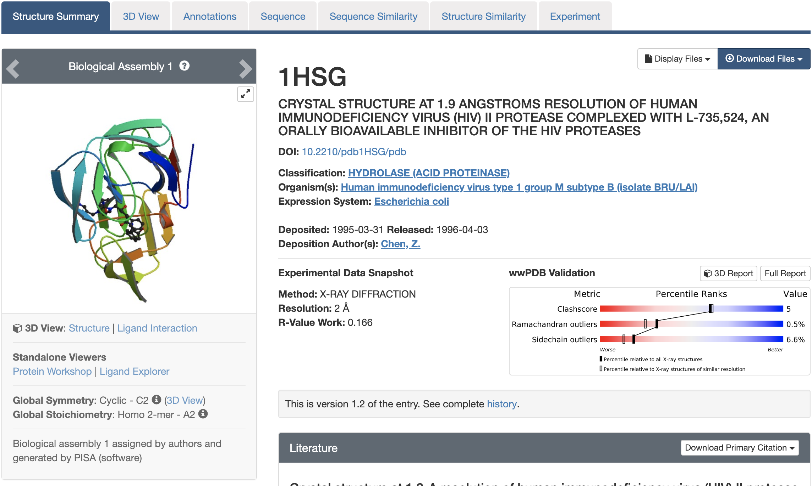

```{r setup, include=FALSE}
knitr::opts_chunk$set(echo = TRUE)
```

First, let's check if "bio3d" package is installed. And then, load the packages.
```{r include=FALSE}
if (!require("bio3d")) {
  install.packages("bio3d")
}
if (!require("datapasta")) {
  install.packages("datapasta")
}
```

```{r}
library(bio3d)
library(datapasta)
```


## 1. The PDB database

The [PDB](http://www.rcsb.org) is the main repository for biomolecular structure data. The CSV file from the PDB site (“Analyze” -> “PDB Statistics” > “by Experimental Method and Molecular Type”) contains the information of the current database size.

```{r}
db = read.csv("data/Data Export Summary.csv", row.names = 1)
head(db)
```

With the datapasta package, we can copy the table from the website, and use "Tools" > "Addins" > "Paste as data.frame" to load the data.frame in R, shown below.

```{r}
data.frame(stringsAsFactors=FALSE,
   Experimental.Method = c("X-Ray", "NMR", "Electron Microscopy", "Other",
                           "Multi Method", "Total"),
              Proteins = c(126880, 11062, 2277, 256, 129, 140604),
         Nucleic.Acids = c(2012, 1279, 31, 4, 5, 3331),
    Protein..NA.Complex = c(6547, 259, 800, 6, 2, 7614),
                 Other = c(8, 8, 0, 13, 1, 30),
                 Total = c(135447, 12608, 3108, 279, 137, 151579)
)
```

What proportion of structure are by X-Ray, NMR, Electron Microscopy, Other, Multi Method respectively?
```{r}
(db$Total/sum(db$Total))*100
```

What proportion of structures are protein?
```{r}
sum(db$Proteins)/sum(db$Total)*100
```

Type HIV in the PDB website search box, there are 1157 HIV-1 protease structures as of 2019-05-07.

Then search for 1HSG, download the PDBfile, and read it into R.
  
```{r}
pdb = read.pdb("data/1hsg.pdb")
pdb
```

There are 1198 protein residues: 1198, and 128 nonprotein residues - HOH (127), MK1 (1).

```{r}
attributes(pdb)
head(pdb$atom)
pdb$atom[1:2, c("eleno", "elety", "x","y","z")]
pdb$atom$elety[1:2]
plot.bio3d(pdb$atom$b[pdb$calpha], sse=pdb, typ="l", ylab="B-factor")
```

> Q7. What type of R object is pdb$atom? HINT: You can always use the str() function to get a useful summery of any R object.

```{r}
str(pdb$atom)
```

```{r}
pdb$xyz
dim(pdb$xyz)
pdb$xyz[ 1, atom2xyz(1:2) ]
```

Atom selection is done via the function **atom.select**

```{r}
inds = atom.select(pdb,"protein")
pdb$atom[inds$atom,]
inds = atom.select(pdb,"ligand")
rmarkdown::paged_table(pdb$atom[inds$atom,])
```

```{r}
prot.pdb = atom.select (pdb,"protein",value = T)
write.pdb (prot.pdb, file="1hsg_protein.pdb")

lig.pdb = atom.select (pdb,"ligand",value = T)
write.pdb (lig.pdb, file="1hsg_ligand.pdb")
```

## Search and retrieve Adenylate kinase structures

```{r}
aa <- get.seq("1ake_A")
b <- blast.pdb(aa)
hits <- plot(b)
head(hits$pdb.id)
```

```{r}
# Fetch PDBs
files <- get.pdb(hits$pdb.id, path="pdbs", split=TRUE, gzip=TRUE)

# Align structures
pdbs <- pdbaln(files)

# Vector containing PDB codes
ids <- basename.pdb(pdbs$id)

# Draw schematic alignment
plot(pdbs, labels=ids)
```

```{r}
# Calculate sequence conservation
cons <- conserv(pdbs, method="entropy22")

# SSE annotations
sse <- pdbs2sse(pdbs, ind=1, rm.gaps=FALSE)

# Plot conservation per residue
plotb3(cons, sse=sse, ylab="Sequence entropy")
```

```{r}
anno <- pdb.annotate(ids)
print(unique(anno$source))
```

```{r}
# find invariant core
core <- core.find(pdbs)
# superimpose all structures to core
pdbs$xyz = pdbfit(pdbs, core)
# Perform PCA
pc.xray <- pca(pdbs)
# Calculate RMSD
rd <- rmsd(pdbs)
# Structure-based clustering
hc.rd <- hclust(dist(rd))
grps.rd <- cutree(hc.rd, k=3)
plot(pc.xray, 1:2, col="grey50", bg=grps.rd, pch=21, cex=1)
```

