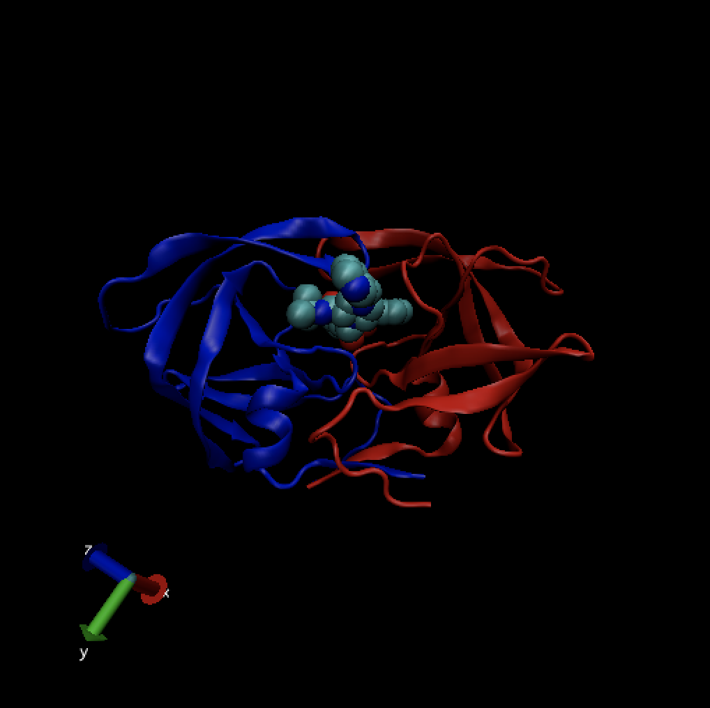

```{r setup, include=FALSE}
knitr::opts_chunk$set(echo = TRUE)
```

First, let's check if "bio3d" package is installed. And then, load the package.
```{r include=FALSE}
if (!require("bio3d")) {
  install.packages("bio3d")
}
if (!require("datapasta")) {
  install.packages("datapasta")
}
```

```{r}
library(bio3d)
library(datapasta)
```

VMD can be downloaded [here](https://www.ks.uiuc.edu/Development/Download/download.cgi).

## 1. The PDB database

The [PDB](http://www.rcsb.org) is the main repository for biomolecular structure data. The CSV file from the PDB site (“Analyze” -> “PDB Statistics” > “by Experimental Method and Molecular Type”) contains the information of the current database size.

```{r}
db = read.csv("data/Data Export Summary.csv", row.names = 1)
head(db)
```

With the datapasta package, we can copy the table from the website, and use "Tools" > "Addins" > "Paste as data.frame" to load the data.frame in R, shown below.

```{r}
data.frame(stringsAsFactors=FALSE,
   Experimental.Method = c("X-Ray", "NMR", "Electron Microscopy", "Other",
                           "Multi Method", "Total"),
              Proteins = c(126880, 11062, 2277, 256, 129, 140604),
         Nucleic.Acids = c(2012, 1279, 31, 4, 5, 3331),
    Protein..NA.Complex = c(6547, 259, 800, 6, 2, 7614),
                 Other = c(8, 8, 0, 13, 1, 30),
                 Total = c(135447, 12608, 3108, 279, 137, 151579)
)
```

What proportion of structure are by X-Ray, NMR, Electron Microscopy, Other, Multi Method respectively?
```{r}
(db$Total/sum(db$Total))*100
```

What proportion of structures are protein?
```{r}
sum(db$Proteins)/sum(db$Total)*100
```

Type HIV in the PDB website search box, there are 1157 HIV-1 protease structures as of 2019-05-07.

## 2. VMD molecular viewer

Open VMD, and go to "File > New Molecule". From the new window, click "Browse" and select "1hsg.pdb" file and click "Load".

Play with the parameters. To save it to an image file on disk with VMD Main window, go to "File > Render > Start Rendering". The image looks like below.

  

## 3. Bio3D in R
```{r}
pdb = read.pdb("1hsg")
pdb
```

There are 1198 protein residues: 198, and 128 nonprotein residues - HOH (127), MK1 (1).

To find the attributes of any such object you can use:
```{r}
attributes(pdb)
```

Let's look at the atom attribute.
```{r}
rmarkdown::paged_table(pdb$atom)
```

Use the str() function to check the type of pdb$atom object and get a useful summery of any R object.
```{r}
str(pdb$atom)
```

The xyz coordinate attribute is a numeric matrix with 3N columns (each atom has
three values x, y and z). The number of rows here correspond to the number of models in the
PDB file (typically one for X-ray structures and multiple for NMR structures).
```{r}
pdb$xyz
# Print coordinates for the first xatom
pdb$xyz[ 1, atom2xyz(1)]
```

Atom selection is done via the function **atom.select**. Some common selection strings are "calpha", "cbeta", "backbone", "protein", "notprotein", "ligand", "water", "notwater", "h", and "noh")
```{r}
inds = atom.select(pdb,"ligand")
rmarkdown::paged_table(pdb$atom[inds$atom,])
```

Let's write new PDB files with useful atom selected.
```{r}
prot.pdb = atom.select (pdb,"protein",value = T)
write.pdb (prot.pdb, file="data/1hsg_protein.pdb")

lig.pdb = atom.select (pdb,"ligand",value = T)
write.pdb (lig.pdb, file="data/1hsg_ligand.pdb")
```
