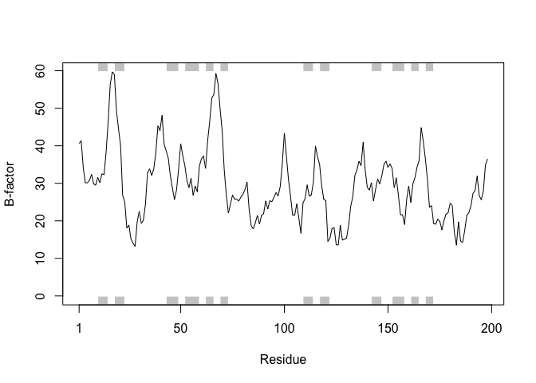
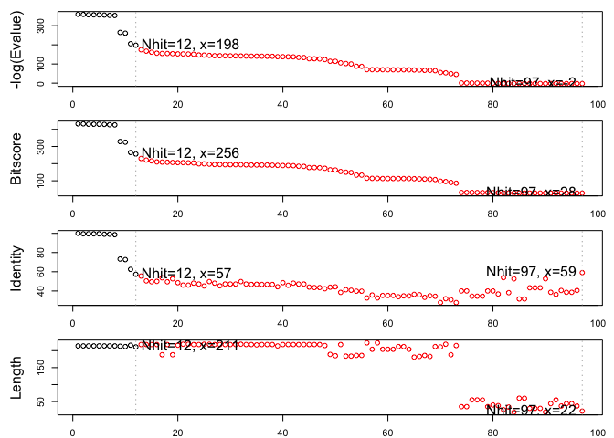
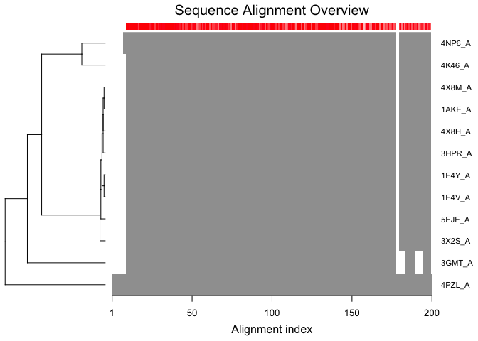
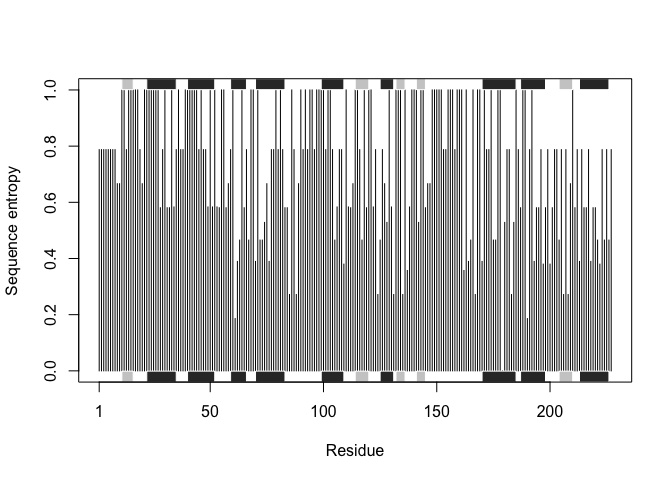
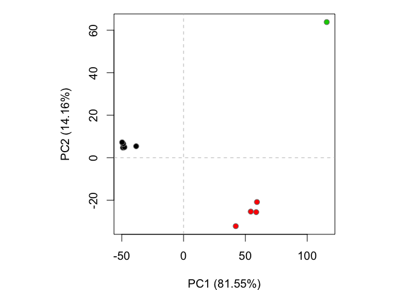

Class 11: Structural Bioinformatics
================
Yi Fu
5/7/2019

## The PDB database

The [PDB](http://www.rcsb.org) is the main repository for biomolecular
structure data.

Here we examine the contents of the PDB:

> Q1: Download a CSV file from the PDB site (accessible from “Analyze”
> -\> “PDB Statistics” \> “by Experimental Method and Molecular Type”.
> Move this CSV file into your RStudio project and determine the
> percentage of structures solved by X-Ray and Electron Microscopy. From
> the website what proportion of structures are protein? Aim to have a
> rendered GitHub document with working code that yields your answers.

``` r
db = read.csv("Data Export Summary.csv", row.names = 1)
head(db)
```

    ##                     Proteins Nucleic.Acids Protein.NA.Complex Other  Total
    ## X-Ray                 126880          2012               6547     8 135447
    ## NMR                    11062          1279                259     8  12608
    ## Electron Microscopy     2277            31                800     0   3108
    ## Other                    256             4                  6    13    279
    ## Multi Method             129             5                  2     1    137

We could also try the datapasta package and copy from the website and
“Addins” \> “Paste as data.frame”

``` r
# if (!require("datapasta")) {
#   install.packages("datapasta")
# }
library("datapasta")
```

``` r
## Use copy and paste
# data.frame(stringsAsFactors=FALSE,
#    Experimental.Method = c("X-Ray", "NMR", "Electron Microscopy", "Other",
#                            "Multi Method", "Total"),
#               Proteins = c(126880, 11062, 2277, 256, 129, 140604),
#          Nucleic.Acids = c(2012, 1279, 31, 4, 5, 3331),
#     Protein/NA.Complex = c(6547, 259, 800, 6, 2, 7614),
#                  Other = c(8, 8, 0, 13, 1, 30),
#                  Total = c(135447, 12608, 3108, 279, 137, 151579)
# )
```

How many are X=Ray, etc…

``` r
(db$Total/sum(db$Total))*100
```

    ## [1] 89.35736481  8.31777489  2.05041595  0.18406244  0.09038191

what proportion of structures are protein?

``` r
sum(db$Proteins)/sum(db$Total)*100
```

    ## [1] 92.75955

> Q2: Type HIV in the PDB website search box on the home page and
> determine how many HIV-1 protease structures are in the current PDB?

There are 1157 as of 2019-05-07 See:
<http://www.rcsb.org/pdb/results/results.do?tabtoshow=Current&qrid=4C97A937>

Reading PDB file data into R

``` r
if (!require("bio3d")) {
  install.packages("bio3d")
}
```

    ## Loading required package: bio3d

``` r
library(bio3d)
```

``` r
pdb = read.pdb("1hsg.pdb")
pdb
```

    ## 
    ##  Call:  read.pdb(file = "1hsg.pdb")
    ## 
    ##    Total Models#: 1
    ##      Total Atoms#: 1686,  XYZs#: 5058  Chains#: 2  (values: A B)
    ## 
    ##      Protein Atoms#: 1514  (residues/Calpha atoms#: 198)
    ##      Nucleic acid Atoms#: 0  (residues/phosphate atoms#: 0)
    ## 
    ##      Non-protein/nucleic Atoms#: 172  (residues: 128)
    ##      Non-protein/nucleic resid values: [ HOH (127), MK1 (1) ]
    ## 
    ##    Protein sequence:
    ##       PQITLWQRPLVTIKIGGQLKEALLDTGADDTVLEEMSLPGRWKPKMIGGIGGFIKVRQYD
    ##       QILIEICGHKAIGTVLVGPTPVNIIGRNLLTQIGCTLNFPQITLWQRPLVTIKIGGQLKE
    ##       ALLDTGADDTVLEEMSLPGRWKPKMIGGIGGFIKVRQYDQILIEICGHKAIGTVLVGPTP
    ##       VNIIGRNLLTQIGCTLNF
    ## 
    ## + attr: atom, xyz, seqres, helix, sheet,
    ##         calpha, remark, call

> Q6. How many amino acid residues are there in this pdb object and what
> are the two nonprotein residues? \#\#\#\# protein residues: 1198.
> nonprotein residues: HOH (127), MK1 (1).

``` r
attributes(pdb)
```

    ## $names
    ## [1] "atom"   "xyz"    "seqres" "helix"  "sheet"  "calpha" "remark" "call"  
    ## 
    ## $class
    ## [1] "pdb" "sse"

``` r
head(pdb$atom)
```

    ##   type eleno elety  alt resid chain resno insert      x      y     z o
    ## 1 ATOM     1     N <NA>   PRO     A     1   <NA> 29.361 39.686 5.862 1
    ## 2 ATOM     2    CA <NA>   PRO     A     1   <NA> 30.307 38.663 5.319 1
    ## 3 ATOM     3     C <NA>   PRO     A     1   <NA> 29.760 38.071 4.022 1
    ## 4 ATOM     4     O <NA>   PRO     A     1   <NA> 28.600 38.302 3.676 1
    ## 5 ATOM     5    CB <NA>   PRO     A     1   <NA> 30.508 37.541 6.342 1
    ## 6 ATOM     6    CG <NA>   PRO     A     1   <NA> 29.296 37.591 7.162 1
    ##       b segid elesy charge
    ## 1 38.10  <NA>     N   <NA>
    ## 2 40.62  <NA>     C   <NA>
    ## 3 42.64  <NA>     C   <NA>
    ## 4 43.40  <NA>     O   <NA>
    ## 5 37.87  <NA>     C   <NA>
    ## 6 38.40  <NA>     C   <NA>

``` r
pdb$atom[1:2, c("eleno", "elety", "x","y","z")]
```

    ##   eleno elety      x      y     z
    ## 1     1     N 29.361 39.686 5.862
    ## 2     2    CA 30.307 38.663 5.319

``` r
pdb$atom$elety[1:2]
```

    ## [1] "N"  "CA"

``` r
plot.bio3d(pdb$atom$b[pdb$calpha], sse=pdb, typ="l", ylab="B-factor")
```

<!-- -->

> Q7. What type of R object is pdb$atom? HINT: You can always use the
> str() function to get a useful summery of any R object.

``` r
str(pdb$atom)
```

    ## 'data.frame':    1686 obs. of  16 variables:
    ##  $ type  : chr  "ATOM" "ATOM" "ATOM" "ATOM" ...
    ##  $ eleno : int  1 2 3 4 5 6 7 8 9 10 ...
    ##  $ elety : chr  "N" "CA" "C" "O" ...
    ##  $ alt   : chr  NA NA NA NA ...
    ##  $ resid : chr  "PRO" "PRO" "PRO" "PRO" ...
    ##  $ chain : chr  "A" "A" "A" "A" ...
    ##  $ resno : int  1 1 1 1 1 1 1 2 2 2 ...
    ##  $ insert: chr  NA NA NA NA ...
    ##  $ x     : num  29.4 30.3 29.8 28.6 30.5 ...
    ##  $ y     : num  39.7 38.7 38.1 38.3 37.5 ...
    ##  $ z     : num  5.86 5.32 4.02 3.68 6.34 ...
    ##  $ o     : num  1 1 1 1 1 1 1 1 1 1 ...
    ##  $ b     : num  38.1 40.6 42.6 43.4 37.9 ...
    ##  $ segid : chr  NA NA NA NA ...
    ##  $ elesy : chr  "N" "C" "C" "O" ...
    ##  $ charge: chr  NA NA NA NA ...

``` r
pdb$xyz
```

    ## 
    ##    Total Frames#: 1
    ##    Total XYZs#:   5058,  (Atoms#:  1686)
    ## 
    ##     [1]  29.361  39.686  5.862  <...>  30.112  17.912  -4.791  [5058] 
    ## 
    ## + attr: Matrix DIM = 1 x 5058

``` r
dim(pdb$xyz)
```

    ## [1]    1 5058

``` r
pdb$xyz[ 1, atom2xyz(1:2) ]
```

    ## [1] 29.361 39.686  5.862 30.307 38.663  5.319

Atom selection is done via the function **atom.select**

``` r
inds = atom.select(pdb,"protein")
pdb$atom[inds$atom,]
```

    ##      type eleno elety  alt resid chain resno insert      x      y       z
    ## 1    ATOM     1     N <NA>   PRO     A     1   <NA> 29.361 39.686   5.862
    ## 2    ATOM     2    CA <NA>   PRO     A     1   <NA> 30.307 38.663   5.319
    ## 3    ATOM     3     C <NA>   PRO     A     1   <NA> 29.760 38.071   4.022
    ## 4    ATOM     4     O <NA>   PRO     A     1   <NA> 28.600 38.302   3.676
    ## 5    ATOM     5    CB <NA>   PRO     A     1   <NA> 30.508 37.541   6.342
    ## 6    ATOM     6    CG <NA>   PRO     A     1   <NA> 29.296 37.591   7.162
    ## 7    ATOM     7    CD <NA>   PRO     A     1   <NA> 28.778 39.015   7.019
    ## 8    ATOM     8     N <NA>   GLN     A     2   <NA> 30.607 37.334   3.305
    ## 9    ATOM     9    CA <NA>   GLN     A     2   <NA> 30.158 36.492   2.199
    ## 10   ATOM    10     C <NA>   GLN     A     2   <NA> 30.298 35.041   2.643
    ## 11   ATOM    11     O <NA>   GLN     A     2   <NA> 31.401 34.494   2.763
    ## 12   ATOM    12    CB <NA>   GLN     A     2   <NA> 30.970 36.738   0.926
    ## 13   ATOM    13    CG <NA>   GLN     A     2   <NA> 30.625 35.783  -0.201
    ## 14   ATOM    14    CD <NA>   GLN     A     2   <NA> 31.184 36.217  -1.549
    ## 15   ATOM    15   OE1 <NA>   GLN     A     2   <NA> 32.006 35.518  -2.156
    ## 16   ATOM    16   NE2 <NA>   GLN     A     2   <NA> 30.684 37.339  -2.061
    ## 17   ATOM    17     N <NA>   ILE     A     3   <NA> 29.160 34.436   2.919
    ## 18   ATOM    18    CA <NA>   ILE     A     3   <NA> 29.123 33.098   3.397
    ## 19   ATOM    19     C <NA>   ILE     A     3   <NA> 28.968 32.155   2.198
    ## 20   ATOM    20     O <NA>   ILE     A     3   <NA> 28.088 32.330   1.368
    ## 21   ATOM    21    CB <NA>   ILE     A     3   <NA> 27.977 32.995   4.409
    ## 22   ATOM    22   CG1 <NA>   ILE     A     3   <NA> 28.341 33.820   5.652
    ## 23   ATOM    23   CG2 <NA>   ILE     A     3   <NA> 27.692 31.548   4.745
    ## 24   ATOM    24   CD1 <NA>   ILE     A     3   <NA> 27.264 33.884   6.696
    ## 25   ATOM    25     N <NA>   THR     A     4   <NA> 29.891 31.210   2.066
    ## 26   ATOM    26    CA <NA>   THR     A     4   <NA> 29.774 30.143   1.062
    ## 27   ATOM    27     C <NA>   THR     A     4   <NA> 28.986 28.975   1.658
    ## 28   ATOM    28     O <NA>   THR     A     4   <NA> 28.690 28.948   2.875
    ## 29   ATOM    29    CB <NA>   THR     A     4   <NA> 31.165 29.618   0.634
    ## 30   ATOM    30   OG1 <NA>   THR     A     4   <NA> 31.866 29.209   1.815
    ## 31   ATOM    31   CG2 <NA>   THR     A     4   <NA> 31.980 30.688  -0.085
    ## 32   ATOM    32     N <NA>   LEU     A     5   <NA> 28.641 28.019   0.803
    ## 33   ATOM    33    CA <NA>   LEU     A     5   <NA> 27.644 27.003   1.144
    ## 34   ATOM    34     C <NA>   LEU     A     5   <NA> 28.204 25.559   1.071
    ## 35   ATOM    35     O <NA>   LEU     A     5   <NA> 27.446 24.583   0.969
    ## 36   ATOM    36    CB <NA>   LEU     A     5   <NA> 26.411 27.139   0.226
    ## 37   ATOM    37    CG <NA>   LEU     A     5   <NA> 25.676 28.479   0.352
    ## 38   ATOM    38   CD1 <NA>   LEU     A     5   <NA> 24.624 28.624  -0.753
    ## 39   ATOM    39   CD2 <NA>   LEU     A     5   <NA> 25.088 28.590   1.745
    ## 40   ATOM    40     N <NA>   TRP     A     6   <NA> 29.528 25.436   1.146
    ## 41   ATOM    41    CA <NA>   TRP     A     6   <NA> 30.177 24.150   1.279
    ## 42   ATOM    42     C <NA>   TRP     A     6   <NA> 29.837 23.488   2.611
    ## 43   ATOM    43     O <NA>   TRP     A     6   <NA> 29.706 22.271   2.673
    ## 44   ATOM    44    CB <NA>   TRP     A     6   <NA> 31.685 24.301   1.109
    ## 45   ATOM    45    CG <NA>   TRP     A     6   <NA> 32.152 24.955  -0.189
    ## 46   ATOM    46   CD1 <NA>   TRP     A     6   <NA> 32.681 26.216  -0.345
    ## 47   ATOM    47   CD2 <NA>   TRP     A     6   <NA> 32.274 24.314  -1.478
    ## 48   ATOM    48   NE1 <NA>   TRP     A     6   <NA> 33.102 26.385  -1.655
    ## 49   ATOM    49   CE2 <NA>   TRP     A     6   <NA> 32.864 25.258  -2.369
    ## 50   ATOM    50   CE3 <NA>   TRP     A     6   <NA> 31.949 23.035  -1.986
    ## 51   ATOM    51   CZ2 <NA>   TRP     A     6   <NA> 33.093 24.968  -3.717
    ## 52   ATOM    52   CZ3 <NA>   TRP     A     6   <NA> 32.195 22.755  -3.294
    ## 53   ATOM    53   CH2 <NA>   TRP     A     6   <NA> 32.754 23.722  -4.169
    ## 54   ATOM    54     N <NA>   GLN     A     7   <NA> 29.667 24.280   3.667
    ## 55   ATOM    55    CA <NA>   GLN     A     7   <NA> 29.141 23.799   4.960
    ## 56   ATOM    56     C <NA>   GLN     A     7   <NA> 27.747 24.395   5.208
    ## 57   ATOM    57     O <NA>   GLN     A     7   <NA> 27.349 25.330   4.547
    ## 58   ATOM    58    CB <NA>   GLN     A     7   <NA> 30.072 24.227   6.100
    ## 59   ATOM    59    CG <NA>   GLN     A     7   <NA> 31.512 23.694   5.995
    ## 60   ATOM    60    CD <NA>   GLN     A     7   <NA> 32.521 24.750   5.469
    ## 61   ATOM    61   OE1 <NA>   GLN     A     7   <NA> 32.666 25.860   6.038
    ## 62   ATOM    62   NE2 <NA>   GLN     A     7   <NA> 33.268 24.374   4.419
    ## 63   ATOM    63     N <NA>   ARG     A     8   <NA> 26.992 23.877   6.169
    ## 64   ATOM    64    CA <NA>   ARG     A     8   <NA> 25.757 24.566   6.593
    ## 65   ATOM    65     C <NA>   ARG     A     8   <NA> 26.029 26.025   6.996
    ## 66   ATOM    66     O <NA>   ARG     A     8   <NA> 26.947 26.291   7.775
    ## 67   ATOM    67    CB <NA>   ARG     A     8   <NA> 25.087 23.849   7.776
    ## 68   ATOM    68    CG <NA>   ARG     A     8   <NA> 24.646 22.409   7.505
    ## 69   ATOM    69    CD <NA>   ARG     A     8   <NA> 23.728 21.896   8.637
    ## 70   ATOM    70    NE <NA>   ARG     A     8   <NA> 22.952 20.730   8.230
    ## 71   ATOM    71    CZ <NA>   ARG     A     8   <NA> 22.367 19.871   9.064
    ## 72   ATOM    72   NH1 <NA>   ARG     A     8   <NA> 22.376 20.074  10.370
    ## 73   ATOM    73   NH2 <NA>   ARG     A     8   <NA> 21.776 18.789   8.589
    ## 74   ATOM    74     N <NA>   PRO     A     9   <NA> 25.123 26.955   6.645
    ## 75   ATOM    75    CA <NA>   PRO     A     9   <NA> 25.491 28.352   6.938
    ## 76   ATOM    76     C <NA>   PRO     A     9   <NA> 25.127 28.763   8.364
    ## 77   ATOM    77     O <NA>   PRO     A     9   <NA> 24.136 29.472   8.578
    ## 78   ATOM    78    CB <NA>   PRO     A     9   <NA> 24.719 29.176   5.916
    ## 79   ATOM    79    CG <NA>   PRO     A     9   <NA> 23.625 28.254   5.407
    ## 80   ATOM    80    CD <NA>   PRO     A     9   <NA> 24.096 26.855   5.591
    ## 81   ATOM    81     N <NA>   LEU     A    10   <NA> 25.905 28.285   9.330
    ## 82   ATOM    82    CA <NA>   LEU     A    10   <NA> 25.653 28.510  10.750
    ## 83   ATOM    83     C <NA>   LEU     A    10   <NA> 26.383 29.770  11.208
    ## 84   ATOM    84     O <NA>   LEU     A    10   <NA> 27.567 29.927  10.938
    ## 85   ATOM    85    CB <NA>   LEU     A    10   <NA> 26.120 27.284  11.573
    ## 86   ATOM    86    CG <NA>   LEU     A    10   <NA> 25.161 26.082  11.544
    ## 87   ATOM    87   CD1 <NA>   LEU     A    10   <NA> 25.895 24.743  11.662
    ## 88   ATOM    88   CD2 <NA>   LEU     A    10   <NA> 24.206 26.196  12.696
    ## 89   ATOM    89     N <NA>   VAL     A    11   <NA> 25.667 30.672  11.872
    ## 90   ATOM    90    CA <NA>   VAL     A    11   <NA> 26.267 31.854  12.497
    ## 91   ATOM    91     C <NA>   VAL     A    11   <NA> 25.818 31.957  13.955
    ## 92   ATOM    92     O <NA>   VAL     A    11   <NA> 24.929 31.184  14.402
    ## 93   ATOM    93    CB <NA>   VAL     A    11   <NA> 25.824 33.131  11.791
    ## 94   ATOM    94   CG1 <NA>   VAL     A    11   <NA> 26.270 33.089  10.323
    ## 95   ATOM    95   CG2 <NA>   VAL     A    11   <NA> 24.333 33.275  11.879
    ## 96   ATOM    96     N <NA>   THR     A    12   <NA> 26.397 32.913  14.700
    ## 97   ATOM    97    CA <NA>   THR     A    12   <NA> 26.001 33.143  16.102
    ## 98   ATOM    98     C <NA>   THR     A    12   <NA> 24.915 34.200  16.204
    ## 99   ATOM    99     O <NA>   THR     A    12   <NA> 25.010 35.279  15.610
    ## 100  ATOM   100    CB <NA>   THR     A    12   <NA> 27.201 33.565  16.998
    ## 101  ATOM   101   OG1 <NA>   THR     A    12   <NA> 28.330 32.709  16.751
    ## 102  ATOM   102   CG2 <NA>   THR     A    12   <NA> 26.827 33.430  18.450
    ## 103  ATOM   103     N <NA>   ILE     A    13   <NA> 23.848 33.868  16.909
    ## 104  ATOM   104    CA <NA>   ILE     A    13   <NA> 22.842 34.875  17.206
    ## 105  ATOM   105     C <NA>   ILE     A    13   <NA> 22.770 35.114  18.707
    ## 106  ATOM   106     O <NA>   ILE     A    13   <NA> 23.328 34.363  19.500
    ## 107  ATOM   107    CB <NA>   ILE     A    13   <NA> 21.413 34.460  16.661
    ## 108  ATOM   108   CG1 <NA>   ILE     A    13   <NA> 20.878 33.229  17.431
    ## 109  ATOM   109   CG2 <NA>   ILE     A    13   <NA> 21.510 34.194  15.162
    ## 110  ATOM   110   CD1 <NA>   ILE     A    13   <NA> 19.353 33.201  17.603
    ## 111  ATOM   111     N <NA>   LYS     A    14   <NA> 22.106 36.199  19.087
    ## 112  ATOM   112    CA <NA>   LYS     A    14   <NA> 21.894 36.545  20.492
    ## 113  ATOM   113     C <NA>   LYS     A    14   <NA> 20.442 36.943  20.615
    ## 114  ATOM   114     O <NA>   LYS     A    14   <NA> 19.960 37.808  19.873
    ## 115  ATOM   115    CB <NA>   LYS     A    14   <NA> 22.777 37.724  20.896
    ## 116  ATOM   116    CG <NA>   LYS     A    14   <NA> 22.727 38.056  22.383
    ## 117  ATOM   117    CD <NA>   LYS     A    14   <NA> 23.270 39.450  22.678
    ## 118  ATOM   118    CE <NA>   LYS     A    14   <NA> 24.814 39.490  22.755
    ## 119  ATOM   119    NZ <NA>   LYS     A    14   <NA> 25.394 40.891  22.572
    ## 120  ATOM   120     N <NA>   ILE     A    15   <NA> 19.739 36.267  21.512
    ## 121  ATOM   121    CA <NA>   ILE     A    15   <NA> 18.345 36.563  21.813
    ## 122  ATOM   122     C <NA>   ILE     A    15   <NA> 18.224 36.327  23.316
    ## 123  ATOM   123     O <NA>   ILE     A    15   <NA> 18.886 35.449  23.864
    ## 124  ATOM   124    CB <NA>   ILE     A    15   <NA> 17.380 35.592  21.022
    ## 125  ATOM   125   CG1 <NA>   ILE     A    15   <NA> 15.935 35.812  21.435
    ## 126  ATOM   126   CG2 <NA>   ILE     A    15   <NA> 17.745 34.137  21.266
    ## 127  ATOM   127   CD1 <NA>   ILE     A    15   <NA> 14.929 35.116  20.526
    ## 128  ATOM   128     N <NA>   GLY     A    16   <NA> 17.446 37.139  24.012
    ## 129  ATOM   129    CA <NA>   GLY     A    16   <NA> 17.356 36.968  25.459
    ## 130  ATOM   130     C <NA>   GLY     A    16   <NA> 18.711 36.871  26.160
    ## 131  ATOM   131     O <NA>   GLY     A    16   <NA> 18.866 36.162  27.153
    ## 132  ATOM   132     N <NA>   GLY     A    17   <NA> 19.671 37.659  25.697
    ## 133  ATOM   133    CA <NA>   GLY     A    17   <NA> 20.970 37.660  26.340
    ## 134  ATOM   134     C <NA>   GLY     A    17   <NA> 21.680 36.316  26.278
    ## 135  ATOM   135     O <NA>   GLY     A    17   <NA> 22.785 36.163  26.794
    ## 136  ATOM   136     N <NA>   GLN     A    18   <NA> 21.093 35.361  25.572
    ## 137  ATOM   137    CA <NA>   GLN     A    18   <NA> 21.780 34.106  25.263
    ## 138  ATOM   138     C <NA>   GLN     A    18   <NA> 22.500 34.159  23.907
    ## 139  ATOM   139     O <NA>   GLN     A    18   <NA> 21.937 34.624  22.915
    ## 140  ATOM   140    CB <NA>   GLN     A    18   <NA> 20.776 32.957  25.228
    ## 141  ATOM   141    CG <NA>   GLN     A    18   <NA> 19.599 33.116  26.176
    ## 142  ATOM   142    CD <NA>   GLN     A    18   <NA> 19.556 31.997  27.179
    ## 143  ATOM   143   OE1 <NA>   GLN     A    18   <NA> 20.393 31.944  28.082
    ## 144  ATOM   144   NE2 <NA>   GLN     A    18   <NA> 18.647 31.035  26.975
    ## 145  ATOM   145     N <NA>   LEU     A    19   <NA> 23.733 33.672  23.848
    ## 146  ATOM   146    CA <NA>   LEU     A    19   <NA> 24.334 33.365  22.552
    ## 147  ATOM   147     C <NA>   LEU     A    19   <NA> 23.896 31.963  22.106
    ## 148  ATOM   148     O <NA>   LEU     A    19   <NA> 23.975 31.020  22.863
    ## 149  ATOM   149    CB <NA>   LEU     A    19   <NA> 25.869 33.432  22.625
    ## 150  ATOM   150    CG <NA>   LEU     A    19   <NA> 26.561 34.761  22.968
    ## 151  ATOM   151   CD1 <NA>   LEU     A    19   <NA> 28.007 34.629  22.620
    ## 152  ATOM   152   CD2 <NA>   LEU     A    19   <NA> 25.983 35.913  22.194
    ## 153  ATOM   153     N <NA>   LYS     A    20   <NA> 23.416 31.855  20.876
    ## 154  ATOM   154    CA <NA>   LYS     A    20   <NA> 23.006 30.584  20.266
    ## 155  ATOM   155     C <NA>   LYS     A    20   <NA> 23.626 30.463  18.874
    ## 156  ATOM   156     O <NA>   LYS     A    20   <NA> 24.024 31.460  18.283
    ## 157  ATOM   157    CB <NA>   LYS     A    20   <NA> 21.494 30.523  20.107
    ## 158  ATOM   158    CG <NA>   LYS     A    20   <NA> 20.778 29.875  21.264
    ## 159  ATOM   159    CD <NA>   LYS     A    20   <NA> 19.868 30.857  21.939
    ## 160  ATOM   160    CE <NA>   LYS     A    20   <NA> 19.112 30.168  23.043
    ## 161  ATOM   161    NZ <NA>   LYS     A    20   <NA> 18.467 28.892  22.571
    ## 162  ATOM   162     N <NA>   GLU     A    21   <NA> 23.725 29.250  18.342
    ## 163  ATOM   163    CA <NA>   GLU     A    21   <NA> 24.053 29.117  16.931
    ## 164  ATOM   164     C <NA>   GLU     A    21   <NA> 22.822 28.761  16.150
    ## 165  ATOM   165     O <NA>   GLU     A    21   <NA> 21.879 28.136  16.672
    ## 166  ATOM   166    CB <NA>   GLU     A    21   <NA> 25.197 28.130  16.679
    ## 167  ATOM   167    CG <NA>   GLU     A    21   <NA> 25.035 26.716  17.168
    ## 168  ATOM   168    CD <NA>   GLU     A    21   <NA> 25.878 25.743  16.334
    ## 169  ATOM   169   OE1 <NA>   GLU     A    21   <NA> 27.022 26.130  15.972
    ## 170  ATOM   170   OE2 <NA>   GLU     A    21   <NA> 25.379 24.639  15.983
    ## 171  ATOM   171     N <NA>   ALA     A    22   <NA> 22.778 29.268  14.927
    ## 172  ATOM   172    CA <NA>   ALA     A    22   <NA> 21.553 29.189  14.165
    ## 173  ATOM   173     C <NA>   ALA     A    22   <NA> 21.870 29.183  12.682
    ## 174  ATOM   174     O <NA>   ALA     A    22   <NA> 22.975 29.578  12.252
    ## 175  ATOM   175    CB <NA>   ALA     A    22   <NA> 20.625 30.359  14.524
    ## 176  ATOM   176     N <NA>   LEU     A    23   <NA> 20.893 28.726  11.903
    ## 177  ATOM   177    CA <NA>   LEU     A    23   <NA> 21.047 28.473  10.476
    ## 178  ATOM   178     C <NA>   LEU     A    23   <NA> 20.381 29.596   9.664
    ## 179  ATOM   179     O <NA>   LEU     A    23   <NA> 19.231 29.943   9.912
    ## 180  ATOM   180    CB <NA>   LEU     A    23   <NA> 20.382 27.135  10.174
    ## 181  ATOM   181    CG <NA>   LEU     A    23   <NA> 20.532 26.573   8.786
    ## 182  ATOM   182   CD1 <NA>   LEU     A    23   <NA> 21.939 26.039   8.621
    ## 183  ATOM   183   CD2 <NA>   LEU     A    23   <NA> 19.490 25.490   8.627
    ## 184  ATOM   184     N <NA>   LEU     A    24   <NA> 21.122 30.163   8.715
    ## 185  ATOM   185    CA <NA>   LEU     A    24   <NA> 20.617 31.144   7.775
    ## 186  ATOM   186     C <NA>   LEU     A    24   <NA> 19.940 30.412   6.617
    ## 187  ATOM   187     O <NA>   LEU     A    24   <NA> 20.567 29.833   5.740
    ## 188  ATOM   188    CB <NA>   LEU     A    24   <NA> 21.767 32.023   7.262
    ## 189  ATOM   189    CG <NA>   LEU     A    24   <NA> 22.647 32.673   8.359
    ## 190  ATOM   190   CD1 <NA>   LEU     A    24   <NA> 23.698 33.581   7.738
    ## 191  ATOM   191   CD2 <NA>   LEU     A    24   <NA> 21.797 33.496   9.368
    ## 192  ATOM   192     N <NA>   ASP     A    25   <NA> 18.626 30.444   6.627
    ## 193  ATOM   193    CA <NA>   ASP     A    25   <NA> 17.853 29.516   5.837
    ## 194  ATOM   194     C <NA>   ASP     A    25   <NA> 16.945 30.292   4.886
    ## 195  ATOM   195     O <NA>   ASP     A    25   <NA> 15.843 30.678   5.237
    ## 196  ATOM   196    CB <NA>   ASP     A    25   <NA> 17.047 28.642   6.811
    ## 197  ATOM   197    CG <NA>   ASP     A    25   <NA> 16.316 27.513   6.146
    ## 198  ATOM   198   OD1 <NA>   ASP     A    25   <NA> 16.236 27.458   4.905
    ## 199  ATOM   199   OD2 <NA>   ASP     A    25   <NA> 15.762 26.696   6.882
    ## 200  ATOM   200     N <NA>   THR     A    26   <NA> 17.364 30.439   3.645
    ## 201  ATOM   201    CA <NA>   THR     A    26   <NA> 16.548 31.148   2.684
    ## 202  ATOM   202     C <NA>   THR     A    26   <NA> 15.302 30.382   2.289
    ## 203  ATOM   203     O <NA>   THR     A    26   <NA> 14.412 30.939   1.615
    ## 204  ATOM   204    CB <NA>   THR     A    26   <NA> 17.328 31.419   1.447
    ## 205  ATOM   205   OG1 <NA>   THR     A    26   <NA> 17.693 30.177   0.863
    ## 206  ATOM   206   CG2 <NA>   THR     A    26   <NA> 18.601 32.197   1.773
    ## 207  ATOM   207     N <NA>   GLY     A    27   <NA> 15.213 29.111   2.702
    ## 208  ATOM   208    CA <NA>   GLY     A    27   <NA> 14.043 28.331   2.349
    ## 209  ATOM   209     C <NA>   GLY     A    27   <NA> 12.958 28.456   3.394
    ## 210  ATOM   210     O <NA>   GLY     A    27   <NA> 11.832 28.015   3.171
    ## 211  ATOM   211     N <NA>   ALA     A    28   <NA> 13.301 28.967   4.569
    ## 212  ATOM   212    CA <NA>   ALA     A    28   <NA> 12.324 29.192   5.642
    ## 213  ATOM   213     C <NA>   ALA     A    28   <NA> 11.629 30.567   5.554
    ## 214  ATOM   214     O <NA>   ALA     A    28   <NA> 12.303 31.618   5.504
    ## 215  ATOM   215    CB <NA>   ALA     A    28   <NA> 13.031 29.084   6.978
    ## 216  ATOM   216     N <NA>   ASP     A    29   <NA> 10.296 30.560   5.587
    ## 217  ATOM   217    CA <NA>   ASP     A    29   <NA>  9.512 31.798   5.651
    ## 218  ATOM   218     C <NA>   ASP     A    29   <NA>  9.632 32.481   6.994
    ## 219  ATOM   219     O <NA>   ASP     A    29   <NA>  9.671 33.706   7.056
    ## 220  ATOM   220    CB <NA>   ASP     A    29   <NA>  8.029 31.534   5.402
    ## 221  ATOM   221    CG <NA>   ASP     A    29   <NA>  7.752 31.004   4.015
    ## 222  ATOM   222   OD1 <NA>   ASP     A    29   <NA>  8.591 31.192   3.104
    ## 223  ATOM   223   OD2 <NA>   ASP     A    29   <NA>  6.661 30.410   3.833
    ## 224  ATOM   224     N <NA>   ASP     A    30   <NA>  9.698 31.685   8.062
    ## 225  ATOM   225    CA <NA>   ASP     A    30   <NA>  9.718 32.168   9.444
    ## 226  ATOM   226     C <NA>   ASP     A    30   <NA> 10.988 31.819  10.163
    ## 227  ATOM   227     O <NA>   ASP     A    30   <NA> 11.818 31.072   9.679
    ## 228  ATOM   228    CB <NA>   ASP     A    30   <NA>  8.549 31.585  10.214
    ## 229  ATOM   229    CG <NA>   ASP     A    30   <NA>  7.254 31.916   9.579
    ## 230  ATOM   230   OD1 <NA>   ASP     A    30   <NA>  6.951 33.118   9.473
    ## 231  ATOM   231   OD2 <NA>   ASP     A    30   <NA>  6.561 31.008   9.099
    ## 232  ATOM   232     N <NA>   THR     A    31   <NA> 11.161 32.408  11.326
    ## 233  ATOM   233    CA <NA>   THR     A    31   <NA> 12.248 32.053  12.215
    ## 234  ATOM   234     C <NA>   THR     A    31   <NA> 11.707 31.128  13.318
    ## 235  ATOM   235     O <NA>   THR     A    31   <NA> 10.660 31.408  13.910
    ## 236  ATOM   236    CB <NA>   THR     A    31   <NA> 12.896 33.338  12.795
    ## 237  ATOM   237   OG1 <NA>   THR     A    31   <NA> 13.451 34.082  11.707
    ## 238  ATOM   238   CG2 <NA>   THR     A    31   <NA> 14.027 32.992  13.816
    ## 239  ATOM   239     N <NA>   VAL     A    32   <NA> 12.390 30.005  13.537
    ## 240  ATOM   240    CA <NA>   VAL     A    32   <NA> 11.893 28.983  14.419
    ## 241  ATOM   241     C <NA>   VAL     A    32   <NA> 13.036 28.655  15.292
    ## 242  ATOM   242     O <NA>   VAL     A    32   <NA> 14.067 28.221  14.821
    ## 243  ATOM   243    CB <NA>   VAL     A    32   <NA> 11.528 27.683  13.690
    ## 244  ATOM   244   CG1 <NA>   VAL     A    32   <NA> 10.656 26.825  14.592
    ## 245  ATOM   245   CG2 <NA>   VAL     A    32   <NA> 10.805 27.963  12.423
    ## 246  ATOM   246     N <NA>   LEU     A    33   <NA> 12.899 28.904  16.576
    ## 247  ATOM   247    CA <NA>   LEU     A    33   <NA> 13.996 28.594  17.500
    ## 248  ATOM   248     C <NA>   LEU     A    33   <NA> 13.571 27.454  18.396
    ## 249  ATOM   249     O <NA>   LEU     A    33   <NA> 12.363 27.234  18.612
    ## 250  ATOM   250    CB <NA>   LEU     A    33   <NA> 14.337 29.799  18.375
    ## 251  ATOM   251    CG <NA>   LEU     A    33   <NA> 14.849 31.061  17.691
    ## 252  ATOM   252   CD1 <NA>   LEU     A    33   <NA> 15.091 32.156  18.733
    ## 253  ATOM   253   CD2 <NA>   LEU     A    33   <NA> 16.139 30.718  16.927
    ## 254  ATOM   254     N <NA>   GLU     A    34   <NA> 14.568 26.722  18.889
    ## 255  ATOM   255    CA <NA>   GLU     A    34   <NA> 14.390 25.650  19.874
    ## 256  ATOM   256     C <NA>   GLU     A    34   <NA> 13.739 26.125  21.160
    ## 257  ATOM   257     O <NA>   GLU     A    34   <NA> 13.982 27.222  21.618
    ## 258  ATOM   258    CB <NA>   GLU     A    34   <NA> 15.727 25.007  20.190
    ## 259  ATOM   259    CG <NA>   GLU     A    34   <NA> 16.297 24.250  18.988
    ## 260  ATOM   260    CD <NA>   GLU     A    34   <NA> 17.726 23.801  19.191
    ## 261  ATOM   261   OE1 <NA>   GLU     A    34   <NA> 18.134 23.657  20.375
    ## 262  ATOM   262   OE2 <NA>   GLU     A    34   <NA> 18.443 23.614  18.182
    ## 263  ATOM   263     N <NA>   GLU     A    35   <NA> 12.865 25.288  21.703
    ## 264  ATOM   264    CA <NA>   GLU     A    35   <NA> 12.183 25.482  22.981
    ## 265  ATOM   265     C <NA>   GLU     A    35   <NA> 12.971 26.329  23.986
    ## 266  ATOM   266     O <NA>   GLU     A    35   <NA> 13.981 25.861  24.497
    ## 267  ATOM   267    CB <NA>   GLU     A    35   <NA> 11.941 24.114  23.581
    ## 268  ATOM   268    CG <NA>   GLU     A    35   <NA> 10.800 24.049  24.516
    ## 269  ATOM   269    CD <NA>   GLU     A    35   <NA>  9.489 24.067  23.809
    ## 270  ATOM   270   OE1 <NA>   GLU     A    35   <NA>  9.134 23.066  23.120
    ## 271  ATOM   271   OE2 <NA>   GLU     A    35   <NA>  8.758 25.047  24.035
    ## 272  ATOM   272     N <NA>   MET     A    36   <NA> 12.495 27.556  24.269
    ## 273  ATOM   273    CA <NA>   MET     A    36   <NA> 13.101 28.479  25.261
    ## 274  ATOM   274     C <NA>   MET     A    36   <NA> 12.013 29.437  25.755
    ## 275  ATOM   275     O <NA>   MET     A    36   <NA> 10.969 29.535  25.133
    ## 276  ATOM   276    CB <NA>   MET     A    36   <NA> 14.216 29.306  24.621
    ## 277  ATOM   277    CG <NA>   MET     A    36   <NA> 13.741 30.341  23.590
    ## 278  ATOM   278    SD <NA>   MET     A    36   <NA> 15.123 31.051  22.667
    ## 279  ATOM   279    CE <NA>   MET     A    36   <NA> 15.783 32.224  23.828
    ## 280  ATOM   280     N <NA>   SER     A    37   <NA> 12.249 30.179  26.852
    ## 281  ATOM   281    CA <NA>   SER     A    37   <NA> 11.163 31.036  27.460
    ## 282  ATOM   282     C <NA>   SER     A    37   <NA> 11.347 32.442  26.960
    ## 283  ATOM   283     O <NA>   SER     A    37   <NA> 12.475 32.929  27.007
    ## 284  ATOM   284    CB <NA>   SER     A    37   <NA> 11.300 31.071  28.976
    ## 285  ATOM   285    OG <NA>   SER     A    37   <NA>  9.948 31.148  29.559
    ## 286  ATOM   286     N <NA>   LEU     A    38   <NA> 10.330 33.112  26.459
    ## 287  ATOM   287    CA <NA>   LEU     A    38   <NA> 10.566 34.476  26.033
    ## 288  ATOM   288     C <NA>   LEU     A    38   <NA>  9.594 35.375  26.756
    ## 289  ATOM   289     O <NA>   LEU     A    38   <NA>  8.616 34.906  27.343
    ## 290  ATOM   290    CB <NA>   LEU     A    38   <NA> 10.409 34.626  24.500
    ## 291  ATOM   291    CG <NA>   LEU     A    38   <NA> 11.559 34.187  23.577
    ## 292  ATOM   292   CD1 <NA>   LEU     A    38   <NA> 11.171 34.399  22.132
    ## 293  ATOM   293   CD2 <NA>   LEU     A    38   <NA> 12.807 34.964  23.875
    ## 294  ATOM   294     N <NA>   PRO     A    39   <NA>  9.929 36.666  26.880
    ## 295  ATOM   295    CA <NA>   PRO     A    39   <NA>  8.980 37.700  27.301
    ## 296  ATOM   296     C <NA>   PRO     A    39   <NA>  7.760 37.785  26.410
    ## 297  ATOM   297     O <NA>   PRO     A    39   <NA>  7.866 37.883  25.194
    ## 298  ATOM   298    CB <NA>   PRO     A    39   <NA>  9.778 38.989  27.220
    ## 299  ATOM   299    CG <NA>   PRO     A    39   <NA> 11.021 38.637  26.370
    ## 300  ATOM   300    CD <NA>   PRO     A    39   <NA> 11.291 37.226  26.725
    ## 301  ATOM   301     N <NA>   GLY     A    40   <NA>  6.601 37.811  27.029
    ## 302  ATOM   302    CA <NA>   GLY     A    40   <NA>  5.419 38.218  26.302
    ## 303  ATOM   303     C <NA>   GLY     A    40   <NA>  4.430 37.094  26.331
    ## 304  ATOM   304     O <NA>   GLY     A    40   <NA>  4.591 36.107  27.055
    ## 305  ATOM   305     N <NA>   ARG     A    41   <NA>  3.289 37.341  25.729
    ## 306  ATOM   306    CA <NA>   ARG     A    41   <NA>  2.382 36.252  25.509
    ## 307  ATOM   307     C <NA>   ARG     A    41   <NA>  2.606 35.713  24.096
    ## 308  ATOM   308     O <NA>   ARG     A    41   <NA>  3.225 36.383  23.273
    ## 309  ATOM   309    CB <NA>   ARG     A    41   <NA>  0.956 36.719  25.748
    ## 310  ATOM   310    CG <NA>   ARG     A    41   <NA>  0.288 36.021  26.959
    ## 311  ATOM   311    CD <NA>   ARG     A    41   <NA>  0.118 36.953  28.169
    ## 312  ATOM   312    NE <NA>   ARG     A    41   <NA>  1.356 37.143  28.933
    ## 313  ATOM   313    CZ <NA>   ARG     A    41   <NA>  1.830 38.332  29.318
    ## 314  ATOM   314   NH1 <NA>   ARG     A    41   <NA>  1.161 39.450  29.040
    ## 315  ATOM   315   NH2 <NA>   ARG     A    41   <NA>  2.973 38.402  29.994
    ## 316  ATOM   316     N <NA>   TRP     A    42   <NA>  2.145 34.493  23.834
    ## 317  ATOM   317    CA <NA>   TRP     A    42   <NA>  2.295 33.862  22.533
    ## 318  ATOM   318     C <NA>   TRP     A    42   <NA>  0.934 33.419  21.959
    ## 319  ATOM   319     O <NA>   TRP     A    42   <NA>  0.031 33.049  22.694
    ## 320  ATOM   320    CB <NA>   TRP     A    42   <NA>  3.207 32.645  22.642
    ## 321  ATOM   321    CG <NA>   TRP     A    42   <NA>  2.946 31.783  23.787
    ## 322  ATOM   322   CD1 <NA>   TRP     A    42   <NA>  3.473 31.896  25.041
    ## 323  ATOM   323   CD2 <NA>   TRP     A    42   <NA>  1.989 30.710  23.857
    ## 324  ATOM   324   NE1 <NA>   TRP     A    42   <NA>  2.882 30.973  25.884
    ## 325  ATOM   325   CE2 <NA>   TRP     A    42   <NA>  1.966 30.246  25.193
    ## 326  ATOM   326   CE3 <NA>   TRP     A    42   <NA>  1.129 30.108  22.909
    ## 327  ATOM   327   CZ2 <NA>   TRP     A    42   <NA>  1.117 29.219  25.618
    ## 328  ATOM   328   CZ3 <NA>   TRP     A    42   <NA>  0.313 29.091  23.334
    ## 329  ATOM   329   CH2 <NA>   TRP     A    42   <NA>  0.305 28.651  24.686
    ## 330  ATOM   330     N <NA>   LYS     A    43   <NA>  0.781 33.465  20.639
    ## 331  ATOM   331    CA <NA>   LYS     A    43   <NA> -0.305 32.776  19.928
    ## 332  ATOM   332     C <NA>   LYS     A    43   <NA>  0.220 31.412  19.477
    ## 333  ATOM   333     O <NA>   LYS     A    43   <NA>  1.400 31.270  19.145
    ## 334  ATOM   334    CB <NA>   LYS     A    43   <NA> -0.739 33.603  18.700
    ## 335  ATOM   335    CG <NA>   LYS     A    43   <NA> -1.311 34.967  19.027
    ## 336  ATOM   336    CD <NA>   LYS     A    43   <NA> -1.066 35.945  17.886
    ## 337  ATOM   337    CE <NA>   LYS     A    43   <NA> -1.726 37.319  18.156
    ## 338  ATOM   338    NZ <NA>   LYS     A    43   <NA> -0.979 38.292  19.067
    ## 339  ATOM   339     N <NA>   PRO     A    44   <NA> -0.601 30.363  19.541
    ## 340  ATOM   340    CA <NA>   PRO     A    44   <NA> -0.088 29.114  18.966
    ## 341  ATOM   341     C <NA>   PRO     A    44   <NA> -0.275 29.085  17.454
    ## 342  ATOM   342     O <NA>   PRO     A    44   <NA> -1.185 29.721  16.929
    ## 343  ATOM   343    CB <NA>   PRO     A    44   <NA> -0.893 28.021  19.667
    ## 344  ATOM   344    CG <NA>   PRO     A    44   <NA> -2.170 28.683  20.012
    ## 345  ATOM   345    CD <NA>   PRO     A    44   <NA> -1.825 30.129  20.325
    ## 346  ATOM   346     N <NA>   LYS     A    45   <NA>  0.586 28.336  16.762
    ## 347  ATOM   347    CA <NA>   LYS     A    45   <NA>  0.634 28.302  15.290
    ## 348  ATOM   348     C <NA>   LYS     A    45   <NA>  1.025 26.869  14.873
    ## 349  ATOM   349     O <NA>   LYS     A    45   <NA>  1.711 26.163  15.608
    ## 350  ATOM   350    CB <NA>   LYS     A    45   <NA>  1.693 29.299  14.799
    ## 351  ATOM   351    CG <NA>   LYS     A    45   <NA>  1.495 29.822  13.396
    ## 352  ATOM   352    CD <NA>   LYS     A    45   <NA>  2.628 30.791  12.986
    ## 353  ATOM   353    CE <NA>   LYS     A    45   <NA>  2.662 31.103  11.471
    ## 354  ATOM   354    NZ <NA>   LYS     A    45   <NA>  1.837 32.301  11.181
    ## 355  ATOM   355     N <NA>   MET     A    46   <NA>  0.570 26.438  13.707
    ## 356  ATOM   356    CA <NA>   MET     A    46   <NA>  1.091 25.232  13.081
    ## 357  ATOM   357     C <NA>   MET     A    46   <NA>  1.899 25.638  11.874
    ## 358  ATOM   358     O <NA>   MET     A    46   <NA>  1.385 26.292  10.965
    ## 359  ATOM   359    CB <NA>   MET     A    46   <NA> -0.047 24.319  12.624
    ## 360  ATOM   360    CG <NA>   MET     A    46   <NA> -0.970 23.867  13.745
    ## 361  ATOM   361    SD <NA>   MET     A    46   <NA> -0.348 22.459  14.681
    ## 362  ATOM   362    CE <NA>   MET     A    46   <NA> -0.585 21.081  13.426
    ## 363  ATOM   363     N <NA>   ILE     A    47   <NA>  3.167 25.258  11.849
    ## 364  ATOM   364    CA <NA>   ILE     A    47   <NA>  3.978 25.464  10.655
    ## 365  ATOM   365     C <NA>   ILE     A    47   <NA>  4.420 24.140  10.114
    ## 366  ATOM   366     O <NA>   ILE     A    47   <NA>  4.667 23.248  10.887
    ## 367  ATOM   367    CB <NA>   ILE     A    47   <NA>  5.234 26.259  10.953
    ## 368  ATOM   368   CG1 <NA>   ILE     A    47   <NA>  5.959 25.628  12.127
    ## 369  ATOM   369   CG2 <NA>   ILE     A    47   <NA>  4.898 27.703  11.148
    ## 370  ATOM   370   CD1 <NA>   ILE     A    47   <NA>  7.369 26.170  12.291
    ## 371  ATOM   371     N <NA>   GLY     A    48   <NA>  4.567 24.042   8.795
    ## 372  ATOM   372    CA <NA>   GLY     A    48   <NA>  4.886 22.777   8.145
    ## 373  ATOM   373     C <NA>   GLY     A    48   <NA>  6.265 22.720   7.521
    ## 374  ATOM   374     O <NA>   GLY     A    48   <NA>  6.723 23.689   6.900
    ## 375  ATOM   375     N <NA>   GLY     A    49   <NA>  7.015 21.688   7.884
    ## 376  ATOM   376    CA <NA>   GLY     A    49   <NA>  8.313 21.471   7.276
    ## 377  ATOM   377     C <NA>   GLY     A    49   <NA>  8.221 20.379   6.232
    ## 378  ATOM   378     O <NA>   GLY     A    49   <NA>  7.177 20.197   5.583
    ## 379  ATOM   379     N <NA>   ILE     A    50   <NA>  9.309 19.619   6.155
    ## 380  ATOM   380    CA <NA>   ILE     A    50   <NA>  9.537 18.544   5.194
    ## 381  ATOM   381     C <NA>   ILE     A    50   <NA>  8.802 17.261   5.658
    ## 382  ATOM   382     O <NA>   ILE     A    50   <NA>  8.143 16.589   4.863
    ## 383  ATOM   383    CB <NA>   ILE     A    50   <NA> 11.095 18.362   5.046
    ## 384  ATOM   384   CG1 <NA>   ILE     A    50   <NA> 11.553 18.874   3.682
    ## 385  ATOM   385   CG2 <NA>   ILE     A    50   <NA> 11.521 16.945   5.317
    ## 386  ATOM   386   CD1 <NA>   ILE     A    50   <NA> 10.910 18.225   2.567
    ## 387  ATOM   387     N <NA>   GLY     A    51   <NA>  8.865 16.952   6.945
    ## 388  ATOM   388    CA <NA>   GLY     A    51   <NA>  8.174 15.771   7.405
    ## 389  ATOM   389     C <NA>   GLY     A    51   <NA>  6.812 16.062   7.983
    ## 390  ATOM   390     O <NA>   GLY     A    51   <NA>  6.408 15.342   8.870
    ## 391  ATOM   391     N <NA>   GLY     A    52   <NA>  6.141 17.132   7.563
    ## 392  ATOM   392    CA <NA>   GLY     A    52   <NA>  4.855 17.480   8.157
    ## 393  ATOM   393     C <NA>   GLY     A    52   <NA>  4.884 18.624   9.170
    ## 394  ATOM   394     O <NA>   GLY     A    52   <NA>  5.873 19.342   9.280
    ## 395  ATOM   395     N <NA>   PHE     A    53   <NA>  3.806 18.788   9.925
    ## 396  ATOM   396    CA <NA>   PHE     A    53   <NA>  3.593 19.996  10.731
    ## 397  ATOM   397     C <NA>   PHE     A    53   <NA>  4.015 19.881  12.194
    ## 398  ATOM   398     O <NA>   PHE     A    53   <NA>  3.930 18.810  12.781
    ## 399  ATOM   399    CB <NA>   PHE     A    53   <NA>  2.121 20.351  10.670
    ## 400  ATOM   400    CG <NA>   PHE     A    53   <NA>  1.760 21.152   9.484
    ## 401  ATOM   401   CD1 <NA>   PHE     A    53   <NA>  1.725 20.567   8.216
    ## 402  ATOM   402   CD2 <NA>   PHE     A    53   <NA>  1.556 22.518   9.607
    ## 403  ATOM   403   CE1 <NA>   PHE     A    53   <NA>  1.500 21.332   7.075
    ## 404  ATOM   404   CE2 <NA>   PHE     A    53   <NA>  1.327 23.302   8.496
    ## 405  ATOM   405    CZ <NA>   PHE     A    53   <NA>  1.290 22.718   7.212
    ## 406  ATOM   406     N <NA>   ILE     A    54   <NA>  4.483 20.969  12.792
    ## 407  ATOM   407    CA <NA>   ILE     A    54   <NA>  4.689 21.005  14.248
    ## 408  ATOM   408     C <NA>   ILE     A    54   <NA>  3.921 22.179  14.858
    ## 409  ATOM   409     O <NA>   ILE     A    54   <NA>  3.575 23.139  14.182
    ## 410  ATOM   410    CB <NA>   ILE     A    54   <NA>  6.199 21.155  14.625
    ## 411  ATOM   411   CG1 <NA>   ILE     A    54   <NA>  6.796 22.408  13.939
    ## 412  ATOM   412   CG2 <NA>   ILE     A    54   <NA>  6.967 19.888  14.203
    ## 413  ATOM   413   CD1 <NA>   ILE     A    54   <NA>  8.110 22.821  14.465
    ## 414  ATOM   414     N <NA>   LYS     A    55   <NA>  3.632 22.095  16.145
    ## 415  ATOM   415    CA <NA>   LYS     A    55   <NA>  2.968 23.196  16.823
    ## 416  ATOM   416     C <NA>   LYS     A    55   <NA>  4.038 24.093  17.449
    ## 417  ATOM   417     O <NA>   LYS     A    55   <NA>  4.949 23.610  18.157
    ## 418  ATOM   418    CB <NA>   LYS     A    55   <NA>  2.021 22.661  17.895
    ## 419  ATOM   419    CG <NA>   LYS     A    55   <NA>  0.974 23.665  18.300
    ## 420  ATOM   420    CD <NA>   LYS     A    55   <NA>  0.006 23.101  19.304
    ## 421  ATOM   421    CE <NA>   LYS     A    55   <NA> -0.580 24.217  20.149
    ## 422  ATOM   422    NZ <NA>   LYS     A    55   <NA>  0.439 24.751  21.104
    ## 423  ATOM   423     N <NA>   VAL     A    56   <NA>  3.953 25.391  17.185
    ## 424  ATOM   424    CA <NA>   VAL     A    56   <NA>  4.927 26.319  17.754
    ## 425  ATOM   425     C <NA>   VAL     A    56   <NA>  4.225 27.378  18.556
    ## 426  ATOM   426     O <NA>   VAL     A    56   <NA>  3.023 27.557  18.455
    ## 427  ATOM   427    CB <NA>   VAL     A    56   <NA>  5.769 27.009  16.663
    ## 428  ATOM   428   CG1 <NA>   VAL     A    56   <NA>  6.791 26.027  16.120
    ## 429  ATOM   429   CG2 <NA>   VAL     A    56   <NA>  4.881 27.551  15.567
    ## 430  ATOM   430     N <NA>   ARG     A    57   <NA>  4.978 28.079  19.377
    ## 431  ATOM   431    CA <NA>   ARG     A    57   <NA>  4.459 29.271  20.026
    ## 432  ATOM   432     C <NA>   ARG     A    57   <NA>  5.038 30.502  19.335
    ## 433  ATOM   433     O <NA>   ARG     A    57   <NA>  6.242 30.596  19.138
    ## 434  ATOM   434    CB <NA>   ARG     A    57   <NA>  4.824 29.245  21.505
    ## 435  ATOM   435    CG <NA>   ARG     A    57   <NA>  4.168 28.102  22.260
    ## 436  ATOM   436    CD <NA>   ARG     A    57   <NA>  4.656 28.068  23.693
    ## 437  ATOM   437    NE <NA>   ARG     A    57   <NA>  6.032 27.573  23.790
    ## 438  ATOM   438    CZ <NA>   ARG     A    57   <NA>  7.027 28.273  24.317
    ## 439  ATOM   439   NH1 <NA>   ARG     A    57   <NA>  6.825 29.532  24.678
    ## 440  ATOM   440   NH2 <NA>   ARG     A    57   <NA>  8.223 27.723  24.467
    ## 441  ATOM   441     N <NA>   GLN     A    58   <NA>  4.171 31.431  18.958
    ## 442  ATOM   442    CA <NA>   GLN     A    58   <NA>  4.570 32.596  18.172
    ## 443  ATOM   443     C <NA>   GLN     A    58   <NA>  4.681 33.818  19.085
    ## 444  ATOM   444     O <NA>   GLN     A    58   <NA>  3.694 34.242  19.683
    ## 445  ATOM   445    CB <NA>   GLN     A    58   <NA>  3.539 32.859  17.094
    ## 446  ATOM   446    CG <NA>   GLN     A    58   <NA>  3.736 34.104  16.321
    ## 447  ATOM   447    CD <NA>   GLN     A    58   <NA>  2.500 34.473  15.541
    ## 448  ATOM   448   OE1 <NA>   GLN     A    58   <NA>  1.530 33.703  15.489
    ## 449  ATOM   449   NE2 <NA>   GLN     A    58   <NA>  2.508 35.651  14.940
    ## 450  ATOM   450     N <NA>   TYR     A    59   <NA>  5.883 34.378  19.196
    ## 451  ATOM   451    CA <NA>   TYR     A    59   <NA>  6.097 35.658  19.896
    ## 452  ATOM   452     C <NA>   TYR     A    59   <NA>  6.304 36.752  18.835
    ## 453  ATOM   453     O <NA>   TYR     A    59   <NA>  6.923 36.513  17.800
    ## 454  ATOM   454    CB <NA>   TYR     A    59   <NA>  7.354 35.588  20.765
    ## 455  ATOM   455    CG <NA>   TYR     A    59   <NA>  7.213 34.624  21.955
    ## 456  ATOM   456   CD1 <NA>   TYR     A    59   <NA>  7.479 33.237  21.805
    ## 457  ATOM   457   CD2 <NA>   TYR     A    59   <NA>  6.795 35.087  23.223
    ## 458  ATOM   458   CE1 <NA>   TYR     A    59   <NA>  7.345 32.365  22.871
    ## 459  ATOM   459   CE2 <NA>   TYR     A    59   <NA>  6.638 34.224  24.268
    ## 460  ATOM   460    CZ <NA>   TYR     A    59   <NA>  6.926 32.869  24.102
    ## 461  ATOM   461    OH <NA>   TYR     A    59   <NA>  6.967 32.076  25.200
    ## 462  ATOM   462     N <NA>   ASP     A    60   <NA>  5.767 37.940  19.049
    ## 463  ATOM   463    CA <NA>   ASP     A    60   <NA>  6.022 39.045  18.125
    ## 464  ATOM   464     C <NA>   ASP     A    60   <NA>  7.025 40.015  18.725
    ## 465  ATOM   465     O <NA>   ASP     A    60   <NA>  7.340 39.951  19.900
    ## 466  ATOM   466    CB <NA>   ASP     A    60   <NA>  4.719 39.777  17.832
    ## 467  ATOM   467    CG <NA>   ASP     A    60   <NA>  3.699 38.899  17.148
    ## 468  ATOM   468   OD1 <NA>   ASP     A    60   <NA>  3.989 38.368  16.050
    ## 469  ATOM   469   OD2 <NA>   ASP     A    60   <NA>  2.570 38.799  17.672
    ## 470  ATOM   470     N <NA>   GLN     A    61   <NA>  7.529 40.913  17.896
    ## 471  ATOM   471    CA <NA>   GLN     A    61   <NA>  8.337 42.060  18.331
    ## 472  ATOM   472     C <NA>   GLN     A    61   <NA>  9.535 41.630  19.179
    ## 473  ATOM   473     O <NA>   GLN     A    61   <NA>  9.777 42.191  20.264
    ## 474  ATOM   474    CB <NA>   GLN     A    61   <NA>  7.471 43.051  19.131
    ## 475  ATOM   475    CG <NA>   GLN     A    61   <NA>  7.718 44.555  18.814
    ## 476  ATOM   476    CD <NA>   GLN     A    61   <NA>  7.182 45.552  19.907
    ## 477  ATOM   477   OE1 <NA>   GLN     A    61   <NA>  7.936 46.461  20.398
    ## 478  ATOM   478   NE2 <NA>   GLN     A    61   <NA>  5.892 45.377  20.306
    ## 479  ATOM   479     N <NA>   ILE     A    62   <NA> 10.283 40.645  18.676
    ## 480  ATOM   480    CA <NA>   ILE     A    62   <NA> 11.484 40.115  19.328
    ## 481  ATOM   481     C <NA>   ILE     A    62   <NA> 12.745 40.584  18.614
    ## 482  ATOM   482     O <NA>   ILE     A    62   <NA> 12.830 40.485  17.396
    ## 483  ATOM   483    CB <NA>   ILE     A    62   <NA> 11.465 38.545  19.309
    ## 484  ATOM   484   CG1 <NA>   ILE     A    62   <NA> 10.152 38.035  19.930
    ## 485  ATOM   485   CG2 <NA>   ILE     A    62   <NA> 12.688 37.973  20.027
    ## 486  ATOM   486   CD1 <NA>   ILE     A    62   <NA>  9.966 38.380  21.363
    ## 487  ATOM   487     N <NA>   LEU     A    63   <NA> 13.722 41.086  19.369
    ## 488  ATOM   488    CA <NA>   LEU     A    63   <NA> 15.038 41.476  18.822
    ## 489  ATOM   489     C <NA>   LEU     A    63   <NA> 16.033 40.304  18.862
    ## 490  ATOM   490     O <NA>   LEU     A    63   <NA> 16.195 39.661  19.897
    ## 491  ATOM   491    CB <NA>   LEU     A    63   <NA> 15.631 42.666  19.619
    ## 492  ATOM   492    CG <NA>   LEU     A    63   <NA> 16.776 43.426  18.914
    ## 493  ATOM   493   CD1 <NA>   LEU     A    63   <NA> 16.560 44.922  18.993
    ## 494  ATOM   494   CD2 <NA>   LEU     A    63   <NA> 18.103 43.062  19.558
    ## 495  ATOM   495     N <NA>   ILE     A    64   <NA> 16.686 40.036  17.738
    ## 496  ATOM   496    CA <NA>   ILE     A    64   <NA> 17.760 39.039  17.653
    ## 497  ATOM   497     C <NA>   ILE     A    64   <NA> 18.991 39.753  17.116
    ## 498  ATOM   498     O <NA>   ILE     A    64   <NA> 18.862 40.632  16.288
    ## 499  ATOM   499    CB <NA>   ILE     A    64   <NA> 17.390 37.875  16.634
    ## 500  ATOM   500   CG1 <NA>   ILE     A    64   <NA> 16.127 37.137  17.110
    ## 501  ATOM   501   CG2 <NA>   ILE     A    64   <NA> 18.551 36.857  16.518
    ## 502  ATOM   502   CD1 <NA>   ILE     A    64   <NA> 16.194 35.643  16.885
    ## 503  ATOM   503     N <NA>   GLU     A    65   <NA> 20.181 39.387  17.573
    ## 504  ATOM   504    CA <NA>   GLU     A    65   <NA> 21.406 39.983  17.036
    ## 505  ATOM   505     C <NA>   GLU     A    65   <NA> 22.192 39.019  16.135
    ## 506  ATOM   506     O <NA>   GLU     A    65   <NA> 22.866 38.128  16.631
    ## 507  ATOM   507    CB <NA>   GLU     A    65   <NA> 22.307 40.439  18.180
    ## 508  ATOM   508    CG <NA>   GLU     A    65   <NA> 21.987 41.843  18.676
    ## 509  ATOM   509    CD <NA>   GLU     A    65   <NA> 23.228 42.558  19.187
    ## 510  ATOM   510   OE1 <NA>   GLU     A    65   <NA> 24.094 42.925  18.348
    ## 511  ATOM   511   OE2 <NA>   GLU     A    65   <NA> 23.348 42.730  20.429
    ## 512  ATOM   512     N <NA>   ILE     A    66   <NA> 22.148 39.215  14.823
    ## 513  ATOM   513    CA <NA>   ILE     A    66   <NA> 22.818 38.327  13.863
    ## 514  ATOM   514     C <NA>   ILE     A    66   <NA> 24.123 38.945  13.303
    ## 515  ATOM   515     O <NA>   ILE     A    66   <NA> 24.114 39.903  12.521
    ## 516  ATOM   516    CB <NA>   ILE     A    66   <NA> 21.831 37.964  12.694
    ## 517  ATOM   517   CG1 <NA>   ILE     A    66   <NA> 20.481 37.516  13.278
    ## 518  ATOM   518   CG2 <NA>   ILE     A    66   <NA> 22.444 36.880  11.799
    ## 519  ATOM   519   CD1 <NA>   ILE     A    66   <NA> 19.263 38.072  12.560
    ## 520  ATOM   520     N <NA>   CYS     A    67   <NA> 25.251 38.396  13.731
    ## 521  ATOM   521    CA <NA>   CYS     A    67   <NA> 26.590 38.871  13.351
    ## 522  ATOM   522     C <NA>   CYS     A    67   <NA> 26.798 40.370  13.560
    ## 523  ATOM   523     O <NA>   CYS     A    67   <NA> 27.461 41.045  12.763
    ## 524  ATOM   524    CB <NA>   CYS     A    67   <NA> 26.907 38.497  11.905
    ## 525  ATOM   525    SG <NA>   CYS     A    67   <NA> 27.274 36.734  11.705
    ## 526  ATOM   526     N <NA>   GLY     A    68   <NA> 26.239 40.887  14.650
    ## 527  ATOM   527    CA <NA>   GLY     A    68   <NA> 26.319 42.307  14.938
    ## 528  ATOM   528     C <NA>   GLY     A    68   <NA> 24.980 42.946  14.665
    ## 529  ATOM   529     O <NA>   GLY     A    68   <NA> 24.371 43.518  15.561
    ## 530  ATOM   530     N <NA>   HIS     A    69   <NA> 24.449 42.689  13.479
    ## 531  ATOM   531    CA <NA>   HIS     A    69   <NA> 23.251 43.368  13.013
    ## 532  ATOM   532     C <NA>   HIS     A    69   <NA> 22.009 43.025  13.836
    ## 533  ATOM   533     O <NA>   HIS     A    69   <NA> 21.626 41.865  13.958
    ## 534  ATOM   534    CB <NA>   HIS     A    69   <NA> 22.975 43.009  11.568
    ## 535  ATOM   535    CG <NA>   HIS     A    69   <NA> 24.157 43.172  10.639
    ## 536  ATOM   536   ND1 <NA>   HIS     A    69   <NA> 25.294 42.398  10.762
    ## 537  ATOM   537   CD2 <NA>   HIS     A    69   <NA> 24.283 43.886   9.518
    ## 538  ATOM   538   CE1 <NA>   HIS     A    69   <NA> 26.075 42.630   9.723
    ## 539  ATOM   539   NE2 <NA>   HIS     A    69   <NA> 25.505 43.532   8.946
    ## 540  ATOM   540     N <NA>   LYS     A    70   <NA> 21.364 44.050  14.376
    ## 541  ATOM   541    CA <NA>   LYS     A    70   <NA> 20.030 43.883  14.945
    ## 542  ATOM   542     C <NA>   LYS     A    70   <NA> 18.929 43.698  13.882
    ## 543  ATOM   543     O <NA>   LYS     A    70   <NA> 19.000 44.197  12.761
    ## 544  ATOM   544    CB <NA>   LYS     A    70   <NA> 19.667 45.075  15.840
    ## 545  ATOM   545    CG <NA>   LYS     A    70   <NA> 20.422 45.141  17.154
    ## 546  ATOM   546    CD <NA>   LYS     A    70   <NA> 19.885 46.281  18.036
    ## 547  ATOM   547    CE <NA>   LYS     A    70   <NA> 20.905 46.699  19.095
    ## 548  ATOM   548    NZ <NA>   LYS     A    70   <NA> 20.376 47.817  19.946
    ## 549  ATOM   549     N <NA>   ALA     A    71   <NA> 17.879 43.010  14.305
    ## 550  ATOM   550    CA <NA>   ALA     A    71   <NA> 16.703 42.737  13.499
    ## 551  ATOM   551     C <NA>   ALA     A    71   <NA> 15.600 42.546  14.556
    ## 552  ATOM   552     O <NA>   ALA     A    71   <NA> 15.880 42.175  15.705
    ## 553  ATOM   553    CB <NA>   ALA     A    71   <NA> 16.937 41.464  12.683
    ## 554  ATOM   554     N <NA>   ILE     A    72   <NA> 14.366 42.881  14.219
    ## 555  ATOM   555    CA <NA>   ILE     A    72   <NA> 13.233 42.663  15.111
    ## 556  ATOM   556     C <NA>   ILE     A    72   <NA> 12.196 41.969  14.237
    ## 557  ATOM   557     O <NA>   ILE     A    72   <NA> 12.083 42.266  13.025
    ## 558  ATOM   558    CB <NA>   ILE     A    72   <NA> 12.635 44.019  15.609
    ## 559  ATOM   559   CG1 <NA>   ILE     A    72   <NA> 13.664 44.777  16.446
    ## 560  ATOM   560   CG2 <NA>   ILE     A    72   <NA> 11.353 43.782  16.409
    ## 561  ATOM   561   CD1 <NA>   ILE     A    72   <NA> 13.437 46.286  16.451
    ## 562  ATOM   562     N <NA>   GLY     A    73   <NA> 11.457 41.034  14.821
    ## 563  ATOM   563    CA <NA>   GLY     A    73   <NA> 10.359 40.420  14.090
    ## 564  ATOM   564     C <NA>   GLY     A    73   <NA>  9.750 39.238  14.835
    ## 565  ATOM   565     O <NA>   GLY     A    73   <NA> 10.019 39.007  16.009
    ## 566  ATOM   566     N <NA>   THR     A    74   <NA>  8.853 38.524  14.181
    ## 567  ATOM   567    CA <NA>   THR     A    74   <NA>  8.224 37.361  14.786
    ## 568  ATOM   568     C <NA>   THR     A    74   <NA>  9.169 36.194  14.895
    ## 569  ATOM   569     O <NA>   THR     A    74   <NA>  9.964 35.908  14.007
    ## 570  ATOM   570    CB <NA>   THR     A    74   <NA>  6.961 36.929  14.010
    ## 571  ATOM   571   OG1 <NA>   THR     A    74   <NA>  6.030 38.013  14.001
    ## 572  ATOM   572   CG2 <NA>   THR     A    74   <NA>  6.287 35.760  14.688
    ## 573  ATOM   573     N <NA>   VAL     A    75   <NA>  9.085 35.534  16.025
    ## 574  ATOM   574    CA <NA>   VAL     A    75   <NA>  9.944 34.420  16.291
    ## 575  ATOM   575     C <NA>   VAL     A    75   <NA>  9.018 33.325  16.795
    ## 576  ATOM   576     O <NA>   VAL     A    75   <NA>  8.104 33.576  17.594
    ## 577  ATOM   577    CB <NA>   VAL     A    75   <NA> 11.002 34.791  17.336
    ## 578  ATOM   578   CG1 <NA>   VAL     A    75   <NA> 11.638 33.561  17.884
    ## 579  ATOM   579   CG2 <NA>   VAL     A    75   <NA> 12.070 35.661  16.648
    ## 580  ATOM   580     N <NA>   LEU     A    76   <NA>  9.200 32.127  16.258
    ## 581  ATOM   581    CA <NA>   LEU     A    76   <NA>  8.353 30.995  16.628
    ## 582  ATOM   582     C <NA>   LEU     A    76   <NA>  9.229 30.084  17.483
    ## 583  ATOM   583     O <NA>   LEU     A    76   <NA> 10.409 29.923  17.194
    ## 584  ATOM   584    CB <NA>   LEU     A    76   <NA>  7.937 30.247  15.365
    ## 585  ATOM   585    CG <NA>   LEU     A    76   <NA>  7.222 30.919  14.207
    ## 586  ATOM   586   CD1 <NA>   LEU     A    76   <NA>  6.909 29.914  13.139
    ## 587  ATOM   587   CD2 <NA>   LEU     A    76   <NA>  5.961 31.526  14.713
    ## 588  ATOM   588     N <NA>   VAL     A    77   <NA>  8.689 29.507  18.538
    ## 589  ATOM   589    CA <NA>   VAL     A    77   <NA>  9.519 28.691  19.405
    ## 590  ATOM   590     C <NA>   VAL     A    77   <NA>  8.852 27.309  19.499
    ## 591  ATOM   591     O <NA>   VAL     A    77   <NA>  7.621 27.241  19.608
    ## 592  ATOM   592    CB <NA>   VAL     A    77   <NA>  9.648 29.353  20.800
    ## 593  ATOM   593   CG1 <NA>   VAL     A    77   <NA> 10.306 28.419  21.773
    ## 594  ATOM   594   CG2 <NA>   VAL     A    77   <NA> 10.426 30.686  20.648
    ## 595  ATOM   595     N <NA>   GLY     A    78   <NA>  9.637 26.227  19.375
    ## 596  ATOM   596    CA <NA>   GLY     A    78   <NA>  9.027 24.918  19.185
    ## 597  ATOM   597     C <NA>   GLY     A    78   <NA> 10.005 23.782  18.984
    ## 598  ATOM   598     O <NA>   GLY     A    78   <NA> 11.215 24.012  19.065
    ## 599  ATOM   599     N <NA>   PRO     A    79   <NA>  9.538 22.542  18.758
    ## 600  ATOM   600    CA <NA>   PRO     A    79   <NA> 10.442 21.388  18.731
    ## 601  ATOM   601     C <NA>   PRO     A    79   <NA> 11.136 21.242  17.389
    ## 602  ATOM   602     O <NA>   PRO     A    79   <NA> 10.748 20.397  16.559
    ## 603  ATOM   603    CB <NA>   PRO     A    79   <NA>  9.515 20.215  18.995
    ## 604  ATOM   604    CG <NA>   PRO     A    79   <NA>  8.239 20.616  18.339
    ## 605  ATOM   605    CD <NA>   PRO     A    79   <NA>  8.170 22.144  18.383
    ## 606  ATOM   606     N <NA>   THR     A    80   <NA> 12.138 22.078  17.162
    ## 607  ATOM   607    CA <NA>   THR     A    80   <NA> 12.910 22.043  15.936
    ## 608  ATOM   608     C <NA>   THR     A    80   <NA> 14.280 21.503  16.325
    ## 609  ATOM   609     O <NA>   THR     A    80   <NA> 14.692 21.666  17.473
    ## 610  ATOM   610    CB <NA>   THR     A    80   <NA> 13.031 23.467  15.319
    ## 611  ATOM   611   OG1 <NA>   THR     A    80   <NA> 13.971 23.419  14.244
    ## 612  ATOM   612   CG2 <NA>   THR     A    80   <NA> 13.542 24.478  16.300
    ## 613  ATOM   613     N <NA>   PRO     A    81   <NA> 14.915 20.725  15.449
    ## 614  ATOM   614    CA <NA>   PRO     A    81   <NA> 16.233 20.170  15.766
    ## 615  ATOM   615     C <NA>   PRO     A    81   <NA> 17.352 21.205  15.795
    ## 616  ATOM   616     O <NA>   PRO     A    81   <NA> 18.306 21.085  16.567
    ## 617  ATOM   617    CB <NA>   PRO     A    81   <NA> 16.467 19.139  14.669
    ## 618  ATOM   618    CG <NA>   PRO     A    81   <NA> 15.477 19.489  13.607
    ## 619  ATOM   619    CD <NA>   PRO     A    81   <NA> 14.331 20.114  14.238
    ## 620  ATOM   620     N <NA>   VAL     A    82   <NA> 17.220 22.219  14.948
    ## 621  ATOM   621    CA <NA>   VAL     A    82   <NA> 18.236 23.243  14.762
    ## 622  ATOM   622     C <NA>   VAL     A    82   <NA> 17.549 24.626  14.801
    ## 623  ATOM   623     O <NA>   VAL     A    82   <NA> 16.328 24.735  14.569
    ## 624  ATOM   624    CB <NA>   VAL     A    82   <NA> 18.969 23.017  13.388
    ## 625  ATOM   625   CG1 <NA>   VAL     A    82   <NA> 18.009 22.769  12.263
    ## 626  ATOM   626   CG2 <NA>   VAL     A    82   <NA> 19.843 24.144  13.080
    ## 627  ATOM   627     N <NA>   ASN     A    83   <NA> 18.292 25.671  15.167
    ## 628  ATOM   628    CA <NA>   ASN     A    83   <NA> 17.731 27.051  15.193
    ## 629  ATOM   629     C <NA>   ASN     A    83   <NA> 17.799 27.628  13.799
    ## 630  ATOM   630     O <NA>   ASN     A    83   <NA> 18.794 27.456  13.113
    ## 631  ATOM   631    CB <NA>   ASN     A    83   <NA> 18.508 27.950  16.161
    ## 632  ATOM   632    CG <NA>   ASN     A    83   <NA> 18.236 27.600  17.636
    ## 633  ATOM   633   OD1 <NA>   ASN     A    83   <NA> 17.102 27.381  18.051
    ## 634  ATOM   634   ND2 <NA>   ASN     A    83   <NA> 19.287 27.475  18.398
    ## 635  ATOM   635     N <NA>   ILE     A    84   <NA> 16.729 28.283  13.370
    ## 636  ATOM   636    CA <NA>   ILE     A    84   <NA> 16.588 28.651  11.955
    ## 637  ATOM   637     C <NA>   ILE     A    84   <NA> 16.190 30.132  11.811
    ## 638  ATOM   638     O <NA>   ILE     A    84   <NA> 15.178 30.600  12.384
    ## 639  ATOM   639    CB <NA>   ILE     A    84   <NA> 15.504 27.755  11.242
    ## 640  ATOM   640   CG1 <NA>   ILE     A    84   <NA> 16.049 26.365  11.040
    ## 641  ATOM   641   CG2 <NA>   ILE     A    84   <NA> 15.081 28.324   9.932
    ## 642  ATOM   642   CD1 <NA>   ILE     A    84   <NA> 14.957 25.345  11.321
    ## 643  ATOM   643     N <NA>   ILE     A    85   <NA> 16.991 30.863  11.053
    ## 644  ATOM   644    CA <NA>   ILE     A    85   <NA> 16.710 32.257  10.821
    ## 645  ATOM   645     C <NA>   ILE     A    85   <NA> 16.155 32.252   9.420
    ## 646  ATOM   646     O <NA>   ILE     A    85   <NA> 16.857 31.950   8.464
    ## 647  ATOM   647    CB <NA>   ILE     A    85   <NA> 17.999 33.119  10.844
    ## 648  ATOM   648   CG1 <NA>   ILE     A    85   <NA> 18.724 32.983  12.207
    ## 649  ATOM   649   CG2 <NA>   ILE     A    85   <NA> 17.653 34.600  10.517
    ## 650  ATOM   650   CD1 <NA>   ILE     A    85   <NA> 17.830 33.204  13.418
    ## 651  ATOM   651     N <NA>   GLY     A    86   <NA> 14.888 32.608   9.302
    ## 652  ATOM   652    CA <NA>   GLY     A    86   <NA> 14.238 32.655   8.011
    ## 653  ATOM   653     C <NA>   GLY     A    86   <NA> 14.181 34.034   7.393
    ## 654  ATOM   654     O <NA>   GLY     A    86   <NA> 14.714 34.991   7.894
    ## 655  ATOM   655     N <NA>   ARG     A    87   <NA> 13.398 34.131   6.334
    ## 656  ATOM   656    CA <NA>   ARG     A    87   <NA> 13.370 35.302   5.456
    ## 657  ATOM   657     C <NA>   ARG     A    87   <NA> 12.931 36.548   6.216
    ## 658  ATOM   658     O <NA>   ARG     A    87   <NA> 13.429 37.633   5.958
    ## 659  ATOM   659    CB <NA>   ARG     A    87   <NA> 12.459 35.018   4.263
    ## 660  ATOM   660    CG <NA>   ARG     A    87   <NA> 13.030 34.044   3.318
    ## 661  ATOM   661    CD <NA>   ARG     A    87   <NA> 12.310 34.101   1.966
    ## 662  ATOM   662    NE <NA>   ARG     A    87   <NA> 10.903 33.713   2.088
    ## 663  ATOM   663    CZ <NA>   ARG     A    87   <NA>  9.899 34.575   2.137
    ## 664  ATOM   664   NH1 <NA>   ARG     A    87   <NA> 10.126 35.860   1.922
    ## 665  ATOM   665   NH2 <NA>   ARG     A    87   <NA>  8.657 34.143   2.300
    ## 666  ATOM   666     N <NA>   ASN     A    88   <NA> 12.063 36.352   7.198
    ## 667  ATOM   667    CA <NA>   ASN     A    88   <NA> 11.458 37.455   7.919
    ## 668  ATOM   668     C <NA>   ASN     A    88   <NA> 12.511 38.266   8.653
    ## 669  ATOM   669     O <NA>   ASN     A    88   <NA> 12.419 39.481   8.723
    ## 670  ATOM   670    CB <NA>   ASN     A    88   <NA> 10.359 36.959   8.863
    ## 671  ATOM   671    CG <NA>   ASN     A    88   <NA> 10.892 36.309  10.125
    ## 672  ATOM   672   OD1 <NA>   ASN     A    88   <NA> 11.577 35.273  10.065
    ## 673  ATOM   673   ND2 <NA>   ASN     A    88   <NA> 10.446 36.809  11.283
    ## 674  ATOM   674     N <NA>   LEU     A    89   <NA> 13.551 37.601   9.136
    ## 675  ATOM   675    CA <NA>   LEU     A    89   <NA> 14.633 38.337   9.729
    ## 676  ATOM   676     C <NA>   LEU     A    89   <NA> 15.802 38.487   8.783
    ## 677  ATOM   677     O <NA>   LEU     A    89   <NA> 16.580 39.394   8.941
    ## 678  ATOM   678    CB <NA>   LEU     A    89   <NA> 15.096 37.687  11.029
    ## 679  ATOM   679    CG <NA>   LEU     A    89   <NA> 14.146 37.555  12.221
    ## 680  ATOM   680   CD1 <NA>   LEU     A    89   <NA> 14.939 37.022  13.434
    ## 681  ATOM   681   CD2 <NA>   LEU     A    89   <NA> 13.508 38.913  12.527
    ## 682  ATOM   682     N <NA>   LEU     A    90   <NA> 15.910 37.651   7.761
    ## 683  ATOM   683    CA <NA>   LEU     A    90   <NA> 17.078 37.773   6.865
    ## 684  ATOM   684     C <NA>   LEU     A    90   <NA> 17.048 39.068   6.049
    ## 685  ATOM   685     O <NA>   LEU     A    90   <NA> 18.098 39.613   5.652
    ## 686  ATOM   686    CB <NA>   LEU     A    90   <NA> 17.200 36.561   5.913
    ## 687  ATOM   687    CG <NA>   LEU     A    90   <NA> 17.754 35.226   6.440
    ## 688  ATOM   688   CD1 <NA>   LEU     A    90   <NA> 17.798 34.207   5.340
    ## 689  ATOM   689   CD2 <NA>   LEU     A    90   <NA> 19.138 35.441   7.022
    ## 690  ATOM   690     N <NA>   THR     A    91   <NA> 15.835 39.547   5.808
    ## 691  ATOM   691    CA <NA>   THR     A    91   <NA> 15.653 40.738   4.985
    ## 692  ATOM   692     C <NA>   THR     A    91   <NA> 16.137 41.999   5.772
    ## 693  ATOM   693     O <NA>   THR     A    91   <NA> 16.848 42.870   5.252
    ## 694  ATOM   694    CB <NA>   THR     A    91   <NA> 14.157 40.860   4.594
    ## 695  ATOM   695   OG1 <NA>   THR     A    91   <NA> 13.342 40.810   5.786
    ## 696  ATOM   696   CG2 <NA>   THR     A    91   <NA> 13.740 39.709   3.681
    ## 697  ATOM   697     N <NA>   GLN     A    92   <NA> 15.842 42.001   7.064
    ## 698  ATOM   698    CA <NA>   GLN     A    92   <NA> 16.170 43.099   7.967
    ## 699  ATOM   699     C <NA>   GLN     A    92   <NA> 17.650 43.315   8.126
    ## 700  ATOM   700     O <NA>   GLN     A    92   <NA> 18.071 44.440   8.459
    ## 701  ATOM   701    CB <NA>   GLN     A    92   <NA> 15.580 42.837   9.347
    ## 702  ATOM   702    CG <NA>   GLN     A    92   <NA> 14.081 42.603   9.325
    ## 703  ATOM   703    CD <NA>   GLN     A    92   <NA> 13.318 43.811   8.800
    ## 704  ATOM   704   OE1 <NA>   GLN     A    92   <NA> 12.836 43.807   7.683
    ## 705  ATOM   705   NE2 <NA>   GLN     A    92   <NA> 13.349 44.892   9.543
    ## 706  ATOM   706     N <NA>   ILE     A    93   <NA> 18.444 42.266   7.913
    ## 707  ATOM   707    CA <NA>   ILE     A    93   <NA> 19.887 42.417   8.035
    ## 708  ATOM   708     C <NA>   ILE     A    93   <NA> 20.530 42.555   6.677
    ## 709  ATOM   709     O <NA>   ILE     A    93   <NA> 21.744 42.639   6.577
    ## 710  ATOM   710    CB <NA>   ILE     A    93   <NA> 20.557 41.231   8.872
    ## 711  ATOM   711   CG1 <NA>   ILE     A    93   <NA> 20.472 39.878   8.113
    ## 712  ATOM   712   CG2 <NA>   ILE     A    93   <NA> 19.926 41.182  10.272
    ## 713  ATOM   713   CD1 <NA>   ILE     A    93   <NA> 21.520 38.796   8.533
    ## 714  ATOM   714     N <NA>   GLY     A    94   <NA> 19.713 42.563   5.636
    ## 715  ATOM   715    CA <NA>   GLY     A    94   <NA> 20.226 42.870   4.327
    ## 716  ATOM   716     C <NA>   GLY     A    94   <NA> 20.843 41.689   3.611
    ## 717  ATOM   717     O <NA>   GLY     A    94   <NA> 21.680 41.866   2.723
    ## 718  ATOM   718     N <NA>   CYS     A    95   <NA> 20.294 40.507   3.844
    ## 719  ATOM   719    CA <NA>   CYS     A    95   <NA> 20.890 39.296   3.297
    ## 720  ATOM   720     C <NA>   CYS     A    95   <NA> 20.407 39.005   1.897
    ## 721  ATOM   721     O <NA>   CYS     A    95   <NA> 19.217 39.101   1.606
    ## 722  ATOM   722    CB <NA>   CYS     A    95   <NA> 20.585 38.134   4.215
    ## 723  ATOM   723    SG <NA>   CYS     A    95   <NA> 21.505 36.663   3.848
    ## 724  ATOM   724     N <NA>   THR     A    96   <NA> 21.339 38.698   1.005
    ## 725  ATOM   725    CA <NA>   THR     A    96   <NA> 20.969 38.276  -0.346
    ## 726  ATOM   726     C <NA>   THR     A    96   <NA> 21.721 37.024  -0.758
    ## 727  ATOM   727     O <NA>   THR     A    96   <NA> 22.753 36.645  -0.178
    ## 728  ATOM   728    CB <NA>   THR     A    96   <NA> 21.298 39.331  -1.459
    ## 729  ATOM   729   OG1 <NA>   THR     A    96   <NA> 22.688 39.698  -1.364
    ## 730  ATOM   730   CG2 <NA>   THR     A    96   <NA> 20.405 40.560  -1.303
    ## 731  ATOM   731     N <NA>   LEU     A    97   <NA> 21.183 36.413  -1.805
    ## 732  ATOM   732    CA <NA>   LEU     A    97   <NA> 21.718 35.228  -2.473
    ## 733  ATOM   733     C <NA>   LEU     A    97   <NA> 22.314 35.753  -3.779
    ## 734  ATOM   734     O <NA>   LEU     A    97   <NA> 21.616 36.396  -4.577
    ## 735  ATOM   735    CB <NA>   LEU     A    97   <NA> 20.518 34.349  -2.810
    ## 736  ATOM   736    CG <NA>   LEU     A    97   <NA> 20.318 32.897  -2.464
    ## 737  ATOM   737   CD1 <NA>   LEU     A    97   <NA> 21.285 32.388  -1.422
    ## 738  ATOM   738   CD2 <NA>   LEU     A    97   <NA> 18.896 32.782  -2.010
    ## 739  ATOM   739     N <NA>   ASN     A    98   <NA> 23.577 35.469  -4.026
    ## 740  ATOM   740    CA <NA>   ASN     A    98   <NA> 24.207 35.904  -5.257
    ## 741  ATOM   741     C <NA>   ASN     A    98   <NA> 24.863 34.748  -5.999
    ## 742  ATOM   742     O <NA>   ASN     A    98   <NA> 25.635 33.982  -5.396
    ## 743  ATOM   743    CB <NA>   ASN     A    98   <NA> 25.229 36.991  -4.938
    ## 744  ATOM   744    CG <NA>   ASN     A    98   <NA> 24.609 38.190  -4.212
    ## 745  ATOM   745   OD1 <NA>   ASN     A    98   <NA> 24.263 38.112  -3.019
    ## 746  ATOM   746   ND2 <NA>   ASN     A    98   <NA> 24.354 39.252  -4.955
    ## 747  ATOM   747     N <NA>   PHE     A    99   <NA> 24.539 34.602  -7.287
    ## 748  ATOM   748    CA <NA>   PHE     A    99   <NA> 25.376 33.754  -8.172
    ## 749  ATOM   749     C <NA>   PHE     A    99   <NA> 25.726 34.383  -9.544
    ## 750  ATOM   750     O <NA>   PHE     A    99   <NA> 24.797 34.890 -10.226
    ## 751  ATOM   751    CB <NA>   PHE     A    99   <NA> 24.743 32.354  -8.375
    ## 752  ATOM   752    CG <NA>   PHE     A    99   <NA> 23.328 32.389  -8.856
    ## 753  ATOM   753   CD1 <NA>   PHE     A    99   <NA> 22.303 32.588  -7.961
    ## 754  ATOM   754   CD2 <NA>   PHE     A    99   <NA> 23.029 32.118 -10.181
    ## 755  ATOM   755   CE1 <NA>   PHE     A    99   <NA> 21.000 32.515  -8.357
    ## 756  ATOM   756   CE2 <NA>   PHE     A    99   <NA> 21.730 32.028 -10.613
    ## 757  ATOM   757    CZ <NA>   PHE     A    99   <NA> 20.700 32.221  -9.700
    ## 758  ATOM   759     N <NA>   PRO     B     1   <NA> 22.659 36.727 -10.823
    ## 759  ATOM   760    CA <NA>   PRO     B     1   <NA> 21.708 37.741 -10.269
    ## 760  ATOM   761     C <NA>   PRO     B     1   <NA> 21.931 37.939  -8.779
    ## 761  ATOM   762     O <NA>   PRO     B     1   <NA> 22.755 37.283  -8.190
    ## 762  ATOM   763    CB <NA>   PRO     B     1   <NA> 20.263 37.289 -10.512
    ## 763  ATOM   764    CG <NA>   PRO     B     1   <NA> 20.385 35.811 -10.891
    ## 764  ATOM   765    CD <NA>   PRO     B     1   <NA> 21.753 35.755 -11.555
    ## 765  ATOM   766     N <NA>   GLN     B     2   <NA> 21.203 38.873  -8.191
    ## 766  ATOM   767    CA <NA>   GLN     B     2   <NA> 21.156 39.043  -6.744
    ## 767  ATOM   768     C <NA>   GLN     B     2   <NA> 19.698 38.882  -6.389
    ## 768  ATOM   769     O <NA>   GLN     B     2   <NA> 18.850 39.538  -6.975
    ## 769  ATOM   770    CB <NA>   GLN     B     2   <NA> 21.625 40.447  -6.329
    ## 770  ATOM   771    CG <NA>   GLN     B     2   <NA> 21.353 40.777  -4.865
    ## 771  ATOM   772    CD <NA>   GLN     B     2   <NA> 22.139 41.975  -4.358
    ## 772  ATOM   773   OE1 <NA>   GLN     B     2   <NA> 21.577 42.881  -3.752
    ## 773  ATOM   774   NE2 <NA>   GLN     B     2   <NA> 23.450 41.976  -4.586
    ## 774  ATOM   775     N <NA>   ILE     B     3   <NA> 19.405 38.008  -5.448
    ## 775  ATOM   776    CA <NA>   ILE     B     3   <NA> 18.037 37.742  -5.100
    ## 776  ATOM   777     C <NA>   ILE     B     3   <NA> 17.832 38.164  -3.660
    ## 777  ATOM   778     O <NA>   ILE     B     3   <NA> 18.457 37.631  -2.746
    ## 778  ATOM   779    CB <NA>   ILE     B     3   <NA> 17.694 36.224  -5.238
    ## 779  ATOM   780   CG1 <NA>   ILE     B     3   <NA> 17.788 35.772  -6.692
    ## 780  ATOM   781   CG2 <NA>   ILE     B     3   <NA> 16.284 35.967  -4.750
    ## 781  ATOM   782   CD1 <NA>   ILE     B     3   <NA> 18.183 34.327  -6.802
    ## 782  ATOM   783     N <NA>   THR     B     4   <NA> 16.960 39.132  -3.461
    ## 783  ATOM   784    CA <NA>   THR     B     4   <NA> 16.635 39.571  -2.117
    ## 784  ATOM   785     C <NA>   THR     B     4   <NA> 15.555 38.634  -1.627
    ## 785  ATOM   786     O <NA>   THR     B     4   <NA> 15.066 37.784  -2.372
    ## 786  ATOM   787    CB <NA>   THR     B     4   <NA> 16.147 41.074  -2.110
    ## 787  ATOM   788   OG1 <NA>   THR     B     4   <NA> 15.093 41.256  -3.079
    ## 788  ATOM   789   CG2 <NA>   THR     B     4   <NA> 17.283 42.019  -2.472
    ## 789  ATOM   790     N <NA>   LEU     B     5   <NA> 15.157 38.761  -0.379
    ## 790  ATOM   791    CA <NA>   LEU     B     5   <NA> 14.466 37.636   0.259
    ## 791  ATOM   792     C <NA>   LEU     B     5   <NA> 13.125 38.065   0.821
    ## 792  ATOM   793     O <NA>   LEU     B     5   <NA> 12.585 37.446   1.733
    ## 793  ATOM   794    CB <NA>   LEU     B     5   <NA> 15.340 37.047   1.374
    ## 794  ATOM   795    CG <NA>   LEU     B     5   <NA> 16.622 36.365   0.892
    ## 795  ATOM   796   CD1 <NA>   LEU     B     5   <NA> 17.455 35.953   2.080
    ## 796  ATOM   797   CD2 <NA>   LEU     B     5   <NA> 16.248 35.136  -0.006
    ## 797  ATOM   798     N <NA>   TRP     B     6   <NA> 12.567 39.127   0.262
    ## 798  ATOM   799    CA <NA>   TRP     B     6   <NA> 11.260 39.582   0.682
    ## 799  ATOM   800     C <NA>   TRP     B     6   <NA> 10.196 38.601   0.218
    ## 800  ATOM   801     O <NA>   TRP     B     6   <NA>  9.192 38.404   0.903
    ## 801  ATOM   802    CB <NA>   TRP     B     6   <NA> 11.004 40.992   0.135
    ## 802  ATOM   803    CG <NA>   TRP     B     6   <NA> 12.065 42.014   0.478
    ## 803  ATOM   804   CD1 <NA>   TRP     B     6   <NA> 13.157 42.366  -0.279
    ## 804  ATOM   805   CD2 <NA>   TRP     B     6   <NA> 12.209 42.716   1.739
    ## 805  ATOM   806   NE1 <NA>   TRP     B     6   <NA> 13.979 43.196   0.470
    ## 806  ATOM   807   CE2 <NA>   TRP     B     6   <NA> 13.433 43.441   1.686
    ## 807  ATOM   808   CE3 <NA>   TRP     B     6   <NA> 11.443 42.805   2.913
    ## 808  ATOM   809   CZ2 <NA>   TRP     B     6   <NA> 13.914 44.211   2.785
    ## 809  ATOM   810   CZ3 <NA>   TRP     B     6   <NA> 11.903 43.585   3.953
    ## 810  ATOM   811   CH2 <NA>   TRP     B     6   <NA> 13.148 44.273   3.896
    ## 811  ATOM   812     N <NA>   GLN     B     7   <NA> 10.396 38.008  -0.958
    ## 812  ATOM   813    CA <NA>   GLN     B     7   <NA>  9.518 36.960  -1.516
    ## 813  ATOM   814     C <NA>   GLN     B     7   <NA> 10.321 35.670  -1.433
    ## 814  ATOM   815     O <NA>   GLN     B     7   <NA> 11.546 35.694  -1.298
    ## 815  ATOM   816    CB <NA>   GLN     B     7   <NA>  9.215 37.238  -3.000
    ## 816  ATOM   817    CG <NA>   GLN     B     7   <NA>  8.278 38.433  -3.326
    ## 817  ATOM   818    CD <NA>   GLN     B     7   <NA>  7.629 38.332  -4.744
    ## 818  ATOM   819   OE1 <NA>   GLN     B     7   <NA>  8.319 38.100  -5.754
    ## 819  ATOM   820   NE2 <NA>   GLN     B     7   <NA>  6.307 38.532  -4.814
    ## 820  ATOM   821     N <NA>   ARG     B     8   <NA>  9.661 34.528  -1.525
    ## 821  ATOM   822    CA <NA>   ARG     B     8   <NA> 10.385 33.251  -1.642
    ## 822  ATOM   823     C <NA>   ARG     B     8   <NA> 11.348 33.305  -2.780
    ## 823  ATOM   824     O <NA>   ARG     B     8   <NA> 10.964 33.682  -3.906
    ## 824  ATOM   825    CB <NA>   ARG     B     8   <NA>  9.435 32.061  -1.862
    ## 825  ATOM   826    CG <NA>   ARG     B     8   <NA>  8.623 31.716  -0.644
    ## 826  ATOM   827    CD <NA>   ARG     B     8   <NA>  7.828 30.471  -0.844
    ## 827  ATOM   828    NE <NA>   ARG     B     8   <NA>  7.143 30.102   0.378
    ## 828  ATOM   829    CZ <NA>   ARG     B     8   <NA>  6.523 28.938   0.561
    ## 829  ATOM   830   NH1 <NA>   ARG     B     8   <NA>  6.476 28.028  -0.411
    ## 830  ATOM   831   NH2 <NA>   ARG     B     8   <NA>  5.925 28.688   1.719
    ## 831  ATOM   832     N <NA>   PRO     B     9   <NA> 12.533 32.711  -2.598
    ## 832  ATOM   833    CA <NA>   PRO     B     9   <NA> 13.443 32.743  -3.746
    ## 833  ATOM   834     C <NA>   PRO     B     9   <NA> 13.174 31.592  -4.703
    ## 834  ATOM   835     O <NA>   PRO     B     9   <NA> 13.897 30.587  -4.698
    ## 835  ATOM   836    CB <NA>   PRO     B     9   <NA> 14.813 32.658  -3.125
    ## 836  ATOM   837    CG <NA>   PRO     B     9   <NA> 14.564 31.823  -1.917
    ## 837  ATOM   838    CD <NA>   PRO     B     9   <NA> 13.238 32.289  -1.373
    ## 838  ATOM   839     N <NA>   LEU     B    10   <NA> 12.134 31.727  -5.504
    ## 839  ATOM   840    CA <NA>   LEU     B    10   <NA> 11.816 30.740  -6.534
    ## 840  ATOM   841     C <NA>   LEU     B    10   <NA> 12.459 31.075  -7.877
    ## 841  ATOM   842     O <NA>   LEU     B    10   <NA> 12.274 32.150  -8.406
    ## 842  ATOM   843    CB <NA>   LEU     B    10   <NA> 10.303 30.637  -6.738
    ## 843  ATOM   844    CG <NA>   LEU     B    10   <NA>  9.483 30.307  -5.497
    ## 844  ATOM   845   CD1 <NA>   LEU     B    10   <NA>  8.028 30.334  -5.876
    ## 845  ATOM   846   CD2 <NA>   LEU     B    10   <NA>  9.845 28.975  -4.951
    ## 846  ATOM   847     N <NA>   VAL     B    11   <NA> 13.225 30.141  -8.420
    ## 847  ATOM   848    CA <NA>   VAL     B    11   <NA> 13.759 30.227  -9.768
    ## 848  ATOM   849     C <NA>   VAL     B    11   <NA> 13.103 29.153 -10.641
    ## 849  ATOM   850     O <NA>   VAL     B    11   <NA> 12.381 28.285 -10.135
    ## 850  ATOM   851    CB <NA>   VAL     B    11   <NA> 15.253 29.988  -9.735
    ## 851  ATOM   852   CG1 <NA>   VAL     B    11   <NA> 15.898 31.108  -8.939
    ## 852  ATOM   853   CG2 <NA>   VAL     B    11   <NA> 15.573 28.635  -9.104
    ## 853  ATOM   854     N <NA>   THR     B    12   <NA> 13.346 29.214 -11.949
    ## 854  ATOM   855    CA <NA>   THR     B    12   <NA> 12.809 28.220 -12.873
    ## 855  ATOM   856     C <NA>   THR     B    12   <NA> 13.951 27.253 -13.210
    ## 856  ATOM   857     O <NA>   THR     B    12   <NA> 15.089 27.656 -13.442
    ## 857  ATOM   858    CB <NA>   THR     B    12   <NA> 12.259 28.907 -14.158
    ## 858  ATOM   859   OG1 <NA>   THR     B    12   <NA> 11.693 27.933 -15.028
    ## 859  ATOM   860   CG2 <NA>   THR     B    12   <NA> 13.341 29.639 -14.925
    ## 860  ATOM   861     N <NA>   ILE     B    13   <NA> 13.684 25.961 -13.124
    ## 861  ATOM   862    CA <NA>   ILE     B    13   <NA> 14.708 24.966 -13.446
    ## 862  ATOM   863     C <NA>   ILE     B    13   <NA> 14.230 24.165 -14.639
    ## 863  ATOM   864     O <NA>   ILE     B    13   <NA> 13.014 24.057 -14.918
    ## 864  ATOM   865    CB <NA>   ILE     B    13   <NA> 14.993 23.953 -12.269
    ## 865  ATOM   866   CG1 <NA>   ILE     B    13   <NA> 13.699 23.190 -11.870
    ## 866  ATOM   867   CG2 <NA>   ILE     B    13   <NA> 15.564 24.705 -11.094
    ## 867  ATOM   868   CD1 <NA>   ILE     B    13   <NA> 13.900 22.077 -10.834
    ## 868  ATOM   869     N <NA>   LYS     B    14   <NA> 15.186 23.630 -15.378
    ## 869  ATOM   870    CA <NA>   LYS     B    14   <NA> 14.828 22.733 -16.464
    ## 870  ATOM   871     C <NA>   LYS     B    14   <NA> 15.482 21.387 -16.141
    ## 871  ATOM   872     O <NA>   LYS     B    14   <NA> 16.690 21.305 -15.886
    ## 872  ATOM   873    CB <NA>   LYS     B    14   <NA> 15.340 23.256 -17.814
    ## 873  ATOM   874    CG <NA>   LYS     B    14   <NA> 14.868 22.447 -18.992
    ## 874  ATOM   875    CD <NA>   LYS     B    14   <NA> 14.687 23.295 -20.194
    ## 875  ATOM   876    CE <NA>   LYS     B    14   <NA> 15.979 23.453 -20.922
    ## 876  ATOM   877    NZ <NA>   LYS     B    14   <NA> 15.739 23.451 -22.389
    ## 877  ATOM   878     N <NA>   ILE     B    15   <NA> 14.660 20.354 -16.136
    ## 878  ATOM   879    CA <NA>   ILE     B    15   <NA> 15.108 18.999 -15.906
    ## 879  ATOM   880     C <NA>   ILE     B    15   <NA> 14.188 18.067 -16.702
    ## 880  ATOM   881     O <NA>   ILE     B    15   <NA> 12.968 18.199 -16.719
    ## 881  ATOM   882    CB <NA>   ILE     B    15   <NA> 15.090 18.663 -14.360
    ## 882  ATOM   883   CG1 <NA>   ILE     B    15   <NA> 15.694 17.283 -14.101
    ## 883  ATOM   884   CG2 <NA>   ILE     B    15   <NA> 13.682 18.760 -13.780
    ## 884  ATOM   885   CD1 <NA>   ILE     B    15   <NA> 16.011 17.036 -12.625
    ## 885  ATOM   886     N <NA>   GLY     B    16   <NA> 14.799 17.159 -17.438
    ## 886  ATOM   887    CA <NA>   GLY     B    16   <NA> 14.024 16.279 -18.286
    ## 887  ATOM   888     C <NA>   GLY     B    16   <NA> 13.311 17.029 -19.391
    ## 888  ATOM   889     O <NA>   GLY     B    16   <NA> 12.318 16.549 -19.924
    ## 889  ATOM   890     N <NA>   GLY     B    17   <NA> 13.887 18.145 -19.823
    ## 890  ATOM   891    CA <NA>   GLY     B    17   <NA> 13.243 18.938 -20.850
    ## 891  ATOM   892     C <NA>   GLY     B    17   <NA> 12.009 19.638 -20.345
    ## 892  ATOM   893     O <NA>   GLY     B    17   <NA> 11.392 20.369 -21.084
    ## 893  ATOM   894     N <NA>   GLN     B    18   <NA> 11.676 19.486 -19.073
    ## 894  ATOM   895    CA <NA>   GLN     B    18   <NA> 10.572 20.249 -18.515
    ## 895  ATOM   896     C <NA>   GLN     B    18   <NA> 11.056 21.466 -17.699
    ## 896  ATOM   897     O <NA>   GLN     B    18   <NA> 12.196 21.494 -17.175
    ## 897  ATOM   898    CB <NA>   GLN     B    18   <NA>  9.708 19.388 -17.619
    ## 898  ATOM   899    CG <NA>   GLN     B    18   <NA>  8.936 18.297 -18.309
    ## 899  ATOM   900    CD <NA>   GLN     B    18   <NA>  9.088 16.973 -17.566
    ## 900  ATOM   901   OE1 <NA>   GLN     B    18   <NA>  9.813 16.078 -18.014
    ## 901  ATOM   902   NE2 <NA>   GLN     B    18   <NA>  8.488 16.884 -16.371
    ## 902  ATOM   903     N <NA>   LEU     B    19   <NA> 10.186 22.475 -17.590
    ## 903  ATOM   904    CA <NA>   LEU     B    19   <NA> 10.450 23.647 -16.749
    ## 904  ATOM   905     C <NA>   LEU     B    19   <NA>  9.631 23.511 -15.483
    ## 905  ATOM   906     O <NA>   LEU     B    19   <NA>  8.432 23.277 -15.551
    ## 906  ATOM   907    CB <NA>   LEU     B    19   <NA> 10.010 24.932 -17.474
    ## 907  ATOM   908    CG <NA>   LEU     B    19   <NA> 10.775 25.419 -18.723
    ## 908  ATOM   909   CD1 <NA>   LEU     B    19   <NA> 10.226 26.727 -19.190
    ## 909  ATOM   910   CD2 <NA>   LEU     B    19   <NA> 12.241 25.543 -18.395
    ## 910  ATOM   911     N <NA>   LYS     B    20   <NA> 10.273 23.619 -14.329
    ## 911  ATOM   912    CA <NA>   LYS     B    20   <NA>  9.576 23.583 -13.044
    ## 912  ATOM   913     C <NA>   LYS     B    20   <NA> 10.018 24.784 -12.260
    ## 913  ATOM   914     O <NA>   LYS     B    20   <NA> 10.998 25.429 -12.605
    ## 914  ATOM   915    CB <NA>   LYS     B    20   <NA>  9.970 22.364 -12.236
    ## 915  ATOM   916    CG <NA>   LYS     B    20   <NA> 10.281 21.123 -13.051
    ## 916  ATOM   917    CD <NA>   LYS     B    20   <NA>  9.037 20.289 -13.305
    ## 917  ATOM   918    CE <NA>   LYS     B    20   <NA>  9.400 18.836 -13.595
    ## 918  ATOM   919    NZ <NA>   LYS     B    20   <NA>  9.672 18.102 -12.328
    ## 919  ATOM   920     N <NA>   GLU     B    21   <NA>  9.324 25.048 -11.162
    ## 920  ATOM   921    CA <NA>   GLU     B    21   <NA>  9.705 26.075 -10.199
    ## 921  ATOM   922     C <NA>   GLU     B    21   <NA> 10.311 25.408  -8.990
    ## 922  ATOM   923     O <NA>   GLU     B    21   <NA>  9.847 24.351  -8.547
    ## 923  ATOM   924    CB <NA>   GLU     B    21   <NA>  8.468 26.848  -9.767
    ## 924  ATOM   925    CG <NA>   GLU     B    21   <NA>  8.676 28.343  -9.687
    ## 925  ATOM   926    CD <NA>   GLU     B    21   <NA>  7.419 29.111 -10.041
    ## 926  ATOM   927   OE1 <NA>   GLU     B    21   <NA>  6.374 28.877  -9.383
    ## 927  ATOM   928   OE2 <NA>   GLU     B    21   <NA>  7.461 29.911 -11.004
    ## 928  ATOM   929     N <NA>   ALA     B    22   <NA> 11.348 26.008  -8.443
    ## 929  ATOM   930    CA <NA>   ALA     B    22   <NA> 12.025 25.431  -7.271
    ## 930  ATOM   931     C <NA>   ALA     B    22   <NA> 12.472 26.569  -6.331
    ## 931  ATOM   932     O <NA>   ALA     B    22   <NA> 12.709 27.701  -6.765
    ## 932  ATOM   933    CB <NA>   ALA     B    22   <NA> 13.248 24.643  -7.708
    ## 933  ATOM   934     N <NA>   LEU     B    23   <NA> 12.560 26.257  -5.054
    ## 934  ATOM   935    CA <NA>   LEU     B    23   <NA> 13.017 27.151  -4.001
    ## 935  ATOM   936     C <NA>   LEU     B    23   <NA> 14.518 27.005  -3.822
    ## 936  ATOM   937     O <NA>   LEU     B    23   <NA> 15.008 25.915  -3.588
    ## 937  ATOM   938    CB <NA>   LEU     B    23   <NA> 12.330 26.721  -2.741
    ## 938  ATOM   939    CG <NA>   LEU     B    23   <NA> 12.592 27.472  -1.469
    ## 939  ATOM   940   CD1 <NA>   LEU     B    23   <NA> 12.006 28.877  -1.562
    ## 940  ATOM   941   CD2 <NA>   LEU     B    23   <NA> 11.917 26.658  -0.379
    ## 941  ATOM   942     N <NA>   LEU     B    24   <NA> 15.266 28.090  -3.963
    ## 942  ATOM   943    CA <NA>   LEU     B    24   <NA> 16.672 28.114  -3.511
    ## 943  ATOM   944     C <NA>   LEU     B    24   <NA> 16.809 28.098  -1.992
    ## 944  ATOM   945     O <NA>   LEU     B    24   <NA> 16.417 29.019  -1.338
    ## 945  ATOM   946    CB <NA>   LEU     B    24   <NA> 17.416 29.342  -4.065
    ## 946  ATOM   947    CG <NA>   LEU     B    24   <NA> 17.444 29.528  -5.585
    ## 947  ATOM   948   CD1 <NA>   LEU     B    24   <NA> 18.151 30.843  -5.884
    ## 948  ATOM   949   CD2 <NA>   LEU     B    24   <NA> 18.170 28.385  -6.270
    ## 949  ATOM   950     N <NA>   ASP     B    25   <NA> 17.407 27.054  -1.437
    ## 950  ATOM   951    CA <NA>   ASP     B    25   <NA> 17.227 26.751  -0.026
    ## 951  ATOM   952     C <NA>   ASP     B    25   <NA> 18.555 26.446   0.653
    ## 952  ATOM   953     O <NA>   ASP     B    25   <NA> 19.003 25.309   0.692
    ## 953  ATOM   954    CB <NA>   ASP     B    25   <NA> 16.258 25.572   0.084
    ## 954  ATOM   955    CG <NA>   ASP     B    25   <NA> 15.759 25.336   1.493
    ## 955  ATOM   956   OD1 <NA>   ASP     B    25   <NA> 16.399 25.780   2.453
    ## 956  ATOM   957   OD2 <NA>   ASP     B    25   <NA> 14.731 24.675   1.645
    ## 957  ATOM   958     N <NA>   THR     B    26   <NA> 19.163 27.455   1.257
    ## 958  ATOM   959    CA <NA>   THR     B    26   <NA> 20.441 27.290   1.920
    ## 959  ATOM   960     C <NA>   THR     B    26   <NA> 20.319 26.393   3.168
    ## 960  ATOM   961     O <NA>   THR     B    26   <NA> 21.316 25.867   3.637
    ## 961  ATOM   962    CB <NA>   THR     B    26   <NA> 21.063 28.678   2.282
    ## 962  ATOM   963   OG1 <NA>   THR     B    26   <NA> 20.188 29.407   3.146
    ## 963  ATOM   964   CG2 <NA>   THR     B    26   <NA> 21.279 29.499   1.024
    ## 964  ATOM   965     N <NA>   GLY     B    27   <NA> 19.106 26.199   3.688
    ## 965  ATOM   966    CA <NA>   GLY     B    27   <NA> 18.957 25.372   4.876
    ## 966  ATOM   967     C <NA>   GLY     B    27   <NA> 18.845 23.903   4.520
    ## 967  ATOM   968     O <NA>   GLY     B    27   <NA> 18.660 23.054   5.417
    ## 968  ATOM   969     N <NA>   ALA     B    28   <NA> 18.819 23.600   3.217
    ## 969  ATOM   970    CA <NA>   ALA     B    28   <NA> 18.721 22.211   2.738
    ## 970  ATOM   971     C <NA>   ALA     B    28   <NA> 20.089 21.661   2.292
    ## 971  ATOM   972     O <NA>   ALA     B    28   <NA> 20.749 22.243   1.403
    ## 972  ATOM   973    CB <NA>   ALA     B    28   <NA> 17.682 22.117   1.578
    ## 973  ATOM   974     N <NA>   ASP     B    29   <NA> 20.536 20.559   2.918
    ## 974  ATOM   975    CA <NA>   ASP     B    29   <NA> 21.779 19.912   2.496
    ## 975  ATOM   976     C <NA>   ASP     B    29   <NA> 21.693 19.374   1.107
    ## 976  ATOM   977     O <NA>   ASP     B    29   <NA> 22.642 19.502   0.361
    ## 977  ATOM   978    CB <NA>   ASP     B    29   <NA> 22.169 18.827   3.447
    ## 978  ATOM   979    CG <NA>   ASP     B    29   <NA> 22.272 19.337   4.844
    ## 979  ATOM   980   OD1 <NA>   ASP     B    29   <NA> 22.714 20.482   5.029
    ## 980  ATOM   981   OD2 <NA>   ASP     B    29   <NA> 21.836 18.647   5.778
    ## 981  ATOM   982     N <NA>   ASP     B    30   <NA> 20.524 18.868   0.719
    ## 982  ATOM   983    CA <NA>   ASP     B    30   <NA> 20.355 18.227  -0.584
    ## 983  ATOM   984     C <NA>   ASP     B    30   <NA> 19.212 18.807  -1.371
    ## 984  ATOM   985     O <NA>   ASP     B    30   <NA> 18.383 19.523  -0.846
    ## 985  ATOM   986    CB <NA>   ASP     B    30   <NA> 20.084 16.745  -0.413
    ## 986  ATOM   987    CG <NA>   ASP     B    30   <NA> 21.023 16.088   0.586
    ## 987  ATOM   988   OD1 <NA>   ASP     B    30   <NA> 22.233 15.970   0.265
    ## 988  ATOM   989   OD2 <NA>   ASP     B    30   <NA> 20.531 15.682   1.672
    ## 989  ATOM   990     N <NA>   THR     B    31   <NA> 19.152 18.428  -2.643
    ## 990  ATOM   991    CA <NA>   THR     B    31   <NA> 18.113 18.843  -3.603
    ## 991  ATOM   992     C <NA>   THR     B    31   <NA> 17.019 17.743  -3.682
    ## 992  ATOM   993     O <NA>   THR     B    31   <NA> 17.342 16.586  -3.904
    ## 993  ATOM   994    CB <NA>   THR     B    31   <NA> 18.810 19.051  -4.967
    ## 994  ATOM   995   OG1 <NA>   THR     B    31   <NA> 19.740 20.123  -4.831
    ## 995  ATOM   996   CG2 <NA>   THR     B    31   <NA> 17.844 19.330  -6.078
    ## 996  ATOM   997     N <NA>   VAL     B    32   <NA> 15.750 18.102  -3.440
    ## 997  ATOM   998    CA <NA>   VAL     B    32   <NA> 14.628 17.162  -3.514
    ## 998  ATOM   999     C <NA>   VAL     B    32   <NA> 13.618 17.726  -4.436
    ## 999  ATOM  1000     O <NA>   VAL     B    32   <NA> 13.169 18.861  -4.263
    ## 1000 ATOM  1001    CB <NA>   VAL     B    32   <NA> 13.781 17.005  -2.245
    ## 1001 ATOM  1002   CG1 <NA>   VAL     B    32   <NA> 13.297 15.592  -2.184
    ## 1002 ATOM  1003   CG2 <NA>   VAL     B    32   <NA> 14.518 17.455  -1.007
    ## 1003 ATOM  1004     N <NA>   LEU     B    33   <NA> 13.199 16.926  -5.401
    ## 1004 ATOM  1005    CA <NA>   LEU     B    33   <NA> 12.141 17.335  -6.327
    ## 1005 ATOM  1006     C <NA>   LEU     B    33   <NA> 10.876 16.500  -6.065
    ## 1006 ATOM  1007     O <NA>   LEU     B    33   <NA> 10.948 15.389  -5.534
    ## 1007 ATOM  1008    CB <NA>   LEU     B    33   <NA> 12.618 17.139  -7.766
    ## 1008 ATOM  1009    CG <NA>   LEU     B    33   <NA> 13.889 17.846  -8.247
    ## 1009 ATOM  1010   CD1 <NA>   LEU     B    33   <NA> 13.942 17.794  -9.731
    ## 1010 ATOM  1011   CD2 <NA>   LEU     B    33   <NA> 13.897 19.266  -7.782
    ## 1011 ATOM  1012     N <NA>   GLU     B    34   <NA>  9.719 17.083  -6.361
    ## 1012 ATOM  1013    CA <NA>   GLU     B    34   <NA>  8.442 16.392  -6.346
    ## 1013 ATOM  1014     C <NA>   GLU     B    34   <NA>  8.514 15.172  -7.224
    ## 1014 ATOM  1015     O <NA>   GLU     B    34   <NA>  9.413 15.013  -8.040
    ## 1015 ATOM  1016    CB <NA>   GLU     B    34   <NA>  7.316 17.305  -6.819
    ## 1016 ATOM  1017    CG <NA>   GLU     B    34   <NA>  6.914 18.362  -5.808
    ## 1017 ATOM  1018    CD <NA>   GLU     B    34   <NA>  6.205 19.552  -6.439
    ## 1018 ATOM  1019   OE1 <NA>   GLU     B    34   <NA>  6.323 19.742  -7.666
    ## 1019 ATOM  1020   OE2 <NA>   GLU     B    34   <NA>  5.613 20.369  -5.715
    ## 1020 ATOM  1021     N <NA>   GLU     B    35   <NA>  7.526 14.309  -7.044
    ## 1021 ATOM  1022    CA <NA>   GLU     B    35   <NA>  7.425 13.006  -7.682
    ## 1022 ATOM  1023     C <NA>   GLU     B    35   <NA>  7.528 13.141  -9.172
    ## 1023 ATOM  1024     O <NA>   GLU     B    35   <NA>  6.660 13.711  -9.819
    ## 1024 ATOM  1025    CB <NA>   GLU     B    35   <NA>  6.100 12.361  -7.297
    ## 1025 ATOM  1026    CG <NA>   GLU     B    35   <NA>  5.907 10.953  -7.838
    ## 1026 ATOM  1027    CD <NA>   GLU     B    35   <NA>  7.182 10.093  -7.854
    ## 1027 ATOM  1028   OE1 <NA>   GLU     B    35   <NA>  7.743  9.853  -6.766
    ## 1028 ATOM  1029   OE2 <NA>   GLU     B    35   <NA>  7.521  9.561  -8.946
    ## 1029 ATOM  1030     N <NA>   MET     B    36   <NA>  8.627 12.651  -9.705
    ## 1030 ATOM  1031    CA <NA>   MET     B    36   <NA>  8.791 12.578 -11.145
    ## 1031 ATOM  1032     C <NA>   MET     B    36   <NA>  9.583 11.322 -11.483
    ## 1032 ATOM  1033     O <NA>   MET     B    36   <NA> 10.100 10.637 -10.616
    ## 1033 ATOM  1034    CB <NA>   MET     B    36   <NA>  9.546 13.808 -11.654
    ## 1034 ATOM  1035    CG <NA>   MET     B    36   <NA> 10.867 14.095 -11.014
    ## 1035 ATOM  1036    SD <NA>   MET     B    36   <NA> 11.575 15.547 -11.778
    ## 1036 ATOM  1037    CE <NA>   MET     B    36   <NA> 11.710 15.108 -13.551
    ## 1037 ATOM  1038     N <NA>   SER     B    37   <NA>  9.657 11.016 -12.763
    ## 1038 ATOM  1039    CA <NA>   SER     B    37   <NA> 10.411  9.858 -13.218
    ## 1039 ATOM  1040     C <NA>   SER     B    37   <NA> 11.673 10.374 -13.825
    ## 1040 ATOM  1041     O <NA>   SER     B    37   <NA> 11.636 11.272 -14.685
    ## 1041 ATOM  1042    CB <NA>   SER     B    37   <NA>  9.573  9.049 -14.221
    ## 1042 ATOM  1043    OG <NA>   SER     B    37   <NA>  8.330  8.594 -13.579
    ## 1043 ATOM  1044     N <NA>   LEU     B    38   <NA> 12.793  9.884 -13.330
    ## 1044 ATOM  1045    CA <NA>   LEU     B    38   <NA> 14.091 10.261 -13.857
    ## 1045 ATOM  1046     C <NA>   LEU     B    38   <NA> 14.818  9.018 -14.330
    ## 1046 ATOM  1047     O <NA>   LEU     B    38   <NA> 14.416  7.898 -13.995
    ## 1047 ATOM  1048    CB <NA>   LEU     B    38   <NA> 14.866 10.942 -12.759
    ## 1048 ATOM  1049    CG <NA>   LEU     B    38   <NA> 14.480 12.376 -12.556
    ## 1049 ATOM  1050   CD1 <NA>   LEU     B    38   <NA> 15.159 12.900 -11.300
    ## 1050 ATOM  1051   CD2 <NA>   LEU     B    38   <NA> 14.955 13.131 -13.766
    ## 1051 ATOM  1052     N <NA>   PRO     B    39   <NA> 15.767  9.161 -15.261
    ## 1052 ATOM  1053    CA <NA>   PRO     B    39   <NA> 16.525  8.031 -15.798
    ## 1053 ATOM  1054     C <NA>   PRO     B    39   <NA> 17.366  7.241 -14.777
    ## 1054 ATOM  1055     O <NA>   PRO     B    39   <NA> 17.943  7.817 -13.847
    ## 1055 ATOM  1056    CB <NA>   PRO     B    39   <NA> 17.407  8.673 -16.857
    ## 1056 ATOM  1057    CG <NA>   PRO     B    39   <NA> 17.532 10.100 -16.423
    ## 1057 ATOM  1058    CD <NA>   PRO     B    39   <NA> 16.150 10.405 -15.968
    ## 1058 ATOM  1059     N <NA>   GLY     B    40   <NA> 17.477  5.932 -14.999
    ## 1059 ATOM  1060    CA <NA>   GLY     B    40   <NA> 18.494  5.171 -14.302
    ## 1060 ATOM  1061     C <NA>   GLY     B    40   <NA> 18.048  4.556 -12.995
    ## 1061 ATOM  1062     O <NA>   GLY     B    40   <NA> 16.865  4.438 -12.729
    ## 1062 ATOM  1063     N <NA>   ARG     B    41   <NA> 19.000  3.939 -12.313
    ## 1063 ATOM  1064    CA <NA>   ARG     B    41   <NA> 18.722  3.282 -11.042
    ## 1064 ATOM  1065     C <NA>   ARG     B    41   <NA> 18.615  4.306  -9.916
    ## 1065 ATOM  1066     O <NA>   ARG     B    41   <NA> 19.168  5.390 -10.018
    ## 1066 ATOM  1067    CB <NA>   ARG     B    41   <NA> 19.852  2.333 -10.662
    ## 1067 ATOM  1068    CG <NA>   ARG     B    41   <NA> 20.359  1.417 -11.726
    ## 1068 ATOM  1069    CD <NA>   ARG     B    41   <NA> 20.905  0.188 -11.023
    ## 1069 ATOM  1070    NE <NA>   ARG     B    41   <NA> 19.927 -0.864 -11.169
    ## 1070 ATOM  1071    CZ <NA>   ARG     B    41   <NA> 19.354 -1.538 -10.177
    ## 1071 ATOM  1072   NH1 <NA>   ARG     B    41   <NA> 19.839 -1.513  -8.939
    ## 1072 ATOM  1073   NH2 <NA>   ARG     B    41   <NA> 18.333 -2.314 -10.472
    ## 1073 ATOM  1074     N <NA>   TRP     B    42   <NA> 17.989  3.918  -8.810
    ## 1074 ATOM  1075    CA <NA>   TRP     B    42   <NA> 17.920  4.766  -7.634
    ## 1075 ATOM  1076     C <NA>   TRP     B    42   <NA> 18.295  3.969  -6.380
    ## 1076 ATOM  1077     O <NA>   TRP     B    42   <NA> 18.163  2.742  -6.361
    ## 1077 ATOM  1078    CB <NA>   TRP     B    42   <NA> 16.525  5.338  -7.459
    ## 1078 ATOM  1079    CG <NA>   TRP     B    42   <NA> 15.444  4.372  -7.312
    ## 1079 ATOM  1080   CD1 <NA>   TRP     B    42   <NA> 14.681  3.834  -8.299
    ## 1080 ATOM  1081   CD2 <NA>   TRP     B    42   <NA> 14.840  3.957  -6.079
    ## 1081 ATOM  1082   NE1 <NA>   TRP     B    42   <NA> 13.640  3.121  -7.756
    ## 1082 ATOM  1083   CE2 <NA>   TRP     B    42   <NA> 13.719  3.166  -6.402
    ## 1083 ATOM  1084   CE3 <NA>   TRP     B    42   <NA> 15.154  4.180  -4.715
    ## 1084 ATOM  1085   CZ2 <NA>   TRP     B    42   <NA> 12.881  2.589  -5.411
    ## 1085 ATOM  1086   CZ3 <NA>   TRP     B    42   <NA> 14.300  3.625  -3.745
    ## 1086 ATOM  1087   CH2 <NA>   TRP     B    42   <NA> 13.168  2.842  -4.106
    ## 1087 ATOM  1088     N <NA>   LYS     B    43   <NA> 18.801  4.689  -5.365
    ## 1088 ATOM  1089    CA <NA>   LYS     B    43   <NA> 19.180  4.182  -4.032
    ## 1089 ATOM  1090     C <NA>   LYS     B    43   <NA> 18.127  4.736  -3.089
    ## 1090 ATOM  1091     O <NA>   LYS     B    43   <NA> 17.442  5.729  -3.400
    ## 1091 ATOM  1092    CB <NA>   LYS     B    43   <NA> 20.561  4.731  -3.581
    ## 1092 ATOM  1093    CG <NA>   LYS     B    43   <NA> 21.777  4.400  -4.445
    ## 1093 ATOM  1094    CD <NA>   LYS     B    43   <NA> 22.996  5.295  -4.048
    ## 1094 ATOM  1095    CE <NA>   LYS     B    43   <NA> 24.193  5.280  -5.063
    ## 1095 ATOM  1096    NZ <NA>   LYS     B    43   <NA> 25.251  6.324  -4.725
    ## 1096 ATOM  1097     N <NA>   PRO     B    44   <NA> 18.053  4.208  -1.878
    ## 1097 ATOM  1098    CA <NA>   PRO     B    44   <NA> 17.102  4.804  -0.946
    ## 1098 ATOM  1099     C <NA>   PRO     B    44   <NA> 17.754  5.853  -0.023
    ## 1099 ATOM  1100     O <NA>   PRO     B    44   <NA> 18.929  5.769   0.330
    ## 1100 ATOM  1101    CB <NA>   PRO     B    44   <NA> 16.596  3.610  -0.171
    ## 1101 ATOM  1102    CG <NA>   PRO     B    44   <NA> 17.803  2.676  -0.117
    ## 1102 ATOM  1103    CD <NA>   PRO     B    44   <NA> 18.649  2.962  -1.335
    ## 1103 ATOM  1104     N <NA>   LYS     B    45   <NA> 16.974  6.847   0.381
    ## 1104 ATOM  1105    CA <NA>   LYS     B    45   <NA> 17.443  7.812   1.371
    ## 1105 ATOM  1106     C <NA>   LYS     B    45   <NA> 16.334  8.328   2.257
    ## 1106 ATOM  1107     O <NA>   LYS     B    45   <NA> 15.192  8.470   1.828
    ## 1107 ATOM  1108    CB <NA>   LYS     B    45   <NA> 18.177  8.988   0.701
    ## 1108 ATOM  1109    CG <NA>   LYS     B    45   <NA> 19.183  9.659   1.670
    ## 1109 ATOM  1110    CD <NA>   LYS     B    45   <NA> 20.095 10.640   1.011
    ## 1110 ATOM  1111    CE <NA>   LYS     B    45   <NA> 20.751 11.491   2.069
    ## 1111 ATOM  1112    NZ <NA>   LYS     B    45   <NA> 21.413 12.705   1.509
    ## 1112 ATOM  1113     N <NA>   MET     B    46   <NA> 16.672  8.585   3.514
    ## 1113 ATOM  1114    CA <NA>   MET     B    46   <NA> 15.755  9.281   4.404
    ## 1114 ATOM  1115     C <NA>   MET     B    46   <NA> 16.373 10.584   4.732
    ## 1115 ATOM  1116     O <NA>   MET     B    46   <NA> 17.542 10.636   5.104
    ## 1116 ATOM  1117    CB <NA>   MET     B    46   <NA> 15.562  8.530   5.708
    ## 1117 ATOM  1118    CG <NA>   MET     B    46   <NA> 14.763  7.266   5.540
    ## 1118 ATOM  1119    SD <NA>   MET     B    46   <NA> 13.357  7.367   6.566
    ## 1119 ATOM  1120    CE <NA>   MET     B    46   <NA> 14.146  6.922   8.167
    ## 1120 ATOM  1121     N <NA>   ILE     B    47   <NA> 15.582 11.636   4.604
    ## 1121 ATOM  1122    CA <NA>   ILE     B    47   <NA> 16.003 12.986   4.955
    ## 1122 ATOM  1123     C <NA>   ILE     B    47   <NA> 15.018 13.507   5.961
    ## 1123 ATOM  1124     O <NA>   ILE     B    47   <NA> 13.822 13.222   5.884
    ## 1124 ATOM  1125    CB <NA>   ILE     B    47   <NA> 16.040 13.915   3.699
    ## 1125 ATOM  1126   CG1 <NA>   ILE     B    47   <NA> 14.745 13.761   2.918
    ## 1126 ATOM  1127   CG2 <NA>   ILE     B    47   <NA> 17.229 13.534   2.782
    ## 1127 ATOM  1128   CD1 <NA>   ILE     B    47   <NA> 14.742 14.561   1.698
    ## 1128 ATOM  1129     N <NA>   GLY     B    48   <NA> 15.542 14.239   6.941
    ## 1129 ATOM  1130    CA <NA>   GLY     B    48   <NA> 14.714 14.799   8.014
    ## 1130 ATOM  1131     C <NA>   GLY     B    48   <NA> 14.762 16.314   8.114
    ## 1131 ATOM  1132     O <NA>   GLY     B    48   <NA> 15.803 16.952   7.888
    ## 1132 ATOM  1133     N <NA>   GLY     B    49   <NA> 13.583 16.896   8.239
    ## 1133 ATOM  1134    CA <NA>   GLY     B    49   <NA> 13.484 18.319   8.459
    ## 1134 ATOM  1135     C <NA>   GLY     B    49   <NA> 12.647 18.565   9.672
    ## 1135 ATOM  1136     O <NA>   GLY     B    49   <NA> 12.880 17.976  10.721
    ## 1136 ATOM  1137     N <NA>   ILE     B    50   <NA> 11.850 19.611   9.584
    ## 1137 ATOM  1138    CA <NA>   ILE     B    50   <NA> 10.858 19.974  10.594
    ## 1138 ATOM  1139     C <NA>   ILE     B    50   <NA>  9.707 18.988  10.393
    ## 1139 ATOM  1140     O <NA>   ILE     B    50   <NA>  9.341 18.670   9.251
    ## 1140 ATOM  1141    CB <NA>   ILE     B    50   <NA> 10.365 21.453  10.316
    ## 1141 ATOM  1142   CG1 <NA>   ILE     B    50   <NA> 11.556 22.421  10.394
    ## 1142 ATOM  1143   CG2 <NA>   ILE     B    50   <NA>  9.299 21.862  11.270
    ## 1143 ATOM  1144   CD1 <NA>   ILE     B    50   <NA> 11.936 22.850  11.773
    ## 1144 ATOM  1145     N <NA>   GLY     B    51   <NA>  9.164 18.455  11.474
    ## 1145 ATOM  1146    CA <NA>   GLY     B    51   <NA>  8.011 17.583  11.313
    ## 1146 ATOM  1147     C <NA>   GLY     B    51   <NA>  8.360 16.130  11.054
    ## 1147 ATOM  1148     O <NA>   GLY     B    51   <NA>  7.494 15.283  11.167
    ## 1148 ATOM  1149     N <NA>   GLY     B    52   <NA>  9.638 15.842  10.818
    ## 1149 ATOM  1150    CA <NA>   GLY     B    52   <NA> 10.123 14.474  10.792
    ## 1150 ATOM  1151     C <NA>   GLY     B    52   <NA> 10.860 14.080   9.524
    ## 1151 ATOM  1152     O <NA>   GLY     B    52   <NA> 11.419 14.930   8.826
    ## 1152 ATOM  1153     N <NA>   PHE     B    53   <NA> 10.878 12.788   9.221
    ## 1153 ATOM  1154    CA <NA>   PHE     B    53   <NA> 11.638 12.302   8.079
    ## 1154 ATOM  1155     C <NA>   PHE     B    53   <NA> 10.739 11.914   6.924
    ## 1155 ATOM  1156     O <NA>   PHE     B    53   <NA>  9.601 11.543   7.137
    ## 1156 ATOM  1157    CB <NA>   PHE     B    53   <NA> 12.458 11.126   8.531
    ## 1157 ATOM  1158    CG <NA>   PHE     B    53   <NA> 13.464 11.471   9.564
    ## 1158 ATOM  1159   CD1 <NA>   PHE     B    53   <NA> 13.092 11.697  10.886
    ## 1159 ATOM  1160   CD2 <NA>   PHE     B    53   <NA> 14.789 11.625   9.189
    ## 1160 ATOM  1161   CE1 <NA>   PHE     B    53   <NA> 14.036 12.076  11.825
    ## 1161 ATOM  1162   CE2 <NA>   PHE     B    53   <NA> 15.753 12.001  10.078
    ## 1162 ATOM  1163    CZ <NA>   PHE     B    53   <NA> 15.392 12.225  11.421
    ## 1163 ATOM  1164     N <NA>   ILE     B    54   <NA> 11.204 12.078   5.695
    ## 1164 ATOM  1165    CA <NA>   ILE     B    54   <NA> 10.538 11.431   4.563
    ## 1165 ATOM  1166     C <NA>   ILE     B    54   <NA> 11.513 10.453   3.866
    ## 1166 ATOM  1167     O <NA>   ILE     B    54   <NA> 12.727 10.529   4.052
    ## 1167 ATOM  1168    CB <NA>   ILE     B    54   <NA>  9.923 12.446   3.500
    ## 1168 ATOM  1169   CG1 <NA>   ILE     B    54   <NA> 10.968 13.414   2.964
    ## 1169 ATOM  1170   CG2 <NA>   ILE     B    54   <NA>  8.754 13.195   4.090
    ## 1170 ATOM  1171   CD1 <NA>   ILE     B    54   <NA> 10.571 14.020   1.616
    ## 1171 ATOM  1172     N <NA>   LYS     B    55   <NA> 10.983  9.503   3.111
    ## 1172 ATOM  1173    CA <NA>   LYS     B    55   <NA> 11.816  8.478   2.482
    ## 1173 ATOM  1174     C <NA>   LYS     B    55   <NA> 11.862  8.988   1.074
    ## 1174 ATOM  1175     O <NA>   LYS     B    55   <NA> 10.827  9.256   0.525
    ## 1175 ATOM  1176    CB <NA>   LYS     B    55   <NA> 11.062  7.136   2.489
    ## 1176 ATOM  1177    CG <NA>   LYS     B    55   <NA> 11.699  5.963   3.273
    ## 1177 ATOM  1178    CD <NA>   LYS     B    55   <NA> 13.070  5.502   2.689
    ## 1178 ATOM  1179    CE <NA>   LYS     B    55   <NA> 12.949  4.923   1.253
    ## 1179 ATOM  1180    NZ <NA>   LYS     B    55   <NA> 13.964  5.445   0.291
    ## 1180 ATOM  1181     N <NA>   VAL     B    56   <NA> 13.024  9.137   0.474
    ## 1181 ATOM  1182    CA <NA>   VAL     B    56   <NA> 13.072  9.652  -0.897
    ## 1182 ATOM  1183     C <NA>   VAL     B    56   <NA> 13.885  8.719  -1.786
    ## 1183 ATOM  1184     O <NA>   VAL     B    56   <NA> 14.547  7.817  -1.279
    ## 1184 ATOM  1185    CB <NA>   VAL     B    56   <NA> 13.757 11.033  -0.959
    ## 1185 ATOM  1186   CG1 <NA>   VAL     B    56   <NA> 12.766 12.134  -0.523
    ## 1186 ATOM  1187   CG2 <NA>   VAL     B    56   <NA> 15.032 11.016  -0.119
    ## 1187 ATOM  1188     N <NA>   ARG     B    57   <NA> 13.889  8.977  -3.102
    ## 1188 ATOM  1189    CA <NA>   ARG     B    57   <NA> 14.697  8.220  -4.083
    ## 1189 ATOM  1190     C <NA>   ARG     B    57   <NA> 15.894  9.023  -4.591
    ## 1190 ATOM  1191     O <NA>   ARG     B    57   <NA> 15.735 10.066  -5.210
    ## 1191 ATOM  1192    CB <NA>   ARG     B    57   <NA> 13.862  7.854  -5.298
    ## 1192 ATOM  1193    CG <NA>   ARG     B    57   <NA> 12.767  6.845  -5.041
    ## 1193 ATOM  1194    CD <NA>   ARG     B    57   <NA> 12.224  6.316  -6.354
    ## 1194 ATOM  1195    NE <NA>   ARG     B    57   <NA> 10.944  6.937  -6.617
    ## 1195 ATOM  1196    CZ <NA>   ARG     B    57   <NA> 10.717  7.776  -7.614
    ## 1196 ATOM  1197   NH1 <NA>   ARG     B    57   <NA> 11.534  7.792  -8.658
    ## 1197 ATOM  1198   NH2 <NA>   ARG     B    57   <NA>  9.555  8.403  -7.678
    ## 1198 ATOM  1199     N <NA>   GLN     B    58   <NA> 17.095  8.516  -4.388
    ## 1199 ATOM  1200    CA <NA>   GLN     B    58   <NA> 18.306  9.218  -4.819
    ## 1200 ATOM  1201     C <NA>   GLN     B    58   <NA> 18.742  8.833  -6.226
    ## 1201 ATOM  1202     O <NA>   GLN     B    58   <NA> 19.157  7.694  -6.438
    ## 1202 ATOM  1203    CB <NA>   GLN     B    58   <NA> 19.465  8.920  -3.861
    ## 1203 ATOM  1204    CG <NA>   GLN     B    58   <NA> 20.738  9.622  -4.271
    ## 1204 ATOM  1205    CD <NA>   GLN     B    58   <NA> 21.825  9.463  -3.248
    ## 1205 ATOM  1206   OE1 <NA>   GLN     B    58   <NA> 21.554  9.424  -2.048
    ## 1206 ATOM  1207   NE2 <NA>   GLN     B    58   <NA> 23.045  9.365  -3.692
    ## 1207 ATOM  1208     N <NA>   TYR     B    59   <NA> 18.705  9.773  -7.167
    ## 1208 ATOM  1209    CA <NA>   TYR     B    59   <NA> 19.361  9.587  -8.464
    ## 1209 ATOM  1210     C <NA>   TYR     B    59   <NA> 20.689 10.330  -8.544
    ## 1210 ATOM  1211     O <NA>   TYR     B    59   <NA> 20.860 11.368  -7.943
    ## 1211 ATOM  1212    CB <NA>   TYR     B    59   <NA> 18.472 10.082  -9.563
    ## 1212 ATOM  1213    CG <NA>   TYR     B    59   <NA> 17.116  9.383  -9.609
    ## 1213 ATOM  1214   CD1 <NA>   TYR     B    59   <NA> 16.157  9.612  -8.615
    ## 1214 ATOM  1215   CD2 <NA>   TYR     B    59   <NA> 16.814  8.484 -10.637
    ## 1215 ATOM  1216   CE1 <NA>   TYR     B    59   <NA> 14.959  8.977  -8.640
    ## 1216 ATOM  1217   CE2 <NA>   TYR     B    59   <NA> 15.647  7.851 -10.673
    ## 1217 ATOM  1218    CZ <NA>   TYR     B    59   <NA> 14.704  8.066  -9.679
    ## 1218 ATOM  1219    OH <NA>   TYR     B    59   <NA> 13.561  7.307  -9.711
    ## 1219 ATOM  1220     N <NA>   ASP     B    60   <NA> 21.665  9.797  -9.258
    ## 1220 ATOM  1221    CA <NA>   ASP     B    60   <NA> 22.959 10.470  -9.336
    ## 1221 ATOM  1222     C <NA>   ASP     B    60   <NA> 23.303 10.921 -10.737
    ## 1222 ATOM  1223     O <NA>   ASP     B    60   <NA> 22.793 10.396 -11.707
    ## 1223 ATOM  1224    CB <NA>   ASP     B    60   <NA> 24.042  9.554  -8.834
    ## 1224 ATOM  1225    CG <NA>   ASP     B    60   <NA> 23.843  9.184  -7.407
    ## 1225 ATOM  1226   OD1 <NA>   ASP     B    60   <NA> 23.463 10.074  -6.620
    ## 1226 ATOM  1227   OD2 <NA>   ASP     B    60   <NA> 24.107  8.012  -7.044
    ## 1227 ATOM  1228     N <NA>   GLN     B    61   <NA> 24.189 11.897 -10.837
    ## 1228 ATOM  1229    CA <NA>   GLN     B    61   <NA> 24.622 12.478 -12.111
    ## 1229 ATOM  1230     C <NA>   GLN     B    61   <NA> 23.474 12.903 -13.022
    ## 1230 ATOM  1231     O <NA>   GLN     B    61   <NA> 23.492 12.665 -14.229
    ## 1231 ATOM  1232    CB <NA>   GLN     B    61   <NA> 25.596 11.549 -12.869
    ## 1232 ATOM  1233    CG <NA>   GLN     B    61   <NA> 26.892 12.283 -13.369
    ## 1233 ATOM  1234    CD <NA>   GLN     B    61   <NA> 28.007 11.392 -13.985
    ## 1234 ATOM  1235   OE1 <NA>   GLN     B    61   <NA> 28.747 11.845 -14.875
    ## 1235 ATOM  1236   NE2 <NA>   GLN     B    61   <NA> 28.197 10.173 -13.442
    ## 1236 ATOM  1237     N <NA>   ILE     B    62   <NA> 22.493 13.589 -12.452
    ## 1237 ATOM  1238    CA <NA>   ILE     B    62   <NA> 21.380 14.141 -13.224
    ## 1238 ATOM  1239     C <NA>   ILE     B    62   <NA> 21.710 15.575 -13.686
    ## 1239 ATOM  1240     O <NA>   ILE     B    62   <NA> 22.247 16.373 -12.924
    ## 1240 ATOM  1241    CB <NA>   ILE     B    62   <NA> 20.090 14.147 -12.331
    ## 1241 ATOM  1242   CG1 <NA>   ILE     B    62   <NA> 19.709 12.702 -11.952
    ## 1242 ATOM  1243   CG2 <NA>   ILE     B    62   <NA> 18.950 14.826 -13.045
    ## 1243 ATOM  1244   CD1 <NA>   ILE     B    62   <NA> 19.068 11.933 -13.057
    ## 1244 ATOM  1245     N <NA>   LEU     B    63   <NA> 21.400 15.900 -14.931
    ## 1245 ATOM  1246    CA <NA>   LEU     B    63   <NA> 21.600 17.263 -15.431
    ## 1246 ATOM  1247     C <NA>   LEU     B    63   <NA> 20.386 18.085 -15.052
    ## 1247 ATOM  1248     O <NA>   LEU     B    63   <NA> 19.260 17.703 -15.355
    ## 1248 ATOM  1249    CB <NA>   LEU     B    63   <NA> 21.769 17.265 -16.962
    ## 1249 ATOM  1250    CG <NA>   LEU     B    63   <NA> 21.792 18.587 -17.759
    ## 1250 ATOM  1251   CD1 <NA>   LEU     B    63   <NA> 22.903 19.529 -17.300
    ## 1251 ATOM  1252   CD2 <NA>   LEU     B    63   <NA> 21.997 18.246 -19.205
    ## 1252 ATOM  1253     N <NA>   ILE     B    64   <NA> 20.626 19.203 -14.381
    ## 1253 ATOM  1254    CA <NA>   ILE     B    64   <NA> 19.548 20.111 -14.029
    ## 1254 ATOM  1255     C <NA>   ILE     B    64   <NA> 20.089 21.523 -14.223
    ## 1255 ATOM  1256     O <NA>   ILE     B    64   <NA> 21.175 21.858 -13.763
    ## 1256 ATOM  1257    CB <NA>   ILE     B    64   <NA> 19.107 19.880 -12.540
    ## 1257 ATOM  1258   CG1 <NA>   ILE     B    64   <NA> 18.216 20.990 -12.036
    ## 1258 ATOM  1259   CG2 <NA>   ILE     B    64   <NA> 20.311 19.766 -11.655
    ## 1259 ATOM  1260   CD1 <NA>   ILE     B    64   <NA> 17.324 20.544 -10.930
    ## 1260 ATOM  1261     N <NA>   GLU     B    65   <NA> 19.327 22.330 -14.953
    ## 1261 ATOM  1262    CA <NA>   GLU     B    65   <NA> 19.661 23.719 -15.251
    ## 1262 ATOM  1263     C <NA>   GLU     B    65   <NA> 18.938 24.686 -14.338
    ## 1263 ATOM  1264     O <NA>   GLU     B    65   <NA> 17.700 24.745 -14.345
    ## 1264 ATOM  1265    CB <NA>   GLU     B    65   <NA> 19.282 24.017 -16.688
    ## 1265 ATOM  1266    CG <NA>   GLU     B    65   <NA> 20.180 25.011 -17.326
    ## 1266 ATOM  1267    CD <NA>   GLU     B    65   <NA> 19.960 25.126 -18.805
    ## 1267 ATOM  1268   OE1 <NA>   GLU     B    65   <NA> 19.601 24.094 -19.445
    ## 1268 ATOM  1269   OE2 <NA>   GLU     B    65   <NA> 20.214 26.241 -19.314
    ## 1269 ATOM  1270     N <NA>   ILE     B    66   <NA> 19.709 25.427 -13.547
    ## 1270 ATOM  1271    CA <NA>   ILE     B    66   <NA> 19.159 26.431 -12.654
    ## 1271 ATOM  1272     C <NA>   ILE     B    66   <NA> 19.519 27.864 -13.127
    ## 1272 ATOM  1273     O <NA>   ILE     B    66   <NA> 20.684 28.254 -13.167
    ## 1273 ATOM  1274    CB <NA>   ILE     B    66   <NA> 19.663 26.199 -11.203
    ## 1274 ATOM  1275   CG1 <NA>   ILE     B    66   <NA> 19.566 24.717 -10.848
    ## 1275 ATOM  1276   CG2 <NA>   ILE     B    66   <NA> 18.824 27.018 -10.232
    ## 1276 ATOM  1277   CD1 <NA>   ILE     B    66   <NA> 20.510 24.280  -9.745
    ## 1277 ATOM  1278     N <NA>   CYS     B    67   <NA> 18.504 28.630 -13.516
    ## 1278 ATOM  1279    CA <NA>   CYS     B    67   <NA> 18.684 29.971 -14.104
    ## 1279 ATOM  1280     C <NA>   CYS     B    67   <NA> 19.685 29.990 -15.245
    ## 1280 ATOM  1281     O <NA>   CYS     B    67   <NA> 20.565 30.852 -15.294
    ## 1281 ATOM  1282    CB <NA>   CYS     B    67   <NA> 19.124 30.970 -13.037
    ## 1282 ATOM  1283    SG <NA>   CYS     B    67   <NA> 17.736 31.542 -12.037
    ## 1283 ATOM  1284     N <NA>   GLY     B    68   <NA> 19.562 29.010 -16.143
    ## 1284 ATOM  1285    CA <NA>   GLY     B    68   <NA> 20.485 28.891 -17.256
    ## 1285 ATOM  1286     C <NA>   GLY     B    68   <NA> 21.899 28.603 -16.811
    ## 1286 ATOM  1287     O <NA>   GLY     B    68   <NA> 22.843 28.970 -17.493
    ## 1287 ATOM  1288     N <NA>   HIS     B    69   <NA> 22.059 28.002 -15.633
    ## 1288 ATOM  1289    CA <NA>   HIS     B    69   <NA> 23.354 27.479 -15.197
    ## 1289 ATOM  1290     C <NA>   HIS     B    69   <NA> 23.178 25.984 -15.087
    ## 1290 ATOM  1291     O <NA>   HIS     B    69   <NA> 22.307 25.523 -14.354
    ## 1291 ATOM  1292    CB <NA>   HIS     B    69   <NA> 23.711 27.993 -13.810
    ## 1292 ATOM  1293    CG <NA>   HIS     B    69   <NA> 23.976 29.473 -13.740
    ## 1293 ATOM  1294   ND1 <NA>   HIS     B    69   <NA> 25.177 29.994 -13.361
    ## 1294 ATOM  1295   CD2 <NA>   HIS     B    69   <NA> 23.114 30.512 -13.920
    ## 1295 ATOM  1296   CE1 <NA>   HIS     B    69   <NA> 25.058 31.325 -13.286
    ## 1296 ATOM  1297   NE2 <NA>   HIS     B    69   <NA> 23.849 31.652 -13.613
    ## 1297 ATOM  1298     N <NA>   LYS     B    70   <NA> 23.995 25.240 -15.820
    ## 1298 ATOM  1299    CA <NA>   LYS     B    70   <NA> 23.935 23.791 -15.800
    ## 1299 ATOM  1300     C <NA>   LYS     B    70   <NA> 24.749 23.243 -14.652
    ## 1300 ATOM  1301     O <NA>   LYS     B    70   <NA> 25.875 23.676 -14.403
    ## 1301 ATOM  1302    CB <NA>   LYS     B    70   <NA> 24.423 23.212 -17.115
    ## 1302 ATOM  1303    CG <NA>   LYS     B    70   <NA> 23.463 23.445 -18.279
    ## 1303 ATOM  1304    CD <NA>   LYS     B    70   <NA> 24.261 23.524 -19.576
    ## 1304 ATOM  1305    CE <NA>   LYS     B    70   <NA> 23.377 23.737 -20.816
    ## 1305 ATOM  1306    NZ <NA>   LYS     B    70   <NA> 22.863 22.443 -21.404
    ## 1306 ATOM  1307     N <NA>   ALA     B    71   <NA> 24.104 22.353 -13.909
    ## 1307 ATOM  1308    CA <NA>   ALA     B    71   <NA> 24.689 21.612 -12.802
    ## 1308 ATOM  1309     C <NA>   ALA     B    71   <NA> 24.391 20.156 -13.159
    ## 1309 ATOM  1310     O <NA>   ALA     B    71   <NA> 23.339 19.865 -13.735
    ## 1310 ATOM  1311    CB <NA>   ALA     B    71   <NA> 23.991 21.992 -11.485
    ## 1311 ATOM  1312     N <NA>   ILE     B    72   <NA> 25.330 19.253 -12.902
    ## 1312 ATOM  1313    CA <NA>   ILE     B    72   <NA> 25.048 17.816 -13.016
    ## 1313 ATOM  1314     C <NA>   ILE     B    72   <NA> 25.312 17.246 -11.637
    ## 1314 ATOM  1315     O <NA>   ILE     B    72   <NA> 26.442 17.315 -11.167
    ## 1315 ATOM  1316    CB <NA>   ILE     B    72   <NA> 26.029 17.094 -13.983
    ## 1316 ATOM  1317   CG1 <NA>   ILE     B    72   <NA> 26.092 17.805 -15.333
    ## 1317 ATOM  1318   CG2 <NA>   ILE     B    72   <NA> 25.615 15.649 -14.171
    ## 1318 ATOM  1319   CD1 <NA>   ILE     B    72   <NA> 27.241 17.224 -16.197
    ## 1319 ATOM  1320     N <NA>   GLY     B    73   <NA> 24.303 16.690 -10.975
    ## 1320 ATOM  1321    CA <NA>   GLY     B    73   <NA> 24.545 16.248  -9.616
    ## 1321 ATOM  1322     C <NA>   GLY     B    73   <NA> 23.470 15.337  -9.095
    ## 1322 ATOM  1323     O <NA>   GLY     B    73   <NA> 22.674 14.852  -9.881
    ## 1323 ATOM  1324     N <NA>   THR     B    74   <NA> 23.517 15.041  -7.794
    ## 1324 ATOM  1325    CA <NA>   THR     B    74   <NA> 22.568 14.162  -7.116
    ## 1325 ATOM  1326     C <NA>   THR     B    74   <NA> 21.280 14.889  -6.829
    ## 1326 ATOM  1327     O <NA>   THR     B    74   <NA> 21.299 16.005  -6.275
    ## 1327 ATOM  1328    CB <NA>   THR     B    74   <NA> 23.128 13.638  -5.748
    ## 1328 ATOM  1329   OG1 <NA>   THR     B    74   <NA> 24.323 12.880  -5.961
    ## 1329 ATOM  1330   CG2 <NA>   THR     B    74   <NA> 22.071 12.763  -5.030
    ## 1330 ATOM  1331     N <NA>   VAL     B    75   <NA> 20.177 14.227  -7.192
    ## 1331 ATOM  1332    CA <NA>   VAL     B    75   <NA> 18.832 14.773  -7.068
    ## 1332 ATOM  1333     C <NA>   VAL     B    75   <NA> 17.989 13.688  -6.360
    ## 1333 ATOM  1334     O <NA>   VAL     B    75   <NA> 17.993 12.504  -6.743
    ## 1334 ATOM  1335    CB <NA>   VAL     B    75   <NA> 18.229 15.113  -8.501
    ## 1335 ATOM  1336   CG1 <NA>   VAL     B    75   <NA> 16.760 15.421  -8.434
    ## 1336 ATOM  1337   CG2 <NA>   VAL     B    75   <NA> 18.967 16.317  -9.099
    ## 1337 ATOM  1338     N <NA>   LEU     B    76   <NA> 17.295 14.086  -5.303
    ## 1338 ATOM  1339    CA <NA>   LEU     B    76   <NA> 16.390 13.196  -4.575
    ## 1339 ATOM  1340     C <NA>   LEU     B    76   <NA> 14.972 13.423  -5.073
    ## 1340 ATOM  1341     O <NA>   LEU     B    76   <NA> 14.652 14.514  -5.518
    ## 1341 ATOM  1342    CB <NA>   LEU     B    76   <NA> 16.450 13.476  -3.067
    ## 1342 ATOM  1343    CG <NA>   LEU     B    76   <NA> 17.787 13.595  -2.330
    ## 1343 ATOM  1344   CD1 <NA>   LEU     B    76   <NA> 17.591 13.640  -0.845
    ## 1344 ATOM  1345   CD2 <NA>   LEU     B    76   <NA> 18.678 12.463  -2.705
    ## 1345 ATOM  1346     N <NA>   VAL     B    77   <NA> 14.135 12.391  -5.049
    ## 1346 ATOM  1347    CA <NA>   VAL     B    77   <NA> 12.749 12.509  -5.485
    ## 1347 ATOM  1348     C <NA>   VAL     B    77   <NA> 11.826 11.894  -4.472
    ## 1348 ATOM  1349     O <NA>   VAL     B    77   <NA> 12.052 10.766  -3.999
    ## 1349 ATOM  1350    CB <NA>   VAL     B    77   <NA> 12.502 11.835  -6.868
    ## 1350 ATOM  1351   CG1 <NA>   VAL     B    77   <NA> 11.065 12.148  -7.398
    ## 1351 ATOM  1352   CG2 <NA>   VAL     B    77   <NA> 13.593 12.322  -7.843
    ## 1352 ATOM  1353     N <NA>   GLY     B    78   <NA> 10.778 12.616  -4.125
    ## 1353 ATOM  1354    CA <NA>   GLY     B    78   <NA> 10.004 12.229  -2.965
    ## 1354 ATOM  1355     C <NA>   GLY     B    78   <NA>  8.832 13.128  -2.672
    ## 1355 ATOM  1356     O <NA>   GLY     B    78   <NA>  8.614 14.117  -3.393
    ## 1356 ATOM  1357     N <NA>   PRO     B    79   <NA>  8.032 12.814  -1.646
    ## 1357 ATOM  1358    CA <NA>   PRO     B    79   <NA>  6.887 13.664  -1.350
    ## 1358 ATOM  1359     C <NA>   PRO     B    79   <NA>  7.292 14.915  -0.550
    ## 1359 ATOM  1360     O <NA>   PRO     B    79   <NA>  7.007 15.036   0.638
    ## 1360 ATOM  1361    CB <NA>   PRO     B    79   <NA>  5.951 12.742  -0.594
    ## 1361 ATOM  1362    CG <NA>   PRO     B    79   <NA>  6.838 11.781   0.040
    ## 1362 ATOM  1363    CD <NA>   PRO     B    79   <NA>  8.096 11.665  -0.739
    ## 1363 ATOM  1364     N <NA>   THR     B    80   <NA>  7.997 15.816  -1.220
    ## 1364 ATOM  1365    CA <NA>   THR     B    80   <NA>  8.324 17.137  -0.702
    ## 1365 ATOM  1366     C <NA>   THR     B    80   <NA>  7.227 18.114  -1.090
    ## 1366 ATOM  1367     O <NA>   THR     B    80   <NA>  6.528 17.896  -2.080
    ## 1367 ATOM  1368    CB <NA>   THR     B    80   <NA>  9.677 17.594  -1.299
    ## 1368 ATOM  1369   OG1 <NA>   THR     B    80   <NA>  9.952 18.951  -0.924
    ## 1369 ATOM  1370   CG2 <NA>   THR     B    80   <NA>  9.688 17.449  -2.825
    ## 1370 ATOM  1371     N <NA>   PRO     B    81   <NA>  6.922 19.074  -0.214
    ## 1371 ATOM  1372    CA <NA>   PRO     B    81   <NA>  5.896 20.066  -0.556
    ## 1372 ATOM  1373     C <NA>   PRO     B    81   <NA>  6.244 20.969  -1.727
    ## 1373 ATOM  1374     O <NA>   PRO     B    81   <NA>  5.343 21.294  -2.509
    ## 1374 ATOM  1375    CB <NA>   PRO     B    81   <NA>  5.694 20.874   0.729
    ## 1375 ATOM  1376    CG <NA>   PRO     B    81   <NA>  6.274 19.954   1.831
    ## 1376 ATOM  1377    CD <NA>   PRO     B    81   <NA>  7.387 19.243   1.190
    ## 1377 ATOM  1378     N <NA>   VAL     B    82   <NA>  7.520 21.355  -1.868
    ## 1378 ATOM  1379    CA <NA>   VAL     B    82   <NA>  7.990 22.207  -2.983
    ## 1379 ATOM  1380     C <NA>   VAL     B    82   <NA>  9.255 21.636  -3.581
    ## 1380 ATOM  1381     O <NA>   VAL     B    82   <NA>  9.973 20.911  -2.929
    ## 1381 ATOM  1382    CB <NA>   VAL     B    82   <NA>  8.375 23.616  -2.484
    ## 1382 ATOM  1383   CG1 <NA>   VAL     B    82   <NA>  7.122 24.513  -2.361
    ## 1383 ATOM  1384   CG2 <NA>   VAL     B    82   <NA>  9.101 23.485  -1.163
    ## 1384 ATOM  1385     N <NA>   ASN     B    83   <NA>  9.588 21.960  -4.812
    ## 1385 ATOM  1386    CA <NA>   ASN     B    83   <NA> 10.914 21.521  -5.319
    ## 1386 ATOM  1387     C <NA>   ASN     B    83   <NA> 11.922 22.373  -4.576
    ## 1387 ATOM  1388     O <NA>   ASN     B    83   <NA> 11.716 23.574  -4.429
    ## 1388 ATOM  1389    CB <NA>   ASN     B    83   <NA> 11.068 21.763  -6.823
    ## 1389 ATOM  1390    CG <NA>   ASN     B    83   <NA> 10.096 20.950  -7.647
    ## 1390 ATOM  1391   OD1 <NA>   ASN     B    83   <NA> 10.013 19.733  -7.494
    ## 1391 ATOM  1392   ND2 <NA>   ASN     B    83   <NA>  9.305 21.627  -8.498
    ## 1392 ATOM  1393     N <NA>   ILE     B    84   <NA> 12.983 21.755  -4.066
    ## 1393 ATOM  1394    CA <NA>   ILE     B    84   <NA> 13.979 22.449  -3.233
    ## 1394 ATOM  1395     C <NA>   ILE     B    84   <NA> 15.345 22.255  -3.870
    ## 1395 ATOM  1396     O <NA>   ILE     B    84   <NA> 15.779 21.111  -4.072
    ## 1396 ATOM  1397    CB <NA>   ILE     B    84   <NA> 14.041 21.833  -1.837
    ## 1397 ATOM  1398   CG1 <NA>   ILE     B    84   <NA> 12.754 22.151  -1.088
    ## 1398 ATOM  1399   CG2 <NA>   ILE     B    84   <NA> 15.323 22.264  -1.122
    ## 1399 ATOM  1400   CD1 <NA>   ILE     B    84   <NA> 12.438 21.217   0.060
    ## 1400 ATOM  1401     N <NA>   ILE     B    85   <NA> 16.044 23.346  -4.167
    ## 1401 ATOM  1402    CA <NA>   ILE     B    85   <NA> 17.441 23.243  -4.575
    ## 1402 ATOM  1403     C <NA>   ILE     B    85   <NA> 18.305 23.504  -3.345
    ## 1403 ATOM  1404     O <NA>   ILE     B    85   <NA> 18.262 24.613  -2.802
    ## 1404 ATOM  1405    CB <NA>   ILE     B    85   <NA> 17.805 24.332  -5.644
    ## 1405 ATOM  1406   CG1 <NA>   ILE     B    85   <NA> 16.809 24.299  -6.827
    ## 1406 ATOM  1407   CG2 <NA>   ILE     B    85   <NA> 19.271 24.191  -6.067
    ## 1407 ATOM  1408   CD1 <NA>   ILE     B    85   <NA> 16.672 22.956  -7.581
    ## 1408 ATOM  1409     N <NA>   GLY     B    86   <NA> 19.121 22.530  -2.936
    ## 1409 ATOM  1410    CA <NA>   GLY     B    86   <NA> 19.857 22.642  -1.690
    ## 1410 ATOM  1411     C <NA>   GLY     B    86   <NA> 21.324 22.800  -1.940
    ## 1411 ATOM  1412     O <NA>   GLY     B    86   <NA> 21.750 22.958  -3.056
    ## 1412 ATOM  1413     N <NA>   ARG     B    87   <NA> 22.117 22.755  -0.887
    ## 1413 ATOM  1414    CA <NA>   ARG     B    87   <NA> 23.533 23.126  -0.985
    ## 1414 ATOM  1415     C <NA>   ARG     B    87   <NA> 24.413 22.356  -1.973
    ## 1415 ATOM  1416     O <NA>   ARG     B    87   <NA> 25.398 22.903  -2.461
    ## 1416 ATOM  1417    CB <NA>   ARG     B    87   <NA> 24.171 23.147   0.403
    ## 1417 ATOM  1418    CG <NA>   ARG     B    87   <NA> 23.646 24.256   1.283
    ## 1418 ATOM  1419    CD <NA>   ARG     B    87   <NA> 24.429 24.306   2.576
    ## 1419 ATOM  1420    NE <NA>   ARG     B    87   <NA> 24.362 23.068   3.371
    ## 1420 ATOM  1421    CZ <NA>   ARG     B    87   <NA> 25.357 22.185   3.495
    ## 1421 ATOM  1422   NH1 <NA>   ARG     B    87   <NA> 26.467 22.303   2.795
    ## 1422 ATOM  1423   NH2 <NA>   ARG     B    87   <NA> 25.255 21.190   4.368
    ## 1423 ATOM  1424     N <NA>   ASN     B    88   <NA> 24.074 21.101  -2.275
    ## 1424 ATOM  1425    CA <NA>   ASN     B    88   <NA> 24.950 20.312  -3.132
    ## 1425 ATOM  1426     C <NA>   ASN     B    88   <NA> 24.980 20.893  -4.527
    ## 1426 ATOM  1427     O <NA>   ASN     B    88   <NA> 26.015 20.853  -5.202
    ## 1427 ATOM  1428    CB <NA>   ASN     B    88   <NA> 24.512 18.849  -3.197
    ## 1428 ATOM  1429    CG <NA>   ASN     B    88   <NA> 23.126 18.649  -3.777
    ## 1429 ATOM  1430   OD1 <NA>   ASN     B    88   <NA> 22.167 19.280  -3.351
    ## 1430 ATOM  1431   ND2 <NA>   ASN     B    88   <NA> 23.020 17.775  -4.767
    ## 1431 ATOM  1432     N <NA>   LEU     B    89   <NA> 23.863 21.490  -4.949
    ## 1432 ATOM  1433    CA <NA>   LEU     B    89   <NA> 23.811 22.125  -6.273
    ## 1433 ATOM  1434     C <NA>   LEU     B    89   <NA> 24.018 23.645  -6.231
    ## 1434 ATOM  1435     O <NA>   LEU     B    89   <NA> 24.321 24.242  -7.236
    ## 1435 ATOM  1436    CB <NA>   LEU     B    89   <NA> 22.457 21.815  -6.962
    ## 1436 ATOM  1437    CG <NA>   LEU     B    89   <NA> 22.219 20.372  -7.436
    ## 1437 ATOM  1438   CD1 <NA>   LEU     B    89   <NA> 20.937 20.300  -8.243
    ## 1438 ATOM  1439   CD2 <NA>   LEU     B    89   <NA> 23.408 19.901  -8.273
    ## 1439 ATOM  1440     N <NA>   LEU     B    90   <NA> 23.819 24.255  -5.075
    ## 1440 ATOM  1441    CA <NA>   LEU     B    90   <NA> 24.020 25.701  -4.954
    ## 1441 ATOM  1442     C <NA>   LEU     B    90   <NA> 25.511 26.005  -5.072
    ## 1442 ATOM  1443     O <NA>   LEU     B    90   <NA> 25.907 26.959  -5.732
    ## 1443 ATOM  1444    CB <NA>   LEU     B    90   <NA> 23.430 26.234  -3.624
    ## 1444 ATOM  1445    CG <NA>   LEU     B    90   <NA> 21.900 26.309  -3.475
    ## 1445 ATOM  1446   CD1 <NA>   LEU     B    90   <NA> 21.487 26.779  -2.081
    ## 1446 ATOM  1447   CD2 <NA>   LEU     B    90   <NA> 21.358 27.241  -4.506
    ## 1447 ATOM  1448     N <NA>   THR     B    91   <NA> 26.336 25.143  -4.491
    ## 1448 ATOM  1449    CA <NA>   THR     B    91   <NA> 27.785 25.304  -4.546
    ## 1449 ATOM  1450     C <NA>   THR     B    91   <NA> 28.270 25.184  -5.969
    ## 1450 ATOM  1451     O <NA>   THR     B    91   <NA> 29.168 25.903  -6.378
    ## 1451 ATOM  1452    CB <NA>   THR     B    91   <NA> 28.501 24.261  -3.669
    ## 1452 ATOM  1453   OG1 <NA>   THR     B    91   <NA> 27.898 22.990  -3.894
    ## 1453 ATOM  1454   CG2 <NA>   THR     B    91   <NA> 28.366 24.579  -2.208
    ## 1454 ATOM  1455     N <NA>   GLN     B    92   <NA> 27.619 24.323  -6.741
    ## 1455 ATOM  1456    CA <NA>   GLN     B    92   <NA> 28.009 24.110  -8.150
    ## 1456 ATOM  1457     C <NA>   GLN     B    92   <NA> 27.823 25.361  -8.999
    ## 1457 ATOM  1458     O <NA>   GLN     B    92   <NA> 28.719 25.701  -9.794
    ## 1458 ATOM  1459    CB <NA>   GLN     B    92   <NA> 27.226 22.956  -8.793
    ## 1459 ATOM  1460    CG <NA>   GLN     B    92   <NA> 27.720 21.588  -8.406
    ## 1460 ATOM  1461    CD <NA>   GLN     B    92   <NA> 27.313 20.496  -9.421
    ## 1461 ATOM  1462   OE1 <NA>   GLN     B    92   <NA> 27.138 20.746 -10.620
    ## 1462 ATOM  1463   NE2 <NA>   GLN     B    92   <NA> 27.230 19.281  -8.941
    ## 1463 ATOM  1464     N <NA>   ILE     B    93   <NA> 26.683 26.043  -8.820
    ## 1464 ATOM  1465    CA <NA>   ILE     B    93   <NA> 26.362 27.233  -9.606
    ## 1465 ATOM  1466     C <NA>   ILE     B    93   <NA> 26.904 28.524  -8.963
    ## 1466 ATOM  1467     O <NA>   ILE     B    93   <NA> 26.574 29.627  -9.385
    ## 1467 ATOM  1468    CB <NA>   ILE     B    93   <NA> 24.838 27.349  -9.857
    ## 1468 ATOM  1469   CG1 <NA>   ILE     B    93   <NA> 24.103 27.648  -8.559
    ## 1469 ATOM  1470   CG2 <NA>   ILE     B    93   <NA> 24.300 26.092 -10.460
    ## 1470 ATOM  1471   CD1 <NA>   ILE     B    93   <NA> 22.672 28.017  -8.785
    ## 1471 ATOM  1472     N <NA>   GLY     B    94   <NA> 27.741 28.369  -7.949
    ## 1472 ATOM  1473    CA <NA>   GLY     B    94   <NA> 28.481 29.498  -7.421
    ## 1473 ATOM  1474     C <NA>   GLY     B    94   <NA> 27.749 30.439  -6.488
    ## 1474 ATOM  1475     O <NA>   GLY     B    94   <NA> 28.177 31.555  -6.261
    ## 1475 ATOM  1476     N <NA>   CYS     B    95   <NA> 26.808 29.899  -5.748
    ## 1476 ATOM  1477    CA <NA>   CYS     B    95   <NA> 25.895 30.718  -5.004
    ## 1477 ATOM  1478     C <NA>   CYS     B    95   <NA> 26.408 30.993  -3.598
    ## 1478 ATOM  1479     O <NA>   CYS     B    95   <NA> 26.769 30.065  -2.870
    ## 1479 ATOM  1480    CB <NA>   CYS     B    95   <NA> 24.578 29.989  -4.978
    ## 1480 ATOM  1481    SG <NA>   CYS     B    95   <NA> 23.221 30.929  -4.410
    ## 1481 ATOM  1482     N <NA>   THR     B    96   <NA> 26.473 32.277  -3.244
    ## 1482 ATOM  1483    CA <NA>   THR     B    96   <NA> 26.794 32.734  -1.882
    ## 1483 ATOM  1484     C <NA>   THR     B    96   <NA> 25.672 33.544  -1.205
    ## 1484 ATOM  1485     O <NA>   THR     B    96   <NA> 24.760 34.079  -1.852
    ## 1485 ATOM  1486    CB <NA>   THR     B    96   <NA> 28.051 33.660  -1.858
    ## 1486 ATOM  1487   OG1 <NA>   THR     B    96   <NA> 27.888 34.689  -2.857
    ## 1487 ATOM  1488   CG2 <NA>   THR     B    96   <NA> 29.316 32.870  -2.141
    ## 1488 ATOM  1489     N <NA>   LEU     B    97   <NA> 25.759 33.617   0.119
    ## 1489 ATOM  1490    CA <NA>   LEU     B    97   <NA> 24.902 34.468   0.963
    ## 1490 ATOM  1491     C <NA>   LEU     B    97   <NA> 25.714 35.689   1.398
    ## 1491 ATOM  1492     O <NA>   LEU     B    97   <NA> 26.854 35.558   1.870
    ## 1492 ATOM  1493    CB <NA>   LEU     B    97   <NA> 24.489 33.718   2.236
    ## 1493 ATOM  1494    CG <NA>   LEU     B    97   <NA> 23.211 32.901   2.344
    ## 1494 ATOM  1495   CD1 <NA>   LEU     B    97   <NA> 23.114 32.358   3.719
    ## 1495 ATOM  1496   CD2 <NA>   LEU     B    97   <NA> 22.037 33.773   2.076
    ## 1496 ATOM  1497     N <NA>   ASN     B    98   <NA> 25.121 36.868   1.264
    ## 1497 ATOM  1498    CA <NA>   ASN     B    98   <NA> 25.870 38.101   1.449
    ## 1498 ATOM  1499     C <NA>   ASN     B    98   <NA> 25.102 39.038   2.370
    ## 1499 ATOM  1500     O <NA>   ASN     B    98   <NA> 23.889 39.124   2.261
    ## 1500 ATOM  1501    CB <NA>   ASN     B    98   <NA> 26.140 38.756   0.086
    ## 1501 ATOM  1502    CG <NA>   ASN     B    98   <NA> 27.048 37.921  -0.814
    ## 1502 ATOM  1503   OD1 <NA>   ASN     B    98   <NA> 28.268 37.895  -0.630
    ## 1503 ATOM  1504   ND2 <NA>   ASN     B    98   <NA> 26.455 37.192  -1.754
    ## 1504 ATOM  1505     N <NA>   PHE     B    99   <NA> 25.809 39.706   3.283
    ## 1505 ATOM  1506    CA <NA>   PHE     B    99   <NA> 25.267 40.855   4.034
    ## 1506 ATOM  1507     C <NA>   PHE     B    99   <NA> 26.351 41.742   4.659
    ## 1507 ATOM  1508     O <NA>   PHE     B    99   <NA> 27.448 41.208   5.013
    ## 1508 ATOM  1509    CB <NA>   PHE     B    99   <NA> 24.284 40.418   5.127
    ## 1509 ATOM  1510    CG <NA>   PHE     B    99   <NA> 24.859 39.479   6.130
    ## 1510 ATOM  1511   CD1 <NA>   PHE     B    99   <NA> 25.061 38.150   5.808
    ## 1511 ATOM  1512   CD2 <NA>   PHE     B    99   <NA> 25.071 39.890   7.436
    ## 1512 ATOM  1513   CE1 <NA>   PHE     B    99   <NA> 25.450 37.240   6.756
    ## 1513 ATOM  1514   CE2 <NA>   PHE     B    99   <NA> 25.473 38.988   8.409
    ## 1514 ATOM  1515    CZ <NA>   PHE     B    99   <NA> 25.658 37.663   8.073
    ##      o     b segid elesy charge
    ## 1    1 38.10  <NA>     N   <NA>
    ## 2    1 40.62  <NA>     C   <NA>
    ## 3    1 42.64  <NA>     C   <NA>
    ## 4    1 43.40  <NA>     O   <NA>
    ## 5    1 37.87  <NA>     C   <NA>
    ## 6    1 38.40  <NA>     C   <NA>
    ## 7    1 38.74  <NA>     C   <NA>
    ## 8    1 41.76  <NA>     N   <NA>
    ## 9    1 41.30  <NA>     C   <NA>
    ## 10   1 41.38  <NA>     C   <NA>
    ## 11   1 43.09  <NA>     O   <NA>
    ## 12   1 40.81  <NA>     C   <NA>
    ## 13   1 46.61  <NA>     C   <NA>
    ## 14   1 50.36  <NA>     C   <NA>
    ## 15   1 53.89  <NA>     O   <NA>
    ## 16   1 51.46  <NA>     N   <NA>
    ## 17   1 37.80  <NA>     N   <NA>
    ## 18   1 34.13  <NA>     C   <NA>
    ## 19   1 33.19  <NA>     C   <NA>
    ## 20   1 32.74  <NA>     O   <NA>
    ## 21   1 34.34  <NA>     C   <NA>
    ## 22   1 33.95  <NA>     C   <NA>
    ## 23   1 33.06  <NA>     C   <NA>
    ## 24   1 32.50  <NA>     C   <NA>
    ## 25   1 31.65  <NA>     N   <NA>
    ## 26   1 30.14  <NA>     C   <NA>
    ## 27   1 29.74  <NA>     C   <NA>
    ## 28   1 27.88  <NA>     O   <NA>
    ## 29   1 29.24  <NA>     C   <NA>
    ## 30   1 27.60  <NA>     O   <NA>
    ## 31   1 26.26  <NA>     C   <NA>
    ## 32   1 29.27  <NA>     N   <NA>
    ## 33   1 30.12  <NA>     C   <NA>
    ## 34   1 32.98  <NA>     C   <NA>
    ## 35   1 32.32  <NA>     O   <NA>
    ## 36   1 26.21  <NA>     C   <NA>
    ## 37   1 24.56  <NA>     C   <NA>
    ## 38   1 20.74  <NA>     C   <NA>
    ## 39   1 21.87  <NA>     C   <NA>
    ## 40   1 31.52  <NA>     N   <NA>
    ## 41   1 30.82  <NA>     C   <NA>
    ## 42   1 31.90  <NA>     C   <NA>
    ## 43   1 33.26  <NA>     O   <NA>
    ## 44   1 28.66  <NA>     C   <NA>
    ## 45   1 26.42  <NA>     C   <NA>
    ## 46   1 28.49  <NA>     C   <NA>
    ## 47   1 28.47  <NA>     C   <NA>
    ## 48   1 29.88  <NA>     N   <NA>
    ## 49   1 28.86  <NA>     C   <NA>
    ## 50   1 25.06  <NA>     C   <NA>
    ## 51   1 32.14  <NA>     C   <NA>
    ## 52   1 27.41  <NA>     C   <NA>
    ## 53   1 30.03  <NA>     C   <NA>
    ## 54   1 33.01  <NA>     N   <NA>
    ## 55   1 32.37  <NA>     C   <NA>
    ## 56   1 29.95  <NA>     C   <NA>
    ## 57   1 26.55  <NA>     O   <NA>
    ## 58   1 38.12  <NA>     C   <NA>
    ## 59   1 48.91  <NA>     C   <NA>
    ## 60   1 59.75  <NA>     C   <NA>
    ## 61   1 61.83  <NA>     O   <NA>
    ## 62   1 59.99  <NA>     N   <NA>
    ## 63   1 27.34  <NA>     N   <NA>
    ## 64   1 29.87  <NA>     C   <NA>
    ## 65   1 31.94  <NA>     C   <NA>
    ## 66   1 33.83  <NA>     O   <NA>
    ## 67   1 28.16  <NA>     C   <NA>
    ## 68   1 27.47  <NA>     C   <NA>
    ## 69   1 25.45  <NA>     C   <NA>
    ## 70   1 23.06  <NA>     N   <NA>
    ## 71   1 28.80  <NA>     C   <NA>
    ## 72   1 30.95  <NA>     N   <NA>
    ## 73   1 26.02  <NA>     N   <NA>
    ## 74   1 30.21  <NA>     N   <NA>
    ## 75   1 29.48  <NA>     C   <NA>
    ## 76   1 29.45  <NA>     C   <NA>
    ## 77   1 28.45  <NA>     O   <NA>
    ## 78   1 27.88  <NA>     C   <NA>
    ## 79   1 28.12  <NA>     C   <NA>
    ## 80   1 31.64  <NA>     C   <NA>
    ## 81   1 28.83  <NA>     N   <NA>
    ## 82   1 31.57  <NA>     C   <NA>
    ## 83   1 30.48  <NA>     C   <NA>
    ## 84   1 31.00  <NA>     O   <NA>
    ## 85   1 31.09  <NA>     C   <NA>
    ## 86   1 35.91  <NA>     C   <NA>
    ## 87   1 40.15  <NA>     C   <NA>
    ## 88   1 40.51  <NA>     C   <NA>
    ## 89   1 30.80  <NA>     N   <NA>
    ## 90   1 30.14  <NA>     C   <NA>
    ## 91   1 33.13  <NA>     C   <NA>
    ## 92   1 34.48  <NA>     O   <NA>
    ## 93   1 27.12  <NA>     C   <NA>
    ## 94   1 28.48  <NA>     C   <NA>
    ## 95   1 26.29  <NA>     C   <NA>
    ## 96   1 32.34  <NA>     N   <NA>
    ## 97   1 32.56  <NA>     C   <NA>
    ## 98   1 33.07  <NA>     C   <NA>
    ## 99   1 33.62  <NA>     O   <NA>
    ## 100  1 33.81  <NA>     C   <NA>
    ## 101  1 40.47  <NA>     O   <NA>
    ## 102  1 34.22  <NA>     C   <NA>
    ## 103  1 31.84  <NA>     N   <NA>
    ## 104  1 32.26  <NA>     C   <NA>
    ## 105  1 33.69  <NA>     C   <NA>
    ## 106  1 30.43  <NA>     O   <NA>
    ## 107  1 32.80  <NA>     C   <NA>
    ## 108  1 31.81  <NA>     C   <NA>
    ## 109  1 27.69  <NA>     C   <NA>
    ## 110  1 32.46  <NA>     C   <NA>
    ## 111  1 36.78  <NA>     N   <NA>
    ## 112  1 38.20  <NA>     C   <NA>
    ## 113  1 37.51  <NA>     C   <NA>
    ## 114  1 33.78  <NA>     O   <NA>
    ## 115  1 43.07  <NA>     C   <NA>
    ## 116  1 50.67  <NA>     C   <NA>
    ## 117  1 56.97  <NA>     C   <NA>
    ## 118  1 62.89  <NA>     C   <NA>
    ## 119  1 69.50  <NA>     N   <NA>
    ## 120  1 40.26  <NA>     N   <NA>
    ## 121  1 46.34  <NA>     C   <NA>
    ## 122  1 49.77  <NA>     C   <NA>
    ## 123  1 52.38  <NA>     O   <NA>
    ## 124  1 45.04  <NA>     C   <NA>
    ## 125  1 46.91  <NA>     C   <NA>
    ## 126  1 47.78  <NA>     C   <NA>
    ## 127  1 50.24  <NA>     C   <NA>
    ## 128  1 53.37  <NA>     N   <NA>
    ## 129  1 56.32  <NA>     C   <NA>
    ## 130  1 56.91  <NA>     C   <NA>
    ## 131  1 55.53  <NA>     O   <NA>
    ## 132  1 57.90  <NA>     N   <NA>
    ## 133  1 59.71  <NA>     C   <NA>
    ## 134  1 60.57  <NA>     C   <NA>
    ## 135  1 63.20  <NA>     O   <NA>
    ## 136  1 59.37  <NA>     N   <NA>
    ## 137  1 58.98  <NA>     C   <NA>
    ## 138  1 56.87  <NA>     C   <NA>
    ## 139  1 56.84  <NA>     O   <NA>
    ## 140  1 63.37  <NA>     C   <NA>
    ## 141  1 67.60  <NA>     C   <NA>
    ## 142  1 72.39  <NA>     C   <NA>
    ## 143  1 76.16  <NA>     O   <NA>
    ## 144  1 74.55  <NA>     N   <NA>
    ## 145  1 53.88  <NA>     N   <NA>
    ## 146  1 49.32  <NA>     C   <NA>
    ## 147  1 46.38  <NA>     C   <NA>
    ## 148  1 43.18  <NA>     O   <NA>
    ## 149  1 47.14  <NA>     C   <NA>
    ## 150  1 46.02  <NA>     C   <NA>
    ## 151  1 46.45  <NA>     C   <NA>
    ## 152  1 46.45  <NA>     C   <NA>
    ## 153  1 44.76  <NA>     N   <NA>
    ## 154  1 44.52  <NA>     C   <NA>
    ## 155  1 42.87  <NA>     C   <NA>
    ## 156  1 41.39  <NA>     O   <NA>
    ## 157  1 43.50  <NA>     C   <NA>
    ## 158  1 46.90  <NA>     C   <NA>
    ## 159  1 49.38  <NA>     C   <NA>
    ## 160  1 54.07  <NA>     C   <NA>
    ## 161  1 60.37  <NA>     N   <NA>
    ## 162  1 41.75  <NA>     N   <NA>
    ## 163  1 40.02  <NA>     C   <NA>
    ## 164  1 35.18  <NA>     C   <NA>
    ## 165  1 30.96  <NA>     O   <NA>
    ## 166  1 45.21  <NA>     C   <NA>
    ## 167  1 55.20  <NA>     C   <NA>
    ## 168  1 63.88  <NA>     C   <NA>
    ## 169  1 67.73  <NA>     O   <NA>
    ## 170  1 60.14  <NA>     O   <NA>
    ## 171  1 30.04  <NA>     N   <NA>
    ## 172  1 26.79  <NA>     C   <NA>
    ## 173  1 26.36  <NA>     C   <NA>
    ## 174  1 24.88  <NA>     O   <NA>
    ## 175  1 22.80  <NA>     C   <NA>
    ## 176  1 25.58  <NA>     N   <NA>
    ## 177  1 25.08  <NA>     C   <NA>
    ## 178  1 23.67  <NA>     C   <NA>
    ## 179  1 25.94  <NA>     O   <NA>
    ## 180  1 27.31  <NA>     C   <NA>
    ## 181  1 27.99  <NA>     C   <NA>
    ## 182  1 29.29  <NA>     C   <NA>
    ## 183  1 31.05  <NA>     C   <NA>
    ## 184  1 21.67  <NA>     N   <NA>
    ## 185  1 18.03  <NA>     C   <NA>
    ## 186  1 19.77  <NA>     C   <NA>
    ## 187  1 20.40  <NA>     O   <NA>
    ## 188  1 15.36  <NA>     C   <NA>
    ## 189  1 18.86  <NA>     C   <NA>
    ## 190  1 16.70  <NA>     C   <NA>
    ## 191  1 18.96  <NA>     C   <NA>
    ## 192  1 18.83  <NA>     N   <NA>
    ## 193  1 18.91  <NA>     C   <NA>
    ## 194  1 16.83  <NA>     C   <NA>
    ## 195  1 17.64  <NA>     O   <NA>
    ## 196  1 16.55  <NA>     C   <NA>
    ## 197  1 21.74  <NA>     C   <NA>
    ## 198  1 22.87  <NA>     O   <NA>
    ## 199  1 24.00  <NA>     O   <NA>
    ## 200  1 15.44  <NA>     N   <NA>
    ## 201  1 15.16  <NA>     C   <NA>
    ## 202  1 15.12  <NA>     C   <NA>
    ## 203  1 12.07  <NA>     O   <NA>
    ## 204  1 17.69  <NA>     C   <NA>
    ## 205  1 16.60  <NA>     O   <NA>
    ## 206  1 13.90  <NA>     C   <NA>
    ## 207  1 17.61  <NA>     N   <NA>
    ## 208  1 14.06  <NA>     C   <NA>
    ## 209  1 13.84  <NA>     C   <NA>
    ## 210  1 14.08  <NA>     O   <NA>
    ## 211  1 12.94  <NA>     N   <NA>
    ## 212  1 13.20  <NA>     C   <NA>
    ## 213  1 17.23  <NA>     C   <NA>
    ## 214  1 15.43  <NA>     O   <NA>
    ## 215  1 12.92  <NA>     C   <NA>
    ## 216  1 17.65  <NA>     N   <NA>
    ## 217  1 19.68  <NA>     C   <NA>
    ## 218  1 21.65  <NA>     C   <NA>
    ## 219  1 26.39  <NA>     O   <NA>
    ## 220  1 18.61  <NA>     C   <NA>
    ## 221  1 23.38  <NA>     C   <NA>
    ## 222  1 23.84  <NA>     O   <NA>
    ## 223  1 24.58  <NA>     O   <NA>
    ## 224  1 23.67  <NA>     N   <NA>
    ## 225  1 22.55  <NA>     C   <NA>
    ## 226  1 20.55  <NA>     C   <NA>
    ## 227  1 22.98  <NA>     O   <NA>
    ## 228  1 24.31  <NA>     C   <NA>
    ## 229  1 25.77  <NA>     C   <NA>
    ## 230  1 37.03  <NA>     O   <NA>
    ## 231  1 33.64  <NA>     O   <NA>
    ## 232  1 21.65  <NA>     N   <NA>
    ## 233  1 19.28  <NA>     C   <NA>
    ## 234  1 20.65  <NA>     C   <NA>
    ## 235  1 21.27  <NA>     O   <NA>
    ## 236  1 21.21  <NA>     C   <NA>
    ## 237  1 17.85  <NA>     O   <NA>
    ## 238  1 20.08  <NA>     C   <NA>
    ## 239  1 19.73  <NA>     N   <NA>
    ## 240  1 20.18  <NA>     C   <NA>
    ## 241  1 18.49  <NA>     C   <NA>
    ## 242  1 21.86  <NA>     O   <NA>
    ## 243  1 20.27  <NA>     C   <NA>
    ## 244  1 21.42  <NA>     C   <NA>
    ## 245  1 20.29  <NA>     C   <NA>
    ## 246  1 21.84  <NA>     N   <NA>
    ## 247  1 24.48  <NA>     C   <NA>
    ## 248  1 25.37  <NA>     C   <NA>
    ## 249  1 25.11  <NA>     O   <NA>
    ## 250  1 24.32  <NA>     C   <NA>
    ## 251  1 28.97  <NA>     C   <NA>
    ## 252  1 31.03  <NA>     C   <NA>
    ## 253  1 30.18  <NA>     C   <NA>
    ## 254  1 29.09  <NA>     N   <NA>
    ## 255  1 32.79  <NA>     C   <NA>
    ## 256  1 33.96  <NA>     C   <NA>
    ## 257  1 34.70  <NA>     O   <NA>
    ## 258  1 36.48  <NA>     C   <NA>
    ## 259  1 43.49  <NA>     C   <NA>
    ## 260  1 49.89  <NA>     C   <NA>
    ## 261  1 52.23  <NA>     O   <NA>
    ## 262  1 53.58  <NA>     O   <NA>
    ## 263  1 32.88  <NA>     N   <NA>
    ## 264  1 33.85  <NA>     C   <NA>
    ## 265  1 34.72  <NA>     C   <NA>
    ## 266  1 34.03  <NA>     O   <NA>
    ## 267  1 35.16  <NA>     C   <NA>
    ## 268  1 39.66  <NA>     C   <NA>
    ## 269  1 45.60  <NA>     C   <NA>
    ## 270  1 50.36  <NA>     O   <NA>
    ## 271  1 47.94  <NA>     O   <NA>
    ## 272  1 33.77  <NA>     N   <NA>
    ## 273  1 32.08  <NA>     C   <NA>
    ## 274  1 33.50  <NA>     C   <NA>
    ## 275  1 33.82  <NA>     O   <NA>
    ## 276  1 31.77  <NA>     C   <NA>
    ## 277  1 33.78  <NA>     C   <NA>
    ## 278  1 38.76  <NA>     S   <NA>
    ## 279  1 34.69  <NA>     C   <NA>
    ## 280  1 34.23  <NA>     N   <NA>
    ## 281  1 33.81  <NA>     C   <NA>
    ## 282  1 32.96  <NA>     C   <NA>
    ## 283  1 32.62  <NA>     O   <NA>
    ## 284  1 34.02  <NA>     C   <NA>
    ## 285  1 38.20  <NA>     O   <NA>
    ## 286  1 35.12  <NA>     N   <NA>
    ## 287  1 38.10  <NA>     C   <NA>
    ## 288  1 42.61  <NA>     C   <NA>
    ## 289  1 41.25  <NA>     O   <NA>
    ## 290  1 35.60  <NA>     C   <NA>
    ## 291  1 33.68  <NA>     C   <NA>
    ## 292  1 33.91  <NA>     C   <NA>
    ## 293  1 34.05  <NA>     C   <NA>
    ## 294  1 45.17  <NA>     N   <NA>
    ## 295  1 45.32  <NA>     C   <NA>
    ## 296  1 44.13  <NA>     C   <NA>
    ## 297  1 44.57  <NA>     O   <NA>
    ## 298  1 48.51  <NA>     C   <NA>
    ## 299  1 47.48  <NA>     C   <NA>
    ## 300  1 48.21  <NA>     C   <NA>
    ## 301  1 43.26  <NA>     N   <NA>
    ## 302  1 44.04  <NA>     C   <NA>
    ## 303  1 46.02  <NA>     C   <NA>
    ## 304  1 48.40  <NA>     O   <NA>
    ## 305  1 47.22  <NA>     N   <NA>
    ## 306  1 48.14  <NA>     C   <NA>
    ## 307  1 45.12  <NA>     C   <NA>
    ## 308  1 43.73  <NA>     O   <NA>
    ## 309  1 53.98  <NA>     C   <NA>
    ## 310  1 61.76  <NA>     C   <NA>
    ## 311  1 64.66  <NA>     C   <NA>
    ## 312  1 67.95  <NA>     N   <NA>
    ## 313  1 69.74  <NA>     C   <NA>
    ## 314  1 69.56  <NA>     N   <NA>
    ## 315  1 68.51  <NA>     N   <NA>
    ## 316  1 42.00  <NA>     N   <NA>
    ## 317  1 40.42  <NA>     C   <NA>
    ## 318  1 40.51  <NA>     C   <NA>
    ## 319  1 41.61  <NA>     O   <NA>
    ## 320  1 42.08  <NA>     C   <NA>
    ## 321  1 42.80  <NA>     C   <NA>
    ## 322  1 46.14  <NA>     C   <NA>
    ## 323  1 44.40  <NA>     C   <NA>
    ## 324  1 48.15  <NA>     N   <NA>
    ## 325  1 45.80  <NA>     C   <NA>
    ## 326  1 44.14  <NA>     C   <NA>
    ## 327  1 47.06  <NA>     C   <NA>
    ## 328  1 45.02  <NA>     C   <NA>
    ## 329  1 47.76  <NA>     C   <NA>
    ## 330  1 39.07  <NA>     N   <NA>
    ## 331  1 38.61  <NA>     C   <NA>
    ## 332  1 38.09  <NA>     C   <NA>
    ## 333  1 37.97  <NA>     O   <NA>
    ## 334  1 40.22  <NA>     C   <NA>
    ## 335  1 40.71  <NA>     C   <NA>
    ## 336  1 46.25  <NA>     C   <NA>
    ## 337  1 53.77  <NA>     C   <NA>
    ## 338  1 55.67  <NA>     N   <NA>
    ## 339  1 36.78  <NA>     N   <NA>
    ## 340  1 36.73  <NA>     C   <NA>
    ## 341  1 35.93  <NA>     C   <NA>
    ## 342  1 35.84  <NA>     O   <NA>
    ## 343  1 37.26  <NA>     C   <NA>
    ## 344  1 38.05  <NA>     C   <NA>
    ## 345  1 40.15  <NA>     C   <NA>
    ## 346  1 34.68  <NA>     N   <NA>
    ## 347  1 31.98  <NA>     C   <NA>
    ## 348  1 29.00  <NA>     C   <NA>
    ## 349  1 27.87  <NA>     O   <NA>
    ## 350  1 31.87  <NA>     C   <NA>
    ## 351  1 32.85  <NA>     C   <NA>
    ## 352  1 39.51  <NA>     C   <NA>
    ## 353  1 38.60  <NA>     C   <NA>
    ## 354  1 45.48  <NA>     N   <NA>
    ## 355  1 28.78  <NA>     N   <NA>
    ## 356  1 28.75  <NA>     C   <NA>
    ## 357  1 26.81  <NA>     C   <NA>
    ## 358  1 28.48  <NA>     O   <NA>
    ## 359  1 30.70  <NA>     C   <NA>
    ## 360  1 34.30  <NA>     C   <NA>
    ## 361  1 42.21  <NA>     S   <NA>
    ## 362  1 43.40  <NA>     C   <NA>
    ## 363  1 25.63  <NA>     N   <NA>
    ## 364  1 25.64  <NA>     C   <NA>
    ## 365  1 23.79  <NA>     C   <NA>
    ## 366  1 25.39  <NA>     O   <NA>
    ## 367  1 25.82  <NA>     C   <NA>
    ## 368  1 27.41  <NA>     C   <NA>
    ## 369  1 29.47  <NA>     C   <NA>
    ## 370  1 33.28  <NA>     C   <NA>
    ## 371  1 23.56  <NA>     N   <NA>
    ## 372  1 28.25  <NA>     C   <NA>
    ## 373  1 30.81  <NA>     C   <NA>
    ## 374  1 30.06  <NA>     O   <NA>
    ## 375  1 31.96  <NA>     N   <NA>
    ## 376  1 33.92  <NA>     C   <NA>
    ## 377  1 37.71  <NA>     C   <NA>
    ## 378  1 36.71  <NA>     O   <NA>
    ## 379  1 39.37  <NA>     N   <NA>
    ## 380  1 40.56  <NA>     C   <NA>
    ## 381  1 39.02  <NA>     C   <NA>
    ## 382  1 40.72  <NA>     O   <NA>
    ## 383  1 40.75  <NA>     C   <NA>
    ## 384  1 39.18  <NA>     C   <NA>
    ## 385  1 42.58  <NA>     C   <NA>
    ## 386  1 39.03  <NA>     C   <NA>
    ## 387  1 35.64  <NA>     N   <NA>
    ## 388  1 37.36  <NA>     C   <NA>
    ## 389  1 38.38  <NA>     C   <NA>
    ## 390  1 42.43  <NA>     O   <NA>
    ## 391  1 35.83  <NA>     N   <NA>
    ## 392  1 34.71  <NA>     C   <NA>
    ## 393  1 32.77  <NA>     C   <NA>
    ## 394  1 33.65  <NA>     O   <NA>
    ## 395  1 31.50  <NA>     N   <NA>
    ## 396  1 30.76  <NA>     C   <NA>
    ## 397  1 31.86  <NA>     C   <NA>
    ## 398  1 36.37  <NA>     O   <NA>
    ## 399  1 28.77  <NA>     C   <NA>
    ## 400  1 30.51  <NA>     C   <NA>
    ## 401  1 27.94  <NA>     C   <NA>
    ## 402  1 30.74  <NA>     C   <NA>
    ## 403  1 29.27  <NA>     C   <NA>
    ## 404  1 32.36  <NA>     C   <NA>
    ## 405  1 28.01  <NA>     C   <NA>
    ## 406  1 28.86  <NA>     N   <NA>
    ## 407  1 28.83  <NA>     C   <NA>
    ## 408  1 29.53  <NA>     C   <NA>
    ## 409  1 28.42  <NA>     O   <NA>
    ## 410  1 28.74  <NA>     C   <NA>
    ## 411  1 27.76  <NA>     C   <NA>
    ## 412  1 28.78  <NA>     C   <NA>
    ## 413  1 23.65  <NA>     C   <NA>
    ## 414  1 31.86  <NA>     N   <NA>
    ## 415  1 31.37  <NA>     C   <NA>
    ## 416  1 31.40  <NA>     C   <NA>
    ## 417  1 30.39  <NA>     O   <NA>
    ## 418  1 34.83  <NA>     C   <NA>
    ## 419  1 41.25  <NA>     C   <NA>
    ## 420  1 48.65  <NA>     C   <NA>
    ## 421  1 52.68  <NA>     C   <NA>
    ## 422  1 56.46  <NA>     N   <NA>
    ## 423  1 27.17  <NA>     N   <NA>
    ## 424  1 26.79  <NA>     C   <NA>
    ## 425  1 25.98  <NA>     C   <NA>
    ## 426  1 28.45  <NA>     O   <NA>
    ## 427  1 23.58  <NA>     C   <NA>
    ## 428  1 24.00  <NA>     C   <NA>
    ## 429  1 19.88  <NA>     C   <NA>
    ## 430  1 27.52  <NA>     N   <NA>
    ## 431  1 29.29  <NA>     C   <NA>
    ## 432  1 26.53  <NA>     C   <NA>
    ## 433  1 26.51  <NA>     O   <NA>
    ## 434  1 33.25  <NA>     C   <NA>
    ## 435  1 39.60  <NA>     C   <NA>
    ## 436  1 44.47  <NA>     C   <NA>
    ## 437  1 50.18  <NA>     N   <NA>
    ## 438  1 49.84  <NA>     C   <NA>
    ## 439  1 51.65  <NA>     N   <NA>
    ## 440  1 52.43  <NA>     N   <NA>
    ## 441  1 25.48  <NA>     N   <NA>
    ## 442  1 27.73  <NA>     C   <NA>
    ## 443  1 30.15  <NA>     C   <NA>
    ## 444  1 33.75  <NA>     O   <NA>
    ## 445  1 26.15  <NA>     C   <NA>
    ## 446  1 29.09  <NA>     C   <NA>
    ## 447  1 37.13  <NA>     C   <NA>
    ## 448  1 40.89  <NA>     O   <NA>
    ## 449  1 39.09  <NA>     N   <NA>
    ## 450  1 32.83  <NA>     N   <NA>
    ## 451  1 34.57  <NA>     C   <NA>
    ## 452  1 35.86  <NA>     C   <NA>
    ## 453  1 38.78  <NA>     O   <NA>
    ## 454  1 33.06  <NA>     C   <NA>
    ## 455  1 36.56  <NA>     C   <NA>
    ## 456  1 37.53  <NA>     C   <NA>
    ## 457  1 33.33  <NA>     C   <NA>
    ## 458  1 34.69  <NA>     C   <NA>
    ## 459  1 33.09  <NA>     C   <NA>
    ## 460  1 33.21  <NA>     C   <NA>
    ## 461  1 40.16  <NA>     O   <NA>
    ## 462  1 37.21  <NA>     N   <NA>
    ## 463  1 36.50  <NA>     C   <NA>
    ## 464  1 35.62  <NA>     C   <NA>
    ## 465  1 33.30  <NA>     O   <NA>
    ## 466  1 43.82  <NA>     C   <NA>
    ## 467  1 49.03  <NA>     C   <NA>
    ## 468  1 53.15  <NA>     O   <NA>
    ## 469  1 54.18  <NA>     O   <NA>
    ## 470  1 35.15  <NA>     N   <NA>
    ## 471  1 37.27  <NA>     C   <NA>
    ## 472  1 36.83  <NA>     C   <NA>
    ## 473  1 39.02  <NA>     O   <NA>
    ## 474  1 41.54  <NA>     C   <NA>
    ## 475  1 53.40  <NA>     C   <NA>
    ## 476  1 61.08  <NA>     C   <NA>
    ## 477  1 65.46  <NA>     O   <NA>
    ## 478  1 58.46  <NA>     N   <NA>
    ## 479  1 33.10  <NA>     N   <NA>
    ## 480  1 33.95  <NA>     C   <NA>
    ## 481  1 35.70  <NA>     C   <NA>
    ## 482  1 38.95  <NA>     O   <NA>
    ## 483  1 33.50  <NA>     C   <NA>
    ## 484  1 31.68  <NA>     C   <NA>
    ## 485  1 33.86  <NA>     C   <NA>
    ## 486  1 35.62  <NA>     C   <NA>
    ## 487  1 38.14  <NA>     N   <NA>
    ## 488  1 41.38  <NA>     C   <NA>
    ## 489  1 42.34  <NA>     C   <NA>
    ## 490  1 43.91  <NA>     O   <NA>
    ## 491  1 41.40  <NA>     C   <NA>
    ## 492  1 42.58  <NA>     C   <NA>
    ## 493  1 46.33  <NA>     C   <NA>
    ## 494  1 45.30  <NA>     C   <NA>
    ## 495  1 44.21  <NA>     N   <NA>
    ## 496  1 46.55  <NA>     C   <NA>
    ## 497  1 46.30  <NA>     C   <NA>
    ## 498  1 45.60  <NA>     O   <NA>
    ## 499  1 48.42  <NA>     C   <NA>
    ## 500  1 51.56  <NA>     C   <NA>
    ## 501  1 45.78  <NA>     C   <NA>
    ## 502  1 52.26  <NA>     C   <NA>
    ## 503  1 48.38  <NA>     N   <NA>
    ## 504  1 52.65  <NA>     C   <NA>
    ## 505  1 53.34  <NA>     C   <NA>
    ## 506  1 57.14  <NA>     O   <NA>
    ## 507  1 53.39  <NA>     C   <NA>
    ## 508  1 58.82  <NA>     C   <NA>
    ## 509  1 61.85  <NA>     C   <NA>
    ## 510  1 62.51  <NA>     O   <NA>
    ## 511  1 63.85  <NA>     O   <NA>
    ## 512  1 54.18  <NA>     N   <NA>
    ## 513  1 53.69  <NA>     C   <NA>
    ## 514  1 55.63  <NA>     C   <NA>
    ## 515  1 55.17  <NA>     O   <NA>
    ## 516  1 53.26  <NA>     C   <NA>
    ## 517  1 50.35  <NA>     C   <NA>
    ## 518  1 51.36  <NA>     C   <NA>
    ## 519  1 49.54  <NA>     C   <NA>
    ## 520  1 57.47  <NA>     N   <NA>
    ## 521  1 59.30  <NA>     C   <NA>
    ## 522  1 58.98  <NA>     C   <NA>
    ## 523  1 59.83  <NA>     O   <NA>
    ## 524  1 60.45  <NA>     C   <NA>
    ## 525  1 66.26  <NA>     S   <NA>
    ## 526  1 58.28  <NA>     N   <NA>
    ## 527  1 56.53  <NA>     C   <NA>
    ## 528  1 54.84  <NA>     C   <NA>
    ## 529  1 55.20  <NA>     O   <NA>
    ## 530  1 52.63  <NA>     N   <NA>
    ## 531  1 49.83  <NA>     C   <NA>
    ## 532  1 49.49  <NA>     C   <NA>
    ## 533  1 50.24  <NA>     O   <NA>
    ## 534  1 48.37  <NA>     C   <NA>
    ## 535  1 48.55  <NA>     C   <NA>
    ## 536  1 46.92  <NA>     N   <NA>
    ## 537  1 47.07  <NA>     C   <NA>
    ## 538  1 45.30  <NA>     C   <NA>
    ## 539  1 49.32  <NA>     N   <NA>
    ## 540  1 48.04  <NA>     N   <NA>
    ## 541  1 44.00  <NA>     C   <NA>
    ## 542  1 40.53  <NA>     C   <NA>
    ## 543  1 37.44  <NA>     O   <NA>
    ## 544  1 46.06  <NA>     C   <NA>
    ## 545  1 48.65  <NA>     C   <NA>
    ## 546  1 52.10  <NA>     C   <NA>
    ## 547  1 52.81  <NA>     C   <NA>
    ## 548  1 57.49  <NA>     N   <NA>
    ## 549  1 37.00  <NA>     N   <NA>
    ## 550  1 33.57  <NA>     C   <NA>
    ## 551  1 31.56  <NA>     C   <NA>
    ## 552  1 34.29  <NA>     O   <NA>
    ## 553  1 28.40  <NA>     C   <NA>
    ## 554  1 28.94  <NA>     N   <NA>
    ## 555  1 26.93  <NA>     C   <NA>
    ## 556  1 25.42  <NA>     C   <NA>
    ## 557  1 23.83  <NA>     O   <NA>
    ## 558  1 34.11  <NA>     C   <NA>
    ## 559  1 39.50  <NA>     C   <NA>
    ## 560  1 34.28  <NA>     C   <NA>
    ## 561  1 44.26  <NA>     C   <NA>
    ## 562  1 23.40  <NA>     N   <NA>
    ## 563  1 22.07  <NA>     C   <NA>
    ## 564  1 24.48  <NA>     C   <NA>
    ## 565  1 24.29  <NA>     O   <NA>
    ## 566  1 23.67  <NA>     N   <NA>
    ## 567  1 24.46  <NA>     C   <NA>
    ## 568  1 25.63  <NA>     C   <NA>
    ## 569  1 25.67  <NA>     O   <NA>
    ## 570  1 24.94  <NA>     C   <NA>
    ## 571  1 29.61  <NA>     O   <NA>
    ## 572  1 19.06  <NA>     C   <NA>
    ## 573  1 25.14  <NA>     N   <NA>
    ## 574  1 26.87  <NA>     C   <NA>
    ## 575  1 27.97  <NA>     C   <NA>
    ## 576  1 27.87  <NA>     O   <NA>
    ## 577  1 25.74  <NA>     C   <NA>
    ## 578  1 27.82  <NA>     C   <NA>
    ## 579  1 21.53  <NA>     C   <NA>
    ## 580  1 27.21  <NA>     N   <NA>
    ## 581  1 25.80  <NA>     C   <NA>
    ## 582  1 24.05  <NA>     C   <NA>
    ## 583  1 23.89  <NA>     O   <NA>
    ## 584  1 24.57  <NA>     C   <NA>
    ## 585  1 24.94  <NA>     C   <NA>
    ## 586  1 21.47  <NA>     C   <NA>
    ## 587  1 22.70  <NA>     C   <NA>
    ## 588  1 22.25  <NA>     N   <NA>
    ## 589  1 25.77  <NA>     C   <NA>
    ## 590  1 25.41  <NA>     C   <NA>
    ## 591  1 21.46  <NA>     O   <NA>
    ## 592  1 26.64  <NA>     C   <NA>
    ## 593  1 24.10  <NA>     C   <NA>
    ## 594  1 24.74  <NA>     C   <NA>
    ## 595  1 23.37  <NA>     N   <NA>
    ## 596  1 25.28  <NA>     C   <NA>
    ## 597  1 24.69  <NA>     C   <NA>
    ## 598  1 27.34  <NA>     O   <NA>
    ## 599  1 24.96  <NA>     N   <NA>
    ## 600  1 26.27  <NA>     C   <NA>
    ## 601  1 27.30  <NA>     C   <NA>
    ## 602  1 30.31  <NA>     O   <NA>
    ## 603  1 26.15  <NA>     C   <NA>
    ## 604  1 27.52  <NA>     C   <NA>
    ## 605  1 27.77  <NA>     C   <NA>
    ## 606  1 27.82  <NA>     N   <NA>
    ## 607  1 27.04  <NA>     C   <NA>
    ## 608  1 28.49  <NA>     C   <NA>
    ## 609  1 33.89  <NA>     O   <NA>
    ## 610  1 24.34  <NA>     C   <NA>
    ## 611  1 28.59  <NA>     O   <NA>
    ## 612  1 17.97  <NA>     C   <NA>
    ## 613  1 27.56  <NA>     N   <NA>
    ## 614  1 28.35  <NA>     C   <NA>
    ## 615  1 32.18  <NA>     C   <NA>
    ## 616  1 35.74  <NA>     O   <NA>
    ## 617  1 28.05  <NA>     C   <NA>
    ## 618  1 24.27  <NA>     C   <NA>
    ## 619  1 24.21  <NA>     C   <NA>
    ## 620  1 31.78  <NA>     N   <NA>
    ## 621  1 30.36  <NA>     C   <NA>
    ## 622  1 29.01  <NA>     C   <NA>
    ## 623  1 28.83  <NA>     O   <NA>
    ## 624  1 27.70  <NA>     C   <NA>
    ## 625  1 25.82  <NA>     C   <NA>
    ## 626  1 29.05  <NA>     C   <NA>
    ## 627  1 28.44  <NA>     N   <NA>
    ## 628  1 23.14  <NA>     C   <NA>
    ## 629  1 20.40  <NA>     C   <NA>
    ## 630  1 22.72  <NA>     O   <NA>
    ## 631  1 23.96  <NA>     C   <NA>
    ## 632  1 19.36  <NA>     C   <NA>
    ## 633  1 24.75  <NA>     O   <NA>
    ## 634  1 23.07  <NA>     N   <NA>
    ## 635  1 19.46  <NA>     N   <NA>
    ## 636  1 18.70  <NA>     C   <NA>
    ## 637  1 15.24  <NA>     C   <NA>
    ## 638  1 16.01  <NA>     O   <NA>
    ## 639  1 18.01  <NA>     C   <NA>
    ## 640  1 21.46  <NA>     C   <NA>
    ## 641  1 18.09  <NA>     C   <NA>
    ## 642  1 21.77  <NA>     C   <NA>
    ## 643  1 17.41  <NA>     N   <NA>
    ## 644  1 17.84  <NA>     C   <NA>
    ## 645  1 18.00  <NA>     C   <NA>
    ## 646  1 16.33  <NA>     O   <NA>
    ## 647  1 19.87  <NA>     C   <NA>
    ## 648  1 21.72  <NA>     C   <NA>
    ## 649  1 19.84  <NA>     C   <NA>
    ## 650  1 23.27  <NA>     C   <NA>
    ## 651  1 17.67  <NA>     N   <NA>
    ## 652  1 19.47  <NA>     C   <NA>
    ## 653  1 20.59  <NA>     C   <NA>
    ## 654  1 19.31  <NA>     O   <NA>
    ## 655  1 19.04  <NA>     N   <NA>
    ## 656  1 21.43  <NA>     C   <NA>
    ## 657  1 20.84  <NA>     C   <NA>
    ## 658  1 24.40  <NA>     O   <NA>
    ## 659  1 15.37  <NA>     C   <NA>
    ## 660  1 18.83  <NA>     C   <NA>
    ## 661  1 21.67  <NA>     C   <NA>
    ## 662  1 21.37  <NA>     N   <NA>
    ## 663  1 22.28  <NA>     C   <NA>
    ## 664  1 20.00  <NA>     N   <NA>
    ## 665  1 21.02  <NA>     N   <NA>
    ## 666  1 21.72  <NA>     N   <NA>
    ## 667  1 19.12  <NA>     C   <NA>
    ## 668  1 21.99  <NA>     C   <NA>
    ## 669  1 24.63  <NA>     O   <NA>
    ## 670  1 17.71  <NA>     C   <NA>
    ## 671  1 23.05  <NA>     C   <NA>
    ## 672  1 24.51  <NA>     O   <NA>
    ## 673  1 21.17  <NA>     N   <NA>
    ## 674  1 21.73  <NA>     N   <NA>
    ## 675  1 21.46  <NA>     C   <NA>
    ## 676  1 21.01  <NA>     C   <NA>
    ## 677  1 22.81  <NA>     O   <NA>
    ## 678  1 24.37  <NA>     C   <NA>
    ## 679  1 26.43  <NA>     C   <NA>
    ## 680  1 27.76  <NA>     C   <NA>
    ## 681  1 29.10  <NA>     C   <NA>
    ## 682  1 18.04  <NA>     N   <NA>
    ## 683  1 21.90  <NA>     C   <NA>
    ## 684  1 22.24  <NA>     C   <NA>
    ## 685  1 20.42  <NA>     O   <NA>
    ## 686  1 21.44  <NA>     C   <NA>
    ## 687  1 19.50  <NA>     C   <NA>
    ## 688  1 20.48  <NA>     C   <NA>
    ## 689  1 15.96  <NA>     C   <NA>
    ## 690  1 20.88  <NA>     N   <NA>
    ## 691  1 25.31  <NA>     C   <NA>
    ## 692  1 25.69  <NA>     C   <NA>
    ## 693  1 29.29  <NA>     O   <NA>
    ## 694  1 21.94  <NA>     C   <NA>
    ## 695  1 20.91  <NA>     O   <NA>
    ## 696  1 24.44  <NA>     C   <NA>
    ## 697  1 23.55  <NA>     N   <NA>
    ## 698  1 23.15  <NA>     C   <NA>
    ## 699  1 25.63  <NA>     C   <NA>
    ## 700  1 29.05  <NA>     O   <NA>
    ## 701  1 17.48  <NA>     C   <NA>
    ## 702  1 12.58  <NA>     C   <NA>
    ## 703  1 23.01  <NA>     C   <NA>
    ## 704  1 24.98  <NA>     O   <NA>
    ## 705  1 15.18  <NA>     N   <NA>
    ## 706  1 25.00  <NA>     N   <NA>
    ## 707  1 25.37  <NA>     C   <NA>
    ## 708  1 24.18  <NA>     C   <NA>
    ## 709  1 26.26  <NA>     O   <NA>
    ## 710  1 24.44  <NA>     C   <NA>
    ## 711  1 24.46  <NA>     C   <NA>
    ## 712  1 22.23  <NA>     C   <NA>
    ## 713  1 24.68  <NA>     C   <NA>
    ## 714  1 24.04  <NA>     N   <NA>
    ## 715  1 25.09  <NA>     C   <NA>
    ## 716  1 27.08  <NA>     C   <NA>
    ## 717  1 28.80  <NA>     O   <NA>
    ## 718  1 27.02  <NA>     N   <NA>
    ## 719  1 26.34  <NA>     C   <NA>
    ## 720  1 26.35  <NA>     C   <NA>
    ## 721  1 28.34  <NA>     O   <NA>
    ## 722  1 27.62  <NA>     C   <NA>
    ## 723  1 32.32  <NA>     S   <NA>
    ## 724  1 27.53  <NA>     N   <NA>
    ## 725  1 27.51  <NA>     C   <NA>
    ## 726  1 27.27  <NA>     C   <NA>
    ## 727  1 27.30  <NA>     O   <NA>
    ## 728  1 28.47  <NA>     C   <NA>
    ## 729  1 28.16  <NA>     O   <NA>
    ## 730  1 26.73  <NA>     C   <NA>
    ## 731  1 28.68  <NA>     N   <NA>
    ## 732  1 26.62  <NA>     C   <NA>
    ## 733  1 25.49  <NA>     C   <NA>
    ## 734  1 23.96  <NA>     O   <NA>
    ## 735  1 24.94  <NA>     C   <NA>
    ## 736  1 28.32  <NA>     C   <NA>
    ## 737  1 27.79  <NA>     C   <NA>
    ## 738  1 26.48  <NA>     C   <NA>
    ## 739  1 26.29  <NA>     N   <NA>
    ## 740  1 29.12  <NA>     C   <NA>
    ## 741  1 29.85  <NA>     C   <NA>
    ## 742  1 26.89  <NA>     O   <NA>
    ## 743  1 33.75  <NA>     C   <NA>
    ## 744  1 40.13  <NA>     C   <NA>
    ## 745  1 43.34  <NA>     O   <NA>
    ## 746  1 42.07  <NA>     N   <NA>
    ## 747  1 31.14  <NA>     N   <NA>
    ## 748  1 35.14  <NA>     C   <NA>
    ## 749  1 34.93  <NA>     C   <NA>
    ## 750  1 36.66  <NA>     O   <NA>
    ## 751  1 32.92  <NA>     C   <NA>
    ## 752  1 31.47  <NA>     C   <NA>
    ## 753  1 29.83  <NA>     C   <NA>
    ## 754  1 28.13  <NA>     C   <NA>
    ## 755  1 27.98  <NA>     C   <NA>
    ## 756  1 25.49  <NA>     C   <NA>
    ## 757  1 27.25  <NA>     C   <NA>
    ## 758  1 48.12  <NA>     N   <NA>
    ## 759  1 43.36  <NA>     C   <NA>
    ## 760  1 39.59  <NA>     C   <NA>
    ## 761  1 37.70  <NA>     O   <NA>
    ## 762  1 46.58  <NA>     C   <NA>
    ## 763  1 48.47  <NA>     C   <NA>
    ## 764  1 50.98  <NA>     C   <NA>
    ## 765  1 36.85  <NA>     N   <NA>
    ## 766  1 37.15  <NA>     C   <NA>
    ## 767  1 36.43  <NA>     C   <NA>
    ## 768  1 39.41  <NA>     O   <NA>
    ## 769  1 38.60  <NA>     C   <NA>
    ## 770  1 39.92  <NA>     C   <NA>
    ## 771  1 44.52  <NA>     C   <NA>
    ## 772  1 48.57  <NA>     O   <NA>
    ## 773  1 45.25  <NA>     N   <NA>
    ## 774  1 32.18  <NA>     N   <NA>
    ## 775  1 30.91  <NA>     C   <NA>
    ## 776  1 28.84  <NA>     C   <NA>
    ## 777  1 28.43  <NA>     O   <NA>
    ## 778  1 33.01  <NA>     C   <NA>
    ## 779  1 35.76  <NA>     C   <NA>
    ## 780  1 31.17  <NA>     C   <NA>
    ## 781  1 36.59  <NA>     C   <NA>
    ## 782  1 24.52  <NA>     N   <NA>
    ## 783  1 26.46  <NA>     C   <NA>
    ## 784  1 23.26  <NA>     C   <NA>
    ## 785  1 23.16  <NA>     O   <NA>
    ## 786  1 30.32  <NA>     C   <NA>
    ## 787  1 32.67  <NA>     O   <NA>
    ## 788  1 30.57  <NA>     C   <NA>
    ## 789  1 21.95  <NA>     N   <NA>
    ## 790  1 21.45  <NA>     C   <NA>
    ## 791  1 22.43  <NA>     C   <NA>
    ## 792  1 22.26  <NA>     O   <NA>
    ## 793  1 18.69  <NA>     C   <NA>
    ## 794  1 18.41  <NA>     C   <NA>
    ## 795  1 16.32  <NA>     C   <NA>
    ## 796  1 16.07  <NA>     C   <NA>
    ## 797  1 21.66  <NA>     N   <NA>
    ## 798  1 21.58  <NA>     C   <NA>
    ## 799  1 21.21  <NA>     C   <NA>
    ## 800  1 22.05  <NA>     O   <NA>
    ## 801  1 19.59  <NA>     C   <NA>
    ## 802  1 18.40  <NA>     C   <NA>
    ## 803  1 17.80  <NA>     C   <NA>
    ## 804  1 14.37  <NA>     C   <NA>
    ## 805  1 17.13  <NA>     N   <NA>
    ## 806  1 17.08  <NA>     C   <NA>
    ## 807  1 17.33  <NA>     C   <NA>
    ## 808  1 16.59  <NA>     C   <NA>
    ## 809  1 15.43  <NA>     C   <NA>
    ## 810  1 18.86  <NA>     C   <NA>
    ## 811  1 23.30  <NA>     N   <NA>
    ## 812  1 24.55  <NA>     C   <NA>
    ## 813  1 23.64  <NA>     C   <NA>
    ## 814  1 23.66  <NA>     O   <NA>
    ## 815  1 32.55  <NA>     C   <NA>
    ## 816  1 41.57  <NA>     C   <NA>
    ## 817  1 50.90  <NA>     C   <NA>
    ## 818  1 55.87  <NA>     O   <NA>
    ## 819  1 51.09  <NA>     N   <NA>
    ## 820  1 21.29  <NA>     N   <NA>
    ## 821  1 20.70  <NA>     C   <NA>
    ## 822  1 19.16  <NA>     C   <NA>
    ## 823  1 22.46  <NA>     O   <NA>
    ## 824  1 21.59  <NA>     C   <NA>
    ## 825  1 27.03  <NA>     C   <NA>
    ## 826  1 28.48  <NA>     C   <NA>
    ## 827  1 38.82  <NA>     N   <NA>
    ## 828  1 45.44  <NA>     C   <NA>
    ## 829  1 47.55  <NA>     N   <NA>
    ## 830  1 49.71  <NA>     N   <NA>
    ## 831  1 18.31  <NA>     N   <NA>
    ## 832  1 16.67  <NA>     C   <NA>
    ## 833  1 18.20  <NA>     C   <NA>
    ## 834  1 17.79  <NA>     O   <NA>
    ## 835  1 15.13  <NA>     C   <NA>
    ## 836  1 13.81  <NA>     C   <NA>
    ## 837  1 15.31  <NA>     C   <NA>
    ## 838  1 18.74  <NA>     N   <NA>
    ## 839  1 24.75  <NA>     C   <NA>
    ## 840  1 28.33  <NA>     C   <NA>
    ## 841  1 34.15  <NA>     O   <NA>
    ## 842  1 22.30  <NA>     C   <NA>
    ## 843  1 26.19  <NA>     C   <NA>
    ## 844  1 26.68  <NA>     C   <NA>
    ## 845  1 25.72  <NA>     C   <NA>
    ## 846  1 29.04  <NA>     N   <NA>
    ## 847  1 25.94  <NA>     C   <NA>
    ## 848  1 28.64  <NA>     C   <NA>
    ## 849  1 26.28  <NA>     O   <NA>
    ## 850  1 26.71  <NA>     C   <NA>
    ## 851  1 26.27  <NA>     C   <NA>
    ## 852  1 23.17  <NA>     C   <NA>
    ## 853  1 29.16  <NA>     N   <NA>
    ## 854  1 29.59  <NA>     C   <NA>
    ## 855  1 27.37  <NA>     C   <NA>
    ## 856  1 28.24  <NA>     O   <NA>
    ## 857  1 33.38  <NA>     C   <NA>
    ## 858  1 41.16  <NA>     O   <NA>
    ## 859  1 37.24  <NA>     C   <NA>
    ## 860  1 27.04  <NA>     N   <NA>
    ## 861  1 26.55  <NA>     C   <NA>
    ## 862  1 28.05  <NA>     C   <NA>
    ## 863  1 25.03  <NA>     O   <NA>
    ## 864  1 25.84  <NA>     C   <NA>
    ## 865  1 28.87  <NA>     C   <NA>
    ## 866  1 20.54  <NA>     C   <NA>
    ## 867  1 29.32  <NA>     C   <NA>
    ## 868  1 27.45  <NA>     N   <NA>
    ## 869  1 26.92  <NA>     C   <NA>
    ## 870  1 26.01  <NA>     C   <NA>
    ## 871  1 24.75  <NA>     O   <NA>
    ## 872  1 25.93  <NA>     C   <NA>
    ## 873  1 27.04  <NA>     C   <NA>
    ## 874  1 32.12  <NA>     C   <NA>
    ## 875  1 34.02  <NA>     C   <NA>
    ## 876  1 41.05  <NA>     N   <NA>
    ## 877  1 26.74  <NA>     N   <NA>
    ## 878  1 30.24  <NA>     C   <NA>
    ## 879  1 33.16  <NA>     C   <NA>
    ## 880  1 31.38  <NA>     O   <NA>
    ## 881  1 31.34  <NA>     C   <NA>
    ## 882  1 32.33  <NA>     C   <NA>
    ## 883  1 28.02  <NA>     C   <NA>
    ## 884  1 33.84  <NA>     C   <NA>
    ## 885  1 36.75  <NA>     N   <NA>
    ## 886  1 39.96  <NA>     C   <NA>
    ## 887  1 40.86  <NA>     C   <NA>
    ## 888  1 42.44  <NA>     O   <NA>
    ## 889  1 40.79  <NA>     N   <NA>
    ## 890  1 37.08  <NA>     C   <NA>
    ## 891  1 35.82  <NA>     C   <NA>
    ## 892  1 37.78  <NA>     O   <NA>
    ## 893  1 32.85  <NA>     N   <NA>
    ## 894  1 35.03  <NA>     C   <NA>
    ## 895  1 34.53  <NA>     C   <NA>
    ## 896  1 33.51  <NA>     O   <NA>
    ## 897  1 40.01  <NA>     C   <NA>
    ## 898  1 47.43  <NA>     C   <NA>
    ## 899  1 53.35  <NA>     C   <NA>
    ## 900  1 55.74  <NA>     O   <NA>
    ## 901  1 54.03  <NA>     N   <NA>
    ## 902  1 32.63  <NA>     N   <NA>
    ## 903  1 29.37  <NA>     C   <NA>
    ## 904  1 28.10  <NA>     C   <NA>
    ## 905  1 29.04  <NA>     O   <NA>
    ## 906  1 28.40  <NA>     C   <NA>
    ## 907  1 26.42  <NA>     C   <NA>
    ## 908  1 22.91  <NA>     C   <NA>
    ## 909  1 23.99  <NA>     C   <NA>
    ## 910  1 28.58  <NA>     N   <NA>
    ## 911  1 25.77  <NA>     C   <NA>
    ## 912  1 26.35  <NA>     C   <NA>
    ## 913  1 25.15  <NA>     O   <NA>
    ## 914  1 29.54  <NA>     C   <NA>
    ## 915  1 36.66  <NA>     C   <NA>
    ## 916  1 41.68  <NA>     C   <NA>
    ## 917  1 45.08  <NA>     C   <NA>
    ## 918  1 46.33  <NA>     N   <NA>
    ## 919  1 24.88  <NA>     N   <NA>
    ## 920  1 25.39  <NA>     C   <NA>
    ## 921  1 23.31  <NA>     C   <NA>
    ## 922  1 25.34  <NA>     O   <NA>
    ## 923  1 32.42  <NA>     C   <NA>
    ## 924  1 47.17  <NA>     C   <NA>
    ## 925  1 57.11  <NA>     C   <NA>
    ## 926  1 62.83  <NA>     O   <NA>
    ## 927  1 64.02  <NA>     O   <NA>
    ## 928  1 16.20  <NA>     N   <NA>
    ## 929  1 14.52  <NA>     C   <NA>
    ## 930  1 15.55  <NA>     C   <NA>
    ## 931  1 17.95  <NA>     O   <NA>
    ## 932  1 11.99  <NA>     C   <NA>
    ## 933  1 14.37  <NA>     N   <NA>
    ## 934  1 15.39  <NA>     C   <NA>
    ## 935  1 15.08  <NA>     C   <NA>
    ## 936  1 14.05  <NA>     O   <NA>
    ## 937  1 16.68  <NA>     C   <NA>
    ## 938  1 20.94  <NA>     C   <NA>
    ## 939  1 18.77  <NA>     C   <NA>
    ## 940  1 21.23  <NA>     C   <NA>
    ## 941  1 13.16  <NA>     N   <NA>
    ## 942  1 17.92  <NA>     C   <NA>
    ## 943  1 18.17  <NA>     C   <NA>
    ## 944  1 19.32  <NA>     O   <NA>
    ## 945  1 17.42  <NA>     C   <NA>
    ## 946  1 19.17  <NA>     C   <NA>
    ## 947  1 20.12  <NA>     C   <NA>
    ## 948  1 19.21  <NA>     C   <NA>
    ## 949  1 19.08  <NA>     N   <NA>
    ## 950  1 18.20  <NA>     C   <NA>
    ## 951  1 19.09  <NA>     C   <NA>
    ## 952  1 18.68  <NA>     O   <NA>
    ## 953  1 18.15  <NA>     C   <NA>
    ## 954  1 20.90  <NA>     C   <NA>
    ## 955  1 23.13  <NA>     O   <NA>
    ## 956  1 22.18  <NA>     O   <NA>
    ## 957  1 14.92  <NA>     N   <NA>
    ## 958  1 13.68  <NA>     C   <NA>
    ## 959  1 15.84  <NA>     C   <NA>
    ## 960  1 18.69  <NA>     O   <NA>
    ## 961  1 15.43  <NA>     C   <NA>
    ## 962  1 15.52  <NA>     O   <NA>
    ## 963  1 15.01  <NA>     C   <NA>
    ## 964  1 13.19  <NA>     N   <NA>
    ## 965  1 13.54  <NA>     C   <NA>
    ## 966  1 17.44  <NA>     C   <NA>
    ## 967  1 18.85  <NA>     O   <NA>
    ## 968  1 17.91  <NA>     N   <NA>
    ## 969  1 18.89  <NA>     C   <NA>
    ## 970  1 20.66  <NA>     C   <NA>
    ## 971  1 22.38  <NA>     O   <NA>
    ## 972  1 13.77  <NA>     C   <NA>
    ## 973  1 20.64  <NA>     N   <NA>
    ## 974  1 14.85  <NA>     C   <NA>
    ## 975  1 14.01  <NA>     C   <NA>
    ## 976  1 17.76  <NA>     O   <NA>
    ## 977  1 15.99  <NA>     C   <NA>
    ## 978  1 22.55  <NA>     C   <NA>
    ## 979  1 27.81  <NA>     O   <NA>
    ## 980  1 29.43  <NA>     O   <NA>
    ## 981  1 16.70  <NA>     N   <NA>
    ## 982  1 15.10  <NA>     C   <NA>
    ## 983  1 16.38  <NA>     C   <NA>
    ## 984  1 17.11  <NA>     O   <NA>
    ## 985  1 21.76  <NA>     C   <NA>
    ## 986  1 25.41  <NA>     C   <NA>
    ## 987  1 25.58  <NA>     O   <NA>
    ## 988  1 27.89  <NA>     O   <NA>
    ## 989  1 18.44  <NA>     N   <NA>
    ## 990  1 15.45  <NA>     C   <NA>
    ## 991  1 19.23  <NA>     C   <NA>
    ## 992  1 18.95  <NA>     O   <NA>
    ## 993  1 12.28  <NA>     C   <NA>
    ## 994  1 13.54  <NA>     O   <NA>
    ## 995  1 10.95  <NA>     C   <NA>
    ## 996  1 19.53  <NA>     N   <NA>
    ## 997  1 18.71  <NA>     C   <NA>
    ## 998  1 19.01  <NA>     C   <NA>
    ## 999  1 19.90  <NA>     O   <NA>
    ## 1000 1 20.49  <NA>     C   <NA>
    ## 1001 1 26.38  <NA>     C   <NA>
    ## 1002 1 20.87  <NA>     C   <NA>
    ## 1003 1 22.78  <NA>     N   <NA>
    ## 1004 1 23.84  <NA>     C   <NA>
    ## 1005 1 27.19  <NA>     C   <NA>
    ## 1006 1 26.71  <NA>     O   <NA>
    ## 1007 1 21.02  <NA>     C   <NA>
    ## 1008 1 20.79  <NA>     C   <NA>
    ## 1009 1 21.64  <NA>     C   <NA>
    ## 1010 1 23.27  <NA>     C   <NA>
    ## 1011 1 26.46  <NA>     N   <NA>
    ## 1012 1 26.40  <NA>     C   <NA>
    ## 1013 1 26.66  <NA>     C   <NA>
    ## 1014 1 26.75  <NA>     O   <NA>
    ## 1015 1 24.89  <NA>     C   <NA>
    ## 1016 1 31.34  <NA>     C   <NA>
    ## 1017 1 32.62  <NA>     C   <NA>
    ## 1018 1 39.77  <NA>     O   <NA>
    ## 1019 1 39.65  <NA>     O   <NA>
    ## 1020 1 30.87  <NA>     N   <NA>
    ## 1021 1 32.05  <NA>     C   <NA>
    ## 1022 1 32.29  <NA>     C   <NA>
    ## 1023 1 37.80  <NA>     O   <NA>
    ## 1024 1 35.17  <NA>     C   <NA>
    ## 1025 1 44.03  <NA>     C   <NA>
    ## 1026 1 44.48  <NA>     C   <NA>
    ## 1027 1 38.16  <NA>     O   <NA>
    ## 1028 1 46.13  <NA>     O   <NA>
    ## 1029 1 31.85  <NA>     N   <NA>
    ## 1030 1 33.53  <NA>     C   <NA>
    ## 1031 1 33.93  <NA>     C   <NA>
    ## 1032 1 36.78  <NA>     O   <NA>
    ## 1033 1 35.97  <NA>     C   <NA>
    ## 1034 1 35.75  <NA>     C   <NA>
    ## 1035 1 43.16  <NA>     S   <NA>
    ## 1036 1 42.89  <NA>     C   <NA>
    ## 1037 1 33.54  <NA>     N   <NA>
    ## 1038 1 35.84  <NA>     C   <NA>
    ## 1039 1 34.42  <NA>     C   <NA>
    ## 1040 1 33.84  <NA>     O   <NA>
    ## 1041 1 38.59  <NA>     C   <NA>
    ## 1042 1 41.47  <NA>     O   <NA>
    ## 1043 1 35.38  <NA>     N   <NA>
    ## 1044 1 34.72  <NA>     C   <NA>
    ## 1045 1 36.10  <NA>     C   <NA>
    ## 1046 1 35.71  <NA>     O   <NA>
    ## 1047 1 30.77  <NA>     C   <NA>
    ## 1048 1 26.92  <NA>     C   <NA>
    ## 1049 1 29.33  <NA>     C   <NA>
    ## 1050 1 27.40  <NA>     C   <NA>
    ## 1051 1 39.43  <NA>     N   <NA>
    ## 1052 1 40.91  <NA>     C   <NA>
    ## 1053 1 41.38  <NA>     C   <NA>
    ## 1054 1 42.07  <NA>     O   <NA>
    ## 1055 1 41.75  <NA>     C   <NA>
    ## 1056 1 41.42  <NA>     C   <NA>
    ## 1057 1 42.37  <NA>     C   <NA>
    ## 1058 1 35.62  <NA>     N   <NA>
    ## 1059 1 33.54  <NA>     C   <NA>
    ## 1060 1 29.12  <NA>     C   <NA>
    ## 1061 1 28.38  <NA>     O   <NA>
    ## 1062 1 27.66  <NA>     N   <NA>
    ## 1063 1 28.95  <NA>     C   <NA>
    ## 1064 1 30.49  <NA>     C   <NA>
    ## 1065 1 31.54  <NA>     O   <NA>
    ## 1066 1 28.94  <NA>     C   <NA>
    ## 1067 1 34.11  <NA>     C   <NA>
    ## 1068 1 34.17  <NA>     C   <NA>
    ## 1069 1 38.61  <NA>     N   <NA>
    ## 1070 1 35.13  <NA>     C   <NA>
    ## 1071 1 27.84  <NA>     N   <NA>
    ## 1072 1 27.82  <NA>     N   <NA>
    ## 1073 1 27.94  <NA>     N   <NA>
    ## 1074 1 28.18  <NA>     C   <NA>
    ## 1075 1 30.79  <NA>     C   <NA>
    ## 1076 1 28.97  <NA>     O   <NA>
    ## 1077 1 24.28  <NA>     C   <NA>
    ## 1078 1 18.74  <NA>     C   <NA>
    ## 1079 1 16.49  <NA>     C   <NA>
    ## 1080 1 18.74  <NA>     C   <NA>
    ## 1081 1 16.06  <NA>     N   <NA>
    ## 1082 1 14.09  <NA>     C   <NA>
    ## 1083 1 20.09  <NA>     C   <NA>
    ## 1084 1 18.75  <NA>     C   <NA>
    ## 1085 1 22.86  <NA>     C   <NA>
    ## 1086 1 20.90  <NA>     C   <NA>
    ## 1087 1 31.89  <NA>     N   <NA>
    ## 1088 1 30.18  <NA>     C   <NA>
    ## 1089 1 27.53  <NA>     C   <NA>
    ## 1090 1 25.86  <NA>     O   <NA>
    ## 1091 1 33.16  <NA>     C   <NA>
    ## 1092 1 40.56  <NA>     C   <NA>
    ## 1093 1 49.90  <NA>     C   <NA>
    ## 1094 1 52.53  <NA>     C   <NA>
    ## 1095 1 52.90  <NA>     N   <NA>
    ## 1096 1 25.82  <NA>     N   <NA>
    ## 1097 1 25.30  <NA>     C   <NA>
    ## 1098 1 27.71  <NA>     C   <NA>
    ## 1099 1 25.94  <NA>     O   <NA>
    ## 1100 1 25.59  <NA>     C   <NA>
    ## 1101 1 26.07  <NA>     C   <NA>
    ## 1102 1 27.58  <NA>     C   <NA>
    ## 1103 1 29.96  <NA>     N   <NA>
    ## 1104 1 28.39  <NA>     C   <NA>
    ## 1105 1 27.43  <NA>     C   <NA>
    ## 1106 1 26.93  <NA>     O   <NA>
    ## 1107 1 27.50  <NA>     C   <NA>
    ## 1108 1 27.69  <NA>     C   <NA>
    ## 1109 1 25.34  <NA>     C   <NA>
    ## 1110 1 32.56  <NA>     C   <NA>
    ## 1111 1 32.92  <NA>     N   <NA>
    ## 1112 1 29.02  <NA>     N   <NA>
    ## 1113 1 31.16  <NA>     C   <NA>
    ## 1114 1 29.75  <NA>     C   <NA>
    ## 1115 1 29.99  <NA>     O   <NA>
    ## 1116 1 38.22  <NA>     C   <NA>
    ## 1117 1 45.23  <NA>     C   <NA>
    ## 1118 1 52.02  <NA>     S   <NA>
    ## 1119 1 49.41  <NA>     C   <NA>
    ## 1120 1 30.87  <NA>     N   <NA>
    ## 1121 1 29.85  <NA>     C   <NA>
    ## 1122 1 27.34  <NA>     C   <NA>
    ## 1123 1 26.79  <NA>     O   <NA>
    ## 1124 1 29.30  <NA>     C   <NA>
    ## 1125 1 25.99  <NA>     C   <NA>
    ## 1126 1 28.73  <NA>     C   <NA>
    ## 1127 1 27.41  <NA>     C   <NA>
    ## 1128 1 31.53  <NA>     N   <NA>
    ## 1129 1 31.93  <NA>     C   <NA>
    ## 1130 1 33.10  <NA>     C   <NA>
    ## 1131 1 30.88  <NA>     O   <NA>
    ## 1132 1 32.08  <NA>     N   <NA>
    ## 1133 1 34.90  <NA>     C   <NA>
    ## 1134 1 35.58  <NA>     C   <NA>
    ## 1135 1 36.70  <NA>     O   <NA>
    ## 1136 1 35.37  <NA>     N   <NA>
    ## 1137 1 35.93  <NA>     C   <NA>
    ## 1138 1 35.51  <NA>     C   <NA>
    ## 1139 1 34.79  <NA>     O   <NA>
    ## 1140 1 36.57  <NA>     C   <NA>
    ## 1141 1 38.14  <NA>     C   <NA>
    ## 1142 1 34.90  <NA>     C   <NA>
    ## 1143 1 36.99  <NA>     C   <NA>
    ## 1144 1 32.76  <NA>     N   <NA>
    ## 1145 1 34.23  <NA>     C   <NA>
    ## 1146 1 37.16  <NA>     C   <NA>
    ## 1147 1 40.75  <NA>     O   <NA>
    ## 1148 1 36.36  <NA>     N   <NA>
    ## 1149 1 35.14  <NA>     C   <NA>
    ## 1150 1 35.06  <NA>     C   <NA>
    ## 1151 1 33.99  <NA>     O   <NA>
    ## 1152 1 33.56  <NA>     N   <NA>
    ## 1153 1 33.93  <NA>     C   <NA>
    ## 1154 1 33.07  <NA>     C   <NA>
    ## 1155 1 35.98  <NA>     O   <NA>
    ## 1156 1 35.25  <NA>     C   <NA>
    ## 1157 1 39.11  <NA>     C   <NA>
    ## 1158 1 40.72  <NA>     C   <NA>
    ## 1159 1 40.77  <NA>     C   <NA>
    ## 1160 1 42.79  <NA>     C   <NA>
    ## 1161 1 41.95  <NA>     C   <NA>
    ## 1162 1 44.36  <NA>     C   <NA>
    ## 1163 1 30.50  <NA>     N   <NA>
    ## 1164 1 28.82  <NA>     C   <NA>
    ## 1165 1 28.68  <NA>     C   <NA>
    ## 1166 1 30.25  <NA>     O   <NA>
    ## 1167 1 25.49  <NA>     C   <NA>
    ## 1168 1 24.37  <NA>     C   <NA>
    ## 1169 1 27.89  <NA>     C   <NA>
    ## 1170 1 16.71  <NA>     C   <NA>
    ## 1171 1 29.03  <NA>     N   <NA>
    ## 1172 1 31.48  <NA>     C   <NA>
    ## 1173 1 28.45  <NA>     C   <NA>
    ## 1174 1 28.39  <NA>     O   <NA>
    ## 1175 1 38.52  <NA>     C   <NA>
    ## 1176 1 45.52  <NA>     C   <NA>
    ## 1177 1 51.68  <NA>     C   <NA>
    ## 1178 1 55.32  <NA>     C   <NA>
    ## 1179 1 51.46  <NA>     N   <NA>
    ## 1180 1 25.88  <NA>     N   <NA>
    ## 1181 1 26.87  <NA>     C   <NA>
    ## 1182 1 26.06  <NA>     C   <NA>
    ## 1183 1 29.12  <NA>     O   <NA>
    ## 1184 1 27.47  <NA>     C   <NA>
    ## 1185 1 27.66  <NA>     C   <NA>
    ## 1186 1 29.79  <NA>     C   <NA>
    ## 1187 1 24.26  <NA>     N   <NA>
    ## 1188 1 21.61  <NA>     C   <NA>
    ## 1189 1 20.76  <NA>     C   <NA>
    ## 1190 1 24.14  <NA>     O   <NA>
    ## 1191 1 20.35  <NA>     C   <NA>
    ## 1192 1 26.15  <NA>     C   <NA>
    ## 1193 1 24.10  <NA>     C   <NA>
    ## 1194 1 34.58  <NA>     N   <NA>
    ## 1195 1 31.59  <NA>     C   <NA>
    ## 1196 1 33.77  <NA>     N   <NA>
    ## 1197 1 29.56  <NA>     N   <NA>
    ## 1198 1 19.42  <NA>     N   <NA>
    ## 1199 1 21.62  <NA>     C   <NA>
    ## 1200 1 23.18  <NA>     C   <NA>
    ## 1201 1 26.34  <NA>     O   <NA>
    ## 1202 1 20.63  <NA>     C   <NA>
    ## 1203 1 18.81  <NA>     C   <NA>
    ## 1204 1 20.16  <NA>     C   <NA>
    ## 1205 1 28.16  <NA>     O   <NA>
    ## 1206 1 21.91  <NA>     N   <NA>
    ## 1207 1 21.35  <NA>     N   <NA>
    ## 1208 1 19.01  <NA>     C   <NA>
    ## 1209 1 21.82  <NA>     C   <NA>
    ## 1210 1 25.32  <NA>     O   <NA>
    ## 1211 1 18.59  <NA>     C   <NA>
    ## 1212 1 15.73  <NA>     C   <NA>
    ## 1213 1 15.43  <NA>     C   <NA>
    ## 1214 1 19.10  <NA>     C   <NA>
    ## 1215 1 16.84  <NA>     C   <NA>
    ## 1216 1 19.50  <NA>     C   <NA>
    ## 1217 1 22.02  <NA>     C   <NA>
    ## 1218 1 23.01  <NA>     O   <NA>
    ## 1219 1 26.17  <NA>     N   <NA>
    ## 1220 1 25.69  <NA>     C   <NA>
    ## 1221 1 27.15  <NA>     C   <NA>
    ## 1222 1 26.71  <NA>     O   <NA>
    ## 1223 1 30.50  <NA>     C   <NA>
    ## 1224 1 36.31  <NA>     C   <NA>
    ## 1225 1 37.41  <NA>     O   <NA>
    ## 1226 1 40.37  <NA>     O   <NA>
    ## 1227 1 27.15  <NA>     N   <NA>
    ## 1228 1 29.27  <NA>     C   <NA>
    ## 1229 1 28.21  <NA>     C   <NA>
    ## 1230 1 29.57  <NA>     O   <NA>
    ## 1231 1 35.98  <NA>     C   <NA>
    ## 1232 1 45.09  <NA>     C   <NA>
    ## 1233 1 50.40  <NA>     C   <NA>
    ## 1234 1 49.27  <NA>     O   <NA>
    ## 1235 1 55.52  <NA>     N   <NA>
    ## 1236 1 26.57  <NA>     N   <NA>
    ## 1237 1 24.82  <NA>     C   <NA>
    ## 1238 1 25.46  <NA>     C   <NA>
    ## 1239 1 25.12  <NA>     O   <NA>
    ## 1240 1 24.26  <NA>     C   <NA>
    ## 1241 1 23.74  <NA>     C   <NA>
    ## 1242 1 21.48  <NA>     C   <NA>
    ## 1243 1 23.09  <NA>     C   <NA>
    ## 1244 1 25.95  <NA>     N   <NA>
    ## 1245 1 29.84  <NA>     C   <NA>
    ## 1246 1 30.58  <NA>     C   <NA>
    ## 1247 1 31.36  <NA>     O   <NA>
    ## 1248 1 32.16  <NA>     C   <NA>
    ## 1249 1 33.80  <NA>     C   <NA>
    ## 1250 1 36.66  <NA>     C   <NA>
    ## 1251 1 38.83  <NA>     C   <NA>
    ## 1252 1 31.59  <NA>     N   <NA>
    ## 1253 1 31.52  <NA>     C   <NA>
    ## 1254 1 33.29  <NA>     C   <NA>
    ## 1255 1 33.56  <NA>     O   <NA>
    ## 1256 1 29.35  <NA>     C   <NA>
    ## 1257 1 30.67  <NA>     C   <NA>
    ## 1258 1 34.19  <NA>     C   <NA>
    ## 1259 1 34.50  <NA>     C   <NA>
    ## 1260 1 35.37  <NA>     N   <NA>
    ## 1261 1 34.26  <NA>     C   <NA>
    ## 1262 1 33.11  <NA>     C   <NA>
    ## 1263 1 32.35  <NA>     O   <NA>
    ## 1264 1 37.05  <NA>     C   <NA>
    ## 1265 1 48.15  <NA>     C   <NA>
    ## 1266 1 54.00  <NA>     C   <NA>
    ## 1267 1 54.40  <NA>     O   <NA>
    ## 1268 1 59.11  <NA>     O   <NA>
    ## 1269 1 34.12  <NA>     N   <NA>
    ## 1270 1 36.05  <NA>     C   <NA>
    ## 1271 1 37.57  <NA>     C   <NA>
    ## 1272 1 36.67  <NA>     O   <NA>
    ## 1273 1 33.70  <NA>     C   <NA>
    ## 1274 1 32.55  <NA>     C   <NA>
    ## 1275 1 33.60  <NA>     C   <NA>
    ## 1276 1 35.00  <NA>     C   <NA>
    ## 1277 1 41.68  <NA>     N   <NA>
    ## 1278 1 44.87  <NA>     C   <NA>
    ## 1279 1 44.44  <NA>     C   <NA>
    ## 1280 1 42.31  <NA>     O   <NA>
    ## 1281 1 48.45  <NA>     C   <NA>
    ## 1282 1 54.18  <NA>     S   <NA>
    ## 1283 1 43.24  <NA>     N   <NA>
    ## 1284 1 41.28  <NA>     C   <NA>
    ## 1285 1 41.98  <NA>     C   <NA>
    ## 1286 1 46.85  <NA>     O   <NA>
    ## 1287 1 40.00  <NA>     N   <NA>
    ## 1288 1 36.63  <NA>     C   <NA>
    ## 1289 1 34.62  <NA>     C   <NA>
    ## 1290 1 32.72  <NA>     O   <NA>
    ## 1291 1 39.25  <NA>     C   <NA>
    ## 1292 1 44.38  <NA>     C   <NA>
    ## 1293 1 46.88  <NA>     N   <NA>
    ## 1294 1 45.80  <NA>     C   <NA>
    ## 1295 1 50.18  <NA>     C   <NA>
    ## 1296 1 47.74  <NA>     N   <NA>
    ## 1297 1 33.27  <NA>     N   <NA>
    ## 1298 1 31.17  <NA>     C   <NA>
    ## 1299 1 29.41  <NA>     C   <NA>
    ## 1300 1 29.56  <NA>     O   <NA>
    ## 1301 1 32.71  <NA>     C   <NA>
    ## 1302 1 34.39  <NA>     C   <NA>
    ## 1303 1 44.19  <NA>     C   <NA>
    ## 1304 1 48.61  <NA>     C   <NA>
    ## 1305 1 54.35  <NA>     N   <NA>
    ## 1306 1 24.69  <NA>     N   <NA>
    ## 1307 1 23.65  <NA>     C   <NA>
    ## 1308 1 24.51  <NA>     C   <NA>
    ## 1309 1 24.89  <NA>     O   <NA>
    ## 1310 1 16.65  <NA>     C   <NA>
    ## 1311 1 25.50  <NA>     N   <NA>
    ## 1312 1 24.06  <NA>     C   <NA>
    ## 1313 1 22.15  <NA>     C   <NA>
    ## 1314 1 23.87  <NA>     O   <NA>
    ## 1315 1 24.38  <NA>     C   <NA>
    ## 1316 1 26.24  <NA>     C   <NA>
    ## 1317 1 23.69  <NA>     C   <NA>
    ## 1318 1 23.26  <NA>     C   <NA>
    ## 1319 1 19.12  <NA>     N   <NA>
    ## 1320 1 19.31  <NA>     C   <NA>
    ## 1321 1 19.37  <NA>     C   <NA>
    ## 1322 1 21.87  <NA>     O   <NA>
    ## 1323 1 19.61  <NA>     N   <NA>
    ## 1324 1 19.07  <NA>     C   <NA>
    ## 1325 1 22.17  <NA>     C   <NA>
    ## 1326 1 19.62  <NA>     O   <NA>
    ## 1327 1 19.04  <NA>     C   <NA>
    ## 1328 1 24.28  <NA>     O   <NA>
    ## 1329 1 17.43  <NA>     C   <NA>
    ## 1330 1 18.83  <NA>     N   <NA>
    ## 1331 1 20.46  <NA>     C   <NA>
    ## 1332 1 22.85  <NA>     C   <NA>
    ## 1333 1 20.15  <NA>     O   <NA>
    ## 1334 1 22.69  <NA>     C   <NA>
    ## 1335 1 19.10  <NA>     C   <NA>
    ## 1336 1 18.68  <NA>     C   <NA>
    ## 1337 1 21.32  <NA>     N   <NA>
    ## 1338 1 19.82  <NA>     C   <NA>
    ## 1339 1 21.74  <NA>     C   <NA>
    ## 1340 1 25.18  <NA>     O   <NA>
    ## 1341 1 16.45  <NA>     C   <NA>
    ## 1342 1 15.15  <NA>     C   <NA>
    ## 1343 1 14.83  <NA>     C   <NA>
    ## 1344 1 20.59  <NA>     C   <NA>
    ## 1345 1 23.03  <NA>     N   <NA>
    ## 1346 1 17.63  <NA>     C   <NA>
    ## 1347 1 17.51  <NA>     C   <NA>
    ## 1348 1 16.69  <NA>     O   <NA>
    ## 1349 1 18.16  <NA>     C   <NA>
    ## 1350 1 20.02  <NA>     C   <NA>
    ## 1351 1 16.66  <NA>     C   <NA>
    ## 1352 1 16.55  <NA>     N   <NA>
    ## 1353 1 20.06  <NA>     C   <NA>
    ## 1354 1 21.31  <NA>     C   <NA>
    ## 1355 1 24.13  <NA>     O   <NA>
    ## 1356 1 19.47  <NA>     N   <NA>
    ## 1357 1 21.78  <NA>     C   <NA>
    ## 1358 1 21.89  <NA>     C   <NA>
    ## 1359 1 22.16  <NA>     O   <NA>
    ## 1360 1 17.28  <NA>     C   <NA>
    ## 1361 1 20.54  <NA>     C   <NA>
    ## 1362 1 20.64  <NA>     C   <NA>
    ## 1363 1 24.38  <NA>     N   <NA>
    ## 1364 1 22.15  <NA>     C   <NA>
    ## 1365 1 20.84  <NA>     C   <NA>
    ## 1366 1 20.99  <NA>     O   <NA>
    ## 1367 1 21.20  <NA>     C   <NA>
    ## 1368 1 22.05  <NA>     O   <NA>
    ## 1369 1 13.16  <NA>     C   <NA>
    ## 1370 1 24.57  <NA>     N   <NA>
    ## 1371 1 24.68  <NA>     C   <NA>
    ## 1372 1 26.51  <NA>     C   <NA>
    ## 1373 1 32.43  <NA>     O   <NA>
    ## 1374 1 22.89  <NA>     C   <NA>
    ## 1375 1 24.08  <NA>     C   <NA>
    ## 1376 1 21.46  <NA>     C   <NA>
    ## 1377 1 23.91  <NA>     N   <NA>
    ## 1378 1 24.09  <NA>     C   <NA>
    ## 1379 1 21.54  <NA>     C   <NA>
    ## 1380 1 26.47  <NA>     O   <NA>
    ## 1381 1 26.47  <NA>     C   <NA>
    ## 1382 1 26.39  <NA>     C   <NA>
    ## 1383 1 24.12  <NA>     C   <NA>
    ## 1384 1 16.61  <NA>     N   <NA>
    ## 1385 1 16.90  <NA>     C   <NA>
    ## 1386 1 19.55  <NA>     C   <NA>
    ## 1387 1 18.36  <NA>     O   <NA>
    ## 1388 1 16.55  <NA>     C   <NA>
    ## 1389 1 22.00  <NA>     C   <NA>
    ## 1390 1 23.24  <NA>     O   <NA>
    ## 1391 1 22.85  <NA>     N   <NA>
    ## 1392 1 17.31  <NA>     N   <NA>
    ## 1393 1 13.51  <NA>     C   <NA>
    ## 1394 1 19.87  <NA>     C   <NA>
    ## 1395 1 20.54  <NA>     O   <NA>
    ## 1396 1 10.82  <NA>     C   <NA>
    ## 1397 1 13.42  <NA>     C   <NA>
    ## 1398 1 11.48  <NA>     C   <NA>
    ## 1399 1 20.08  <NA>     C   <NA>
    ## 1400 1 19.47  <NA>     N   <NA>
    ## 1401 1 19.69  <NA>     C   <NA>
    ## 1402 1 22.78  <NA>     C   <NA>
    ## 1403 1 24.74  <NA>     O   <NA>
    ## 1404 1 18.51  <NA>     C   <NA>
    ## 1405 1 19.44  <NA>     C   <NA>
    ## 1406 1 14.76  <NA>     C   <NA>
    ## 1407 1 22.90  <NA>     C   <NA>
    ## 1408 1 19.72  <NA>     N   <NA>
    ## 1409 1 14.65  <NA>     C   <NA>
    ## 1410 1 13.18  <NA>     C   <NA>
    ## 1411 1 13.07  <NA>     O   <NA>
    ## 1412 1 11.71  <NA>     N   <NA>
    ## 1413 1 14.23  <NA>     C   <NA>
    ## 1414 1 19.73  <NA>     C   <NA>
    ## 1415 1 17.28  <NA>     O   <NA>
    ## 1416 1 15.02  <NA>     C   <NA>
    ## 1417 1  8.76  <NA>     C   <NA>
    ## 1418 1 16.02  <NA>     C   <NA>
    ## 1419 1 21.61  <NA>     N   <NA>
    ## 1420 1 21.15  <NA>     C   <NA>
    ## 1421 1 18.57  <NA>     N   <NA>
    ## 1422 1 26.79  <NA>     N   <NA>
    ## 1423 1 18.56  <NA>     N   <NA>
    ## 1424 1 17.41  <NA>     C   <NA>
    ## 1425 1 19.59  <NA>     C   <NA>
    ## 1426 1 20.40  <NA>     O   <NA>
    ## 1427 1 19.90  <NA>     C   <NA>
    ## 1428 1 15.28  <NA>     C   <NA>
    ## 1429 1 22.61  <NA>     O   <NA>
    ## 1430 1 16.65  <NA>     N   <NA>
    ## 1431 1 20.98  <NA>     N   <NA>
    ## 1432 1 21.49  <NA>     C   <NA>
    ## 1433 1 20.99  <NA>     C   <NA>
    ## 1434 1 21.25  <NA>     O   <NA>
    ## 1435 1 20.00  <NA>     C   <NA>
    ## 1436 1 17.87  <NA>     C   <NA>
    ## 1437 1 20.88  <NA>     C   <NA>
    ## 1438 1 17.17  <NA>     C   <NA>
    ## 1439 1 20.01  <NA>     N   <NA>
    ## 1440 1 22.17  <NA>     C   <NA>
    ## 1441 1 19.95  <NA>     C   <NA>
    ## 1442 1 21.08  <NA>     O   <NA>
    ## 1443 1 17.71  <NA>     C   <NA>
    ## 1444 1 16.96  <NA>     C   <NA>
    ## 1445 1 11.88  <NA>     C   <NA>
    ## 1446 1 18.70  <NA>     C   <NA>
    ## 1447 1 23.70  <NA>     N   <NA>
    ## 1448 1 23.96  <NA>     C   <NA>
    ## 1449 1 24.81  <NA>     C   <NA>
    ## 1450 1 26.72  <NA>     O   <NA>
    ## 1451 1 21.26  <NA>     C   <NA>
    ## 1452 1 25.49  <NA>     O   <NA>
    ## 1453 1 17.64  <NA>     C   <NA>
    ## 1454 1 25.95  <NA>     N   <NA>
    ## 1455 1 27.31  <NA>     C   <NA>
    ## 1456 1 27.97  <NA>     C   <NA>
    ## 1457 1 30.31  <NA>     O   <NA>
    ## 1458 1 24.09  <NA>     C   <NA>
    ## 1459 1 25.97  <NA>     C   <NA>
    ## 1460 1 27.56  <NA>     C   <NA>
    ## 1461 1 26.23  <NA>     O   <NA>
    ## 1462 1 27.50  <NA>     N   <NA>
    ## 1463 1 28.73  <NA>     N   <NA>
    ## 1464 1 28.11  <NA>     C   <NA>
    ## 1465 1 30.61  <NA>     C   <NA>
    ## 1466 1 32.40  <NA>     O   <NA>
    ## 1467 1 23.33  <NA>     C   <NA>
    ## 1468 1 25.74  <NA>     C   <NA>
    ## 1469 1 21.29  <NA>     C   <NA>
    ## 1470 1 27.65  <NA>     C   <NA>
    ## 1471 1 30.93  <NA>     N   <NA>
    ## 1472 1 31.94  <NA>     C   <NA>
    ## 1473 1 30.20  <NA>     C   <NA>
    ## 1474 1 31.24  <NA>     O   <NA>
    ## 1475 1 27.82  <NA>     N   <NA>
    ## 1476 1 26.76  <NA>     C   <NA>
    ## 1477 1 27.20  <NA>     C   <NA>
    ## 1478 1 27.85  <NA>     O   <NA>
    ## 1479 1 27.09  <NA>     C   <NA>
    ## 1480 1 36.34  <NA>     S   <NA>
    ## 1481 1 26.04  <NA>     N   <NA>
    ## 1482 1 25.60  <NA>     C   <NA>
    ## 1483 1 24.26  <NA>     C   <NA>
    ## 1484 1 23.28  <NA>     O   <NA>
    ## 1485 1 27.82  <NA>     C   <NA>
    ## 1486 1 31.12  <NA>     O   <NA>
    ## 1487 1 24.73  <NA>     C   <NA>
    ## 1488 1 24.54  <NA>     N   <NA>
    ## 1489 1 27.92  <NA>     C   <NA>
    ## 1490 1 30.25  <NA>     C   <NA>
    ## 1491 1 29.52  <NA>     O   <NA>
    ## 1492 1 27.18  <NA>     C   <NA>
    ## 1493 1 22.23  <NA>     C   <NA>
    ## 1494 1 23.52  <NA>     C   <NA>
    ## 1495 1 20.87  <NA>     C   <NA>
    ## 1496 1 32.20  <NA>     N   <NA>
    ## 1497 1 34.86  <NA>     C   <NA>
    ## 1498 1 34.26  <NA>     C   <NA>
    ## 1499 1 36.18  <NA>     O   <NA>
    ## 1500 1 31.24  <NA>     C   <NA>
    ## 1501 1 33.93  <NA>     C   <NA>
    ## 1502 1 37.15  <NA>     O   <NA>
    ## 1503 1 33.06  <NA>     N   <NA>
    ## 1504 1 36.76  <NA>     N   <NA>
    ## 1505 1 36.49  <NA>     C   <NA>
    ## 1506 1 35.50  <NA>     C   <NA>
    ## 1507 1 37.49  <NA>     O   <NA>
    ## 1508 1 34.88  <NA>     C   <NA>
    ## 1509 1 36.75  <NA>     C   <NA>
    ## 1510 1 37.04  <NA>     C   <NA>
    ## 1511 1 38.13  <NA>     C   <NA>
    ## 1512 1 37.02  <NA>     C   <NA>
    ## 1513 1 37.11  <NA>     C   <NA>
    ## 1514 1 36.24  <NA>     C   <NA>

``` r
inds = atom.select(pdb,"ligand")
pdb$atom[inds$atom,]
```

    ##        type eleno elety  alt resid chain resno insert      x      y      z
    ## 1515 HETATM  1517    N1 <NA>   MK1     B   902   <NA>  9.280 23.763  3.004
    ## 1516 HETATM  1518    C1 <NA>   MK1     B   902   <NA>  9.498 23.983  4.459
    ## 1517 HETATM  1519    C2 <NA>   MK1     B   902   <NA> 10.591 24.905  4.962
    ## 1518 HETATM  1520    C3 <NA>   MK1     B   902   <NA> 10.591 24.864  6.466
    ## 1519 HETATM  1521    O1 <NA>   MK1     B   902   <NA> 10.937 23.849  7.057
    ## 1520 HETATM  1522    N2 <NA>   MK1     B   902   <NA> 10.193 25.953  7.094
    ## 1521 HETATM  1523    C4 <NA>   MK1     B   902   <NA> 10.145 26.250  8.490
    ## 1522 HETATM  1524    C5 <NA>   MK1     B   902   <NA>  9.379 27.577  8.641
    ## 1523 HETATM  1525    C6 <NA>   MK1     B   902   <NA> 11.398 26.347  9.074
    ## 1524 HETATM  1526    C7 <NA>   MK1     B   902   <NA>  9.364 25.283  9.268
    ## 1525 HETATM  1527    N3 <NA>   MK1     B   902   <NA> 11.819 24.282  4.355
    ## 1526 HETATM  1528    C8 <NA>   MK1     B   902   <NA> 11.753 23.776  2.961
    ## 1527 HETATM  1529    C9 <NA>   MK1     B   902   <NA> 10.440 23.182  2.493
    ## 1528 HETATM  1530   C10 <NA>   MK1     B   902   <NA> 13.083 24.963  4.552
    ## 1529 HETATM  1531   C11 <NA>   MK1     B   902   <NA> 14.203 24.064  5.078
    ## 1530 HETATM  1532    O2 <NA>   MK1     B   902   <NA> 15.242 24.884  4.634
    ## 1531 HETATM  1533   C12 <NA>   MK1     B   902   <NA> 14.440 23.761  6.569
    ## 1532 HETATM  1534   C13 <NA>   MK1     B   902   <NA> 15.573 22.821  7.005
    ## 1533 HETATM  1535   C14 <NA>   MK1     B   902   <NA> 15.644 22.664  8.534
    ## 1534 HETATM  1536   C15 <NA>   MK1     B   902   <NA> 16.733 21.750  8.961
    ## 1535 HETATM  1537   C16 <NA>   MK1     B   902   <NA> 18.058 21.916  8.553
    ## 1536 HETATM  1538   C17 <NA>   MK1     B   902   <NA> 19.037 21.016  8.947
    ## 1537 HETATM  1539   C18 <NA>   MK1     B   902   <NA> 18.673 19.939  9.758
    ## 1538 HETATM  1540   C19 <NA>   MK1     B   902   <NA> 17.347 19.773 10.176
    ## 1539 HETATM  1541   C20 <NA>   MK1     B   902   <NA> 16.374 20.687  9.772
    ## 1540 HETATM  1542   C21 <NA>   MK1     B   902   <NA> 15.447 21.440  6.373
    ## 1541 HETATM  1543    O3 <NA>   MK1     B   902   <NA> 14.367 20.831  6.397
    ## 1542 HETATM  1544    N4 <NA>   MK1     B   902   <NA> 16.583 20.913  5.924
    ## 1543 HETATM  1545   C22 <NA>   MK1     B   902   <NA> 16.692 19.500  5.604
    ## 1544 HETATM  1546   C23 <NA>   MK1     B   902   <NA> 18.067 18.945  5.936
    ## 1545 HETATM  1547    O4 <NA>   MK1     B   902   <NA> 19.061 19.938  5.729
    ## 1546 HETATM  1548   C24 <NA>   MK1     B   902   <NA> 18.226 17.726  5.057
    ## 1547 HETATM  1549   C25 <NA>   MK1     B   902   <NA> 17.476 17.904  3.760
    ## 1548 HETATM  1550   C26 <NA>   MK1     B   902   <NA> 17.500 17.363  2.496
    ## 1549 HETATM  1551   C27 <NA>   MK1     B   902   <NA> 16.613 17.872  1.541
    ## 1550 HETATM  1552   C28 <NA>   MK1     B   902   <NA> 15.722 18.906  1.865
    ## 1551 HETATM  1553   C29 <NA>   MK1     B   902   <NA> 15.683 19.479  3.129
    ## 1552 HETATM  1554   C30 <NA>   MK1     B   902   <NA> 16.504 19.061  4.128
    ## 1553 HETATM  1555   C31 <NA>   MK1     B   902   <NA>  8.033 23.100  2.604
    ## 1554 HETATM  1556   C32 <NA>   MK1     B   902   <NA>  6.666 23.739  2.876
    ## 1555 HETATM  1557   C33 <NA>   MK1     B   902   <NA>  6.158 24.808  2.124
    ## 1556 HETATM  1558    N5 <NA>   MK1     B   902   <NA>  4.911 25.430  2.300
    ## 1557 HETATM  1559   C34 <NA>   MK1     B   902   <NA>  4.207 24.839  3.348
    ## 1558 HETATM  1560   C35 <NA>   MK1     B   902   <NA>  4.654 23.774  4.136
    ## 1559 HETATM  1561   C36 <NA>   MK1     B   902   <NA>  5.905 23.211  3.897
    ##      o     b segid elesy charge
    ## 1515 1 28.25  <NA>     N   <NA>
    ## 1516 1 30.30  <NA>     C   <NA>
    ## 1517 1 27.27  <NA>     C   <NA>
    ## 1518 1 28.85  <NA>     C   <NA>
    ## 1519 1 29.59  <NA>     O   <NA>
    ## 1520 1 22.29  <NA>     N   <NA>
    ## 1521 1 23.47  <NA>     C   <NA>
    ## 1522 1 27.66  <NA>     C   <NA>
    ## 1523 1 21.71  <NA>     C   <NA>
    ## 1524 1 22.75  <NA>     C   <NA>
    ## 1525 1 28.91  <NA>     N   <NA>
    ## 1526 1 26.24  <NA>     C   <NA>
    ## 1527 1 27.47  <NA>     C   <NA>
    ## 1528 1 20.86  <NA>     C   <NA>
    ## 1529 1 21.68  <NA>     C   <NA>
    ## 1530 1 15.87  <NA>     O   <NA>
    ## 1531 1 21.49  <NA>     C   <NA>
    ## 1532 1 26.89  <NA>     C   <NA>
    ## 1533 1 28.67  <NA>     C   <NA>
    ## 1534 1 26.89  <NA>     C   <NA>
    ## 1535 1 29.22  <NA>     C   <NA>
    ## 1536 1 29.22  <NA>     C   <NA>
    ## 1537 1 30.97  <NA>     C   <NA>
    ## 1538 1 29.25  <NA>     C   <NA>
    ## 1539 1 29.96  <NA>     C   <NA>
    ## 1540 1 29.35  <NA>     C   <NA>
    ## 1541 1 32.66  <NA>     O   <NA>
    ## 1542 1 31.19  <NA>     N   <NA>
    ## 1543 1 29.22  <NA>     C   <NA>
    ## 1544 1 28.82  <NA>     C   <NA>
    ## 1545 1 28.32  <NA>     O   <NA>
    ## 1546 1 32.05  <NA>     C   <NA>
    ## 1547 1 31.29  <NA>     C   <NA>
    ## 1548 1 32.00  <NA>     C   <NA>
    ## 1549 1 28.00  <NA>     C   <NA>
    ## 1550 1 29.01  <NA>     C   <NA>
    ## 1551 1 27.70  <NA>     C   <NA>
    ## 1552 1 31.86  <NA>     C   <NA>
    ## 1553 1 36.25  <NA>     C   <NA>
    ## 1554 1 42.75  <NA>     C   <NA>
    ## 1555 1 47.41  <NA>     C   <NA>
    ## 1556 1 51.38  <NA>     N   <NA>
    ## 1557 1 50.60  <NA>     C   <NA>
    ## 1558 1 49.34  <NA>     C   <NA>
    ## 1559 1 44.71  <NA>     C   <NA>

``` r
prot.pdb = atom.select (pdb,"protein",value = T)
write.pdb (prot.pdb, file="1hsg_protein.pdb")

lig.pdb = atom.select (pdb,"ligand",value = T)
write.pdb (lig.pdb, file="1hsg_ligand.pdb")
```

## Search and retrieve Adenylate kinase structures

``` r
aa <- get.seq("1ake_A")
```

    ## Warning in get.seq("1ake_A"): Removing existing file: seqs.fasta

``` r
b <- blast.pdb(aa)
```

    ##  Searching ... please wait (updates every 5 seconds) RID = SS8U7FCG01R 
    ##  .
    ##  Reporting 100 hits

``` r
hits <- plot(b)
```

    ##   * Possible cutoff values:    197 -3 
    ##             Yielding Nhits:    16 100 
    ## 
    ##   * Chosen cutoff value of:    197 
    ##             Yielding Nhits:    16

<!-- -->

``` r
head(hits$pdb.id)
```

    ## [1] "1AKE_A" "4X8M_A" "6S36_A" "6RZE_A" "4X8H_A" "3HPR_A"

``` r
# Fetch PDBs
files <- get.pdb(hits$pdb.id, path="pdbs", split=TRUE, gzip=TRUE)
```

    ## Warning in get.pdb(hits$pdb.id, path = "pdbs", split = TRUE, gzip = TRUE):
    ## pdbs/1AKE.pdb.gz exists. Skipping download

    ## Warning in get.pdb(hits$pdb.id, path = "pdbs", split = TRUE, gzip = TRUE):
    ## pdbs/4X8M.pdb.gz exists. Skipping download

    ## Warning in get.pdb(hits$pdb.id, path = "pdbs", split = TRUE, gzip = TRUE):
    ## pdbs/4X8H.pdb.gz exists. Skipping download

    ## Warning in get.pdb(hits$pdb.id, path = "pdbs", split = TRUE, gzip = TRUE):
    ## pdbs/3HPR.pdb.gz exists. Skipping download

    ## Warning in get.pdb(hits$pdb.id, path = "pdbs", split = TRUE, gzip = TRUE):
    ## pdbs/1E4V.pdb.gz exists. Skipping download

    ## Warning in get.pdb(hits$pdb.id, path = "pdbs", split = TRUE, gzip = TRUE):
    ## pdbs/5EJE.pdb.gz exists. Skipping download

    ## Warning in get.pdb(hits$pdb.id, path = "pdbs", split = TRUE, gzip = TRUE):
    ## pdbs/1E4Y.pdb.gz exists. Skipping download

    ## Warning in get.pdb(hits$pdb.id, path = "pdbs", split = TRUE, gzip = TRUE):
    ## pdbs/3X2S.pdb.gz exists. Skipping download

    ## Warning in get.pdb(hits$pdb.id, path = "pdbs", split = TRUE, gzip = TRUE):
    ## pdbs/4K46.pdb.gz exists. Skipping download

    ## Warning in get.pdb(hits$pdb.id, path = "pdbs", split = TRUE, gzip = TRUE):
    ## pdbs/4NP6.pdb.gz exists. Skipping download

    ## Warning in get.pdb(hits$pdb.id, path = "pdbs", split = TRUE, gzip = TRUE):
    ## pdbs/3GMT.pdb.gz exists. Skipping download

    ## Warning in get.pdb(hits$pdb.id, path = "pdbs", split = TRUE, gzip = TRUE):
    ## pdbs/4PZL.pdb.gz exists. Skipping download

    ## 
      |                                                                       
      |                                                                 |   0%
      |                                                                       
      |====                                                             |   6%
      |                                                                       
      |========                                                         |  12%
      |                                                                       
      |============                                                     |  19%
      |                                                                       
      |================                                                 |  25%
      |                                                                       
      |====================                                             |  31%
      |                                                                       
      |========================                                         |  38%
      |                                                                       
      |============================                                     |  44%
      |                                                                       
      |================================                                 |  50%
      |                                                                       
      |=====================================                            |  56%
      |                                                                       
      |=========================================                        |  62%
      |                                                                       
      |=============================================                    |  69%
      |                                                                       
      |=================================================                |  75%
      |                                                                       
      |=====================================================            |  81%
      |                                                                       
      |=========================================================        |  88%
      |                                                                       
      |=============================================================    |  94%
      |                                                                       
      |=================================================================| 100%

``` r
# Align structures
pdbs <- pdbaln(files)
```

    ## Reading PDB files:
    ## pdbs/split_chain/1AKE_A.pdb
    ## pdbs/split_chain/4X8M_A.pdb
    ## pdbs/split_chain/6S36_A.pdb
    ## pdbs/split_chain/6RZE_A.pdb
    ## pdbs/split_chain/4X8H_A.pdb
    ## pdbs/split_chain/3HPR_A.pdb
    ## pdbs/split_chain/1E4V_A.pdb
    ## pdbs/split_chain/5EJE_A.pdb
    ## pdbs/split_chain/1E4Y_A.pdb
    ## pdbs/split_chain/3X2S_A.pdb
    ## pdbs/split_chain/6HAP_A.pdb
    ## pdbs/split_chain/6HAM_A.pdb
    ## pdbs/split_chain/4K46_A.pdb
    ## pdbs/split_chain/4NP6_A.pdb
    ## pdbs/split_chain/3GMT_A.pdb
    ## pdbs/split_chain/4PZL_A.pdb
    ##    PDB has ALT records, taking A only, rm.alt=TRUE
    ## ..   PDB has ALT records, taking A only, rm.alt=TRUE
    ## .   PDB has ALT records, taking A only, rm.alt=TRUE
    ## ..   PDB has ALT records, taking A only, rm.alt=TRUE
    ## ..   PDB has ALT records, taking A only, rm.alt=TRUE
    ## ....   PDB has ALT records, taking A only, rm.alt=TRUE
    ## .   PDB has ALT records, taking A only, rm.alt=TRUE
    ## ....
    ## 
    ## Extracting sequences
    ## 
    ## pdb/seq: 1   name: pdbs/split_chain/1AKE_A.pdb 
    ##    PDB has ALT records, taking A only, rm.alt=TRUE
    ## pdb/seq: 2   name: pdbs/split_chain/4X8M_A.pdb 
    ## pdb/seq: 3   name: pdbs/split_chain/6S36_A.pdb 
    ##    PDB has ALT records, taking A only, rm.alt=TRUE
    ## pdb/seq: 4   name: pdbs/split_chain/6RZE_A.pdb 
    ##    PDB has ALT records, taking A only, rm.alt=TRUE
    ## pdb/seq: 5   name: pdbs/split_chain/4X8H_A.pdb 
    ## pdb/seq: 6   name: pdbs/split_chain/3HPR_A.pdb 
    ##    PDB has ALT records, taking A only, rm.alt=TRUE
    ## pdb/seq: 7   name: pdbs/split_chain/1E4V_A.pdb 
    ## pdb/seq: 8   name: pdbs/split_chain/5EJE_A.pdb 
    ##    PDB has ALT records, taking A only, rm.alt=TRUE
    ## pdb/seq: 9   name: pdbs/split_chain/1E4Y_A.pdb 
    ## pdb/seq: 10   name: pdbs/split_chain/3X2S_A.pdb 
    ## pdb/seq: 11   name: pdbs/split_chain/6HAP_A.pdb 
    ## pdb/seq: 12   name: pdbs/split_chain/6HAM_A.pdb 
    ##    PDB has ALT records, taking A only, rm.alt=TRUE
    ## pdb/seq: 13   name: pdbs/split_chain/4K46_A.pdb 
    ##    PDB has ALT records, taking A only, rm.alt=TRUE
    ## pdb/seq: 14   name: pdbs/split_chain/4NP6_A.pdb 
    ## pdb/seq: 15   name: pdbs/split_chain/3GMT_A.pdb 
    ## pdb/seq: 16   name: pdbs/split_chain/4PZL_A.pdb

``` r
# Vector containing PDB codes
ids <- basename.pdb(pdbs$id)

# Draw schematic alignment
plot(pdbs, labels=ids)
```

<!-- -->

``` r
# Calculate sequence conservation
cons <- conserv(pdbs, method="entropy22")

# SSE annotations
sse <- pdbs2sse(pdbs, ind=1, rm.gaps=FALSE)
```

    ## Extracting SSE from pdbs$sse attribute

``` r
# Plot conservation per residue
plotb3(cons, sse=sse, ylab="Sequence entropy")
```

<!-- -->

``` r
anno <- pdb.annotate(ids)
```

    ## Warning in pdb.annotate(ids): ids should be standard 4 character PDB-IDs:
    ## trying first 4 characters...

``` r
print(unique(anno$source))
```

    ## [1] "Escherichia coli"          "Photobacterium profundum" 
    ## [3] "Vibrio cholerae"           "Burkholderia pseudomallei"
    ## [5] "Francisella tularensis"

``` r
# find invariant core
core <- core.find(pdbs)
```

    ##  core size 203 of 204  vol = 870.178 
    ##  core size 202 of 204  vol = 835.252 
    ##  core size 201 of 204  vol = 806.644 
    ##  core size 200 of 204  vol = 779.716 
    ##  core size 199 of 204  vol = 754.276 
    ##  core size 198 of 204  vol = 725.206 
    ##  core size 197 of 204  vol = 696.061 
    ##  core size 196 of 204  vol = 673.81 
    ##  core size 195 of 204  vol = 655.003 
    ##  core size 194 of 204  vol = 631.954 
    ##  core size 193 of 204  vol = 606.598 
    ##  core size 192 of 204  vol = 583.852 
    ##  core size 191 of 204  vol = 558.936 
    ##  core size 190 of 204  vol = 537.953 
    ##  core size 189 of 204  vol = 517.884 
    ##  core size 188 of 204  vol = 498.831 
    ##  core size 187 of 204  vol = 478.478 
    ##  core size 186 of 204  vol = 457.813 
    ##  core size 185 of 204  vol = 436.351 
    ##  core size 184 of 204  vol = 417.672 
    ##  core size 183 of 204  vol = 396.615 
    ##  core size 182 of 204  vol = 379.142 
    ##  core size 181 of 204  vol = 362.167 
    ##  core size 180 of 204  vol = 346.537 
    ##  core size 179 of 204  vol = 332.358 
    ##  core size 178 of 204  vol = 319.065 
    ##  core size 177 of 204  vol = 304.471 
    ##  core size 176 of 204  vol = 291.114 
    ##  core size 175 of 204  vol = 279.533 
    ##  core size 174 of 204  vol = 269.403 
    ##  core size 173 of 204  vol = 258.284 
    ##  core size 172 of 204  vol = 248.76 
    ##  core size 171 of 204  vol = 238.567 
    ##  core size 170 of 204  vol = 229.874 
    ##  core size 169 of 204  vol = 220.252 
    ##  core size 168 of 204  vol = 211.669 
    ##  core size 167 of 204  vol = 203.093 
    ##  core size 166 of 204  vol = 195.786 
    ##  core size 165 of 204  vol = 187.992 
    ##  core size 164 of 204  vol = 183.096 
    ##  core size 163 of 204  vol = 176.725 
    ##  core size 162 of 204  vol = 170.201 
    ##  core size 161 of 204  vol = 164.559 
    ##  core size 160 of 204  vol = 159.592 
    ##  core size 159 of 204  vol = 154.898 
    ##  core size 158 of 204  vol = 150.129 
    ##  core size 157 of 204  vol = 146.124 
    ##  core size 156 of 204  vol = 141.8 
    ##  core size 155 of 204  vol = 137.645 
    ##  core size 154 of 204  vol = 131.386 
    ##  core size 153 of 204  vol = 127.453 
    ##  core size 152 of 204  vol = 122.841 
    ##  core size 151 of 204  vol = 117.613 
    ##  core size 150 of 204  vol = 112.314 
    ##  core size 149 of 204  vol = 106.332 
    ##  core size 148 of 204  vol = 102.143 
    ##  core size 147 of 204  vol = 98.369 
    ##  core size 146 of 204  vol = 95.447 
    ##  core size 145 of 204  vol = 91.396 
    ##  core size 144 of 204  vol = 88.038 
    ##  core size 143 of 204  vol = 84.437 
    ##  core size 142 of 204  vol = 80.759 
    ##  core size 141 of 204  vol = 78.014 
    ##  core size 140 of 204  vol = 74.579 
    ##  core size 139 of 204  vol = 71.725 
    ##  core size 138 of 204  vol = 68.98 
    ##  core size 137 of 204  vol = 66.265 
    ##  core size 136 of 204  vol = 63.542 
    ##  core size 135 of 204  vol = 61.008 
    ##  core size 134 of 204  vol = 58.113 
    ##  core size 133 of 204  vol = 55.141 
    ##  core size 132 of 204  vol = 52.347 
    ##  core size 131 of 204  vol = 49.065 
    ##  core size 130 of 204  vol = 46.544 
    ##  core size 129 of 204  vol = 44.062 
    ##  core size 128 of 204  vol = 41.74 
    ##  core size 127 of 204  vol = 40.493 
    ##  core size 126 of 204  vol = 39.097 
    ##  core size 125 of 204  vol = 38.048 
    ##  core size 124 of 204  vol = 36.991 
    ##  core size 123 of 204  vol = 35.665 
    ##  core size 122 of 204  vol = 34.448 
    ##  core size 121 of 204  vol = 33.432 
    ##  core size 120 of 204  vol = 32.481 
    ##  core size 119 of 204  vol = 31.581 
    ##  core size 118 of 204  vol = 30.845 
    ##  core size 117 of 204  vol = 30.115 
    ##  core size 116 of 204  vol = 28.947 
    ##  core size 115 of 204  vol = 28.282 
    ##  core size 114 of 204  vol = 27.168 
    ##  core size 113 of 204  vol = 26.334 
    ##  core size 112 of 204  vol = 25.383 
    ##  core size 111 of 204  vol = 24.306 
    ##  core size 110 of 204  vol = 23.455 
    ##  core size 109 of 204  vol = 22.904 
    ##  core size 108 of 204  vol = 22.389 
    ##  core size 107 of 204  vol = 21.9 
    ##  core size 106 of 204  vol = 21.323 
    ##  core size 105 of 204  vol = 20.685 
    ##  core size 104 of 204  vol = 20.066 
    ##  core size 103 of 204  vol = 19.442 
    ##  core size 102 of 204  vol = 18.705 
    ##  core size 101 of 204  vol = 18.072 
    ##  core size 100 of 204  vol = 17.518 
    ##  core size 99 of 204  vol = 16.962 
    ##  core size 98 of 204  vol = 16.482 
    ##  core size 97 of 204  vol = 15.917 
    ##  core size 96 of 204  vol = 15.328 
    ##  core size 95 of 204  vol = 14.769 
    ##  core size 94 of 204  vol = 14.354 
    ##  core size 93 of 204  vol = 13.854 
    ##  core size 92 of 204  vol = 13.398 
    ##  core size 91 of 204  vol = 12.967 
    ##  core size 90 of 204  vol = 12.402 
    ##  core size 89 of 204  vol = 11.915 
    ##  core size 88 of 204  vol = 11.447 
    ##  core size 87 of 204  vol = 11.027 
    ##  core size 86 of 204  vol = 10.595 
    ##  core size 85 of 204  vol = 10.132 
    ##  core size 84 of 204  vol = 9.769 
    ##  core size 83 of 204  vol = 9.357 
    ##  core size 82 of 204  vol = 8.96 
    ##  core size 81 of 204  vol = 8.609 
    ##  core size 80 of 204  vol = 8.278 
    ##  core size 79 of 204  vol = 7.998 
    ##  core size 78 of 204  vol = 7.703 
    ##  core size 77 of 204  vol = 7.418 
    ##  core size 76 of 204  vol = 7.136 
    ##  core size 75 of 204  vol = 6.82 
    ##  core size 74 of 204  vol = 6.53 
    ##  core size 73 of 204  vol = 6.23 
    ##  core size 72 of 204  vol = 6.009 
    ##  core size 71 of 204  vol = 5.794 
    ##  core size 70 of 204  vol = 5.563 
    ##  core size 69 of 204  vol = 5.322 
    ##  core size 68 of 204  vol = 5.047 
    ##  core size 67 of 204  vol = 4.754 
    ##  core size 66 of 204  vol = 4.47 
    ##  core size 65 of 204  vol = 4.179 
    ##  core size 64 of 204  vol = 3.922 
    ##  core size 63 of 204  vol = 3.693 
    ##  core size 62 of 204  vol = 3.47 
    ##  core size 61 of 204  vol = 3.326 
    ##  core size 60 of 204  vol = 3.126 
    ##  core size 59 of 204  vol = 2.994 
    ##  core size 58 of 204  vol = 2.859 
    ##  core size 57 of 204  vol = 2.736 
    ##  core size 56 of 204  vol = 2.613 
    ##  core size 55 of 204  vol = 2.465 
    ##  core size 54 of 204  vol = 2.342 
    ##  core size 53 of 204  vol = 2.217 
    ##  core size 52 of 204  vol = 2.119 
    ##  core size 51 of 204  vol = 1.993 
    ##  core size 50 of 204  vol = 1.891 
    ##  core size 49 of 204  vol = 1.748 
    ##  core size 48 of 204  vol = 1.617 
    ##  core size 47 of 204  vol = 1.501 
    ##  core size 46 of 204  vol = 1.389 
    ##  core size 45 of 204  vol = 1.304 
    ##  core size 44 of 204  vol = 1.225 
    ##  core size 43 of 204  vol = 1.158 
    ##  core size 42 of 204  vol = 1.093 
    ##  core size 41 of 204  vol = 1.018 
    ##  core size 40 of 204  vol = 0.961 
    ##  core size 39 of 204  vol = 0.899 
    ##  core size 38 of 204  vol = 0.843 
    ##  core size 37 of 204  vol = 0.798 
    ##  core size 36 of 204  vol = 0.748 
    ##  core size 35 of 204  vol = 0.706 
    ##  core size 34 of 204  vol = 0.651 
    ##  core size 33 of 204  vol = 0.624 
    ##  core size 32 of 204  vol = 0.588 
    ##  core size 31 of 204  vol = 0.555 
    ##  core size 30 of 204  vol = 0.501 
    ##  core size 29 of 204  vol = 0.478 
    ##  FINISHED: Min vol ( 0.5 ) reached

``` r
# superimpose all structures to core
pdbs$xyz = pdbfit(pdbs, core)
# Perform PCA
pc.xray <- pca(pdbs)
# Calculate RMSD
rd <- rmsd(pdbs)
```

    ## Warning in rmsd(pdbs): No indices provided, using the 204 non NA positions

``` r
# Structure-based clustering
hc.rd <- hclust(dist(rd))
grps.rd <- cutree(hc.rd, k=3)
plot(pc.xray, 1:2, col="grey50", bg=grps.rd, pch=21, cex=1)
```

<!-- -->
