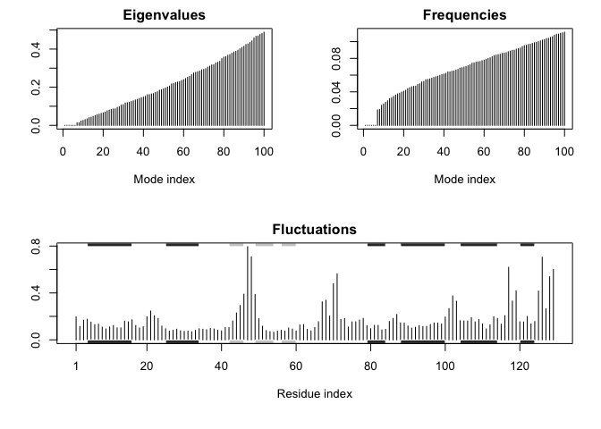

Class 12: Bioinformatics in drug discovery and design
================
Yi Fu
5/9/2019

First, let’s check if “bio3d” package is installed. And then, load the
package.

``` r
library(bio3d)
```

And download *Autodock Vina*
[here](http://vina.scripps.edu/download.html).

## Autodock Vina

For this section, we will use the program called Autodock Vina \[4\].
Autodock Vina is a fast docking program that requires minimal user
intervention and is often employed for highthroughput virtual screening.
We will run it from the command line.

Now we are ready to run autodoc vina to perform the docking. We will
keep a log of all program output in a file
log.txt

``` bash
#~/Downloads/autodock_vina_1_1_2_mac/bin/vina --config config.txt --log log.txt
```

Once the run is complete, you should have two new files *all.pdbqt*,
which contains all the docked modes, and *log.txt*

## Process the docking results with Bio3D in R

``` r
res <- read.pdb("all.pdbqt", multi=T)
write.pdb(res, "results.pdb")
```

Let’s calculate the RMSD (root mean square distance) between each of the
docking results and the known crystal structure using the bio3d package.

``` r
ori <- read.pdb("1hsg_ligand.pdbqt")
rmsd(ori, res)
```

    ##  [1]  0.590 11.163 10.531  4.364 11.040  3.682  5.741  3.864  5.442 10.920
    ## [11]  4.318  6.249 11.084  8.929

Normal mode analysis (NMA) is one of the major simulation techniques
used to probe largescale motions in biomolecules. Typical application is
for the prediction of functional motions in proteins.

``` r
pdb <- read.pdb("1HEL")
```

    ##   Note: Accessing on-line PDB file

``` r
modes <- nma(pdb)
```

    ##  Building Hessian...     Done in 0.017 seconds.
    ##  Diagonalizing Hessian...    Done in 0.11 seconds.

``` r
plot(modes, sse=pdb)
```

<!-- -->

``` r
mktrj(modes, mode=7, file="nma_7.pdb")
```
