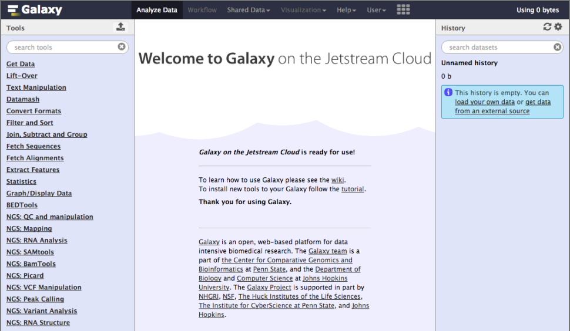

```{r setup, include=FALSE}
knitr::opts_chunk$set(echo = TRUE)
```

## 1. Identify genetic variants of interest

## 2. Galaxy
The Galaxy web-based interface to a suite of bioinformatics tools for genomic sequence analysis. Galaxy is free and comparatively easy to use.

Galaxy was originally written for genomic data analysis. However, the set of available tools has been greatly expanded over the years and Galaxy is now also used for gene expression, genome assembly, epigenomics, transcriptomics and host of other sub-disciplines in bioinformatics. 

To begin our analysis of this data we will use [Galaxy on Jetstream](https://galaxyproject.org/tutorials/g101/).

  
  
