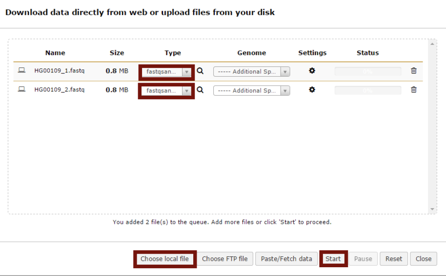
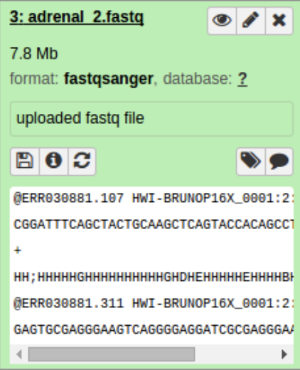
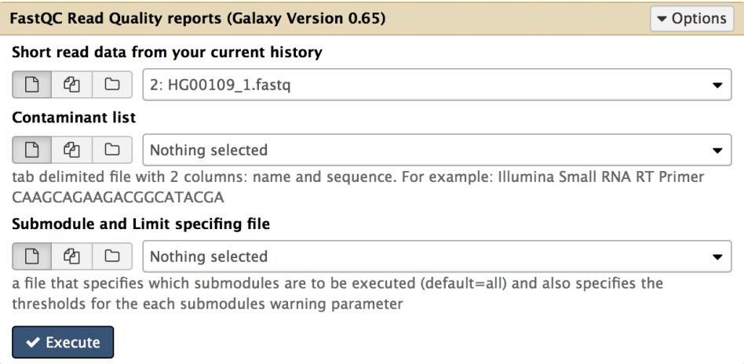
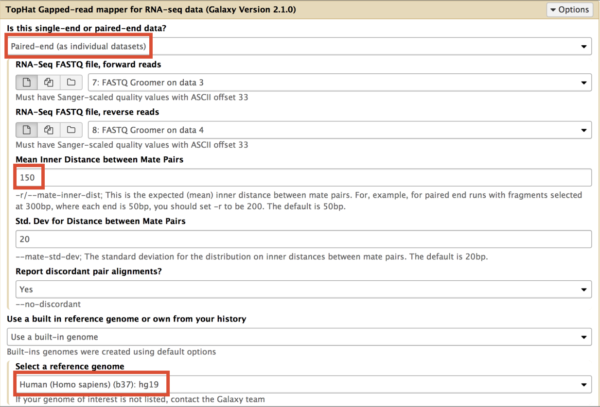
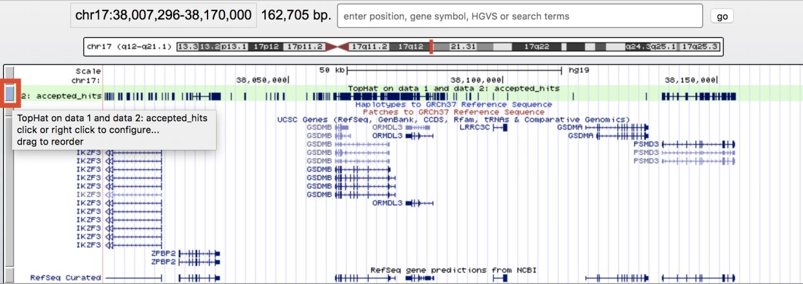
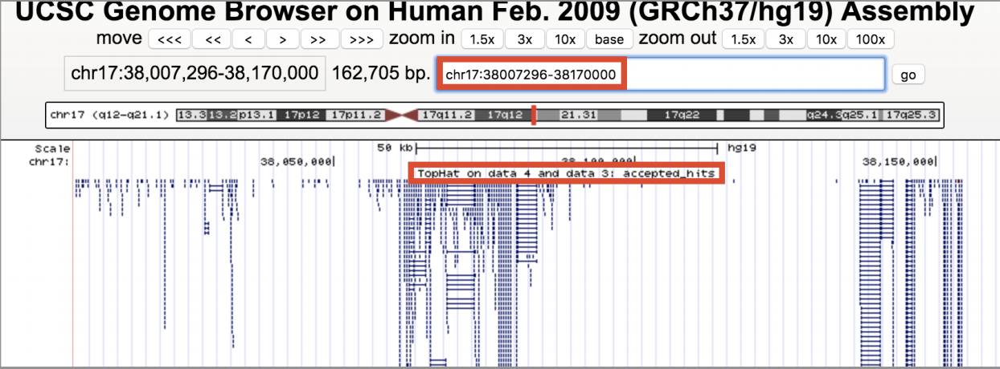
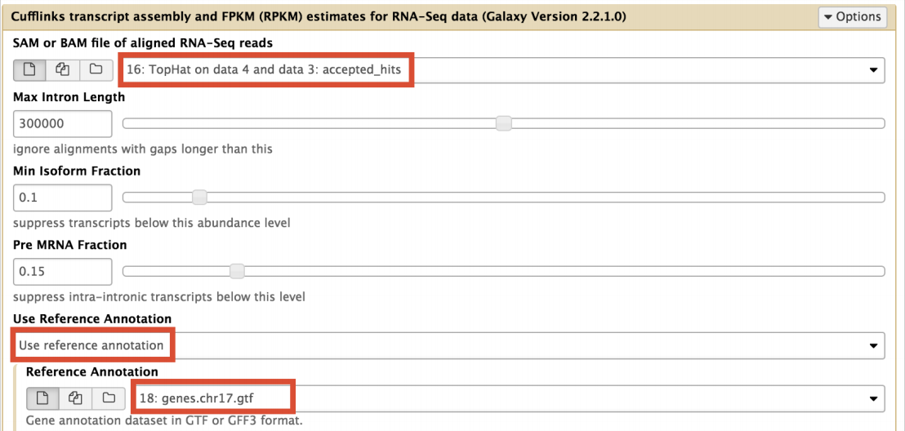

Class 13: Genome informatics and high throughput sequencing
================
Yi Fu
5/14/2019

## 1\. Galaxy

The Galaxy web-based interface to a suite of bioinformatics tools for
genomic sequence analysis. Galaxy is free and comparatively easy to use.

Galaxy was originally written for genomic data analysis. However, the
set of available tools has been greatly expanded over the years and
Galaxy is now also used for gene expression, genome assembly,
epigenomics, transcriptomics and host of other sub-disciplines in
bioinformatics.

To begin our analysis of this data we will use [Galaxy on
Jetstream](https://galaxyproject.org/tutorials/g101/).

## 2\. RNA-Seq pipeline

1.  Upload our fastqsanger sequences

You should see this panel on the right telling you the submitted job has
finished.

2.  Quality Control

3.  Mapping RNA-Seq reads to genome

4.  Display at UCSC

5.  Calculate gene expression

