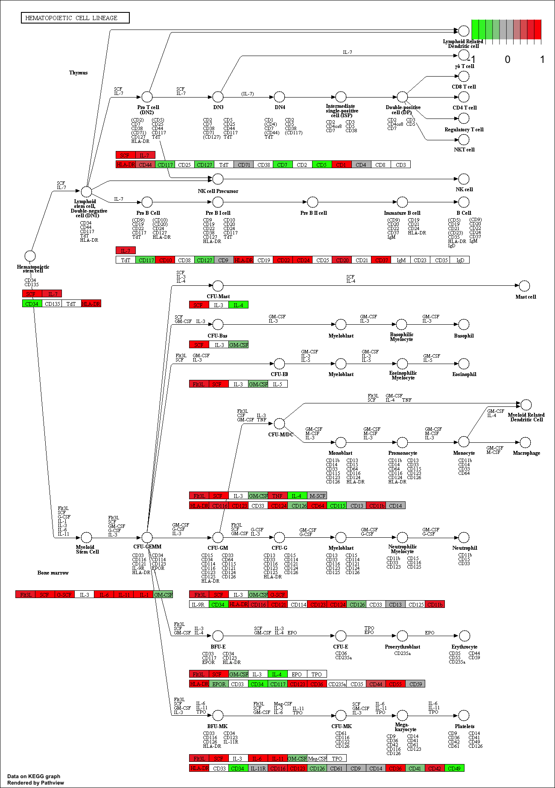

Class 15: Genome annotation and the interpretation of gene lists
================
Yi Fu
5/21/2019

First, let’s check if “DESeq2” package is installed. And then, load the
package.

``` r
library(DESeq2)
library(pathview)
library(gage)
library(gageData)
```

## 1\. KEGG Pathway Analysis

The gageData package has pre-compiled databases mapping genes to KEGG
pathways and GO terms for common organisms.

``` r
# data from gagaData package
data(kegg.sets.hs)
data(sigmet.idx.hs)

# Focus on signaling and metabolic pathways only
kegg.sets.hs = kegg.sets.hs[sigmet.idx.hs]

# Examine the first 3 pathways
head(kegg.sets.hs, 3)
```

    ## $`hsa00232 Caffeine metabolism`
    ## [1] "10"   "1544" "1548" "1549" "1553" "7498" "9"   
    ## 
    ## $`hsa00983 Drug metabolism - other enzymes`
    ##  [1] "10"     "1066"   "10720"  "10941"  "151531" "1548"   "1549"  
    ##  [8] "1551"   "1553"   "1576"   "1577"   "1806"   "1807"   "1890"  
    ## [15] "221223" "2990"   "3251"   "3614"   "3615"   "3704"   "51733" 
    ## [22] "54490"  "54575"  "54576"  "54577"  "54578"  "54579"  "54600" 
    ## [29] "54657"  "54658"  "54659"  "54963"  "574537" "64816"  "7083"  
    ## [36] "7084"   "7172"   "7363"   "7364"   "7365"   "7366"   "7367"  
    ## [43] "7371"   "7372"   "7378"   "7498"   "79799"  "83549"  "8824"  
    ## [50] "8833"   "9"      "978"   
    ## 
    ## $`hsa00230 Purine metabolism`
    ##   [1] "100"    "10201"  "10606"  "10621"  "10622"  "10623"  "107"   
    ##   [8] "10714"  "108"    "10846"  "109"    "111"    "11128"  "11164" 
    ##  [15] "112"    "113"    "114"    "115"    "122481" "122622" "124583"
    ##  [22] "132"    "158"    "159"    "1633"   "171568" "1716"   "196883"
    ##  [29] "203"    "204"    "205"    "221823" "2272"   "22978"  "23649" 
    ##  [36] "246721" "25885"  "2618"   "26289"  "270"    "271"    "27115" 
    ##  [43] "272"    "2766"   "2977"   "2982"   "2983"   "2984"   "2986"  
    ##  [50] "2987"   "29922"  "3000"   "30833"  "30834"  "318"    "3251"  
    ##  [57] "353"    "3614"   "3615"   "3704"   "377841" "471"    "4830"  
    ##  [64] "4831"   "4832"   "4833"   "4860"   "4881"   "4882"   "4907"  
    ##  [71] "50484"  "50940"  "51082"  "51251"  "51292"  "5136"   "5137"  
    ##  [78] "5138"   "5139"   "5140"   "5141"   "5142"   "5143"   "5144"  
    ##  [85] "5145"   "5146"   "5147"   "5148"   "5149"   "5150"   "5151"  
    ##  [92] "5152"   "5153"   "5158"   "5167"   "5169"   "51728"  "5198"  
    ##  [99] "5236"   "5313"   "5315"   "53343"  "54107"  "5422"   "5424"  
    ## [106] "5425"   "5426"   "5427"   "5430"   "5431"   "5432"   "5433"  
    ## [113] "5434"   "5435"   "5436"   "5437"   "5438"   "5439"   "5440"  
    ## [120] "5441"   "5471"   "548644" "55276"  "5557"   "5558"   "55703" 
    ## [127] "55811"  "55821"  "5631"   "5634"   "56655"  "56953"  "56985" 
    ## [134] "57804"  "58497"  "6240"   "6241"   "64425"  "646625" "654364"
    ## [141] "661"    "7498"   "8382"   "84172"  "84265"  "84284"  "84618" 
    ## [148] "8622"   "8654"   "87178"  "8833"   "9060"   "9061"   "93034" 
    ## [155] "953"    "9533"   "954"    "955"    "956"    "957"    "9583"  
    ## [162] "9615"

Create a vector of FoldChange values that has ENTREZ identifiers as the
names of the vecotr. This is the format that the **gage()** function
wants.

``` r
res = read.csv("data/deseq_results.csv",row.names=1)
foldchanges = res$log2FoldChange
names(foldchanges) = res$entrez
head(foldchanges)
```

    ##      1266     54855      1465     51232      2034      2317 
    ## -2.422719  3.201955 -2.313738 -2.059631 -1.888019 -1.649792

Now lets look at the object returned from gage()

``` r
# Get the results
keggres = gage(foldchanges, gsets=kegg.sets.hs)
rmarkdown::paged_table(as.data.frame(keggres$less))
```

<div data-pagedtable="false">

<script data-pagedtable-source type="application/json">
{"columns":[{"label":[""],"name":["_rn_"],"type":[""],"align":["left"]},{"label":["p.geomean"],"name":[1],"type":["dbl"],"align":["right"]},{"label":["stat.mean"],"name":[2],"type":["dbl"],"align":["right"]},{"label":["p.val"],"name":[3],"type":["dbl"],"align":["right"]},{"label":["q.val"],"name":[4],"type":["dbl"],"align":["right"]},{"label":["set.size"],"name":[5],"type":["dbl"],"align":["right"]},{"label":["exp1"],"name":[6],"type":["dbl"],"align":["right"]}],"data":[{"1":"8.995727e-06","2":"-4.37864439","3":"8.995727e-06","4":"0.001448312","5":"121","6":"8.995727e-06","_rn_":"hsa04110 Cell cycle"},{"1":"9.424076e-05","2":"-3.95180302","3":"9.424076e-05","4":"0.007586381","5":"36","6":"9.424076e-05","_rn_":"hsa03030 DNA replication"},{"1":"1.375901e-03","2":"-3.02849952","3":"1.375901e-03","4":"0.073840037","5":"144","6":"1.375901e-03","_rn_":"hsa03013 RNA transport"},{"1":"3.066756e-03","2":"-2.85289859","3":"3.066756e-03","4":"0.121861535","5":"28","6":"3.066756e-03","_rn_":"hsa03440 Homologous recombination"},{"1":"3.784520e-03","2":"-2.69812804","3":"3.784520e-03","4":"0.121861535","5":"102","6":"3.784520e-03","_rn_":"hsa04114 Oocyte meiosis"},{"1":"8.961413e-03","2":"-2.40539829","3":"8.961413e-03","4":"0.212222694","5":"53","6":"8.961413e-03","_rn_":"hsa00010 Glycolysis / Gluconeogenesis"},{"1":"9.417321e-03","2":"-2.36905700","3":"9.417321e-03","4":"0.212222694","5":"98","6":"9.417321e-03","_rn_":"hsa00240 Pyrimidine metabolism"},{"1":"1.054523e-02","2":"-2.42615130","3":"1.054523e-02","4":"0.212222694","5":"17","6":"1.054523e-02","_rn_":"hsa00670 One carbon pool by folate"},{"1":"1.374929e-02","2":"-2.24804359","3":"1.374929e-02","4":"0.234621132","5":"42","6":"1.374929e-02","_rn_":"hsa00280 Valine, leucine and isoleucine degradation"},{"1":"1.457274e-02","2":"-2.26359488","3":"1.457274e-02","4":"0.234621132","5":"23","6":"1.457274e-02","_rn_":"hsa03430 Mismatch repair"},{"1":"2.053198e-02","2":"-2.09268271","3":"2.053198e-02","4":"0.300513571","5":"41","6":"2.053198e-02","_rn_":"hsa00970 Aminoacyl-tRNA biosynthesis"},{"1":"2.611816e-02","2":"-1.97314627","3":"2.611816e-02","4":"0.350418666","5":"38","6":"2.611816e-02","_rn_":"hsa00071 Fatty acid metabolism"},{"1":"2.863778e-02","2":"-1.92488687","3":"2.863778e-02","4":"0.354667949","5":"88","6":"2.863778e-02","_rn_":"hsa03010 Ribosome"},{"1":"3.597557e-02","2":"-1.82390579","3":"3.597557e-02","4":"0.399143386","5":"43","6":"3.597557e-02","_rn_":"hsa00310 Lysine degradation"},{"1":"4.180655e-02","2":"-1.75302632","3":"4.180655e-02","4":"0.399143386","5":"44","6":"4.180655e-02","_rn_":"hsa03420 Nucleotide excision repair"},{"1":"4.399716e-02","2":"-1.73211046","3":"4.399716e-02","4":"0.399143386","5":"36","6":"4.399716e-02","_rn_":"hsa00620 Pyruvate metabolism"},{"1":"4.564582e-02","2":"-1.69891458","3":"4.564582e-02","4":"0.399143386","5":"127","6":"4.564582e-02","_rn_":"hsa03040 Spliceosome"},{"1":"4.702794e-02","2":"-1.71345387","3":"4.702794e-02","4":"0.399143386","5":"22","6":"4.702794e-02","_rn_":"hsa00760 Nicotinate and nicotinamide metabolism"},{"1":"4.710388e-02","2":"-1.70362811","3":"4.710388e-02","4":"0.399143386","5":"31","6":"4.710388e-02","_rn_":"hsa00640 Propanoate metabolism"},{"1":"5.458296e-02","2":"-1.62472856","3":"5.458296e-02","4":"0.439392810","5":"33","6":"5.458296e-02","_rn_":"hsa03410 Base excision repair"},{"1":"6.440428e-02","2":"-1.55041132","3":"6.440428e-02","4":"0.493766170","5":"28","6":"6.440428e-02","_rn_":"hsa00020 Citrate cycle (TCA cycle)"},{"1":"7.404382e-02","2":"-1.54441222","3":"7.404382e-02","4":"0.541866113","5":"10","6":"7.404382e-02","_rn_":"hsa00290 Valine, leucine and isoleucine biosynthesis"},{"1":"7.930857e-02","2":"-1.42154383","3":"7.930857e-02","4":"0.555159963","5":"71","6":"7.930857e-02","_rn_":"hsa03008 Ribosome biogenesis in eukaryotes"},{"1":"8.882605e-02","2":"-1.36581363","3":"8.882605e-02","4":"0.582205332","5":"29","6":"8.882605e-02","_rn_":"hsa00260 Glycine, serine and threonine metabolism"},{"1":"9.040455e-02","2":"-1.35579070","3":"9.040455e-02","4":"0.582205332","5":"28","6":"9.040455e-02","_rn_":"hsa00250 Alanine, aspartate and glutamate metabolism"},{"1":"1.017351e-01","2":"-1.27517594","3":"1.017351e-01","4":"0.613935181","5":"122","6":"1.017351e-01","_rn_":"hsa04530 Tight junction"},{"1":"1.048730e-01","2":"-1.25692850","3":"1.048730e-01","4":"0.613935181","5":"153","6":"1.048730e-01","_rn_":"hsa00230 Purine metabolism"},{"1":"1.067713e-01","2":"-1.25652892","3":"1.067713e-01","4":"0.613935181","5":"34","6":"1.067713e-01","_rn_":"hsa00350 Tyrosine metabolism"},{"1":"1.204346e-01","2":"-1.18910602","3":"1.204346e-01","4":"0.659372392","5":"23","6":"1.204346e-01","_rn_":"hsa00340 Histidine metabolism"},{"1":"1.228644e-01","2":"-1.19738361","3":"1.228644e-01","4":"0.659372392","5":"16","6":"1.228644e-01","_rn_":"hsa00630 Glyoxylate and dicarboxylate metabolism"},{"1":"1.299655e-01","2":"-1.12964146","3":"1.299655e-01","4":"0.668292129","5":"105","6":"1.299655e-01","_rn_":"hsa04670 Leukocyte transendothelial migration"},{"1":"1.344336e-01","2":"-1.11063956","3":"1.344336e-01","4":"0.668292129","5":"74","6":"1.344336e-01","_rn_":"hsa04146 Peroxisome"},{"1":"1.485063e-01","2":"-1.05673632","3":"1.485063e-01","4":"0.668292129","5":"21","6":"1.485063e-01","_rn_":"hsa01040 Biosynthesis of unsaturated fatty acids"},{"1":"1.532328e-01","2":"-1.03541760","3":"1.532328e-01","4":"0.668292129","5":"22","6":"1.532328e-01","_rn_":"hsa00650 Butanoate metabolism"},{"1":"1.562580e-01","2":"-1.01783411","3":"1.562580e-01","4":"0.668292129","5":"38","6":"1.562580e-01","_rn_":"hsa00380 Tryptophan metabolism"},{"1":"1.590377e-01","2":"-0.99972758","3":"1.590377e-01","4":"0.668292129","5":"192","6":"1.590377e-01","_rn_":"hsa04810 Regulation of actin cytoskeleton"},{"1":"1.626912e-01","2":"-0.99162637","3":"1.626912e-01","4":"0.668292129","5":"33","6":"1.626912e-01","_rn_":"hsa00270 Cysteine and methionine metabolism"},{"1":"1.666234e-01","2":"-0.98461298","3":"1.666234e-01","4":"0.668292129","5":"15","6":"1.666234e-01","_rn_":"hsa00040 Pentose and glucuronate interconversions"},{"1":"1.667808e-01","2":"-0.97335517","3":"1.667808e-01","4":"0.668292129","5":"41","6":"1.667808e-01","_rn_":"hsa00982 Drug metabolism - cytochrome P450"},{"1":"1.677717e-01","2":"-0.96545673","3":"1.677717e-01","4":"0.668292129","5":"98","6":"1.677717e-01","_rn_":"hsa04270 Vascular smooth muscle contraction"},{"1":"1.739035e-01","2":"-0.95877771","3":"1.739035e-01","4":"0.668292129","5":"13","6":"1.739035e-01","_rn_":"hsa00360 Phenylalanine metabolism"},{"1":"1.787878e-01","2":"-0.92931949","3":"1.787878e-01","4":"0.668292129","5":"24","6":"1.787878e-01","_rn_":"hsa00052 Galactose metabolism"},{"1":"1.819294e-01","2":"-0.91774188","3":"1.819294e-01","4":"0.668292129","5":"24","6":"1.819294e-01","_rn_":"hsa00030 Pentose phosphate pathway"},{"1":"1.826388e-01","2":"-0.91314321","3":"1.826388e-01","4":"0.668292129","5":"42","6":"1.826388e-01","_rn_":"hsa03050 Proteasome"},{"1":"2.119358e-01","2":"-0.80239536","3":"2.119358e-01","4":"0.738671705","5":"69","6":"2.119358e-01","_rn_":"hsa03018 RNA degradation"},{"1":"2.169110e-01","2":"-0.78576328","3":"2.169110e-01","4":"0.738671705","5":"76","6":"2.169110e-01","_rn_":"hsa03015 mRNA surveillance pathway"},{"1":"2.182244e-01","2":"-0.79838195","3":"2.182244e-01","4":"0.738671705","5":"12","6":"2.182244e-01","_rn_":"hsa03450 Non-homologous end-joining"},{"1":"2.239948e-01","2":"-0.76203949","3":"2.239948e-01","4":"0.738671705","5":"47","6":"2.239948e-01","_rn_":"hsa00330 Arginine and proline metabolism"},{"1":"2.292991e-01","2":"-0.74301409","3":"2.292991e-01","4":"0.738671705","5":"81","6":"2.292991e-01","_rn_":"hsa04914 Progesterone-mediated oocyte maturation"},{"1":"2.385016e-01","2":"-0.71325519","3":"2.385016e-01","4":"0.738671705","5":"66","6":"2.385016e-01","_rn_":"hsa04115 p53 signaling pathway"},{"1":"2.414361e-01","2":"-0.70667813","3":"2.414361e-01","4":"0.738671705","5":"29","6":"2.414361e-01","_rn_":"hsa00500 Starch and sucrose metabolism"},{"1":"2.434758e-01","2":"-0.70407869","3":"2.434758e-01","4":"0.738671705","5":"16","6":"2.434758e-01","_rn_":"hsa00770 Pantothenate and CoA biosynthesis"},{"1":"2.474949e-01","2":"-0.68368277","3":"2.474949e-01","4":"0.738671705","5":"103","6":"2.474949e-01","_rn_":"hsa04514 Cell adhesion molecules (CAMs)"},{"1":"2.477532e-01","2":"-0.68800015","3":"2.477532e-01","4":"0.738671705","5":"21","6":"2.477532e-01","_rn_":"hsa00601 Glycosphingolipid biosynthesis - lacto and neolacto series"},{"1":"2.669485e-01","2":"-0.63186802","3":"2.669485e-01","4":"0.781431158","5":"17","6":"2.669485e-01","_rn_":"hsa00450 Selenocompound metabolism"},{"1":"2.761608e-01","2":"-0.59789900","3":"2.761608e-01","4":"0.793962325","5":"29","6":"2.761608e-01","_rn_":"hsa00565 Ether lipid metabolism"},{"1":"2.869631e-01","2":"-0.56947171","3":"2.869631e-01","4":"0.810544787","5":"14","6":"2.869631e-01","_rn_":"hsa00120 Primary bile acid biosynthesis"},{"1":"2.981724e-01","2":"-0.53036597","3":"2.981724e-01","4":"0.827685491","5":"133","6":"2.981724e-01","_rn_":"hsa04120 Ubiquitin mediated proteolysis"},{"1":"3.326133e-01","2":"-0.43793348","3":"3.326133e-01","4":"0.880877735","5":"14","6":"3.326133e-01","_rn_":"hsa00592 alpha-Linolenic acid metabolism"},{"1":"3.330737e-01","2":"-0.43233199","3":"3.330737e-01","4":"0.880877735","5":"73","6":"3.330737e-01","_rn_":"hsa04520 Adherens junction"},{"1":"3.337487e-01","2":"-0.43681755","3":"3.337487e-01","4":"0.880877735","5":"10","6":"3.337487e-01","_rn_":"hsa00920 Sulfur metabolism"},{"1":"3.457714e-01","2":"-0.39918825","3":"3.457714e-01","4":"0.897890217","5":"25","6":"3.457714e-01","_rn_":"hsa00512 Mucin type O-Glycan biosynthesis"},{"1":"3.571696e-01","2":"-0.36977838","3":"3.571696e-01","4":"0.905989742","5":"23","6":"3.571696e-01","_rn_":"hsa03060 Protein export"},{"1":"3.604744e-01","2":"-0.35847731","3":"3.604744e-01","4":"0.905989742","5":"43","6":"3.604744e-01","_rn_":"hsa00480 Glutathione metabolism"},{"1":"3.657723e-01","2":"-0.35247934","3":"3.657723e-01","4":"0.905989742","5":"10","6":"3.657723e-01","_rn_":"hsa04122 Sulfur relay system"},{"1":"3.746995e-01","2":"-0.32499260","3":"3.746995e-01","4":"0.911538970","5":"11","6":"3.746995e-01","_rn_":"hsa00740 Riboflavin metabolism"},{"1":"3.877460e-01","2":"-0.28719801","3":"3.877460e-01","4":"0.911538970","5":"29","6":"3.877460e-01","_rn_":"hsa03020 RNA polymerase"},{"1":"3.883562e-01","2":"-0.28598870","3":"3.883562e-01","4":"0.911538970","5":"24","6":"3.883562e-01","_rn_":"hsa00563 Glycosylphosphatidylinositol(GPI)-anchor biosynthesis"},{"1":"3.906596e-01","2":"-0.28097420","3":"3.906596e-01","4":"0.911538970","5":"14","6":"3.906596e-01","_rn_":"hsa00900 Terpenoid backbone biosynthesis"},{"1":"3.999324e-01","2":"-0.25481247","3":"3.999324e-01","4":"0.919844553","5":"35","6":"3.999324e-01","_rn_":"hsa04130 SNARE interactions in vesicular transport"},{"1":"4.189807e-01","2":"-0.20537149","3":"4.189807e-01","4":"0.935744450","5":"33","6":"4.189807e-01","_rn_":"hsa00983 Drug metabolism - other enzymes"},{"1":"4.231946e-01","2":"-0.19500154","3":"4.231946e-01","4":"0.935744450","5":"21","6":"4.231946e-01","_rn_":"hsa00410 beta-Alanine metabolism"},{"1":"4.287564e-01","2":"-0.18009468","3":"4.287564e-01","4":"0.935744450","5":"43","6":"4.287564e-01","_rn_":"hsa00561 Glycerolipid metabolism"},{"1":"4.300937e-01","2":"-0.17736646","3":"4.300937e-01","4":"0.935744450","5":"25","6":"4.300937e-01","_rn_":"hsa00860 Porphyrin and chlorophyll metabolism"},{"1":"4.501352e-01","2":"-0.12562184","3":"4.501352e-01","4":"0.946973467","5":"54","6":"4.501352e-01","_rn_":"hsa03320 PPAR signaling pathway"},{"1":"4.623485e-01","2":"-0.09490888","3":"4.623485e-01","4":"0.946973467","5":"34","6":"4.623485e-01","_rn_":"hsa00051 Fructose and mannose metabolism"},{"1":"4.651151e-01","2":"-0.08774589","3":"4.651151e-01","4":"0.946973467","5":"59","6":"4.651151e-01","_rn_":"hsa04730 Long-term depression"},{"1":"4.683280e-01","2":"-0.08004556","3":"4.683280e-01","4":"0.946973467","5":"20","6":"4.683280e-01","_rn_":"hsa00910 Nitrogen metabolism"},{"1":"4.691828e-01","2":"-0.07753667","3":"4.691828e-01","4":"0.946973467","5":"47","6":"4.691828e-01","_rn_":"hsa00520 Amino sugar and nucleotide sugar metabolism"},{"1":"4.725818e-01","2":"-0.06891796","3":"4.725818e-01","4":"0.946973467","5":"65","6":"4.725818e-01","_rn_":"hsa04970 Salivary secretion"},{"1":"4.806438e-01","2":"-0.04889767","3":"4.806438e-01","4":"0.946973467","5":"18","6":"4.806438e-01","_rn_":"hsa04977 Vitamin digestion and absorption"},{"1":"4.823095e-01","2":"-0.04465336","3":"4.823095e-01","4":"0.946973467","5":"20","6":"4.823095e-01","_rn_":"hsa04744 Phototransduction"},{"1":"5.241673e-01","2":"0.06071346","3":"5.241673e-01","4":"0.997177224","5":"81","6":"5.241673e-01","_rn_":"hsa04540 Gap junction"},{"1":"5.389882e-01","2":"0.09887922","3":"5.389882e-01","4":"0.997177224","5":"14","6":"5.389882e-01","_rn_":"hsa04614 Renin-angiotensin system"},{"1":"5.678450e-01","2":"0.17106828","3":"5.678450e-01","4":"0.997177224","5":"160","6":"5.678450e-01","_rn_":"hsa04141 Protein processing in endoplasmic reticulum"},{"1":"5.783759e-01","2":"0.19804937","3":"5.783759e-01","4":"0.997177224","5":"85","6":"5.783759e-01","_rn_":"hsa04666 Fc gamma R-mediated phagocytosis"},{"1":"5.893714e-01","2":"0.22703076","3":"5.893714e-01","4":"0.997177224","5":"28","6":"5.893714e-01","_rn_":"hsa04973 Carbohydrate digestion and absorption"},{"1":"5.962652e-01","2":"0.24432023","3":"5.962652e-01","4":"0.997177224","5":"56","6":"5.962652e-01","_rn_":"hsa04622 RIG-I-like receptor signaling pathway"},{"1":"6.129303e-01","2":"0.28840693","3":"6.129303e-01","4":"0.997177224","5":"28","6":"6.129303e-01","_rn_":"hsa00514 Other types of O-glycan biosynthesis"},{"1":"6.169389e-01","2":"0.29972866","3":"6.169389e-01","4":"0.997177224","5":"21","6":"6.169389e-01","_rn_":"hsa04710 Circadian rhythm - mammal"},{"1":"6.193013e-01","2":"0.30538022","3":"6.193013e-01","4":"0.997177224","5":"25","6":"6.193013e-01","_rn_":"hsa00534 Glycosaminoglycan biosynthesis - heparan sulfate"},{"1":"6.246307e-01","2":"0.31891773","3":"6.246307e-01","4":"0.997177224","5":"36","6":"6.246307e-01","_rn_":"hsa00600 Sphingolipid metabolism"},{"1":"6.255125e-01","2":"0.32130506","3":"6.255125e-01","4":"0.997177224","5":"38","6":"6.255125e-01","_rn_":"hsa04962 Vasopressin-regulated water reabsorption"},{"1":"6.344769e-01","2":"0.34751374","3":"6.344769e-01","4":"0.997177224","5":"15","6":"6.344769e-01","_rn_":"hsa00533 Glycosaminoglycan biosynthesis - keratan sulfate"},{"1":"6.428860e-01","2":"0.36704212","3":"6.428860e-01","4":"0.997177224","5":"64","6":"6.428860e-01","_rn_":"hsa04664 Fc epsilon RI signaling pathway"},{"1":"6.485849e-01","2":"0.38268524","3":"6.485849e-01","4":"0.997177224","5":"54","6":"6.485849e-01","_rn_":"hsa00562 Inositol phosphate metabolism"},{"1":"6.516208e-01","2":"0.39039145","3":"6.516208e-01","4":"0.997177224","5":"87","6":"6.516208e-01","_rn_":"hsa04660 T cell receptor signaling pathway"},{"1":"6.711598e-01","2":"0.44392809","3":"6.711598e-01","4":"0.997177224","5":"83","6":"6.711598e-01","_rn_":"hsa04210 Apoptosis"},{"1":"6.748515e-01","2":"0.45391593","3":"6.748515e-01","4":"0.997177224","5":"123","6":"6.748515e-01","_rn_":"hsa04360 Axon guidance"},{"1":"6.804641e-01","2":"0.46985546","3":"6.804641e-01","4":"0.997177224","5":"88","6":"6.804641e-01","_rn_":"hsa04912 GnRH signaling pathway"},{"1":"6.863681e-01","2":"0.48862688","3":"6.863681e-01","4":"0.997177224","5":"33","6":"6.863681e-01","_rn_":"hsa03022 Basal transcription factors"},{"1":"6.889049e-01","2":"0.49349602","3":"6.889049e-01","4":"0.997177224","5":"127","6":"6.889049e-01","_rn_":"hsa00190 Oxidative phosphorylation"},{"1":"6.914370e-01","2":"0.50035038","3":"6.914370e-01","4":"0.997177224","5":"192","6":"6.914370e-01","_rn_":"hsa04510 Focal adhesion"},{"1":"6.973077e-01","2":"0.51812466","3":"6.973077e-01","4":"0.997177224","5":"60","6":"6.973077e-01","_rn_":"hsa04260 Cardiac muscle contraction"},{"1":"6.990692e-01","2":"0.52288602","3":"6.990692e-01","4":"0.997177224","5":"73","6":"6.990692e-01","_rn_":"hsa00564 Glycerophospholipid metabolism"},{"1":"7.039111e-01","2":"0.53635734","3":"7.039111e-01","4":"0.997177224","5":"129","6":"7.039111e-01","_rn_":"hsa04145 Phagosome"},{"1":"7.105477e-01","2":"0.56109621","3":"7.105477e-01","4":"0.997177224","5":"19","6":"7.105477e-01","_rn_":"hsa00100 Steroid biosynthesis"},{"1":"7.230065e-01","2":"0.59792539","3":"7.230065e-01","4":"0.997177224","5":"18","6":"7.230065e-01","_rn_":"hsa04964 Proximal tubule bicarbonate reclamation"},{"1":"7.231647e-01","2":"0.59394785","3":"7.231647e-01","4":"0.997177224","5":"62","6":"7.231647e-01","_rn_":"hsa04971 Gastric acid secretion"},{"1":"7.438291e-01","2":"0.66081786","3":"7.438291e-01","4":"0.997177224","5":"22","6":"7.438291e-01","_rn_":"hsa00532 Glycosaminoglycan biosynthesis - chondroitin sulfate"},{"1":"7.456958e-01","2":"0.66302599","3":"7.456958e-01","4":"0.997177224","5":"62","6":"7.456958e-01","_rn_":"hsa04720 Long-term potentiation"},{"1":"7.591572e-01","2":"0.70449960","3":"7.591572e-01","4":"0.997177224","5":"151","6":"7.591572e-01","_rn_":"hsa04020 Calcium signaling pathway"},{"1":"7.594729e-01","2":"0.70572131","3":"7.594729e-01","4":"0.997177224","5":"123","6":"7.594729e-01","_rn_":"hsa04910 Insulin signaling pathway"},{"1":"7.613321e-01","2":"0.71178697","3":"7.613321e-01","4":"0.997177224","5":"124","6":"7.613321e-01","_rn_":"hsa04722 Neurotrophin signaling pathway"},{"1":"7.672898e-01","2":"0.73728048","3":"7.672898e-01","4":"0.997177224","5":"22","6":"7.672898e-01","_rn_":"hsa04320 Dorso-ventral axis formation"},{"1":"7.687395e-01","2":"0.73812080","3":"7.687395e-01","4":"0.997177224","5":"49","6":"7.687395e-01","_rn_":"hsa04150 mTOR signaling pathway"},{"1":"7.705910e-01","2":"0.75018077","3":"7.705910e-01","4":"0.997177224","5":"18","6":"7.705910e-01","_rn_":"hsa00591 Linoleic acid metabolism"},{"1":"7.865938e-01","2":"0.80086680","3":"7.865938e-01","4":"0.997177224","5":"28","6":"7.865938e-01","_rn_":"hsa04975 Fat digestion and absorption"},{"1":"7.876084e-01","2":"0.80313695","3":"7.876084e-01","4":"0.997177224","5":"34","6":"7.876084e-01","_rn_":"hsa04742 Taste transduction"},{"1":"7.881976e-01","2":"0.81183190","3":"7.881976e-01","4":"0.997177224","5":"20","6":"7.881976e-01","_rn_":"hsa04140 Regulation of autophagy"},{"1":"7.903247e-01","2":"0.80967060","3":"7.903247e-01","4":"0.997177224","5":"80","6":"7.903247e-01","_rn_":"hsa04620 Toll-like receptor signaling pathway"},{"1":"7.913909e-01","2":"0.81766814","3":"7.913909e-01","4":"0.997177224","5":"30","6":"7.913909e-01","_rn_":"hsa04672 Intestinal immune network for IgA production"},{"1":"7.938841e-01","2":"0.82088099","3":"7.938841e-01","4":"0.997177224","5":"190","6":"7.938841e-01","_rn_":"hsa04144 Endocytosis"},{"1":"8.049707e-01","2":"0.86220043","3":"8.049707e-01","4":"0.997177224","5":"72","6":"8.049707e-01","_rn_":"hsa04972 Pancreatic secretion"},{"1":"8.071582e-01","2":"0.87385575","3":"8.071582e-01","4":"0.997177224","5":"31","6":"8.071582e-01","_rn_":"hsa04960 Aldosterone-regulated sodium reabsorption"},{"1":"8.107963e-01","2":"0.88969278","3":"8.107963e-01","4":"0.997177224","5":"25","6":"8.107963e-01","_rn_":"hsa04966 Collecting duct acid secretion"},{"1":"8.134152e-01","2":"0.90821904","3":"8.134152e-01","4":"0.997177224","5":"13","6":"8.134152e-01","_rn_":"hsa00603 Glycosphingolipid biosynthesis - globo series"},{"1":"8.262394e-01","2":"0.94252797","3":"8.262394e-01","4":"0.997177224","5":"73","6":"8.262394e-01","_rn_":"hsa04070 Phosphatidylinositol signaling system"},{"1":"8.548482e-01","2":"1.06599099","3":"8.548482e-01","4":"0.997177224","5":"38","6":"8.548482e-01","_rn_":"hsa00980 Metabolism of xenobiotics by cytochrome P450"},{"1":"8.568157e-01","2":"1.07471128","3":"8.568157e-01","4":"0.997177224","5":"39","6":"8.568157e-01","_rn_":"hsa00590 Arachidonic acid metabolism"},{"1":"8.605868e-01","2":"1.08814386","3":"8.605868e-01","4":"0.997177224","5":"61","6":"8.605868e-01","_rn_":"hsa04920 Adipocytokine signaling pathway"},{"1":"8.630799e-01","2":"1.09939993","3":"8.630799e-01","4":"0.997177224","5":"62","6":"8.630799e-01","_rn_":"hsa04974 Protein digestion and absorption"},{"1":"8.677581e-01","2":"1.11989153","3":"8.677581e-01","4":"0.997177224","5":"80","6":"8.677581e-01","_rn_":"hsa04350 TGF-beta signaling pathway"},{"1":"8.735394e-01","2":"1.16738452","3":"8.735394e-01","4":"0.997177224","5":"15","6":"8.735394e-01","_rn_":"hsa00604 Glycosphingolipid biosynthesis - ganglio series"},{"1":"8.849464e-01","2":"1.20488774","3":"8.849464e-01","4":"0.997177224","5":"78","6":"8.849464e-01","_rn_":"hsa04512 ECM-receptor interaction"},{"1":"8.920085e-01","2":"1.24797391","3":"8.920085e-01","4":"0.997177224","5":"38","6":"8.920085e-01","_rn_":"hsa04623 Cytosolic DNA-sensing pathway"},{"1":"9.032622e-01","2":"1.31677431","3":"9.032622e-01","4":"0.997177224","5":"34","6":"9.032622e-01","_rn_":"hsa00830 Retinol metabolism"},{"1":"9.108642e-01","2":"1.35070780","3":"9.108642e-01","4":"0.997177224","5":"104","6":"9.108642e-01","_rn_":"hsa04380 Osteoclast differentiation"},{"1":"9.174501e-01","2":"1.39950095","3":"9.174501e-01","4":"0.997177224","5":"49","6":"9.174501e-01","_rn_":"hsa00510 N-Glycan biosynthesis"},{"1":"9.196548e-01","2":"1.40931854","3":"9.196548e-01","4":"0.997177224","5":"84","6":"9.196548e-01","_rn_":"hsa04012 ErbB signaling pathway"},{"1":"9.277499e-01","2":"1.47065143","3":"9.277499e-01","4":"0.997177224","5":"52","6":"9.277499e-01","_rn_":"hsa04610 Complement and coagulation cascades"},{"1":"9.294816e-01","2":"1.48703029","3":"9.294816e-01","4":"0.997177224","5":"50","6":"9.294816e-01","_rn_":"hsa04612 Antigen processing and presentation"},{"1":"9.295042e-01","2":"1.48246234","3":"9.295042e-01","4":"0.997177224","5":"68","6":"9.295042e-01","_rn_":"hsa04370 VEGF signaling pathway"},{"1":"9.337780e-01","2":"1.51138925","3":"9.337780e-01","4":"0.997177224","5":"94","6":"9.337780e-01","_rn_":"hsa04650 Natural killer cell mediated cytotoxicity"},{"1":"9.350211e-01","2":"1.51886939","3":"9.350211e-01","4":"0.997177224","5":"139","6":"9.350211e-01","_rn_":"hsa04310 Wnt signaling pathway"},{"1":"9.356681e-01","2":"1.53487661","3":"9.356681e-01","4":"0.997177224","5":"48","6":"9.356681e-01","_rn_":"hsa04340 Hedgehog signaling pathway"},{"1":"9.384033e-01","2":"1.55460205","3":"9.384033e-01","4":"0.997177224","5":"55","6":"9.384033e-01","_rn_":"hsa04621 NOD-like receptor signaling pathway"},{"1":"9.516606e-01","2":"1.68207570","3":"9.516606e-01","4":"0.997177224","5":"39","6":"9.516606e-01","_rn_":"hsa02010 ABC transporters"},{"1":"9.593557e-01","2":"1.74957091","3":"9.593557e-01","4":"0.997177224","5":"146","6":"9.593557e-01","_rn_":"hsa04062 Chemokine signaling pathway"},{"1":"9.619845e-01","2":"1.84838649","3":"9.619845e-01","4":"0.997177224","5":"17","6":"9.619845e-01","_rn_":"hsa00531 Glycosaminoglycan degradation"},{"1":"9.636548e-01","2":"1.87247887","3":"9.636548e-01","4":"0.997177224","5":"16","6":"9.636548e-01","_rn_":"hsa00511 Other glycan degradation"},{"1":"9.659757e-01","2":"1.84064999","3":"9.659757e-01","4":"0.997177224","5":"66","6":"9.659757e-01","_rn_":"hsa04662 B cell receptor signaling pathway"},{"1":"9.700193e-01","2":"1.88546326","3":"9.700193e-01","4":"0.997177224","5":"245","6":"9.700193e-01","_rn_":"hsa04010 MAPK signaling pathway"},{"1":"9.781777e-01","2":"2.04873659","3":"9.781777e-01","4":"0.997177224","5":"52","6":"9.781777e-01","_rn_":"hsa04740 Olfactory transduction"},{"1":"9.802670e-01","2":"2.08725503","3":"9.802670e-01","4":"0.997177224","5":"50","6":"9.802670e-01","_rn_":"hsa04976 Bile secretion"},{"1":"9.806002e-01","2":"2.08192721","3":"9.806002e-01","4":"0.997177224","5":"90","6":"9.806002e-01","_rn_":"hsa04916 Melanogenesis"},{"1":"9.812527e-01","2":"2.11172491","3":"9.812527e-01","4":"0.997177224","5":"46","6":"9.812527e-01","_rn_":"hsa04330 Notch signaling pathway"},{"1":"9.898926e-01","2":"2.33836439","3":"9.898926e-01","4":"0.997177224","5":"118","6":"9.898926e-01","_rn_":"hsa04142 Lysosome"},{"1":"9.927449e-01","2":"2.52674374","3":"9.927449e-01","4":"0.997177224","5":"31","6":"9.927449e-01","_rn_":"hsa00140 Steroid hormone biosynthesis"},{"1":"9.947979e-01","2":"2.58567326","3":"9.947979e-01","4":"0.997177224","5":"109","6":"9.947979e-01","_rn_":"hsa04630 Jak-STAT signaling pathway"},{"1":"9.971772e-01","2":"2.83336226","3":"9.971772e-01","4":"0.997177224","5":"55","6":"9.971772e-01","_rn_":"hsa04640 Hematopoietic cell lineage"},{"1":"NA","2":"NaN","3":"NA","4":"NA","5":"5","6":"NA","_rn_":"hsa00232 Caffeine metabolism"},{"1":"NA","2":"NaN","3":"NA","4":"NA","5":"3","6":"NA","_rn_":"hsa00300 Lysine biosynthesis"},{"1":"NA","2":"NaN","3":"NA","4":"NA","5":"6","6":"NA","_rn_":"hsa00130 Ubiquinone and other terpenoid-quinone biosynthesis"},{"1":"NA","2":"NaN","3":"NA","4":"NA","5":"9","6":"NA","_rn_":"hsa00430 Taurine and hypotaurine metabolism"},{"1":"NA","2":"NaN","3":"NA","4":"NA","5":"8","6":"NA","_rn_":"hsa00053 Ascorbate and aldarate metabolism"},{"1":"NA","2":"NaN","3":"NA","4":"NA","5":"3","6":"NA","_rn_":"hsa00785 Lipoic acid metabolism"},{"1":"NA","2":"NaN","3":"NA","4":"NA","5":"6","6":"NA","_rn_":"hsa00460 Cyanoamino acid metabolism"},{"1":"NA","2":"NaN","3":"NA","4":"NA","5":"0","6":"NA","_rn_":"hsa00472 D-Arginine and D-ornithine metabolism"},{"1":"NA","2":"NaN","3":"NA","4":"NA","5":"8","6":"NA","_rn_":"hsa00790 Folate biosynthesis"},{"1":"NA","2":"NaN","3":"NA","4":"NA","5":"6","6":"NA","_rn_":"hsa00061 Fatty acid biosynthesis"},{"1":"NA","2":"NaN","3":"NA","4":"NA","5":"3","6":"NA","_rn_":"hsa00400 Phenylalanine, tyrosine and tryptophan biosynthesis"},{"1":"NA","2":"NaN","3":"NA","4":"NA","5":"4","6":"NA","_rn_":"hsa00730 Thiamine metabolism"},{"1":"NA","2":"NaN","3":"NA","4":"NA","5":"4","6":"NA","_rn_":"hsa00471 D-Glutamine and D-glutamate metabolism"},{"1":"NA","2":"NaN","3":"NA","4":"NA","5":"6","6":"NA","_rn_":"hsa00750 Vitamin B6 metabolism"},{"1":"NA","2":"NaN","3":"NA","4":"NA","5":"2","6":"NA","_rn_":"hsa00780 Biotin metabolism"},{"1":"NA","2":"NaN","3":"NA","4":"NA","5":"7","6":"NA","_rn_":"hsa00072 Synthesis and degradation of ketone bodies"}],"options":{"columns":{"min":{},"max":[10]},"rows":{"min":[10],"max":[10]},"pages":{}}}
  </script>

</div>

``` r
pathview(gene.data=foldchanges, pathway.id="hsa04110")
```

    ## 'select()' returned 1:1 mapping between keys and columns

    ## Info: Working in directory /Users/fu/Desktop/BIMM 143/github/bimm143_github/class15

    ## Info: Writing image file hsa04110.pathview.png

``` r
# A different PDF based output of the same data
# pathview(gene.data=foldchanges, pathway.id="hsa04110", kegg.native=FALSE)
```


``` r
# Focus on top 5 upregulated pathways here for demo purposes only
keggrespathways <- rownames(keggres$greater)[1:5]

# Extract the 8 character long IDs part of each string
keggresids = substr(keggrespathways, start=1, stop=8)
keggresids
```

    ## [1] "hsa04640" "hsa04630" "hsa00140" "hsa04142" "hsa04330"

``` r
pathview(gene.data=foldchanges, pathway.id=keggresids, species="hsa")
```

Here are the plots:




## 2\. Reactome

``` r
sig_genes <- res[res$padj <= 0.05 & !is.na(res$padj), "symbol"]
print(paste("Total number of significant genes:", length(sig_genes)))
```

    ## [1] "Total number of significant genes: 8147"

``` r
write.table(sig_genes, file="data/significant_genes.txt", row.names=FALSE, col.names=FALSE, quote=FALSE)
```

Then, to perform pathway analysis online go to the Reactome website
(<https://reactome.org/PathwayBrowser/#TOOL=AT>). Select “choose file”
to upload your significant gene list. Then, select the parameters
“Project to Humans”, then click “Analyze”.

## 3\. GO

To perform Gene Set GO Enrichment online go to the website
(<http://www.geneontology.org/page/go-enrichment-analysis)x>. Paste your
significant gene list from section 4. Then, select “biological process”
and “homo sapiens”, and click submit.
