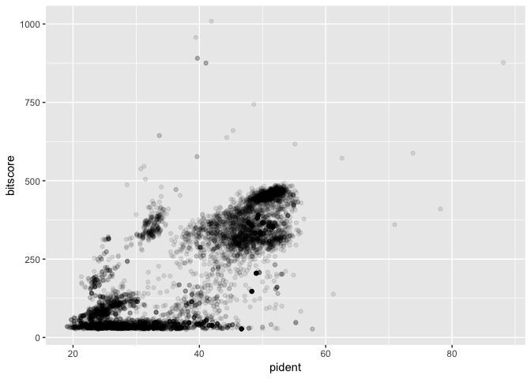

Class 16: Essential UNIX for bioinformatics
================
Yi Fu
5/23/2019

First, let’s check if “ggplot2” package is installed. And then, load the
package.

``` r
library(ggplot2)
```

## 1\. Unix command

Here is a cheat sheet for the most commonly used commands.


## 2\. ggplot2

Let’s load the Blast sequences after command-line pipeline.

``` r
data=read.csv("data/mm-second.x.zebrafish.tsv",sep="\t")
colnames(data)=c("qseqid", "sseqid", "pident", "length", "mismatch", "gapopen", "qstart", "qend", "sstart", "send", "evalue", "bitscore")
head(data)
```

    ##        qseqid         sseqid pident length mismatch gapopen qstart qend
    ## 1 YP_220551.1    NP_059332.1 44.509    346      188       3      1  344
    ## 2 YP_220551.1    NP_059341.1 24.540    163      112       3    112  263
    ## 3 YP_220551.1    NP_059340.1 26.804     97       65       2     98  188
    ## 4 YP_220552.1    NP_059333.1 88.132    514       61       0      1  514
    ## 5 YP_220552.1 XP_021326074.1 31.818     66       32       2    427  482
    ## 6 YP_220552.1 XP_005162943.1 31.818     66       32       2    427  482
    ##   sstart send   evalue bitscore
    ## 1      1  344 8.62e-92    279.0
    ## 2    231  393 5.15e-06     49.7
    ## 3    200  296 1.00e-01     35.8
    ## 4      1  514 0.00e+00    877.0
    ## 5     16   78 6.70e+00     29.3
    ## 6     48  110 7.50e+00     29.6

``` r
hist(data$bitscore,breaks=30)
```

<!-- -->

We want to know if there is a straightforward relationship between
percent identity ($pident) and bitscore ($bitscore) for the alignments
we generated.

``` r
ggplot(data, aes(pident, bitscore)) + geom_point(alpha=0.1) 
```

<!-- -->

The answer is that bitscores are only somewhat related to pident; they
take into account not only the percent identity but the length of the
alignment. You can get a napkin sketch estimate of this by doing the
following:

``` r
ggplot(data, aes((data$pident * (data$qend - data$qstart)), data$bitscore)) + geom_point(alpha=0.1) + geom_smooth()
```

    ## `geom_smooth()` using method = 'gam' and formula 'y ~ s(x, bs = "cs")'

<!-- -->
