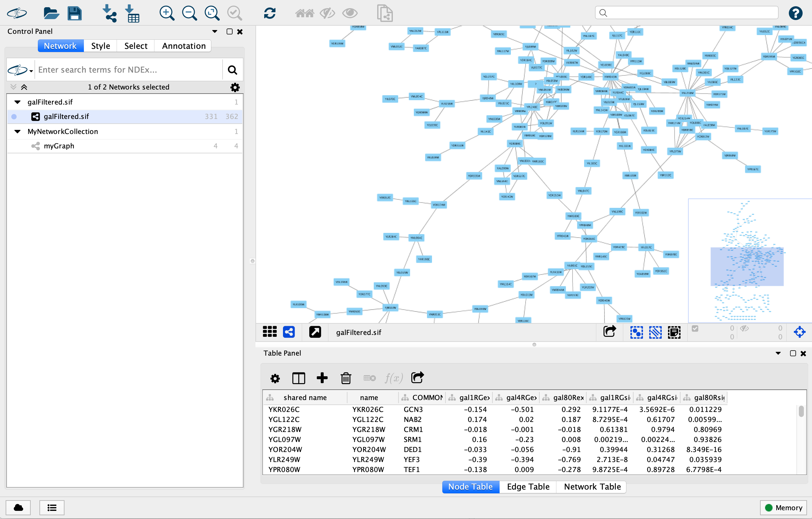
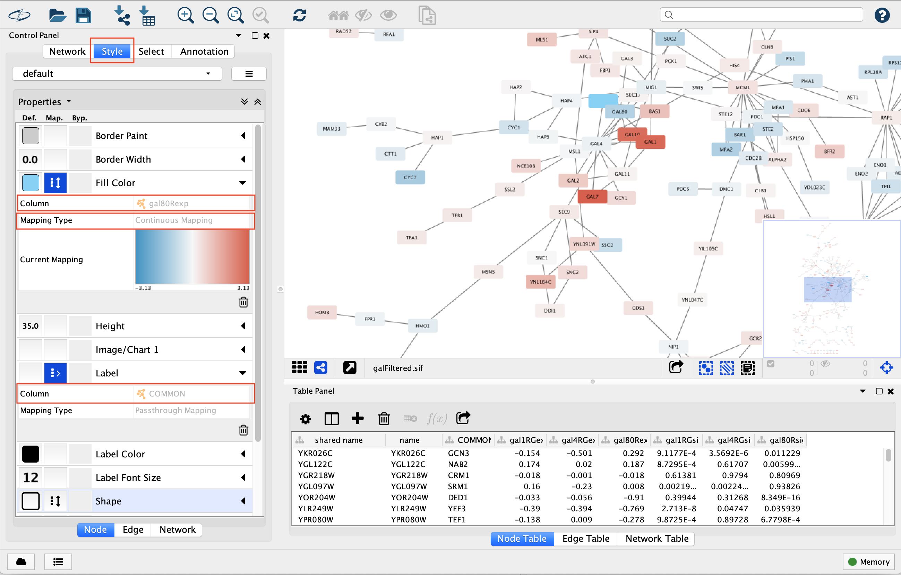
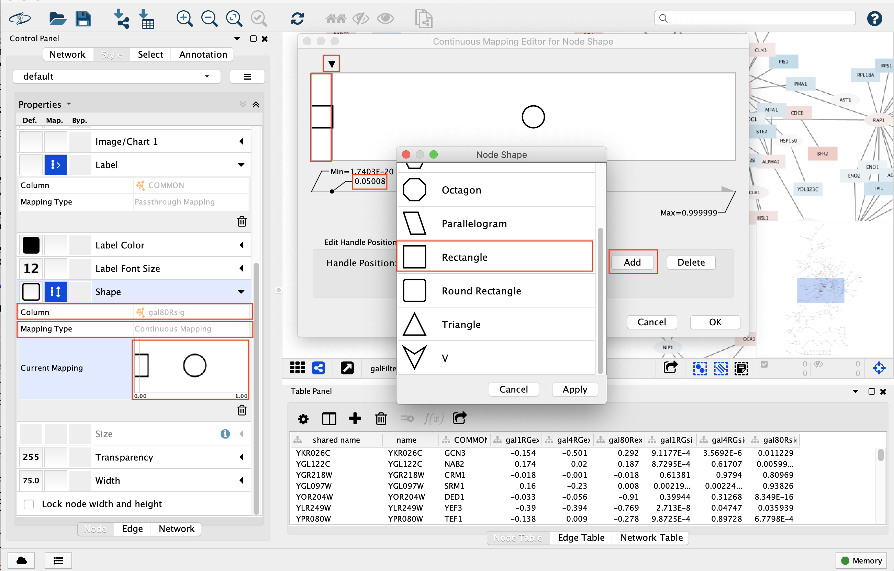
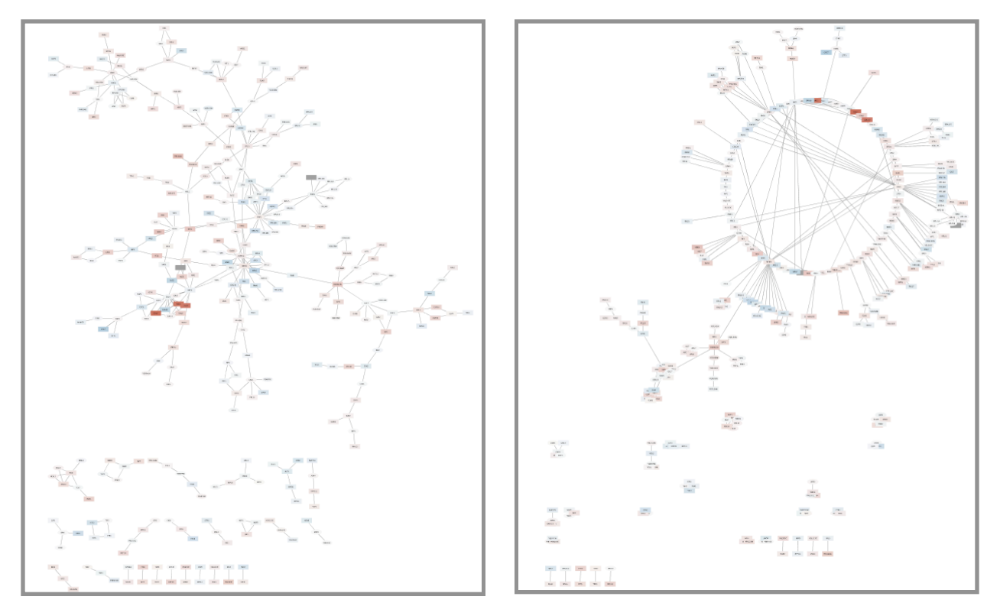
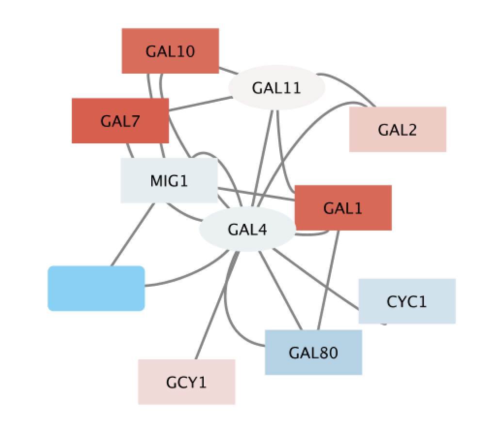
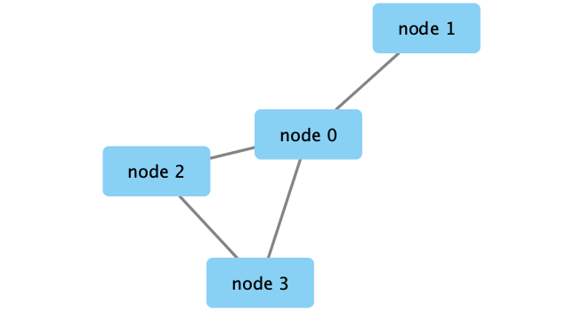
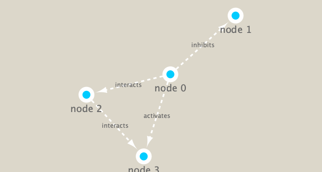

```{r setup, include=FALSE}
knitr::opts_chunk$set(echo = TRUE)
```

First, let's check if "RCy3", "igraph", "RColorBrewer", "ggraph", "bio3d" packages are installed. And then, load the packages.
```{r warning=FALSE, include=FALSE, results='hide'}
if (!require("RCy3")) {
  BiocManager::install("RCy3")
}
if (!require("igraph")) {
  install.packages("igraph")
}
if (!require("RColorBrewer")) {
  install.packages("RColorBrewer")
}
if (!require("ggraph")) {
  install.packages("ggraph")
}
```

```{r}
library(RCy3)
library(igraph)
library(RColorBrewer)
library(ggraph)
```

You can download Cytoscape [here](http://cytoscape.org).

## 1. Cytoscape

Launch Cytoscape a new window and import data to Cytoscape using the following:

> **File \> Import \> Network from File...** and choose **data/galFiltered.sif**

> **File \> Import \> Table from File...** and choose **data/galExpData.csv**

  
  
Now let's set the visual attributes of the nodes (labels and colors) in our network according to the expression data we have just imported. To do this, open the **Style** panel.

1. select **COMMON** for **Column** under **Label**

2. select **gal80Rexp** for **Column** under **Fill Color**

3. select **Continuous Mapping** for **Column** under **Fill Color**

4. select **gal80Rsig** for **Column** under **Shape**

  
  
5.1 select **Continuous Mapping** for **Column** under **Shape**, and double-click **Current Mapping**, which is blank right now. This will pop-up a new window.

5.2 click the **Add** button, and double-click on the left node icon, which is a circle right now. Choose the **Rectangle** shape and click the **Apply** button

5.3 click on the **black triangle** and move the slider to the left, move it to the lower value of 0.05, our threshold for significance

  
  
6. select **Layout \> Circular Layout.** to change to a circular-laid graph.

  
  
Zoom into this portion of the network and find the three dark red (i.e. highly induced) nodes. Notice that these nodes are in the same region of the graph. Also, there are two nodes that interact with all three red nodes: **GAL4** (YPL248C) and **GAL11** (YOL051W).

Let's select these two nodes and their immediate neighbors.

1. click on **GAL4** (YPL248C)

2. extend the selection by holding down the **shift** key and clicking on **GAL11** (YOL051W)
  
3. select their neighbors by pressing **Cmd-6** on a Mac ("Select > Nodes > First Neighbors of Selected Nodes > Undirected")
  
4. create a new network by selecting "File > New Network > Selected nodes, all edges"
  
  
  
Our data show precisely this:

- Both nodes (**GAL4** and **GAL11**) show fairly small changes in expression, and neither change is statistically significant: they are rendered as light-colored circles.

- These slight changes in expression suggest that the critical change affecting the red nodes (**GAL1**, **GAL7** and **GAL10**) might be somewhere else in the network, and not due to either **GAL4** or **GAL11**.

- Note that our network shows that **GAL4** interacts with **GAL80** (YML051W), which shows a significant level of repression: it is depicted as a blue rectangle.

- Note that while **GAL80** shows evidence of significant repression, most nodes interacting with **GAL4** show significant levels of induction: they are rendered as red rectangles.

- **GAL11** is a general transcription co-factor with many interactions


To save the graph for reading into other software such as R, use "File > Export > Network to File...".

## 2. Use Cytoscape in R

Let's check if we can talk to cytoscape. (Remember to open **Cytoscape** application now.)
```{r}
cytoscapePing()
```

We can test things further by making a small network and sending it to Cytoscape.
```{r}
g = makeSimpleIgraph()
createNetworkFromIgraph(g, "myGraph")
```

We can simply plot the graph
```{r}
plot(g)
```

Or We can include this Cytoscape rendered network image in our report.
```{r}
fig <- exportImage(filename="data/demo", type="png", height=350)

```

Cytoscape provides a number of canned visual styles.
```{r}
getVisualStyleNames()
setVisualStyle("Marquee")
```

We can again include this Cytoscape rendered network image in our report.
```{r}
fig <- exportImage(filename="data/demo_marquee", type="png", height=350)

```

We will read in a species co-occurrence matrix (**data/virus_prok_cor_abundant.tsv**) that was calculated using Spearman Rank coefficient. (see reference Lima-Mendez et al. (2015) for details)
```{r}
prok_vir_cor <- read.delim("data/virus_prok_cor_abundant.tsv", stringsAsFactors = FALSE)
rmarkdown::paged_table(prok_vir_cor)
```

Here we will use the igraph package to convert the co-occurrence dataframe into a network that we can send to Cytoscape.
```{r}
g <- graph.data.frame(prok_vir_cor, directed = FALSE)
plot(g)
```

To make the plot looks better, let's turn off text labels.
```{r}
plot(g, vertex.label=NA)
```

Let's also make the vertex much smaller.
```{r}
plot(g, vertex.size=3, vertex.label=NA)
```

Also, let's use the ggplot extension package for networks called **ggraph**.
```{r}
ggraph(g, layout = 'auto') +
geom_edge_link(alpha = 0.25) +
geom_node_point(color="steelblue") +
theme_graph()
```

Send this network to Cytoscape.
```{r}
createNetworkFromIgraph(g,"myIgraph")
```

Community structure detection algorithms try to find dense subgraphs within larger network graphs (i.e. clusters of well connected nodes that are densely connected themselves but sparsely connected to other nodes outside the cluster).
```{r}
cb = cluster_edge_betweenness(g)
plot(cb, y=g, vertex.label=NA,  vertex.size=3)
```

The degree of a node or vertex is its most basic structural property, the number of its adjacent edges. Here we calculate and plot the node degree distribution.
```{r}
d <- degree(g)
hist(d, breaks=30, col="lightblue", main ="Node Degree Distribution")
plot( degree_distribution(g), type="h" )
```


## Centrality analysis

Centrality gives an estimation on how important a node or edge is for the connectivity (or the information flow) of a network. It is a particularly useful parameter in signaling networks and it is often used when trying to find drug targets for example.
```{r}
pr <- page_rank(g)
rmarkdown::paged_table(as.data.frame(pr$vector))
```

Lets plot our network with nodes size scaled via this page rank centrality scores.
```{r}
bac_id_affi <- read.delim("data/prok_tax_from_silva.tsv", stringsAsFactors = FALSE)
rmarkdown::paged_table(bac_id_affi)
```


