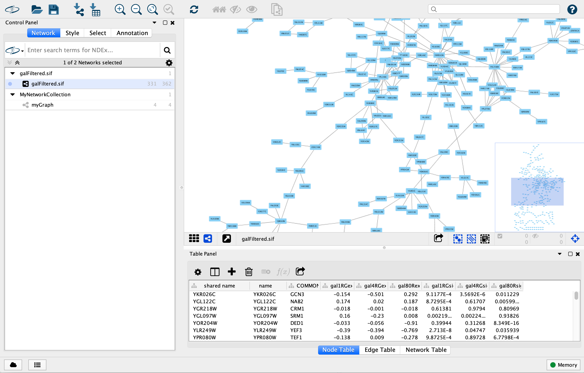
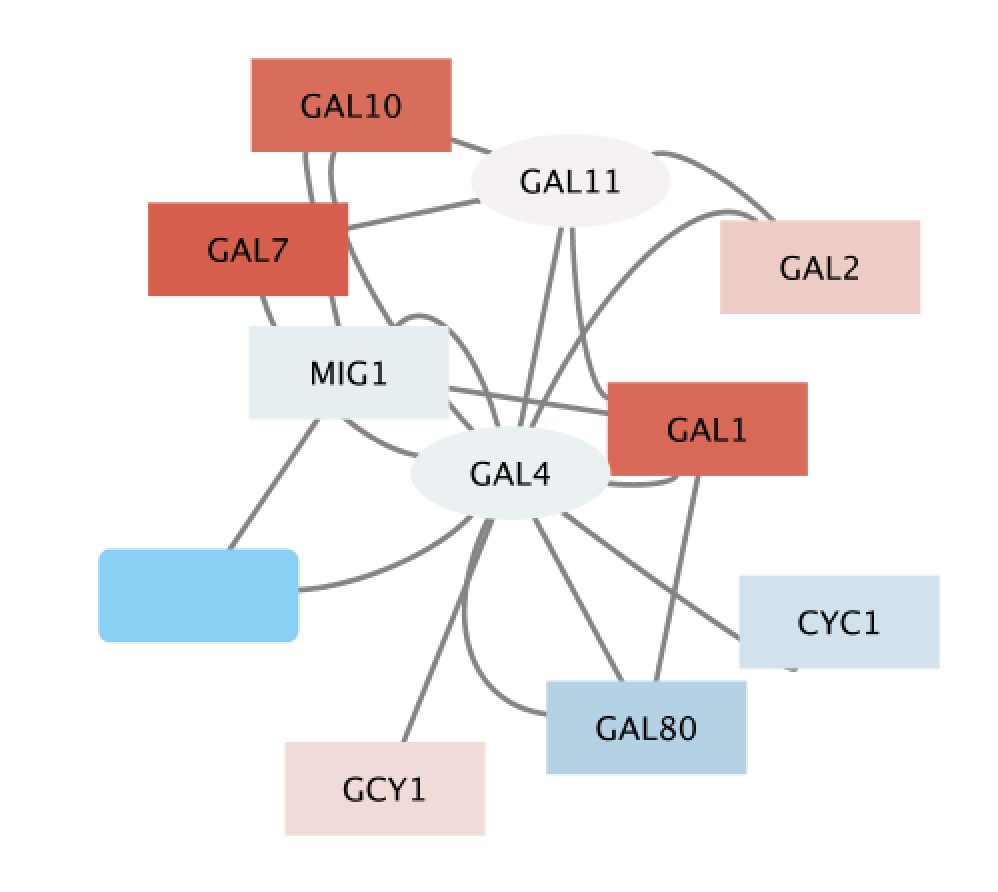
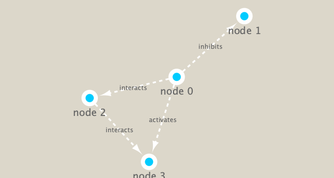

Class 17: Biological network analysis
================
Yi Fu
5/28/2019

First, let’s check if “RCy3”, “igraph”, “RColorBrewer”, “ggraph”,
“bio3d” packages are installed. And then, load the packages.

``` r
library(RCy3)
library(igraph)
library(RColorBrewer)
library(ggraph)
```

You can download Cytoscape [here](http://cytoscape.org).

## 1\. Cytoscape

Launch Cytoscape a new window and import data to Cytoscape using the
following:

> **File \> Import \> Network from File…** and choose
> **data/galFiltered.sif**

> **File \> Import \> Table from File…** and choose
> **data/galExpData.csv**



Now let’s set the visual attributes of the nodes (labels and colors) in
our network according to the expression data we have just imported. To
do this, open the **Style** panel.

1.  select **COMMON** for **Column** under **Label**

2.  select **gal80Rexp** for **Column** under **Fill Color**

3.  select **Continuous Mapping** for **Column** under **Fill Color**

4.  select **gal80Rsig** for **Column** under **Shape**


5.1 select **Continuous Mapping** for **Column** under **Shape**, and
double-click **Current Mapping**, which is blank right now. This will
pop-up a new window.

5.2 click the **Add** button, and double-click on the left node icon,
which is a circle right now. Choose the **Rectangle** shape and click
the **Apply** button

5.3 click on the **black triangle** and move the slider to the left,
move it to the lower value of 0.05, our threshold for significance


6.  select **Layout \> Circular Layout.** to change to a circular-laid
    graph.


Zoom into this portion of the network and find the three dark red
(i.e. highly induced) nodes. Notice that these nodes are in the same
region of the graph. Also, there are two nodes that interact with all
three red nodes: **GAL4** (YPL248C) and **GAL11** (YOL051W).

Let’s select these two nodes and their immediate neighbors.

1.  click on **GAL4** (YPL248C)

2.  extend the selection by holding down the **shift** key and clicking
    on **GAL11** (YOL051W)

3.  select their neighbors by pressing **Cmd-6** on a Mac (“Select \>
    Nodes \> First Neighbors of Selected Nodes \> Undirected”)

4.  create a new network by selecting “File \> New Network \> Selected
    nodes, all edges”



Our data show precisely this:

  - Both nodes (**GAL4** and **GAL11**) show fairly small changes in
    expression, and neither change is statistically significant: they
    are rendered as light-colored circles.

  - These slight changes in expression suggest that the critical change
    affecting the red nodes (**GAL1**, **GAL7** and **GAL10**) might be
    somewhere else in the network, and not due to either **GAL4** or
    **GAL11**.

  - Note that our network shows that **GAL4** interacts with **GAL80**
    (YML051W), which shows a significant level of repression: it is
    depicted as a blue rectangle.

  - Note that while **GAL80** shows evidence of significant repression,
    most nodes interacting with **GAL4** show significant levels of
    induction: they are rendered as red rectangles.

  - **GAL11** is a general transcription co-factor with many
    interactions

To save the graph for reading into other software such as R, use “File
\> Export \> Network to File…”.

## 2\. Use Cytoscape in R

Let’s check if we can talk to cytoscape. (Remember to open **Cytoscape**
application now.)

``` r
cytoscapePing()
```

    ## [1] "You are connected to Cytoscape!"

We can test things further by making a small network and sending it to
Cytoscape.

``` r
g = makeSimpleIgraph()
createNetworkFromIgraph(g, "myGraph")
```

    ## Loading data...
    ## Applying default style...
    ## Applying preferred layout...

    ## networkSUID 
    ##       19352

We can simply plot the graph

``` r
plot(g)
```

<!-- -->

Or We can include this Cytoscape rendered network image in our report.

``` r
fig <- exportImage(filename="data/demo", type="png", height=350)
```

    ## Warning: This file already exists. A Cytoscape popup 
    ##                 will be generated to confirm overwrite.

``` r
knitr::include_graphics("data/demo.png")
```

<!-- -->

Cytoscape provides a number of canned visual
    styles.

``` r
getVisualStyleNames()
```

    ##  [1] "Marquee"              "default black"        "Curved"              
    ##  [4] "Ripple"               "Solid"                "Nested Network Style"
    ##  [7] "Sample1"              "Sample2"              "Big Labels"          
    ## [10] "Minimal"              "Sample3"              "Gradient1"           
    ## [13] "BioPAX_SIF"           "BioPAX"               "Directed"            
    ## [16] "Universe"             "default"              "size_rank"

``` r
setVisualStyle("Marquee")
```

    ##                 message 
    ## "Visual Style applied."

We can again include this Cytoscape rendered network image in our
report.

``` r
fig <- exportImage(filename="data/demo_marquee", type="png", height=350)
```

    ## Warning: This file already exists. A Cytoscape popup 
    ##                 will be generated to confirm overwrite.

``` r

```

<!-- -->

We will read in a species co-occurrence matrix
(**data/virus\_prok\_cor\_abundant.tsv**) that was calculated using
Spearman Rank coefficient. (see reference Lima-Mendez et al. (2015) for
details)

``` r
prok_vir_cor <- read.delim("data/virus_prok_cor_abundant.tsv", stringsAsFactors = FALSE)
rmarkdown::paged_table(prok_vir_cor)
```

<div data-pagedtable="false">

<script data-pagedtable-source type="application/json">
{"columns":[{"label":[""],"name":["_rn_"],"type":[""],"align":["left"]},{"label":["Var1"],"name":[1],"type":["chr"],"align":["left"]},{"label":["Var2"],"name":[2],"type":["chr"],"align":["left"]},{"label":["weight"],"name":[3],"type":["dbl"],"align":["right"]}],"data":[{"1":"ph_1061","2":"AACY020068177","3":"0.8555342","_rn_":"1"},{"1":"ph_1258","2":"AACY020207233","3":"0.8055750","_rn_":"2"},{"1":"ph_3164","2":"AACY020207233","3":"0.8122517","_rn_":"3"},{"1":"ph_1033","2":"AACY020255495","3":"0.8487498","_rn_":"4"},{"1":"ph_10996","2":"AACY020255495","3":"0.8734617","_rn_":"5"},{"1":"ph_11038","2":"AACY020255495","3":"0.8740782","_rn_":"6"},{"1":"ph_11040","2":"AACY020255495","3":"0.8110312","_rn_":"7"},{"1":"ph_11048","2":"AACY020255495","3":"0.8741205","_rn_":"8"},{"1":"ph_11096","2":"AACY020255495","3":"0.8733054","_rn_":"9"},{"1":"ph_1113","2":"AACY020255495","3":"0.8253920","_rn_":"10"},{"1":"ph_1208","2":"AACY020255495","3":"0.8275205","_rn_":"11"},{"1":"ph_13207","2":"AACY020255495","3":"0.8685150","_rn_":"12"},{"1":"ph_1346","2":"AACY020255495","3":"0.8669283","_rn_":"13"},{"1":"ph_14679","2":"AACY020255495","3":"0.8213720","_rn_":"14"},{"1":"ph_1572","2":"AACY020255495","3":"0.8191596","_rn_":"15"},{"1":"ph_16045","2":"AACY020255495","3":"0.8735485","_rn_":"16"},{"1":"ph_1909","2":"AACY020255495","3":"0.8749534","_rn_":"17"},{"1":"ph_1918","2":"AACY020255495","3":"0.8065990","_rn_":"18"},{"1":"ph_19894","2":"AACY020255495","3":"0.8740346","_rn_":"19"},{"1":"ph_2117","2":"AACY020255495","3":"0.8678889","_rn_":"20"},{"1":"ph_2231","2":"AACY020255495","3":"0.8541242","_rn_":"21"},{"1":"ph_2363","2":"AACY020255495","3":"0.8764294","_rn_":"22"},{"1":"ph_276","2":"AACY020255495","3":"0.9071868","_rn_":"23"},{"1":"ph_2775","2":"AACY020255495","3":"0.8190349","_rn_":"24"},{"1":"ph_2798","2":"AACY020255495","3":"0.8443336","_rn_":"25"},{"1":"ph_3217","2":"AACY020255495","3":"0.8768955","_rn_":"26"},{"1":"ph_3336","2":"AACY020255495","3":"0.8993821","_rn_":"27"},{"1":"ph_3493","2":"AACY020255495","3":"0.8896355","_rn_":"28"},{"1":"ph_3541","2":"AACY020255495","3":"0.8351822","_rn_":"29"},{"1":"ph_3892","2":"AACY020255495","3":"0.9083010","_rn_":"30"},{"1":"ph_4194","2":"AACY020255495","3":"0.8747027","_rn_":"31"},{"1":"ph_4602","2":"AACY020255495","3":"0.8979311","_rn_":"32"},{"1":"ph_4678","2":"AACY020255495","3":"0.8738295","_rn_":"33"},{"1":"ph_484","2":"AACY020255495","3":"0.8799239","_rn_":"34"},{"1":"ph_4993","2":"AACY020255495","3":"0.8708602","_rn_":"35"},{"1":"ph_4999","2":"AACY020255495","3":"0.8586065","_rn_":"36"},{"1":"ph_5001","2":"AACY020255495","3":"0.8677149","_rn_":"37"},{"1":"ph_5010","2":"AACY020255495","3":"0.8233267","_rn_":"38"},{"1":"ph_5286","2":"AACY020255495","3":"0.8733875","_rn_":"39"},{"1":"ph_5287","2":"AACY020255495","3":"0.8479041","_rn_":"40"},{"1":"ph_5302","2":"AACY020255495","3":"0.8704645","_rn_":"41"},{"1":"ph_5321","2":"AACY020255495","3":"0.8735646","_rn_":"42"},{"1":"ph_5643","2":"AACY020255495","3":"0.8753653","_rn_":"43"},{"1":"ph_6441","2":"AACY020255495","3":"0.8484164","_rn_":"44"},{"1":"ph_654","2":"AACY020255495","3":"0.8352636","_rn_":"45"},{"1":"ph_6954","2":"AACY020255495","3":"0.8936991","_rn_":"46"},{"1":"ph_7389","2":"AACY020255495","3":"0.8600141","_rn_":"47"},{"1":"ph_7920","2":"AACY020255495","3":"0.8767108","_rn_":"48"},{"1":"ph_8039","2":"AACY020255495","3":"0.8706366","_rn_":"49"},{"1":"ph_8695","2":"AACY020255495","3":"0.8681125","_rn_":"50"},{"1":"ph_987","2":"AACY020255495","3":"0.8104258","_rn_":"51"},{"1":"ph_10377","2":"AACY020288370","3":"0.9348499","_rn_":"52"},{"1":"ph_10798","2":"AACY020288370","3":"0.8160839","_rn_":"53"},{"1":"ph_10931","2":"AACY020288370","3":"0.8363766","_rn_":"54"},{"1":"ph_11135","2":"AACY020288370","3":"0.8502197","_rn_":"55"},{"1":"ph_11307","2":"AACY020288370","3":"0.8530956","_rn_":"56"},{"1":"ph_1149","2":"AACY020288370","3":"0.8500670","_rn_":"57"},{"1":"ph_1150","2":"AACY020288370","3":"0.9075472","_rn_":"58"},{"1":"ph_12630","2":"AACY020288370","3":"0.8997876","_rn_":"59"},{"1":"ph_13413","2":"AACY020288370","3":"0.8017358","_rn_":"60"},{"1":"ph_1347","2":"AACY020288370","3":"0.8531805","_rn_":"61"},{"1":"ph_1388","2":"AACY020288370","3":"0.8450032","_rn_":"62"},{"1":"ph_1522","2":"AACY020288370","3":"0.8553962","_rn_":"63"},{"1":"ph_15307","2":"AACY020288370","3":"0.9368150","_rn_":"64"},{"1":"ph_16266","2":"AACY020288370","3":"0.8251533","_rn_":"65"},{"1":"ph_1641","2":"AACY020288370","3":"0.8405043","_rn_":"66"},{"1":"ph_1837","2":"AACY020288370","3":"0.8151752","_rn_":"67"},{"1":"ph_2064","2":"AACY020288370","3":"0.8250387","_rn_":"68"},{"1":"ph_2323","2":"AACY020288370","3":"0.9473117","_rn_":"69"},{"1":"ph_2624","2":"AACY020288370","3":"0.8097857","_rn_":"70"},{"1":"ph_3762","2":"AACY020288370","3":"0.8978448","_rn_":"71"},{"1":"ph_5861","2":"AACY020288370","3":"0.8944523","_rn_":"72"},{"1":"ph_5983","2":"AACY020288370","3":"0.8216948","_rn_":"73"},{"1":"ph_627","2":"AACY020288370","3":"0.8414060","_rn_":"74"},{"1":"ph_7172","2":"AACY020288370","3":"0.8972847","_rn_":"75"},{"1":"ph_747","2":"AACY020288370","3":"0.8398310","_rn_":"76"},{"1":"ph_893","2":"AACY020288370","3":"0.9264425","_rn_":"77"},{"1":"ph_946","2":"AACY020288370","3":"0.8440148","_rn_":"78"},{"1":"ph_947","2":"AACY020288370","3":"0.8455632","_rn_":"79"},{"1":"ph_1018","2":"AACY020396101","3":"0.8038791","_rn_":"80"},{"1":"ph_1120","2":"AACY020396101","3":"0.8021583","_rn_":"81"},{"1":"ph_12634","2":"AACY020396101","3":"0.8029727","_rn_":"82"},{"1":"ph_13890","2":"AACY020396101","3":"0.8108451","_rn_":"83"},{"1":"ph_1487","2":"AACY020396101","3":"0.8447870","_rn_":"84"},{"1":"ph_25338","2":"AACY020396101","3":"0.8156228","_rn_":"85"},{"1":"ph_25342","2":"AACY020396101","3":"0.8258749","_rn_":"86"},{"1":"ph_2560","2":"AACY020396101","3":"0.8231236","_rn_":"87"},{"1":"ph_2698","2":"AACY020396101","3":"0.8057450","_rn_":"88"},{"1":"ph_27069","2":"AACY020396101","3":"0.8336194","_rn_":"89"},{"1":"ph_2840","2":"AACY020396101","3":"0.8109626","_rn_":"90"},{"1":"ph_3301","2":"AACY020396101","3":"0.8532953","_rn_":"91"},{"1":"ph_3840","2":"AACY020396101","3":"0.8128402","_rn_":"92"},{"1":"ph_4054","2":"AACY020396101","3":"0.8325563","_rn_":"93"},{"1":"ph_4558","2":"AACY020396101","3":"0.8256024","_rn_":"94"},{"1":"ph_4841","2":"AACY020396101","3":"0.8115591","_rn_":"95"},{"1":"ph_5893","2":"AACY020396101","3":"0.8135703","_rn_":"96"},{"1":"ph_6280","2":"AACY020396101","3":"0.8169678","_rn_":"97"},{"1":"ph_8345","2":"AACY020396101","3":"0.8121989","_rn_":"98"},{"1":"ph_864","2":"AACY020396101","3":"0.8453966","_rn_":"99"},{"1":"ph_8962","2":"AACY020396101","3":"0.8036703","_rn_":"100"},{"1":"ph_8990","2":"AACY020396101","3":"0.8077977","_rn_":"101"},{"1":"ph_945","2":"AACY020396101","3":"0.8003061","_rn_":"102"},{"1":"ph_1033","2":"AACY020398456","3":"0.8655710","_rn_":"103"},{"1":"ph_1060","2":"AACY020398456","3":"0.8305137","_rn_":"104"},{"1":"ph_10996","2":"AACY020398456","3":"0.8823794","_rn_":"105"},{"1":"ph_11038","2":"AACY020398456","3":"0.8787563","_rn_":"106"},{"1":"ph_11040","2":"AACY020398456","3":"0.9029201","_rn_":"107"},{"1":"ph_11048","2":"AACY020398456","3":"0.8794390","_rn_":"108"},{"1":"ph_11096","2":"AACY020398456","3":"0.8813462","_rn_":"109"},{"1":"ph_1113","2":"AACY020398456","3":"0.8215150","_rn_":"110"},{"1":"ph_1208","2":"AACY020398456","3":"0.8977160","_rn_":"111"},{"1":"ph_1313","2":"AACY020398456","3":"0.8337720","_rn_":"112"},{"1":"ph_13136","2":"AACY020398456","3":"0.8518481","_rn_":"113"},{"1":"ph_13207","2":"AACY020398456","3":"0.9020602","_rn_":"114"},{"1":"ph_1346","2":"AACY020398456","3":"0.8623409","_rn_":"115"},{"1":"ph_14679","2":"AACY020398456","3":"0.8988731","_rn_":"116"},{"1":"ph_1469","2":"AACY020398456","3":"0.8478181","_rn_":"117"},{"1":"ph_1572","2":"AACY020398456","3":"0.8170973","_rn_":"118"},{"1":"ph_16045","2":"AACY020398456","3":"0.8780206","_rn_":"119"},{"1":"ph_1909","2":"AACY020398456","3":"0.8805475","_rn_":"120"},{"1":"ph_1918","2":"AACY020398456","3":"0.8655622","_rn_":"121"},{"1":"ph_19894","2":"AACY020398456","3":"0.8820631","_rn_":"122"},{"1":"ph_2087","2":"AACY020398456","3":"0.8901141","_rn_":"123"},{"1":"ph_2117","2":"AACY020398456","3":"0.8681173","_rn_":"124"},{"1":"ph_2231","2":"AACY020398456","3":"0.8444392","_rn_":"125"},{"1":"ph_2346","2":"AACY020398456","3":"0.8224644","_rn_":"126"},{"1":"ph_2363","2":"AACY020398456","3":"0.9059028","_rn_":"127"},{"1":"ph_276","2":"AACY020398456","3":"0.8940352","_rn_":"128"},{"1":"ph_2773","2":"AACY020398456","3":"0.8120204","_rn_":"129"},{"1":"ph_2775","2":"AACY020398456","3":"0.8839767","_rn_":"130"},{"1":"ph_2798","2":"AACY020398456","3":"0.8447101","_rn_":"131"},{"1":"ph_3217","2":"AACY020398456","3":"0.8815733","_rn_":"132"},{"1":"ph_3336","2":"AACY020398456","3":"0.9151005","_rn_":"133"},{"1":"ph_3493","2":"AACY020398456","3":"0.8869249","_rn_":"134"},{"1":"ph_3541","2":"AACY020398456","3":"0.8466327","_rn_":"135"},{"1":"ph_3892","2":"AACY020398456","3":"0.8867225","_rn_":"136"},{"1":"ph_4194","2":"AACY020398456","3":"0.9020011","_rn_":"137"},{"1":"ph_4602","2":"AACY020398456","3":"0.8948994","_rn_":"138"},{"1":"ph_4646","2":"AACY020398456","3":"0.8223279","_rn_":"139"},{"1":"ph_4678","2":"AACY020398456","3":"0.8777680","_rn_":"140"},{"1":"ph_4687","2":"AACY020398456","3":"0.8195271","_rn_":"141"},{"1":"ph_484","2":"AACY020398456","3":"0.8832947","_rn_":"142"},{"1":"ph_4993","2":"AACY020398456","3":"0.8715995","_rn_":"143"},{"1":"ph_4999","2":"AACY020398456","3":"0.8512960","_rn_":"144"},{"1":"ph_5001","2":"AACY020398456","3":"0.9022043","_rn_":"145"},{"1":"ph_5010","2":"AACY020398456","3":"0.8544961","_rn_":"146"},{"1":"ph_5286","2":"AACY020398456","3":"0.9066926","_rn_":"147"},{"1":"ph_5287","2":"AACY020398456","3":"0.8704955","_rn_":"148"},{"1":"ph_5302","2":"AACY020398456","3":"0.8972322","_rn_":"149"},{"1":"ph_5321","2":"AACY020398456","3":"0.8817190","_rn_":"150"},{"1":"ph_5617","2":"AACY020398456","3":"0.8653112","_rn_":"151"},{"1":"ph_5643","2":"AACY020398456","3":"0.8799737","_rn_":"152"},{"1":"ph_5668","2":"AACY020398456","3":"0.8388514","_rn_":"153"},{"1":"ph_6025","2":"AACY020398456","3":"0.8506618","_rn_":"154"},{"1":"ph_6441","2":"AACY020398456","3":"0.8372571","_rn_":"155"},{"1":"ph_646","2":"AACY020398456","3":"0.8181825","_rn_":"156"},{"1":"ph_654","2":"AACY020398456","3":"0.8630944","_rn_":"157"},{"1":"ph_6954","2":"AACY020398456","3":"0.8956957","_rn_":"158"},{"1":"ph_7389","2":"AACY020398456","3":"0.8679612","_rn_":"159"},{"1":"ph_7920","2":"AACY020398456","3":"0.8856478","_rn_":"160"},{"1":"ph_8039","2":"AACY020398456","3":"0.8665585","_rn_":"161"},{"1":"ph_8695","2":"AACY020398456","3":"0.8660521","_rn_":"162"},{"1":"ph_987","2":"AACY020398456","3":"0.8390317","_rn_":"163"},{"1":"ph_1033","2":"AACY020481938","3":"0.8813311","_rn_":"164"},{"1":"ph_1060","2":"AACY020481938","3":"0.8620484","_rn_":"165"},{"1":"ph_10996","2":"AACY020481938","3":"0.8268959","_rn_":"166"},{"1":"ph_11038","2":"AACY020481938","3":"0.8141253","_rn_":"167"},{"1":"ph_11040","2":"AACY020481938","3":"0.8816278","_rn_":"168"},{"1":"ph_11048","2":"AACY020481938","3":"0.8131378","_rn_":"169"},{"1":"ph_11096","2":"AACY020481938","3":"0.8197719","_rn_":"170"},{"1":"ph_1208","2":"AACY020481938","3":"0.8797518","_rn_":"171"},{"1":"ph_1313","2":"AACY020481938","3":"0.9030305","_rn_":"172"},{"1":"ph_13136","2":"AACY020481938","3":"0.8949616","_rn_":"173"},{"1":"ph_13207","2":"AACY020481938","3":"0.8533957","_rn_":"174"},{"1":"ph_1346","2":"AACY020481938","3":"0.8087462","_rn_":"175"},{"1":"ph_1376","2":"AACY020481938","3":"0.8068533","_rn_":"176"},{"1":"ph_1402","2":"AACY020481938","3":"0.8276534","_rn_":"177"},{"1":"ph_1422","2":"AACY020481938","3":"0.8001544","_rn_":"178"},{"1":"ph_14679","2":"AACY020481938","3":"0.8895998","_rn_":"179"},{"1":"ph_1469","2":"AACY020481938","3":"0.8944603","_rn_":"180"},{"1":"ph_16045","2":"AACY020481938","3":"0.8145966","_rn_":"181"},{"1":"ph_1909","2":"AACY020481938","3":"0.8401048","_rn_":"182"},{"1":"ph_1918","2":"AACY020481938","3":"0.8771698","_rn_":"183"},{"1":"ph_19894","2":"AACY020481938","3":"0.8123345","_rn_":"184"},{"1":"ph_2087","2":"AACY020481938","3":"0.8764917","_rn_":"185"},{"1":"ph_2117","2":"AACY020481938","3":"0.8050738","_rn_":"186"},{"1":"ph_2231","2":"AACY020481938","3":"0.8126291","_rn_":"187"},{"1":"ph_2346","2":"AACY020481938","3":"0.9154792","_rn_":"188"},{"1":"ph_2363","2":"AACY020481938","3":"0.8018810","_rn_":"189"},{"1":"ph_2773","2":"AACY020481938","3":"0.8780981","_rn_":"190"},{"1":"ph_2775","2":"AACY020481938","3":"0.9348957","_rn_":"191"},{"1":"ph_2798","2":"AACY020481938","3":"0.8220597","_rn_":"192"},{"1":"ph_3201","2":"AACY020481938","3":"0.8467128","_rn_":"193"},{"1":"ph_3217","2":"AACY020481938","3":"0.8246731","_rn_":"194"},{"1":"ph_3233","2":"AACY020481938","3":"0.8112399","_rn_":"195"},{"1":"ph_3336","2":"AACY020481938","3":"0.8509406","_rn_":"196"},{"1":"ph_3368","2":"AACY020481938","3":"0.8699118","_rn_":"197"},{"1":"ph_3493","2":"AACY020481938","3":"0.8109173","_rn_":"198"},{"1":"ph_3530","2":"AACY020481938","3":"0.8915484","_rn_":"199"},{"1":"ph_3541","2":"AACY020481938","3":"0.8542610","_rn_":"200"},{"1":"ph_3892","2":"AACY020481938","3":"0.8356975","_rn_":"201"},{"1":"ph_4194","2":"AACY020481938","3":"0.8078717","_rn_":"202"},{"1":"ph_4602","2":"AACY020481938","3":"0.8316471","_rn_":"203"},{"1":"ph_4646","2":"AACY020481938","3":"0.8826677","_rn_":"204"},{"1":"ph_4678","2":"AACY020481938","3":"0.8142182","_rn_":"205"},{"1":"ph_4687","2":"AACY020481938","3":"0.8649262","_rn_":"206"},{"1":"ph_484","2":"AACY020481938","3":"0.8075269","_rn_":"207"},{"1":"ph_4993","2":"AACY020481938","3":"0.8200832","_rn_":"208"},{"1":"ph_4999","2":"AACY020481938","3":"0.8158876","_rn_":"209"},{"1":"ph_5001","2":"AACY020481938","3":"0.8485277","_rn_":"210"},{"1":"ph_5010","2":"AACY020481938","3":"0.8570076","_rn_":"211"},{"1":"ph_5286","2":"AACY020481938","3":"0.8584989","_rn_":"212"},{"1":"ph_5287","2":"AACY020481938","3":"0.8682391","_rn_":"213"},{"1":"ph_5302","2":"AACY020481938","3":"0.8460133","_rn_":"214"},{"1":"ph_5321","2":"AACY020481938","3":"0.8123583","_rn_":"215"},{"1":"ph_5617","2":"AACY020481938","3":"0.9222349","_rn_":"216"},{"1":"ph_5643","2":"AACY020481938","3":"0.8268803","_rn_":"217"},{"1":"ph_5668","2":"AACY020481938","3":"0.8823696","_rn_":"218"},{"1":"ph_6025","2":"AACY020481938","3":"0.9227275","_rn_":"219"},{"1":"ph_6441","2":"AACY020481938","3":"0.8452236","_rn_":"220"},{"1":"ph_646","2":"AACY020481938","3":"0.8938639","_rn_":"221"},{"1":"ph_654","2":"AACY020481938","3":"0.8779302","_rn_":"222"},{"1":"ph_6954","2":"AACY020481938","3":"0.8324008","_rn_":"223"},{"1":"ph_7389","2":"AACY020481938","3":"0.8360346","_rn_":"224"},{"1":"ph_7920","2":"AACY020481938","3":"0.8192339","_rn_":"225"},{"1":"ph_8002","2":"AACY020481938","3":"0.8330353","_rn_":"226"},{"1":"ph_8039","2":"AACY020481938","3":"0.8153504","_rn_":"227"},{"1":"ph_8537","2":"AACY020481938","3":"0.8557992","_rn_":"228"},{"1":"ph_8695","2":"AACY020481938","3":"0.8183915","_rn_":"229"},{"1":"ph_1438","2":"AACY020487638","3":"0.8490270","_rn_":"230"},{"1":"ph_2877","2":"AACY020487638","3":"0.8249218","_rn_":"231"},{"1":"ph_6780","2":"AACY020487638","3":"0.8032068","_rn_":"232"},{"1":"ph_1077","2":"AACY020549891","3":"0.9522482","_rn_":"233"},{"1":"ph_1080","2":"AACY020549891","3":"0.8188895","_rn_":"234"},{"1":"ph_1237","2":"AACY020549891","3":"0.8825086","_rn_":"235"},{"1":"ph_1374","2":"AACY020549891","3":"0.8825386","_rn_":"236"},{"1":"ph_1561","2":"AACY020549891","3":"0.9557707","_rn_":"237"},{"1":"ph_1619","2":"AACY020549891","3":"0.8639162","_rn_":"238"},{"1":"ph_1779","2":"AACY020549891","3":"0.8023898","_rn_":"239"},{"1":"ph_1908","2":"AACY020549891","3":"0.9172927","_rn_":"240"},{"1":"ph_2105","2":"AACY020549891","3":"0.8936407","_rn_":"241"},{"1":"ph_2253","2":"AACY020549891","3":"0.8958097","_rn_":"242"},{"1":"ph_2254","2":"AACY020549891","3":"0.8752894","_rn_":"243"},{"1":"ph_2350","2":"AACY020549891","3":"0.8909031","_rn_":"244"},{"1":"ph_2626","2":"AACY020549891","3":"0.9349443","_rn_":"245"},{"1":"ph_2739","2":"AACY020549891","3":"0.8519021","_rn_":"246"},{"1":"ph_2911","2":"AACY020549891","3":"0.9086247","_rn_":"247"},{"1":"ph_2917","2":"AACY020549891","3":"0.8888048","_rn_":"248"},{"1":"ph_2919","2":"AACY020549891","3":"0.9659577","_rn_":"249"},{"1":"ph_2921","2":"AACY020549891","3":"0.8878694","_rn_":"250"},{"1":"ph_3066","2":"AACY020549891","3":"0.9352933","_rn_":"251"},{"1":"ph_3067","2":"AACY020549891","3":"0.8341849","_rn_":"252"},{"1":"ph_3070","2":"AACY020549891","3":"0.8798344","_rn_":"253"},{"1":"ph_318","2":"AACY020549891","3":"0.9420751","_rn_":"254"},{"1":"ph_3369","2":"AACY020549891","3":"0.9134767","_rn_":"255"},{"1":"ph_3530","2":"AACY020549891","3":"0.8273332","_rn_":"256"},{"1":"ph_3531","2":"AACY020549891","3":"0.8019839","_rn_":"257"},{"1":"ph_3534","2":"AACY020549891","3":"0.8220091","_rn_":"258"},{"1":"ph_4165","2":"AACY020549891","3":"0.8832702","_rn_":"259"},{"1":"ph_4379","2":"AACY020549891","3":"0.9351828","_rn_":"260"},{"1":"ph_4380","2":"AACY020549891","3":"0.9062277","_rn_":"261"},{"1":"ph_4381","2":"AACY020549891","3":"0.8224678","_rn_":"262"},{"1":"ph_4384","2":"AACY020549891","3":"0.9458972","_rn_":"263"},{"1":"ph_4386","2":"AACY020549891","3":"0.9024364","_rn_":"264"},{"1":"ph_4393","2":"AACY020549891","3":"0.9319383","_rn_":"265"},{"1":"ph_4946","2":"AACY020549891","3":"0.8913137","_rn_":"266"},{"1":"ph_509","2":"AACY020549891","3":"0.9380876","_rn_":"267"},{"1":"ph_5265","2":"AACY020549891","3":"0.9529212","_rn_":"268"},{"1":"ph_5625","2":"AACY020549891","3":"0.8822436","_rn_":"269"},{"1":"ph_5631","2":"AACY020549891","3":"0.8409060","_rn_":"270"},{"1":"ph_5642","2":"AACY020549891","3":"0.8480801","_rn_":"271"},{"1":"ph_5952","2":"AACY020549891","3":"0.8088098","_rn_":"272"},{"1":"ph_6011","2":"AACY020549891","3":"0.9443326","_rn_":"273"},{"1":"ph_6439","2":"AACY020549891","3":"0.8666566","_rn_":"274"},{"1":"ph_655","2":"AACY020549891","3":"0.8004676","_rn_":"275"},{"1":"ph_6800","2":"AACY020549891","3":"0.8190425","_rn_":"276"},{"1":"ph_6874","2":"AACY020549891","3":"0.9791873","_rn_":"277"},{"1":"ph_7371","2":"AACY020549891","3":"0.8377593","_rn_":"278"},{"1":"ph_9222","2":"AACY020549891","3":"0.9557242","_rn_":"279"},{"1":"ph_9245","2":"AACY020549891","3":"0.8123605","_rn_":"280"},{"1":"ph_9998","2":"AACY020549891","3":"0.9124282","_rn_":"281"},{"1":"ph_10744","2":"AACY020555729","3":"0.8480037","_rn_":"282"},{"1":"ph_10747","2":"AACY020555729","3":"0.8240616","_rn_":"283"},{"1":"ph_11724","2":"AACY020555729","3":"0.8215853","_rn_":"284"},{"1":"ph_11730","2":"AACY020555729","3":"0.8237235","_rn_":"285"},{"1":"ph_11846","2":"AACY020555729","3":"0.8690183","_rn_":"286"},{"1":"ph_12858","2":"AACY020555729","3":"0.8217164","_rn_":"287"},{"1":"ph_14208","2":"AACY020555729","3":"0.8240625","_rn_":"288"},{"1":"ph_14213","2":"AACY020555729","3":"0.8209953","_rn_":"289"},{"1":"ph_15651","2":"AACY020555729","3":"0.8193432","_rn_":"290"},{"1":"ph_15668","2":"AACY020555729","3":"0.8237394","_rn_":"291"},{"1":"ph_15681","2":"AACY020555729","3":"0.8226883","_rn_":"292"},{"1":"ph_17327","2":"AACY020555729","3":"0.8232119","_rn_":"293"},{"1":"ph_17340","2":"AACY020555729","3":"0.8263546","_rn_":"294"},{"1":"ph_17518","2":"AACY020555729","3":"0.8230167","_rn_":"295"},{"1":"ph_1880","2":"AACY020555729","3":"0.8767104","_rn_":"296"},{"1":"ph_2036","2":"AACY020555729","3":"0.8111615","_rn_":"297"},{"1":"ph_21378","2":"AACY020555729","3":"0.8204305","_rn_":"298"},{"1":"ph_2534","2":"AACY020555729","3":"0.8527010","_rn_":"299"},{"1":"ph_2612","2":"AACY020555729","3":"0.8346838","_rn_":"300"},{"1":"ph_2730","2":"AACY020555729","3":"0.8209687","_rn_":"301"},{"1":"ph_2878","2":"AACY020555729","3":"0.8874662","_rn_":"302"},{"1":"ph_3158","2":"AACY020555729","3":"0.8040464","_rn_":"303"},{"1":"ph_3318","2":"AACY020555729","3":"0.8373924","_rn_":"304"},{"1":"ph_3662","2":"AACY020555729","3":"0.8240897","_rn_":"305"},{"1":"ph_3866","2":"AACY020555729","3":"0.8231956","_rn_":"306"},{"1":"ph_4091","2":"AACY020555729","3":"0.8182594","_rn_":"307"},{"1":"ph_4314","2":"AACY020555729","3":"0.8334441","_rn_":"308"},{"1":"ph_4430","2":"AACY020555729","3":"0.8468779","_rn_":"309"},{"1":"ph_4745","2":"AACY020555729","3":"0.8838051","_rn_":"310"},{"1":"ph_4867","2":"AACY020555729","3":"0.8278770","_rn_":"311"},{"1":"ph_4869","2":"AACY020555729","3":"0.8939409","_rn_":"312"},{"1":"ph_5921","2":"AACY020555729","3":"0.8059155","_rn_":"313"},{"1":"ph_5924","2":"AACY020555729","3":"0.8682899","_rn_":"314"},{"1":"ph_7792","2":"AACY020555729","3":"0.8208776","_rn_":"315"},{"1":"ph_8407","2":"AACY020555729","3":"0.8204645","_rn_":"316"},{"1":"ph_8419","2":"AACY020555729","3":"0.8104857","_rn_":"317"},{"1":"ph_9105","2":"AACY020555729","3":"0.8199019","_rn_":"318"},{"1":"ph_9110","2":"AACY020555729","3":"0.9265583","_rn_":"319"},{"1":"ph_9113","2":"AACY020555729","3":"0.8240068","_rn_":"320"},{"1":"ph_9879","2":"AACY020555729","3":"0.8283470","_rn_":"321"},{"1":"ph_9889","2":"AACY020555729","3":"0.8144440","_rn_":"322"},{"1":"ph_1046","2":"AACY020562322","3":"0.8665540","_rn_":"323"},{"1":"ph_10467","2":"AACY020562322","3":"0.9520874","_rn_":"324"},{"1":"ph_1128","2":"AACY020562322","3":"0.9563066","_rn_":"325"},{"1":"ph_11386","2":"AACY020562322","3":"0.9522402","_rn_":"326"},{"1":"ph_11844","2":"AACY020562322","3":"0.9555606","_rn_":"327"},{"1":"ph_1188","2":"AACY020562322","3":"0.8297862","_rn_":"328"},{"1":"ph_13708","2":"AACY020562322","3":"0.9529392","_rn_":"329"},{"1":"ph_15141","2":"AACY020562322","3":"0.9543212","_rn_":"330"},{"1":"ph_15150","2":"AACY020562322","3":"0.9549790","_rn_":"331"},{"1":"ph_15513","2":"AACY020562322","3":"0.9559797","_rn_":"332"},{"1":"ph_15759","2":"AACY020562322","3":"0.8897276","_rn_":"333"},{"1":"ph_16688","2":"AACY020562322","3":"0.9513999","_rn_":"334"},{"1":"ph_1703","2":"AACY020562322","3":"0.8899243","_rn_":"335"},{"1":"ph_1762","2":"AACY020562322","3":"0.8918006","_rn_":"336"},{"1":"ph_1774","2":"AACY020562322","3":"0.9572248","_rn_":"337"},{"1":"ph_18492","2":"AACY020562322","3":"0.9287247","_rn_":"338"},{"1":"ph_1855","2":"AACY020562322","3":"0.9446747","_rn_":"339"},{"1":"ph_1871","2":"AACY020562322","3":"0.8284762","_rn_":"340"},{"1":"ph_18855","2":"AACY020562322","3":"0.9081027","_rn_":"341"},{"1":"ph_193","2":"AACY020562322","3":"0.8464551","_rn_":"342"},{"1":"ph_1943","2":"AACY020562322","3":"0.9538375","_rn_":"343"},{"1":"ph_19612","2":"AACY020562322","3":"0.9404634","_rn_":"344"},{"1":"ph_1968","2":"AACY020562322","3":"0.9556491","_rn_":"345"},{"1":"ph_2017","2":"AACY020562322","3":"0.9297487","_rn_":"346"},{"1":"ph_2071","2":"AACY020562322","3":"0.9284248","_rn_":"347"},{"1":"ph_2143","2":"AACY020562322","3":"0.9543554","_rn_":"348"},{"1":"ph_2243","2":"AACY020562322","3":"0.9563174","_rn_":"349"},{"1":"ph_22655","2":"AACY020562322","3":"0.9460477","_rn_":"350"},{"1":"ph_2333","2":"AACY020562322","3":"0.9247215","_rn_":"351"},{"1":"ph_2360","2":"AACY020562322","3":"0.9529370","_rn_":"352"},{"1":"ph_2405","2":"AACY020562322","3":"0.8792983","_rn_":"353"},{"1":"ph_2418","2":"AACY020562322","3":"0.9902311","_rn_":"354"},{"1":"ph_2433","2":"AACY020562322","3":"0.9541365","_rn_":"355"},{"1":"ph_24577","2":"AACY020562322","3":"0.8871457","_rn_":"356"},{"1":"ph_2488","2":"AACY020562322","3":"0.9540159","_rn_":"357"},{"1":"ph_2757","2":"AACY020562322","3":"0.9548533","_rn_":"358"},{"1":"ph_2778","2":"AACY020562322","3":"0.9565772","_rn_":"359"},{"1":"ph_2844","2":"AACY020562322","3":"0.9556530","_rn_":"360"},{"1":"ph_2846","2":"AACY020562322","3":"0.9487880","_rn_":"361"},{"1":"ph_2850","2":"AACY020562322","3":"0.9499156","_rn_":"362"},{"1":"ph_2855","2":"AACY020562322","3":"0.9482389","_rn_":"363"},{"1":"ph_3024","2":"AACY020562322","3":"0.9530080","_rn_":"364"},{"1":"ph_3157","2":"AACY020562322","3":"0.9895744","_rn_":"365"},{"1":"ph_3183","2":"AACY020562322","3":"0.9567011","_rn_":"366"},{"1":"ph_3280","2":"AACY020562322","3":"0.8425774","_rn_":"367"},{"1":"ph_3287","2":"AACY020562322","3":"0.9114918","_rn_":"368"},{"1":"ph_3447","2":"AACY020562322","3":"0.9359883","_rn_":"369"},{"1":"ph_3504","2":"AACY020562322","3":"0.9534343","_rn_":"370"},{"1":"ph_36155","2":"AACY020562322","3":"0.9267581","_rn_":"371"},{"1":"ph_3621","2":"AACY020562322","3":"0.9581799","_rn_":"372"},{"1":"ph_3677","2":"AACY020562322","3":"0.9891162","_rn_":"373"},{"1":"ph_3681","2":"AACY020562322","3":"0.9878941","_rn_":"374"},{"1":"ph_3684","2":"AACY020562322","3":"0.9275341","_rn_":"375"},{"1":"ph_3817","2":"AACY020562322","3":"0.9561758","_rn_":"376"},{"1":"ph_3890","2":"AACY020562322","3":"0.9521479","_rn_":"377"},{"1":"ph_3914","2":"AACY020562322","3":"0.9552199","_rn_":"378"},{"1":"ph_424","2":"AACY020562322","3":"0.8075331","_rn_":"379"},{"1":"ph_4240","2":"AACY020562322","3":"0.9369788","_rn_":"380"},{"1":"ph_4327","2":"AACY020562322","3":"0.9522027","_rn_":"381"},{"1":"ph_4339","2":"AACY020562322","3":"0.9824523","_rn_":"382"},{"1":"ph_452","2":"AACY020562322","3":"0.9581418","_rn_":"383"},{"1":"ph_4530","2":"AACY020562322","3":"0.9473205","_rn_":"384"},{"1":"ph_4784","2":"AACY020562322","3":"0.9378122","_rn_":"385"},{"1":"ph_4805","2":"AACY020562322","3":"0.9718104","_rn_":"386"},{"1":"ph_4927","2":"AACY020562322","3":"0.9581502","_rn_":"387"},{"1":"ph_4929","2":"AACY020562322","3":"0.9520022","_rn_":"388"},{"1":"ph_5108","2":"AACY020562322","3":"0.8158329","_rn_":"389"},{"1":"ph_5249","2":"AACY020562322","3":"0.9564914","_rn_":"390"},{"1":"ph_5341","2":"AACY020562322","3":"0.9541984","_rn_":"391"},{"1":"ph_5346","2":"AACY020562322","3":"0.9410019","_rn_":"392"},{"1":"ph_5606","2":"AACY020562322","3":"0.9554568","_rn_":"393"},{"1":"ph_5609","2":"AACY020562322","3":"0.9391600","_rn_":"394"},{"1":"ph_5981","2":"AACY020562322","3":"0.8584928","_rn_":"395"},{"1":"ph_6235","2":"AACY020562322","3":"0.9543406","_rn_":"396"},{"1":"ph_6357","2":"AACY020562322","3":"0.9480322","_rn_":"397"},{"1":"ph_6384","2":"AACY020562322","3":"0.9282512","_rn_":"398"},{"1":"ph_6655","2":"AACY020562322","3":"0.9524637","_rn_":"399"},{"1":"ph_675","2":"AACY020562322","3":"0.8468767","_rn_":"400"},{"1":"ph_6780","2":"AACY020562322","3":"0.8288550","_rn_":"401"},{"1":"ph_6841","2":"AACY020562322","3":"0.9572679","_rn_":"402"},{"1":"ph_7134","2":"AACY020562322","3":"0.9516357","_rn_":"403"},{"1":"ph_7350","2":"AACY020562322","3":"0.9528075","_rn_":"404"},{"1":"ph_741","2":"AACY020562322","3":"0.9507539","_rn_":"405"},{"1":"ph_742","2":"AACY020562322","3":"0.9560647","_rn_":"406"},{"1":"ph_7878","2":"AACY020562322","3":"0.9571856","_rn_":"407"},{"1":"ph_8243","2":"AACY020562322","3":"0.9572489","_rn_":"408"},{"1":"ph_841","2":"AACY020562322","3":"0.8057220","_rn_":"409"},{"1":"ph_8462","2":"AACY020562322","3":"0.9533537","_rn_":"410"},{"1":"ph_8477","2":"AACY020562322","3":"0.9710072","_rn_":"411"},{"1":"ph_8869","2":"AACY020562322","3":"0.9528559","_rn_":"412"},{"1":"ph_8888","2":"AACY020562322","3":"0.9520522","_rn_":"413"},{"1":"ph_895","2":"AACY020562322","3":"0.9546172","_rn_":"414"},{"1":"ph_913","2":"AACY020562322","3":"0.9570647","_rn_":"415"},{"1":"ph_9606","2":"AACY020562322","3":"0.9552892","_rn_":"416"},{"1":"ph_966","2":"AACY020562322","3":"0.9170301","_rn_":"417"},{"1":"ph_9944","2":"AACY020562322","3":"0.9398681","_rn_":"418"},{"1":"ph_21467","2":"AACY020564058","3":"0.8487797","_rn_":"419"},{"1":"ph_22514","2":"AACY020564058","3":"0.8377658","_rn_":"420"},{"1":"ph_3999","2":"AACY020564058","3":"0.8222403","_rn_":"421"},{"1":"ph_121","2":"AF098371","3":"0.8306218","_rn_":"422"},{"1":"ph_134","2":"AF098371","3":"0.8201489","_rn_":"423"},{"1":"ph_155","2":"AF098371","3":"0.8281073","_rn_":"424"},{"1":"ph_157","2":"AF098371","3":"0.8196083","_rn_":"425"},{"1":"ph_164","2":"AF098371","3":"0.8213080","_rn_":"426"},{"1":"ph_171","2":"AF098371","3":"0.8408753","_rn_":"427"},{"1":"ph_176","2":"AF098371","3":"0.8392003","_rn_":"428"},{"1":"ph_189","2":"AF098371","3":"0.8299483","_rn_":"429"},{"1":"ph_197","2":"AF098371","3":"0.8314662","_rn_":"430"},{"1":"ph_20","2":"AF098371","3":"0.8309710","_rn_":"431"},{"1":"ph_218","2":"AF098371","3":"0.8274159","_rn_":"432"},{"1":"ph_236","2":"AF098371","3":"0.8262730","_rn_":"433"},{"1":"ph_239","2":"AF098371","3":"0.8243452","_rn_":"434"},{"1":"ph_335","2":"AF098371","3":"0.8629194","_rn_":"435"},{"1":"ph_357","2":"AF098371","3":"0.8634506","_rn_":"436"},{"1":"ph_362","2":"AF098371","3":"0.8186139","_rn_":"437"},{"1":"ph_363","2":"AF098371","3":"0.8582942","_rn_":"438"},{"1":"ph_374","2":"AF098371","3":"0.8236977","_rn_":"439"},{"1":"ph_387","2":"AF098371","3":"0.8425008","_rn_":"440"},{"1":"ph_397","2":"AF098371","3":"0.8636367","_rn_":"441"},{"1":"ph_428","2":"AF098371","3":"0.8290340","_rn_":"442"},{"1":"ph_449","2":"AF098371","3":"0.8255249","_rn_":"443"},{"1":"ph_51","2":"AF098371","3":"0.8258832","_rn_":"444"},{"1":"ph_53","2":"AF098371","3":"0.8247077","_rn_":"445"},{"1":"ph_531","2":"AF098371","3":"0.8171746","_rn_":"446"},{"1":"ph_601","2":"AF098371","3":"0.8251298","_rn_":"447"},{"1":"ph_608","2":"AF098371","3":"0.8154930","_rn_":"448"},{"1":"ph_64","2":"AF098371","3":"0.8145515","_rn_":"449"},{"1":"ph_68","2":"AF098371","3":"0.8282948","_rn_":"450"},{"1":"ph_72","2":"AF098371","3":"0.8262282","_rn_":"451"},{"1":"ph_74","2":"AF098371","3":"0.8235087","_rn_":"452"},{"1":"ph_89","2":"AF098371","3":"0.8296016","_rn_":"453"},{"1":"ph_93","2":"AF098371","3":"0.8244116","_rn_":"454"},{"1":"ph_11569","2":"AJXC01007386","3":"0.9177286","_rn_":"455"},{"1":"ph_1291","2":"AJXC01007386","3":"0.8212215","_rn_":"456"},{"1":"ph_1600","2":"AJXC01007386","3":"0.8355195","_rn_":"457"},{"1":"ph_2702","2":"AJXC01007386","3":"0.8076234","_rn_":"458"},{"1":"ph_5790","2":"AJXC01007386","3":"0.8094612","_rn_":"459"},{"1":"ph_5858","2":"AJXC01007386","3":"0.8066332","_rn_":"460"},{"1":"ph_5861","2":"AJXC01007386","3":"0.8743646","_rn_":"461"},{"1":"ph_7172","2":"AJXC01007386","3":"0.8723927","_rn_":"462"},{"1":"ph_7594","2":"AJXC01007386","3":"0.8692731","_rn_":"463"},{"1":"ph_7816","2":"AJXC01007386","3":"0.8438074","_rn_":"464"},{"1":"ph_784","2":"AJXC01007386","3":"0.8451140","_rn_":"465"},{"1":"ph_11145","2":"AY534099","3":"0.9330392","_rn_":"466"},{"1":"ph_11146","2":"AY534099","3":"0.9319887","_rn_":"467"},{"1":"ph_1142","2":"AY534099","3":"0.9329934","_rn_":"468"},{"1":"ph_1173","2":"AY534099","3":"0.9321148","_rn_":"469"},{"1":"ph_12212","2":"AY534099","3":"0.9318921","_rn_":"470"},{"1":"ph_12213","2":"AY534099","3":"0.9319279","_rn_":"471"},{"1":"ph_1230","2":"AY534099","3":"0.9325401","_rn_":"472"},{"1":"ph_1273","2":"AY534099","3":"0.9329206","_rn_":"473"},{"1":"ph_1274","2":"AY534099","3":"0.9324623","_rn_":"474"},{"1":"ph_1297","2":"AY534099","3":"0.9328500","_rn_":"475"},{"1":"ph_13591","2":"AY534099","3":"0.9316307","_rn_":"476"},{"1":"ph_1385","2":"AY534099","3":"0.9326650","_rn_":"477"},{"1":"ph_1412","2":"AY534099","3":"0.8402891","_rn_":"478"},{"1":"ph_1425","2":"AY534099","3":"0.9329656","_rn_":"479"},{"1":"ph_1471","2":"AY534099","3":"0.9322309","_rn_":"480"},{"1":"ph_1472","2":"AY534099","3":"0.9325650","_rn_":"481"},{"1":"ph_1473","2":"AY534099","3":"0.9329492","_rn_":"482"},{"1":"ph_14801","2":"AY534099","3":"0.9313045","_rn_":"483"},{"1":"ph_1505","2":"AY534099","3":"0.9324818","_rn_":"484"},{"1":"ph_1575","2":"AY534099","3":"0.9325418","_rn_":"485"},{"1":"ph_16274","2":"AY534099","3":"0.9318134","_rn_":"486"},{"1":"ph_1631","2":"AY534099","3":"0.9328409","_rn_":"487"},{"1":"ph_1693","2":"AY534099","3":"0.9327104","_rn_":"488"},{"1":"ph_1694","2":"AY534099","3":"0.9323228","_rn_":"489"},{"1":"ph_1695","2":"AY534099","3":"0.9324054","_rn_":"490"},{"1":"ph_1715","2":"AY534099","3":"0.9314707","_rn_":"491"},{"1":"ph_1725","2":"AY534099","3":"0.9323341","_rn_":"492"},{"1":"ph_1773","2":"AY534099","3":"0.9326103","_rn_":"493"},{"1":"ph_1795","2":"AY534099","3":"0.9328976","_rn_":"494"},{"1":"ph_1849","2":"AY534099","3":"0.9318709","_rn_":"495"},{"1":"ph_1924","2":"AY534099","3":"0.9323720","_rn_":"496"},{"1":"ph_1925","2":"AY534099","3":"0.9327338","_rn_":"497"},{"1":"ph_1926","2":"AY534099","3":"0.9323839","_rn_":"498"},{"1":"ph_1973","2":"AY534099","3":"0.9325772","_rn_":"499"},{"1":"ph_1998","2":"AY534099","3":"0.9328599","_rn_":"500"},{"1":"ph_2031","2":"AY534099","3":"0.9327955","_rn_":"501"},{"1":"ph_2032","2":"AY534099","3":"0.9325894","_rn_":"502"},{"1":"ph_2051","2":"AY534099","3":"0.9324800","_rn_":"503"},{"1":"ph_2061","2":"AY534099","3":"0.9325513","_rn_":"504"},{"1":"ph_2121","2":"AY534099","3":"0.9333017","_rn_":"505"},{"1":"ph_2122","2":"AY534099","3":"0.9331808","_rn_":"506"},{"1":"ph_2123","2":"AY534099","3":"0.9321333","_rn_":"507"},{"1":"ph_2165","2":"AY534099","3":"0.9327756","_rn_":"508"},{"1":"ph_2180","2":"AY534099","3":"0.9330518","_rn_":"509"},{"1":"ph_2192","2":"AY534099","3":"0.9329959","_rn_":"510"},{"1":"ph_2193","2":"AY534099","3":"0.9332312","_rn_":"511"},{"1":"ph_22428","2":"AY534099","3":"0.9319862","_rn_":"512"},{"1":"ph_22430","2":"AY534099","3":"0.9305952","_rn_":"513"},{"1":"ph_2278","2":"AY534099","3":"0.9329594","_rn_":"514"},{"1":"ph_2279","2":"AY534099","3":"0.9327774","_rn_":"515"},{"1":"ph_2280","2":"AY534099","3":"0.9325460","_rn_":"516"},{"1":"ph_2281","2":"AY534099","3":"0.9323938","_rn_":"517"},{"1":"ph_2282","2":"AY534099","3":"0.9325991","_rn_":"518"},{"1":"ph_2345","2":"AY534099","3":"0.9327536","_rn_":"519"},{"1":"ph_2452","2":"AY534099","3":"0.9328866","_rn_":"520"},{"1":"ph_2466","2":"AY534099","3":"0.9319790","_rn_":"521"},{"1":"ph_2467","2":"AY534099","3":"0.9327656","_rn_":"522"},{"1":"ph_2468","2":"AY534099","3":"0.9328624","_rn_":"523"},{"1":"ph_2469","2":"AY534099","3":"0.9328023","_rn_":"524"},{"1":"ph_2524","2":"AY534099","3":"0.9337231","_rn_":"525"},{"1":"ph_2533","2":"AY534099","3":"0.9322361","_rn_":"526"},{"1":"ph_2666","2":"AY534099","3":"0.9321947","_rn_":"527"},{"1":"ph_2681","2":"AY534099","3":"0.9330577","_rn_":"528"},{"1":"ph_2682","2":"AY534099","3":"0.9332234","_rn_":"529"},{"1":"ph_2806","2":"AY534099","3":"0.9326078","_rn_":"530"},{"1":"ph_2807","2":"AY534099","3":"0.9324695","_rn_":"531"},{"1":"ph_2954","2":"AY534099","3":"0.9320584","_rn_":"532"},{"1":"ph_2955","2":"AY534099","3":"0.9324149","_rn_":"533"},{"1":"ph_2956","2":"AY534099","3":"0.9327788","_rn_":"534"},{"1":"ph_2957","2":"AY534099","3":"0.9322398","_rn_":"535"},{"1":"ph_3028","2":"AY534099","3":"0.9330926","_rn_":"536"},{"1":"ph_3030","2":"AY534099","3":"0.9331175","_rn_":"537"},{"1":"ph_3096","2":"AY534099","3":"0.9324075","_rn_":"538"},{"1":"ph_3097","2":"AY534099","3":"0.9325681","_rn_":"539"},{"1":"ph_3098","2":"AY534099","3":"0.9324758","_rn_":"540"},{"1":"ph_3099","2":"AY534099","3":"0.9326887","_rn_":"541"},{"1":"ph_3240","2":"AY534099","3":"0.9328030","_rn_":"542"},{"1":"ph_3241","2":"AY534099","3":"0.9328784","_rn_":"543"},{"1":"ph_3405","2":"AY534099","3":"0.9324464","_rn_":"544"},{"1":"ph_3406","2":"AY534099","3":"0.9316162","_rn_":"545"},{"1":"ph_3407","2":"AY534099","3":"0.9321280","_rn_":"546"},{"1":"ph_3408","2":"AY534099","3":"0.9326005","_rn_":"547"},{"1":"ph_3557","2":"AY534099","3":"0.9321077","_rn_":"548"},{"1":"ph_3568","2":"AY534099","3":"0.9329144","_rn_":"549"},{"1":"ph_3569","2":"AY534099","3":"0.9324817","_rn_":"550"},{"1":"ph_3570","2":"AY534099","3":"0.9319038","_rn_":"551"},{"1":"ph_3571","2":"AY534099","3":"0.9324884","_rn_":"552"},{"1":"ph_3572","2":"AY534099","3":"0.9325681","_rn_":"553"},{"1":"ph_3573","2":"AY534099","3":"0.9324715","_rn_":"554"},{"1":"ph_3660","2":"AY534099","3":"0.8886755","_rn_":"555"},{"1":"ph_3711","2":"AY534099","3":"0.9324498","_rn_":"556"},{"1":"ph_3746","2":"AY534099","3":"0.9326492","_rn_":"557"},{"1":"ph_3767","2":"AY534099","3":"0.9323885","_rn_":"558"},{"1":"ph_3768","2":"AY534099","3":"0.9327495","_rn_":"559"},{"1":"ph_3769","2":"AY534099","3":"0.9325635","_rn_":"560"},{"1":"ph_3947","2":"AY534099","3":"0.9320523","_rn_":"561"},{"1":"ph_3978","2":"AY534099","3":"0.9327408","_rn_":"562"},{"1":"ph_3979","2":"AY534099","3":"0.9328396","_rn_":"563"},{"1":"ph_3980","2":"AY534099","3":"0.9324147","_rn_":"564"},{"1":"ph_3981","2":"AY534099","3":"0.9325264","_rn_":"565"},{"1":"ph_3983","2":"AY534099","3":"0.9326815","_rn_":"566"},{"1":"ph_4150","2":"AY534099","3":"0.9331805","_rn_":"567"},{"1":"ph_4151","2":"AY534099","3":"0.9323697","_rn_":"568"},{"1":"ph_4205","2":"AY534099","3":"0.9323707","_rn_":"569"},{"1":"ph_4206","2":"AY534099","3":"0.9316179","_rn_":"570"},{"1":"ph_4207","2":"AY534099","3":"0.9329511","_rn_":"571"},{"1":"ph_4208","2":"AY534099","3":"0.9315898","_rn_":"572"},{"1":"ph_4368","2":"AY534099","3":"0.9323385","_rn_":"573"},{"1":"ph_4441","2":"AY534099","3":"0.9322067","_rn_":"574"},{"1":"ph_4442","2":"AY534099","3":"0.9322819","_rn_":"575"},{"1":"ph_4443","2":"AY534099","3":"0.9324614","_rn_":"576"},{"1":"ph_4444","2":"AY534099","3":"0.9323010","_rn_":"577"},{"1":"ph_4445","2":"AY534099","3":"0.9327375","_rn_":"578"},{"1":"ph_4446","2":"AY534099","3":"0.9318645","_rn_":"579"},{"1":"ph_4447","2":"AY534099","3":"0.9320592","_rn_":"580"},{"1":"ph_4448","2":"AY534099","3":"0.9330724","_rn_":"581"},{"1":"ph_4449","2":"AY534099","3":"0.9325917","_rn_":"582"},{"1":"ph_4450","2":"AY534099","3":"0.9322546","_rn_":"583"},{"1":"ph_4452","2":"AY534099","3":"0.9316528","_rn_":"584"},{"1":"ph_4453","2":"AY534099","3":"0.9322555","_rn_":"585"},{"1":"ph_4480","2":"AY534099","3":"0.9335176","_rn_":"586"},{"1":"ph_4641","2":"AY534099","3":"0.9325985","_rn_":"587"},{"1":"ph_4712","2":"AY534099","3":"0.9322349","_rn_":"588"},{"1":"ph_4713","2":"AY534099","3":"0.9326813","_rn_":"589"},{"1":"ph_4714","2":"AY534099","3":"0.9325918","_rn_":"590"},{"1":"ph_4936","2":"AY534099","3":"0.9320289","_rn_":"591"},{"1":"ph_5026","2":"AY534099","3":"0.9317174","_rn_":"592"},{"1":"ph_5027","2":"AY534099","3":"0.9327774","_rn_":"593"},{"1":"ph_5029","2":"AY534099","3":"0.9322488","_rn_":"594"},{"1":"ph_533","2":"AY534099","3":"0.9326711","_rn_":"595"},{"1":"ph_5360","2":"AY534099","3":"0.9326917","_rn_":"596"},{"1":"ph_5361","2":"AY534099","3":"0.9319015","_rn_":"597"},{"1":"ph_5362","2":"AY534099","3":"0.9317410","_rn_":"598"},{"1":"ph_5573","2":"AY534099","3":"0.9320289","_rn_":"599"},{"1":"ph_5577","2":"AY534099","3":"0.9325487","_rn_":"600"},{"1":"ph_5595","2":"AY534099","3":"0.9326017","_rn_":"601"},{"1":"ph_5723","2":"AY534099","3":"0.9324836","_rn_":"602"},{"1":"ph_5724","2":"AY534099","3":"0.9317990","_rn_":"603"},{"1":"ph_5725","2":"AY534099","3":"0.9334532","_rn_":"604"},{"1":"ph_5727","2":"AY534099","3":"0.9319048","_rn_":"605"},{"1":"ph_5728","2":"AY534099","3":"0.9328380","_rn_":"606"},{"1":"ph_573","2":"AY534099","3":"0.9131517","_rn_":"607"},{"1":"ph_5730","2":"AY534099","3":"0.9322876","_rn_":"608"},{"1":"ph_588","2":"AY534099","3":"0.9328272","_rn_":"609"},{"1":"ph_5996","2":"AY534099","3":"0.9318748","_rn_":"610"},{"1":"ph_6109","2":"AY534099","3":"0.9312882","_rn_":"611"},{"1":"ph_6110","2":"AY534099","3":"0.9318732","_rn_":"612"},{"1":"ph_6111","2":"AY534099","3":"0.9322106","_rn_":"613"},{"1":"ph_6112","2":"AY534099","3":"0.9324279","_rn_":"614"},{"1":"ph_6113","2":"AY534099","3":"0.9328286","_rn_":"615"},{"1":"ph_6115","2":"AY534099","3":"0.9323554","_rn_":"616"},{"1":"ph_6424","2":"AY534099","3":"0.9317618","_rn_":"617"},{"1":"ph_6551","2":"AY534099","3":"0.9322840","_rn_":"618"},{"1":"ph_6555","2":"AY534099","3":"0.9321983","_rn_":"619"},{"1":"ph_661","2":"AY534099","3":"0.9090331","_rn_":"620"},{"1":"ph_674","2":"AY534099","3":"0.9418243","_rn_":"621"},{"1":"ph_684","2":"AY534099","3":"0.9105337","_rn_":"622"},{"1":"ph_6995","2":"AY534099","3":"0.9323461","_rn_":"623"},{"1":"ph_7000","2":"AY534099","3":"0.9319350","_rn_":"624"},{"1":"ph_737","2":"AY534099","3":"0.9323414","_rn_":"625"},{"1":"ph_7503","2":"AY534099","3":"0.9319820","_rn_":"626"},{"1":"ph_7504","2":"AY534099","3":"0.9317741","_rn_":"627"},{"1":"ph_7506","2":"AY534099","3":"0.9327819","_rn_":"628"},{"1":"ph_8064","2":"AY534099","3":"0.9322926","_rn_":"629"},{"1":"ph_8066","2":"AY534099","3":"0.9312745","_rn_":"630"},{"1":"ph_8067","2":"AY534099","3":"0.9325527","_rn_":"631"},{"1":"ph_8068","2":"AY534099","3":"0.9320167","_rn_":"632"},{"1":"ph_815","2":"AY534099","3":"0.9304846","_rn_":"633"},{"1":"ph_872","2":"AY534099","3":"0.9334673","_rn_":"634"},{"1":"ph_8727","2":"AY534099","3":"0.9327689","_rn_":"635"},{"1":"ph_886","2":"AY534099","3":"0.9324296","_rn_":"636"},{"1":"ph_890","2":"AY534099","3":"0.9122782","_rn_":"637"},{"1":"ph_892","2":"AY534099","3":"0.9330120","_rn_":"638"},{"1":"ph_907","2":"AY534099","3":"0.9111510","_rn_":"639"},{"1":"ph_943","2":"AY534099","3":"0.9327859","_rn_":"640"},{"1":"ph_9464","2":"AY534099","3":"0.9329674","_rn_":"641"},{"1":"ph_9465","2":"AY534099","3":"0.9320361","_rn_":"642"},{"1":"ph_1095","2":"AY663941","3":"0.8249774","_rn_":"643"},{"1":"ph_1186","2":"AY663941","3":"0.8714184","_rn_":"644"},{"1":"ph_1205","2":"AY663941","3":"0.8478201","_rn_":"645"},{"1":"ph_1392","2":"AY663941","3":"0.8323637","_rn_":"646"},{"1":"ph_1703","2":"AY663941","3":"0.8005732","_rn_":"647"},{"1":"ph_1808","2":"AY663941","3":"0.8086696","_rn_":"648"},{"1":"ph_3164","2":"AY663941","3":"0.8470847","_rn_":"649"},{"1":"ph_3901","2":"AY663941","3":"0.8029010","_rn_":"650"},{"1":"ph_407","2":"AY663941","3":"0.8138534","_rn_":"651"},{"1":"ph_4377","2":"AY663941","3":"0.9096527","_rn_":"652"},{"1":"ph_553","2":"AY663941","3":"0.8122300","_rn_":"653"},{"1":"ph_765","2":"AY663941","3":"0.8038886","_rn_":"654"},{"1":"ph_11569","2":"AY663945","3":"0.8455740","_rn_":"655"},{"1":"ph_1291","2":"AY663945","3":"0.9148337","_rn_":"656"},{"1":"ph_1359","2":"AY663945","3":"0.8745100","_rn_":"657"},{"1":"ph_1534","2":"AY663945","3":"0.8471001","_rn_":"658"},{"1":"ph_1600","2":"AY663945","3":"0.9043099","_rn_":"659"},{"1":"ph_1874","2":"AY663945","3":"0.8357737","_rn_":"660"},{"1":"ph_2465","2":"AY663945","3":"0.8254199","_rn_":"661"},{"1":"ph_2702","2":"AY663945","3":"0.9238226","_rn_":"662"},{"1":"ph_5453","2":"AY663945","3":"0.8576556","_rn_":"663"},{"1":"ph_5858","2":"AY663945","3":"0.8176437","_rn_":"664"},{"1":"ph_5861","2":"AY663945","3":"0.8769210","_rn_":"665"},{"1":"ph_7172","2":"AY663945","3":"0.8770719","_rn_":"666"},{"1":"ph_7816","2":"AY663945","3":"0.8048092","_rn_":"667"},{"1":"ph_900","2":"AY663945","3":"0.8374278","_rn_":"668"},{"1":"ph_908","2":"AY663945","3":"0.8187624","_rn_":"669"},{"1":"ph_1186","2":"AY663999","3":"0.8252175","_rn_":"670"},{"1":"ph_1205","2":"AY663999","3":"0.8110530","_rn_":"671"},{"1":"ph_1431","2":"AY663999","3":"0.8148658","_rn_":"672"},{"1":"ph_4377","2":"AY663999","3":"0.8799576","_rn_":"673"},{"1":"ph_6665","2":"AY663999","3":"0.8021161","_rn_":"674"},{"1":"ph_1095","2":"AY664000","3":"0.8191704","_rn_":"675"},{"1":"ph_1186","2":"AY664000","3":"0.8200102","_rn_":"676"},{"1":"ph_1205","2":"AY664000","3":"0.8214053","_rn_":"677"},{"1":"ph_1392","2":"AY664000","3":"0.8301179","_rn_":"678"},{"1":"ph_1808","2":"AY664000","3":"0.8081661","_rn_":"679"},{"1":"ph_3164","2":"AY664000","3":"0.8065623","_rn_":"680"},{"1":"ph_3901","2":"AY664000","3":"0.8047352","_rn_":"681"},{"1":"ph_407","2":"AY664000","3":"0.8139047","_rn_":"682"},{"1":"ph_4377","2":"AY664000","3":"0.8648101","_rn_":"683"},{"1":"ph_553","2":"AY664000","3":"0.8116809","_rn_":"684"},{"1":"ph_1095","2":"AY664012","3":"0.8593293","_rn_":"685"},{"1":"ph_1186","2":"AY664012","3":"0.8429008","_rn_":"686"},{"1":"ph_1205","2":"AY664012","3":"0.8495738","_rn_":"687"},{"1":"ph_1392","2":"AY664012","3":"0.8681702","_rn_":"688"},{"1":"ph_1808","2":"AY664012","3":"0.8307749","_rn_":"689"},{"1":"ph_2435","2":"AY664012","3":"0.8266831","_rn_":"690"},{"1":"ph_3164","2":"AY664012","3":"0.8540634","_rn_":"691"},{"1":"ph_3450","2":"AY664012","3":"0.8015466","_rn_":"692"},{"1":"ph_3901","2":"AY664012","3":"0.8437269","_rn_":"693"},{"1":"ph_407","2":"AY664012","3":"0.8557423","_rn_":"694"},{"1":"ph_4276","2":"AY664012","3":"0.8060303","_rn_":"695"},{"1":"ph_4358","2":"AY664012","3":"0.8118166","_rn_":"696"},{"1":"ph_4377","2":"AY664012","3":"0.8740067","_rn_":"697"},{"1":"ph_553","2":"AY664012","3":"0.8574576","_rn_":"698"},{"1":"ph_7661","2":"AY664012","3":"0.8038444","_rn_":"699"},{"1":"ph_1077","2":"AY664083","3":"0.8798227","_rn_":"700"},{"1":"ph_1146","2":"AY664083","3":"0.8143653","_rn_":"701"},{"1":"ph_1237","2":"AY664083","3":"0.8991219","_rn_":"702"},{"1":"ph_1312","2":"AY664083","3":"0.8290911","_rn_":"703"},{"1":"ph_1374","2":"AY664083","3":"0.9026992","_rn_":"704"},{"1":"ph_14587","2":"AY664083","3":"0.8196751","_rn_":"705"},{"1":"ph_14800","2":"AY664083","3":"0.8208897","_rn_":"706"},{"1":"ph_1561","2":"AY664083","3":"0.8456678","_rn_":"707"},{"1":"ph_1601","2":"AY664083","3":"0.8010239","_rn_":"708"},{"1":"ph_1619","2":"AY664083","3":"0.8359288","_rn_":"709"},{"1":"ph_1687","2":"AY664083","3":"0.8500559","_rn_":"710"},{"1":"ph_20075","2":"AY664083","3":"0.8092550","_rn_":"711"},{"1":"ph_2105","2":"AY664083","3":"0.8010206","_rn_":"712"},{"1":"ph_21720","2":"AY664083","3":"0.8437266","_rn_":"713"},{"1":"ph_2254","2":"AY664083","3":"0.9015662","_rn_":"714"},{"1":"ph_2350","2":"AY664083","3":"0.8569574","_rn_":"715"},{"1":"ph_2458","2":"AY664083","3":"0.8402191","_rn_":"716"},{"1":"ph_2470","2":"AY664083","3":"0.8505334","_rn_":"717"},{"1":"ph_2626","2":"AY664083","3":"0.8131165","_rn_":"718"},{"1":"ph_2677","2":"AY664083","3":"0.8420504","_rn_":"719"},{"1":"ph_2911","2":"AY664083","3":"0.9547906","_rn_":"720"},{"1":"ph_2917","2":"AY664083","3":"0.8900481","_rn_":"721"},{"1":"ph_2919","2":"AY664083","3":"0.8497820","_rn_":"722"},{"1":"ph_2921","2":"AY664083","3":"0.8231986","_rn_":"723"},{"1":"ph_2966","2":"AY664083","3":"0.8750456","_rn_":"724"},{"1":"ph_3050","2":"AY664083","3":"0.8516082","_rn_":"725"},{"1":"ph_3066","2":"AY664083","3":"0.8185828","_rn_":"726"},{"1":"ph_3070","2":"AY664083","3":"0.8434047","_rn_":"727"},{"1":"ph_318","2":"AY664083","3":"0.9338250","_rn_":"728"},{"1":"ph_3219","2":"AY664083","3":"0.8471307","_rn_":"729"},{"1":"ph_32287","2":"AY664083","3":"0.8512407","_rn_":"730"},{"1":"ph_32390","2":"AY664083","3":"0.8504658","_rn_":"731"},{"1":"ph_3242","2":"AY664083","3":"0.8434191","_rn_":"732"},{"1":"ph_3369","2":"AY664083","3":"0.9356362","_rn_":"733"},{"1":"ph_3531","2":"AY664083","3":"0.8988654","_rn_":"734"},{"1":"ph_3534","2":"AY664083","3":"0.8849458","_rn_":"735"},{"1":"ph_3542","2":"AY664083","3":"0.8851593","_rn_":"736"},{"1":"ph_3766","2":"AY664083","3":"0.8624432","_rn_":"737"},{"1":"ph_394","2":"AY664083","3":"0.8057522","_rn_":"738"},{"1":"ph_4100","2":"AY664083","3":"0.8211587","_rn_":"739"},{"1":"ph_4165","2":"AY664083","3":"0.8482421","_rn_":"740"},{"1":"ph_4380","2":"AY664083","3":"0.9086265","_rn_":"741"},{"1":"ph_4386","2":"AY664083","3":"0.9462718","_rn_":"742"},{"1":"ph_4393","2":"AY664083","3":"0.8683044","_rn_":"743"},{"1":"ph_4587","2":"AY664083","3":"0.8388875","_rn_":"744"},{"1":"ph_4655","2":"AY664083","3":"0.8774544","_rn_":"745"},{"1":"ph_487","2":"AY664083","3":"0.8334303","_rn_":"746"},{"1":"ph_4946","2":"AY664083","3":"0.8775317","_rn_":"747"},{"1":"ph_509","2":"AY664083","3":"0.9314693","_rn_":"748"},{"1":"ph_5265","2":"AY664083","3":"0.9118056","_rn_":"749"},{"1":"ph_6011","2":"AY664083","3":"0.8456745","_rn_":"750"},{"1":"ph_6439","2":"AY664083","3":"0.9076042","_rn_":"751"},{"1":"ph_6494","2":"AY664083","3":"0.8080465","_rn_":"752"},{"1":"ph_6800","2":"AY664083","3":"0.9033697","_rn_":"753"},{"1":"ph_6874","2":"AY664083","3":"0.8545730","_rn_":"754"},{"1":"ph_7371","2":"AY664083","3":"0.8066084","_rn_":"755"},{"1":"ph_9222","2":"AY664083","3":"0.9112452","_rn_":"756"},{"1":"ph_9998","2":"AY664083","3":"0.9351387","_rn_":"757"},{"1":"ph_986","2":"AY664104","3":"0.8346825","_rn_":"758"},{"1":"ph_1485","2":"AY664189","3":"0.8047872","_rn_":"759"},{"1":"ph_15193","2":"AY664189","3":"0.8057993","_rn_":"760"},{"1":"ph_1870","2":"AY664189","3":"0.8018515","_rn_":"761"},{"1":"ph_22728","2":"AY664189","3":"0.8248649","_rn_":"762"},{"1":"ph_2305","2":"AY664189","3":"0.8184168","_rn_":"763"},{"1":"ph_2337","2":"AY664189","3":"0.8130973","_rn_":"764"},{"1":"ph_2434","2":"AY664189","3":"0.8112997","_rn_":"765"},{"1":"ph_2711","2":"AY664189","3":"0.8084038","_rn_":"766"},{"1":"ph_4261","2":"AY664189","3":"0.8117100","_rn_":"767"},{"1":"ph_4801","2":"AY664189","3":"0.8118346","_rn_":"768"},{"1":"ph_4813","2":"AY664189","3":"0.8177661","_rn_":"769"},{"1":"ph_6695","2":"AY664189","3":"0.8172369","_rn_":"770"},{"1":"ph_7153","2":"AY664189","3":"0.8165864","_rn_":"771"},{"1":"ph_9185","2":"AY664189","3":"0.8146139","_rn_":"772"},{"1":"ph_115","2":"AY726967","3":"0.9063542","_rn_":"773"},{"1":"ph_116","2":"AY726967","3":"0.9017744","_rn_":"774"},{"1":"ph_13892","2":"AY726967","3":"0.9059122","_rn_":"775"},{"1":"ph_161","2":"AY726967","3":"0.9064199","_rn_":"776"},{"1":"ph_182","2":"AY726967","3":"0.9011238","_rn_":"777"},{"1":"ph_188","2":"AY726967","3":"0.9020840","_rn_":"778"},{"1":"ph_209","2":"AY726967","3":"0.9158106","_rn_":"779"},{"1":"ph_222","2":"AY726967","3":"0.9063706","_rn_":"780"},{"1":"ph_2391","2":"AY726967","3":"0.9740082","_rn_":"781"},{"1":"ph_243","2":"AY726967","3":"0.9021547","_rn_":"782"},{"1":"ph_253","2":"AY726967","3":"0.8886830","_rn_":"783"},{"1":"ph_3293","2":"AY726967","3":"0.8699613","_rn_":"784"},{"1":"ph_337","2":"AY726967","3":"0.9023677","_rn_":"785"},{"1":"ph_339","2":"AY726967","3":"0.9444106","_rn_":"786"},{"1":"ph_382","2":"AY726967","3":"0.9052215","_rn_":"787"},{"1":"ph_3856","2":"AY726967","3":"0.9125180","_rn_":"788"},{"1":"ph_392","2":"AY726967","3":"0.8991475","_rn_":"789"},{"1":"ph_451","2":"AY726967","3":"0.8922240","_rn_":"790"},{"1":"ph_614","2":"AY726967","3":"0.9008406","_rn_":"791"},{"1":"ph_7789","2":"AY726967","3":"0.9289166","_rn_":"792"},{"1":"ph_78","2":"AY726967","3":"0.9111313","_rn_":"793"},{"1":"ph_13136","2":"DQ009141","3":"0.8713272","_rn_":"794"},{"1":"ph_1376","2":"DQ009141","3":"0.9290344","_rn_":"795"},{"1":"ph_1561","2":"DQ009141","3":"0.8784443","_rn_":"796"},{"1":"ph_1728","2":"DQ009141","3":"0.9206805","_rn_":"797"},{"1":"ph_1908","2":"DQ009141","3":"0.9297714","_rn_":"798"},{"1":"ph_2172","2":"DQ009141","3":"0.8706938","_rn_":"799"},{"1":"ph_2346","2":"DQ009141","3":"0.8925907","_rn_":"800"},{"1":"ph_2626","2":"DQ009141","3":"0.8512892","_rn_":"801"},{"1":"ph_2739","2":"DQ009141","3":"0.8576875","_rn_":"802"},{"1":"ph_2916","2":"DQ009141","3":"0.9360225","_rn_":"803"},{"1":"ph_2919","2":"DQ009141","3":"0.8890936","_rn_":"804"},{"1":"ph_3066","2":"DQ009141","3":"0.8322478","_rn_":"805"},{"1":"ph_3067","2":"DQ009141","3":"0.9671353","_rn_":"806"},{"1":"ph_3368","2":"DQ009141","3":"0.9432054","_rn_":"807"},{"1":"ph_3373","2":"DQ009141","3":"0.9185374","_rn_":"808"},{"1":"ph_3530","2":"DQ009141","3":"0.9149789","_rn_":"809"},{"1":"ph_4160","2":"DQ009141","3":"0.8387676","_rn_":"810"},{"1":"ph_4379","2":"DQ009141","3":"0.9480242","_rn_":"811"},{"1":"ph_4381","2":"DQ009141","3":"0.8358285","_rn_":"812"},{"1":"ph_4384","2":"DQ009141","3":"0.9485499","_rn_":"813"},{"1":"ph_4647","2":"DQ009141","3":"0.9271811","_rn_":"814"},{"1":"ph_5617","2":"DQ009141","3":"0.8217246","_rn_":"815"},{"1":"ph_5625","2":"DQ009141","3":"0.9631791","_rn_":"816"},{"1":"ph_5631","2":"DQ009141","3":"0.8404998","_rn_":"817"},{"1":"ph_5635","2":"DQ009141","3":"0.8811425","_rn_":"818"},{"1":"ph_5636","2":"DQ009141","3":"0.8741976","_rn_":"819"},{"1":"ph_5639","2":"DQ009141","3":"0.9281367","_rn_":"820"},{"1":"ph_5642","2":"DQ009141","3":"0.8391518","_rn_":"821"},{"1":"ph_589","2":"DQ009141","3":"0.8435828","_rn_":"822"},{"1":"ph_5952","2":"DQ009141","3":"0.9686305","_rn_":"823"},{"1":"ph_6011","2":"DQ009141","3":"0.8372934","_rn_":"824"},{"1":"ph_6025","2":"DQ009141","3":"0.8709308","_rn_":"825"},{"1":"ph_6874","2":"DQ009141","3":"0.8110601","_rn_":"826"},{"1":"ph_6892","2":"DQ009141","3":"0.9227217","_rn_":"827"},{"1":"ph_8537","2":"DQ009141","3":"0.9550151","_rn_":"828"},{"1":"ph_1237","2":"DQ009161","3":"0.8070568","_rn_":"829"},{"1":"ph_1374","2":"DQ009161","3":"0.8141156","_rn_":"830"},{"1":"ph_2254","2":"DQ009161","3":"0.8145606","_rn_":"831"},{"1":"ph_2911","2":"DQ009161","3":"0.8686300","_rn_":"832"},{"1":"ph_318","2":"DQ009161","3":"0.8147489","_rn_":"833"},{"1":"ph_509","2":"DQ009161","3":"0.8136266","_rn_":"834"},{"1":"ph_589","2":"DQ156479","3":"0.8056307","_rn_":"835"},{"1":"ph_7594","2":"DQ299286","3":"0.8186644","_rn_":"836"},{"1":"ph_7816","2":"DQ299286","3":"0.8106752","_rn_":"837"},{"1":"ph_784","2":"DQ299286","3":"0.8256070","_rn_":"838"},{"1":"ph_1879","2":"EF571973","3":"0.8031688","_rn_":"839"},{"1":"ph_1954","2":"EF571973","3":"0.9249826","_rn_":"840"},{"1":"ph_2036","2":"EF571973","3":"0.8543647","_rn_":"841"},{"1":"ph_2517","2":"EF571973","3":"0.8264371","_rn_":"842"},{"1":"ph_299","2":"EF571973","3":"0.9490384","_rn_":"843"},{"1":"ph_883","2":"EF571973","3":"0.8097507","_rn_":"844"},{"1":"ph_896","2":"EF571973","3":"0.8448000","_rn_":"845"},{"1":"ph_1954","2":"EF571982","3":"0.8007765","_rn_":"846"},{"1":"ph_1237","2":"EF572471","3":"0.8345172","_rn_":"847"},{"1":"ph_1313","2":"EF572471","3":"0.8085520","_rn_":"848"},{"1":"ph_13192","2":"EF572471","3":"0.8983072","_rn_":"849"},{"1":"ph_1374","2":"EF572471","3":"0.8389750","_rn_":"850"},{"1":"ph_14587","2":"EF572471","3":"0.8576770","_rn_":"851"},{"1":"ph_1469","2":"EF572471","3":"0.8722537","_rn_":"852"},{"1":"ph_1561","2":"EF572471","3":"0.8555577","_rn_":"853"},{"1":"ph_1594","2":"EF572471","3":"0.8981414","_rn_":"854"},{"1":"ph_1619","2":"EF572471","3":"0.9326189","_rn_":"855"},{"1":"ph_1683","2":"EF572471","3":"0.9061409","_rn_":"856"},{"1":"ph_1908","2":"EF572471","3":"0.8329186","_rn_":"857"},{"1":"ph_2087","2":"EF572471","3":"0.8335943","_rn_":"858"},{"1":"ph_2118","2":"EF572471","3":"0.8575019","_rn_":"859"},{"1":"ph_2346","2":"EF572471","3":"0.9142787","_rn_":"860"},{"1":"ph_2350","2":"EF572471","3":"0.9394151","_rn_":"861"},{"1":"ph_2458","2":"EF572471","3":"0.8124334","_rn_":"862"},{"1":"ph_2677","2":"EF572471","3":"0.8286394","_rn_":"863"},{"1":"ph_2773","2":"EF572471","3":"0.9196005","_rn_":"864"},{"1":"ph_2911","2":"EF572471","3":"0.8698448","_rn_":"865"},{"1":"ph_2919","2":"EF572471","3":"0.8603889","_rn_":"866"},{"1":"ph_3050","2":"EF572471","3":"0.8102725","_rn_":"867"},{"1":"ph_318","2":"EF572471","3":"0.8147689","_rn_":"868"},{"1":"ph_3201","2":"EF572471","3":"0.8357252","_rn_":"869"},{"1":"ph_3530","2":"EF572471","3":"0.9252040","_rn_":"870"},{"1":"ph_4100","2":"EF572471","3":"0.8108942","_rn_":"871"},{"1":"ph_4165","2":"EF572471","3":"0.9386502","_rn_":"872"},{"1":"ph_4379","2":"EF572471","3":"0.8588326","_rn_":"873"},{"1":"ph_4380","2":"EF572471","3":"0.8758809","_rn_":"874"},{"1":"ph_4384","2":"EF572471","3":"0.8773688","_rn_":"875"},{"1":"ph_4409","2":"EF572471","3":"0.9125494","_rn_":"876"},{"1":"ph_4587","2":"EF572471","3":"0.8160292","_rn_":"877"},{"1":"ph_4646","2":"EF572471","3":"0.8880000","_rn_":"878"},{"1":"ph_4687","2":"EF572471","3":"0.8437940","_rn_":"879"},{"1":"ph_509","2":"EF572471","3":"0.8070396","_rn_":"880"},{"1":"ph_5617","2":"EF572471","3":"0.8107205","_rn_":"881"},{"1":"ph_5631","2":"EF572471","3":"0.8774761","_rn_":"882"},{"1":"ph_5668","2":"EF572471","3":"0.8428224","_rn_":"883"},{"1":"ph_6011","2":"EF572471","3":"0.9343408","_rn_":"884"},{"1":"ph_6025","2":"EF572471","3":"0.8712789","_rn_":"885"},{"1":"ph_6439","2":"EF572471","3":"0.8037373","_rn_":"886"},{"1":"ph_646","2":"EF572471","3":"0.8107461","_rn_":"887"},{"1":"ph_6951","2":"EF572471","3":"0.9149159","_rn_":"888"},{"1":"ph_1377","2":"EF572587","3":"0.8413028","_rn_":"889"},{"1":"ph_2918","2":"EF572587","3":"0.8088823","_rn_":"890"},{"1":"ph_1128","2":"EF572710","3":"0.9391292","_rn_":"891"},{"1":"ph_11386","2":"EF572710","3":"0.9330264","_rn_":"892"},{"1":"ph_11844","2":"EF572710","3":"0.9382955","_rn_":"893"},{"1":"ph_1188","2":"EF572710","3":"0.8425912","_rn_":"894"},{"1":"ph_13708","2":"EF572710","3":"0.9364795","_rn_":"895"},{"1":"ph_15141","2":"EF572710","3":"0.9357069","_rn_":"896"},{"1":"ph_15150","2":"EF572710","3":"0.9360466","_rn_":"897"},{"1":"ph_15513","2":"EF572710","3":"0.9397604","_rn_":"898"},{"1":"ph_15759","2":"EF572710","3":"0.8791828","_rn_":"899"},{"1":"ph_16688","2":"EF572710","3":"0.9324935","_rn_":"900"},{"1":"ph_1703","2":"EF572710","3":"0.8804244","_rn_":"901"},{"1":"ph_1762","2":"EF572710","3":"0.8800622","_rn_":"902"},{"1":"ph_1774","2":"EF572710","3":"0.9397515","_rn_":"903"},{"1":"ph_18492","2":"EF572710","3":"0.9153649","_rn_":"904"},{"1":"ph_1855","2":"EF572710","3":"0.9284789","_rn_":"905"},{"1":"ph_1871","2":"EF572710","3":"0.8229005","_rn_":"906"},{"1":"ph_18855","2":"EF572710","3":"0.8984924","_rn_":"907"},{"1":"ph_193","2":"EF572710","3":"0.8552443","_rn_":"908"},{"1":"ph_1943","2":"EF572710","3":"0.9359283","_rn_":"909"},{"1":"ph_19612","2":"EF572710","3":"0.9255916","_rn_":"910"},{"1":"ph_1968","2":"EF572710","3":"0.9380431","_rn_":"911"},{"1":"ph_2017","2":"EF572710","3":"0.9174925","_rn_":"912"},{"1":"ph_2071","2":"EF572710","3":"0.9106516","_rn_":"913"},{"1":"ph_2143","2":"EF572710","3":"0.9365994","_rn_":"914"},{"1":"ph_2243","2":"EF572710","3":"0.9389806","_rn_":"915"},{"1":"ph_22655","2":"EF572710","3":"0.9263641","_rn_":"916"},{"1":"ph_2333","2":"EF572710","3":"0.9162243","_rn_":"917"},{"1":"ph_2360","2":"EF572710","3":"0.9368754","_rn_":"918"},{"1":"ph_2405","2":"EF572710","3":"0.8875945","_rn_":"919"},{"1":"ph_2418","2":"EF572710","3":"0.9856990","_rn_":"920"},{"1":"ph_2433","2":"EF572710","3":"0.9366163","_rn_":"921"},{"1":"ph_24577","2":"EF572710","3":"0.8770655","_rn_":"922"},{"1":"ph_2488","2":"EF572710","3":"0.9362092","_rn_":"923"},{"1":"ph_2757","2":"EF572710","3":"0.9364617","_rn_":"924"},{"1":"ph_2778","2":"EF572710","3":"0.9387508","_rn_":"925"},{"1":"ph_2844","2":"EF572710","3":"0.9380233","_rn_":"926"},{"1":"ph_2846","2":"EF572710","3":"0.9341701","_rn_":"927"},{"1":"ph_2850","2":"EF572710","3":"0.9331187","_rn_":"928"},{"1":"ph_2855","2":"EF572710","3":"0.9313393","_rn_":"929"},{"1":"ph_2877","2":"EF572710","3":"0.8229826","_rn_":"930"},{"1":"ph_3024","2":"EF572710","3":"0.9344354","_rn_":"931"},{"1":"ph_3157","2":"EF572710","3":"0.9840401","_rn_":"932"},{"1":"ph_3183","2":"EF572710","3":"0.9394763","_rn_":"933"},{"1":"ph_3280","2":"EF572710","3":"0.8369384","_rn_":"934"},{"1":"ph_3287","2":"EF572710","3":"0.8985166","_rn_":"935"},{"1":"ph_3447","2":"EF572710","3":"0.9182895","_rn_":"936"},{"1":"ph_3504","2":"EF572710","3":"0.9348541","_rn_":"937"},{"1":"ph_36155","2":"EF572710","3":"0.9168031","_rn_":"938"},{"1":"ph_3621","2":"EF572710","3":"0.9414189","_rn_":"939"},{"1":"ph_3677","2":"EF572710","3":"0.9855794","_rn_":"940"},{"1":"ph_3681","2":"EF572710","3":"0.9807120","_rn_":"941"},{"1":"ph_3684","2":"EF572710","3":"0.9143494","_rn_":"942"},{"1":"ph_3817","2":"EF572710","3":"0.9401790","_rn_":"943"},{"1":"ph_3890","2":"EF572710","3":"0.9335979","_rn_":"944"},{"1":"ph_3914","2":"EF572710","3":"0.9365807","_rn_":"945"},{"1":"ph_4240","2":"EF572710","3":"0.9234070","_rn_":"946"},{"1":"ph_4327","2":"EF572710","3":"0.9334477","_rn_":"947"},{"1":"ph_4339","2":"EF572710","3":"0.9725967","_rn_":"948"},{"1":"ph_452","2":"EF572710","3":"0.9408058","_rn_":"949"},{"1":"ph_4530","2":"EF572710","3":"0.9277231","_rn_":"950"},{"1":"ph_4784","2":"EF572710","3":"0.9207158","_rn_":"951"},{"1":"ph_4805","2":"EF572710","3":"0.9573286","_rn_":"952"},{"1":"ph_4927","2":"EF572710","3":"0.9406773","_rn_":"953"},{"1":"ph_4929","2":"EF572710","3":"0.9332814","_rn_":"954"},{"1":"ph_5108","2":"EF572710","3":"0.8125176","_rn_":"955"},{"1":"ph_5249","2":"EF572710","3":"0.9391305","_rn_":"956"},{"1":"ph_5341","2":"EF572710","3":"0.9369912","_rn_":"957"},{"1":"ph_5346","2":"EF572710","3":"0.9244964","_rn_":"958"},{"1":"ph_5606","2":"EF572710","3":"0.9380293","_rn_":"959"},{"1":"ph_5609","2":"EF572710","3":"0.9262450","_rn_":"960"},{"1":"ph_5981","2":"EF572710","3":"0.8435111","_rn_":"961"},{"1":"ph_6235","2":"EF572710","3":"0.9378393","_rn_":"962"},{"1":"ph_6357","2":"EF572710","3":"0.9425311","_rn_":"963"},{"1":"ph_6384","2":"EF572710","3":"0.9161299","_rn_":"964"},{"1":"ph_6655","2":"EF572710","3":"0.9332361","_rn_":"965"},{"1":"ph_675","2":"EF572710","3":"0.8597270","_rn_":"966"},{"1":"ph_6780","2":"EF572710","3":"0.8542202","_rn_":"967"},{"1":"ph_6841","2":"EF572710","3":"0.9393950","_rn_":"968"},{"1":"ph_7134","2":"EF572710","3":"0.9329175","_rn_":"969"},{"1":"ph_7350","2":"EF572710","3":"0.9342157","_rn_":"970"},{"1":"ph_741","2":"EF572710","3":"0.9357950","_rn_":"971"},{"1":"ph_742","2":"EF572710","3":"0.9384218","_rn_":"972"},{"1":"ph_7878","2":"EF572710","3":"0.9395452","_rn_":"973"},{"1":"ph_8243","2":"EF572710","3":"0.9392547","_rn_":"974"},{"1":"ph_8462","2":"EF572710","3":"0.9347805","_rn_":"975"},{"1":"ph_8477","2":"EF572710","3":"0.9561779","_rn_":"976"},{"1":"ph_8869","2":"EF572710","3":"0.9375261","_rn_":"977"},{"1":"ph_8888","2":"EF572710","3":"0.9327867","_rn_":"978"},{"1":"ph_895","2":"EF572710","3":"0.9359218","_rn_":"979"},{"1":"ph_913","2":"EF572710","3":"0.9402455","_rn_":"980"},{"1":"ph_9606","2":"EF572710","3":"0.9375151","_rn_":"981"},{"1":"ph_966","2":"EF572710","3":"0.9019097","_rn_":"982"},{"1":"ph_9944","2":"EF572710","3":"0.9281473","_rn_":"983"},{"1":"ph_1359","2":"EF573115","3":"0.8268025","_rn_":"984"},{"1":"ph_1487","2":"EF573369","3":"0.8656870","_rn_":"985"},{"1":"ph_5861","2":"EF573463","3":"0.8076682","_rn_":"986"},{"1":"ph_7172","2":"EF573463","3":"0.8131852","_rn_":"987"},{"1":"ph_1359","2":"EF574119","3":"0.8726639","_rn_":"988"},{"1":"ph_6665","2":"EF574119","3":"0.8506055","_rn_":"989"},{"1":"ph_1402","2":"EF574264","3":"0.8560351","_rn_":"990"},{"1":"ph_15726","2":"EF574264","3":"0.8605891","_rn_":"991"},{"1":"ph_3628","2":"EF574411","3":"0.8120599","_rn_":"992"},{"1":"ph_58","2":"EF574411","3":"0.8033507","_rn_":"993"},{"1":"ph_299","2":"EF574440","3":"0.8064019","_rn_":"994"},{"1":"ph_11583","2":"EF574484","3":"0.8415378","_rn_":"995"},{"1":"ph_1186","2":"EF574484","3":"0.9091223","_rn_":"996"},{"1":"ph_1205","2":"EF574484","3":"0.8343770","_rn_":"997"},{"1":"ph_1392","2":"EF574484","3":"0.8314907","_rn_":"998"},{"1":"ph_16719","2":"EF574484","3":"0.8228311","_rn_":"999"},{"1":"ph_1703","2":"EF574484","3":"0.8292390","_rn_":"1000"},{"1":"ph_1808","2":"EF574484","3":"0.8057941","_rn_":"1001"},{"1":"ph_24577","2":"EF574484","3":"0.8190541","_rn_":"1002"},{"1":"ph_3164","2":"EF574484","3":"0.8666834","_rn_":"1003"},{"1":"ph_3901","2":"EF574484","3":"0.8008189","_rn_":"1004"},{"1":"ph_407","2":"EF574484","3":"0.8114939","_rn_":"1005"},{"1":"ph_4276","2":"EF574484","3":"0.8060997","_rn_":"1006"},{"1":"ph_4377","2":"EF574484","3":"0.9369944","_rn_":"1007"},{"1":"ph_553","2":"EF574484","3":"0.8105297","_rn_":"1008"},{"1":"ph_6665","2":"EF574484","3":"0.8045394","_rn_":"1009"},{"1":"ph_765","2":"EF574484","3":"0.8159041","_rn_":"1010"},{"1":"ph_841","2":"EF574484","3":"0.8003801","_rn_":"1011"},{"1":"ph_2393","2":"EU237468","3":"0.8085803","_rn_":"1012"},{"1":"ph_3280","2":"EU237468","3":"0.8499054","_rn_":"1013"},{"1":"ph_5108","2":"EU237468","3":"0.8446832","_rn_":"1014"},{"1":"ph_11569","2":"EU686616","3":"0.8485610","_rn_":"1015"},{"1":"ph_7594","2":"EU686616","3":"0.8109542","_rn_":"1016"},{"1":"ph_784","2":"EU686616","3":"0.8089293","_rn_":"1017"},{"1":"ph_12362","2":"EU686618","3":"0.9327266","_rn_":"1018"},{"1":"ph_12363","2":"EU686618","3":"0.9365846","_rn_":"1019"},{"1":"ph_1247","2":"EU686618","3":"0.8622202","_rn_":"1020"},{"1":"ph_1277","2":"EU686618","3":"0.8498599","_rn_":"1021"},{"1":"ph_1427","2":"EU686618","3":"0.8633655","_rn_":"1022"},{"1":"ph_15039","2":"EU686618","3":"0.9270969","_rn_":"1023"},{"1":"ph_1531","2":"EU686618","3":"0.9131980","_rn_":"1024"},{"1":"ph_1648","2":"EU686618","3":"0.8990879","_rn_":"1025"},{"1":"ph_16481","2":"EU686618","3":"0.9334505","_rn_":"1026"},{"1":"ph_1800","2":"EU686618","3":"0.8578258","_rn_":"1027"},{"1":"ph_2008","2":"EU686618","3":"0.9423347","_rn_":"1028"},{"1":"ph_2126","2":"EU686618","3":"0.9260395","_rn_":"1029"},{"1":"ph_2140","2":"EU686618","3":"0.9146119","_rn_":"1030"},{"1":"ph_2142","2":"EU686618","3":"0.9172666","_rn_":"1031"},{"1":"ph_2286","2":"EU686618","3":"0.9331448","_rn_":"1032"},{"1":"ph_2297","2":"EU686618","3":"0.9172634","_rn_":"1033"},{"1":"ph_2485","2":"EU686618","3":"0.9189971","_rn_":"1034"},{"1":"ph_319","2":"EU686618","3":"0.8726934","_rn_":"1035"},{"1":"ph_3246","2":"EU686618","3":"0.9400764","_rn_":"1036"},{"1":"ph_3256","2":"EU686618","3":"0.9454348","_rn_":"1037"},{"1":"ph_33749","2":"EU686618","3":"0.9319293","_rn_":"1038"},{"1":"ph_3929","2":"EU686618","3":"0.9179014","_rn_":"1039"},{"1":"ph_3984","2":"EU686618","3":"0.8395821","_rn_":"1040"},{"1":"ph_4251","2":"EU686618","3":"0.9275773","_rn_":"1041"},{"1":"ph_4252","2":"EU686618","3":"0.9369586","_rn_":"1042"},{"1":"ph_430","2":"EU686618","3":"0.8670877","_rn_":"1043"},{"1":"ph_4434","2":"EU686618","3":"0.8616653","_rn_":"1044"},{"1":"ph_5043","2":"EU686618","3":"0.9341096","_rn_":"1045"},{"1":"ph_6178","2":"EU686618","3":"0.9254228","_rn_":"1046"},{"1":"ph_6185","2":"EU686618","3":"0.9329858","_rn_":"1047"},{"1":"ph_647","2":"EU686618","3":"0.8721416","_rn_":"1048"},{"1":"ph_6616","2":"EU686618","3":"0.9390882","_rn_":"1049"},{"1":"ph_6632","2":"EU686618","3":"0.9361287","_rn_":"1050"},{"1":"ph_7043","2":"EU686618","3":"0.9327840","_rn_":"1051"},{"1":"ph_8161","2":"EU686618","3":"0.9336240","_rn_":"1052"},{"1":"ph_8165","2":"EU686618","3":"0.9374123","_rn_":"1053"},{"1":"ph_8168","2":"EU686618","3":"0.9313256","_rn_":"1054"},{"1":"ph_1208","2":"EU799440","3":"0.8193490","_rn_":"1055"},{"1":"ph_1313","2":"EU799440","3":"0.8368141","_rn_":"1056"},{"1":"ph_13136","2":"EU799440","3":"0.9621350","_rn_":"1057"},{"1":"ph_1376","2":"EU799440","3":"0.8709666","_rn_":"1058"},{"1":"ph_1402","2":"EU799440","3":"0.8673284","_rn_":"1059"},{"1":"ph_1422","2":"EU799440","3":"0.8919162","_rn_":"1060"},{"1":"ph_14679","2":"EU799440","3":"0.8380640","_rn_":"1061"},{"1":"ph_1469","2":"EU799440","3":"0.8908282","_rn_":"1062"},{"1":"ph_1561","2":"EU799440","3":"0.8689018","_rn_":"1063"},{"1":"ph_15726","2":"EU799440","3":"0.8478165","_rn_":"1064"},{"1":"ph_1619","2":"EU799440","3":"0.8309386","_rn_":"1065"},{"1":"ph_1728","2":"EU799440","3":"0.8012047","_rn_":"1066"},{"1":"ph_1908","2":"EU799440","3":"0.9029524","_rn_":"1067"},{"1":"ph_1918","2":"EU799440","3":"0.8289766","_rn_":"1068"},{"1":"ph_2087","2":"EU799440","3":"0.8195908","_rn_":"1069"},{"1":"ph_2346","2":"EU799440","3":"0.9617807","_rn_":"1070"},{"1":"ph_2773","2":"EU799440","3":"0.9017672","_rn_":"1071"},{"1":"ph_2775","2":"EU799440","3":"0.8776835","_rn_":"1072"},{"1":"ph_2916","2":"EU799440","3":"0.9055638","_rn_":"1073"},{"1":"ph_2919","2":"EU799440","3":"0.8680739","_rn_":"1074"},{"1":"ph_3067","2":"EU799440","3":"0.8335882","_rn_":"1075"},{"1":"ph_3201","2":"EU799440","3":"0.8548345","_rn_":"1076"},{"1":"ph_3233","2":"EU799440","3":"0.8009100","_rn_":"1077"},{"1":"ph_3368","2":"EU799440","3":"0.9550010","_rn_":"1078"},{"1":"ph_3373","2":"EU799440","3":"0.8018112","_rn_":"1079"},{"1":"ph_3530","2":"EU799440","3":"0.9724480","_rn_":"1080"},{"1":"ph_3541","2":"EU799440","3":"0.8061947","_rn_":"1081"},{"1":"ph_4165","2":"EU799440","3":"0.8012433","_rn_":"1082"},{"1":"ph_4379","2":"EU799440","3":"0.9119376","_rn_":"1083"},{"1":"ph_4384","2":"EU799440","3":"0.8899277","_rn_":"1084"},{"1":"ph_4409","2":"EU799440","3":"0.8443778","_rn_":"1085"},{"1":"ph_4646","2":"EU799440","3":"0.9161273","_rn_":"1086"},{"1":"ph_4647","2":"EU799440","3":"0.8498432","_rn_":"1087"},{"1":"ph_4687","2":"EU799440","3":"0.8412537","_rn_":"1088"},{"1":"ph_5010","2":"EU799440","3":"0.8078071","_rn_":"1089"},{"1":"ph_5287","2":"EU799440","3":"0.8197114","_rn_":"1090"},{"1":"ph_5617","2":"EU799440","3":"0.9555168","_rn_":"1091"},{"1":"ph_5625","2":"EU799440","3":"0.8519674","_rn_":"1092"},{"1":"ph_5631","2":"EU799440","3":"0.9378427","_rn_":"1093"},{"1":"ph_5668","2":"EU799440","3":"0.8636050","_rn_":"1094"},{"1":"ph_5952","2":"EU799440","3":"0.8500335","_rn_":"1095"},{"1":"ph_6011","2":"EU799440","3":"0.8731641","_rn_":"1096"},{"1":"ph_6025","2":"EU799440","3":"0.9712365","_rn_":"1097"},{"1":"ph_646","2":"EU799440","3":"0.8155824","_rn_":"1098"},{"1":"ph_654","2":"EU799440","3":"0.8450589","_rn_":"1099"},{"1":"ph_8537","2":"EU799440","3":"0.9466324","_rn_":"1100"},{"1":"ph_675","2":"EU802434","3":"0.8015138","_rn_":"1101"},{"1":"ph_865","2":"EU802434","3":"0.8405231","_rn_":"1102"},{"1":"ph_1487","2":"EU802437","3":"0.8325479","_rn_":"1103"},{"1":"ph_27069","2":"EU802437","3":"0.8369051","_rn_":"1104"},{"1":"ph_7842","2":"EU802437","3":"0.8641629","_rn_":"1105"},{"1":"ph_11844","2":"EU802543","3":"0.9055353","_rn_":"1106"},{"1":"ph_1188","2":"EU802543","3":"0.8323442","_rn_":"1107"},{"1":"ph_1326","2":"EU802543","3":"0.8308187","_rn_":"1108"},{"1":"ph_13708","2":"EU802543","3":"0.9034773","_rn_":"1109"},{"1":"ph_1431","2":"EU802543","3":"0.8080584","_rn_":"1110"},{"1":"ph_15141","2":"EU802543","3":"0.9055925","_rn_":"1111"},{"1":"ph_15150","2":"EU802543","3":"0.9144132","_rn_":"1112"},{"1":"ph_15513","2":"EU802543","3":"0.9261048","_rn_":"1113"},{"1":"ph_15759","2":"EU802543","3":"0.9386537","_rn_":"1114"},{"1":"ph_16688","2":"EU802543","3":"0.8948900","_rn_":"1115"},{"1":"ph_16719","2":"EU802543","3":"0.8410343","_rn_":"1116"},{"1":"ph_1703","2":"EU802543","3":"0.9311054","_rn_":"1117"},{"1":"ph_1762","2":"EU802543","3":"0.9357286","_rn_":"1118"},{"1":"ph_1774","2":"EU802543","3":"0.9243578","_rn_":"1119"},{"1":"ph_18492","2":"EU802543","3":"0.9594002","_rn_":"1120"},{"1":"ph_1855","2":"EU802543","3":"0.9363973","_rn_":"1121"},{"1":"ph_18855","2":"EU802543","3":"0.9609962","_rn_":"1122"},{"1":"ph_193","2":"EU802543","3":"0.9023860","_rn_":"1123"},{"1":"ph_1943","2":"EU802543","3":"0.8971730","_rn_":"1124"},{"1":"ph_19612","2":"EU802543","3":"0.9443274","_rn_":"1125"},{"1":"ph_1968","2":"EU802543","3":"0.9057668","_rn_":"1126"},{"1":"ph_2017","2":"EU802543","3":"0.9081413","_rn_":"1127"},{"1":"ph_2071","2":"EU802543","3":"0.9402020","_rn_":"1128"},{"1":"ph_2143","2":"EU802543","3":"0.8992089","_rn_":"1129"},{"1":"ph_2243","2":"EU802543","3":"0.9064037","_rn_":"1130"},{"1":"ph_22655","2":"EU802543","3":"0.8850843","_rn_":"1131"},{"1":"ph_2333","2":"EU802543","3":"0.9554381","_rn_":"1132"},{"1":"ph_2360","2":"EU802543","3":"0.9193032","_rn_":"1133"},{"1":"ph_2418","2":"EU802543","3":"0.9424563","_rn_":"1134"},{"1":"ph_2433","2":"EU802543","3":"0.9291219","_rn_":"1135"},{"1":"ph_24577","2":"EU802543","3":"0.9229400","_rn_":"1136"},{"1":"ph_2488","2":"EU802543","3":"0.8985610","_rn_":"1137"},{"1":"ph_2757","2":"EU802543","3":"0.9021961","_rn_":"1138"},{"1":"ph_2778","2":"EU802543","3":"0.9159862","_rn_":"1139"},{"1":"ph_2844","2":"EU802543","3":"0.9212498","_rn_":"1140"},{"1":"ph_2846","2":"EU802543","3":"0.9358613","_rn_":"1141"},{"1":"ph_2850","2":"EU802543","3":"0.9047068","_rn_":"1142"},{"1":"ph_2855","2":"EU802543","3":"0.9028620","_rn_":"1143"},{"1":"ph_3024","2":"EU802543","3":"0.8968109","_rn_":"1144"},{"1":"ph_3157","2":"EU802543","3":"0.9520071","_rn_":"1145"},{"1":"ph_3183","2":"EU802543","3":"0.9082457","_rn_":"1146"},{"1":"ph_3280","2":"EU802543","3":"0.8514559","_rn_":"1147"},{"1":"ph_3287","2":"EU802543","3":"0.9435692","_rn_":"1148"},{"1":"ph_3447","2":"EU802543","3":"0.9407782","_rn_":"1149"},{"1":"ph_3504","2":"EU802543","3":"0.8982728","_rn_":"1150"},{"1":"ph_36155","2":"EU802543","3":"0.9414594","_rn_":"1151"},{"1":"ph_3621","2":"EU802543","3":"0.9207937","_rn_":"1152"},{"1":"ph_3677","2":"EU802543","3":"0.9435480","_rn_":"1153"},{"1":"ph_3681","2":"EU802543","3":"0.9642777","_rn_":"1154"},{"1":"ph_3684","2":"EU802543","3":"0.9536763","_rn_":"1155"},{"1":"ph_3817","2":"EU802543","3":"0.9289864","_rn_":"1156"},{"1":"ph_3890","2":"EU802543","3":"0.8927601","_rn_":"1157"},{"1":"ph_3914","2":"EU802543","3":"0.9054681","_rn_":"1158"},{"1":"ph_424","2":"EU802543","3":"0.8004916","_rn_":"1159"},{"1":"ph_4240","2":"EU802543","3":"0.9258337","_rn_":"1160"},{"1":"ph_4327","2":"EU802543","3":"0.8956605","_rn_":"1161"},{"1":"ph_4339","2":"EU802543","3":"0.9500008","_rn_":"1162"},{"1":"ph_452","2":"EU802543","3":"0.9212402","_rn_":"1163"},{"1":"ph_4530","2":"EU802543","3":"0.8886262","_rn_":"1164"},{"1":"ph_4784","2":"EU802543","3":"0.9456336","_rn_":"1165"},{"1":"ph_4805","2":"EU802543","3":"0.9339346","_rn_":"1166"},{"1":"ph_4927","2":"EU802543","3":"0.9182510","_rn_":"1167"},{"1":"ph_4929","2":"EU802543","3":"0.8949820","_rn_":"1168"},{"1":"ph_5108","2":"EU802543","3":"0.8370165","_rn_":"1169"},{"1":"ph_5249","2":"EU802543","3":"0.9070004","_rn_":"1170"},{"1":"ph_5341","2":"EU802543","3":"0.9014134","_rn_":"1171"},{"1":"ph_5346","2":"EU802543","3":"0.9082407","_rn_":"1172"},{"1":"ph_5606","2":"EU802543","3":"0.9041262","_rn_":"1173"},{"1":"ph_5609","2":"EU802543","3":"0.9404898","_rn_":"1174"},{"1":"ph_5981","2":"EU802543","3":"0.9003113","_rn_":"1175"},{"1":"ph_6235","2":"EU802543","3":"0.9023311","_rn_":"1176"},{"1":"ph_6357","2":"EU802543","3":"0.9638096","_rn_":"1177"},{"1":"ph_6384","2":"EU802543","3":"0.9552951","_rn_":"1178"},{"1":"ph_6655","2":"EU802543","3":"0.9027994","_rn_":"1179"},{"1":"ph_675","2":"EU802543","3":"0.8444580","_rn_":"1180"},{"1":"ph_6841","2":"EU802543","3":"0.9223425","_rn_":"1181"},{"1":"ph_7134","2":"EU802543","3":"0.8926656","_rn_":"1182"},{"1":"ph_7350","2":"EU802543","3":"0.8960873","_rn_":"1183"},{"1":"ph_741","2":"EU802543","3":"0.9338201","_rn_":"1184"},{"1":"ph_742","2":"EU802543","3":"0.9232846","_rn_":"1185"},{"1":"ph_7878","2":"EU802543","3":"0.9195587","_rn_":"1186"},{"1":"ph_8243","2":"EU802543","3":"0.9225323","_rn_":"1187"},{"1":"ph_841","2":"EU802543","3":"0.8859918","_rn_":"1188"},{"1":"ph_8462","2":"EU802543","3":"0.8978572","_rn_":"1189"},{"1":"ph_8477","2":"EU802543","3":"0.9350361","_rn_":"1190"},{"1":"ph_8869","2":"EU802543","3":"0.9336717","_rn_":"1191"},{"1":"ph_8888","2":"EU802543","3":"0.9015211","_rn_":"1192"},{"1":"ph_895","2":"EU802543","3":"0.9177036","_rn_":"1193"},{"1":"ph_913","2":"EU802543","3":"0.9141953","_rn_":"1194"},{"1":"ph_9606","2":"EU802543","3":"0.9318849","_rn_":"1195"},{"1":"ph_966","2":"EU802543","3":"0.9378633","_rn_":"1196"},{"1":"ph_9944","2":"EU802543","3":"0.9599903","_rn_":"1197"},{"1":"ph_13892","2":"EU802606","3":"0.8504234","_rn_":"1198"},{"1":"ph_3293","2":"EU802606","3":"0.8855123","_rn_":"1199"},{"1":"ph_3856","2":"EU802606","3":"0.8480020","_rn_":"1200"},{"1":"ph_451","2":"EU802606","3":"0.8502846","_rn_":"1201"},{"1":"ph_614","2":"EU802606","3":"0.8559831","_rn_":"1202"},{"1":"ph_7789","2":"EU802606","3":"0.8824977","_rn_":"1203"},{"1":"ph_3919","2":"EU802700","3":"0.8009500","_rn_":"1204"},{"1":"ph_5256","2":"EU802700","3":"0.8161289","_rn_":"1205"},{"1":"ph_1258","2":"EU802707","3":"0.8238272","_rn_":"1206"},{"1":"ph_1359","2":"EU802707","3":"0.8076244","_rn_":"1207"},{"1":"ph_1487","2":"EU802803","3":"0.8000236","_rn_":"1208"},{"1":"ph_21467","2":"EU802803","3":"0.8038385","_rn_":"1209"},{"1":"ph_1258","2":"EU802833","3":"0.8322600","_rn_":"1210"},{"1":"ph_1359","2":"EU802833","3":"0.8358964","_rn_":"1211"},{"1":"ph_811","2":"EU802833","3":"0.8271103","_rn_":"1212"},{"1":"ph_2911","2":"EU802865","3":"0.8389559","_rn_":"1213"},{"1":"ph_2917","2":"EU802865","3":"0.8448471","_rn_":"1214"},{"1":"ph_318","2":"EU802865","3":"0.8108163","_rn_":"1215"},{"1":"ph_3369","2":"EU802865","3":"0.8221392","_rn_":"1216"},{"1":"ph_3542","2":"EU802865","3":"0.8391212","_rn_":"1217"},{"1":"ph_4386","2":"EU802865","3":"0.8565566","_rn_":"1218"},{"1":"ph_4393","2":"EU802865","3":"0.8020810","_rn_":"1219"},{"1":"ph_4655","2":"EU802865","3":"0.8364926","_rn_":"1220"},{"1":"ph_4946","2":"EU802865","3":"0.8569203","_rn_":"1221"},{"1":"ph_509","2":"EU802865","3":"0.8150355","_rn_":"1222"},{"1":"ph_687","2":"EU802865","3":"0.8065294","_rn_":"1223"},{"1":"ph_7371","2":"EU802865","3":"0.8497963","_rn_":"1224"},{"1":"ph_7893","2":"EU802865","3":"0.8236860","_rn_":"1225"},{"1":"ph_9222","2":"EU802865","3":"0.8010019","_rn_":"1226"},{"1":"ph_9998","2":"EU802865","3":"0.8247842","_rn_":"1227"},{"1":"ph_1703","2":"EU802893","3":"0.8204554","_rn_":"1228"},{"1":"ph_18855","2":"EU802893","3":"0.8177127","_rn_":"1229"},{"1":"ph_193","2":"EU802893","3":"0.9366135","_rn_":"1230"},{"1":"ph_2393","2":"EU802893","3":"0.8093071","_rn_":"1231"},{"1":"ph_24577","2":"EU802893","3":"0.8194412","_rn_":"1232"},{"1":"ph_3164","2":"EU802893","3":"0.8035566","_rn_":"1233"},{"1":"ph_3280","2":"EU802893","3":"0.8104117","_rn_":"1234"},{"1":"ph_331","2":"EU802893","3":"0.8433769","_rn_":"1235"},{"1":"ph_36155","2":"EU802893","3":"0.8223789","_rn_":"1236"},{"1":"ph_408","2":"EU802893","3":"0.8070723","_rn_":"1237"},{"1":"ph_459","2":"EU802893","3":"0.8470861","_rn_":"1238"},{"1":"ph_5108","2":"EU802893","3":"0.8292774","_rn_":"1239"},{"1":"ph_5981","2":"EU802893","3":"0.8152981","_rn_":"1240"},{"1":"ph_675","2":"EU802893","3":"0.8733353","_rn_":"1241"},{"1":"ph_765","2":"EU802893","3":"0.8648971","_rn_":"1242"},{"1":"ph_1377","2":"EU802971","3":"0.8034780","_rn_":"1243"},{"1":"ph_3857","2":"EU802971","3":"0.8481636","_rn_":"1244"},{"1":"ph_968","2":"EU802971","3":"0.9055530","_rn_":"1245"},{"1":"ph_945","2":"EU803067","3":"0.8288289","_rn_":"1246"},{"1":"ph_1487","2":"EU804641","3":"0.8673579","_rn_":"1247"},{"1":"ph_13892","2":"EU805091","3":"0.8102024","_rn_":"1248"},{"1":"ph_3293","2":"EU805091","3":"0.8464471","_rn_":"1249"},{"1":"ph_7789","2":"EU805091","3":"0.8435590","_rn_":"1250"},{"1":"ph_13136","2":"FJ745198","3":"0.8232772","_rn_":"1251"},{"1":"ph_1469","2":"FJ745198","3":"0.8134469","_rn_":"1252"},{"1":"ph_1561","2":"FJ745198","3":"0.8142957","_rn_":"1253"},{"1":"ph_1619","2":"FJ745198","3":"0.8137778","_rn_":"1254"},{"1":"ph_1908","2":"FJ745198","3":"0.8480395","_rn_":"1255"},{"1":"ph_2087","2":"FJ745198","3":"0.8129599","_rn_":"1256"},{"1":"ph_2346","2":"FJ745198","3":"0.8806077","_rn_":"1257"},{"1":"ph_2773","2":"FJ745198","3":"0.8203490","_rn_":"1258"},{"1":"ph_2775","2":"FJ745198","3":"0.8207282","_rn_":"1259"},{"1":"ph_3201","2":"FJ745198","3":"0.8340554","_rn_":"1260"},{"1":"ph_3368","2":"FJ745198","3":"0.8353853","_rn_":"1261"},{"1":"ph_3530","2":"FJ745198","3":"0.9006109","_rn_":"1262"},{"1":"ph_4379","2":"FJ745198","3":"0.8472553","_rn_":"1263"},{"1":"ph_4384","2":"FJ745198","3":"0.8686423","_rn_":"1264"},{"1":"ph_4646","2":"FJ745198","3":"0.8212719","_rn_":"1265"},{"1":"ph_4647","2":"FJ745198","3":"0.8024665","_rn_":"1266"},{"1":"ph_5617","2":"FJ745198","3":"0.8331175","_rn_":"1267"},{"1":"ph_5631","2":"FJ745198","3":"0.8584915","_rn_":"1268"},{"1":"ph_5668","2":"FJ745198","3":"0.8022632","_rn_":"1269"},{"1":"ph_6011","2":"FJ745198","3":"0.8583207","_rn_":"1270"},{"1":"ph_6025","2":"FJ745198","3":"0.8872159","_rn_":"1271"},{"1":"ph_8537","2":"FJ745198","3":"0.8198867","_rn_":"1272"},{"1":"ph_1422","2":"GQ346891","3":"0.8195006","_rn_":"1273"},{"1":"ph_1469","2":"GQ346891","3":"0.8054967","_rn_":"1274"},{"1":"ph_2118","2":"GQ346891","3":"0.8137370","_rn_":"1275"},{"1":"ph_3201","2":"GQ346891","3":"0.8225724","_rn_":"1276"},{"1":"ph_3530","2":"GQ346891","3":"0.8027815","_rn_":"1277"},{"1":"ph_4409","2":"GQ346891","3":"0.8283818","_rn_":"1278"},{"1":"ph_4646","2":"GQ346891","3":"0.8189015","_rn_":"1279"},{"1":"ph_4687","2":"GQ346891","3":"0.8046144","_rn_":"1280"},{"1":"ph_5668","2":"GQ346891","3":"0.8058111","_rn_":"1281"},{"1":"ph_6025","2":"GQ346891","3":"0.8104890","_rn_":"1282"},{"1":"ph_6033","2":"GQ346891","3":"0.8233191","_rn_":"1283"},{"1":"ph_1392","2":"GQ377772","3":"0.8505452","_rn_":"1284"},{"1":"ph_1808","2":"GQ377772","3":"0.8302720","_rn_":"1285"},{"1":"ph_3164","2":"GQ377772","3":"0.8376892","_rn_":"1286"},{"1":"ph_3901","2":"GQ377772","3":"0.8244145","_rn_":"1287"},{"1":"ph_407","2":"GQ377772","3":"0.8334851","_rn_":"1288"},{"1":"ph_4377","2":"GQ377772","3":"0.8825753","_rn_":"1289"},{"1":"ph_553","2":"GQ377772","3":"0.8306146","_rn_":"1290"},{"1":"ph_765","2":"GQ377772","3":"0.8094033","_rn_":"1291"},{"1":"ph_7661","2":"GQ377772","3":"0.8012407","_rn_":"1292"},{"1":"ph_968","2":"GU061415","3":"0.8090262","_rn_":"1293"},{"1":"ph_21467","2":"GU061453","3":"0.8963409","_rn_":"1294"},{"1":"ph_27069","2":"GU061453","3":"0.8692255","_rn_":"1295"},{"1":"ph_3999","2":"GU061453","3":"0.8092909","_rn_":"1296"},{"1":"ph_1431","2":"GU061586","3":"0.8212368","_rn_":"1297"},{"1":"ph_3164","2":"GU061586","3":"0.8173464","_rn_":"1298"},{"1":"ph_4377","2":"GU061586","3":"0.8975696","_rn_":"1299"},{"1":"ph_6665","2":"GU061586","3":"0.8102666","_rn_":"1300"},{"1":"ph_1392","2":"GU119298","3":"0.8730128","_rn_":"1301"},{"1":"ph_16719","2":"GU119298","3":"0.8033232","_rn_":"1302"},{"1":"ph_1703","2":"GU119298","3":"0.8431019","_rn_":"1303"},{"1":"ph_1808","2":"GU119298","3":"0.8560766","_rn_":"1304"},{"1":"ph_1871","2":"GU119298","3":"0.8141761","_rn_":"1305"},{"1":"ph_2435","2":"GU119298","3":"0.8046256","_rn_":"1306"},{"1":"ph_24577","2":"GU119298","3":"0.8401384","_rn_":"1307"},{"1":"ph_3164","2":"GU119298","3":"0.8765831","_rn_":"1308"},{"1":"ph_36155","2":"GU119298","3":"0.8089329","_rn_":"1309"},{"1":"ph_3901","2":"GU119298","3":"0.8444371","_rn_":"1310"},{"1":"ph_407","2":"GU119298","3":"0.8536802","_rn_":"1311"},{"1":"ph_4377","2":"GU119298","3":"0.9216811","_rn_":"1312"},{"1":"ph_553","2":"GU119298","3":"0.8497843","_rn_":"1313"},{"1":"ph_675","2":"GU119298","3":"0.8157289","_rn_":"1314"},{"1":"ph_765","2":"GU119298","3":"0.8325189","_rn_":"1315"},{"1":"ph_7661","2":"GU119298","3":"0.8113818","_rn_":"1316"},{"1":"ph_3267","2":"GU145420","3":"0.8352237","_rn_":"1317"},{"1":"ph_864","2":"GU145420","3":"0.8010408","_rn_":"1318"},{"1":"ph_1422","2":"GU235302","3":"0.8066077","_rn_":"1319"},{"1":"ph_1469","2":"GU235302","3":"0.8295463","_rn_":"1320"},{"1":"ph_2346","2":"GU235302","3":"0.8280767","_rn_":"1321"},{"1":"ph_2773","2":"GU235302","3":"0.8177690","_rn_":"1322"},{"1":"ph_3201","2":"GU235302","3":"0.8307197","_rn_":"1323"},{"1":"ph_3530","2":"GU235302","3":"0.8405148","_rn_":"1324"},{"1":"ph_4409","2":"GU235302","3":"0.8049353","_rn_":"1325"},{"1":"ph_4646","2":"GU235302","3":"0.8329264","_rn_":"1326"},{"1":"ph_4687","2":"GU235302","3":"0.8170539","_rn_":"1327"},{"1":"ph_5617","2":"GU235302","3":"0.8210274","_rn_":"1328"},{"1":"ph_5668","2":"GU235302","3":"0.8257764","_rn_":"1329"},{"1":"ph_6025","2":"GU235302","3":"0.8510506","_rn_":"1330"},{"1":"ph_13481","2":"GU940773","3":"0.8835235","_rn_":"1331"},{"1":"ph_13902","2":"GU940773","3":"0.8748919","_rn_":"1332"},{"1":"ph_13974","2":"GU940773","3":"0.8733053","_rn_":"1333"},{"1":"ph_15881","2":"GU940773","3":"0.8456226","_rn_":"1334"},{"1":"ph_1662","2":"GU940773","3":"0.8944744","_rn_":"1335"},{"1":"ph_17206","2":"GU940773","3":"0.8627413","_rn_":"1336"},{"1":"ph_1727","2":"GU940773","3":"0.8922895","_rn_":"1337"},{"1":"ph_17617","2":"GU940773","3":"0.8570345","_rn_":"1338"},{"1":"ph_18998","2":"GU940773","3":"0.8814158","_rn_":"1339"},{"1":"ph_20662","2":"GU940773","3":"0.8845557","_rn_":"1340"},{"1":"ph_21056","2":"GU940773","3":"0.8920981","_rn_":"1341"},{"1":"ph_21152","2":"GU940773","3":"0.8907178","_rn_":"1342"},{"1":"ph_2402","2":"GU940773","3":"0.8875453","_rn_":"1343"},{"1":"ph_25845","2":"GU940773","3":"0.8899280","_rn_":"1344"},{"1":"ph_28685","2":"GU940773","3":"0.8796249","_rn_":"1345"},{"1":"ph_2952","2":"GU940773","3":"0.8667911","_rn_":"1346"},{"1":"ph_3150","2":"GU940773","3":"0.9029520","_rn_":"1347"},{"1":"ph_3175","2":"GU940773","3":"0.8920622","_rn_":"1348"},{"1":"ph_3204","2":"GU940773","3":"0.8422460","_rn_":"1349"},{"1":"ph_3311","2":"GU940773","3":"0.8974333","_rn_":"1350"},{"1":"ph_3477","2":"GU940773","3":"0.8935220","_rn_":"1351"},{"1":"ph_3537","2":"GU940773","3":"0.8882235","_rn_":"1352"},{"1":"ph_3772","2":"GU940773","3":"0.8577520","_rn_":"1353"},{"1":"ph_4072","2":"GU940773","3":"0.8841094","_rn_":"1354"},{"1":"ph_5484","2":"GU940773","3":"0.8920178","_rn_":"1355"},{"1":"ph_5516","2":"GU940773","3":"0.8416809","_rn_":"1356"},{"1":"ph_5518","2":"GU940773","3":"0.8900192","_rn_":"1357"},{"1":"ph_697","2":"GU940773","3":"0.8530262","_rn_":"1358"},{"1":"ph_7186","2":"GU940773","3":"0.8408166","_rn_":"1359"},{"1":"ph_734","2":"GU940773","3":"0.8464707","_rn_":"1360"},{"1":"ph_7518","2":"GU940773","3":"0.8400703","_rn_":"1361"},{"1":"ph_7520","2":"GU940773","3":"0.8731986","_rn_":"1362"},{"1":"ph_7906","2":"GU940773","3":"0.8654580","_rn_":"1363"},{"1":"ph_8315","2":"GU940773","3":"0.8624904","_rn_":"1364"},{"1":"ph_8318","2":"GU940773","3":"0.8756947","_rn_":"1365"},{"1":"ph_8971","2":"GU940773","3":"0.8936238","_rn_":"1366"},{"1":"ph_9237","2":"GU940773","3":"0.8894102","_rn_":"1367"},{"1":"ph_9457","2":"GU940773","3":"0.8680172","_rn_":"1368"},{"1":"ph_675","2":"GU940846","3":"0.8189904","_rn_":"1369"},{"1":"ph_299","2":"GU940897","3":"0.8464788","_rn_":"1370"},{"1":"ph_968","2":"GU940897","3":"0.8213572","_rn_":"1371"},{"1":"ph_1392","2":"GU941055","3":"0.8498724","_rn_":"1372"},{"1":"ph_1808","2":"GU941055","3":"0.8201770","_rn_":"1373"},{"1":"ph_2435","2":"GU941055","3":"0.8062057","_rn_":"1374"},{"1":"ph_3164","2":"GU941055","3":"0.8131224","_rn_":"1375"},{"1":"ph_3901","2":"GU941055","3":"0.8278385","_rn_":"1376"},{"1":"ph_407","2":"GU941055","3":"0.8377641","_rn_":"1377"},{"1":"ph_4377","2":"GU941055","3":"0.8386680","_rn_":"1378"},{"1":"ph_553","2":"GU941055","3":"0.8372769","_rn_":"1379"},{"1":"ph_13481","2":"HQ671891","3":"0.9320321","_rn_":"1380"},{"1":"ph_13902","2":"HQ671891","3":"0.9180854","_rn_":"1381"},{"1":"ph_13974","2":"HQ671891","3":"0.9238551","_rn_":"1382"},{"1":"ph_15881","2":"HQ671891","3":"0.8929390","_rn_":"1383"},{"1":"ph_1662","2":"HQ671891","3":"0.9443278","_rn_":"1384"},{"1":"ph_17206","2":"HQ671891","3":"0.9126063","_rn_":"1385"},{"1":"ph_1727","2":"HQ671891","3":"0.9333098","_rn_":"1386"},{"1":"ph_17617","2":"HQ671891","3":"0.9062378","_rn_":"1387"},{"1":"ph_18998","2":"HQ671891","3":"0.9311278","_rn_":"1388"},{"1":"ph_20662","2":"HQ671891","3":"0.9271429","_rn_":"1389"},{"1":"ph_21056","2":"HQ671891","3":"0.9326314","_rn_":"1390"},{"1":"ph_21152","2":"HQ671891","3":"0.9323711","_rn_":"1391"},{"1":"ph_2125","2":"HQ671891","3":"0.8181477","_rn_":"1392"},{"1":"ph_2402","2":"HQ671891","3":"0.9265508","_rn_":"1393"},{"1":"ph_25845","2":"HQ671891","3":"0.9324029","_rn_":"1394"},{"1":"ph_28685","2":"HQ671891","3":"0.9256315","_rn_":"1395"},{"1":"ph_2952","2":"HQ671891","3":"0.9209451","_rn_":"1396"},{"1":"ph_3150","2":"HQ671891","3":"0.9559024","_rn_":"1397"},{"1":"ph_3175","2":"HQ671891","3":"0.9341865","_rn_":"1398"},{"1":"ph_3204","2":"HQ671891","3":"0.8897232","_rn_":"1399"},{"1":"ph_3311","2":"HQ671891","3":"0.9349137","_rn_":"1400"},{"1":"ph_3477","2":"HQ671891","3":"0.9271976","_rn_":"1401"},{"1":"ph_3537","2":"HQ671891","3":"0.9310062","_rn_":"1402"},{"1":"ph_3538","2":"HQ671891","3":"0.8303984","_rn_":"1403"},{"1":"ph_3544","2":"HQ671891","3":"0.8359361","_rn_":"1404"},{"1":"ph_3772","2":"HQ671891","3":"0.9138263","_rn_":"1405"},{"1":"ph_4072","2":"HQ671891","3":"0.9335938","_rn_":"1406"},{"1":"ph_4199","2":"HQ671891","3":"0.8590639","_rn_":"1407"},{"1":"ph_5484","2":"HQ671891","3":"0.9354662","_rn_":"1408"},{"1":"ph_5516","2":"HQ671891","3":"0.8913971","_rn_":"1409"},{"1":"ph_5518","2":"HQ671891","3":"0.9322309","_rn_":"1410"},{"1":"ph_697","2":"HQ671891","3":"0.9058765","_rn_":"1411"},{"1":"ph_7186","2":"HQ671891","3":"0.8906010","_rn_":"1412"},{"1":"ph_734","2":"HQ671891","3":"0.8935712","_rn_":"1413"},{"1":"ph_7518","2":"HQ671891","3":"0.8899983","_rn_":"1414"},{"1":"ph_7520","2":"HQ671891","3":"0.9268743","_rn_":"1415"},{"1":"ph_7906","2":"HQ671891","3":"0.9136710","_rn_":"1416"},{"1":"ph_7980","2":"HQ671891","3":"0.8247493","_rn_":"1417"},{"1":"ph_8315","2":"HQ671891","3":"0.9365812","_rn_":"1418"},{"1":"ph_8318","2":"HQ671891","3":"0.9174790","_rn_":"1419"},{"1":"ph_8971","2":"HQ671891","3":"0.9360896","_rn_":"1420"},{"1":"ph_9237","2":"HQ671891","3":"0.9318831","_rn_":"1421"},{"1":"ph_9457","2":"HQ671891","3":"0.9167144","_rn_":"1422"},{"1":"ph_22728","2":"HQ671905","3":"0.8206885","_rn_":"1423"},{"1":"ph_21467","2":"HQ672720","3":"0.8117507","_rn_":"1424"},{"1":"ph_3999","2":"HQ672720","3":"0.8037978","_rn_":"1425"},{"1":"ph_1367","2":"HQ672889","3":"0.8356797","_rn_":"1426"},{"1":"ph_1452","2":"HQ672889","3":"0.8332184","_rn_":"1427"},{"1":"ph_1458","2":"HQ672889","3":"0.8332803","_rn_":"1428"},{"1":"ph_1600","2":"HQ672889","3":"0.9270116","_rn_":"1429"},{"1":"ph_1723","2":"HQ672889","3":"0.8324319","_rn_":"1430"},{"1":"ph_1767","2":"HQ672889","3":"0.8312557","_rn_":"1431"},{"1":"ph_1895","2":"HQ672889","3":"0.8383608","_rn_":"1432"},{"1":"ph_1903","2":"HQ672889","3":"0.8383967","_rn_":"1433"},{"1":"ph_2159","2":"HQ672889","3":"0.8371813","_rn_":"1434"},{"1":"ph_2273","2":"HQ672889","3":"0.8955055","_rn_":"1435"},{"1":"ph_2424","2":"HQ672889","3":"0.8329913","_rn_":"1436"},{"1":"ph_2465","2":"HQ672889","3":"0.8281911","_rn_":"1437"},{"1":"ph_2702","2":"HQ672889","3":"0.8891932","_rn_":"1438"},{"1":"ph_3042","2":"HQ672889","3":"0.8355951","_rn_":"1439"},{"1":"ph_3111","2":"HQ672889","3":"0.8356319","_rn_":"1440"},{"1":"ph_5453","2":"HQ672889","3":"0.8161107","_rn_":"1441"},{"1":"ph_5790","2":"HQ672889","3":"0.8208400","_rn_":"1442"},{"1":"ph_5858","2":"HQ672889","3":"0.8452257","_rn_":"1443"},{"1":"ph_5861","2":"HQ672889","3":"0.8003554","_rn_":"1444"},{"1":"ph_7594","2":"HQ672889","3":"0.8681309","_rn_":"1445"},{"1":"ph_7816","2":"HQ672889","3":"0.8249383","_rn_":"1446"},{"1":"ph_900","2":"HQ672889","3":"0.8442493","_rn_":"1447"},{"1":"ph_971","2":"HQ672889","3":"0.8327684","_rn_":"1448"},{"1":"ph_1359","2":"JN166197","3":"0.8161493","_rn_":"1449"},{"1":"ph_1600","2":"JN166197","3":"0.8363586","_rn_":"1450"},{"1":"ph_2702","2":"JN166197","3":"0.8525952","_rn_":"1451"},{"1":"ph_5861","2":"JN166197","3":"0.8467178","_rn_":"1452"},{"1":"ph_7172","2":"JN166197","3":"0.8470389","_rn_":"1453"},{"1":"ph_1487","2":"JN547476","3":"0.8060522","_rn_":"1454"},{"1":"ph_636","2":"JN547476","3":"0.8223366","_rn_":"1455"},{"1":"ph_864","2":"JN547476","3":"0.8108701","_rn_":"1456"},{"1":"ph_1376","2":"JQ347414","3":"0.8462649","_rn_":"1457"},{"1":"ph_1422","2":"JQ347414","3":"0.8413861","_rn_":"1458"},{"1":"ph_14679","2":"JQ347414","3":"0.9089305","_rn_":"1459"},{"1":"ph_1469","2":"JQ347414","3":"0.9116287","_rn_":"1460"},{"1":"ph_1572","2":"JQ347414","3":"0.8345091","_rn_":"1461"},{"1":"ph_16045","2":"JQ347414","3":"0.8310310","_rn_":"1462"},{"1":"ph_1909","2":"JQ347414","3":"0.8651226","_rn_":"1463"},{"1":"ph_1918","2":"JQ347414","3":"0.9081568","_rn_":"1464"},{"1":"ph_19894","2":"JQ347414","3":"0.8254507","_rn_":"1465"},{"1":"ph_2087","2":"JQ347414","3":"0.8427139","_rn_":"1466"},{"1":"ph_2108","2":"JQ347414","3":"0.8285430","_rn_":"1467"},{"1":"ph_2117","2":"JQ347414","3":"0.8238153","_rn_":"1468"},{"1":"ph_2231","2":"JQ347414","3":"0.8155758","_rn_":"1469"},{"1":"ph_2346","2":"JQ347414","3":"0.9421109","_rn_":"1470"},{"1":"ph_2363","2":"JQ347414","3":"0.8082592","_rn_":"1471"},{"1":"ph_2773","2":"JQ347414","3":"0.8885083","_rn_":"1472"},{"1":"ph_2775","2":"JQ347414","3":"0.9391333","_rn_":"1473"},{"1":"ph_2798","2":"JQ347414","3":"0.8565377","_rn_":"1474"},{"1":"ph_3201","2":"JQ347414","3":"0.8908151","_rn_":"1475"},{"1":"ph_3217","2":"JQ347414","3":"0.8411744","_rn_":"1476"},{"1":"ph_3233","2":"JQ347414","3":"0.8656557","_rn_":"1477"},{"1":"ph_3336","2":"JQ347414","3":"0.8503682","_rn_":"1478"},{"1":"ph_3368","2":"JQ347414","3":"0.9232217","_rn_":"1479"},{"1":"ph_3493","2":"JQ347414","3":"0.8147790","_rn_":"1480"},{"1":"ph_3530","2":"JQ347414","3":"0.9225386","_rn_":"1481"},{"1":"ph_3541","2":"JQ347414","3":"0.8958776","_rn_":"1482"},{"1":"ph_3892","2":"JQ347414","3":"0.8034403","_rn_":"1483"},{"1":"ph_4194","2":"JQ347414","3":"0.8179590","_rn_":"1484"},{"1":"ph_4384","2":"JQ347414","3":"0.8033722","_rn_":"1485"},{"1":"ph_4602","2":"JQ347414","3":"0.8226725","_rn_":"1486"},{"1":"ph_4646","2":"JQ347414","3":"0.8980507","_rn_":"1487"},{"1":"ph_4678","2":"JQ347414","3":"0.8308616","_rn_":"1488"},{"1":"ph_4687","2":"JQ347414","3":"0.8835025","_rn_":"1489"},{"1":"ph_484","2":"JQ347414","3":"0.8206525","_rn_":"1490"},{"1":"ph_4993","2":"JQ347414","3":"0.8415376","_rn_":"1491"},{"1":"ph_4999","2":"JQ347414","3":"0.8462077","_rn_":"1492"},{"1":"ph_5001","2":"JQ347414","3":"0.8613648","_rn_":"1493"},{"1":"ph_5010","2":"JQ347414","3":"0.8938975","_rn_":"1494"},{"1":"ph_5286","2":"JQ347414","3":"0.8664621","_rn_":"1495"},{"1":"ph_5287","2":"JQ347414","3":"0.9038571","_rn_":"1496"},{"1":"ph_5302","2":"JQ347414","3":"0.8647653","_rn_":"1497"},{"1":"ph_5321","2":"JQ347414","3":"0.8255842","_rn_":"1498"},{"1":"ph_5617","2":"JQ347414","3":"0.9541776","_rn_":"1499"},{"1":"ph_5643","2":"JQ347414","3":"0.8468680","_rn_":"1500"},{"1":"ph_5668","2":"JQ347414","3":"0.9052239","_rn_":"1501"},{"1":"ph_6025","2":"JQ347414","3":"0.9567786","_rn_":"1502"},{"1":"ph_6441","2":"JQ347414","3":"0.8702442","_rn_":"1503"},{"1":"ph_646","2":"JQ347414","3":"0.9101739","_rn_":"1504"},{"1":"ph_654","2":"JQ347414","3":"0.9066665","_rn_":"1505"},{"1":"ph_6954","2":"JQ347414","3":"0.8233990","_rn_":"1506"},{"1":"ph_7389","2":"JQ347414","3":"0.8615817","_rn_":"1507"},{"1":"ph_7920","2":"JQ347414","3":"0.8328115","_rn_":"1508"},{"1":"ph_8002","2":"JQ347414","3":"0.8430955","_rn_":"1509"},{"1":"ph_8039","2":"JQ347414","3":"0.8392800","_rn_":"1510"},{"1":"ph_8537","2":"JQ347414","3":"0.8914083","_rn_":"1511"},{"1":"ph_8695","2":"JQ347414","3":"0.8419145","_rn_":"1512"},{"1":"ph_15039","2":"U40238","3":"0.8126133","_rn_":"1513"},{"1":"ph_16481","2":"U40238","3":"0.8179941","_rn_":"1514"},{"1":"ph_2008","2":"U40238","3":"0.8409480","_rn_":"1515"},{"1":"ph_2126","2":"U40238","3":"0.8130870","_rn_":"1516"},{"1":"ph_2286","2":"U40238","3":"0.8219972","_rn_":"1517"},{"1":"ph_3246","2":"U40238","3":"0.8324864","_rn_":"1518"},{"1":"ph_3256","2":"U40238","3":"0.8088161","_rn_":"1519"},{"1":"ph_33749","2":"U40238","3":"0.8209743","_rn_":"1520"},{"1":"ph_4251","2":"U40238","3":"0.8155110","_rn_":"1521"},{"1":"ph_4252","2":"U40238","3":"0.8166910","_rn_":"1522"},{"1":"ph_5043","2":"U40238","3":"0.8248792","_rn_":"1523"},{"1":"ph_6178","2":"U40238","3":"0.8019996","_rn_":"1524"},{"1":"ph_6185","2":"U40238","3":"0.8191323","_rn_":"1525"},{"1":"ph_6616","2":"U40238","3":"0.8219684","_rn_":"1526"},{"1":"ph_6632","2":"U40238","3":"0.8050786","_rn_":"1527"},{"1":"ph_7043","2":"U40238","3":"0.8214874","_rn_":"1528"},{"1":"ph_8161","2":"U40238","3":"0.8186956","_rn_":"1529"},{"1":"ph_8165","2":"U40238","3":"0.8154688","_rn_":"1530"},{"1":"ph_8168","2":"U40238","3":"0.8298845","_rn_":"1531"},{"1":"ph_1779","2":"X52169","3":"0.8042797","_rn_":"1532"},{"1":"ph_2222","2":"X52169","3":"0.8104405","_rn_":"1533"},{"1":"ph_2253","2":"X52169","3":"0.8330141","_rn_":"1534"},{"1":"ph_2626","2":"X52169","3":"0.8253672","_rn_":"1535"},{"1":"ph_2739","2":"X52169","3":"0.8091754","_rn_":"1536"},{"1":"ph_2921","2":"X52169","3":"0.8296699","_rn_":"1537"},{"1":"ph_3059","2":"X52169","3":"0.8361750","_rn_":"1538"},{"1":"ph_3066","2":"X52169","3":"0.8170881","_rn_":"1539"},{"1":"ph_3360","2":"X52169","3":"0.9165482","_rn_":"1540"},{"1":"ph_4381","2":"X52169","3":"0.8289652","_rn_":"1541"},{"1":"ph_5642","2":"X52169","3":"0.8106311","_rn_":"1542"},{"1":"ph_7369","2":"X52169","3":"0.8234158","_rn_":"1543"},{"1":"ph_7902","2":"X52169","3":"0.8280973","_rn_":"1544"}],"options":{"columns":{"min":{},"max":[10]},"rows":{"min":[10],"max":[10]},"pages":{}}}
  </script>

</div>

Here we will use the igraph package to convert the co-occurrence
dataframe into a network that we can send to Cytoscape.

``` r
g <- graph.data.frame(prok_vir_cor, directed = FALSE)
plot(g)
```

<!-- -->

To make the plot looks better, let’s turn off text labels.

``` r
plot(g, vertex.label=NA)
```

<!-- -->

Let’s also make the vertex much smaller.

``` r
plot(g, vertex.size=3, vertex.label=NA)
```

<!-- -->

Also, let’s use the ggplot extension package for networks called
**ggraph**.

``` r
ggraph(g, layout = 'auto') +
geom_edge_link(alpha = 0.25) +
geom_node_point(color="steelblue") +
theme_graph()
```

    ## Using `nicely` as default layout

<!-- -->

Send this network to Cytoscape.

``` r
createNetworkFromIgraph(g,"myIgraph")
```

    ## Loading data...
    ## Applying default style...
    ## Applying preferred layout...

    ## networkSUID 
    ##       19380

Community structure detection algorithms try to find dense subgraphs
within larger network graphs (i.e. clusters of well connected nodes that
are densely connected themselves but sparsely connected to other nodes
outside the
    cluster).

``` r
cb = cluster_edge_betweenness(g)
```

    ## Warning in cluster_edge_betweenness(g): At community.c:460 :Membership
    ## vector will be selected based on the lowest modularity score.

    ## Warning in cluster_edge_betweenness(g): At community.c:467 :Modularity
    ## calculation with weighted edge betweenness community detection might not
    ## make sense -- modularity treats edge weights as similarities while edge
    ## betwenness treats them as distances

``` r
plot(cb, y=g, vertex.label=NA,  vertex.size=3)
```

<!-- -->

The degree of a node or vertex is its most basic structural property,
the number of its adjacent edges. Here we calculate and plot the node
degree distribution.

``` r
d <- degree(g)
hist(d, breaks=30, col="lightblue", main ="Node Degree Distribution")
```

<!-- -->

``` r
plot( degree_distribution(g), type="h" )
```

<!-- -->

## Centrality analysis

Centrality gives an estimation on how important a node or edge is for
the connectivity (or the information flow) of a network. It is a
particularly useful parameter in signaling networks and it is often used
when trying to find drug targets for example.

``` r
pr <- page_rank(g)
pr$vector
```

    ##       ph_1061       ph_1258       ph_3164       ph_1033      ph_10996 
    ##  0.0011834320  0.0011599483  0.0019042088  0.0005788564  0.0005769663 
    ##      ph_11038      ph_11040      ph_11048      ph_11096       ph_1113 
    ##  0.0005745460  0.0005787588  0.0005745065  0.0005756902  0.0004332714 
    ##       ph_1208      ph_13207       ph_1346      ph_14679       ph_1572 
    ##  0.0007156406  0.0005832896  0.0005700723  0.0008583555  0.0005591387 
    ##      ph_16045       ph_1909       ph_1918      ph_19894       ph_2117 
    ##  0.0007014139  0.0007111441  0.0008473838  0.0007009135  0.0006964391 
    ##       ph_2231       ph_2363        ph_276       ph_2775       ph_2798 
    ##  0.0006905352  0.0007007330  0.0004572459  0.0010048516  0.0006967509 
    ##       ph_3217       ph_3336       ph_3493       ph_3541       ph_3892 
    ##  0.0007055802  0.0007196988  0.0007022553  0.0008397835  0.0007072111 
    ##       ph_4194       ph_4602       ph_4678        ph_484       ph_4993 
    ##  0.0007022623  0.0007091672  0.0007013350  0.0007005542  0.0007024504 
    ##       ph_4999       ph_5001       ph_5010       ph_5286       ph_5287 
    ##  0.0006974740  0.0007140674  0.0008395260  0.0007179546  0.0008510483 
    ##       ph_5302       ph_5321       ph_5643       ph_6441        ph_654 
    ##  0.0007138652  0.0007008110  0.0007063028  0.0007018871  0.0008540339 
    ##       ph_6954       ph_7389       ph_7920       ph_8039       ph_8695 
    ##  0.0007088545  0.0007057017  0.0007040674  0.0007005676  0.0007009636 
    ##        ph_987      ph_10377      ph_10798      ph_10931      ph_11135 
    ##  0.0004336303  0.0006484721  0.0005886403  0.0005988634  0.0006058373 
    ##      ph_11307       ph_1149       ph_1150      ph_12630      ph_13413 
    ##  0.0006072860  0.0006057603  0.0006347176  0.0006308085  0.0005814121 
    ##       ph_1347       ph_1388       ph_1522      ph_15307      ph_16266 
    ##  0.0006073288  0.0006032093  0.0006084450  0.0006494621  0.0005932093 
    ##       ph_1641       ph_1837       ph_2064       ph_2323       ph_2624 
    ##  0.0006009428  0.0005881826  0.0005931516  0.0006547501  0.0005854674 
    ##       ph_3762       ph_5861       ph_5983        ph_627       ph_7172 
    ##  0.0006298298  0.0021045927  0.0005914670  0.0006013971  0.0017989047 
    ##        ph_747        ph_893        ph_946        ph_947       ph_1018 
    ##  0.0006006036  0.0006442367  0.0006027113  0.0006034914  0.0006103500 
    ##       ph_1120      ph_12634      ph_13890       ph_1487      ph_25338 
    ##  0.0006094235  0.0006098619  0.0006141007  0.0029202991  0.0006166732 
    ##      ph_25342       ph_2560       ph_2698      ph_27069       ph_2840 
    ##  0.0006221932  0.0006207119  0.0006113547  0.0014517049  0.0006141640 
    ##       ph_3301       ph_3840       ph_4054       ph_4558       ph_4841 
    ##  0.0006369573  0.0006151750  0.0006257907  0.0006220465  0.0006144852 
    ##       ph_5893       ph_6280       ph_8345        ph_864       ph_8962 
    ##  0.0006155681  0.0006173974  0.0006148296  0.0015730238  0.0006102376 
    ##       ph_8990        ph_945       ph_1060       ph_1313      ph_13136 
    ##  0.0006124599  0.0012006379  0.0004377220  0.0007391502  0.0009186039 
    ##       ph_1469       ph_2087       ph_2346       ph_2773       ph_4646 
    ##  0.0013053208  0.0010043498  0.0013817779  0.0011595677  0.0013089183 
    ##       ph_4687       ph_5617       ph_5668       ph_6025        ph_646 
    ##  0.0011464268  0.0013466983  0.0012885935  0.0015281675  0.0008713433 
    ##       ph_1376       ph_1402       ph_1422       ph_3201       ph_3233 
    ##  0.0007686389  0.0007162054  0.0008499468  0.0011576518  0.0005665353 
    ##       ph_3368       ph_3530       ph_8002       ph_8537       ph_1438 
    ##  0.0009403064  0.0015880982  0.0004340845  0.0009318915  0.0004909829 
    ##       ph_2877       ph_6780       ph_1077       ph_1080       ph_1237 
    ##  0.0006295426  0.0007766442  0.0006143204  0.0003577954  0.0009531273 
    ##       ph_1374       ph_1561       ph_1619       ph_1779       ph_1908 
    ##  0.0009565621  0.0012289248  0.0010311451  0.0005969394  0.0010194704 
    ##       ph_2105       ph_2253       ph_2254       ph_2350       ph_2626 
    ##  0.0005810714  0.0006261797  0.0007925300  0.0007765824  0.0010203442 
    ##       ph_2739       ph_2911       ph_2917       ph_2919       ph_2921 
    ##  0.0007885693  0.0012044548  0.0008145136  0.0011052298  0.0008359678 
    ##       ph_3066       ph_3067       ph_3070        ph_318       ph_3369 
    ##  0.0010153538  0.0007010337  0.0005889753  0.0011761721  0.0008260305 
    ##       ph_3531       ph_3534       ph_4165       ph_4379       ph_4380 
    ##  0.0005861560  0.0005869706  0.0009049042  0.0010335946  0.0007810101 
    ##       ph_4381       ph_4384       ph_4386       ph_4393       ph_4946 
    ##  0.0007834946  0.0011621912  0.0008349629  0.0008076883  0.0008148569 
    ##        ph_509       ph_5265       ph_5625       ph_5631       ph_5642 
    ##  0.0011739865  0.0006227263  0.0007138241  0.0010000476  0.0007842935 
    ##       ph_5952       ph_6011       ph_6439        ph_655       ph_6800 
    ##  0.0006984773  0.0012407778  0.0007580829  0.0003537397  0.0005910745 
    ##       ph_6874       ph_7371       ph_9222       ph_9245       ph_9998 
    ##  0.0007832387  0.0007829712  0.0008237417  0.0003563580  0.0008263334 
    ##      ph_10744      ph_10747      ph_11724      ph_11730      ph_11846 
    ##  0.0006544147  0.0006409501  0.0006395575  0.0006407600  0.0006662329 
    ##      ph_12858      ph_14208      ph_14213      ph_15651      ph_15668 
    ##  0.0006396312  0.0006409506  0.0006392257  0.0006382966  0.0006407689 
    ##      ph_15681      ph_17327      ph_17340      ph_17518       ph_1880 
    ##  0.0006401778  0.0006404723  0.0006422397  0.0006403625  0.0006705587 
    ##       ph_2036      ph_21378       ph_2534       ph_2612       ph_2730 
    ##  0.0011087215  0.0006389081  0.0006570563  0.0006469239  0.0006392108 
    ##       ph_2878       ph_3158       ph_3318       ph_3662       ph_3866 
    ##  0.0006766076  0.0006296940  0.0006484471  0.0006409660  0.0006404631 
    ##       ph_4091       ph_4314       ph_4430       ph_4745       ph_4867 
    ##  0.0006376871  0.0006462266  0.0006537815  0.0006745487  0.0006430958 
    ##       ph_4869       ph_5921       ph_5924       ph_7792       ph_8407 
    ##  0.0006802488  0.0006307452  0.0006658232  0.0006391595  0.0006389272 
    ##       ph_8419       ph_9105       ph_9110       ph_9113       ph_9879 
    ##  0.0006333153  0.0006386108  0.0006985922  0.0006409193  0.0006433602 
    ##       ph_9889       ph_1046      ph_10467       ph_1128      ph_11386 
    ##  0.0006355414  0.0003338374  0.0003492672  0.0005182988  0.0005164718 
    ##      ph_11844       ph_1188      ph_13708      ph_15141      ph_15150 
    ##  0.0006798460  0.0006269286  0.0006786799  0.0006791688  0.0006809247 
    ##      ph_15513      ph_15759      ph_16688       ph_1703       ph_1762 
    ##  0.0006838601  0.0006632970  0.0006761534  0.0012871305  0.0006633058 
    ##       ph_1774      ph_18492       ph_1855       ph_1871      ph_18855 
    ##  0.0006837709  0.0006805226  0.0006816387  0.0006195922  0.0008510793 
    ##        ph_193       ph_1943      ph_19612       ph_1968       ph_2017 
    ##  0.0008474739  0.0006776165  0.0006817789  0.0006798581  0.0006719279 
    ##       ph_2071       ph_2143       ph_2243      ph_22655       ph_2333 
    ##  0.0006761930  0.0006781940  0.0006802604  0.0006723372  0.0006792463 
    ##       ph_2360       ph_2405       ph_2418       ph_2433      ph_24577 
    ##  0.0006815787  0.0004951730  0.0007011923  0.0006835034  0.0011403098 
    ##       ph_2488       ph_2757       ph_2778       ph_2844       ph_2846 
    ##  0.0006779471  0.0006787930  0.0006819786  0.0006826222  0.0006833047 
    ##       ph_2850       ph_2855       ph_3024       ph_3157       ph_3183 
    ##  0.0006777520  0.0006768010  0.0006771347  0.0007024834  0.0006807477 
    ##       ph_3280       ph_3287       ph_3447       ph_3504      ph_36155 
    ##  0.0010298622  0.0006715658  0.0006790290  0.0006775479  0.0009994882 
    ##       ph_3621       ph_3677       ph_3681       ph_3684       ph_3817 
    ##  0.0006836050  0.0007011648  0.0007037769  0.0006791029  0.0006844854 
    ##       ph_3890       ph_3914        ph_424       ph_4240       ph_4327 
    ##  0.0006761055  0.0006794652  0.0004662487  0.0006774538  0.0006766068 
    ##       ph_4339        ph_452       ph_4530       ph_4784       ph_4805 
    ##  0.0006987897  0.0006835680  0.0006734433  0.0006806604  0.0006912630 
    ##       ph_4927       ph_4929       ph_5108       ph_5249       ph_5341 
    ##  0.0006830124  0.0006764196  0.0010207965  0.0006804253  0.0006786299 
    ##       ph_5346       ph_5606       ph_5609       ph_5981       ph_6235 
    ##  0.0006752306  0.0006795277  0.0006809750  0.0008209106  0.0006789715 
    ##       ph_6357       ph_6384       ph_6655        ph_675       ph_6841 
    ##  0.0006896612  0.0006798406  0.0006778918  0.0016253760  0.0006833546 
    ##       ph_7134       ph_7350        ph_741        ph_742       ph_7878 
    ##  0.0006758743  0.0006769298  0.0006835857  0.0006831316  0.0006828692 
    ##       ph_8243        ph_841       ph_8462       ph_8477       ph_8869 
    ##  0.0006833600  0.0006311718  0.0006774459  0.0006911088  0.0006842485 
    ##       ph_8888        ph_895        ph_913       ph_9606        ph_966 
    ##  0.0006775086  0.0006814251  0.0006820143  0.0006843662  0.0006721532 
    ##       ph_9944      ph_21467      ph_22514       ph_3999        ph_121 
    ##  0.0006849286  0.0017994143  0.0005890189  0.0013425378  0.0006561275 
    ##        ph_134        ph_155        ph_157        ph_164        ph_171 
    ##  0.0006500929  0.0006546786  0.0006497814  0.0006507608  0.0006620357 
    ##        ph_176        ph_189        ph_197         ph_20        ph_218 
    ##  0.0006610705  0.0006557394  0.0006566141  0.0006563287  0.0006542802 
    ##        ph_236        ph_239        ph_335        ph_357        ph_362 
    ##  0.0006536217  0.0006525109  0.0006747377  0.0006750438  0.0006492084 
    ##        ph_363        ph_374        ph_387        ph_397        ph_428 
    ##  0.0006720727  0.0006521378  0.0006629723  0.0006751510  0.0006552126 
    ##        ph_449         ph_51         ph_53        ph_531        ph_601 
    ##  0.0006531906  0.0006533971  0.0006527198  0.0006483791  0.0006529630 
    ##        ph_608         ph_64         ph_68         ph_72         ph_74 
    ##  0.0006474101  0.0006468676  0.0006547866  0.0006535959  0.0006520289 
    ##         ph_89         ph_93      ph_11569       ph_1291       ph_1600 
    ##  0.0006555396  0.0006525492  0.0010515344  0.0007430879  0.0013789509 
    ##       ph_2702       ph_5790       ph_5858       ph_7594       ph_7816 
    ##  0.0013675155  0.0007489162  0.0010319956  0.0013648709  0.0013196188 
    ##        ph_784      ph_11145      ph_11146       ph_1142       ph_1173 
    ##  0.0010240463  0.0006437198  0.0006431949  0.0006436969  0.0006432579 
    ##      ph_12212      ph_12213       ph_1230       ph_1273       ph_1274 
    ##  0.0006431466  0.0006431645  0.0006434704  0.0006436605  0.0006434315 
    ##       ph_1297      ph_13591       ph_1385       ph_1412       ph_1425 
    ##  0.0006436252  0.0006430160  0.0006435328  0.0005973760  0.0006436830 
    ##       ph_1471       ph_1472       ph_1473      ph_14801       ph_1505 
    ##  0.0006433159  0.0006434828  0.0006436748  0.0006428530  0.0006434413 
    ##       ph_1575      ph_16274       ph_1631       ph_1693       ph_1694 
    ##  0.0006434712  0.0006431073  0.0006436207  0.0006435554  0.0006433618 
    ##       ph_1695       ph_1715       ph_1725       ph_1773       ph_1795 
    ##  0.0006434031  0.0006429360  0.0006433675  0.0006435055  0.0006436490 
    ##       ph_1849       ph_1924       ph_1925       ph_1926       ph_1973 
    ##  0.0006431360  0.0006433864  0.0006435672  0.0006433923  0.0006434889 
    ##       ph_1998       ph_2031       ph_2032       ph_2051       ph_2061 
    ##  0.0006436302  0.0006435980  0.0006434950  0.0006434403  0.0006434760 
    ##       ph_2121       ph_2122       ph_2123       ph_2165       ph_2180 
    ##  0.0006438509  0.0006437905  0.0006432671  0.0006435881  0.0006437260 
    ##       ph_2192       ph_2193      ph_22428      ph_22430       ph_2278 
    ##  0.0006436981  0.0006438157  0.0006431936  0.0006424986  0.0006436799 
    ##       ph_2279       ph_2280       ph_2281       ph_2282       ph_2345 
    ##  0.0006435890  0.0006434733  0.0006433973  0.0006434998  0.0006435771 
    ##       ph_2452       ph_2466       ph_2467       ph_2468       ph_2469 
    ##  0.0006436435  0.0006431900  0.0006435831  0.0006436314  0.0006436014 
    ##       ph_2524       ph_2533       ph_2666       ph_2681       ph_2682 
    ##  0.0006440615  0.0006433185  0.0006432978  0.0006437290  0.0006438118 
    ##       ph_2806       ph_2807       ph_2954       ph_2955       ph_2956 
    ##  0.0006435042  0.0006434351  0.0006432297  0.0006434078  0.0006435896 
    ##       ph_2957       ph_3028       ph_3030       ph_3096       ph_3097 
    ##  0.0006433203  0.0006437464  0.0006437589  0.0006434041  0.0006434844 
    ##       ph_3098       ph_3099       ph_3240       ph_3241       ph_3405 
    ##  0.0006434382  0.0006435446  0.0006436017  0.0006436394  0.0006434236 
    ##       ph_3406       ph_3407       ph_3408       ph_3557       ph_3568 
    ##  0.0006430087  0.0006432644  0.0006435006  0.0006432543  0.0006436574 
    ##       ph_3569       ph_3570       ph_3571       ph_3572       ph_3573 
    ##  0.0006434412  0.0006431524  0.0006434445  0.0006434844  0.0006434361 
    ##       ph_3660       ph_3711       ph_3746       ph_3767       ph_3768 
    ##  0.0006215528  0.0006434252  0.0006435249  0.0006433946  0.0006435750 
    ##       ph_3769       ph_3947       ph_3978       ph_3979       ph_3980 
    ##  0.0006434820  0.0006432267  0.0006435706  0.0006436200  0.0006434077 
    ##       ph_3981       ph_3983       ph_4150       ph_4151       ph_4205 
    ##  0.0006434635  0.0006435410  0.0006437904  0.0006433852  0.0006433857 
    ##       ph_4206       ph_4207       ph_4208       ph_4368       ph_4441 
    ##  0.0006430096  0.0006436757  0.0006429956  0.0006433696  0.0006433038 
    ##       ph_4442       ph_4443       ph_4444       ph_4445       ph_4446 
    ##  0.0006433414  0.0006434310  0.0006433509  0.0006435690  0.0006431328 
    ##       ph_4447       ph_4448       ph_4449       ph_4450       ph_4452 
    ##  0.0006432301  0.0006437363  0.0006434961  0.0006433277  0.0006430270 
    ##       ph_4453       ph_4480       ph_4641       ph_4712       ph_4713 
    ##  0.0006433282  0.0006439588  0.0006434996  0.0006433179  0.0006435409 
    ##       ph_4714       ph_4936       ph_5026       ph_5027       ph_5029 
    ##  0.0006434962  0.0006432149  0.0006430593  0.0006435889  0.0006433248 
    ##        ph_533       ph_5360       ph_5361       ph_5362       ph_5573 
    ##  0.0006435358  0.0006435461  0.0006431513  0.0006430711  0.0006432150 
    ##       ph_5577       ph_5595       ph_5723       ph_5724       ph_5725 
    ##  0.0006434747  0.0006435011  0.0006434421  0.0006431001  0.0006439266 
    ##       ph_5727       ph_5728        ph_573       ph_5730        ph_588 
    ##  0.0006431529  0.0006436192  0.0006337827  0.0006433442  0.0006436138 
    ##       ph_5996       ph_6109       ph_6110       ph_6111       ph_6112 
    ##  0.0006431379  0.0006428448  0.0006431371  0.0006433057  0.0006434143 
    ##       ph_6113       ph_6115       ph_6424       ph_6551       ph_6555 
    ##  0.0006436145  0.0006433781  0.0006430815  0.0006433424  0.0006432996 
    ##        ph_661        ph_674        ph_684       ph_6995       ph_7000 
    ##  0.0006317248  0.0006481093  0.0006324746  0.0006433735  0.0006431680 
    ##        ph_737       ph_7503       ph_7504       ph_7506       ph_8064 
    ##  0.0006433711  0.0006431915  0.0006430876  0.0006435912  0.0006433467 
    ##       ph_8066       ph_8067       ph_8068        ph_815        ph_872 
    ##  0.0006428380  0.0006434767  0.0006432088  0.0006424433  0.0006439337 
    ##       ph_8727        ph_886        ph_890        ph_892        ph_907 
    ##  0.0006435847  0.0006434151  0.0006333463  0.0006437062  0.0006327830 
    ##        ph_943       ph_9464       ph_9465       ph_1095       ph_1186 
    ##  0.0006435932  0.0006436839  0.0006432186  0.0006419285  0.0009983385 
    ##       ph_1205       ph_1392       ph_1808       ph_3901        ph_407 
    ##  0.0009786314  0.0012676958  0.0012351812  0.0012334515  0.0012465345 
    ##       ph_4377        ph_553        ph_765       ph_1359       ph_1534 
    ##  0.0017204618  0.0012447040  0.0009546963  0.0021544031  0.0004619658 
    ##       ph_1874       ph_2465       ph_5453        ph_900        ph_908 
    ##  0.0004581625  0.0007742463  0.0007804096  0.0007844746  0.0004524502 
    ##       ph_1431       ph_6665       ph_2435       ph_3450       ph_4276 
    ##  0.0006895781  0.0009902021  0.0006327782  0.0003369057  0.0004888388 
    ##       ph_4358       ph_7661       ph_1146       ph_1312      ph_14587 
    ##  0.0003389479  0.0006270023  0.0003877797  0.0003915819  0.0005550146 
    ##      ph_14800       ph_1601       ph_1687      ph_20075      ph_21720 
    ##  0.0003894643  0.0003843351  0.0003969949  0.0003864603  0.0003953607 
    ##       ph_2458       ph_2470       ph_2677       ph_2966       ph_3050 
    ##  0.0005515695  0.0003971182  0.0005551763  0.0004034471  0.0005540922 
    ##       ph_3219      ph_32287      ph_32390       ph_3242       ph_3542 
    ##  0.0003962396  0.0003973008  0.0003971007  0.0003952813  0.0006161451 
    ##       ph_3766        ph_394       ph_4100       ph_4587       ph_4655 
    ##  0.0004001932  0.0003855559  0.0005463505  0.0005519210  0.0006134977 
    ##        ph_487       ph_6494        ph_986       ph_1485      ph_15193 
    ##  0.0003927022  0.0003861483  0.0011834320  0.0006682927  0.0006689099 
    ##       ph_1870      ph_22728       ph_2305       ph_2337       ph_2434 
    ##  0.0006665024  0.0012997768  0.0006766043  0.0006733604  0.0006722642 
    ##       ph_2711       ph_4261       ph_4801       ph_4813       ph_6695 
    ##  0.0006704982  0.0006725144  0.0006725903  0.0006762075  0.0006758848 
    ##       ph_7153       ph_9185        ph_115        ph_116      ph_13892 
    ##  0.0006754881  0.0006742852  0.0005727470  0.0005707499  0.0012306913 
    ##        ph_161        ph_182        ph_188        ph_209        ph_222 
    ##  0.0005727757  0.0005704662  0.0005708849  0.0005768706  0.0005727542 
    ##       ph_2391        ph_243        ph_253       ph_3293        ph_337 
    ##  0.0006022488  0.0005709158  0.0005650412  0.0012433118  0.0005710086 
    ##        ph_339        ph_382       ph_3856        ph_392        ph_451 
    ##  0.0005893422  0.0005722531  0.0009038530  0.0005696044  0.0008958874 
    ##        ph_614       ph_7789         ph_78       ph_1728       ph_2172 
    ##  0.0009018518  0.0012666808  0.0005748302  0.0005023258  0.0003594849 
    ##       ph_2916       ph_3373       ph_4160       ph_4647       ph_5635 
    ##  0.0005227769  0.0005019781  0.0003528125  0.0006398559  0.0003616686 
    ##       ph_5636       ph_5639        ph_589       ph_6892       ph_1879 
    ##  0.0003602172  0.0003714902  0.0007799956  0.0003703585  0.0006240761 
    ##       ph_1954       ph_2517        ph_299        ph_883        ph_896 
    ##  0.0012676829  0.0006370132  0.0017378066  0.0006277356  0.0006472230 
    ##      ph_13192       ph_1594       ph_1683       ph_2118       ph_4409 
    ##  0.0003512361  0.0003512040  0.0003527510  0.0004892286  0.0007686294 
    ##       ph_6951       ph_1377       ph_2918      ph_15726       ph_3628 
    ##  0.0003544480  0.0012456092  0.0007387453  0.0005875003  0.0009155199 
    ##         ph_58      ph_11583      ph_16719       ph_2393      ph_12362 
    ##  0.0009076050  0.0003351965  0.0006252390  0.0005646665  0.0005314453 
    ##      ph_12363       ph_1247       ph_1277       ph_1427      ph_15039 
    ##  0.0005329093  0.0005046911  0.0005000009  0.0005051257  0.0008101353 
    ##       ph_1531       ph_1648      ph_16481       ph_1800       ph_2008 
    ##  0.0005240351  0.0005186809  0.0008144057  0.0005030236  0.0008257094 
    ##       ph_2126       ph_2140       ph_2142       ph_2286       ph_2297 
    ##  0.0008098977  0.0005245716  0.0005255789  0.0008156732  0.0005255777 
    ##       ph_2485        ph_319       ph_3246       ph_3256      ph_33749 
    ##  0.0005262356  0.0005086653  0.0008219283  0.0008157815  0.0008148584 
    ##       ph_3929       ph_3984       ph_4251       ph_4252        ph_430 
    ##  0.0005258198  0.0004961009  0.0008113190  0.0008152866  0.0005065381 
    ##       ph_4434       ph_5043       ph_6178       ph_6185        ph_647 
    ##  0.0005044806  0.0008170352  0.0008058321  0.0008146227  0.0005084559 
    ##       ph_6616       ph_6632       ph_7043       ph_8161       ph_8165 
    ##  0.0008179184  0.0008109586  0.0008153600  0.0008147140  0.0008150363 
    ##       ph_8168        ph_865       ph_7842       ph_1326       ph_3919 
    ##  0.0008177085  0.0005347162  0.0006187861  0.0003259931  0.0009046722 
    ##       ph_5256        ph_811        ph_687       ph_7893        ph_331 
    ##  0.0009184527  0.0005353357  0.0003794417  0.0003837371  0.0003600852 
    ##        ph_408        ph_459       ph_3857        ph_968       ph_6033 
    ##  0.0003522261  0.0003608881  0.0006888226  0.0017573575  0.0003251164 
    ##       ph_3267      ph_13481      ph_13902      ph_13974      ph_15881 
    ##  0.0007028576  0.0007023943  0.0006958471  0.0006970869  0.0006801388 
    ##       ph_1662      ph_17206       ph_1727      ph_17617      ph_18998 
    ##  0.0007091179  0.0006907803  0.0007052654  0.0006872879  0.0007015289 
    ##      ph_20662      ph_21056      ph_21152       ph_2402      ph_25845 
    ##  0.0007012548  0.0007050120  0.0007045425  0.0007019326  0.0007043269 
    ##      ph_28685       ph_2952       ph_3150       ph_3175       ph_3204 
    ##  0.0006994074  0.0006943785  0.0007149258  0.0007054577  0.0006782344 
    ##       ph_3311       ph_3477       ph_3537       ph_3772       ph_4072 
    ##  0.0007072005  0.0007038243  0.0007034320  0.0006897171  0.0007030190 
    ##       ph_5484       ph_5516       ph_5518        ph_697       ph_7186 
    ##  0.0007058202  0.0006785642  0.0007043025  0.0006860405  0.0006780847 
    ##        ph_734       ph_7518       ph_7520       ph_7906       ph_8315 
    ##  0.0006805657  0.0006776954  0.0006979417  0.0006918662  0.0006977380 
    ##       ph_8318       ph_8971       ph_9237       ph_9457       ph_2125 
    ##  0.0006958979  0.0007064604  0.0007040271  0.0006934873  0.0004173862 
    ##       ph_3538       ph_3544       ph_4199       ph_7980       ph_1367 
    ##  0.0004209780  0.0004226015  0.0004293823  0.0004193217  0.0004999648 
    ##       ph_1452       ph_1458       ph_1723       ph_1767       ph_1895 
    ##  0.0004990151  0.0004990390  0.0004987116  0.0004982578  0.0005009993 
    ##       ph_1903       ph_2159       ph_2273       ph_2424       ph_3042 
    ##  0.0005010132  0.0005005442  0.0005230488  0.0004989275  0.0004999321 
    ##       ph_3111        ph_971        ph_636       ph_2108       ph_2222 
    ##  0.0004999464  0.0004988415  0.0006201640  0.0003041264  0.0004221510 
    ##       ph_3059       ph_3360       ph_7369       ph_7902 AACY020068177 
    ##  0.0004299191  0.0004541802  0.0004260676  0.0004274808  0.0011834320 
    ## AACY020207233 AACY020255495 AACY020288370 AACY020396101 AACY020398456 
    ##  0.0006579000  0.0076085984  0.0142905148  0.0119185997  0.0096031660 
    ## AACY020481938 AACY020487638 AACY020549891 AACY020555729 AACY020562322 
    ##  0.0100951397  0.0010759849  0.0112519247  0.0226459386  0.0190391939 
    ## AACY020564058      AF098371  AJXC01007386      AY534099      AY663941 
    ##  0.0014497604  0.0185830801  0.0034435388  0.0968814969  0.0020757794 
    ##      AY663945      AY663999      AY664000      AY664012      AY664083 
    ##  0.0050810103  0.0010663439  0.0017385129  0.0029443673  0.0151871977 
    ##      AY664104      AY664189      AY726967      DQ009141      DQ009161 
    ##  0.0011834320  0.0081632140  0.0097871321  0.0076856724  0.0013503388 
    ##      DQ156479      DQ299286      EF571973      EF571982      EF572471 
    ##  0.0005013844  0.0010262820  0.0039329048  0.0006775041  0.0082479504 
    ##      EF572587      EF572710      EF573115      EF573369      EF573463 
    ##  0.0013470064  0.0180967002  0.0004783059  0.0006058761  0.0007494887 
    ##      EF574119      EF574264      EF574411      EF574440      EF574484 
    ##  0.0007140950  0.0006333534  0.0017271710  0.0006353172  0.0031185278 
    ##      EU237468      EU686616      EU686618      EU799440      EU802434 
    ##  0.0007719602  0.0010312834  0.0150716254  0.0077781747  0.0008209703 
    ##      EU802437      EU802543      EU802606      EU802700      EU802707 
    ##  0.0015220604  0.0176607232  0.0023568331  0.0017271710  0.0008012919 
    ##      EU802803      EU802833      EU802865      EU802893      EU802971 
    ##  0.0009392216  0.0012699902  0.0036608583  0.0031886119  0.0018136256 
    ##      EU803067      EU804641      EU805091      FJ745198      GQ346891 
    ##  0.0006967197  0.0006067028  0.0011936327  0.0034595994  0.0018888559 
    ##      GQ377772      GU061415      GU061453      GU061586      GU119298 
    ##  0.0015963879  0.0006540591  0.0013869893  0.0009058475  0.0028213852 
    ##      GU145420      GU235302      GU940773      GU940846      GU940897 
    ##  0.0012108061  0.0018329834  0.0111392548  0.0003705814  0.0011418770 
    ##      GU941055      HQ671891      HQ671905      HQ672720      HQ672889 
    ##  0.0014262671  0.0135209083  0.0007285179  0.0009236000  0.0087958926 
    ##      JN166197      JN547476      JQ347414        U40238        X52169 
    ##  0.0016372878  0.0015447175  0.0086995044  0.0063261037  0.0038257089

Lets plot our network with nodes size scaled via this page rank
centrality
scores.

``` r
bac_id_affi <- read.delim("data/prok_tax_from_silva.tsv", stringsAsFactors = FALSE)
rmarkdown::paged_table(bac_id_affi)
```

<div data-pagedtable="false">

<script data-pagedtable-source type="application/json">
{"columns":[{"label":[""],"name":["_rn_"],"type":[""],"align":["left"]},{"label":["Accession_ID"],"name":[1],"type":["chr"],"align":["left"]},{"label":["Kingdom"],"name":[2],"type":["chr"],"align":["left"]},{"label":["Phylum"],"name":[3],"type":["chr"],"align":["left"]},{"label":["Class"],"name":[4],"type":["chr"],"align":["left"]},{"label":["Order"],"name":[5],"type":["chr"],"align":["left"]},{"label":["Family"],"name":[6],"type":["chr"],"align":["left"]},{"label":["Genus"],"name":[7],"type":["chr"],"align":["left"]},{"label":["Species"],"name":[8],"type":["chr"],"align":["left"]}],"data":[{"1":"AACY020068177","2":"Bacteria","3":"Chloroflexi","4":"SAR202 clade","5":"marine metagenome","6":"NA","7":"NA","8":"NA","_rn_":"1"},{"1":"AACY020125842","2":"Archaea","3":"Euryarchaeota","4":"Thermoplasmata","5":"Thermoplasmatales","6":"Marine Group II","7":"marine metagenome","8":"NA","_rn_":"2"},{"1":"AACY020187844","2":"Archaea","3":"Euryarchaeota","4":"Thermoplasmata","5":"Thermoplasmatales","6":"Marine Group II","7":"marine metagenome","8":"NA","_rn_":"3"},{"1":"AACY020105546","2":"Bacteria","3":"Actinobacteria","4":"Actinobacteria","5":"PeM15","6":"marine metagenome","7":"NA","8":"NA","_rn_":"4"},{"1":"AACY020281370","2":"Archaea","3":"Euryarchaeota","4":"Thermoplasmata","5":"Thermoplasmatales","6":"Marine Group II","7":"marine metagenome","8":"NA","_rn_":"5"},{"1":"AACY020147130","2":"Archaea","3":"Euryarchaeota","4":"Thermoplasmata","5":"Thermoplasmatales","6":"Marine Group II","7":"marine metagenome","8":"NA","_rn_":"6"},{"1":"AACY020207233","2":"Bacteria","3":"Deferribacteres","4":"Deferribacteres","5":"Deferribacterales","6":"SAR406 clade(Marine group A)","7":"marine metagenome","8":"NA","_rn_":"7"},{"1":"AACY020329935","2":"Bacteria","3":"Bacteroidetes","4":"Flavobacteria","5":"Flavobacteriales","6":"Flavobacteriaceae","7":"NS4 marine group","8":"marine metagenome","_rn_":"8"},{"1":"AACY020255495","2":"Bacteria","3":"Proteobacteria","4":"Gammaproteobacteria","5":"Oceanospirillales","6":"SAR86 clade","7":"marine metagenome","8":"NA","_rn_":"9"},{"1":"AACY020371335","2":"Bacteria","3":"Proteobacteria","4":"Gammaproteobacteria","5":"Order Incertae Sedis","6":"Family Incertae Sedis","7":"Marinicella","8":"marine metagenome","_rn_":"10"},{"1":"AACY020428427","2":"Archaea","3":"Euryarchaeota","4":"Thermoplasmata","5":"Thermoplasmatales","6":"Marine Group II","7":"marine metagenome","8":"NA","_rn_":"11"},{"1":"AACY020075636","2":"Bacteria","3":"Proteobacteria","4":"Gammaproteobacteria","5":"Xanthomonadales","6":"JTB255 marine benthic group","7":"marine metagenome","8":"NA","_rn_":"12"},{"1":"AACY020080403","2":"Bacteria","3":"Cyanobacteria","4":"Chloroplast","5":"marine metagenome","6":"NA","7":"NA","8":"NA","_rn_":"13"},{"1":"AACY020095396","2":"Bacteria","3":"Proteobacteria","4":"Alphaproteobacteria","5":"SAR11 clade","6":"marine metagenome","7":"NA","8":"NA","_rn_":"14"},{"1":"AACY020159143","2":"Bacteria","3":"Proteobacteria","4":"Betaproteobacteria","5":"Burkholderiales","6":"Alcaligenaceae","7":"MWH-UniP1 aquatic group","8":"marine metagenome","_rn_":"15"},{"1":"AACY020288370","2":"Bacteria","3":"Actinobacteria","4":"Acidimicrobiia","5":"Acidimicrobiales","6":"Sva0996 marine group","7":"marine metagenome","8":"NA","_rn_":"16"},{"1":"AACY020276549","2":"Bacteria","3":"Bacteroidetes","4":"Flavobacteria","5":"Flavobacteriales","6":"Flavobacteriaceae","7":"NS5 marine group","8":"marine metagenome","_rn_":"17"},{"1":"AACY020283857","2":"Bacteria","3":"Proteobacteria","4":"Alphaproteobacteria","5":"SAR11 clade","6":"Deep 1","7":"marine metagenome","8":"NA","_rn_":"18"},{"1":"AACY020430088","2":"Bacteria","3":"Proteobacteria","4":"AEGEAN-245","5":"marine metagenome","6":"NA","7":"NA","8":"NA","_rn_":"19"},{"1":"AACY020431964","2":"Bacteria","3":"Bacteroidetes","4":"Flavobacteria","5":"Flavobacteriales","6":"Flavobacteriaceae","7":"NS5 marine group","8":"marine metagenome","_rn_":"20"},{"1":"AACY020302266","2":"Bacteria","3":"Proteobacteria","4":"Alphaproteobacteria","5":"Rhizobiales","6":"Phyllobacteriaceae","7":"Phyllobacterium","8":"marine metagenome","_rn_":"21"},{"1":"AACY020324837","2":"Bacteria","3":"Bacteroidetes","4":"Flavobacteria","5":"Flavobacteriales","6":"Flavobacteriaceae","7":"NS4 marine group","8":"marine metagenome","_rn_":"22"},{"1":"AACY020490277","2":"Bacteria","3":"Bacteroidetes","4":"Flavobacteria","5":"Flavobacteriales","6":"Flavobacteriaceae","7":"NS5 marine group","8":"marine metagenome","_rn_":"23"},{"1":"AACY020393406","2":"Bacteria","3":"Proteobacteria","4":"Gammaproteobacteria","5":"Oceanospirillales","6":"SAR86 clade","7":"marine metagenome","8":"NA","_rn_":"24"},{"1":"AACY020518560","2":"Bacteria","3":"Deferribacteres","4":"Deferribacteres","5":"Deferribacterales","6":"SAR406 clade(Marine group A)","7":"marine metagenome","8":"NA","_rn_":"25"},{"1":"AACY020396101","2":"Bacteria","3":"Actinobacteria","4":"Acidimicrobiia","5":"Acidimicrobiales","6":"OCS155 marine group","7":"marine metagenome","8":"NA","_rn_":"26"},{"1":"AACY020443294","2":"Bacteria","3":"Proteobacteria","4":"Alphaproteobacteria","5":"Rhodospirillales","6":"Rhodospirillaceae","7":"Magnetospira","8":"marine metagenome","_rn_":"27"},{"1":"AACY020555729","2":"Bacteria","3":"Bacteroidetes","4":"Flavobacteria","5":"Flavobacteriales","6":"Flavobacteriaceae","7":"NS4 marine group","8":"marine metagenome","_rn_":"28"},{"1":"AACY020481938","2":"Bacteria","3":"Proteobacteria","4":"Gammaproteobacteria","5":"Oceanospirillales","6":"SAR86 clade","7":"marine metagenome","8":"NA","_rn_":"29"},{"1":"AACY020545456","2":"Bacteria","3":"Deferribacteres","4":"Deferribacteres","5":"Deferribacterales","6":"SAR406 clade(Marine group A)","7":"marine metagenome","8":"NA","_rn_":"30"},{"1":"AACY023403887","2":"Bacteria","3":"Proteobacteria","4":"Alphaproteobacteria","5":"Rhodobacterales","6":"Rhodobacteraceae","7":"uncultured","8":"marine metagenome","_rn_":"31"},{"1":"AACY020551516","2":"Bacteria","3":"Proteobacteria","4":"Alphaproteobacteria","5":"SAR11 clade","6":"Surface 4","7":"marine metagenome","8":"NA","_rn_":"32"},{"1":"AACY020552977","2":"Bacteria","3":"Bacteroidetes","4":"Cytophagia","5":"Cytophagales","6":"Flammeovirgaceae","7":"Marinoscillum","8":"marine metagenome","_rn_":"33"},{"1":"AACY020553637","2":"Bacteria","3":"Deferribacteres","4":"Deferribacteres","5":"Deferribacterales","6":"SAR406 clade(Marine group A)","7":"marine metagenome","8":"NA","_rn_":"34"},{"1":"AACY020556376","2":"Bacteria","3":"Bacteroidetes","4":"Flavobacteria","5":"Flavobacteriales","6":"Flavobacteriaceae","7":"NS5 marine group","8":"marine metagenome","_rn_":"35"},{"1":"AACY020562322","2":"Bacteria","3":"Proteobacteria","4":"Gammaproteobacteria","5":"Oceanospirillales","6":"SAR86 clade","7":"marine metagenome","8":"NA","_rn_":"36"},{"1":"AACY020398456","2":"Bacteria","3":"Proteobacteria","4":"Gammaproteobacteria","5":"Oceanospirillales","6":"SAR86 clade","7":"marine metagenome","8":"NA","_rn_":"37"},{"1":"AACY020564058","2":"Bacteria","3":"Deferribacteres","4":"Deferribacteres","5":"Deferribacterales","6":"SAR406 clade(Marine group A)","7":"marine metagenome","8":"NA","_rn_":"38"},{"1":"AACY020403290","2":"Bacteria","3":"Proteobacteria","4":"Alphaproteobacteria","5":"SAR11 clade","6":"Deep 1","7":"marine metagenome","8":"NA","_rn_":"39"},{"1":"AACY020553861","2":"Bacteria","3":"Proteobacteria","4":"Gammaproteobacteria","5":"Oceanospirillales","6":"SAR86 clade","7":"marine metagenome","8":"NA","_rn_":"40"},{"1":"AACY020555764","2":"Bacteria","3":"Proteobacteria","4":"Alphaproteobacteria","5":"OCS116 clade","6":"marine metagenome","7":"NA","8":"NA","_rn_":"41"},{"1":"AACY023939069","2":"Bacteria","3":"Proteobacteria","4":"Deltaproteobacteria","5":"SAR324 clade(Marine group B)","6":"marine metagenome","7":"NA","8":"NA","_rn_":"42"},{"1":"AACY024102418","2":"Bacteria","3":"Proteobacteria","4":"Alphaproteobacteria","5":"Rhodospirillales","6":"Rhodospirillaceae","7":"AEGEAN-169 marine group","8":"marine metagenome","_rn_":"43"},{"1":"AACY023936572","2":"Bacteria","3":"Proteobacteria","4":"Alphaproteobacteria","5":"Rickettsiales","6":"SAR116 clade","7":"marine metagenome","8":"NA","_rn_":"44"},{"1":"AACY023938893","2":"Bacteria","3":"Bacteroidetes","4":"Flavobacteria","5":"Flavobacteriales","6":"NS9 marine group","7":"marine metagenome","8":"NA","_rn_":"45"},{"1":"AACY020487638","2":"Bacteria","3":"Proteobacteria","4":"Alphaproteobacteria","5":"Rhodospirillales","6":"Rhodospirillaceae","7":"AEGEAN-169 marine group","8":"marine metagenome","_rn_":"46"},{"1":"AACY020549891","2":"Bacteria","3":"Proteobacteria","4":"Gammaproteobacteria","5":"Oceanospirillales","6":"SAR86 clade","7":"marine metagenome","8":"NA","_rn_":"47"},{"1":"AACY020555882","2":"Archaea","3":"Euryarchaeota","4":"Thermoplasmata","5":"Thermoplasmatales","6":"Marine Group II","7":"marine metagenome","8":"NA","_rn_":"48"},{"1":"AACY020563509","2":"Bacteria","3":"Proteobacteria","4":"Gammaproteobacteria","5":"Oceanospirillales","6":"SAR86 clade","7":"marine metagenome","8":"NA","_rn_":"49"},{"1":"AACY020564593","2":"Bacteria","3":"Deferribacteres","4":"Deferribacteres","5":"Deferribacterales","6":"SAR406 clade(Marine group A)","7":"marine metagenome","8":"NA","_rn_":"50"},{"1":"AACY020565564","2":"Bacteria","3":"Proteobacteria","4":"Gammaproteobacteria","5":"Salinisphaerales","6":"Salinisphaeraceae","7":"ZD0417 marine group","8":"marine metagenome","_rn_":"51"},{"1":"AACY023938218","2":"Bacteria","3":"Proteobacteria","4":"Gammaproteobacteria","5":"Oceanospirillales","6":"Oceanospirillaceae","7":"Pseudospirillum","8":"marine metagenome","_rn_":"52"},{"1":"AANC01000011","2":"Bacteria","3":"Bacteroidetes","4":"Flavobacteria","5":"Flavobacteriales","6":"Flavobacteriaceae","7":"Leeuwenhoekiella","8":"Leeuwenhoekiella blandensis MED217","_rn_":"53"},{"1":"AAMQ01000012","2":"Bacteria","3":"Proteobacteria","4":"Alphaproteobacteria","5":"Caulobacterales","6":"Hyphomonadaceae","7":"Oceanicaulis","8":"Oceanicaulis sp. HTCC2633","_rn_":"54"},{"1":"AANO01000009","2":"Bacteria","3":"Cyanobacteria","4":"Cyanobacteria","5":"SubsectionI","6":"FamilyI","7":"Synechococcus","8":"Synechococcus sp. WH 5701","_rn_":"55"},{"1":"AB176372","2":"Bacteria","3":"Proteobacteria","4":"Alphaproteobacteria","5":"SAR11 clade","6":"Surface 1","7":"uncultured bacterium","8":"NA","_rn_":"56"},{"1":"AB183568","2":"Bacteria","3":"Cyanobacteria","4":"Cyanobacteria","5":"SubsectionIII","6":"FamilyI","7":"Phormidium","8":"Synechococcus sp. MBIC10598","_rn_":"57"},{"1":"AB193978","2":"Archaea","3":"Euryarchaeota","4":"Thermoplasmata","5":"Thermoplasmatales","6":"Marine Group II","7":"uncultured archaeon","8":"NA","_rn_":"58"},{"1":"AB193901","2":"Bacteria","3":"Proteobacteria","4":"Alphaproteobacteria","5":"Rickettsiales","6":"S25-593","7":"uncultured bacterium","8":"NA","_rn_":"59"},{"1":"AB193903","2":"Bacteria","3":"Proteobacteria","4":"Alphaproteobacteria","5":"SAR11 clade","6":"Deep 1","7":"uncultured bacterium","8":"NA","_rn_":"60"},{"1":"AB193879","2":"Bacteria","3":"Proteobacteria","4":"Alphaproteobacteria","5":"SAR11 clade","6":"uncultured bacterium","7":"NA","8":"NA","_rn_":"61"},{"1":"AB193916","2":"Bacteria","3":"Proteobacteria","4":"Alphaproteobacteria","5":"SAR11 clade","6":"Surface 1","7":"uncultured bacterium","8":"NA","_rn_":"62"},{"1":"AB193954","2":"Bacteria","3":"Proteobacteria","4":"Epsilonproteobacteria","5":"Campylobacterales","6":"Helicobacteraceae","7":"Sulfurovum","8":"uncultured bacterium","_rn_":"63"},{"1":"AB199888","2":"Bacteria","3":"Cyanobacteria","4":"Chloroplast","5":"Phalacroma mitra","6":"NA","7":"NA","8":"NA","_rn_":"64"},{"1":"AB355061","2":"Bacteria","3":"Planctomycetes","4":"Planctomycetacia","5":"Planctomycetales","6":"Planctomycetaceae","7":"uncultured","8":"uncultured bacterium","_rn_":"65"},{"1":"AB355033","2":"Bacteria","3":"Cyanobacteria","4":"Cyanobacteria","5":"SubsectionI","6":"FamilyI","7":"Synechococcus","8":"uncultured bacterium","_rn_":"66"},{"1":"AB610896","2":"Bacteria","3":"Cyanobacteria","4":"Cyanobacteria","5":"SubsectionI","6":"FamilyI","7":"Synechococcus","8":"Synechococcus sp. NIBB 1071","_rn_":"67"},{"1":"AB600346","2":"Archaea","3":"Euryarchaeota","4":"Thermoplasmata","5":"Thermoplasmatales","6":"Thermoplasmataceae","7":"Thermoplasma","8":"uncultured archaeon","_rn_":"68"},{"1":"AB722155","2":"Bacteria","3":"Deferribacteres","4":"Deferribacteres","5":"Deferribacterales","6":"SAR406 clade(Marine group A)","7":"uncultured bacterium","8":"NA","_rn_":"69"},{"1":"AB758571","2":"Bacteria","3":"Proteobacteria","4":"Alphaproteobacteria","5":"Rhodobacterales","6":"Rhodobacteraceae","7":"Poseidonocella","8":"Tropicibacter sp. SNM-13","_rn_":"70"},{"1":"AF107209","2":"Bacteria","3":"Proteobacteria","4":"Alphaproteobacteria","5":"Rhodobacterales","6":"Rhodobacteraceae","7":"Tateyamaria","8":"Roseobacter sp. (Prionitis filiformis symbiont)","_rn_":"71"},{"1":"AF115271","2":"Bacteria","3":"Cyanobacteria","4":"Cyanobacteria","5":"SubsectionI","6":"FamilyI","7":"Prochlorococcus","8":"Prochlorococcus marinus str. MIT 9215","_rn_":"72"},{"1":"AF172719","2":"Bacteria","3":"Cyanobacteria","4":"Chloroplast","5":"Prymnesium polylepis","6":"NA","7":"NA","8":"NA","_rn_":"73"},{"1":"AF406530","2":"Bacteria","3":"Proteobacteria","4":"Gammaproteobacteria","5":"Oceanospirillales","6":"SAR86 clade","7":"uncultured gamma proteobacterium","8":"NA","_rn_":"74"},{"1":"AF382127","2":"Bacteria","3":"Proteobacteria","4":"Gammaproteobacteria","5":"Oceanospirillales","6":"Oceanospirillaceae","7":"Oceanobacter","8":"uncultured bacterium","_rn_":"75"},{"1":"AF382133","2":"Bacteria","3":"Proteobacteria","4":"Gammaproteobacteria","5":"Oceanospirillales","6":"SAR86 clade","7":"uncultured bacterium","8":"NA","_rn_":"76"},{"1":"AF406533","2":"Bacteria","3":"Proteobacteria","4":"Gammaproteobacteria","5":"Oceanospirillales","6":"SAR86 clade","7":"uncultured gamma proteobacterium","8":"NA","_rn_":"77"},{"1":"AEUE01000008","2":"Bacteria","3":"Proteobacteria","4":"Alphaproteobacteria","5":"Sphingomonadales","6":"Erythrobacteraceae","7":"Erythrobacter","8":"Citromicrobium sp. JLT1363","_rn_":"78"},{"1":"AF001653","2":"Bacteria","3":"Deferribacteres","4":"Deferribacteres","5":"Deferribacterales","6":"SAR406 clade(Marine group A)","7":"uncultured eubacterium OCS146","8":"NA","_rn_":"79"},{"1":"AF493690","2":"Bacteria","3":"Bacteroidetes","4":"Flavobacteria","5":"Flavobacteriales","6":"Flavobacteriaceae","7":"Formosa","8":"Flavobacteriaceae bacterium SW325","_rn_":"80"},{"1":"AF098371","2":"Bacteria","3":"Cyanobacteria","4":"Cyanobacteria","5":"SubsectionI","6":"FamilyI","7":"Synechococcus","8":"Synechococcus-like str. PENDANT","_rn_":"81"},{"1":"AFXB01000010","2":"Bacteria","3":"Proteobacteria","4":"Alphaproteobacteria","5":"Rickettsiales","6":"SAR116 clade","7":"SAR116 cluster alpha proteobacterium HIMB100","8":"NA","_rn_":"82"},{"1":"AF257277","2":"Archaea","3":"Euryarchaeota","4":"Thermoplasmata","5":"Thermoplasmatales","6":"Marine Group II","7":"uncultured marine euryarchaeote DH148-W1","8":"NA","_rn_":"83"},{"1":"AHCG01000072","2":"Archaea","3":"Euryarchaeota","4":"Thermoplasmata","5":"Thermoplasmatales","6":"Marine Group II","7":"uncultured marine group II euryarchaeote","8":"NA","_rn_":"84"},{"1":"AJ133625","2":"Archaea","3":"Euryarchaeota","4":"Thermoplasmata","5":"Thermoplasmatales","6":"Marine Group II","7":"uncultured archeon 'KTK 31A'","8":"NA","_rn_":"85"},{"1":"AJ240914","2":"Bacteria","3":"Proteobacteria","4":"Gammaproteobacteria","5":"Alteromonadales","6":"Alteromonadaceae","7":"Alteromonas","8":"uncultured gamma proteobacterium CHAB-IV-19","_rn_":"86"},{"1":"AF382130","2":"Bacteria","3":"Bacteroidetes","4":"Flavobacteria","5":"Flavobacteriales","6":"Flavobacteriaceae","7":"NS4 marine group","8":"uncultured bacterium","_rn_":"87"},{"1":"AF468306","2":"Bacteria","3":"Proteobacteria","4":"AEGEAN-245","5":"uncultured bacterium","6":"NA","7":"NA","8":"NA","_rn_":"88"},{"1":"AJ294340","2":"Bacteria","3":"Proteobacteria","4":"Alphaproteobacteria","5":"Sphingomonadales","6":"Erythrobacteraceae","7":"Erythrobacter","8":"Enterovibrio calviensis","_rn_":"89"},{"1":"AJ581349","2":"Bacteria","3":"Proteobacteria","4":"Gammaproteobacteria","5":"Oceanospirillales","6":"OM182 clade","7":"uncultured gamma proteobacterium","8":"NA","_rn_":"90"},{"1":"AJ890099","2":"Bacteria","3":"Proteobacteria","4":"Alphaproteobacteria","5":"Rhodospirillales","6":"Rhodospirillaceae","7":"Magnetospira","8":"alpha proteobacterium endosymbiont 1a of Inanidrilus leukodermatus","_rn_":"91"},{"1":"AJXC01007386","2":"Archaea","3":"Euryarchaeota","4":"Thermoplasmata","5":"Thermoplasmatales","6":"Marine Group II","7":"marine metagenome","8":"NA","_rn_":"92"},{"1":"AJ567585","2":"Bacteria","3":"Proteobacteria","4":"Gammaproteobacteria","5":"Alteromonadales","6":"Alteromonadaceae","7":"Alteromonas","8":"uncultured Alteromonadaceae bacterium","_rn_":"93"},{"1":"AJXC01019507","2":"Bacteria","3":"Proteobacteria","4":"Alphaproteobacteria","5":"SAR11 clade","6":"Surface 1","7":"marine metagenome","8":"NA","_rn_":"94"},{"1":"AM747321","2":"Bacteria","3":"Proteobacteria","4":"Alphaproteobacteria","5":"SAR11 clade","6":"uncultured marine bacterium","7":"NA","8":"NA","_rn_":"95"},{"1":"AM747329","2":"Bacteria","3":"Proteobacteria","4":"Alphaproteobacteria","5":"Rhodobacterales","6":"Rhodobacteraceae","7":"Leisingera","8":"uncultured marine bacterium","_rn_":"96"},{"1":"AM941171","2":"Bacteria","3":"Proteobacteria","4":"Gammaproteobacteria","5":"Alteromonadales","6":"Alteromonadaceae","7":"Salinimonas","8":"uncultured Alteromonas sp.","_rn_":"97"},{"1":"AM945571","2":"Bacteria","3":"Proteobacteria","4":"Alphaproteobacteria","5":"Rhodobacterales","6":"Rhodobacteraceae","7":"Roseobacter clade AS-21 lineage","8":"Rhodobacteraceae bacterium MOLA 341","_rn_":"98"},{"1":"AM709697","2":"Bacteria","3":"Proteobacteria","4":"Alphaproteobacteria","5":"Rhodobacterales","6":"Rhodobacteraceae","7":"Ruegeria","8":"Ruegeria sp. SOVto29","_rn_":"99"},{"1":"AM747314","2":"Bacteria","3":"Proteobacteria","4":"Alphaproteobacteria","5":"SAR11 clade","6":"Surface 2","7":"uncultured marine bacterium","8":"NA","_rn_":"100"},{"1":"AM747332","2":"Bacteria","3":"Proteobacteria","4":"Alphaproteobacteria","5":"Rhodobacterales","6":"Rhodobacteraceae","7":"uncultured","8":"uncultured marine bacterium","_rn_":"101"},{"1":"AM990657","2":"Bacteria","3":"Proteobacteria","4":"Gammaproteobacteria","5":"Alteromonadales","6":"Alteromonadaceae","7":"Alteromonas","8":"Alteromonas sp. MOLA 380","_rn_":"102"},{"1":"AM990670","2":"Bacteria","3":"Proteobacteria","4":"Alphaproteobacteria","5":"Rhodobacterales","6":"Rhodobacteraceae","7":"uncultured","8":"Rhodobacteraceae bacterium MOLA 393","_rn_":"103"},{"1":"AM945668","2":"Bacteria","3":"Proteobacteria","4":"Gammaproteobacteria","5":"Oceanospirillales","6":"Halomonadaceae","7":"Halomonas","8":"Halomonas sp. MAN K22","_rn_":"104"},{"1":"AM945687","2":"Bacteria","3":"Proteobacteria","4":"Gammaproteobacteria","5":"Oceanospirillales","6":"Halomonadaceae","7":"Halomonas","8":"Halomonas alkaliphila","_rn_":"105"},{"1":"AM990930","2":"Bacteria","3":"Proteobacteria","4":"Gammaproteobacteria","5":"Alteromonadales","6":"Alteromonadaceae","7":"OM60(NOR5) clade","8":"uncultured bacterium","_rn_":"106"},{"1":"AM990938","2":"Bacteria","3":"Proteobacteria","4":"Gammaproteobacteria","5":"Alteromonadales","6":"Alteromonadaceae","7":"OM60(NOR5) clade","8":"uncultured bacterium","_rn_":"107"},{"1":"AM997961","2":"Bacteria","3":"Proteobacteria","4":"Alphaproteobacteria","5":"Rhodospirillales","6":"Rhodospirillaceae","7":"Magnetospira","8":"uncultured deep-sea bacterium","_rn_":"108"},{"1":"AY033322","2":"Bacteria","3":"Proteobacteria","4":"Alphaproteobacteria","5":"SAR11 clade","6":"uncultured alpha proteobacterium MB21A02","7":"NA","8":"NA","_rn_":"109"},{"1":"AY162070","2":"Bacteria","3":"Proteobacteria","4":"Alphaproteobacteria","5":"Rhodobacterales","6":"Rhodobacteraceae","7":"Roseovarius","8":"alpha proteobacterium GMD29C12","_rn_":"110"},{"1":"AY345469","2":"Bacteria","3":"Proteobacteria","4":"Gammaproteobacteria","5":"Alteromonadales","6":"Alteromonadaceae","7":"Alteromonas","8":"bacterium K5","_rn_":"111"},{"1":"AY534100","2":"Bacteria","3":"Chloroflexi","4":"SAR202 clade","5":"uncultured Chloroflexi bacterium","6":"NA","7":"NA","8":"NA","_rn_":"112"},{"1":"AY344429","2":"Bacteria","3":"Proteobacteria","4":"Gammaproteobacteria","5":"Alteromonadales","6":"Alteromonadaceae","7":"Alteromonas","8":"uncultured bacterium","_rn_":"113"},{"1":"AY375126","2":"Bacteria","3":"Proteobacteria","4":"Gammaproteobacteria","5":"Alteromonadales","6":"Idiomarinaceae","7":"Pseudidiomarina","8":"uncultured bacterium","_rn_":"114"},{"1":"AY592089","2":"Bacteria","3":"Actinobacteria","4":"Acidimicrobiia","5":"Acidimicrobiales","6":"Sva0996 marine group","7":"uncultured bacterium","8":"NA","_rn_":"115"},{"1":"AY534099","2":"Bacteria","3":"Chloroflexi","4":"SAR202 clade","5":"uncultured Chloroflexi bacterium","6":"NA","7":"NA","8":"NA","_rn_":"116"},{"1":"AY663889","2":"Bacteria","3":"Cyanobacteria","4":"Cyanobacteria","5":"SubsectionI","6":"FamilyI","7":"Synechococcus","8":"uncultured Synechococcus sp.","_rn_":"117"},{"1":"AY663906","2":"Bacteria","3":"Proteobacteria","4":"Gammaproteobacteria","5":"Alteromonadales","6":"Alteromonadaceae","7":"OM60(NOR5) clade","8":"uncultured gamma proteobacterium","_rn_":"118"},{"1":"AY663941","2":"Bacteria","3":"Cyanobacteria","4":"Cyanobacteria","5":"SubsectionI","6":"FamilyI","7":"Synechococcus","8":"uncultured Synechococcus sp.","_rn_":"119"},{"1":"AY664004","2":"Bacteria","3":"Proteobacteria","4":"Gammaproteobacteria","5":"Oceanospirillales","6":"SAR86 clade","7":"uncultured gamma proteobacterium","8":"NA","_rn_":"120"},{"1":"AY664012","2":"Bacteria","3":"Cyanobacteria","4":"Cyanobacteria","5":"SubsectionI","6":"FamilyI","7":"Synechococcus","8":"uncultured Synechococcus sp.","_rn_":"121"},{"1":"AY664063","2":"Bacteria","3":"Proteobacteria","4":"Alphaproteobacteria","5":"Rickettsiales","6":"SAR116 clade","7":"uncultured alpha proteobacterium","8":"NA","_rn_":"122"},{"1":"AY664073","2":"Bacteria","3":"Proteobacteria","4":"Alphaproteobacteria","5":"SAR11 clade","6":"Surface 1","7":"uncultured alpha proteobacterium","8":"NA","_rn_":"123"},{"1":"AY664083","2":"Bacteria","3":"Proteobacteria","4":"Alphaproteobacteria","5":"SAR11 clade","6":"Surface 1","7":"uncultured bacterium","8":"NA","_rn_":"124"},{"1":"AY664090","2":"Bacteria","3":"Cyanobacteria","4":"Cyanobacteria","5":"SubsectionI","6":"FamilyI","7":"Synechococcus","8":"uncultured Prochlorococcus sp.","_rn_":"125"},{"1":"AY664104","2":"Bacteria","3":"Proteobacteria","4":"Alphaproteobacteria","5":"SAR11 clade","6":"Surface 1","7":"uncultured alpha proteobacterium","8":"NA","_rn_":"126"},{"1":"AY664135","2":"Bacteria","3":"Cyanobacteria","4":"Cyanobacteria","5":"SubsectionI","6":"FamilyI","7":"Synechococcus","8":"uncultured Prochlorococcus sp.","_rn_":"127"},{"1":"AY664138","2":"Bacteria","3":"Cyanobacteria","4":"Chloroplast","5":"uncultured phototrophic eukaryote","6":"NA","7":"NA","8":"NA","_rn_":"128"},{"1":"AY664172","2":"Bacteria","3":"Proteobacteria","4":"Gammaproteobacteria","5":"Alteromonadales","6":"Alteromonadaceae","7":"Alteromonas","8":"uncultured Alteromonas sp.","_rn_":"129"},{"1":"AY664174","2":"Bacteria","3":"Proteobacteria","4":"Gammaproteobacteria","5":"Alteromonadales","6":"Alteromonadaceae","7":"Alteromonas","8":"uncultured Alteromonas sp.","_rn_":"130"},{"1":"AY664177","2":"Bacteria","3":"Proteobacteria","4":"Alphaproteobacteria","5":"Sphingomonadales","6":"Erythrobacteraceae","7":"uncultured","8":"uncultured Erythrobacter sp.","_rn_":"131"},{"1":"AY664189","2":"Bacteria","3":"Cyanobacteria","4":"Cyanobacteria","5":"SubsectionI","6":"FamilyI","7":"Synechococcus","8":"uncultured Synechococcus sp.","_rn_":"132"},{"1":"AY664192","2":"Bacteria","3":"Proteobacteria","4":"Gammaproteobacteria","5":"Alteromonadales","6":"Alteromonadaceae","7":"Alteromonas","8":"uncultured Alteromonas sp.","_rn_":"133"},{"1":"AY664234","2":"Bacteria","3":"Proteobacteria","4":"Alphaproteobacteria","5":"SAR11 clade","6":"Surface 1","7":"uncultured alpha proteobacterium","8":"NA","_rn_":"134"},{"1":"AY697876","2":"Bacteria","3":"Proteobacteria","4":"Alphaproteobacteria","5":"SAR11 clade","6":"Surface 1","7":"uncultured alpha proteobacterium","8":"NA","_rn_":"135"},{"1":"AY726830","2":"Bacteria","3":"Proteobacteria","4":"Gammaproteobacteria","5":"Alteromonadales","6":"Alteromonadaceae","7":"Alteromonas","8":"uncultured gamma proteobacterium","_rn_":"136"},{"1":"AY726836","2":"Bacteria","3":"Proteobacteria","4":"Gammaproteobacteria","5":"Alteromonadales","6":"Alteromonadaceae","7":"Alteromonas","8":"uncultured gamma proteobacterium","_rn_":"137"},{"1":"AY726876","2":"Bacteria","3":"Proteobacteria","4":"Alphaproteobacteria","5":"SAR11 clade","6":"Deep 1","7":"uncultured alpha proteobacterium","8":"NA","_rn_":"138"},{"1":"AY726917","2":"Bacteria","3":"Proteobacteria","4":"Alphaproteobacteria","5":"SAR11 clade","6":"Surface 1","7":"uncultured alpha proteobacterium","8":"NA","_rn_":"139"},{"1":"AY726930","2":"Bacteria","3":"Proteobacteria","4":"Alphaproteobacteria","5":"SAR11 clade","6":"Surface 1","7":"uncultured alpha proteobacterium","8":"NA","_rn_":"140"},{"1":"AY726949","2":"Bacteria","3":"Proteobacteria","4":"Alphaproteobacteria","5":"SAR11 clade","6":"Deep 1","7":"uncultured alpha proteobacterium","8":"NA","_rn_":"141"},{"1":"AY726955","2":"Bacteria","3":"Proteobacteria","4":"Gammaproteobacteria","5":"Alteromonadales","6":"Alteromonadaceae","7":"Alteromonas","8":"uncultured gamma proteobacterium","_rn_":"142"},{"1":"AY726956","2":"Bacteria","3":"Proteobacteria","4":"Alphaproteobacteria","5":"SAR11 clade","6":"Surface 2","7":"uncultured alpha proteobacterium","8":"NA","_rn_":"143"},{"1":"AY726957","2":"Bacteria","3":"Proteobacteria","4":"Alphaproteobacteria","5":"SAR11 clade","6":"Deep 1","7":"uncultured alpha proteobacterium","8":"NA","_rn_":"144"},{"1":"AY726967","2":"Bacteria","3":"Proteobacteria","4":"Gammaproteobacteria","5":"Alteromonadales","6":"Alteromonadaceae","7":"Alteromonas","8":"uncultured Alteromonas sp.","_rn_":"145"},{"1":"AY726969","2":"Bacteria","3":"Proteobacteria","4":"Gammaproteobacteria","5":"Alteromonadales","6":"Alteromonadaceae","7":"Alteromonas","8":"uncultured gamma proteobacterium","_rn_":"146"},{"1":"AY727010","2":"Bacteria","3":"Proteobacteria","4":"Gammaproteobacteria","5":"Alteromonadales","6":"Alteromonadaceae","7":"Alteromonas","8":"uncultured gamma proteobacterium","_rn_":"147"},{"1":"AY663886","2":"Bacteria","3":"Cyanobacteria","4":"Cyanobacteria","5":"SubsectionI","6":"FamilyI","7":"Synechococcus","8":"uncultured Synechococcus sp.","_rn_":"148"},{"1":"AY663890","2":"Bacteria","3":"Cyanobacteria","4":"Cyanobacteria","5":"SubsectionI","6":"FamilyI","7":"Synechococcus","8":"uncultured Prochlorococcus sp.","_rn_":"149"},{"1":"AY663904","2":"Bacteria","3":"Cyanobacteria","4":"Cyanobacteria","5":"SubsectionI","6":"FamilyI","7":"Synechococcus","8":"uncultured Synechococcus sp.","_rn_":"150"},{"1":"AY663933","2":"Bacteria","3":"Proteobacteria","4":"Alphaproteobacteria","5":"SAR11 clade","6":"Surface 2","7":"uncultured alpha proteobacterium","8":"NA","_rn_":"151"},{"1":"AY663936","2":"Bacteria","3":"Cyanobacteria","4":"Cyanobacteria","5":"SubsectionI","6":"FamilyI","7":"Synechococcus","8":"uncultured Synechococcus sp.","_rn_":"152"},{"1":"AY663945","2":"Bacteria","3":"Cyanobacteria","4":"Chloroplast","5":"uncultured phototrophic eukaryote","6":"NA","7":"NA","8":"NA","_rn_":"153"},{"1":"AY663983","2":"Bacteria","3":"Proteobacteria","4":"Gammaproteobacteria","5":"Oceanospirillales","6":"Halomonadaceae","7":"Halomonas","8":"uncultured Halomonas sp.","_rn_":"154"},{"1":"AY664000","2":"Bacteria","3":"Cyanobacteria","4":"Cyanobacteria","5":"SubsectionI","6":"FamilyI","7":"Synechococcus","8":"uncultured Synechococcus sp.","_rn_":"155"},{"1":"AY664015","2":"Bacteria","3":"Proteobacteria","4":"Alphaproteobacteria","5":"SAR11 clade","6":"Surface 1","7":"uncultured alpha proteobacterium","8":"NA","_rn_":"156"},{"1":"AY664058","2":"Bacteria","3":"Cyanobacteria","4":"Cyanobacteria","5":"SubsectionI","6":"FamilyI","7":"Synechococcus","8":"uncultured Synechococcus sp.","_rn_":"157"},{"1":"AY664061","2":"Bacteria","3":"Proteobacteria","4":"Alphaproteobacteria","5":"SAR11 clade","6":"Surface 1","7":"uncultured alpha proteobacterium","8":"NA","_rn_":"158"},{"1":"AY664087","2":"Bacteria","3":"Cyanobacteria","4":"Cyanobacteria","5":"SubsectionI","6":"FamilyI","7":"Prochlorococcus","8":"uncultured Prochlorococcus sp.","_rn_":"159"},{"1":"AY664094","2":"Bacteria","3":"Proteobacteria","4":"Gammaproteobacteria","5":"Alteromonadales","6":"Alteromonadaceae","7":"Alteromonas","8":"uncultured Alteromonas sp.","_rn_":"160"},{"1":"AY664173","2":"Bacteria","3":"Proteobacteria","4":"Gammaproteobacteria","5":"Alteromonadales","6":"Alteromonadaceae","7":"Alteromonas","8":"uncultured gamma proteobacterium","_rn_":"161"},{"1":"AY664178","2":"Bacteria","3":"Cyanobacteria","4":"Cyanobacteria","5":"SubsectionI","6":"FamilyI","7":"Synechococcus","8":"uncultured Synechococcus sp.","_rn_":"162"},{"1":"AY664200","2":"Bacteria","3":"Proteobacteria","4":"Alphaproteobacteria","5":"SAR11 clade","6":"Surface 2","7":"uncultured alpha proteobacterium","8":"NA","_rn_":"163"},{"1":"AY664211","2":"Bacteria","3":"Cyanobacteria","4":"Cyanobacteria","5":"SubsectionI","6":"FamilyI","7":"Synechococcus","8":"uncultured Prochlorococcus sp.","_rn_":"164"},{"1":"AY664224","2":"Bacteria","3":"Proteobacteria","4":"Alphaproteobacteria","5":"SAR11 clade","6":"Surface 1","7":"uncultured alpha proteobacterium","8":"NA","_rn_":"165"},{"1":"AY704387","2":"Bacteria","3":"Chloroflexi","4":"SAR202 clade","5":"uncultured bacterium","6":"NA","7":"NA","8":"NA","_rn_":"166"},{"1":"AY726843","2":"Bacteria","3":"Proteobacteria","4":"Gammaproteobacteria","5":"Alteromonadales","6":"Alteromonadaceae","7":"Alteromonas","8":"uncultured gamma proteobacterium","_rn_":"167"},{"1":"AY726846","2":"Bacteria","3":"Cyanobacteria","4":"Cyanobacteria","5":"SubsectionI","6":"FamilyI","7":"Synechococcus","8":"uncultured Synechococcus sp.","_rn_":"168"},{"1":"AY726858","2":"Bacteria","3":"Proteobacteria","4":"Gammaproteobacteria","5":"Alteromonadales","6":"Alteromonadaceae","7":"Alteromonas","8":"uncultured gamma proteobacterium","_rn_":"169"},{"1":"AY726878","2":"Bacteria","3":"Proteobacteria","4":"Gammaproteobacteria","5":"Alteromonadales","6":"Alteromonadaceae","7":"Alteromonas","8":"uncultured gamma proteobacterium","_rn_":"170"},{"1":"AY726922","2":"Bacteria","3":"Proteobacteria","4":"Alphaproteobacteria","5":"SAR11 clade","6":"Surface 1","7":"uncultured alpha proteobacterium","8":"NA","_rn_":"171"},{"1":"AY726940","2":"Bacteria","3":"Proteobacteria","4":"Alphaproteobacteria","5":"SAR11 clade","6":"Deep 1","7":"uncultured alpha proteobacterium","8":"NA","_rn_":"172"},{"1":"AY663935","2":"Bacteria","3":"Cyanobacteria","4":"Cyanobacteria","5":"SubsectionI","6":"FamilyI","7":"Synechococcus","8":"uncultured Synechococcus sp.","_rn_":"173"},{"1":"AY663974","2":"Bacteria","3":"Proteobacteria","4":"Gammaproteobacteria","5":"Alteromonadales","6":"Alteromonadaceae","7":"Alteromonas","8":"uncultured gamma proteobacterium","_rn_":"174"},{"1":"AY663999","2":"Bacteria","3":"Cyanobacteria","4":"Cyanobacteria","5":"SubsectionI","6":"FamilyI","7":"Synechococcus","8":"uncultured Synechococcus sp.","_rn_":"175"},{"1":"AY664003","2":"Bacteria","3":"Cyanobacteria","4":"Cyanobacteria","5":"SubsectionI","6":"FamilyI","7":"Synechococcus","8":"uncultured Synechococcus sp.","_rn_":"176"},{"1":"AY664014","2":"Bacteria","3":"Cyanobacteria","4":"Cyanobacteria","5":"SubsectionI","6":"FamilyI","7":"Synechococcus","8":"uncultured Synechococcus sp.","_rn_":"177"},{"1":"AY664105","2":"Bacteria","3":"Cyanobacteria","4":"Cyanobacteria","5":"SubsectionI","6":"FamilyI","7":"Synechococcus","8":"uncultured Prochlorococcus sp.","_rn_":"178"},{"1":"AY664136","2":"Bacteria","3":"Cyanobacteria","4":"Cyanobacteria","5":"SubsectionI","6":"FamilyI","7":"Synechococcus","8":"uncultured Synechococcus sp.","_rn_":"179"},{"1":"AY664249","2":"Bacteria","3":"Proteobacteria","4":"Gammaproteobacteria","5":"Alteromonadales","6":"Alteromonadaceae","7":"Alteromonas","8":"uncultured Alteromonas sp.","_rn_":"180"},{"1":"AY856360","2":"Archaea","3":"Euryarchaeota","4":"Thermoplasmata","5":"Thermoplasmatales","6":"Marine Group III","7":"uncultured archaeon","8":"NA","_rn_":"181"},{"1":"AY907720","2":"Bacteria","3":"Proteobacteria","4":"Alphaproteobacteria","5":"Sphingomonadales","6":"Sphingomonadaceae","7":"Sphingomonas","8":"uncultured bacterium","_rn_":"182"},{"1":"AY907820","2":"Bacteria","3":"Chloroflexi","4":"SAR202 clade","5":"uncultured bacterium","6":"NA","7":"NA","8":"NA","_rn_":"183"},{"1":"AY726879","2":"Bacteria","3":"Proteobacteria","4":"Alphaproteobacteria","5":"SAR11 clade","6":"Surface 2","7":"uncultured alpha proteobacterium","8":"NA","_rn_":"184"},{"1":"AY726941","2":"Bacteria","3":"Proteobacteria","4":"Gammaproteobacteria","5":"Alteromonadales","6":"Alteromonadaceae","7":"Alteromonas","8":"uncultured gamma proteobacterium","_rn_":"185"},{"1":"AY726942","2":"Bacteria","3":"Proteobacteria","4":"Gammaproteobacteria","5":"Alteromonadales","6":"Alteromonadaceae","7":"Alteromonas","8":"uncultured gamma proteobacterium","_rn_":"186"},{"1":"AY726976","2":"Bacteria","3":"Proteobacteria","4":"Alphaproteobacteria","5":"SAR11 clade","6":"Deep 1","7":"uncultured alpha proteobacterium","8":"NA","_rn_":"187"},{"1":"AY663892","2":"Bacteria","3":"Proteobacteria","4":"Alphaproteobacteria","5":"SAR11 clade","6":"Surface 2","7":"uncultured alpha proteobacterium","8":"NA","_rn_":"188"},{"1":"AY663895","2":"Bacteria","3":"Proteobacteria","4":"Alphaproteobacteria","5":"SAR11 clade","6":"Surface 1","7":"uncultured alpha proteobacterium","8":"NA","_rn_":"189"},{"1":"AY663976","2":"Bacteria","3":"Proteobacteria","4":"Alphaproteobacteria","5":"SAR11 clade","6":"Surface 2","7":"uncultured alpha proteobacterium","8":"NA","_rn_":"190"},{"1":"AY664005","2":"Bacteria","3":"Cyanobacteria","4":"Cyanobacteria","5":"SubsectionI","6":"FamilyI","7":"Synechococcus","8":"uncultured Synechococcus sp.","_rn_":"191"},{"1":"AY664011","2":"Bacteria","3":"Cyanobacteria","4":"Cyanobacteria","5":"SubsectionI","6":"FamilyI","7":"Synechococcus","8":"uncultured Synechococcus sp.","_rn_":"192"},{"1":"AY664059","2":"Bacteria","3":"Cyanobacteria","4":"Cyanobacteria","5":"SubsectionI","6":"FamilyI","7":"Synechococcus","8":"uncultured Synechococcus sp.","_rn_":"193"},{"1":"AY664072","2":"Bacteria","3":"Cyanobacteria","4":"Cyanobacteria","5":"SubsectionI","6":"FamilyI","7":"Prochlorococcus","8":"uncultured Prochlorococcus sp.","_rn_":"194"},{"1":"AY664095","2":"Bacteria","3":"Proteobacteria","4":"Alphaproteobacteria","5":"Rickettsiales","6":"SAR116 clade","7":"uncultured alpha proteobacterium","8":"NA","_rn_":"195"},{"1":"AY664195","2":"Bacteria","3":"Proteobacteria","4":"Gammaproteobacteria","5":"Alteromonadales","6":"Alteromonadaceae","7":"Alteromonas","8":"uncultured Alteromonas sp.","_rn_":"196"},{"1":"AY664213","2":"Bacteria","3":"Proteobacteria","4":"Gammaproteobacteria","5":"Alteromonadales","6":"Alteromonadaceae","7":"Alteromonas","8":"uncultured Alteromonas sp.","_rn_":"197"},{"1":"AY664247","2":"Bacteria","3":"Proteobacteria","4":"Gammaproteobacteria","5":"Alteromonadales","6":"Alteromonadaceae","7":"Alteromonas","8":"uncultured Alteromonas sp.","_rn_":"198"},{"1":"AY869690","2":"Archaea","3":"Euryarchaeota","4":"Thermoplasmata","5":"Thermoplasmatales","6":"Marine Group II","7":"uncultured archaeon","8":"NA","_rn_":"199"},{"1":"AY697875","2":"Bacteria","3":"Proteobacteria","4":"Alphaproteobacteria","5":"SAR11 clade","6":"Surface 1","7":"uncultured alpha proteobacterium","8":"NA","_rn_":"200"},{"1":"AY700630","2":"Bacteria","3":"Proteobacteria","4":"Alphaproteobacteria","5":"Rickettsiales","6":"SAR116 clade","7":"uncultured bacterium","8":"NA","_rn_":"201"},{"1":"AY702176","2":"Bacteria","3":"Cyanobacteria","4":"Chloroplast","5":"uncultured phototrophic eukaryote","6":"NA","7":"NA","8":"NA","_rn_":"202"},{"1":"AY907754","2":"Bacteria","3":"Proteobacteria","4":"Gammaproteobacteria","5":"KI89A clade","6":"uncultured bacterium","7":"NA","8":"NA","_rn_":"203"},{"1":"AY726833","2":"Bacteria","3":"Cyanobacteria","4":"Cyanobacteria","5":"SubsectionI","6":"FamilyI","7":"Synechococcus","8":"uncultured Prochlorococcus sp.","_rn_":"204"},{"1":"AY726885","2":"Bacteria","3":"Proteobacteria","4":"Deltaproteobacteria","5":"SAR324 clade(Marine group B)","6":"uncultured bacterium","7":"NA","8":"NA","_rn_":"205"},{"1":"AY726892","2":"Bacteria","3":"Proteobacteria","4":"Alphaproteobacteria","5":"Rhodospirillales","6":"Rhodospirillaceae","7":"AEGEAN-169 marine group","8":"uncultured alpha proteobacterium","_rn_":"206"},{"1":"AY726916","2":"Bacteria","3":"Proteobacteria","4":"Gammaproteobacteria","5":"Alteromonadales","6":"Alteromonadaceae","7":"Alteromonas","8":"uncultured gamma proteobacterium","_rn_":"207"},{"1":"AY726945","2":"Bacteria","3":"Proteobacteria","4":"Gammaproteobacteria","5":"E01-9C-26 marine group","6":"uncultured gamma proteobacterium","7":"NA","8":"NA","_rn_":"208"},{"1":"AY726977","2":"Bacteria","3":"Proteobacteria","4":"Alphaproteobacteria","5":"SAR11 clade","6":"Surface 1","7":"uncultured alpha proteobacterium","8":"NA","_rn_":"209"},{"1":"AY744399","2":"Bacteria","3":"Proteobacteria","4":"Alphaproteobacteria","5":"Rickettsiales","6":"SAR116 clade","7":"uncultured alpha proteobacterium EBAC2C11","8":"NA","_rn_":"210"},{"1":"AY770963","2":"Bacteria","3":"Proteobacteria","4":"Gammaproteobacteria","5":"Pseudomonadales","6":"Pseudomonadaceae","7":"uncultured","8":"uncultured bacterium","_rn_":"211"},{"1":"AY907792","2":"Bacteria","3":"Deferribacteres","4":"Deferribacteres","5":"Deferribacterales","6":"SAR406 clade(Marine group A)","7":"uncultured bacterium","8":"NA","_rn_":"212"},{"1":"AY907804","2":"Bacteria","3":"Verrucomicrobia","4":"Opitutae","5":"A714019","6":"uncultured bacterium","7":"NA","8":"NA","_rn_":"213"},{"1":"AY794179","2":"Bacteria","3":"Proteobacteria","4":"Alphaproteobacteria","5":"Rhodobacterales","6":"Rhodobacteraceae","7":"Sulfitobacter","8":"uncultured alpha proteobacterium","_rn_":"214"},{"1":"AY856359","2":"Archaea","3":"Euryarchaeota","4":"Thermoplasmata","5":"Thermoplasmatales","6":"Marine Group III","7":"uncultured archaeon","8":"NA","_rn_":"215"},{"1":"AY942759","2":"Bacteria","3":"Cyanobacteria","4":"Chloroplast","5":"uncultured bacterium","6":"NA","7":"NA","8":"NA","_rn_":"216"},{"1":"AY869680","2":"Bacteria","3":"Chloroflexi","4":"SAR202 clade","5":"uncultured bacterium","6":"NA","7":"NA","8":"NA","_rn_":"217"},{"1":"AY907726","2":"Bacteria","3":"Proteobacteria","4":"Alphaproteobacteria","5":"SAR11 clade","6":"Surface 3","7":"uncultured bacterium","8":"NA","_rn_":"218"},{"1":"AY907781","2":"Bacteria","3":"Deferribacteres","4":"Deferribacteres","5":"Deferribacterales","6":"SAR406 clade(Marine group A)","7":"uncultured bacterium","8":"NA","_rn_":"219"},{"1":"AY921831","2":"Bacteria","3":"Actinobacteria","4":"Acidimicrobiia","5":"Acidimicrobiales","6":"Acidimicrobiaceae","7":"uncultured","8":"uncultured actinobacterium","_rn_":"220"},{"1":"CP001751","2":"Bacteria","3":"Proteobacteria","4":"Alphaproteobacteria","5":"Rickettsiales","6":"SAR116 clade","7":"Candidatus Puniceispirillum","8":"Candidatus Puniceispirillum marinum IMCC1322","_rn_":"221"},{"1":"CR954199","2":"Bacteria","3":"Cyanobacteria","4":"Chloroplast","5":"Ostreococcus tauri","6":"NA","7":"NA","8":"NA","_rn_":"222"},{"1":"CR954199","2":"Bacteria","3":"Cyanobacteria","4":"Chloroplast","5":"Ostreococcus tauri","6":"NA","7":"NA","8":"NA","_rn_":"223"},{"1":"D85834","2":"Bacteria","3":"Proteobacteria","4":"Alphaproteobacteria","5":"Rhodobacterales","6":"Rhodobacteraceae","7":"Rubrimonas","8":"Rubrimonas cliftonensis","_rn_":"224"},{"1":"DQ009141","2":"Bacteria","3":"Proteobacteria","4":"Gammaproteobacteria","5":"Oceanospirillales","6":"SAR86 clade","7":"uncultured marine bacterium","8":"NA","_rn_":"225"},{"1":"DQ009253","2":"Bacteria","3":"Proteobacteria","4":"Alphaproteobacteria","5":"SAR11 clade","6":"Surface 1","7":"uncultured marine bacterium","8":"NA","_rn_":"226"},{"1":"DQ009291","2":"Bacteria","3":"Proteobacteria","4":"Alphaproteobacteria","5":"Rhodobacterales","6":"Rhodobacteraceae","7":"uncultured","8":"uncultured marine bacterium","_rn_":"227"},{"1":"DQ117432","2":"Bacteria","3":"Proteobacteria","4":"Gammaproteobacteria","5":"Alteromonadales","6":"Alteromonadaceae","7":"Alteromonas","8":"uncultured bacterium","_rn_":"228"},{"1":"DQ156479","2":"Archaea","3":"Euryarchaeota","4":"Thermoplasmata","5":"Thermoplasmatales","6":"Marine Group III","7":"uncultured marine group III euryarchaeote HF10_21C05","8":"NA","_rn_":"229"},{"1":"DQ009139","2":"Bacteria","3":"Proteobacteria","4":"Gammaproteobacteria","5":"Thiotrichales","6":"Thiotrichaceae","7":"Thiothrix","8":"uncultured marine bacterium","_rn_":"230"},{"1":"DQ009161","2":"Bacteria","3":"Proteobacteria","4":"Alphaproteobacteria","5":"SAR11 clade","6":"Surface 3","7":"uncultured marine bacterium","8":"NA","_rn_":"231"},{"1":"DQ009277","2":"Bacteria","3":"Proteobacteria","4":"Alphaproteobacteria","5":"SAR11 clade","6":"Surface 4","7":"uncultured marine bacterium","8":"NA","_rn_":"232"},{"1":"DQ009453","2":"Bacteria","3":"Proteobacteria","4":"Alphaproteobacteria","5":"Rhodospirillales","6":"Rhodospirillaceae","7":"AEGEAN-169 marine group","8":"uncultured marine bacterium","_rn_":"233"},{"1":"DQ269094","2":"Bacteria","3":"Cyanobacteria","4":"Cyanobacteria","5":"SubsectionI","6":"FamilyI","7":"uncultured cyanobacterium","8":"NA","_rn_":"234"},{"1":"DQ299286","2":"Archaea","3":"Euryarchaeota","4":"Thermoplasmata","5":"Thermoplasmatales","6":"Marine Group II","7":"uncultured marine group II euryarchaeote","8":"NA","_rn_":"235"},{"1":"DQ300608","2":"Bacteria","3":"Proteobacteria","4":"Gammaproteobacteria","5":"Alteromonadales","6":"Alteromonadaceae","7":"Alteromonas","8":"uncultured bacterium","_rn_":"236"},{"1":"DQ156348","2":"Archaea","3":"Euryarchaeota","4":"Thermoplasmata","5":"Thermoplasmatales","6":"Marine Group II","7":"uncultured marine group II euryarchaeote HF70_59C08","8":"NA","_rn_":"237"},{"1":"DQ156396","2":"Archaea","3":"Euryarchaeota","4":"Thermoplasmata","5":"Thermoplasmatales","6":"Marine Group II","7":"uncultured marine group II euryarchaeote HF10_61D03","8":"NA","_rn_":"238"},{"1":"DQ156481","2":"Archaea","3":"Euryarchaeota","4":"Thermoplasmata","5":"Thermoplasmatales","6":"Marine Group III","7":"uncultured marine group III euryarchaeote HF130_43E12","8":"NA","_rn_":"239"},{"1":"DQ228574","2":"Bacteria","3":"Actinobacteria","4":"Acidimicrobiia","5":"Acidimicrobiales","6":"OCS155 marine group","7":"uncultured bacterium","8":"NA","_rn_":"240"},{"1":"DQ234124","2":"Bacteria","3":"Actinobacteria","4":"Acidimicrobiia","5":"Acidimicrobiales","6":"OCS155 marine group","7":"uncultured bacterium","8":"NA","_rn_":"241"},{"1":"DQ395548","2":"Bacteria","3":"Verrucomicrobia","4":"Verrucomicrobiae","5":"Verrucomicrobiales","6":"DEV007","7":"uncultured organism","8":"NA","_rn_":"242"},{"1":"DQ395556","2":"Bacteria","3":"Verrucomicrobia","4":"Opitutae","5":"MB11C04 marine group","6":"uncultured organism","7":"NA","8":"NA","_rn_":"243"},{"1":"DQ395728","2":"Bacteria","3":"Proteobacteria","4":"Alphaproteobacteria","5":"Rhodobacterales","6":"Rhodobacteraceae","7":"Roseobacter clade OCT lineage","8":"uncultured organism","_rn_":"244"},{"1":"DQ396091","2":"Bacteria","3":"Proteobacteria","4":"Alphaproteobacteria","5":"Rhodospirillales","6":"Rhodospirillaceae","7":"Thalassospira","8":"uncultured organism","_rn_":"245"},{"1":"DQ396097","2":"Bacteria","3":"Proteobacteria","4":"Alphaproteobacteria","5":"Rhodospirillales","6":"Rhodospirillaceae","7":"Defluviicoccus","8":"uncultured organism","_rn_":"246"},{"1":"DQ396264","2":"Bacteria","3":"Proteobacteria","4":"Gammaproteobacteria","5":"E01-9C-26 marine group","6":"uncultured organism","7":"NA","8":"NA","_rn_":"247"},{"1":"DQ396289","2":"Bacteria","3":"Proteobacteria","4":"Gammaproteobacteria","5":"Oceanospirillales","6":"Halomonadaceae","7":"Halomonas","8":"uncultured organism","_rn_":"248"},{"1":"CU914817","2":"Bacteria","3":"Proteobacteria","4":"Gammaproteobacteria","5":"Alteromonadales","6":"Alteromonadaceae","7":"Marinobacter","8":"uncultured bacterium","_rn_":"249"},{"1":"DQ299279","2":"Archaea","3":"Thaumarchaeota","4":"Marine Group I","5":"Cenarchaeales","6":"Cenarchaeaceae","7":"Cenarchaeum","8":"uncultured Cenarchaeaceae thaumarchaeote","_rn_":"250"},{"1":"DQ300579","2":"Bacteria","3":"Proteobacteria","4":"Alphaproteobacteria","5":"Rhodospirillales","6":"Rhodospirillaceae","7":"uncultured","8":"uncultured bacterium","_rn_":"251"},{"1":"DQ513063","2":"Bacteria","3":"Proteobacteria","4":"Deltaproteobacteria","5":"Myxococcales","6":"0319-6G20","7":"uncultured bacterium","8":"NA","_rn_":"252"},{"1":"DQ372852","2":"Bacteria","3":"Proteobacteria","4":"Gammaproteobacteria","5":"Alteromonadales","6":"Alteromonadaceae","7":"OM60(NOR5) clade","8":"uncultured bacterium","_rn_":"253"},{"1":"DQ374241","2":"Archaea","3":"Euryarchaeota","4":"Thermoplasmata","5":"Thermoplasmatales","6":"Marine Group II","7":"uncultured bacterium","8":"NA","_rn_":"254"},{"1":"DQ395552","2":"Bacteria","3":"Bacteroidetes","4":"Flavobacteria","5":"Flavobacteriales","6":"Cryomorphaceae","7":"NS7 marine group","8":"uncultured organism","_rn_":"255"},{"1":"DQ396008","2":"Bacteria","3":"Proteobacteria","4":"Alphaproteobacteria","5":"Rickettsiales","6":"SAR116 clade","7":"uncultured organism","8":"NA","_rn_":"256"},{"1":"DQ396125","2":"Bacteria","3":"Proteobacteria","4":"Gammaproteobacteria","5":"Oceanospirillales","6":"Halomonadaceae","7":"Halomonas","8":"uncultured organism","_rn_":"257"},{"1":"DQ396361","2":"Bacteria","3":"Proteobacteria","4":"Gammaproteobacteria","5":"E01-9C-26 marine group","6":"uncultured organism","7":"NA","8":"NA","_rn_":"258"},{"1":"DQ513039","2":"Bacteria","3":"Deferribacteres","4":"Deferribacteres","5":"Deferribacterales","6":"SAR406 clade(Marine group A)","7":"uncultured bacterium","8":"NA","_rn_":"259"},{"1":"CU467449","2":"Bacteria","3":"Proteobacteria","4":"Alphaproteobacteria","5":"Rhodobacterales","6":"Rhodobacteraceae","7":"Roseovarius","8":"uncultured bacterium","_rn_":"260"},{"1":"DQ644010","2":"Bacteria","3":"Proteobacteria","4":"Alphaproteobacteria","5":"Caulobacterales","6":"Hyphomonadaceae","7":"Oceanicaulis","8":"uncultured alpha proteobacterium","_rn_":"261"},{"1":"D89036","2":"Bacteria","3":"Cyanobacteria","4":"Cyanobacteria","5":"SubsectionI","6":"FamilyI","7":"Microcystis","8":"Microcystis holsatica","_rn_":"262"},{"1":"DQ009137","2":"Bacteria","3":"Proteobacteria","4":"Gammaproteobacteria","5":"Alteromonadales","6":"Alteromonadaceae","7":"OM60(NOR5) clade","8":"uncultured marine bacterium","_rn_":"263"},{"1":"DQ009452","2":"Bacteria","3":"Deferribacteres","4":"Deferribacteres","5":"Deferribacterales","6":"SAR406 clade(Marine group A)","7":"uncultured marine bacterium","8":"NA","_rn_":"264"},{"1":"DQ009458","2":"Bacteria","3":"Deferribacteres","4":"Deferribacteres","5":"Deferribacterales","6":"SAR406 clade(Marine group A)","7":"uncultured marine bacterium","8":"NA","_rn_":"265"},{"1":"DQ156418","2":"Archaea","3":"Euryarchaeota","4":"Thermoplasmata","5":"Thermoplasmatales","6":"Marine Group II","7":"uncultured marine group II euryarchaeote HF130_40G09","8":"NA","_rn_":"266"},{"1":"DQ156480","2":"Archaea","3":"Euryarchaeota","4":"Thermoplasmata","5":"Thermoplasmatales","6":"Marine Group III","7":"uncultured marine group III euryarchaeote HF130_95B02","8":"NA","_rn_":"267"},{"1":"DQ228613","2":"Archaea","3":"Euryarchaeota","4":"Thermoplasmata","5":"Thermoplasmatales","6":"Marine Group II","7":"uncultured archaeon","8":"NA","_rn_":"268"},{"1":"DQ889937","2":"Bacteria","3":"Verrucomicrobia","4":"Verrucomicrobiae","5":"Verrucomicrobiales","6":"DEV007","7":"uncultured Verrucomicrobia bacterium","8":"NA","_rn_":"269"},{"1":"DQ300591","2":"Bacteria","3":"Cyanobacteria","4":"ML635J-21","5":"uncultured bacterium","6":"NA","7":"NA","8":"NA","_rn_":"270"},{"1":"D88523","2":"Bacteria","3":"Proteobacteria","4":"Alphaproteobacteria","5":"Rhodobacterales","6":"Rhodobacteraceae","7":"Thalassobius","8":"Thalassobius gelatinovorus","_rn_":"271"},{"1":"DQ009125","2":"Bacteria","3":"Proteobacteria","4":"Gammaproteobacteria","5":"Oceanospirillales","6":"SAR86 clade","7":"uncultured marine bacterium","8":"NA","_rn_":"272"},{"1":"DQ009159","2":"Bacteria","3":"Deferribacteres","4":"Deferribacteres","5":"Deferribacterales","6":"SAR406 clade(Marine group A)","7":"uncultured marine bacterium","8":"NA","_rn_":"273"},{"1":"DQ009368","2":"Bacteria","3":"Verrucomicrobia","4":"Opitutae","5":"MB11C04 marine group","6":"uncultured marine bacterium","7":"NA","8":"NA","_rn_":"274"},{"1":"DQ009427","2":"Bacteria","3":"Deferribacteres","4":"Deferribacteres","5":"Deferribacterales","6":"SAR406 clade(Marine group A)","7":"uncultured marine bacterium","8":"NA","_rn_":"275"},{"1":"DQ009434","2":"Bacteria","3":"Bacteroidetes","4":"Flavobacteria","5":"Flavobacteriales","6":"Flavobacteriaceae","7":"NS2b marine group","8":"uncultured marine bacterium","_rn_":"276"},{"1":"DQ396110","2":"Bacteria","3":"Planctomycetes","4":"Planctomycetacia","5":"Planctomycetales","6":"Planctomycetaceae","7":"uncultured","8":"uncultured organism","_rn_":"277"},{"1":"DQ396129","2":"Bacteria","3":"Proteobacteria","4":"Alphaproteobacteria","5":"OCS116 clade","6":"uncultured organism","7":"NA","8":"NA","_rn_":"278"},{"1":"DQ396170","2":"Bacteria","3":"Proteobacteria","4":"Alphaproteobacteria","5":"SAR11 clade","6":"Deep 1","7":"uncultured organism","8":"NA","_rn_":"279"},{"1":"DQ396208","2":"Bacteria","3":"Proteobacteria","4":"Alphaproteobacteria","5":"Sphingomonadales","6":"Erythrobacteraceae","7":"uncultured","8":"uncultured organism","_rn_":"280"},{"1":"DQ396230","2":"Bacteria","3":"Proteobacteria","4":"Alphaproteobacteria","5":"SAR11 clade","6":"Deep 1","7":"uncultured organism","8":"NA","_rn_":"281"},{"1":"EF061412","2":"Bacteria","3":"Proteobacteria","4":"Gammaproteobacteria","5":"Alteromonadales","6":"Alteromonadaceae","7":"Alteromonas","8":"Alteromonas sp. NJSS12","_rn_":"282"},{"1":"EF061414","2":"Bacteria","3":"Proteobacteria","4":"Gammaproteobacteria","5":"Alteromonadales","6":"Alteromonadaceae","7":"Alteromonas","8":"Alteromonas sp. NJSS16","_rn_":"283"},{"1":"DQ071172","2":"Bacteria","3":"Proteobacteria","4":"Alphaproteobacteria","5":"SAR11 clade","6":"Surface 1","7":"uncultured marine bacterium","8":"NA","_rn_":"284"},{"1":"DQ906730","2":"Bacteria","3":"Proteobacteria","4":"Alphaproteobacteria","5":"SAR11 clade","6":"uncultured marine bacterium","7":"NA","8":"NA","_rn_":"285"},{"1":"DQ906760","2":"Bacteria","3":"Proteobacteria","4":"Gammaproteobacteria","5":"Order Incertae Sedis","6":"Family Incertae Sedis","7":"Arenicella","8":"uncultured Antarctic sea ice bacterium","_rn_":"286"},{"1":"DQ513090","2":"Bacteria","3":"Actinobacteria","4":"Acidimicrobiia","5":"Acidimicrobiales","6":"Sva0996 marine group","7":"uncultured bacterium","8":"NA","_rn_":"287"},{"1":"DQ156443","2":"Archaea","3":"Euryarchaeota","4":"Thermoplasmata","5":"Thermoplasmatales","6":"Marine Group II","7":"uncultured marine group II euryarchaeote HF200_50D06","8":"NA","_rn_":"288"},{"1":"DQ156482","2":"Archaea","3":"Euryarchaeota","4":"Thermoplasmata","5":"Thermoplasmatales","6":"Marine Group III","7":"uncultured marine group III euryarchaeote HF200_25B11","8":"NA","_rn_":"289"},{"1":"DQ522931","2":"Archaea","3":"Euryarchaeota","4":"Thermoplasmata","5":"Thermoplasmatales","6":"ANT06-05","7":"uncultured archaeon","8":"NA","_rn_":"290"},{"1":"EF061422","2":"Bacteria","3":"Proteobacteria","4":"Gammaproteobacteria","5":"Alteromonadales","6":"Alteromonadaceae","7":"Alteromonas","8":"Alteromonas sp. NJSX19","_rn_":"291"},{"1":"EF061427","2":"Bacteria","3":"Proteobacteria","4":"Gammaproteobacteria","5":"Alteromonadales","6":"Alteromonadaceae","7":"Alteromonas","8":"Alteromonas sp. NJSX34","_rn_":"292"},{"1":"DQ374242","2":"Archaea","3":"Euryarchaeota","4":"Thermoplasmata","5":"Thermoplasmatales","6":"Marine Group II","7":"uncultured bacterium","8":"NA","_rn_":"293"},{"1":"DQ395992","2":"Bacteria","3":"Proteobacteria","4":"Gammaproteobacteria","5":"Oceanospirillales","6":"Halomonadaceae","7":"Halomonas","8":"uncultured organism","_rn_":"294"},{"1":"DQ396017","2":"Bacteria","3":"Proteobacteria","4":"Gammaproteobacteria","5":"Alteromonadales","6":"Pseudoalteromonadaceae","7":"Pseudoalteromonas","8":"uncultured organism","_rn_":"295"},{"1":"DQ396175","2":"Bacteria","3":"Proteobacteria","4":"Alphaproteobacteria","5":"SAR11 clade","6":"Surface 1","7":"uncultured organism","8":"NA","_rn_":"296"},{"1":"DQ396241","2":"Bacteria","3":"Planctomycetes","4":"Planctomycetacia","5":"Planctomycetales","6":"Planctomycetaceae","7":"Rhodopirellula","8":"uncultured organism","_rn_":"297"},{"1":"DQ423477","2":"Bacteria","3":"Proteobacteria","4":"Alphaproteobacteria","5":"Sphingomonadales","6":"Erythrobacteraceae","7":"Erythrobacter","8":"Lutibacterium sp. HN-13","_rn_":"298"},{"1":"EF379537","2":"Bacteria","3":"Proteobacteria","4":"Alphaproteobacteria","5":"Rhodospirillales","6":"Rhodospirillaceae","7":"Defluviicoccus","8":"uncultured bacterium","_rn_":"299"},{"1":"DQ513074","2":"Bacteria","3":"Deferribacteres","4":"Deferribacteres","5":"Deferribacterales","6":"SAR406 clade(Marine group A)","7":"uncultured bacterium","8":"NA","_rn_":"300"},{"1":"EF571982","2":"Bacteria","3":"Actinobacteria","4":"Acidimicrobiia","5":"Acidimicrobiales","6":"OCS155 marine group","7":"uncultured bacterium","8":"NA","_rn_":"301"},{"1":"EF571994","2":"Bacteria","3":"Proteobacteria","4":"Gammaproteobacteria","5":"Pseudomonadales","6":"Moraxellaceae","7":"Acinetobacter","8":"uncultured bacterium","_rn_":"302"},{"1":"EF572060","2":"Bacteria","3":"Proteobacteria","4":"Alphaproteobacteria","5":"Rickettsiales","6":"SAR116 clade","7":"Candidatus Puniceispirillum","8":"uncultured bacterium","_rn_":"303"},{"1":"EF572107","2":"Bacteria","3":"Bacteroidetes","4":"Cytophagia","5":"Cytophagales","6":"Flammeovirgaceae","7":"Marinoscillum","8":"uncultured bacterium","_rn_":"304"},{"1":"EF572127","2":"Bacteria","3":"Proteobacteria","4":"Gammaproteobacteria","5":"Oceanospirillales","6":"SAR86 clade","7":"uncultured bacterium","8":"NA","_rn_":"305"},{"1":"EF572179","2":"Bacteria","3":"Proteobacteria","4":"Gammaproteobacteria","5":"Oceanospirillales","6":"SAR86 clade","7":"uncultured bacterium","8":"NA","_rn_":"306"},{"1":"EF572198","2":"Bacteria","3":"Bacteroidetes","4":"Flavobacteria","5":"Flavobacteriales","6":"NS9 marine group","7":"uncultured bacterium","8":"NA","_rn_":"307"},{"1":"EF572324","2":"Bacteria","3":"Proteobacteria","4":"Alphaproteobacteria","5":"SAR11 clade","6":"Surface 1","7":"uncultured bacterium","8":"NA","_rn_":"308"},{"1":"EF572504","2":"Bacteria","3":"Proteobacteria","4":"Gammaproteobacteria","5":"Order Incertae Sedis","6":"Family Incertae Sedis","7":"Marinicella","8":"uncultured bacterium","_rn_":"309"},{"1":"EF572586","2":"Bacteria","3":"Proteobacteria","4":"Alphaproteobacteria","5":"OCS116 clade","6":"uncultured bacterium","7":"NA","8":"NA","_rn_":"310"},{"1":"EF572648","2":"Bacteria","3":"Proteobacteria","4":"Alphaproteobacteria","5":"SAR11 clade","6":"Surface 4","7":"uncultured bacterium","8":"NA","_rn_":"311"},{"1":"EF572678","2":"Bacteria","3":"Proteobacteria","4":"Gammaproteobacteria","5":"Order Incertae Sedis","6":"Family Incertae Sedis","7":"Marinicella","8":"uncultured bacterium","_rn_":"312"},{"1":"EF572791","2":"Bacteria","3":"Proteobacteria","4":"Alphaproteobacteria","5":"SAR11 clade","6":"uncultured bacterium","7":"NA","8":"NA","_rn_":"313"},{"1":"EF572834","2":"Bacteria","3":"Bacteroidetes","4":"Flavobacteria","5":"Flavobacteriales","6":"Cryomorphaceae","7":"NS7 marine group","8":"uncultured bacterium","_rn_":"314"},{"1":"EF572922","2":"Bacteria","3":"Proteobacteria","4":"Alphaproteobacteria","5":"SAR11 clade","6":"Surface 1","7":"uncultured bacterium","8":"NA","_rn_":"315"},{"1":"EF572962","2":"Bacteria","3":"Proteobacteria","4":"Deltaproteobacteria","5":"SAR324 clade(Marine group B)","6":"uncultured bacterium","7":"NA","8":"NA","_rn_":"316"},{"1":"EF573025","2":"Bacteria","3":"Bacteroidetes","4":"Flavobacteria","5":"Flavobacteriales","6":"Flavobacteriaceae","7":"NS4 marine group","8":"uncultured bacterium","_rn_":"317"},{"1":"EF573065","2":"Bacteria","3":"Proteobacteria","4":"Alphaproteobacteria","5":"Rhodospirillales","6":"Rhodospirillaceae","7":"Defluviicoccus","8":"uncultured bacterium","_rn_":"318"},{"1":"EF573081","2":"Bacteria","3":"Bacteroidetes","4":"Cytophagia","5":"Cytophagales","6":"Flammeovirgaceae","7":"Marinoscillum","8":"uncultured bacterium","_rn_":"319"},{"1":"EF573116","2":"Bacteria","3":"Proteobacteria","4":"Gammaproteobacteria","5":"Oceanospirillales","6":"SAR86 clade","7":"uncultured bacterium","8":"NA","_rn_":"320"},{"1":"EF573147","2":"Bacteria","3":"Proteobacteria","4":"Gammaproteobacteria","5":"Oceanospirillales","6":"SAR86 clade","7":"uncultured bacterium","8":"NA","_rn_":"321"},{"1":"EF573353","2":"Bacteria","3":"Proteobacteria","4":"Alphaproteobacteria","5":"Rickettsiales","6":"SAR116 clade","7":"uncultured bacterium","8":"NA","_rn_":"322"},{"1":"EF573369","2":"Bacteria","3":"Proteobacteria","4":"Alphaproteobacteria","5":"OCS116 clade","6":"uncultured bacterium","7":"NA","8":"NA","_rn_":"323"},{"1":"EF573664","2":"Bacteria","3":"Proteobacteria","4":"Deltaproteobacteria","5":"SAR324 clade(Marine group B)","6":"uncultured bacterium","7":"NA","8":"NA","_rn_":"324"},{"1":"EF573721","2":"Bacteria","3":"Proteobacteria","4":"Alphaproteobacteria","5":"Rickettsiales","6":"SAR116 clade","7":"uncultured bacterium","8":"NA","_rn_":"325"},{"1":"EF573901","2":"Bacteria","3":"Verrucomicrobia","4":"Opitutae","5":"MB11C04 marine group","6":"uncultured bacterium","7":"NA","8":"NA","_rn_":"326"},{"1":"EF573958","2":"Bacteria","3":"Proteobacteria","4":"Gammaproteobacteria","5":"Legionellales","6":"Coxiellaceae","7":"Coxiella","8":"uncultured bacterium","_rn_":"327"},{"1":"EF573999","2":"Bacteria","3":"Cyanobacteria","4":"Chloroplast","5":"uncultured bacterium","6":"NA","7":"NA","8":"NA","_rn_":"328"},{"1":"EF574119","2":"Bacteria","3":"Deferribacteres","4":"Deferribacteres","5":"Deferribacterales","6":"SAR406 clade(Marine group A)","7":"uncultured bacterium","8":"NA","_rn_":"329"},{"1":"EF574125","2":"Bacteria","3":"Bacteroidetes","4":"Flavobacteria","5":"Flavobacteriales","6":"Flavobacteriaceae","7":"NS4 marine group","8":"uncultured bacterium","_rn_":"330"},{"1":"EF574241","2":"Bacteria","3":"Proteobacteria","4":"Gammaproteobacteria","5":"Oceanospirillales","6":"SAR86 clade","7":"uncultured bacterium","8":"NA","_rn_":"331"},{"1":"EF574402","2":"Bacteria","3":"Proteobacteria","4":"Deltaproteobacteria","5":"Bdellovibrionales","6":"Bacteriovoracaceae","7":"uncultured","8":"uncultured bacterium","_rn_":"332"},{"1":"EF574440","2":"Bacteria","3":"Proteobacteria","4":"Alphaproteobacteria","5":"Rhodobacterales","6":"Rhodobacteraceae","7":"uncultured","8":"uncultured bacterium","_rn_":"333"},{"1":"EF574495","2":"Bacteria","3":"Proteobacteria","4":"Betaproteobacteria","5":"Burkholderiales","6":"Comamonadaceae","7":"Variovorax","8":"uncultured bacterium","_rn_":"334"},{"1":"EF574512","2":"Bacteria","3":"Proteobacteria","4":"Gammaproteobacteria","5":"Oceanospirillales","6":"SAR86 clade","7":"uncultured bacterium","8":"NA","_rn_":"335"},{"1":"EF574651","2":"Bacteria","3":"Proteobacteria","4":"Alphaproteobacteria","5":"Rickettsiales","6":"S25-593","7":"uncultured bacterium","8":"NA","_rn_":"336"},{"1":"EF574657","2":"Bacteria","3":"Bacteroidetes","4":"Flavobacteria","5":"Flavobacteriales","6":"Flavobacteriaceae","7":"NS4 marine group","8":"uncultured bacterium","_rn_":"337"},{"1":"EF574663","2":"Bacteria","3":"Proteobacteria","4":"Alphaproteobacteria","5":"Rickettsiales","6":"SAR116 clade","7":"uncultured bacterium","8":"NA","_rn_":"338"},{"1":"EF574674","2":"Bacteria","3":"Cyanobacteria","4":"Chloroplast","5":"uncultured bacterium","6":"NA","7":"NA","8":"NA","_rn_":"339"},{"1":"EF574718","2":"Bacteria","3":"Proteobacteria","4":"Gammaproteobacteria","5":"Alteromonadales","6":"Alteromonadaceae","7":"Alteromonas","8":"uncultured bacterium","_rn_":"340"},{"1":"EF574731","2":"Bacteria","3":"Proteobacteria","4":"Gammaproteobacteria","5":"Oceanospirillales","6":"SAR86 clade","7":"uncultured bacterium","8":"NA","_rn_":"341"},{"1":"EF574980","2":"Bacteria","3":"Proteobacteria","4":"Alphaproteobacteria","5":"Rhodospirillales","6":"Rhodospirillaceae","7":"Defluviicoccus","8":"uncultured bacterium","_rn_":"342"},{"1":"EF575050","2":"Bacteria","3":"Proteobacteria","4":"Alphaproteobacteria","5":"SAR11 clade","6":"Surface 1","7":"uncultured bacterium","8":"NA","_rn_":"343"},{"1":"EF575144","2":"Bacteria","3":"Proteobacteria","4":"Gammaproteobacteria","5":"Alteromonadales","6":"Alteromonadaceae","7":"BD1-7 clade","8":"uncultured bacterium","_rn_":"344"},{"1":"EF575313","2":"Bacteria","3":"Verrucomicrobia","4":"Opitutae","5":"MB11C04 marine group","6":"uncultured bacterium","7":"NA","8":"NA","_rn_":"345"},{"1":"EF575316","2":"Bacteria","3":"Proteobacteria","4":"Gammaproteobacteria","5":"Alteromonadales","6":"Pseudoalteromonadaceae","7":"Pseudoalteromonas","8":"uncultured bacterium","_rn_":"346"},{"1":"EF645948","2":"Bacteria","3":"Bacteroidetes","4":"Flavobacteria","5":"Flavobacteriales","6":"Cryomorphaceae","7":"Owenweeksia","8":"uncultured bacterium","_rn_":"347"},{"1":"EF646133","2":"Bacteria","3":"Proteobacteria","4":"Alphaproteobacteria","5":"SAR11 clade","6":"Surface 1","7":"uncultured bacterium","8":"NA","_rn_":"348"},{"1":"EF659447","2":"Bacteria","3":"Proteobacteria","4":"Alphaproteobacteria","5":"Rhodobacterales","6":"Rhodobacteraceae","7":"uncultured","8":"uncultured bacterium","_rn_":"349"},{"1":"DQ889923","2":"Bacteria","3":"Cyanobacteria","4":"Cyanobacteria","5":"SubsectionI","6":"FamilyI","7":"uncultured Cyanobium sp.","8":"NA","_rn_":"350"},{"1":"EF520519","2":"Bacteria","3":"Cyanobacteria","4":"Cyanobacteria","5":"SubsectionI","6":"FamilyI","7":"Synechococcus","8":"uncultured cyanobacterium","_rn_":"351"},{"1":"EU010164","2":"Bacteria","3":"Proteobacteria","4":"Gammaproteobacteria","5":"Order Incertae Sedis","6":"Family Incertae Sedis","7":"Marinicella","8":"uncultured marine bacterium","_rn_":"352"},{"1":"EU015871","2":"Bacteria","3":"Cyanobacteria","4":"Cyanobacteria","5":"SubsectionI","6":"FamilyI","7":"Synechococcus","8":"uncultured Synechococcus sp.","_rn_":"353"},{"1":"DQ906721","2":"Bacteria","3":"Proteobacteria","4":"Alphaproteobacteria","5":"Rhodospirillales","6":"Rhodospirillaceae","7":"OM75 clade","8":"uncultured marine bacterium","_rn_":"354"},{"1":"EU035834","2":"Bacteria","3":"Proteobacteria","4":"Alphaproteobacteria","5":"SAR11 clade","6":"Deep 1","7":"uncultured bacterium","8":"NA","_rn_":"355"},{"1":"EU035842","2":"Bacteria","3":"Proteobacteria","4":"Gammaproteobacteria","5":"Xanthomonadales","6":"JTB255 marine benthic group","7":"uncultured bacterium","8":"NA","_rn_":"356"},{"1":"EF571980","2":"Bacteria","3":"Proteobacteria","4":"Betaproteobacteria","5":"Burkholderiales","6":"Alcaligenaceae","7":"Achromobacter","8":"uncultured bacterium","_rn_":"357"},{"1":"EF572066","2":"Bacteria","3":"Bacteroidetes","4":"Flavobacteria","5":"Flavobacteriales","6":"NS9 marine group","7":"uncultured bacterium","8":"NA","_rn_":"358"},{"1":"EF572151","2":"Bacteria","3":"Proteobacteria","4":"Alphaproteobacteria","5":"Rickettsiales","6":"S25-593","7":"uncultured bacterium","8":"NA","_rn_":"359"},{"1":"EF572378","2":"Bacteria","3":"Proteobacteria","4":"Deltaproteobacteria","5":"Bdellovibrionales","6":"Bacteriovoracaceae","7":"uncultured","8":"uncultured bacterium","_rn_":"360"},{"1":"EF572471","2":"Bacteria","3":"Proteobacteria","4":"Alphaproteobacteria","5":"Rhodospirillales","6":"Rhodospirillaceae","7":"AEGEAN-169 marine group","8":"uncultured bacterium","_rn_":"361"},{"1":"EF572685","2":"Bacteria","3":"Proteobacteria","4":"Alphaproteobacteria","5":"Rickettsiales","6":"SAR116 clade","7":"uncultured bacterium","8":"NA","_rn_":"362"},{"1":"EF572710","2":"Bacteria","3":"Proteobacteria","4":"Gammaproteobacteria","5":"Oceanospirillales","6":"SAR86 clade","7":"uncultured bacterium","8":"NA","_rn_":"363"},{"1":"EF572745","2":"Bacteria","3":"Proteobacteria","4":"Alphaproteobacteria","5":"Rickettsiales","6":"S25-593","7":"uncultured bacterium","8":"NA","_rn_":"364"},{"1":"EF572785","2":"Bacteria","3":"Proteobacteria","4":"Alphaproteobacteria","5":"Rhodospirillales","6":"Rhodospirillaceae","7":"OM75 clade","8":"uncultured bacterium","_rn_":"365"},{"1":"EF573001","2":"Bacteria","3":"Bacteroidetes","4":"Flavobacteria","5":"Flavobacteriales","6":"Flavobacteriaceae","7":"Sufflavibacter","8":"uncultured bacterium","_rn_":"366"},{"1":"EF573121","2":"Bacteria","3":"Proteobacteria","4":"Gammaproteobacteria","5":"Pseudomonadales","6":"Moraxellaceae","7":"Acinetobacter","8":"uncultured bacterium","_rn_":"367"},{"1":"EF573332","2":"Bacteria","3":"Proteobacteria","4":"Alphaproteobacteria","5":"Rhodobacterales","6":"Rhodobacteraceae","7":"uncultured","8":"uncultured bacterium","_rn_":"368"},{"1":"EF573683","2":"Bacteria","3":"Proteobacteria","4":"Alphaproteobacteria","5":"Rhodobacterales","6":"Rhodobacteraceae","7":"uncultured","8":"uncultured bacterium","_rn_":"369"},{"1":"EF573689","2":"Bacteria","3":"Proteobacteria","4":"Gammaproteobacteria","5":"Oceanospirillales","6":"SAR86 clade","7":"uncultured bacterium","8":"NA","_rn_":"370"},{"1":"EF573946","2":"Bacteria","3":"Proteobacteria","4":"Alphaproteobacteria","5":"Rickettsiales","6":"S25-593","7":"uncultured bacterium","8":"NA","_rn_":"371"},{"1":"EF573992","2":"Bacteria","3":"Proteobacteria","4":"Deltaproteobacteria","5":"Bdellovibrionales","6":"Bdellovibrionaceae","7":"OM27 clade","8":"uncultured bacterium","_rn_":"372"},{"1":"EF574040","2":"Bacteria","3":"Proteobacteria","4":"Gammaproteobacteria","5":"Oceanospirillales","6":"SAR86 clade","7":"uncultured bacterium","8":"NA","_rn_":"373"},{"1":"EF574147","2":"Bacteria","3":"Proteobacteria","4":"Betaproteobacteria","5":"Hydrogenophilales","6":"Hydrogenophilaceae","7":"Thiobacillus","8":"uncultured bacterium","_rn_":"374"},{"1":"EF574163","2":"Bacteria","3":"Proteobacteria","4":"Alphaproteobacteria","5":"Rickettsiales","6":"SAR116 clade","7":"uncultured bacterium","8":"NA","_rn_":"375"},{"1":"EF574195","2":"Bacteria","3":"Proteobacteria","4":"Gammaproteobacteria","5":"Alteromonadales","6":"Alteromonadaceae","7":"Alteromonas","8":"uncultured bacterium","_rn_":"376"},{"1":"EF574362","2":"Bacteria","3":"Proteobacteria","4":"Alphaproteobacteria","5":"Rickettsiales","6":"SAR116 clade","7":"uncultured bacterium","8":"NA","_rn_":"377"},{"1":"EF574416","2":"Bacteria","3":"Verrucomicrobia","4":"Opitutae","5":"MB11C04 marine group","6":"uncultured bacterium","7":"NA","8":"NA","_rn_":"378"},{"1":"EF574484","2":"Bacteria","3":"Cyanobacteria","4":"Chloroplast","5":"uncultured bacterium","6":"NA","7":"NA","8":"NA","_rn_":"379"},{"1":"EF574497","2":"Bacteria","3":"Cyanobacteria","4":"Chloroplast","5":"uncultured bacterium","6":"NA","7":"NA","8":"NA","_rn_":"380"},{"1":"EF574610","2":"Bacteria","3":"Verrucomicrobia","4":"Opitutae","5":"MB11C04 marine group","6":"uncultured bacterium","7":"NA","8":"NA","_rn_":"381"},{"1":"EF574626","2":"Bacteria","3":"Bacteroidetes","4":"Flavobacteria","5":"Flavobacteriales","6":"Flavobacteriaceae","7":"NS4 marine group","8":"uncultured bacterium","_rn_":"382"},{"1":"EF574753","2":"Bacteria","3":"Bacteroidetes","4":"Flavobacteria","5":"Flavobacteriales","6":"NS9 marine group","7":"uncultured bacterium","8":"NA","_rn_":"383"},{"1":"EF574964","2":"Bacteria","3":"Proteobacteria","4":"Deltaproteobacteria","5":"Myxococcales","6":"uncultured","7":"uncultured bacterium","8":"NA","_rn_":"384"},{"1":"EF574996","2":"Bacteria","3":"Proteobacteria","4":"Elev-16S-509","5":"uncultured bacterium","6":"NA","7":"NA","8":"NA","_rn_":"385"},{"1":"EF575061","2":"Bacteria","3":"Bacteroidetes","4":"Cytophagia","5":"Cytophagales","6":"Flammeovirgaceae","7":"Marinoscillum","8":"uncultured bacterium","_rn_":"386"},{"1":"EF575065","2":"Bacteria","3":"Cyanobacteria","4":"Cyanobacteria","5":"SubsectionI","6":"FamilyI","7":"Synechococcus","8":"uncultured bacterium","_rn_":"387"},{"1":"EF575095","2":"Bacteria","3":"Proteobacteria","4":"Elev-16S-509","5":"uncultured bacterium","6":"NA","7":"NA","8":"NA","_rn_":"388"},{"1":"EF575179","2":"Bacteria","3":"Proteobacteria","4":"Gammaproteobacteria","5":"Oceanospirillales","6":"Litoricolaceae","7":"Litoricola","8":"uncultured bacterium","_rn_":"389"},{"1":"EU132817","2":"Bacteria","3":"Actinobacteria","4":"Acidimicrobiia","5":"Acidimicrobiales","6":"uncultured","7":"uncultured bacterium","8":"NA","_rn_":"390"},{"1":"EF645944","2":"Bacteria","3":"Bacteroidetes","4":"Flavobacteria","5":"Flavobacteriales","6":"Cryomorphaceae","7":"NS7 marine group","8":"uncultured bacterium","_rn_":"391"},{"1":"EF645947","2":"Bacteria","3":"Bacteroidetes","4":"Flavobacteria","5":"Flavobacteriales","6":"Cryomorphaceae","7":"Owenweeksia","8":"uncultured bacterium","_rn_":"392"},{"1":"EF061430","2":"Bacteria","3":"Proteobacteria","4":"Gammaproteobacteria","5":"Alteromonadales","6":"Alteromonadaceae","7":"Alteromonas","8":"Alteromonas sp. NJSX38","_rn_":"393"},{"1":"EU010217","2":"Bacteria","3":"Proteobacteria","4":"Alphaproteobacteria","5":"SAR11 clade","6":"Surface 1","7":"uncultured marine bacterium","8":"NA","_rn_":"394"},{"1":"EU050891","2":"Bacteria","3":"Bacteroidetes","4":"Flavobacteria","5":"Flavobacteriales","6":"Flavobacteriaceae","7":"uncultured","8":"uncultured bacterium","_rn_":"395"},{"1":"EU188189","2":"Bacteria","3":"Proteobacteria","4":"Gammaproteobacteria","5":"Alteromonadales","6":"Alteromonadaceae","7":"Alteromonas","8":"uncultured marine microorganism","_rn_":"396"},{"1":"EU237272","2":"Bacteria","3":"Proteobacteria","4":"Alphaproteobacteria","5":"SAR11 clade","6":"Surface 2","7":"uncultured bacterium","8":"NA","_rn_":"397"},{"1":"EU237290","2":"Bacteria","3":"Proteobacteria","4":"Alphaproteobacteria","5":"Rhodobacterales","6":"Rhodobacteraceae","7":"uncultured","8":"uncultured bacterium","_rn_":"398"},{"1":"EU237310","2":"Bacteria","3":"Proteobacteria","4":"Alphaproteobacteria","5":"Rickettsiales","6":"SAR116 clade","7":"uncultured bacterium","8":"NA","_rn_":"399"},{"1":"EU237344","2":"Bacteria","3":"Cyanobacteria","4":"Cyanobacteria","5":"SubsectionI","6":"FamilyI","7":"Prochlorococcus","8":"uncultured bacterium","_rn_":"400"},{"1":"EU237454","2":"Bacteria","3":"Proteobacteria","4":"Gammaproteobacteria","5":"Oceanospirillales","6":"SAR86 clade","7":"uncultured bacterium","8":"NA","_rn_":"401"},{"1":"EF123581","2":"Bacteria","3":"Cyanobacteria","4":"Cyanobacteria","5":"SubsectionI","6":"FamilyI","7":"Prochlorococcus","8":"uncultured cyanobacterium","_rn_":"402"},{"1":"DQ836766","2":"Bacteria","3":"Proteobacteria","4":"Gammaproteobacteria","5":"Alteromonadales","6":"Alteromonadaceae","7":"Alteromonas","8":"Alteromonas simiduii","_rn_":"403"},{"1":"EU265937","2":"Bacteria","3":"Proteobacteria","4":"Alphaproteobacteria","5":"Rhodospirillales","6":"Rhodospirillaceae","7":"Magnetospira","8":"uncultured bacterium","_rn_":"404"},{"1":"EU268101","2":"Bacteria","3":"Proteobacteria","4":"Alphaproteobacteria","5":"Rickettsiales","6":"SAR116 clade","7":"uncultured bacterium","8":"NA","_rn_":"405"},{"1":"DQ917876","2":"Bacteria","3":"Proteobacteria","4":"Gammaproteobacteria","5":"Oceanospirillales","6":"OM182 clade","7":"uncultured Pseudomonas sp.","8":"NA","_rn_":"406"},{"1":"EF379864","2":"Bacteria","3":"Proteobacteria","4":"Gammaproteobacteria","5":"Oceanospirillales","6":"SAR86 clade","7":"uncultured bacterium","8":"NA","_rn_":"407"},{"1":"DQ995295","2":"Bacteria","3":"Actinobacteria","4":"Acidimicrobiia","5":"Acidimicrobiales","6":"Acidimicrobiaceae","7":"CL500-29 marine group","8":"uncultured actinobacterium","_rn_":"408"},{"1":"EU236304","2":"Bacteria","3":"Proteobacteria","4":"Alphaproteobacteria","5":"OCS116 clade","6":"uncultured bacterium","7":"NA","8":"NA","_rn_":"409"},{"1":"EU237278","2":"Bacteria","3":"Proteobacteria","4":"Alphaproteobacteria","5":"Rickettsiales","6":"SAR116 clade","7":"uncultured bacterium","8":"NA","_rn_":"410"},{"1":"EU237332","2":"Bacteria","3":"Cyanobacteria","4":"Cyanobacteria","5":"SubsectionI","6":"FamilyI","7":"Synechococcus","8":"uncultured bacterium","_rn_":"411"},{"1":"EU237402","2":"Bacteria","3":"Actinobacteria","4":"Acidimicrobiia","5":"Acidimicrobiales","6":"OCS155 marine group","7":"uncultured bacterium","8":"NA","_rn_":"412"},{"1":"EU237459","2":"Bacteria","3":"Proteobacteria","4":"Alphaproteobacteria","5":"Rhodospirillales","6":"Rhodospirillaceae","7":"AEGEAN-169 marine group","8":"uncultured bacterium","_rn_":"413"},{"1":"EU237468","2":"Bacteria","3":"Proteobacteria","4":"Alphaproteobacteria","5":"Rhodospirillales","6":"Rhodospirillaceae","7":"uncultured","8":"uncultured bacterium","_rn_":"414"},{"1":"EF061418","2":"Bacteria","3":"Proteobacteria","4":"Gammaproteobacteria","5":"Alteromonadales","6":"Alteromonadaceae","7":"Alteromonas","8":"Alteromonas sp. NJSS39","_rn_":"415"},{"1":"EF061436","2":"Bacteria","3":"Proteobacteria","4":"Gammaproteobacteria","5":"Alteromonadales","6":"Alteromonadaceae","7":"Alteromonas","8":"Alteromonas sp. NJSX54","_rn_":"416"},{"1":"EU394556","2":"Bacteria","3":"Proteobacteria","4":"Gammaproteobacteria","5":"Oceanospirillales","6":"SAR86 clade","7":"uncultured gamma proteobacterium","8":"NA","_rn_":"417"},{"1":"EU259786","2":"Bacteria","3":"Proteobacteria","4":"Alphaproteobacteria","5":"Rhodobacterales","6":"Rhodobacteraceae","7":"Roseovarius","8":"uncultured bacterium","_rn_":"418"},{"1":"EU265939","2":"Bacteria","3":"Proteobacteria","4":"Alphaproteobacteria","5":"SAR11 clade","6":"Surface 1","7":"uncultured bacterium","8":"NA","_rn_":"419"},{"1":"EU268068","2":"Bacteria","3":"Proteobacteria","4":"Alphaproteobacteria","5":"SAR11 clade","6":"uncultured bacterium","7":"NA","8":"NA","_rn_":"420"},{"1":"EU268120","2":"Bacteria","3":"Proteobacteria","4":"Alphaproteobacteria","5":"Rhodospirillales","6":"Rhodospirillaceae","7":"uncultured","8":"uncultured bacterium","_rn_":"421"},{"1":"EU333882","2":"Bacteria","3":"Proteobacteria","4":"Gammaproteobacteria","5":"Pseudomonadales","6":"Pseudomonadaceae","7":"Pseudomonas","8":"Pseudomonas sp. K22-28","_rn_":"422"},{"1":"EF571926","2":"Bacteria","3":"Proteobacteria","4":"Alphaproteobacteria","5":"SAR11 clade","6":"Surface 4","7":"uncultured bacterium","8":"NA","_rn_":"423"},{"1":"EF571939","2":"Bacteria","3":"Deferribacteres","4":"Deferribacteres","5":"Deferribacterales","6":"SAR406 clade(Marine group A)","7":"uncultured bacterium","8":"NA","_rn_":"424"},{"1":"EF571965","2":"Bacteria","3":"Proteobacteria","4":"Alphaproteobacteria","5":"Rickettsiales","6":"SAR116 clade","7":"uncultured bacterium","8":"NA","_rn_":"425"},{"1":"EF572027","2":"Bacteria","3":"Proteobacteria","4":"Gammaproteobacteria","5":"Oceanospirillales","6":"OM182 clade","7":"uncultured bacterium","8":"NA","_rn_":"426"},{"1":"EF572073","2":"Bacteria","3":"Proteobacteria","4":"Deltaproteobacteria","5":"SAR324 clade(Marine group B)","6":"uncultured bacterium","7":"NA","8":"NA","_rn_":"427"},{"1":"EF572101","2":"Bacteria","3":"Deferribacteres","4":"Deferribacteres","5":"Deferribacterales","6":"SAR406 clade(Marine group A)","7":"uncultured bacterium","8":"NA","_rn_":"428"},{"1":"EF572186","2":"Bacteria","3":"Proteobacteria","4":"Alphaproteobacteria","5":"Rhodobacterales","6":"Rhodobacteraceae","7":"uncultured","8":"uncultured bacterium","_rn_":"429"},{"1":"EF572288","2":"Bacteria","3":"Proteobacteria","4":"Gammaproteobacteria","5":"KI89A clade","6":"uncultured bacterium","7":"NA","8":"NA","_rn_":"430"},{"1":"EF572383","2":"Bacteria","3":"Proteobacteria","4":"Gammaproteobacteria","5":"Oceanospirillales","6":"Halomonadaceae","7":"Halomonas","8":"uncultured bacterium","_rn_":"431"},{"1":"EF572435","2":"Bacteria","3":"Bacteroidetes","4":"Flavobacteria","5":"Flavobacteriales","6":"Flavobacteriaceae","7":"NS5 marine group","8":"uncultured bacterium","_rn_":"432"},{"1":"EF572512","2":"Bacteria","3":"Bacteroidetes","4":"Flavobacteria","5":"Flavobacteriales","6":"Flavobacteriaceae","7":"NS2b marine group","8":"uncultured bacterium","_rn_":"433"},{"1":"EF572525","2":"Bacteria","3":"Proteobacteria","4":"Alphaproteobacteria","5":"SAR11 clade","6":"Surface 1","7":"uncultured bacterium","8":"NA","_rn_":"434"},{"1":"EF572587","2":"Bacteria","3":"Proteobacteria","4":"Gammaproteobacteria","5":"Oceanospirillales","6":"SAR86 clade","7":"uncultured bacterium","8":"NA","_rn_":"435"},{"1":"EF572748","2":"Bacteria","3":"Proteobacteria","4":"Alphaproteobacteria","5":"Rickettsiales","6":"SAR116 clade","7":"uncultured bacterium","8":"NA","_rn_":"436"},{"1":"EF572784","2":"Bacteria","3":"Proteobacteria","4":"Alphaproteobacteria","5":"SAR11 clade","6":"Surface 1","7":"uncultured bacterium","8":"NA","_rn_":"437"},{"1":"EF572892","2":"Bacteria","3":"Proteobacteria","4":"Alphaproteobacteria","5":"SAR11 clade","6":"uncultured bacterium","7":"NA","8":"NA","_rn_":"438"},{"1":"EF572896","2":"Bacteria","3":"Proteobacteria","4":"Gammaproteobacteria","5":"Oceanospirillales","6":"SAR86 clade","7":"uncultured bacterium","8":"NA","_rn_":"439"},{"1":"EF573115","2":"Bacteria","3":"Proteobacteria","4":"Alphaproteobacteria","5":"SAR11 clade","6":"uncultured bacterium","7":"NA","8":"NA","_rn_":"440"},{"1":"EF573122","2":"Bacteria","3":"Bacteroidetes","4":"Cytophagia","5":"Cytophagales","6":"Flammeovirgaceae","7":"Marinoscillum","8":"uncultured bacterium","_rn_":"441"},{"1":"EF573197","2":"Bacteria","3":"Proteobacteria","4":"Alphaproteobacteria","5":"SAR11 clade","6":"Surface 1","7":"uncultured bacterium","8":"NA","_rn_":"442"},{"1":"EF573357","2":"Bacteria","3":"Proteobacteria","4":"Alphaproteobacteria","5":"Sphingomonadales","6":"Sphingomonadaceae","7":"Blastomonas","8":"uncultured bacterium","_rn_":"443"},{"1":"EF573463","2":"Bacteria","3":"Actinobacteria","4":"Acidimicrobiia","5":"Acidimicrobiales","6":"Sva0996 marine group","7":"uncultured bacterium","8":"NA","_rn_":"444"},{"1":"EF573580","2":"Bacteria","3":"Deferribacteres","4":"Deferribacteres","5":"Deferribacterales","6":"SAR406 clade(Marine group A)","7":"uncultured bacterium","8":"NA","_rn_":"445"},{"1":"EF573752","2":"Bacteria","3":"Proteobacteria","4":"Deltaproteobacteria","5":"SAR324 clade(Marine group B)","6":"uncultured bacterium","7":"NA","8":"NA","_rn_":"446"},{"1":"EF573811","2":"Bacteria","3":"Cyanobacteria","4":"Cyanobacteria","5":"SubsectionI","6":"FamilyI","7":"Prochlorococcus","8":"uncultured bacterium","_rn_":"447"},{"1":"EF573979","2":"Bacteria","3":"Cyanobacteria","4":"Cyanobacteria","5":"SubsectionI","6":"FamilyI","7":"Prochlorococcus","8":"uncultured bacterium","_rn_":"448"},{"1":"EF574264","2":"Bacteria","3":"Proteobacteria","4":"Gammaproteobacteria","5":"Oceanospirillales","6":"Oceanospirillaceae","7":"Oceanobacter","8":"uncultured bacterium","_rn_":"449"},{"1":"EF574498","2":"Bacteria","3":"Proteobacteria","4":"Alphaproteobacteria","5":"Rhodobacterales","6":"Rhodobacteraceae","7":"uncultured","8":"uncultured bacterium","_rn_":"450"},{"1":"EF574503","2":"Bacteria","3":"Proteobacteria","4":"Alphaproteobacteria","5":"Rickettsiales","6":"SAR116 clade","7":"uncultured bacterium","8":"NA","_rn_":"451"},{"1":"EF574522","2":"Bacteria","3":"Proteobacteria","4":"Gammaproteobacteria","5":"Legionellales","6":"Coxiellaceae","7":"Coxiella","8":"uncultured bacterium","_rn_":"452"},{"1":"EF574684","2":"Bacteria","3":"Cyanobacteria","4":"Chloroplast","5":"uncultured bacterium","6":"NA","7":"NA","8":"NA","_rn_":"453"},{"1":"EF574734","2":"Bacteria","3":"Proteobacteria","4":"Alphaproteobacteria","5":"Rhodospirillales","6":"Rhodospirillaceae","7":"uncultured","8":"uncultured bacterium","_rn_":"454"},{"1":"EF574750","2":"Bacteria","3":"Proteobacteria","4":"Gammaproteobacteria","5":"Alteromonadales","6":"Alteromonadaceae","7":"OM60(NOR5) clade","8":"uncultured bacterium","_rn_":"455"},{"1":"EF574788","2":"Bacteria","3":"Bacteroidetes","4":"Flavobacteria","5":"Flavobacteriales","6":"Flavobacteriaceae","7":"NS4 marine group","8":"uncultured bacterium","_rn_":"456"},{"1":"EF574957","2":"Bacteria","3":"Cyanobacteria","4":"Chloroplast","5":"uncultured bacterium","6":"NA","7":"NA","8":"NA","_rn_":"457"},{"1":"EF574990","2":"Bacteria","3":"Proteobacteria","4":"Alphaproteobacteria","5":"SAR11 clade","6":"Surface 1","7":"uncultured bacterium","8":"NA","_rn_":"458"},{"1":"EF575111","2":"Bacteria","3":"Proteobacteria","4":"Deltaproteobacteria","5":"SAR324 clade(Marine group B)","6":"uncultured bacterium","7":"NA","8":"NA","_rn_":"459"},{"1":"EF575114","2":"Bacteria","3":"Cyanobacteria","4":"Chloroplast","5":"uncultured bacterium","6":"NA","7":"NA","8":"NA","_rn_":"460"},{"1":"EF575193","2":"Bacteria","3":"Proteobacteria","4":"Deltaproteobacteria","5":"SAR324 clade(Marine group B)","6":"uncultured bacterium","7":"NA","8":"NA","_rn_":"461"},{"1":"EF575213","2":"Bacteria","3":"Planctomycetes","4":"Phycisphaerae","5":"Phycisphaerales","6":"Phycisphaeraceae","7":"FS140-16B-02 marine group","8":"uncultured bacterium","_rn_":"462"},{"1":"EU394562","2":"Bacteria","3":"Cyanobacteria","4":"Chloroplast","5":"uncultured haptophyte","6":"NA","7":"NA","8":"NA","_rn_":"463"},{"1":"EF645846","2":"Archaea","3":"Thaumarchaeota","4":"Marine Group I","5":"uncultured crenarchaeote","6":"NA","7":"NA","8":"NA","_rn_":"464"},{"1":"EF646144","2":"Bacteria","3":"Proteobacteria","4":"Alphaproteobacteria","5":"SAR11 clade","6":"Surface 1","7":"uncultured bacterium","8":"NA","_rn_":"465"},{"1":"EF471694","2":"Bacteria","3":"Proteobacteria","4":"Gammaproteobacteria","5":"Oceanospirillales","6":"SAR86 clade","7":"uncultured gamma proteobacterium","8":"NA","_rn_":"466"},{"1":"EU491214","2":"Bacteria","3":"Actinobacteria","4":"Acidimicrobiia","5":"Acidimicrobiales","6":"Sva0996 marine group","7":"uncultured bacterium","8":"NA","_rn_":"467"},{"1":"EF571973","2":"Bacteria","3":"Proteobacteria","4":"Alphaproteobacteria","5":"SAR11 clade","6":"Surface 1","7":"uncultured bacterium","8":"NA","_rn_":"468"},{"1":"EF572059","2":"Bacteria","3":"Proteobacteria","4":"Alphaproteobacteria","5":"Rickettsiales","6":"SAR116 clade","7":"uncultured bacterium","8":"NA","_rn_":"469"},{"1":"EF572097","2":"Bacteria","3":"Proteobacteria","4":"Alphaproteobacteria","5":"SAR11 clade","6":"Surface 1","7":"uncultured bacterium","8":"NA","_rn_":"470"},{"1":"EF572113","2":"Bacteria","3":"Proteobacteria","4":"Alphaproteobacteria","5":"Rhodospirillales","6":"Rhodospirillaceae","7":"Defluviicoccus","8":"uncultured bacterium","_rn_":"471"},{"1":"EF572123","2":"Bacteria","3":"Proteobacteria","4":"Alphaproteobacteria","5":"Rhodobacterales","6":"Rhodobacteraceae","7":"uncultured","8":"uncultured bacterium","_rn_":"472"},{"1":"EF572217","2":"Bacteria","3":"Proteobacteria","4":"Alphaproteobacteria","5":"SAR11 clade","6":"Surface 1","7":"uncultured bacterium","8":"NA","_rn_":"473"},{"1":"EF572280","2":"Bacteria","3":"Bacteroidetes","4":"Flavobacteria","5":"Flavobacteriales","6":"Cryomorphaceae","7":"Owenweeksia","8":"uncultured bacterium","_rn_":"474"},{"1":"EF572367","2":"Bacteria","3":"Proteobacteria","4":"Alphaproteobacteria","5":"SAR11 clade","6":"uncultured bacterium","7":"NA","8":"NA","_rn_":"475"},{"1":"EF572384","2":"Bacteria","3":"Bacteroidetes","4":"Cytophagia","5":"Cytophagales","6":"Flammeovirgaceae","7":"Marinoscillum","8":"uncultured bacterium","_rn_":"476"},{"1":"EF572453","2":"Bacteria","3":"Proteobacteria","4":"Deltaproteobacteria","5":"SAR324 clade(Marine group B)","6":"uncultured bacterium","7":"NA","8":"NA","_rn_":"477"},{"1":"EF572668","2":"Bacteria","3":"Proteobacteria","4":"Alphaproteobacteria","5":"SAR11 clade","6":"Surface 3","7":"uncultured bacterium","8":"NA","_rn_":"478"},{"1":"EF572756","2":"Bacteria","3":"Proteobacteria","4":"Alphaproteobacteria","5":"SAR11 clade","6":"Surface 1","7":"uncultured bacterium","8":"NA","_rn_":"479"},{"1":"EF572866","2":"Bacteria","3":"Deferribacteres","4":"Deferribacteres","5":"Deferribacterales","6":"SAR406 clade(Marine group A)","7":"uncultured bacterium","8":"NA","_rn_":"480"},{"1":"EF573011","2":"Bacteria","3":"Bacteroidetes","4":"Cytophagia","5":"Cytophagales","6":"Flammeovirgaceae","7":"Marinoscillum","8":"uncultured bacterium","_rn_":"481"},{"1":"EF573119","2":"Bacteria","3":"Bacteroidetes","4":"Flavobacteria","5":"Flavobacteriales","6":"Cryomorphaceae","7":"NS7 marine group","8":"uncultured bacterium","_rn_":"482"},{"1":"EF573180","2":"Bacteria","3":"Bacteroidetes","4":"Flavobacteria","5":"Flavobacteriales","6":"Flavobacteriaceae","7":"NS5 marine group","8":"uncultured bacterium","_rn_":"483"},{"1":"EF573194","2":"Bacteria","3":"Bacteroidetes","4":"Cytophagia","5":"Cytophagales","6":"Flammeovirgaceae","7":"Marinoscillum","8":"uncultured bacterium","_rn_":"484"},{"1":"EF573230","2":"Bacteria","3":"Proteobacteria","4":"Deltaproteobacteria","5":"Sh765B-TzT-29","6":"uncultured bacterium","7":"NA","8":"NA","_rn_":"485"},{"1":"EF573375","2":"Bacteria","3":"Proteobacteria","4":"Alphaproteobacteria","5":"SAR11 clade","6":"uncultured bacterium","7":"NA","8":"NA","_rn_":"486"},{"1":"EF573597","2":"Bacteria","3":"Proteobacteria","4":"Alphaproteobacteria","5":"SAR11 clade","6":"uncultured bacterium","7":"NA","8":"NA","_rn_":"487"},{"1":"EF573693","2":"Bacteria","3":"Cyanobacteria","4":"Chloroplast","5":"uncultured bacterium","6":"NA","7":"NA","8":"NA","_rn_":"488"},{"1":"EF573781","2":"Bacteria","3":"Proteobacteria","4":"Alphaproteobacteria","5":"Rickettsiales","6":"SAR116 clade","7":"uncultured bacterium","8":"NA","_rn_":"489"},{"1":"EF573862","2":"Bacteria","3":"Proteobacteria","4":"Gammaproteobacteria","5":"Oceanospirillales","6":"OM182 clade","7":"uncultured bacterium","8":"NA","_rn_":"490"},{"1":"EF574009","2":"Bacteria","3":"Cyanobacteria","4":"Chloroplast","5":"uncultured bacterium","6":"NA","7":"NA","8":"NA","_rn_":"491"},{"1":"EF574067","2":"Bacteria","3":"Proteobacteria","4":"Alphaproteobacteria","5":"Rickettsiales","6":"S25-593","7":"uncultured bacterium","8":"NA","_rn_":"492"},{"1":"EF574269","2":"Bacteria","3":"Proteobacteria","4":"Alphaproteobacteria","5":"SAR11 clade","6":"uncultured bacterium","7":"NA","8":"NA","_rn_":"493"},{"1":"EF574353","2":"Bacteria","3":"Proteobacteria","4":"Deltaproteobacteria","5":"Bdellovibrionales","6":"Bdellovibrionaceae","7":"OM27 clade","8":"uncultured bacterium","_rn_":"494"},{"1":"EF574411","2":"Bacteria","3":"Deferribacteres","4":"Deferribacteres","5":"Deferribacterales","6":"SAR406 clade(Marine group A)","7":"uncultured bacterium","8":"NA","_rn_":"495"},{"1":"EF574575","2":"Bacteria","3":"Cyanobacteria","4":"Chloroplast","5":"uncultured bacterium","6":"NA","7":"NA","8":"NA","_rn_":"496"},{"1":"EF574604","2":"Bacteria","3":"Proteobacteria","4":"Gammaproteobacteria","5":"Alteromonadales","6":"Alteromonadaceae","7":"Alteromonas","8":"uncultured bacterium","_rn_":"497"},{"1":"EF574628","2":"Bacteria","3":"Proteobacteria","4":"Alphaproteobacteria","5":"SAR11 clade","6":"uncultured bacterium","7":"NA","8":"NA","_rn_":"498"},{"1":"EF574673","2":"Bacteria","3":"Cyanobacteria","4":"Chloroplast","5":"uncultured bacterium","6":"NA","7":"NA","8":"NA","_rn_":"499"},{"1":"EF574773","2":"Bacteria","3":"Proteobacteria","4":"Deltaproteobacteria","5":"Myxococcales","6":"uncultured","7":"uncultured bacterium","8":"NA","_rn_":"500"},{"1":"EF574811","2":"Bacteria","3":"Cyanobacteria","4":"Chloroplast","5":"uncultured bacterium","6":"NA","7":"NA","8":"NA","_rn_":"501"},{"1":"EF574837","2":"Bacteria","3":"Bacteroidetes","4":"Flavobacteria","5":"Flavobacteriales","6":"Cryomorphaceae","7":"NS7 marine group","8":"uncultured bacterium","_rn_":"502"},{"1":"EF574855","2":"Bacteria","3":"Bacteroidetes","4":"Flavobacteria","5":"Flavobacteriales","6":"NS9 marine group","7":"uncultured bacterium","8":"NA","_rn_":"503"},{"1":"EF574859","2":"Bacteria","3":"Proteobacteria","4":"Deltaproteobacteria","5":"SAR324 clade(Marine group B)","6":"uncultured bacterium","7":"NA","8":"NA","_rn_":"504"},{"1":"EF574911","2":"Bacteria","3":"Proteobacteria","4":"Gammaproteobacteria","5":"Legionellales","6":"Coxiellaceae","7":"Coxiella","8":"uncultured bacterium","_rn_":"505"},{"1":"EF575062","2":"Bacteria","3":"Proteobacteria","4":"Alphaproteobacteria","5":"Sphingomonadales","6":"Sphingomonadaceae","7":"Sphingomonas","8":"uncultured bacterium","_rn_":"506"},{"1":"EF575067","2":"Bacteria","3":"Proteobacteria","4":"Alphaproteobacteria","5":"Rhodobacterales","6":"Rhodobacteraceae","7":"uncultured","8":"uncultured bacterium","_rn_":"507"},{"1":"EF575129","2":"Bacteria","3":"Planctomycetes","4":"Phycisphaerae","5":"Phycisphaerales","6":"Phycisphaeraceae","7":"Urania-1B-19 marine sediment group","8":"uncultured bacterium","_rn_":"508"},{"1":"EF575192","2":"Bacteria","3":"Cyanobacteria","4":"Chloroplast","5":"uncultured bacterium","6":"NA","7":"NA","8":"NA","_rn_":"509"},{"1":"EF597698","2":"Archaea","3":"Euryarchaeota","4":"Thermoplasmata","5":"Thermoplasmatales","6":"Marine Group II","7":"uncultured euryarchaeote","8":"NA","_rn_":"510"},{"1":"EU236390","2":"Bacteria","3":"Planctomycetes","4":"Planctomycetacia","5":"Planctomycetales","6":"Planctomycetaceae","7":"uncultured","8":"uncultured bacterium","_rn_":"511"},{"1":"EU237273","2":"Bacteria","3":"Proteobacteria","4":"Alphaproteobacteria","5":"Rickettsiales","6":"SAR116 clade","7":"uncultured bacterium","8":"NA","_rn_":"512"},{"1":"EU237293","2":"Bacteria","3":"Proteobacteria","4":"Alphaproteobacteria","5":"Rhodobacterales","6":"Rhodobacteraceae","7":"uncultured","8":"uncultured bacterium","_rn_":"513"},{"1":"EU237303","2":"Bacteria","3":"Proteobacteria","4":"SC3-20","5":"uncultured bacterium","6":"NA","7":"NA","8":"NA","_rn_":"514"},{"1":"EU237445","2":"Bacteria","3":"Verrucomicrobia","4":"Opitutae","5":"MB11C04 marine group","6":"uncultured bacterium","7":"NA","8":"NA","_rn_":"515"},{"1":"EU237456","2":"Bacteria","3":"Cyanobacteria","4":"Chloroplast","5":"uncultured bacterium","6":"NA","7":"NA","8":"NA","_rn_":"516"},{"1":"EF646119","2":"Bacteria","3":"Proteobacteria","4":"Deltaproteobacteria","5":"Sh765B-TzT-29","6":"uncultured bacterium","7":"NA","8":"NA","_rn_":"517"},{"1":"EF646132","2":"Bacteria","3":"Bacteroidetes","4":"Flavobacteria","5":"Flavobacteriales","6":"NS9 marine group","7":"uncultured bacterium","8":"NA","_rn_":"518"},{"1":"EF646145","2":"Bacteria","3":"Proteobacteria","4":"Deltaproteobacteria","5":"Desulfuromonadales","6":"GR-WP33-58","7":"uncultured bacterium","8":"NA","_rn_":"519"},{"1":"EU010156","2":"Bacteria","3":"Proteobacteria","4":"Gammaproteobacteria","5":"Oceanospirillales","6":"Oceanospirillaceae","7":"Balneatrix","8":"uncultured marine bacterium","_rn_":"520"},{"1":"EU010224","2":"Bacteria","3":"Proteobacteria","4":"Gammaproteobacteria","5":"Thiotrichales","6":"Thiotrichaceae","7":"Thiothrix","8":"uncultured marine bacterium","_rn_":"521"},{"1":"EU491700","2":"Bacteria","3":"Proteobacteria","4":"Alphaproteobacteria","5":"OCS116 clade","6":"uncultured bacterium","7":"NA","8":"NA","_rn_":"522"},{"1":"EU287155","2":"Bacteria","3":"Proteobacteria","4":"Gammaproteobacteria","5":"KI89A clade","6":"uncultured bacterium","7":"NA","8":"NA","_rn_":"523"},{"1":"EU491735","2":"Bacteria","3":"Actinobacteria","4":"Acidimicrobiia","5":"Acidimicrobiales","6":"Sva0996 marine group","7":"uncultured bacterium","8":"NA","_rn_":"524"},{"1":"EU544837","2":"Bacteria","3":"Proteobacteria","4":"Alphaproteobacteria","5":"SAR11 clade","6":"uncultured alpha proteobacterium","7":"NA","8":"NA","_rn_":"525"},{"1":"EU650238","2":"Archaea","3":"Euryarchaeota","4":"Thermoplasmata","5":"Thermoplasmatales","6":"Marine Group II","7":"uncultured marine group II euryarchaeote","8":"NA","_rn_":"526"},{"1":"EU394547","2":"Bacteria","3":"Proteobacteria","4":"Alphaproteobacteria","5":"Rhodospirillales","6":"Rhodospirillaceae","7":"AEGEAN-169 marine group","8":"uncultured alpha proteobacterium","_rn_":"527"},{"1":"EU703244","2":"Bacteria","3":"Cyanobacteria","4":"Cyanobacteria","5":"SubsectionI","6":"FamilyI","7":"Synechococcus","8":"uncultured Synechococcus sp.","_rn_":"528"},{"1":"EU236364","2":"Bacteria","3":"Proteobacteria","4":"Alphaproteobacteria","5":"Rhodobacterales","6":"Rhodobacteraceae","7":"uncultured","8":"uncultured bacterium","_rn_":"529"},{"1":"EU237271","2":"Bacteria","3":"Proteobacteria","4":"Alphaproteobacteria","5":"Rickettsiales","6":"SAR116 clade","7":"uncultured bacterium","8":"NA","_rn_":"530"},{"1":"EU237319","2":"Bacteria","3":"Cyanobacteria","4":"Cyanobacteria","5":"SubsectionI","6":"FamilyI","7":"Prochlorococcus","8":"uncultured bacterium","_rn_":"531"},{"1":"EU237334","2":"Bacteria","3":"Proteobacteria","4":"Gammaproteobacteria","5":"Oceanospirillales","6":"OM182 clade","7":"uncultured bacterium","8":"NA","_rn_":"532"},{"1":"EU237342","2":"Bacteria","3":"Actinobacteria","4":"Acidimicrobiia","5":"Acidimicrobiales","6":"OCS155 marine group","7":"uncultured bacterium","8":"NA","_rn_":"533"},{"1":"EU237453","2":"Bacteria","3":"Proteobacteria","4":"Alphaproteobacteria","5":"Rhodospirillales","6":"Rhodospirillaceae","7":"uncultured","8":"uncultured bacterium","_rn_":"534"},{"1":"EU592338","2":"Bacteria","3":"Cyanobacteria","4":"Chloroplast","5":"uncultured bacterium","6":"NA","7":"NA","8":"NA","_rn_":"535"},{"1":"EU237460","2":"Bacteria","3":"Proteobacteria","4":"Alphaproteobacteria","5":"Rickettsiales","6":"S25-593","7":"uncultured bacterium","8":"NA","_rn_":"536"},{"1":"EU249946","2":"Bacteria","3":"Cyanobacteria","4":"Chloroplast","5":"uncultured phototrophic eukaryote","6":"NA","7":"NA","8":"NA","_rn_":"537"},{"1":"EU259787","2":"Bacteria","3":"Cyanobacteria","4":"Chloroplast","5":"uncultured bacterium","6":"NA","7":"NA","8":"NA","_rn_":"538"},{"1":"EU259792","2":"Bacteria","3":"Proteobacteria","4":"Gammaproteobacteria","5":"Oceanospirillales","6":"SAR86 clade","7":"uncultured bacterium","8":"NA","_rn_":"539"},{"1":"EU268074","2":"Bacteria","3":"Proteobacteria","4":"Gammaproteobacteria","5":"Oceanospirillales","6":"SAR86 clade","7":"uncultured bacterium","8":"NA","_rn_":"540"},{"1":"EU268116","2":"Bacteria","3":"Actinobacteria","4":"Acidimicrobiia","5":"Acidimicrobiales","6":"OCS155 marine group","7":"uncultured bacterium","8":"NA","_rn_":"541"},{"1":"EU686616","2":"Archaea","3":"Euryarchaeota","4":"Thermoplasmata","5":"Thermoplasmatales","6":"Marine Group II","7":"uncultured marine group II euryarchaeote KM3-85-F5","8":"NA","_rn_":"542"},{"1":"EU703213","2":"Bacteria","3":"Cyanobacteria","4":"Cyanobacteria","5":"SubsectionI","6":"FamilyI","7":"Synechococcus","8":"uncultured Synechococcus sp.","_rn_":"543"},{"1":"EU394550","2":"Bacteria","3":"Verrucomicrobia","4":"Arctic97B-4 marine group","5":"uncultured Verrucomicrobiales bacterium","6":"NA","7":"NA","8":"NA","_rn_":"544"},{"1":"EU795215","2":"Bacteria","3":"Proteobacteria","4":"Deltaproteobacteria","5":"SAR324 clade(Marine group B)","6":"uncultured bacterium HF0130_20J24","7":"NA","8":"NA","_rn_":"545"},{"1":"EU799045","2":"Bacteria","3":"Bacteroidetes","4":"Flavobacteria","5":"Flavobacteriales","6":"Flavobacteriaceae","7":"NS5 marine group","8":"uncultured bacterium","_rn_":"546"},{"1":"EU799065","2":"Bacteria","3":"Proteobacteria","4":"Alphaproteobacteria","5":"Rickettsiales","6":"SAR116 clade","7":"uncultured bacterium","8":"NA","_rn_":"547"},{"1":"EU799068","2":"Bacteria","3":"Proteobacteria","4":"Gammaproteobacteria","5":"Oceanospirillales","6":"Oceanospirillaceae","7":"Pseudospirillum","8":"uncultured bacterium","_rn_":"548"},{"1":"EU799189","2":"Bacteria","3":"Proteobacteria","4":"Alphaproteobacteria","5":"Rhodospirillales","6":"Rhodospirillaceae","7":"OM75 clade","8":"uncultured bacterium","_rn_":"549"},{"1":"EU799201","2":"Bacteria","3":"Proteobacteria","4":"Alphaproteobacteria","5":"Rhodobacterales","6":"Rhodobacteraceae","7":"uncultured","8":"uncultured bacterium","_rn_":"550"},{"1":"EU799222","2":"Bacteria","3":"Proteobacteria","4":"Gammaproteobacteria","5":"Oceanospirillales","6":"Litoricolaceae","7":"Litoricola","8":"uncultured bacterium","_rn_":"551"},{"1":"EU799303","2":"Bacteria","3":"Proteobacteria","4":"Alphaproteobacteria","5":"Rickettsiales","6":"SAR116 clade","7":"uncultured bacterium","8":"NA","_rn_":"552"},{"1":"EU799404","2":"Bacteria","3":"Proteobacteria","4":"Gammaproteobacteria","5":"Oceanospirillales","6":"Oceanospirillaceae","7":"Pseudospirillum","8":"uncultured bacterium","_rn_":"553"},{"1":"EU799518","2":"Bacteria","3":"Proteobacteria","4":"Alphaproteobacteria","5":"Rhodospirillales","6":"Rhodospirillaceae","7":"OM75 clade","8":"uncultured bacterium","_rn_":"554"},{"1":"EU799585","2":"Bacteria","3":"Proteobacteria","4":"Alphaproteobacteria","5":"OCS116 clade","6":"uncultured bacterium","7":"NA","8":"NA","_rn_":"555"},{"1":"EU799623","2":"Bacteria","3":"Proteobacteria","4":"Alphaproteobacteria","5":"Rickettsiales","6":"S25-593","7":"uncultured bacterium","8":"NA","_rn_":"556"},{"1":"EU799655","2":"Bacteria","3":"Proteobacteria","4":"Alphaproteobacteria","5":"Rhodospirillales","6":"Rhodospirillaceae","7":"OM75 clade","8":"uncultured bacterium","_rn_":"557"},{"1":"EU799700","2":"Bacteria","3":"Proteobacteria","4":"Alphaproteobacteria","5":"Rhodospirillales","6":"Rhodospirillaceae","7":"uncultured","8":"uncultured bacterium","_rn_":"558"},{"1":"EU799728","2":"Bacteria","3":"Proteobacteria","4":"Alphaproteobacteria","5":"Rhodospirillales","6":"Rhodospirillaceae","7":"Defluviicoccus","8":"uncultured bacterium","_rn_":"559"},{"1":"EU799750","2":"Bacteria","3":"Proteobacteria","4":"Alphaproteobacteria","5":"Rhodospirillales","6":"Rhodospirillaceae","7":"Magnetospira","8":"uncultured bacterium","_rn_":"560"},{"1":"EU799756","2":"Bacteria","3":"Proteobacteria","4":"Betaproteobacteria","5":"Burkholderiales","6":"Alcaligenaceae","7":"MWH-UniP1 aquatic group","8":"uncultured bacterium","_rn_":"561"},{"1":"EU799787","2":"Bacteria","3":"Proteobacteria","4":"Gammaproteobacteria","5":"Alteromonadales","6":"Alteromonadaceae","7":"OM60(NOR5) clade","8":"uncultured bacterium","_rn_":"562"},{"1":"EU799802","2":"Bacteria","3":"Proteobacteria","4":"Gammaproteobacteria","5":"Chromatiales","6":"Granulosicoccaceae","7":"Granulosicoccus","8":"uncultured bacterium","_rn_":"563"},{"1":"EU799811","2":"Bacteria","3":"Proteobacteria","4":"Alphaproteobacteria","5":"Rhodobacterales","6":"Rhodobacteraceae","7":"uncultured","8":"uncultured bacterium","_rn_":"564"},{"1":"EU799828","2":"Bacteria","3":"Proteobacteria","4":"Alphaproteobacteria","5":"SAR11 clade","6":"Surface 1","7":"uncultured bacterium","8":"NA","_rn_":"565"},{"1":"EU799834","2":"Bacteria","3":"Proteobacteria","4":"Alphaproteobacteria","5":"SAR11 clade","6":"Surface 1","7":"uncultured bacterium","8":"NA","_rn_":"566"},{"1":"EU800040","2":"Bacteria","3":"Proteobacteria","4":"Alphaproteobacteria","5":"SAR11 clade","6":"Surface 1","7":"uncultured bacterium","8":"NA","_rn_":"567"},{"1":"EU800167","2":"Bacteria","3":"Proteobacteria","4":"Betaproteobacteria","5":"Burkholderiales","6":"Comamonadaceae","7":"Variovorax","8":"uncultured bacterium","_rn_":"568"},{"1":"EU800254","2":"Bacteria","3":"Proteobacteria","4":"Gammaproteobacteria","5":"Oceanospirillales","6":"SAR86 clade","7":"uncultured bacterium","8":"NA","_rn_":"569"},{"1":"EU800484","2":"Bacteria","3":"Actinobacteria","4":"Actinobacteria","5":"Frankiales","6":"Sporichthyaceae","7":"hgcI clade","8":"uncultured bacterium","_rn_":"570"},{"1":"EU800581","2":"Bacteria","3":"Proteobacteria","4":"Alphaproteobacteria","5":"SAR11 clade","6":"Surface 1","7":"uncultured bacterium","8":"NA","_rn_":"571"},{"1":"EU800666","2":"Bacteria","3":"Proteobacteria","4":"Alphaproteobacteria","5":"SAR11 clade","6":"Surface 1","7":"uncultured bacterium","8":"NA","_rn_":"572"},{"1":"EU800681","2":"Bacteria","3":"Proteobacteria","4":"Alphaproteobacteria","5":"SAR11 clade","6":"Chesapeake-Delaware Bay","7":"uncultured bacterium","8":"NA","_rn_":"573"},{"1":"EU800697","2":"Bacteria","3":"Proteobacteria","4":"Alphaproteobacteria","5":"Rickettsiales","6":"SAR116 clade","7":"uncultured bacterium","8":"NA","_rn_":"574"},{"1":"EU800735","2":"Bacteria","3":"Proteobacteria","4":"Alphaproteobacteria","5":"Rickettsiales","6":"SAR116 clade","7":"uncultured bacterium","8":"NA","_rn_":"575"},{"1":"EU800764","2":"Bacteria","3":"Proteobacteria","4":"Alphaproteobacteria","5":"SAR11 clade","6":"Surface 1","7":"Candidatus Pelagibacter","8":"uncultured bacterium","_rn_":"576"},{"1":"EU800851","2":"Bacteria","3":"Proteobacteria","4":"Alphaproteobacteria","5":"SAR11 clade","6":"Surface 1","7":"uncultured bacterium","8":"NA","_rn_":"577"},{"1":"EU800951","2":"Bacteria","3":"Proteobacteria","4":"Alphaproteobacteria","5":"SAR11 clade","6":"Surface 1","7":"uncultured bacterium","8":"NA","_rn_":"578"},{"1":"EU801099","2":"Bacteria","3":"Proteobacteria","4":"Alphaproteobacteria","5":"SAR11 clade","6":"Chesapeake-Delaware Bay","7":"uncultured bacterium","8":"NA","_rn_":"579"},{"1":"EU801360","2":"Bacteria","3":"Bacteroidetes","4":"Flavobacteria","5":"Flavobacteriales","6":"Flavobacteriaceae","7":"uncultured","8":"uncultured bacterium","_rn_":"580"},{"1":"EU801405","2":"Bacteria","3":"Proteobacteria","4":"Deltaproteobacteria","5":"Syntrophobacterales","6":"Syntrophaceae","7":"Smithella","8":"uncultured bacterium","_rn_":"581"},{"1":"EU801498","2":"Bacteria","3":"Proteobacteria","4":"Alphaproteobacteria","5":"SAR11 clade","6":"Surface 1","7":"uncultured bacterium","8":"NA","_rn_":"582"},{"1":"EU801601","2":"Bacteria","3":"Proteobacteria","4":"Alphaproteobacteria","5":"Rickettsiales","6":"SAR116 clade","7":"uncultured bacterium","8":"NA","_rn_":"583"},{"1":"EU801608","2":"Bacteria","3":"Proteobacteria","4":"Alphaproteobacteria","5":"SAR11 clade","6":"Surface 1","7":"Candidatus Pelagibacter","8":"uncultured bacterium","_rn_":"584"},{"1":"EU801664","2":"Bacteria","3":"Proteobacteria","4":"Alphaproteobacteria","5":"SAR11 clade","6":"uncultured bacterium","7":"NA","8":"NA","_rn_":"585"},{"1":"EU801836","2":"Bacteria","3":"Proteobacteria","4":"Betaproteobacteria","5":"Burkholderiales","6":"Comamonadaceae","7":"Variovorax","8":"uncultured bacterium","_rn_":"586"},{"1":"EU801862","2":"Bacteria","3":"Proteobacteria","4":"Alphaproteobacteria","5":"SAR11 clade","6":"Chesapeake-Delaware Bay","7":"uncultured bacterium","8":"NA","_rn_":"587"},{"1":"EU802030","2":"Bacteria","3":"Proteobacteria","4":"Betaproteobacteria","5":"Burkholderiales","6":"Comamonadaceae","7":"uncultured","8":"uncultured bacterium","_rn_":"588"},{"1":"EU802247","2":"Bacteria","3":"Proteobacteria","4":"Alphaproteobacteria","5":"SAR11 clade","6":"uncultured bacterium","7":"NA","8":"NA","_rn_":"589"},{"1":"EU802254","2":"Bacteria","3":"Proteobacteria","4":"Alphaproteobacteria","5":"Rhodospirillales","6":"Rhodospirillaceae","7":"uncultured","8":"uncultured bacterium","_rn_":"590"},{"1":"EU802260","2":"Bacteria","3":"Proteobacteria","4":"Elev-16S-509","5":"uncultured bacterium","6":"NA","7":"NA","8":"NA","_rn_":"591"},{"1":"EU802280","2":"Bacteria","3":"Cyanobacteria","4":"Cyanobacteria","5":"SubsectionI","6":"FamilyI","7":"Prochlorococcus","8":"uncultured bacterium","_rn_":"592"},{"1":"EU802284","2":"Bacteria","3":"Proteobacteria","4":"Alphaproteobacteria","5":"SAR11 clade","6":"Surface 4","7":"uncultured bacterium","8":"NA","_rn_":"593"},{"1":"EU802302","2":"Bacteria","3":"Proteobacteria","4":"Deltaproteobacteria","5":"SAR324 clade(Marine group B)","6":"uncultured bacterium","7":"NA","8":"NA","_rn_":"594"},{"1":"EU802312","2":"Bacteria","3":"Proteobacteria","4":"Alphaproteobacteria","5":"Rickettsiales","6":"SAR116 clade","7":"uncultured bacterium","8":"NA","_rn_":"595"},{"1":"EU802327","2":"Bacteria","3":"Actinobacteria","4":"Acidimicrobiia","5":"Acidimicrobiales","6":"OCS155 marine group","7":"uncultured bacterium","8":"NA","_rn_":"596"},{"1":"EU802368","2":"Bacteria","3":"Proteobacteria","4":"Alphaproteobacteria","5":"SAR11 clade","6":"Surface 1","7":"uncultured bacterium","8":"NA","_rn_":"597"},{"1":"EU802370","2":"Bacteria","3":"Proteobacteria","4":"Alphaproteobacteria","5":"SAR11 clade","6":"Surface 1","7":"uncultured bacterium","8":"NA","_rn_":"598"},{"1":"EU802377","2":"Bacteria","3":"Proteobacteria","4":"Alphaproteobacteria","5":"Rhodobacterales","6":"Rhodobacteraceae","7":"uncultured","8":"uncultured bacterium","_rn_":"599"},{"1":"EU802383","2":"Bacteria","3":"Proteobacteria","4":"Alphaproteobacteria","5":"Rhodobacterales","6":"Rhodobacteraceae","7":"uncultured","8":"uncultured bacterium","_rn_":"600"},{"1":"EU802391","2":"Bacteria","3":"Proteobacteria","4":"Alphaproteobacteria","5":"SAR11 clade","6":"Surface 1","7":"uncultured bacterium","8":"NA","_rn_":"601"},{"1":"EU802396","2":"Bacteria","3":"Proteobacteria","4":"Alphaproteobacteria","5":"SAR11 clade","6":"uncultured bacterium","7":"NA","8":"NA","_rn_":"602"},{"1":"EU802420","2":"Bacteria","3":"Cyanobacteria","4":"Cyanobacteria","5":"SubsectionI","6":"FamilyI","7":"Prochlorococcus","8":"uncultured bacterium","_rn_":"603"},{"1":"EU802430","2":"Bacteria","3":"Proteobacteria","4":"Gammaproteobacteria","5":"Oceanospirillales","6":"SAR86 clade","7":"uncultured bacterium","8":"NA","_rn_":"604"},{"1":"EU802434","2":"Bacteria","3":"Proteobacteria","4":"Alphaproteobacteria","5":"SAR11 clade","6":"uncultured bacterium","7":"NA","8":"NA","_rn_":"605"},{"1":"EU802444","2":"Bacteria","3":"Proteobacteria","4":"Alphaproteobacteria","5":"SAR11 clade","6":"Surface 1","7":"uncultured bacterium","8":"NA","_rn_":"606"},{"1":"EU802448","2":"Bacteria","3":"Proteobacteria","4":"Alphaproteobacteria","5":"OCS116 clade","6":"uncultured bacterium","7":"NA","8":"NA","_rn_":"607"},{"1":"EU802452","2":"Bacteria","3":"Actinobacteria","4":"Acidimicrobiia","5":"Acidimicrobiales","6":"OCS155 marine group","7":"uncultured bacterium","8":"NA","_rn_":"608"},{"1":"EU802453","2":"Bacteria","3":"Proteobacteria","4":"Alphaproteobacteria","5":"Rickettsiales","6":"S25-593","7":"uncultured bacterium","8":"NA","_rn_":"609"},{"1":"EU802465","2":"Bacteria","3":"Proteobacteria","4":"Alphaproteobacteria","5":"SAR11 clade","6":"Surface 1","7":"uncultured bacterium","8":"NA","_rn_":"610"},{"1":"EU802473","2":"Bacteria","3":"Proteobacteria","4":"Alphaproteobacteria","5":"SAR11 clade","6":"Surface 1","7":"uncultured bacterium","8":"NA","_rn_":"611"},{"1":"EU802478","2":"Bacteria","3":"Proteobacteria","4":"Betaproteobacteria","5":"Burkholderiales","6":"Alcaligenaceae","7":"MWH-UniP1 aquatic group","8":"uncultured bacterium","_rn_":"612"},{"1":"EU802498","2":"Bacteria","3":"Cyanobacteria","4":"Cyanobacteria","5":"SubsectionI","6":"FamilyI","7":"Prochlorococcus","8":"uncultured bacterium","_rn_":"613"},{"1":"EU802499","2":"Bacteria","3":"Proteobacteria","4":"Deltaproteobacteria","5":"SAR324 clade(Marine group B)","6":"uncultured bacterium","7":"NA","8":"NA","_rn_":"614"},{"1":"EU802529","2":"Bacteria","3":"Actinobacteria","4":"Acidimicrobiia","5":"Acidimicrobiales","6":"OCS155 marine group","7":"uncultured bacterium","8":"NA","_rn_":"615"},{"1":"EU802536","2":"Bacteria","3":"Proteobacteria","4":"Alphaproteobacteria","5":"SAR11 clade","6":"Surface 1","7":"uncultured bacterium","8":"NA","_rn_":"616"},{"1":"EU802562","2":"Bacteria","3":"Proteobacteria","4":"Alphaproteobacteria","5":"SAR11 clade","6":"uncultured bacterium","7":"NA","8":"NA","_rn_":"617"},{"1":"EU802565","2":"Bacteria","3":"Bacteroidetes","4":"Cytophagia","5":"Cytophagales","6":"Flammeovirgaceae","7":"Marinoscillum","8":"uncultured bacterium","_rn_":"618"},{"1":"EU802567","2":"Bacteria","3":"Proteobacteria","4":"Gammaproteobacteria","5":"Oceanospirillales","6":"SAR86 clade","7":"uncultured bacterium","8":"NA","_rn_":"619"},{"1":"EU802577","2":"Bacteria","3":"Proteobacteria","4":"Alphaproteobacteria","5":"OCS116 clade","6":"uncultured bacterium","7":"NA","8":"NA","_rn_":"620"},{"1":"EU802595","2":"Bacteria","3":"Proteobacteria","4":"Gammaproteobacteria","5":"Oceanospirillales","6":"SAR86 clade","7":"uncultured bacterium","8":"NA","_rn_":"621"},{"1":"EU802636","2":"Bacteria","3":"Proteobacteria","4":"Alphaproteobacteria","5":"SAR11 clade","6":"Surface 1","7":"uncultured bacterium","8":"NA","_rn_":"622"},{"1":"EU802639","2":"Bacteria","3":"Proteobacteria","4":"Alphaproteobacteria","5":"SAR11 clade","6":"uncultured bacterium","7":"NA","8":"NA","_rn_":"623"},{"1":"EU802658","2":"Bacteria","3":"Proteobacteria","4":"Gammaproteobacteria","5":"Alteromonadales","6":"Pseudoalteromonadaceae","7":"Pseudoalteromonas","8":"uncultured bacterium","_rn_":"624"},{"1":"EU802666","2":"Bacteria","3":"Proteobacteria","4":"Alphaproteobacteria","5":"Rhodobacterales","6":"Rhodobacteraceae","7":"uncultured","8":"uncultured bacterium","_rn_":"625"},{"1":"EU802684","2":"Bacteria","3":"Proteobacteria","4":"Alphaproteobacteria","5":"SAR11 clade","6":"uncultured bacterium","7":"NA","8":"NA","_rn_":"626"},{"1":"EU802694","2":"Bacteria","3":"Proteobacteria","4":"Alphaproteobacteria","5":"Rhizobiales","6":"MNG7","7":"uncultured bacterium","8":"NA","_rn_":"627"},{"1":"EU802695","2":"Bacteria","3":"Proteobacteria","4":"Alphaproteobacteria","5":"SAR11 clade","6":"Surface 2","7":"uncultured bacterium","8":"NA","_rn_":"628"},{"1":"EU802696","2":"Bacteria","3":"Proteobacteria","4":"Alphaproteobacteria","5":"SAR11 clade","6":"Surface 1","7":"uncultured bacterium","8":"NA","_rn_":"629"},{"1":"EU802699","2":"Bacteria","3":"Proteobacteria","4":"Alphaproteobacteria","5":"Rickettsiales","6":"SAR116 clade","7":"uncultured bacterium","8":"NA","_rn_":"630"},{"1":"EU802717","2":"Bacteria","3":"Proteobacteria","4":"Deltaproteobacteria","5":"SAR324 clade(Marine group B)","6":"uncultured bacterium","7":"NA","8":"NA","_rn_":"631"},{"1":"EU802720","2":"Bacteria","3":"Proteobacteria","4":"Alphaproteobacteria","5":"SAR11 clade","6":"Surface 1","7":"uncultured bacterium","8":"NA","_rn_":"632"},{"1":"EU802728","2":"Bacteria","3":"Proteobacteria","4":"Alphaproteobacteria","5":"SAR11 clade","6":"uncultured bacterium","7":"NA","8":"NA","_rn_":"633"},{"1":"EU802732","2":"Bacteria","3":"Proteobacteria","4":"Gammaproteobacteria","5":"Oceanospirillales","6":"SAR86 clade","7":"uncultured bacterium","8":"NA","_rn_":"634"},{"1":"EU802747","2":"Bacteria","3":"Proteobacteria","4":"Deltaproteobacteria","5":"Sh765B-TzT-29","6":"uncultured bacterium","7":"NA","8":"NA","_rn_":"635"},{"1":"EU802755","2":"Bacteria","3":"Proteobacteria","4":"Alphaproteobacteria","5":"Rickettsiales","6":"S25-593","7":"uncultured bacterium","8":"NA","_rn_":"636"},{"1":"EU802757","2":"Bacteria","3":"Proteobacteria","4":"Alphaproteobacteria","5":"SAR11 clade","6":"Surface 1","7":"uncultured bacterium","8":"NA","_rn_":"637"},{"1":"EU802790","2":"Bacteria","3":"Cyanobacteria","4":"Cyanobacteria","5":"SubsectionI","6":"FamilyI","7":"Prochlorococcus","8":"uncultured bacterium","_rn_":"638"},{"1":"EU802813","2":"Bacteria","3":"Proteobacteria","4":"Alphaproteobacteria","5":"Rickettsiales","6":"SAR116 clade","7":"uncultured bacterium","8":"NA","_rn_":"639"},{"1":"EU802815","2":"Bacteria","3":"Proteobacteria","4":"Alphaproteobacteria","5":"Rickettsiales","6":"SAR116 clade","7":"uncultured bacterium","8":"NA","_rn_":"640"},{"1":"EU802819","2":"Bacteria","3":"Proteobacteria","4":"Gammaproteobacteria","5":"Oceanospirillales","6":"SAR86 clade","7":"uncultured bacterium","8":"NA","_rn_":"641"},{"1":"EU802834","2":"Bacteria","3":"Actinobacteria","4":"Acidimicrobiia","5":"Acidimicrobiales","6":"OCS155 marine group","7":"uncultured bacterium","8":"NA","_rn_":"642"},{"1":"EU802840","2":"Bacteria","3":"Proteobacteria","4":"Alphaproteobacteria","5":"SAR11 clade","6":"uncultured bacterium","7":"NA","8":"NA","_rn_":"643"},{"1":"EU802844","2":"Bacteria","3":"Proteobacteria","4":"Alphaproteobacteria","5":"SAR11 clade","6":"Surface 2","7":"uncultured bacterium","8":"NA","_rn_":"644"},{"1":"EU802848","2":"Bacteria","3":"Proteobacteria","4":"Alphaproteobacteria","5":"SAR11 clade","6":"Surface 1","7":"uncultured bacterium","8":"NA","_rn_":"645"},{"1":"EU802856","2":"Bacteria","3":"Proteobacteria","4":"Alphaproteobacteria","5":"SAR11 clade","6":"Surface 1","7":"Candidatus Pelagibacter","8":"uncultured bacterium","_rn_":"646"},{"1":"EU802861","2":"Bacteria","3":"Cyanobacteria","4":"Cyanobacteria","5":"SubsectionI","6":"FamilyI","7":"Prochlorococcus","8":"uncultured bacterium","_rn_":"647"},{"1":"EU802868","2":"Bacteria","3":"Actinobacteria","4":"Acidimicrobiia","5":"Acidimicrobiales","6":"Sva0996 marine group","7":"uncultured bacterium","8":"NA","_rn_":"648"},{"1":"EU802872","2":"Bacteria","3":"Bacteroidetes","4":"Cytophagia","5":"Cytophagales","6":"Flammeovirgaceae","7":"Marinoscillum","8":"uncultured bacterium","_rn_":"649"},{"1":"EU802888","2":"Bacteria","3":"Proteobacteria","4":"Alphaproteobacteria","5":"SAR11 clade","6":"uncultured bacterium","7":"NA","8":"NA","_rn_":"650"},{"1":"EU802892","2":"Bacteria","3":"Proteobacteria","4":"Alphaproteobacteria","5":"SAR11 clade","6":"Surface 1","7":"uncultured bacterium","8":"NA","_rn_":"651"},{"1":"EU802901","2":"Bacteria","3":"Proteobacteria","4":"Gammaproteobacteria","5":"Oceanospirillales","6":"SAR86 clade","7":"uncultured bacterium","8":"NA","_rn_":"652"},{"1":"EU802903","2":"Bacteria","3":"Proteobacteria","4":"Gammaproteobacteria","5":"Oceanospirillales","6":"SAR86 clade","7":"uncultured bacterium","8":"NA","_rn_":"653"},{"1":"EU802912","2":"Bacteria","3":"Proteobacteria","4":"Alphaproteobacteria","5":"Rhodospirillales","6":"Rhodospirillaceae","7":"uncultured","8":"uncultured bacterium","_rn_":"654"},{"1":"EU802925","2":"Bacteria","3":"Proteobacteria","4":"Deltaproteobacteria","5":"SAR324 clade(Marine group B)","6":"uncultured bacterium","7":"NA","8":"NA","_rn_":"655"},{"1":"EU802933","2":"Bacteria","3":"Cyanobacteria","4":"Cyanobacteria","5":"SubsectionI","6":"FamilyI","7":"Prochlorococcus","8":"uncultured bacterium","_rn_":"656"},{"1":"EU802942","2":"Bacteria","3":"Proteobacteria","4":"Gammaproteobacteria","5":"Oceanospirillales","6":"SAR86 clade","7":"uncultured bacterium","8":"NA","_rn_":"657"},{"1":"EU802975","2":"Bacteria","3":"Proteobacteria","4":"Alphaproteobacteria","5":"SAR11 clade","6":"uncultured bacterium","7":"NA","8":"NA","_rn_":"658"},{"1":"EU802985","2":"Bacteria","3":"Proteobacteria","4":"Gammaproteobacteria","5":"Oceanospirillales","6":"SAR86 clade","7":"uncultured bacterium","8":"NA","_rn_":"659"},{"1":"EU802994","2":"Bacteria","3":"Proteobacteria","4":"Alphaproteobacteria","5":"SAR11 clade","6":"uncultured bacterium","7":"NA","8":"NA","_rn_":"660"},{"1":"EU802996","2":"Bacteria","3":"Proteobacteria","4":"Alphaproteobacteria","5":"SAR11 clade","6":"Surface 1","7":"uncultured bacterium","8":"NA","_rn_":"661"},{"1":"EU802997","2":"Bacteria","3":"Proteobacteria","4":"Alphaproteobacteria","5":"SAR11 clade","6":"uncultured bacterium","7":"NA","8":"NA","_rn_":"662"},{"1":"EU803000","2":"Bacteria","3":"Proteobacteria","4":"Alphaproteobacteria","5":"Rhodobacterales","6":"Rhodobacteraceae","7":"uncultured","8":"uncultured bacterium","_rn_":"663"},{"1":"EU803064","2":"Bacteria","3":"Proteobacteria","4":"Gammaproteobacteria","5":"Oceanospirillales","6":"SAR86 clade","7":"uncultured bacterium","8":"NA","_rn_":"664"},{"1":"EU803080","2":"Bacteria","3":"Proteobacteria","4":"Alphaproteobacteria","5":"SAR11 clade","6":"uncultured bacterium","7":"NA","8":"NA","_rn_":"665"},{"1":"EU803089","2":"Bacteria","3":"Proteobacteria","4":"Deltaproteobacteria","5":"SAR324 clade(Marine group B)","6":"uncultured bacterium","7":"NA","8":"NA","_rn_":"666"},{"1":"EU803098","2":"Bacteria","3":"Cyanobacteria","4":"Cyanobacteria","5":"SubsectionI","6":"FamilyI","7":"Prochlorococcus","8":"uncultured bacterium","_rn_":"667"},{"1":"EU803100","2":"Bacteria","3":"Proteobacteria","4":"Alphaproteobacteria","5":"SAR11 clade","6":"Surface 1","7":"uncultured bacterium","8":"NA","_rn_":"668"},{"1":"EU803111","2":"Bacteria","3":"Proteobacteria","4":"Alphaproteobacteria","5":"SAR11 clade","6":"uncultured bacterium","7":"NA","8":"NA","_rn_":"669"},{"1":"EU803115","2":"Bacteria","3":"Proteobacteria","4":"Alphaproteobacteria","5":"SAR11 clade","6":"uncultured bacterium","7":"NA","8":"NA","_rn_":"670"},{"1":"EU803119","2":"Bacteria","3":"Proteobacteria","4":"Alphaproteobacteria","5":"SAR11 clade","6":"Surface 1","7":"uncultured bacterium","8":"NA","_rn_":"671"},{"1":"EU803121","2":"Bacteria","3":"Proteobacteria","4":"Alphaproteobacteria","5":"SAR11 clade","6":"Surface 1","7":"uncultured bacterium","8":"NA","_rn_":"672"},{"1":"EU803183","2":"Bacteria","3":"Cyanobacteria","4":"Cyanobacteria","5":"SubsectionI","6":"FamilyI","7":"Prochlorococcus","8":"uncultured bacterium","_rn_":"673"},{"1":"EU804188","2":"Bacteria","3":"Proteobacteria","4":"Alphaproteobacteria","5":"Rhodobacterales","6":"Rhodobacteraceae","7":"uncultured","8":"uncultured bacterium","_rn_":"674"},{"1":"EU804263","2":"Bacteria","3":"Proteobacteria","4":"Alphaproteobacteria","5":"SAR11 clade","6":"uncultured bacterium","7":"NA","8":"NA","_rn_":"675"},{"1":"EU804390","2":"Bacteria","3":"Bacteroidetes","4":"Flavobacteria","5":"Flavobacteriales","6":"Flavobacteriaceae","7":"NS5 marine group","8":"uncultured bacterium","_rn_":"676"},{"1":"EU804641","2":"Bacteria","3":"Proteobacteria","4":"Alphaproteobacteria","5":"OCS116 clade","6":"uncultured bacterium","7":"NA","8":"NA","_rn_":"677"},{"1":"EU804764","2":"Bacteria","3":"Cyanobacteria","4":"Chloroplast","5":"uncultured bacterium","6":"NA","7":"NA","8":"NA","_rn_":"678"},{"1":"EU804822","2":"Bacteria","3":"Proteobacteria","4":"Alphaproteobacteria","5":"OCS116 clade","6":"uncultured bacterium","7":"NA","8":"NA","_rn_":"679"},{"1":"EU805000","2":"Bacteria","3":"Proteobacteria","4":"Alphaproteobacteria","5":"Rickettsiales","6":"S25-593","7":"uncultured bacterium","8":"NA","_rn_":"680"},{"1":"EU805254","2":"Bacteria","3":"Proteobacteria","4":"Alphaproteobacteria","5":"SAR11 clade","6":"Surface 1","7":"uncultured bacterium","8":"NA","_rn_":"681"},{"1":"EU805358","2":"Bacteria","3":"Deferribacteres","4":"Deferribacteres","5":"Deferribacterales","6":"SAR406 clade(Marine group A)","7":"uncultured bacterium","8":"NA","_rn_":"682"},{"1":"EU805375","2":"Bacteria","3":"Proteobacteria","4":"Alphaproteobacteria","5":"Rickettsiales","6":"SAR116 clade","7":"uncultured bacterium","8":"NA","_rn_":"683"},{"1":"EU805401","2":"Bacteria","3":"Proteobacteria","4":"Gammaproteobacteria","5":"Oceanospirillales","6":"SAR86 clade","7":"uncultured bacterium","8":"NA","_rn_":"684"},{"1":"EU795094","2":"Bacteria","3":"Bacteroidetes","4":"Flavobacteria","5":"Flavobacteriales","6":"NS9 marine group","7":"uncultured bacterium ARCTIC09_D_03","8":"NA","_rn_":"685"},{"1":"EU795175","2":"Bacteria","3":"Proteobacteria","4":"Gammaproteobacteria","5":"Alteromonadales","6":"Alteromonadaceae","7":"SAR92 clade","8":"uncultured bacterium HF0010_05E14","_rn_":"686"},{"1":"EU795184","2":"Bacteria","3":"Proteobacteria","4":"Alphaproteobacteria","5":"Rickettsiales","6":"SAR116 clade","7":"uncultured bacterium HF0070_34E11","8":"NA","_rn_":"687"},{"1":"EU795186","2":"Bacteria","3":"Deferribacteres","4":"Deferribacteres","5":"Deferribacterales","6":"SAR406 clade(Marine group A)","7":"uncultured bacterium HF0500_01L02","8":"NA","_rn_":"688"},{"1":"EU795204","2":"Bacteria","3":"Proteobacteria","4":"Alphaproteobacteria","5":"SAR11 clade","6":"Deep 1","7":"uncultured bacterium HF0770_37D02","8":"NA","_rn_":"689"},{"1":"EU799025","2":"Bacteria","3":"Proteobacteria","4":"Alphaproteobacteria","5":"Rhodobacterales","6":"Rhodobacteraceae","7":"Roseobacter clade OCT lineage","8":"uncultured bacterium","_rn_":"690"},{"1":"EU799106","2":"Bacteria","3":"Proteobacteria","4":"Alphaproteobacteria","5":"SAR11 clade","6":"Surface 2","7":"uncultured bacterium","8":"NA","_rn_":"691"},{"1":"EU799163","2":"Bacteria","3":"Proteobacteria","4":"Gammaproteobacteria","5":"Oceanospirillales","6":"SAR86 clade","7":"uncultured bacterium","8":"NA","_rn_":"692"},{"1":"EU799242","2":"Bacteria","3":"Chloroflexi","4":"SAR202 clade","5":"uncultured bacterium","6":"NA","7":"NA","8":"NA","_rn_":"693"},{"1":"EU799247","2":"Bacteria","3":"Proteobacteria","4":"Alphaproteobacteria","5":"Rickettsiales","6":"SAR116 clade","7":"uncultured bacterium","8":"NA","_rn_":"694"},{"1":"EU799308","2":"Bacteria","3":"Proteobacteria","4":"Alphaproteobacteria","5":"SAR11 clade","6":"Surface 1","7":"uncultured bacterium","8":"NA","_rn_":"695"},{"1":"EU799322","2":"Bacteria","3":"Proteobacteria","4":"Gammaproteobacteria","5":"Oceanospirillales","6":"OM182 clade","7":"uncultured bacterium","8":"NA","_rn_":"696"},{"1":"EU799371","2":"Bacteria","3":"Proteobacteria","4":"Gammaproteobacteria","5":"Oceanospirillales","6":"SAR86 clade","7":"uncultured bacterium","8":"NA","_rn_":"697"},{"1":"EU799386","2":"Bacteria","3":"Proteobacteria","4":"Alphaproteobacteria","5":"Rickettsiales","6":"SAR116 clade","7":"uncultured bacterium","8":"NA","_rn_":"698"},{"1":"EU799540","2":"Bacteria","3":"Proteobacteria","4":"Gammaproteobacteria","5":"Oceanospirillales","6":"SAR86 clade","7":"uncultured bacterium","8":"NA","_rn_":"699"},{"1":"EU799565","2":"Bacteria","3":"Proteobacteria","4":"Alphaproteobacteria","5":"Rhodobacterales","6":"Rhodobacteraceae","7":"uncultured","8":"uncultured bacterium","_rn_":"700"},{"1":"EU799605","2":"Bacteria","3":"Proteobacteria","4":"Alphaproteobacteria","5":"Rhodobacterales","6":"Rhodobacteraceae","7":"uncultured","8":"uncultured bacterium","_rn_":"701"},{"1":"EU799636","2":"Bacteria","3":"Proteobacteria","4":"Gammaproteobacteria","5":"Oceanospirillales","6":"SAR86 clade","7":"uncultured bacterium","8":"NA","_rn_":"702"},{"1":"EU799850","2":"Bacteria","3":"Proteobacteria","4":"Alphaproteobacteria","5":"SAR11 clade","6":"uncultured bacterium","7":"NA","8":"NA","_rn_":"703"},{"1":"EU800051","2":"Bacteria","3":"Proteobacteria","4":"Alphaproteobacteria","5":"Rhodobacterales","6":"Rhodobacteraceae","7":"uncultured","8":"uncultured bacterium","_rn_":"704"},{"1":"EU800109","2":"Bacteria","3":"Proteobacteria","4":"Alphaproteobacteria","5":"SAR11 clade","6":"uncultured bacterium","7":"NA","8":"NA","_rn_":"705"},{"1":"EU800186","2":"Bacteria","3":"Proteobacteria","4":"Betaproteobacteria","5":"Burkholderiales","6":"Burkholderiaceae","7":"Polynucleobacter","8":"uncultured bacterium","_rn_":"706"},{"1":"EU800208","2":"Bacteria","3":"Proteobacteria","4":"Alphaproteobacteria","5":"SAR11 clade","6":"Surface 1","7":"uncultured bacterium","8":"NA","_rn_":"707"},{"1":"EU800235","2":"Bacteria","3":"Bacteroidetes","4":"Flavobacteria","5":"Flavobacteriales","6":"Flavobacteriaceae","7":"Flavobacterium","8":"uncultured bacterium","_rn_":"708"},{"1":"EU800350","2":"Bacteria","3":"Proteobacteria","4":"Alphaproteobacteria","5":"SAR11 clade","6":"Surface 1","7":"uncultured bacterium","8":"NA","_rn_":"709"},{"1":"EU800402","2":"Bacteria","3":"Actinobacteria","4":"Acidimicrobiia","5":"Acidimicrobiales","6":"OCS155 marine group","7":"uncultured bacterium","8":"NA","_rn_":"710"},{"1":"EU800664","2":"Bacteria","3":"Proteobacteria","4":"Alphaproteobacteria","5":"Sphingomonadales","6":"Sphingomonadaceae","7":"Sphingomonas","8":"uncultured bacterium","_rn_":"711"},{"1":"EU800727","2":"Bacteria","3":"Proteobacteria","4":"Alphaproteobacteria","5":"SAR11 clade","6":"Surface 1","7":"uncultured bacterium","8":"NA","_rn_":"712"},{"1":"EU800754","2":"Bacteria","3":"Proteobacteria","4":"Alphaproteobacteria","5":"Rhodospirillales","6":"Rhodospirillaceae","7":"Defluviicoccus","8":"uncultured bacterium","_rn_":"713"},{"1":"EU800773","2":"Bacteria","3":"Proteobacteria","4":"Alphaproteobacteria","5":"SAR11 clade","6":"Surface 1","7":"uncultured bacterium","8":"NA","_rn_":"714"},{"1":"EU800803","2":"Bacteria","3":"Proteobacteria","4":"Alphaproteobacteria","5":"SAR11 clade","6":"Surface 1","7":"uncultured bacterium","8":"NA","_rn_":"715"},{"1":"EU801074","2":"Bacteria","3":"Proteobacteria","4":"Betaproteobacteria","5":"Burkholderiales","6":"Comamonadaceae","7":"BAL58 marine group","8":"uncultured bacterium","_rn_":"716"},{"1":"EU801080","2":"Bacteria","3":"Proteobacteria","4":"Alphaproteobacteria","5":"Rhodobacterales","6":"Rhodobacteraceae","7":"Roseovarius","8":"uncultured bacterium","_rn_":"717"},{"1":"EU801104","2":"Bacteria","3":"Proteobacteria","4":"Alphaproteobacteria","5":"SAR11 clade","6":"Surface 1","7":"uncultured bacterium","8":"NA","_rn_":"718"},{"1":"EU801350","2":"Bacteria","3":"Bacteroidetes","4":"Flavobacteria","5":"Flavobacteriales","6":"Flavobacteriaceae","7":"NS5 marine group","8":"uncultured bacterium","_rn_":"719"},{"1":"EU801376","2":"Bacteria","3":"Actinobacteria","4":"Actinobacteria","5":"Frankiales","6":"Sporichthyaceae","7":"hgcI clade","8":"uncultured bacterium","_rn_":"720"},{"1":"EU801391","2":"Bacteria","3":"Proteobacteria","4":"Betaproteobacteria","5":"Methylophilales","6":"Methylophilaceae","7":"OM43 clade","8":"uncultured bacterium","_rn_":"721"},{"1":"EU801445","2":"Bacteria","3":"Proteobacteria","4":"Alphaproteobacteria","5":"SAR11 clade","6":"Surface 1","7":"uncultured bacterium","8":"NA","_rn_":"722"},{"1":"EU801637","2":"Bacteria","3":"Proteobacteria","4":"Alphaproteobacteria","5":"SAR11 clade","6":"Chesapeake-Delaware Bay","7":"uncultured bacterium","8":"NA","_rn_":"723"},{"1":"EU801694","2":"Bacteria","3":"Proteobacteria","4":"Gammaproteobacteria","5":"Pseudomonadales","6":"Pseudomonadaceae","7":"uncultured","8":"uncultured bacterium","_rn_":"724"},{"1":"EU801760","2":"Bacteria","3":"Proteobacteria","4":"Alphaproteobacteria","5":"SAR11 clade","6":"Surface 1","7":"Candidatus Pelagibacter","8":"uncultured bacterium","_rn_":"725"},{"1":"EU801809","2":"Bacteria","3":"Proteobacteria","4":"Gammaproteobacteria","5":"Oceanospirillales","6":"SAR86 clade","7":"uncultured bacterium","8":"NA","_rn_":"726"},{"1":"EU802100","2":"Bacteria","3":"Proteobacteria","4":"Alphaproteobacteria","5":"SAR11 clade","6":"Surface 1","7":"uncultured bacterium","8":"NA","_rn_":"727"},{"1":"EU802223","2":"Bacteria","3":"Bacteroidetes","4":"Flavobacteria","5":"Flavobacteriales","6":"Flavobacteriaceae","7":"NS5 marine group","8":"uncultured bacterium","_rn_":"728"},{"1":"EU802270","2":"Bacteria","3":"Proteobacteria","4":"Alphaproteobacteria","5":"Rhodobacterales","6":"Rhodobacteraceae","7":"uncultured","8":"uncultured bacterium","_rn_":"729"},{"1":"EU802279","2":"Bacteria","3":"Proteobacteria","4":"Alphaproteobacteria","5":"SAR11 clade","6":"Surface 1","7":"uncultured bacterium","8":"NA","_rn_":"730"},{"1":"EU802286","2":"Bacteria","3":"Proteobacteria","4":"Gammaproteobacteria","5":"Oceanospirillales","6":"SAR86 clade","7":"uncultured bacterium","8":"NA","_rn_":"731"},{"1":"EU802290","2":"Bacteria","3":"Cyanobacteria","4":"Cyanobacteria","5":"SubsectionI","6":"FamilyI","7":"Prochlorococcus","8":"uncultured bacterium","_rn_":"732"},{"1":"EU802292","2":"Bacteria","3":"Proteobacteria","4":"Gammaproteobacteria","5":"Oceanospirillales","6":"SAR86 clade","7":"uncultured bacterium","8":"NA","_rn_":"733"},{"1":"EU802299","2":"Bacteria","3":"Proteobacteria","4":"Alphaproteobacteria","5":"SAR11 clade","6":"uncultured bacterium","7":"NA","8":"NA","_rn_":"734"},{"1":"EU802355","2":"Bacteria","3":"Proteobacteria","4":"Alphaproteobacteria","5":"Rickettsiales","6":"SAR116 clade","7":"uncultured bacterium","8":"NA","_rn_":"735"},{"1":"EU802366","2":"Bacteria","3":"Proteobacteria","4":"Gammaproteobacteria","5":"Oceanospirillales","6":"SAR86 clade","7":"uncultured bacterium","8":"NA","_rn_":"736"},{"1":"EU802398","2":"Bacteria","3":"Deferribacteres","4":"Deferribacteres","5":"Deferribacterales","6":"PAUC34f","7":"uncultured bacterium","8":"NA","_rn_":"737"},{"1":"EU802445","2":"Bacteria","3":"Proteobacteria","4":"Deltaproteobacteria","5":"SAR324 clade(Marine group B)","6":"uncultured bacterium","7":"NA","8":"NA","_rn_":"738"},{"1":"EU802457","2":"Bacteria","3":"Actinobacteria","4":"Acidimicrobiia","5":"Acidimicrobiales","6":"OCS155 marine group","7":"uncultured bacterium","8":"NA","_rn_":"739"},{"1":"EU802460","2":"Bacteria","3":"Proteobacteria","4":"Alphaproteobacteria","5":"Rickettsiales","6":"SAR116 clade","7":"uncultured bacterium","8":"NA","_rn_":"740"},{"1":"EU802466","2":"Bacteria","3":"Proteobacteria","4":"Alphaproteobacteria","5":"SAR11 clade","6":"uncultured bacterium","7":"NA","8":"NA","_rn_":"741"},{"1":"EU802476","2":"Bacteria","3":"Proteobacteria","4":"Alphaproteobacteria","5":"Rhodobacterales","6":"Rhodobacteraceae","7":"uncultured","8":"uncultured bacterium","_rn_":"742"},{"1":"EU802480","2":"Bacteria","3":"Proteobacteria","4":"Alphaproteobacteria","5":"SAR11 clade","6":"uncultured bacterium","7":"NA","8":"NA","_rn_":"743"},{"1":"EU802485","2":"Bacteria","3":"Proteobacteria","4":"Alphaproteobacteria","5":"SAR11 clade","6":"uncultured bacterium","7":"NA","8":"NA","_rn_":"744"},{"1":"EU802487","2":"Bacteria","3":"Proteobacteria","4":"Alphaproteobacteria","5":"SAR11 clade","6":"uncultured bacterium","7":"NA","8":"NA","_rn_":"745"},{"1":"EU802494","2":"Bacteria","3":"Cyanobacteria","4":"Cyanobacteria","5":"SubsectionI","6":"FamilyI","7":"Prochlorococcus","8":"uncultured bacterium","_rn_":"746"},{"1":"EU802522","2":"Bacteria","3":"Proteobacteria","4":"Alphaproteobacteria","5":"SAR11 clade","6":"uncultured bacterium","7":"NA","8":"NA","_rn_":"747"},{"1":"EU802538","2":"Bacteria","3":"Proteobacteria","4":"Deltaproteobacteria","5":"SAR324 clade(Marine group B)","6":"uncultured bacterium","7":"NA","8":"NA","_rn_":"748"},{"1":"EU802539","2":"Bacteria","3":"Proteobacteria","4":"Alphaproteobacteria","5":"SAR11 clade","6":"Surface 1","7":"uncultured bacterium","8":"NA","_rn_":"749"},{"1":"EU802543","2":"Bacteria","3":"Proteobacteria","4":"Gammaproteobacteria","5":"Oceanospirillales","6":"SAR86 clade","7":"uncultured bacterium","8":"NA","_rn_":"750"},{"1":"EU802548","2":"Bacteria","3":"Proteobacteria","4":"Alphaproteobacteria","5":"Rhodobacterales","6":"Rhodobacteraceae","7":"uncultured","8":"uncultured bacterium","_rn_":"751"},{"1":"EU802560","2":"Bacteria","3":"Proteobacteria","4":"Deltaproteobacteria","5":"SAR324 clade(Marine group B)","6":"uncultured bacterium","7":"NA","8":"NA","_rn_":"752"},{"1":"EU802563","2":"Bacteria","3":"Proteobacteria","4":"Alphaproteobacteria","5":"SAR11 clade","6":"Surface 1","7":"uncultured bacterium","8":"NA","_rn_":"753"},{"1":"EU802572","2":"Bacteria","3":"Proteobacteria","4":"Alphaproteobacteria","5":"SAR11 clade","6":"Surface 1","7":"uncultured bacterium","8":"NA","_rn_":"754"},{"1":"EU802587","2":"Bacteria","3":"Proteobacteria","4":"Gammaproteobacteria","5":"Oceanospirillales","6":"SAR86 clade","7":"uncultured bacterium","8":"NA","_rn_":"755"},{"1":"EU802590","2":"Bacteria","3":"Proteobacteria","4":"Gammaproteobacteria","5":"Oceanospirillales","6":"SAR86 clade","7":"uncultured bacterium","8":"NA","_rn_":"756"},{"1":"EU802598","2":"Bacteria","3":"Proteobacteria","4":"Alphaproteobacteria","5":"Rickettsiales","6":"SAR116 clade","7":"uncultured bacterium","8":"NA","_rn_":"757"},{"1":"EU544748","2":"Bacteria","3":"Proteobacteria","4":"Gammaproteobacteria","5":"Oceanospirillales","6":"SAR86 clade","7":"uncultured gamma proteobacterium","8":"NA","_rn_":"758"},{"1":"EU802612","2":"Bacteria","3":"Proteobacteria","4":"Alphaproteobacteria","5":"SAR11 clade","6":"Surface 2","7":"uncultured bacterium","8":"NA","_rn_":"759"},{"1":"EU802623","2":"Bacteria","3":"Proteobacteria","4":"Alphaproteobacteria","5":"SAR11 clade","6":"uncultured bacterium","7":"NA","8":"NA","_rn_":"760"},{"1":"EU802626","2":"Bacteria","3":"Verrucomicrobia","4":"Opitutae","5":"Puniceicoccales","6":"Puniceicoccaceae","7":"marine group","8":"uncultured bacterium","_rn_":"761"},{"1":"EU802637","2":"Bacteria","3":"Proteobacteria","4":"Alphaproteobacteria","5":"SAR11 clade","6":"uncultured bacterium","7":"NA","8":"NA","_rn_":"762"},{"1":"EU802656","2":"Bacteria","3":"Cyanobacteria","4":"Cyanobacteria","5":"SubsectionI","6":"FamilyI","7":"Prochlorococcus","8":"uncultured bacterium","_rn_":"763"},{"1":"EU802664","2":"Bacteria","3":"Proteobacteria","4":"Alphaproteobacteria","5":"SAR11 clade","6":"Surface 1","7":"uncultured bacterium","8":"NA","_rn_":"764"},{"1":"EU802670","2":"Bacteria","3":"Proteobacteria","4":"Gammaproteobacteria","5":"Oceanospirillales","6":"SAR86 clade","7":"uncultured bacterium","8":"NA","_rn_":"765"},{"1":"EU802680","2":"Bacteria","3":"Proteobacteria","4":"Alphaproteobacteria","5":"SAR11 clade","6":"Surface 1","7":"uncultured bacterium","8":"NA","_rn_":"766"},{"1":"EU802725","2":"Bacteria","3":"Cyanobacteria","4":"Cyanobacteria","5":"SubsectionI","6":"FamilyI","7":"Prochlorococcus","8":"uncultured bacterium","_rn_":"767"},{"1":"EU802768","2":"Bacteria","3":"Actinobacteria","4":"Acidimicrobiia","5":"Acidimicrobiales","6":"OCS155 marine group","7":"uncultured bacterium","8":"NA","_rn_":"768"},{"1":"EU802798","2":"Bacteria","3":"Bacteroidetes","4":"Flavobacteria","5":"Flavobacteriales","6":"Flavobacteriaceae","7":"Sufflavibacter","8":"uncultured bacterium","_rn_":"769"},{"1":"EU802803","2":"Bacteria","3":"Proteobacteria","4":"Alphaproteobacteria","5":"SAR11 clade","6":"Surface 1","7":"uncultured bacterium","8":"NA","_rn_":"770"},{"1":"EU802814","2":"Bacteria","3":"Proteobacteria","4":"Gammaproteobacteria","5":"Oceanospirillales","6":"Oceanospirillaceae","7":"Pseudospirillum","8":"uncultured bacterium","_rn_":"771"},{"1":"EU802831","2":"Bacteria","3":"Proteobacteria","4":"Gammaproteobacteria","5":"Oceanospirillales","6":"SAR86 clade","7":"uncultured bacterium","8":"NA","_rn_":"772"},{"1":"EU802850","2":"Bacteria","3":"Proteobacteria","4":"Gammaproteobacteria","5":"Oceanospirillales","6":"SAR86 clade","7":"uncultured bacterium","8":"NA","_rn_":"773"},{"1":"EU802860","2":"Bacteria","3":"Proteobacteria","4":"Alphaproteobacteria","5":"SAR11 clade","6":"Surface 1","7":"uncultured bacterium","8":"NA","_rn_":"774"},{"1":"EU802865","2":"Bacteria","3":"Proteobacteria","4":"Alphaproteobacteria","5":"SAR11 clade","6":"Surface 1","7":"uncultured bacterium","8":"NA","_rn_":"775"},{"1":"EU802871","2":"Bacteria","3":"Proteobacteria","4":"Alphaproteobacteria","5":"Rhodobacterales","6":"Rhodobacteraceae","7":"uncultured","8":"uncultured bacterium","_rn_":"776"},{"1":"EU802880","2":"Bacteria","3":"Proteobacteria","4":"Alphaproteobacteria","5":"Rhodobacterales","6":"Rhodobacteraceae","7":"uncultured","8":"uncultured bacterium","_rn_":"777"},{"1":"EU802891","2":"Bacteria","3":"Proteobacteria","4":"Elev-16S-509","5":"uncultured bacterium","6":"NA","7":"NA","8":"NA","_rn_":"778"},{"1":"EU802893","2":"Bacteria","3":"Proteobacteria","4":"Alphaproteobacteria","5":"SAR11 clade","6":"Surface 1","7":"uncultured bacterium","8":"NA","_rn_":"779"},{"1":"EU802895","2":"Bacteria","3":"Proteobacteria","4":"Alphaproteobacteria","5":"SAR11 clade","6":"Surface 2","7":"uncultured bacterium","8":"NA","_rn_":"780"},{"1":"EU802911","2":"Bacteria","3":"Proteobacteria","4":"Alphaproteobacteria","5":"SAR11 clade","6":"Surface 2","7":"uncultured bacterium","8":"NA","_rn_":"781"},{"1":"EU802929","2":"Bacteria","3":"Proteobacteria","4":"Alphaproteobacteria","5":"SAR11 clade","6":"uncultured bacterium","7":"NA","8":"NA","_rn_":"782"},{"1":"EU802944","2":"Bacteria","3":"Proteobacteria","4":"Deltaproteobacteria","5":"SAR324 clade(Marine group B)","6":"uncultured bacterium","7":"NA","8":"NA","_rn_":"783"},{"1":"EU802945","2":"Bacteria","3":"Proteobacteria","4":"Alphaproteobacteria","5":"Rickettsiales","6":"S25-593","7":"uncultured bacterium","8":"NA","_rn_":"784"},{"1":"EU802949","2":"Bacteria","3":"Proteobacteria","4":"Gammaproteobacteria","5":"Oceanospirillales","6":"SAR86 clade","7":"uncultured bacterium","8":"NA","_rn_":"785"},{"1":"EU802956","2":"Bacteria","3":"Proteobacteria","4":"Gammaproteobacteria","5":"Oceanospirillales","6":"SAR86 clade","7":"uncultured bacterium","8":"NA","_rn_":"786"},{"1":"EU802966","2":"Bacteria","3":"Cyanobacteria","4":"Cyanobacteria","5":"SubsectionI","6":"FamilyI","7":"Prochlorococcus","8":"uncultured bacterium","_rn_":"787"},{"1":"EU802978","2":"Bacteria","3":"Proteobacteria","4":"Alphaproteobacteria","5":"Rhodobacterales","6":"Rhodobacteraceae","7":"uncultured","8":"uncultured bacterium","_rn_":"788"},{"1":"EU802990","2":"Bacteria","3":"Proteobacteria","4":"Alphaproteobacteria","5":"SAR11 clade","6":"Surface 1","7":"uncultured bacterium","8":"NA","_rn_":"789"},{"1":"EU803008","2":"Bacteria","3":"Proteobacteria","4":"Alphaproteobacteria","5":"Sphingomonadales","6":"Sphingomonadaceae","7":"Sphingomonas","8":"uncultured bacterium","_rn_":"790"},{"1":"EU803018","2":"Bacteria","3":"Proteobacteria","4":"Alphaproteobacteria","5":"Rickettsiales","6":"SAR116 clade","7":"uncultured bacterium","8":"NA","_rn_":"791"},{"1":"EU803021","2":"Bacteria","3":"Proteobacteria","4":"Alphaproteobacteria","5":"Rickettsiales","6":"S25-593","7":"uncultured bacterium","8":"NA","_rn_":"792"},{"1":"EU803052","2":"Bacteria","3":"Cyanobacteria","4":"Cyanobacteria","5":"SubsectionI","6":"FamilyI","7":"Prochlorococcus","8":"uncultured bacterium","_rn_":"793"},{"1":"EU803056","2":"Bacteria","3":"Proteobacteria","4":"Alphaproteobacteria","5":"Rhodobacterales","6":"Rhodobacteraceae","7":"uncultured","8":"uncultured bacterium","_rn_":"794"},{"1":"EU803059","2":"Bacteria","3":"Proteobacteria","4":"Gammaproteobacteria","5":"Alteromonadales","6":"Alteromonadaceae","7":"OM60(NOR5) clade","8":"uncultured bacterium","_rn_":"795"},{"1":"EU803074","2":"Bacteria","3":"Proteobacteria","4":"Alphaproteobacteria","5":"SAR11 clade","6":"Surface 1","7":"uncultured bacterium","8":"NA","_rn_":"796"},{"1":"EU803075","2":"Bacteria","3":"Proteobacteria","4":"Alphaproteobacteria","5":"SAR11 clade","6":"uncultured bacterium","7":"NA","8":"NA","_rn_":"797"},{"1":"EU803077","2":"Bacteria","3":"Actinobacteria","4":"Acidimicrobiia","5":"Acidimicrobiales","6":"OCS155 marine group","7":"uncultured bacterium","8":"NA","_rn_":"798"},{"1":"EU803139","2":"Bacteria","3":"Proteobacteria","4":"Alphaproteobacteria","5":"SAR11 clade","6":"Surface 1","7":"uncultured bacterium","8":"NA","_rn_":"799"},{"1":"EU803140","2":"Bacteria","3":"Proteobacteria","4":"TA18","5":"uncultured bacterium","6":"NA","7":"NA","8":"NA","_rn_":"800"},{"1":"EU803154","2":"Bacteria","3":"Cyanobacteria","4":"Cyanobacteria","5":"SubsectionI","6":"FamilyI","7":"Prochlorococcus","8":"uncultured bacterium","_rn_":"801"},{"1":"EU803168","2":"Bacteria","3":"Proteobacteria","4":"Alphaproteobacteria","5":"SAR11 clade","6":"Surface 2","7":"uncultured bacterium","8":"NA","_rn_":"802"},{"1":"EU803194","2":"Bacteria","3":"Proteobacteria","4":"Gammaproteobacteria","5":"Oceanospirillales","6":"SAR86 clade","7":"uncultured bacterium","8":"NA","_rn_":"803"},{"1":"EU803200","2":"Bacteria","3":"Proteobacteria","4":"Betaproteobacteria","5":"Burkholderiales","6":"Alcaligenaceae","7":"MWH-UniP1 aquatic group","8":"uncultured bacterium","_rn_":"804"},{"1":"EU570869","2":"Bacteria","3":"Bacteroidetes","4":"Flavobacteria","5":"Flavobacteriales","6":"NS9 marine group","7":"uncultured bacterium","8":"NA","_rn_":"805"},{"1":"EU804682","2":"Bacteria","3":"Proteobacteria","4":"Alphaproteobacteria","5":"SAR11 clade","6":"Surface 1","7":"uncultured bacterium","8":"NA","_rn_":"806"},{"1":"EU804864","2":"Bacteria","3":"Cyanobacteria","4":"Cyanobacteria","5":"SubsectionI","6":"FamilyI","7":"Prochlorococcus","8":"uncultured bacterium","_rn_":"807"},{"1":"EU805091","2":"Bacteria","3":"Deferribacteres","4":"Deferribacteres","5":"Deferribacterales","6":"SAR406 clade(Marine group A)","7":"uncultured bacterium","8":"NA","_rn_":"808"},{"1":"EU805172","2":"Bacteria","3":"Proteobacteria","4":"Alphaproteobacteria","5":"SAR11 clade","6":"Surface 1","7":"uncultured bacterium","8":"NA","_rn_":"809"},{"1":"EU805384","2":"Bacteria","3":"Proteobacteria","4":"Alphaproteobacteria","5":"Rickettsiales","6":"SAR116 clade","7":"uncultured bacterium","8":"NA","_rn_":"810"},{"1":"EU592358","2":"Bacteria","3":"Proteobacteria","4":"Gammaproteobacteria","5":"Oceanospirillales","6":"Oceanospirillaceae","7":"Pseudospirillum","8":"uncultured bacterium","_rn_":"811"},{"1":"EU817118","2":"Bacteria","3":"Proteobacteria","4":"Gammaproteobacteria","5":"E01-9C-26 marine group","6":"uncultured bacterium","7":"NA","8":"NA","_rn_":"812"},{"1":"FJ154979","2":"Bacteria","3":"Proteobacteria","4":"Gammaproteobacteria","5":"Alteromonadales","6":"Alteromonadaceae","7":"Alteromonas","8":"uncultured bacterium","_rn_":"813"},{"1":"EU488272","2":"Bacteria","3":"Proteobacteria","4":"Alphaproteobacteria","5":"Sphingomonadales","6":"Erythrobacteraceae","7":"uncultured","8":"uncultured bacterium","_rn_":"814"},{"1":"FJ155017","2":"Bacteria","3":"Cyanobacteria","4":"ML635J-21","5":"uncultured bacterium","6":"NA","7":"NA","8":"NA","_rn_":"815"},{"1":"EU488402","2":"Bacteria","3":"Proteobacteria","4":"Alphaproteobacteria","5":"Sphingomonadales","6":"Erythrobacteraceae","7":"Erythrobacter","8":"uncultured bacterium","_rn_":"816"},{"1":"EU686618","2":"Archaea","3":"Euryarchaeota","4":"Thermoplasmata","5":"Thermoplasmatales","6":"Marine Group II","7":"uncultured marine group II euryarchaeote KM3-72-G3","8":"NA","_rn_":"817"},{"1":"FJ203291","2":"Bacteria","3":"Proteobacteria","4":"Alphaproteobacteria","5":"Rhodobacterales","6":"Rhodobacteraceae","7":"Wenxinia","8":"uncultured bacterium","_rn_":"818"},{"1":"FJ205203","2":"Bacteria","3":"Proteobacteria","4":"Gammaproteobacteria","5":"Alteromonadales","6":"Alteromonadaceae","7":"Marinobacter","8":"uncultured gamma proteobacterium","_rn_":"819"},{"1":"EU570897","2":"Bacteria","3":"Actinobacteria","4":"Acidimicrobiia","5":"Acidimicrobiales","6":"OCS155 marine group","7":"uncultured bacterium","8":"NA","_rn_":"820"},{"1":"FJ381990","2":"Bacteria","3":"Cyanobacteria","4":"Cyanobacteria","5":"SubsectionI","6":"FamilyI","7":"Microcystis","8":"uncultured bacterium","_rn_":"821"},{"1":"EU591710","2":"Bacteria","3":"Proteobacteria","4":"Gammaproteobacteria","5":"Alteromonadales","6":"Alteromonadaceae","7":"Alteromonas","8":"Alteromonas sp. EZ45","_rn_":"822"},{"1":"EU592353","2":"Bacteria","3":"Actinobacteria","4":"Actinobacteria","5":"PeM15","6":"uncultured bacterium","7":"NA","8":"NA","_rn_":"823"},{"1":"FJ456919","2":"Bacteria","3":"Cyanobacteria","4":"Cyanobacteria","5":"SubsectionI","6":"FamilyI","7":"Synechococcus","8":"Paulinella chromatophora","_rn_":"824"},{"1":"EU686594","2":"Bacteria","3":"Proteobacteria","4":"Deltaproteobacteria","5":"Sh765B-TzT-29","6":"uncultured bacterium AD264-E4","7":"NA","8":"NA","_rn_":"825"},{"1":"EU686604","2":"Bacteria","3":"Verrucomicrobia","4":"Arctic97B-4 marine group","5":"uncultured bacterium AD243-C9","6":"NA","7":"NA","8":"NA","_rn_":"826"},{"1":"EU686628","2":"Archaea","3":"Euryarchaeota","4":"Thermoplasmata","5":"Thermoplasmatales","6":"Marine Group III","7":"uncultured marine group III euryarchaeote AD1000-40-D7","8":"NA","_rn_":"827"},{"1":"EU795183","2":"Bacteria","3":"Proteobacteria","4":"Alphaproteobacteria","5":"Rickettsiales","6":"SAR116 clade","7":"uncultured bacterium HF0070_34A12","8":"NA","_rn_":"828"},{"1":"EU799035","2":"Bacteria","3":"Proteobacteria","4":"Gammaproteobacteria","5":"Thiotrichales","6":"Thiotrichaceae","7":"Thiothrix","8":"uncultured bacterium","_rn_":"829"},{"1":"EU799073","2":"Bacteria","3":"Proteobacteria","4":"Alphaproteobacteria","5":"SAR11 clade","6":"Surface 1","7":"uncultured bacterium","8":"NA","_rn_":"830"},{"1":"EU799105","2":"Bacteria","3":"Proteobacteria","4":"Alphaproteobacteria","5":"Rhodobacterales","6":"Rhodobacteraceae","7":"uncultured","8":"uncultured bacterium","_rn_":"831"},{"1":"EU799129","2":"Bacteria","3":"Proteobacteria","4":"Gammaproteobacteria","5":"Legionellales","6":"Coxiellaceae","7":"Coxiella","8":"uncultured bacterium","_rn_":"832"},{"1":"EU799259","2":"Bacteria","3":"Proteobacteria","4":"Alphaproteobacteria","5":"Rickettsiales","6":"SAR116 clade","7":"uncultured bacterium","8":"NA","_rn_":"833"},{"1":"EU799269","2":"Bacteria","3":"Proteobacteria","4":"Gammaproteobacteria","5":"Thiotrichales","6":"Thiotrichaceae","7":"Thiothrix","8":"uncultured bacterium","_rn_":"834"},{"1":"EU799321","2":"Bacteria","3":"Bacteroidetes","4":"Cytophagia","5":"Order III Incertae Sedis","6":"Family Incertae Sedis","7":"Balneola","8":"uncultured bacterium","_rn_":"835"},{"1":"EU799403","2":"Bacteria","3":"Proteobacteria","4":"Alphaproteobacteria","5":"Rhodospirillales","6":"Rhodospirillaceae","7":"Magnetospira","8":"uncultured bacterium","_rn_":"836"},{"1":"EU799440","2":"Bacteria","3":"Proteobacteria","4":"Alphaproteobacteria","5":"Rickettsiales","6":"SAR116 clade","7":"uncultured bacterium","8":"NA","_rn_":"837"},{"1":"EU799541","2":"Bacteria","3":"Proteobacteria","4":"Alphaproteobacteria","5":"Rhodobacterales","6":"Rhodobacteraceae","7":"uncultured","8":"uncultured bacterium","_rn_":"838"},{"1":"EU799557","2":"Bacteria","3":"Proteobacteria","4":"Gammaproteobacteria","5":"Xanthomonadales","6":"JTB255 marine benthic group","7":"uncultured bacterium","8":"NA","_rn_":"839"},{"1":"EU799628","2":"Bacteria","3":"Proteobacteria","4":"Alphaproteobacteria","5":"SAR11 clade","6":"Surface 1","7":"uncultured bacterium","8":"NA","_rn_":"840"},{"1":"EU799714","2":"Bacteria","3":"Actinobacteria","4":"Acidimicrobiia","5":"Acidimicrobiales","6":"Sva0996 marine group","7":"uncultured bacterium","8":"NA","_rn_":"841"},{"1":"EU799862","2":"Bacteria","3":"Actinobacteria","4":"Acidimicrobiia","5":"Acidimicrobiales","6":"OCS155 marine group","7":"uncultured bacterium","8":"NA","_rn_":"842"},{"1":"EU799981","2":"Bacteria","3":"Proteobacteria","4":"Gammaproteobacteria","5":"Oceanospirillales","6":"SAR86 clade","7":"uncultured bacterium","8":"NA","_rn_":"843"},{"1":"EU800042","2":"Bacteria","3":"Proteobacteria","4":"Gammaproteobacteria","5":"Oceanospirillales","6":"SAR86 clade","7":"uncultured bacterium","8":"NA","_rn_":"844"},{"1":"EU800114","2":"Bacteria","3":"Proteobacteria","4":"Alphaproteobacteria","5":"Rickettsiales","6":"SAR116 clade","7":"uncultured bacterium","8":"NA","_rn_":"845"},{"1":"EU800224","2":"Bacteria","3":"Proteobacteria","4":"Alphaproteobacteria","5":"SAR11 clade","6":"Surface 1","7":"uncultured bacterium","8":"NA","_rn_":"846"},{"1":"EU800279","2":"Bacteria","3":"Proteobacteria","4":"Alphaproteobacteria","5":"Rickettsiales","6":"SAR116 clade","7":"uncultured bacterium","8":"NA","_rn_":"847"},{"1":"EU800485","2":"Bacteria","3":"Proteobacteria","4":"Alphaproteobacteria","5":"SAR11 clade","6":"Chesapeake-Delaware Bay","7":"uncultured bacterium","8":"NA","_rn_":"848"},{"1":"EU800540","2":"Bacteria","3":"Proteobacteria","4":"Alphaproteobacteria","5":"SAR11 clade","6":"Surface 1","7":"Candidatus Pelagibacter","8":"uncultured bacterium","_rn_":"849"},{"1":"EU800569","2":"Bacteria","3":"Proteobacteria","4":"Gammaproteobacteria","5":"Oceanospirillales","6":"SAR86 clade","7":"uncultured bacterium","8":"NA","_rn_":"850"},{"1":"EU800577","2":"Bacteria","3":"Proteobacteria","4":"Gammaproteobacteria","5":"Oceanospirillales","6":"SAR86 clade","7":"uncultured bacterium","8":"NA","_rn_":"851"},{"1":"EU800626","2":"Bacteria","3":"Proteobacteria","4":"Betaproteobacteria","5":"Methylophilales","6":"Methylophilaceae","7":"OM43 clade","8":"uncultured bacterium","_rn_":"852"},{"1":"EU800729","2":"Bacteria","3":"Proteobacteria","4":"Alphaproteobacteria","5":"Rhodospirillales","6":"Rhodospirillaceae","7":"AEGEAN-169 marine group","8":"uncultured bacterium","_rn_":"853"},{"1":"EU800939","2":"Bacteria","3":"Proteobacteria","4":"Gammaproteobacteria","5":"Oceanospirillales","6":"SAR86 clade","7":"uncultured bacterium","8":"NA","_rn_":"854"},{"1":"FJ497496","2":"Bacteria","3":"Proteobacteria","4":"Gammaproteobacteria","5":"Alteromonadales","6":"Alteromonadaceae","7":"Aestuariibacter","8":"uncultured bacterium","_rn_":"855"},{"1":"EU801091","2":"Bacteria","3":"Proteobacteria","4":"Alphaproteobacteria","5":"SAR11 clade","6":"Surface 1","7":"uncultured bacterium","8":"NA","_rn_":"856"},{"1":"EU801268","2":"Bacteria","3":"Proteobacteria","4":"Alphaproteobacteria","5":"SAR11 clade","6":"Surface 1","7":"uncultured bacterium","8":"NA","_rn_":"857"},{"1":"EU801679","2":"Bacteria","3":"Proteobacteria","4":"Betaproteobacteria","5":"Burkholderiales","6":"Comamonadaceae","7":"Variovorax","8":"uncultured bacterium","_rn_":"858"},{"1":"EU801696","2":"Bacteria","3":"Proteobacteria","4":"Alphaproteobacteria","5":"Rhodospirillales","6":"Rhodospirillaceae","7":"AEGEAN-169 marine group","8":"uncultured bacterium","_rn_":"859"},{"1":"EU801811","2":"Bacteria","3":"Proteobacteria","4":"Alphaproteobacteria","5":"SAR11 clade","6":"uncultured bacterium","7":"NA","8":"NA","_rn_":"860"},{"1":"EU801885","2":"Bacteria","3":"Proteobacteria","4":"Alphaproteobacteria","5":"SAR11 clade","6":"uncultured bacterium","7":"NA","8":"NA","_rn_":"861"},{"1":"EU801991","2":"Bacteria","3":"Proteobacteria","4":"Alphaproteobacteria","5":"SAR11 clade","6":"Surface 1","7":"Candidatus Pelagibacter","8":"uncultured bacterium","_rn_":"862"},{"1":"EU802037","2":"Bacteria","3":"Proteobacteria","4":"Alphaproteobacteria","5":"SAR11 clade","6":"Surface 1","7":"uncultured bacterium","8":"NA","_rn_":"863"},{"1":"EU802204","2":"Bacteria","3":"Proteobacteria","4":"Betaproteobacteria","5":"Burkholderiales","6":"Oxalobacteraceae","7":"Massilia","8":"uncultured bacterium","_rn_":"864"},{"1":"EU802233","2":"Bacteria","3":"Proteobacteria","4":"Betaproteobacteria","5":"Burkholderiales","6":"Comamonadaceae","7":"BAL58 marine group","8":"uncultured bacterium","_rn_":"865"},{"1":"EU802272","2":"Bacteria","3":"Proteobacteria","4":"Alphaproteobacteria","5":"SAR11 clade","6":"Surface 1","7":"uncultured bacterium","8":"NA","_rn_":"866"},{"1":"EU802283","2":"Bacteria","3":"Proteobacteria","4":"Alphaproteobacteria","5":"SAR11 clade","6":"Surface 1","7":"uncultured bacterium","8":"NA","_rn_":"867"},{"1":"EU802317","2":"Bacteria","3":"Proteobacteria","4":"Alphaproteobacteria","5":"SAR11 clade","6":"uncultured bacterium","7":"NA","8":"NA","_rn_":"868"},{"1":"EU802323","2":"Bacteria","3":"Proteobacteria","4":"Alphaproteobacteria","5":"Rickettsiales","6":"SAR116 clade","7":"uncultured bacterium","8":"NA","_rn_":"869"},{"1":"EU802328","2":"Bacteria","3":"Proteobacteria","4":"Gammaproteobacteria","5":"Oceanospirillales","6":"SAR86 clade","7":"uncultured bacterium","8":"NA","_rn_":"870"},{"1":"EU802339","2":"Bacteria","3":"Bacteroidetes","4":"Flavobacteria","5":"Flavobacteriales","6":"NS9 marine group","7":"uncultured bacterium","8":"NA","_rn_":"871"},{"1":"EU802362","2":"Bacteria","3":"Proteobacteria","4":"Alphaproteobacteria","5":"SAR11 clade","6":"uncultured bacterium","7":"NA","8":"NA","_rn_":"872"},{"1":"EU802371","2":"Bacteria","3":"Proteobacteria","4":"Alphaproteobacteria","5":"SAR11 clade","6":"Surface 1","7":"uncultured bacterium","8":"NA","_rn_":"873"},{"1":"EU802374","2":"Bacteria","3":"Actinobacteria","4":"Acidimicrobiia","5":"Acidimicrobiales","6":"OCS155 marine group","7":"uncultured bacterium","8":"NA","_rn_":"874"},{"1":"EU802376","2":"Bacteria","3":"Cyanobacteria","4":"Cyanobacteria","5":"SubsectionI","6":"FamilyI","7":"Prochlorococcus","8":"uncultured bacterium","_rn_":"875"},{"1":"EU802380","2":"Bacteria","3":"Proteobacteria","4":"Alphaproteobacteria","5":"SAR11 clade","6":"Surface 1","7":"uncultured bacterium","8":"NA","_rn_":"876"},{"1":"EU802400","2":"Bacteria","3":"Proteobacteria","4":"Gammaproteobacteria","5":"Oceanospirillales","6":"SAR86 clade","7":"uncultured bacterium","8":"NA","_rn_":"877"},{"1":"EU802426","2":"Bacteria","3":"Proteobacteria","4":"Alphaproteobacteria","5":"SAR11 clade","6":"Surface 4","7":"uncultured bacterium","8":"NA","_rn_":"878"},{"1":"EU802436","2":"Bacteria","3":"Proteobacteria","4":"Gammaproteobacteria","5":"Oceanospirillales","6":"SAR86 clade","7":"uncultured bacterium","8":"NA","_rn_":"879"},{"1":"EU802438","2":"Bacteria","3":"Proteobacteria","4":"Gammaproteobacteria","5":"KI89A clade","6":"uncultured bacterium","7":"NA","8":"NA","_rn_":"880"},{"1":"EU802454","2":"Bacteria","3":"Proteobacteria","4":"Alphaproteobacteria","5":"SAR11 clade","6":"Surface 1","7":"uncultured bacterium","8":"NA","_rn_":"881"},{"1":"EU802459","2":"Bacteria","3":"Proteobacteria","4":"Alphaproteobacteria","5":"SAR11 clade","6":"Surface 2","7":"uncultured bacterium","8":"NA","_rn_":"882"},{"1":"EU802470","2":"Bacteria","3":"Proteobacteria","4":"Alphaproteobacteria","5":"Rickettsiales","6":"S25-593","7":"uncultured bacterium","8":"NA","_rn_":"883"},{"1":"EU802477","2":"Bacteria","3":"Proteobacteria","4":"Alphaproteobacteria","5":"Rickettsiales","6":"S25-593","7":"uncultured bacterium","8":"NA","_rn_":"884"},{"1":"EU802502","2":"Bacteria","3":"Proteobacteria","4":"Alphaproteobacteria","5":"Rickettsiales","6":"SAR116 clade","7":"uncultured bacterium","8":"NA","_rn_":"885"},{"1":"EU802504","2":"Bacteria","3":"Proteobacteria","4":"Alphaproteobacteria","5":"Sphingomonadales","6":"Sphingomonadaceae","7":"Sphingomonas","8":"uncultured bacterium","_rn_":"886"},{"1":"EU802528","2":"Bacteria","3":"Proteobacteria","4":"Alphaproteobacteria","5":"Rhodobacterales","6":"Rhodobacteraceae","7":"uncultured","8":"uncultured bacterium","_rn_":"887"},{"1":"EU802530","2":"Bacteria","3":"Proteobacteria","4":"Alphaproteobacteria","5":"SAR11 clade","6":"Surface 1","7":"uncultured bacterium","8":"NA","_rn_":"888"},{"1":"EU802532","2":"Bacteria","3":"Proteobacteria","4":"Alphaproteobacteria","5":"SAR11 clade","6":"Surface 1","7":"uncultured bacterium","8":"NA","_rn_":"889"},{"1":"EU802534","2":"Bacteria","3":"Proteobacteria","4":"Alphaproteobacteria","5":"Rhodobacterales","6":"Rhodobacteraceae","7":"uncultured","8":"uncultured bacterium","_rn_":"890"},{"1":"EU802541","2":"Bacteria","3":"Cyanobacteria","4":"Cyanobacteria","5":"SubsectionI","6":"FamilyI","7":"Prochlorococcus","8":"uncultured bacterium","_rn_":"891"},{"1":"EU802550","2":"Bacteria","3":"Proteobacteria","4":"Alphaproteobacteria","5":"SAR11 clade","6":"Surface 1","7":"uncultured bacterium","8":"NA","_rn_":"892"},{"1":"EU802558","2":"Bacteria","3":"Proteobacteria","4":"Alphaproteobacteria","5":"SAR11 clade","6":"Surface 1","7":"uncultured bacterium","8":"NA","_rn_":"893"},{"1":"EU802596","2":"Bacteria","3":"Proteobacteria","4":"Alphaproteobacteria","5":"Rickettsiales","6":"SAR116 clade","7":"uncultured bacterium","8":"NA","_rn_":"894"},{"1":"EU802641","2":"Bacteria","3":"Cyanobacteria","4":"Cyanobacteria","5":"SubsectionI","6":"FamilyI","7":"Prochlorococcus","8":"uncultured bacterium","_rn_":"895"},{"1":"EU802669","2":"Bacteria","3":"Proteobacteria","4":"Alphaproteobacteria","5":"SAR11 clade","6":"Surface 4","7":"uncultured bacterium","8":"NA","_rn_":"896"},{"1":"EU802682","2":"Bacteria","3":"Proteobacteria","4":"Gammaproteobacteria","5":"Oceanospirillales","6":"SAR86 clade","7":"uncultured bacterium","8":"NA","_rn_":"897"},{"1":"EU802683","2":"Bacteria","3":"Proteobacteria","4":"Gammaproteobacteria","5":"Oceanospirillales","6":"SAR86 clade","7":"uncultured bacterium","8":"NA","_rn_":"898"},{"1":"EU802703","2":"Bacteria","3":"Proteobacteria","4":"Alphaproteobacteria","5":"Rickettsiales","6":"SAR116 clade","7":"uncultured bacterium","8":"NA","_rn_":"899"},{"1":"EU802736","2":"Bacteria","3":"Proteobacteria","4":"Deltaproteobacteria","5":"SAR324 clade(Marine group B)","6":"uncultured bacterium","7":"NA","8":"NA","_rn_":"900"},{"1":"EU802743","2":"Bacteria","3":"Proteobacteria","4":"Alphaproteobacteria","5":"SAR11 clade","6":"Surface 1","7":"uncultured bacterium","8":"NA","_rn_":"901"},{"1":"EU802746","2":"Bacteria","3":"Proteobacteria","4":"Alphaproteobacteria","5":"Rhodobacterales","6":"Rhodobacteraceae","7":"uncultured","8":"uncultured bacterium","_rn_":"902"},{"1":"EU802780","2":"Bacteria","3":"Proteobacteria","4":"Alphaproteobacteria","5":"Rickettsiales","6":"S25-593","7":"uncultured bacterium","8":"NA","_rn_":"903"},{"1":"EU802801","2":"Bacteria","3":"Proteobacteria","4":"Gammaproteobacteria","5":"Legionellales","6":"Coxiellaceae","7":"Coxiella","8":"uncultured bacterium","_rn_":"904"},{"1":"EU802809","2":"Bacteria","3":"Proteobacteria","4":"Alphaproteobacteria","5":"SAR11 clade","6":"Surface 2","7":"uncultured bacterium","8":"NA","_rn_":"905"},{"1":"EU802820","2":"Bacteria","3":"Proteobacteria","4":"Betaproteobacteria","5":"Burkholderiales","6":"Alcaligenaceae","7":"Achromobacter","8":"uncultured bacterium","_rn_":"906"},{"1":"EU802822","2":"Bacteria","3":"Proteobacteria","4":"Alphaproteobacteria","5":"SAR11 clade","6":"Surface 1","7":"Candidatus Pelagibacter","8":"uncultured bacterium","_rn_":"907"},{"1":"EU802835","2":"Bacteria","3":"Proteobacteria","4":"Gammaproteobacteria","5":"Oceanospirillales","6":"SAR86 clade","7":"uncultured bacterium","8":"NA","_rn_":"908"},{"1":"EU802841","2":"Bacteria","3":"Proteobacteria","4":"Gammaproteobacteria","5":"Oceanospirillales","6":"SAR86 clade","7":"uncultured bacterium","8":"NA","_rn_":"909"},{"1":"EU802867","2":"Bacteria","3":"Proteobacteria","4":"Alphaproteobacteria","5":"SAR11 clade","6":"uncultured bacterium","7":"NA","8":"NA","_rn_":"910"},{"1":"EU802876","2":"Bacteria","3":"Proteobacteria","4":"Alphaproteobacteria","5":"SAR11 clade","6":"Surface 1","7":"uncultured bacterium","8":"NA","_rn_":"911"},{"1":"EU802904","2":"Bacteria","3":"Fusobacteria","4":"Fusobacteriia","5":"MSBL6","6":"uncultured bacterium","7":"NA","8":"NA","_rn_":"912"},{"1":"EU802905","2":"Bacteria","3":"Proteobacteria","4":"Alphaproteobacteria","5":"SAR11 clade","6":"uncultured bacterium","7":"NA","8":"NA","_rn_":"913"},{"1":"EU802915","2":"Bacteria","3":"Proteobacteria","4":"Alphaproteobacteria","5":"SAR11 clade","6":"uncultured bacterium","7":"NA","8":"NA","_rn_":"914"},{"1":"EU802924","2":"Bacteria","3":"Proteobacteria","4":"Gammaproteobacteria","5":"Oceanospirillales","6":"SAR86 clade","7":"uncultured bacterium","8":"NA","_rn_":"915"},{"1":"EU802939","2":"Bacteria","3":"Proteobacteria","4":"Deltaproteobacteria","5":"SAR324 clade(Marine group B)","6":"uncultured bacterium","7":"NA","8":"NA","_rn_":"916"},{"1":"EU802969","2":"Bacteria","3":"Proteobacteria","4":"Alphaproteobacteria","5":"SAR11 clade","6":"Surface 1","7":"uncultured bacterium","8":"NA","_rn_":"917"},{"1":"EU802972","2":"Bacteria","3":"Proteobacteria","4":"Alphaproteobacteria","5":"SAR11 clade","6":"uncultured bacterium","7":"NA","8":"NA","_rn_":"918"},{"1":"EU802973","2":"Bacteria","3":"Cyanobacteria","4":"Cyanobacteria","5":"SubsectionI","6":"FamilyI","7":"Prochlorococcus","8":"uncultured bacterium","_rn_":"919"},{"1":"EU802984","2":"Bacteria","3":"Proteobacteria","4":"Alphaproteobacteria","5":"SAR11 clade","6":"Surface 1","7":"uncultured bacterium","8":"NA","_rn_":"920"},{"1":"EU803013","2":"Bacteria","3":"Proteobacteria","4":"Alphaproteobacteria","5":"SAR11 clade","6":"uncultured bacterium","7":"NA","8":"NA","_rn_":"921"},{"1":"EU803067","2":"Bacteria","3":"Proteobacteria","4":"Alphaproteobacteria","5":"SAR11 clade","6":"Surface 1","7":"uncultured bacterium","8":"NA","_rn_":"922"},{"1":"EU803081","2":"Bacteria","3":"Proteobacteria","4":"Alphaproteobacteria","5":"SAR11 clade","6":"uncultured bacterium","7":"NA","8":"NA","_rn_":"923"},{"1":"EU803082","2":"Bacteria","3":"Actinobacteria","4":"Acidimicrobiia","5":"Acidimicrobiales","6":"OCS155 marine group","7":"uncultured bacterium","8":"NA","_rn_":"924"},{"1":"EU803088","2":"Bacteria","3":"Proteobacteria","4":"Alphaproteobacteria","5":"SAR11 clade","6":"uncultured bacterium","7":"NA","8":"NA","_rn_":"925"},{"1":"EU803117","2":"Bacteria","3":"Proteobacteria","4":"Alphaproteobacteria","5":"SAR11 clade","6":"uncultured bacterium","7":"NA","8":"NA","_rn_":"926"},{"1":"EU803123","2":"Bacteria","3":"Cyanobacteria","4":"Cyanobacteria","5":"SubsectionI","6":"FamilyI","7":"Prochlorococcus","8":"uncultured bacterium","_rn_":"927"},{"1":"EU803136","2":"Bacteria","3":"Proteobacteria","4":"Gammaproteobacteria","5":"Oceanospirillales","6":"SAR86 clade","7":"uncultured bacterium","8":"NA","_rn_":"928"},{"1":"EU803152","2":"Bacteria","3":"Proteobacteria","4":"Alphaproteobacteria","5":"SAR11 clade","6":"uncultured bacterium","7":"NA","8":"NA","_rn_":"929"},{"1":"EU803155","2":"Bacteria","3":"Proteobacteria","4":"Alphaproteobacteria","5":"SAR11 clade","6":"Surface 2","7":"uncultured bacterium","8":"NA","_rn_":"930"},{"1":"EU803169","2":"Bacteria","3":"Proteobacteria","4":"Gammaproteobacteria","5":"Oceanospirillales","6":"SAR86 clade","7":"uncultured bacterium","8":"NA","_rn_":"931"},{"1":"EU803170","2":"Bacteria","3":"Proteobacteria","4":"Alphaproteobacteria","5":"SAR11 clade","6":"uncultured bacterium","7":"NA","8":"NA","_rn_":"932"},{"1":"EU803176","2":"Bacteria","3":"Cyanobacteria","4":"Cyanobacteria","5":"SubsectionI","6":"FamilyI","7":"Prochlorococcus","8":"uncultured bacterium","_rn_":"933"},{"1":"EU803191","2":"Bacteria","3":"Proteobacteria","4":"Alphaproteobacteria","5":"SAR11 clade","6":"uncultured bacterium","7":"NA","8":"NA","_rn_":"934"},{"1":"EU804845","2":"Bacteria","3":"Proteobacteria","4":"Alphaproteobacteria","5":"Rhodospirillales","6":"Rhodospirillaceae","7":"Defluviicoccus","8":"uncultured bacterium","_rn_":"935"},{"1":"EU805199","2":"Bacteria","3":"Proteobacteria","4":"Alphaproteobacteria","5":"Rhodobacterales","6":"Rhodobacteraceae","7":"uncultured","8":"uncultured bacterium","_rn_":"936"},{"1":"FJ545507","2":"Bacteria","3":"Proteobacteria","4":"Alphaproteobacteria","5":"Rhodobacterales","6":"Rhodobacteraceae","7":"Roseobacter clade OCT lineage","8":"uncultured bacterium","_rn_":"937"},{"1":"FJ545533","2":"Bacteria","3":"Proteobacteria","4":"Alphaproteobacteria","5":"Rhodobacterales","6":"Rhodobacteraceae","7":"uncultured","8":"uncultured bacterium","_rn_":"938"},{"1":"FJ545620","2":"Bacteria","3":"Deferribacteres","4":"Deferribacteres","5":"Deferribacterales","6":"SAR406 clade(Marine group A)","7":"uncultured bacterium","8":"NA","_rn_":"939"},{"1":"FJ497489","2":"Bacteria","3":"Proteobacteria","4":"Gammaproteobacteria","5":"Alteromonadales","6":"Alteromonadaceae","7":"Alteromonas","8":"uncultured gamma proteobacterium","_rn_":"940"},{"1":"FJ497554","2":"Bacteria","3":"Proteobacteria","4":"Gammaproteobacteria","5":"Alteromonadales","6":"Alteromonadaceae","7":"Alteromonas","8":"uncultured gamma proteobacterium","_rn_":"941"},{"1":"EU935239","2":"Bacteria","3":"Proteobacteria","4":"Gammaproteobacteria","5":"Alteromonadales","6":"Alteromonadaceae","7":"Alteromonas","8":"bacterium L188S.181","_rn_":"942"},{"1":"EU935247","2":"Bacteria","3":"Proteobacteria","4":"Gammaproteobacteria","5":"Alteromonadales","6":"Alteromonadaceae","7":"Alteromonas","8":"bacterium L188S.95","_rn_":"943"},{"1":"FJ529365","2":"Bacteria","3":"Proteobacteria","4":"Alphaproteobacteria","5":"SAR11 clade","6":"uncultured alpha proteobacterium","7":"NA","8":"NA","_rn_":"944"},{"1":"FJ545589","2":"Bacteria","3":"Proteobacteria","4":"Alphaproteobacteria","5":"Rhodospirillales","6":"Rhodospirillaceae","7":"uncultured","8":"uncultured bacterium","_rn_":"945"},{"1":"FJ154966","2":"Bacteria","3":"Proteobacteria","4":"Alphaproteobacteria","5":"Rhodospirillales","6":"Rhodospirillaceae","7":"Magnetospira","8":"uncultured bacterium","_rn_":"946"},{"1":"FJ155060","2":"Bacteria","3":"Verrucomicrobia","4":"OPB35 soil group","5":"uncultured bacterium","6":"NA","7":"NA","8":"NA","_rn_":"947"},{"1":"EU795176","2":"Bacteria","3":"Proteobacteria","4":"Alphaproteobacteria","5":"Rickettsiales","6":"SAR116 clade","7":"uncultured bacterium HF0010_05N09","8":"NA","_rn_":"948"},{"1":"EU799075","2":"Bacteria","3":"Proteobacteria","4":"Gammaproteobacteria","5":"Oceanospirillales","6":"OM182 clade","7":"uncultured bacterium","8":"NA","_rn_":"949"},{"1":"EU799111","2":"Bacteria","3":"Proteobacteria","4":"Gammaproteobacteria","5":"Oceanospirillales","6":"SAR86 clade","7":"uncultured bacterium","8":"NA","_rn_":"950"},{"1":"EU799167","2":"Bacteria","3":"Proteobacteria","4":"Gammaproteobacteria","5":"Oceanospirillales","6":"Litoricolaceae","7":"Litoricola","8":"uncultured bacterium","_rn_":"951"},{"1":"EU799262","2":"Bacteria","3":"Proteobacteria","4":"Alphaproteobacteria","5":"Rhodobacterales","6":"Rhodobacteraceae","7":"uncultured","8":"uncultured bacterium","_rn_":"952"},{"1":"EU799288","2":"Bacteria","3":"Proteobacteria","4":"Gammaproteobacteria","5":"Oceanospirillales","6":"SAR86 clade","7":"uncultured bacterium","8":"NA","_rn_":"953"},{"1":"EU799327","2":"Bacteria","3":"Proteobacteria","4":"Alphaproteobacteria","5":"Rhodospirillales","6":"Rhodospirillaceae","7":"uncultured","8":"uncultured bacterium","_rn_":"954"},{"1":"EU799454","2":"Bacteria","3":"Proteobacteria","4":"Betaproteobacteria","5":"Burkholderiales","6":"Comamonadaceae","7":"Variovorax","8":"uncultured bacterium","_rn_":"955"},{"1":"EU799550","2":"Bacteria","3":"Actinobacteria","4":"Acidimicrobiia","5":"Acidimicrobiales","6":"OCS155 marine group","7":"uncultured bacterium","8":"NA","_rn_":"956"},{"1":"EU799576","2":"Bacteria","3":"Proteobacteria","4":"Alphaproteobacteria","5":"Rhodospirillales","6":"Rhodospirillaceae","7":"uncultured","8":"uncultured bacterium","_rn_":"957"},{"1":"EU799745","2":"Bacteria","3":"Proteobacteria","4":"Alphaproteobacteria","5":"Rhodospirillales","6":"Rhodospirillaceae","7":"uncultured","8":"uncultured bacterium","_rn_":"958"},{"1":"EU799810","2":"Bacteria","3":"Proteobacteria","4":"Gammaproteobacteria","5":"Oceanospirillales","6":"SAR86 clade","7":"uncultured bacterium","8":"NA","_rn_":"959"},{"1":"EU799812","2":"Bacteria","3":"Proteobacteria","4":"Gammaproteobacteria","5":"Oceanospirillales","6":"SAR86 clade","7":"uncultured bacterium","8":"NA","_rn_":"960"},{"1":"EU799815","2":"Bacteria","3":"Proteobacteria","4":"Gammaproteobacteria","5":"Legionellales","6":"Coxiellaceae","7":"Coxiella","8":"uncultured bacterium","_rn_":"961"},{"1":"EU799822","2":"Bacteria","3":"Proteobacteria","4":"Alphaproteobacteria","5":"Rhodospirillales","6":"Rhodospirillaceae","7":"OM75 clade","8":"uncultured bacterium","_rn_":"962"},{"1":"EU799829","2":"Bacteria","3":"Proteobacteria","4":"Alphaproteobacteria","5":"Rhodobacterales","6":"Rhodobacteraceae","7":"uncultured","8":"uncultured bacterium","_rn_":"963"},{"1":"EU799831","2":"Bacteria","3":"Bacteroidetes","4":"Flavobacteria","5":"Flavobacteriales","6":"Flavobacteriaceae","7":"NS5 marine group","8":"uncultured bacterium","_rn_":"964"},{"1":"EU799838","2":"Bacteria","3":"Proteobacteria","4":"Alphaproteobacteria","5":"Rhodobacterales","6":"Rhodobacteraceae","7":"uncultured","8":"uncultured bacterium","_rn_":"965"},{"1":"EU799855","2":"Bacteria","3":"Proteobacteria","4":"Alphaproteobacteria","5":"OCS116 clade","6":"uncultured bacterium","7":"NA","8":"NA","_rn_":"966"},{"1":"EU799863","2":"Bacteria","3":"Proteobacteria","4":"Gammaproteobacteria","5":"Oceanospirillales","6":"SAR86 clade","7":"uncultured bacterium","8":"NA","_rn_":"967"},{"1":"EU799977","2":"Bacteria","3":"Proteobacteria","4":"Betaproteobacteria","5":"Burkholderiales","6":"Comamonadaceae","7":"Acidovorax","8":"uncultured bacterium","_rn_":"968"},{"1":"EU799985","2":"Bacteria","3":"Proteobacteria","4":"Alphaproteobacteria","5":"Rickettsiales","6":"SAR116 clade","7":"uncultured bacterium","8":"NA","_rn_":"969"},{"1":"EU800129","2":"Bacteria","3":"Proteobacteria","4":"Gammaproteobacteria","5":"Legionellales","6":"Coxiellaceae","7":"Aquicella","8":"uncultured bacterium","_rn_":"970"},{"1":"EU800190","2":"Bacteria","3":"Proteobacteria","4":"Alphaproteobacteria","5":"SAR11 clade","6":"Surface 1","7":"Candidatus Pelagibacter","8":"uncultured bacterium","_rn_":"971"},{"1":"EU800195","2":"Bacteria","3":"Proteobacteria","4":"Alphaproteobacteria","5":"SAR11 clade","6":"Surface 1","7":"uncultured bacterium","8":"NA","_rn_":"972"},{"1":"EU800201","2":"Bacteria","3":"Proteobacteria","4":"Alphaproteobacteria","5":"SAR11 clade","6":"Chesapeake-Delaware Bay","7":"uncultured bacterium","8":"NA","_rn_":"973"},{"1":"EU800256","2":"Bacteria","3":"Actinobacteria","4":"Acidimicrobiia","5":"Acidimicrobiales","6":"OCS155 marine group","7":"uncultured bacterium","8":"NA","_rn_":"974"},{"1":"EU800264","2":"Bacteria","3":"Proteobacteria","4":"Alphaproteobacteria","5":"SAR11 clade","6":"Surface 1","7":"uncultured bacterium","8":"NA","_rn_":"975"},{"1":"EU800286","2":"Bacteria","3":"Proteobacteria","4":"Betaproteobacteria","5":"Methylophilales","6":"Methylophilaceae","7":"LD28 freshwater group","8":"uncultured bacterium","_rn_":"976"},{"1":"EU800335","2":"Bacteria","3":"Proteobacteria","4":"Alphaproteobacteria","5":"SAR11 clade","6":"Surface 1","7":"Candidatus Pelagibacter","8":"uncultured bacterium","_rn_":"977"},{"1":"EU800411","2":"Bacteria","3":"Proteobacteria","4":"Alphaproteobacteria","5":"SAR11 clade","6":"Surface 1","7":"uncultured bacterium","8":"NA","_rn_":"978"},{"1":"EU800467","2":"Bacteria","3":"Chloroflexi","4":"SL56 marine group","5":"uncultured bacterium","6":"NA","7":"NA","8":"NA","_rn_":"979"},{"1":"EU800501","2":"Bacteria","3":"Actinobacteria","4":"Acidimicrobiia","5":"Acidimicrobiales","6":"OCS155 marine group","7":"uncultured bacterium","8":"NA","_rn_":"980"},{"1":"EU800517","2":"Bacteria","3":"Proteobacteria","4":"Alphaproteobacteria","5":"SAR11 clade","6":"Surface 1","7":"uncultured bacterium","8":"NA","_rn_":"981"},{"1":"EU800609","2":"Bacteria","3":"Proteobacteria","4":"Betaproteobacteria","5":"Burkholderiales","6":"Comamonadaceae","7":"BAL58 marine group","8":"uncultured bacterium","_rn_":"982"},{"1":"EU800621","2":"Bacteria","3":"Proteobacteria","4":"Betaproteobacteria","5":"Hydrogenophilales","6":"Hydrogenophilaceae","7":"Thiobacillus","8":"uncultured bacterium","_rn_":"983"},{"1":"FJ612207","2":"Bacteria","3":"Cyanobacteria","4":"Cyanobacteria","5":"SubsectionIII","6":"FamilyI","7":"Limnothrix","8":"uncultured bacterium","_rn_":"984"},{"1":"EU800852","2":"Bacteria","3":"Proteobacteria","4":"Gammaproteobacteria","5":"Oceanospirillales","6":"SAR86 clade","7":"uncultured bacterium","8":"NA","_rn_":"985"},{"1":"FJ612239","2":"Bacteria","3":"Cyanobacteria","4":"Cyanobacteria","5":"SubsectionIII","6":"FamilyI","7":"Limnothrix","8":"uncultured bacterium","_rn_":"986"},{"1":"EU800869","2":"Bacteria","3":"Proteobacteria","4":"Betaproteobacteria","5":"Burkholderiales","6":"Burkholderiaceae","7":"Polynucleobacter","8":"uncultured bacterium","_rn_":"987"},{"1":"EU800927","2":"Bacteria","3":"Proteobacteria","4":"Alphaproteobacteria","5":"SAR11 clade","6":"Surface 1","7":"Candidatus Pelagibacter","8":"uncultured bacterium","_rn_":"988"},{"1":"EU801027","2":"Bacteria","3":"Verrucomicrobia","4":"Opitutae","5":"vadinHA64","6":"uncultured bacterium","7":"NA","8":"NA","_rn_":"989"},{"1":"EU801050","2":"Bacteria","3":"Proteobacteria","4":"Alphaproteobacteria","5":"SAR11 clade","6":"Chesapeake-Delaware Bay","7":"uncultured bacterium","8":"NA","_rn_":"990"},{"1":"EU801070","2":"Bacteria","3":"Proteobacteria","4":"Alphaproteobacteria","5":"SAR11 clade","6":"Chesapeake-Delaware Bay","7":"uncultured bacterium","8":"NA","_rn_":"991"},{"1":"EU801193","2":"Bacteria","3":"Proteobacteria","4":"Alphaproteobacteria","5":"SAR11 clade","6":"Surface 1","7":"uncultured bacterium","8":"NA","_rn_":"992"},{"1":"EU801209","2":"Bacteria","3":"Proteobacteria","4":"Alphaproteobacteria","5":"SAR11 clade","6":"Surface 1","7":"uncultured bacterium","8":"NA","_rn_":"993"},{"1":"FJ615156","2":"Bacteria","3":"Actinobacteria","4":"Acidimicrobiia","5":"Acidimicrobiales","6":"Sva0996 marine group","7":"uncultured actinobacterium","8":"NA","_rn_":"994"},{"1":"EU801399","2":"Bacteria","3":"Proteobacteria","4":"Alphaproteobacteria","5":"SAR11 clade","6":"Surface 1","7":"Candidatus Pelagibacter","8":"uncultured bacterium","_rn_":"995"},{"1":"EU801654","2":"Bacteria","3":"Proteobacteria","4":"Alphaproteobacteria","5":"SAR11 clade","6":"uncultured bacterium","7":"NA","8":"NA","_rn_":"996"},{"1":"EU801674","2":"Bacteria","3":"Proteobacteria","4":"Betaproteobacteria","5":"Burkholderiales","6":"Comamonadaceae","7":"uncultured","8":"uncultured bacterium","_rn_":"997"},{"1":"EU801907","2":"Bacteria","3":"Proteobacteria","4":"Alphaproteobacteria","5":"SAR11 clade","6":"Chesapeake-Delaware Bay","7":"uncultured bacterium","8":"NA","_rn_":"998"},{"1":"EU801928","2":"Bacteria","3":"Proteobacteria","4":"Alphaproteobacteria","5":"SAR11 clade","6":"Surface 1","7":"Candidatus Pelagibacter","8":"uncultured bacterium","_rn_":"999"},{"1":"EU801955","2":"Bacteria","3":"Proteobacteria","4":"Alphaproteobacteria","5":"SAR11 clade","6":"uncultured bacterium","7":"NA","8":"NA","_rn_":"1000"},{"1":"EU801992","2":"Bacteria","3":"Proteobacteria","4":"Alphaproteobacteria","5":"SAR11 clade","6":"uncultured bacterium","7":"NA","8":"NA","_rn_":"1001"},{"1":"EU802120","2":"Bacteria","3":"Proteobacteria","4":"Betaproteobacteria","5":"Burkholderiales","6":"Comamonadaceae","7":"Variovorax","8":"uncultured bacterium","_rn_":"1002"},{"1":"EU802232","2":"Bacteria","3":"Proteobacteria","4":"Betaproteobacteria","5":"Burkholderiales","6":"Comamonadaceae","7":"Acidovorax","8":"uncultured bacterium","_rn_":"1003"},{"1":"EU802319","2":"Bacteria","3":"Cyanobacteria","4":"Cyanobacteria","5":"SubsectionI","6":"FamilyI","7":"Prochlorococcus","8":"uncultured bacterium","_rn_":"1004"},{"1":"EU802338","2":"Bacteria","3":"Proteobacteria","4":"Gammaproteobacteria","5":"Oceanospirillales","6":"SAR86 clade","7":"uncultured bacterium","8":"NA","_rn_":"1005"},{"1":"EU802378","2":"Bacteria","3":"Proteobacteria","4":"Deltaproteobacteria","5":"SAR324 clade(Marine group B)","6":"uncultured bacterium","7":"NA","8":"NA","_rn_":"1006"},{"1":"EU802386","2":"Bacteria","3":"Proteobacteria","4":"Alphaproteobacteria","5":"SAR11 clade","6":"uncultured bacterium","7":"NA","8":"NA","_rn_":"1007"},{"1":"EU802393","2":"Bacteria","3":"Proteobacteria","4":"Alphaproteobacteria","5":"SAR11 clade","6":"Surface 1","7":"Candidatus Pelagibacter","8":"uncultured bacterium","_rn_":"1008"},{"1":"EU802397","2":"Bacteria","3":"Actinobacteria","4":"Acidimicrobiia","5":"Acidimicrobiales","6":"OCS155 marine group","7":"uncultured bacterium","8":"NA","_rn_":"1009"},{"1":"EU802401","2":"Bacteria","3":"Proteobacteria","4":"Alphaproteobacteria","5":"SAR11 clade","6":"uncultured bacterium","7":"NA","8":"NA","_rn_":"1010"},{"1":"EU802404","2":"Bacteria","3":"Proteobacteria","4":"Alphaproteobacteria","5":"SAR11 clade","6":"Surface 1","7":"uncultured bacterium","8":"NA","_rn_":"1011"},{"1":"EU802411","2":"Bacteria","3":"Proteobacteria","4":"Alphaproteobacteria","5":"Rickettsiales","6":"SAR116 clade","7":"uncultured bacterium","8":"NA","_rn_":"1012"},{"1":"EU802424","2":"Bacteria","3":"Proteobacteria","4":"Alphaproteobacteria","5":"SAR11 clade","6":"uncultured bacterium","7":"NA","8":"NA","_rn_":"1013"},{"1":"EU802437","2":"Bacteria","3":"Proteobacteria","4":"Gammaproteobacteria","5":"Oceanospirillales","6":"SAR86 clade","7":"uncultured bacterium","8":"NA","_rn_":"1014"},{"1":"EU802471","2":"Bacteria","3":"Proteobacteria","4":"Gammaproteobacteria","5":"Oceanospirillales","6":"SAR86 clade","7":"uncultured bacterium","8":"NA","_rn_":"1015"},{"1":"FJ644605","2":"Bacteria","3":"Proteobacteria","4":"Alphaproteobacteria","5":"Rhodospirillales","6":"Rhodospirillaceae","7":"uncultured","8":"uncultured bacterium","_rn_":"1016"},{"1":"FJ644612","2":"Bacteria","3":"Proteobacteria","4":"Alphaproteobacteria","5":"Rhodobacterales","6":"Rhodobacteraceae","7":"Sagittula","8":"uncultured bacterium","_rn_":"1017"},{"1":"EU802511","2":"Bacteria","3":"Proteobacteria","4":"Alphaproteobacteria","5":"SAR11 clade","6":"uncultured bacterium","7":"NA","8":"NA","_rn_":"1018"},{"1":"EU802515","2":"Bacteria","3":"Proteobacteria","4":"Alphaproteobacteria","5":"SAR11 clade","6":"Surface 1","7":"uncultured bacterium","8":"NA","_rn_":"1019"},{"1":"EU802523","2":"Bacteria","3":"Proteobacteria","4":"Alphaproteobacteria","5":"Rhodobacterales","6":"Rhodobacteraceae","7":"uncultured","8":"uncultured bacterium","_rn_":"1020"},{"1":"EU802552","2":"Bacteria","3":"Cyanobacteria","4":"Cyanobacteria","5":"SubsectionI","6":"FamilyI","7":"Prochlorococcus","8":"uncultured bacterium","_rn_":"1021"},{"1":"EU802571","2":"Bacteria","3":"Actinobacteria","4":"Acidimicrobiia","5":"Acidimicrobiales","6":"OCS155 marine group","7":"uncultured bacterium","8":"NA","_rn_":"1022"},{"1":"EU802603","2":"Bacteria","3":"Proteobacteria","4":"Deltaproteobacteria","5":"SAR324 clade(Marine group B)","6":"uncultured bacterium","7":"NA","8":"NA","_rn_":"1023"},{"1":"EU802606","2":"Bacteria","3":"Deferribacteres","4":"Deferribacteres","5":"Deferribacterales","6":"SAR406 clade(Marine group A)","7":"uncultured bacterium","8":"NA","_rn_":"1024"},{"1":"EU802644","2":"Bacteria","3":"Cyanobacteria","4":"Cyanobacteria","5":"SubsectionI","6":"FamilyI","7":"Prochlorococcus","8":"uncultured bacterium","_rn_":"1025"},{"1":"EU802653","2":"Bacteria","3":"Proteobacteria","4":"Alphaproteobacteria","5":"Rickettsiales","6":"SAR116 clade","7":"uncultured bacterium","8":"NA","_rn_":"1026"},{"1":"EU802678","2":"Bacteria","3":"Proteobacteria","4":"Alphaproteobacteria","5":"SAR11 clade","6":"Surface 1","7":"uncultured bacterium","8":"NA","_rn_":"1027"},{"1":"EU802700","2":"Bacteria","3":"Proteobacteria","4":"Alphaproteobacteria","5":"SAR11 clade","6":"Surface 1","7":"uncultured bacterium","8":"NA","_rn_":"1028"},{"1":"EU802707","2":"Bacteria","3":"Actinobacteria","4":"Acidimicrobiia","5":"Acidimicrobiales","6":"OCS155 marine group","7":"uncultured bacterium","8":"NA","_rn_":"1029"},{"1":"EU802713","2":"Bacteria","3":"Proteobacteria","4":"Alphaproteobacteria","5":"SAR11 clade","6":"uncultured bacterium","7":"NA","8":"NA","_rn_":"1030"},{"1":"EU802718","2":"Bacteria","3":"Bacteroidetes","4":"Flavobacteria","5":"Flavobacteriales","6":"Flavobacteriaceae","7":"Sufflavibacter","8":"uncultured bacterium","_rn_":"1031"},{"1":"EU802733","2":"Bacteria","3":"Proteobacteria","4":"Alphaproteobacteria","5":"SAR11 clade","6":"Surface 1","7":"uncultured bacterium","8":"NA","_rn_":"1032"},{"1":"EU802745","2":"Bacteria","3":"Proteobacteria","4":"Gammaproteobacteria","5":"Oceanospirillales","6":"SAR86 clade","7":"uncultured bacterium","8":"NA","_rn_":"1033"},{"1":"EU802763","2":"Bacteria","3":"Cyanobacteria","4":"Cyanobacteria","5":"SubsectionI","6":"FamilyI","7":"Prochlorococcus","8":"uncultured bacterium","_rn_":"1034"},{"1":"EU802782","2":"Bacteria","3":"Bacteroidetes","4":"Flavobacteria","5":"Flavobacteriales","6":"Flavobacteriaceae","7":"Sufflavibacter","8":"uncultured bacterium","_rn_":"1035"},{"1":"EU802783","2":"Bacteria","3":"Cyanobacteria","4":"Cyanobacteria","5":"SubsectionI","6":"FamilyI","7":"Prochlorococcus","8":"uncultured bacterium","_rn_":"1036"},{"1":"EU802794","2":"Bacteria","3":"Proteobacteria","4":"Alphaproteobacteria","5":"SAR11 clade","6":"uncultured bacterium","7":"NA","8":"NA","_rn_":"1037"},{"1":"EU802816","2":"Bacteria","3":"Proteobacteria","4":"Deltaproteobacteria","5":"SAR324 clade(Marine group B)","6":"uncultured bacterium","7":"NA","8":"NA","_rn_":"1038"},{"1":"EU802821","2":"Bacteria","3":"Cyanobacteria","4":"Cyanobacteria","5":"SubsectionI","6":"FamilyI","7":"Prochlorococcus","8":"uncultured bacterium","_rn_":"1039"},{"1":"EU802823","2":"Bacteria","3":"Proteobacteria","4":"Gammaproteobacteria","5":"Oceanospirillales","6":"SAR86 clade","7":"uncultured bacterium","8":"NA","_rn_":"1040"},{"1":"EU802833","2":"Bacteria","3":"Actinobacteria","4":"Acidimicrobiia","5":"Acidimicrobiales","6":"OCS155 marine group","7":"uncultured bacterium","8":"NA","_rn_":"1041"},{"1":"EU802842","2":"Bacteria","3":"Proteobacteria","4":"Alphaproteobacteria","5":"Rhodobacterales","6":"Rhodobacteraceae","7":"uncultured","8":"uncultured bacterium","_rn_":"1042"},{"1":"EU802852","2":"Bacteria","3":"Proteobacteria","4":"Gammaproteobacteria","5":"Legionellales","6":"Coxiellaceae","7":"Coxiella","8":"uncultured bacterium","_rn_":"1043"},{"1":"EU802859","2":"Bacteria","3":"Proteobacteria","4":"Alphaproteobacteria","5":"Rhodobacterales","6":"Rhodobacteraceae","7":"uncultured","8":"uncultured bacterium","_rn_":"1044"},{"1":"EU802874","2":"Bacteria","3":"Proteobacteria","4":"Alphaproteobacteria","5":"Rhodobacterales","6":"Rhodobacteraceae","7":"uncultured","8":"uncultured bacterium","_rn_":"1045"},{"1":"EU802894","2":"Bacteria","3":"Proteobacteria","4":"Alphaproteobacteria","5":"Rickettsiales","6":"SAR116 clade","7":"uncultured bacterium","8":"NA","_rn_":"1046"},{"1":"EU802926","2":"Bacteria","3":"Proteobacteria","4":"Alphaproteobacteria","5":"SAR11 clade","6":"uncultured bacterium","7":"NA","8":"NA","_rn_":"1047"},{"1":"EU802936","2":"Bacteria","3":"Proteobacteria","4":"Gammaproteobacteria","5":"Alteromonadales","6":"Idiomarinaceae","7":"Idiomarina","8":"uncultured bacterium","_rn_":"1048"},{"1":"EU802941","2":"Bacteria","3":"Proteobacteria","4":"Alphaproteobacteria","5":"SAR11 clade","6":"uncultured bacterium","7":"NA","8":"NA","_rn_":"1049"},{"1":"EU802943","2":"Bacteria","3":"Proteobacteria","4":"Alphaproteobacteria","5":"SAR11 clade","6":"Surface 2","7":"uncultured bacterium","8":"NA","_rn_":"1050"},{"1":"EU802960","2":"Bacteria","3":"Proteobacteria","4":"Deltaproteobacteria","5":"SAR324 clade(Marine group B)","6":"uncultured bacterium","7":"NA","8":"NA","_rn_":"1051"},{"1":"EU802968","2":"Bacteria","3":"Proteobacteria","4":"Alphaproteobacteria","5":"SAR11 clade","6":"Surface 1","7":"uncultured bacterium","8":"NA","_rn_":"1052"},{"1":"EU802971","2":"Bacteria","3":"Proteobacteria","4":"Gammaproteobacteria","5":"Oceanospirillales","6":"SAR86 clade","7":"uncultured bacterium","8":"NA","_rn_":"1053"},{"1":"EU802980","2":"Bacteria","3":"Proteobacteria","4":"Alphaproteobacteria","5":"SAR11 clade","6":"uncultured bacterium","7":"NA","8":"NA","_rn_":"1054"},{"1":"EU802983","2":"Bacteria","3":"Proteobacteria","4":"Alphaproteobacteria","5":"SAR11 clade","6":"Surface 1","7":"uncultured bacterium","8":"NA","_rn_":"1055"},{"1":"EU802992","2":"Bacteria","3":"Proteobacteria","4":"Alphaproteobacteria","5":"SAR11 clade","6":"Surface 1","7":"uncultured bacterium","8":"NA","_rn_":"1056"},{"1":"EU803003","2":"Bacteria","3":"Proteobacteria","4":"Alphaproteobacteria","5":"SAR11 clade","6":"uncultured bacterium","7":"NA","8":"NA","_rn_":"1057"},{"1":"EU803007","2":"Bacteria","3":"Proteobacteria","4":"Alphaproteobacteria","5":"SAR11 clade","6":"uncultured bacterium","7":"NA","8":"NA","_rn_":"1058"},{"1":"EU803046","2":"Bacteria","3":"Proteobacteria","4":"Alphaproteobacteria","5":"Rhodobacterales","6":"Rhodobacteraceae","7":"uncultured","8":"uncultured bacterium","_rn_":"1059"},{"1":"EU803047","2":"Bacteria","3":"Cyanobacteria","4":"Chloroplast","5":"uncultured bacterium","6":"NA","7":"NA","8":"NA","_rn_":"1060"},{"1":"EU803061","2":"Bacteria","3":"Proteobacteria","4":"Gammaproteobacteria","5":"Oceanospirillales","6":"Oceanospirillaceae","7":"Pseudospirillum","8":"uncultured bacterium","_rn_":"1061"},{"1":"EU803068","2":"Bacteria","3":"Proteobacteria","4":"Deltaproteobacteria","5":"SAR324 clade(Marine group B)","6":"uncultured bacterium","7":"NA","8":"NA","_rn_":"1062"},{"1":"EU803070","2":"Bacteria","3":"Proteobacteria","4":"Alphaproteobacteria","5":"Rhodobacterales","6":"Rhodobacteraceae","7":"uncultured","8":"uncultured bacterium","_rn_":"1063"},{"1":"EU803092","2":"Bacteria","3":"Proteobacteria","4":"Alphaproteobacteria","5":"Rickettsiales","6":"SAR116 clade","7":"uncultured bacterium","8":"NA","_rn_":"1064"},{"1":"EU803124","2":"Bacteria","3":"Proteobacteria","4":"Alphaproteobacteria","5":"Rhodobacterales","6":"Rhodobacteraceae","7":"uncultured","8":"uncultured bacterium","_rn_":"1065"},{"1":"EU803160","2":"Bacteria","3":"Cyanobacteria","4":"Cyanobacteria","5":"SubsectionI","6":"FamilyI","7":"Prochlorococcus","8":"uncultured bacterium","_rn_":"1066"},{"1":"EU803166","2":"Bacteria","3":"Proteobacteria","4":"Alphaproteobacteria","5":"SAR11 clade","6":"Surface 2","7":"uncultured bacterium","8":"NA","_rn_":"1067"},{"1":"EU803175","2":"Bacteria","3":"Cyanobacteria","4":"ML635J-21","5":"uncultured bacterium","6":"NA","7":"NA","8":"NA","_rn_":"1068"},{"1":"EU803182","2":"Bacteria","3":"Actinobacteria","4":"Acidimicrobiia","5":"Acidimicrobiales","6":"OCS155 marine group","7":"uncultured bacterium","8":"NA","_rn_":"1069"},{"1":"EU803186","2":"Bacteria","3":"Proteobacteria","4":"Alphaproteobacteria","5":"Rhodobacterales","6":"Rhodobacteraceae","7":"uncultured","8":"uncultured bacterium","_rn_":"1070"},{"1":"EU803203","2":"Bacteria","3":"Proteobacteria","4":"Alphaproteobacteria","5":"SAR11 clade","6":"uncultured bacterium","7":"NA","8":"NA","_rn_":"1071"},{"1":"EU804132","2":"Bacteria","3":"Proteobacteria","4":"Alphaproteobacteria","5":"SAR11 clade","6":"Surface 1","7":"uncultured bacterium","8":"NA","_rn_":"1072"},{"1":"EU804200","2":"Bacteria","3":"Proteobacteria","4":"Deltaproteobacteria","5":"SAR324 clade(Marine group B)","6":"uncultured bacterium","7":"NA","8":"NA","_rn_":"1073"},{"1":"EU804345","2":"Bacteria","3":"Proteobacteria","4":"Alphaproteobacteria","5":"Rickettsiales","6":"SAR116 clade","7":"uncultured bacterium","8":"NA","_rn_":"1074"},{"1":"EU804538","2":"Bacteria","3":"Actinobacteria","4":"Acidimicrobiia","5":"Acidimicrobiales","6":"OCS155 marine group","7":"uncultured bacterium","8":"NA","_rn_":"1075"},{"1":"EU804944","2":"Bacteria","3":"Proteobacteria","4":"Gammaproteobacteria","5":"Oceanospirillales","6":"SAR86 clade","7":"uncultured bacterium","8":"NA","_rn_":"1076"},{"1":"EU804971","2":"Bacteria","3":"Proteobacteria","4":"Alphaproteobacteria","5":"Rhodobacterales","6":"Rhodobacteraceae","7":"uncultured","8":"uncultured bacterium","_rn_":"1077"},{"1":"EU805102","2":"Bacteria","3":"Cyanobacteria","4":"ML635J-21","5":"uncultured bacterium","6":"NA","7":"NA","8":"NA","_rn_":"1078"},{"1":"EU805193","2":"Bacteria","3":"Planctomycetes","4":"Planctomycetacia","5":"Planctomycetales","6":"Planctomycetaceae","7":"Rhodopirellula","8":"uncultured bacterium","_rn_":"1079"},{"1":"EU805212","2":"Bacteria","3":"Proteobacteria","4":"Alphaproteobacteria","5":"SAR11 clade","6":"uncultured bacterium","7":"NA","8":"NA","_rn_":"1080"},{"1":"EU805297","2":"Bacteria","3":"Proteobacteria","4":"Alphaproteobacteria","5":"SAR11 clade","6":"uncultured bacterium","7":"NA","8":"NA","_rn_":"1081"},{"1":"FJ675118","2":"Bacteria","3":"Proteobacteria","4":"Gammaproteobacteria","5":"Alteromonadales","6":"Alteromonadaceae","7":"Marinobacter","8":"uncultured bacterium","_rn_":"1082"},{"1":"FJ744785","2":"Bacteria","3":"Proteobacteria","4":"Alphaproteobacteria","5":"Rhodobacterales","6":"Rhodobacteraceae","7":"uncultured","8":"uncultured Rhodobacteraceae bacterium","_rn_":"1083"},{"1":"FJ744794","2":"Bacteria","3":"Proteobacteria","4":"Gammaproteobacteria","5":"Alteromonadales","6":"Alteromonadaceae","7":"OM60(NOR5) clade","8":"uncultured gamma proteobacterium","_rn_":"1084"},{"1":"FJ744817","2":"Bacteria","3":"Proteobacteria","4":"Alphaproteobacteria","5":"SAR11 clade","6":"Surface 1","7":"Candidatus Pelagibacter","8":"uncultured bacterium","_rn_":"1085"},{"1":"FJ744840","2":"Bacteria","3":"Proteobacteria","4":"Alphaproteobacteria","5":"Rhodobacterales","6":"Rhodobacteraceae","7":"uncultured","8":"uncultured Marinovum sp.","_rn_":"1086"},{"1":"FJ744869","2":"Bacteria","3":"Actinobacteria","4":"Acidimicrobiia","5":"Acidimicrobiales","6":"OCS155 marine group","7":"uncultured bacterium","8":"NA","_rn_":"1087"},{"1":"FJ744908","2":"Bacteria","3":"Proteobacteria","4":"Alphaproteobacteria","5":"SAR11 clade","6":"Surface 1","7":"uncultured bacterium","8":"NA","_rn_":"1088"},{"1":"FJ744952","2":"Bacteria","3":"Proteobacteria","4":"Gammaproteobacteria","5":"KI89A clade","6":"uncultured gamma proteobacterium","7":"NA","8":"NA","_rn_":"1089"},{"1":"FJ745057","2":"Bacteria","3":"Bacteroidetes","4":"Cytophagia","5":"Cytophagales","6":"Flammeovirgaceae","7":"Marinoscillum","8":"uncultured bacterium","_rn_":"1090"},{"1":"FJ745081","2":"Bacteria","3":"Actinobacteria","4":"Acidimicrobiia","5":"Acidimicrobiales","6":"OCS155 marine group","7":"uncultured bacterium","8":"NA","_rn_":"1091"},{"1":"FJ745143","2":"Bacteria","3":"Proteobacteria","4":"Gammaproteobacteria","5":"Oceanospirillales","6":"Oceanospirillaceae","7":"Pseudospirillum","8":"uncultured gamma proteobacterium","_rn_":"1092"},{"1":"FJ745172","2":"Bacteria","3":"Verrucomicrobia","4":"Opitutae","5":"Puniceicoccales","6":"Puniceicoccaceae","7":"marine group","8":"uncultured bacterium","_rn_":"1093"},{"1":"FJ745185","2":"Bacteria","3":"Bacteroidetes","4":"Flavobacteria","5":"Flavobacteriales","6":"Cryomorphaceae","7":"Owenweeksia","8":"uncultured Flavobacterium sp.","_rn_":"1094"},{"1":"FJ745226","2":"Bacteria","3":"Proteobacteria","4":"Elev-16S-509","5":"uncultured bacterium","6":"NA","7":"NA","8":"NA","_rn_":"1095"},{"1":"FJ745233","2":"Bacteria","3":"Proteobacteria","4":"Alphaproteobacteria","5":"Rhodobacterales","6":"Rhodobacteraceae","7":"uncultured","8":"uncultured alpha proteobacterium","_rn_":"1096"},{"1":"FJ745245","2":"Bacteria","3":"Actinobacteria","4":"Acidimicrobiia","5":"Acidimicrobiales","6":"OCS155 marine group","7":"uncultured bacterium","8":"NA","_rn_":"1097"},{"1":"FJ745251","2":"Bacteria","3":"Proteobacteria","4":"Alphaproteobacteria","5":"Rickettsiales","6":"SAR116 clade","7":"uncultured alpha proteobacterium","8":"NA","_rn_":"1098"},{"1":"EU919814","2":"Bacteria","3":"Proteobacteria","4":"Alphaproteobacteria","5":"Rickettsiales","6":"SAR116 clade","7":"uncultured bacterium","8":"NA","_rn_":"1099"},{"1":"EU919854","2":"Bacteria","3":"Proteobacteria","4":"Alphaproteobacteria","5":"OCS116 clade","6":"uncultured bacterium","7":"NA","8":"NA","_rn_":"1100"},{"1":"FJ381980","2":"Bacteria","3":"Cyanobacteria","4":"Cyanobacteria","5":"SubsectionI","6":"FamilyI","7":"Microcystis","8":"uncultured bacterium","_rn_":"1101"},{"1":"FJ382019","2":"Bacteria","3":"Cyanobacteria","4":"Cyanobacteria","5":"SubsectionI","6":"FamilyI","7":"Prochlorococcus","8":"uncultured bacterium","_rn_":"1102"},{"1":"FJ825917","2":"Bacteria","3":"Proteobacteria","4":"Gammaproteobacteria","5":"Oceanospirillales","6":"JL-ETNP-Y6","7":"uncultured marine bacterium","8":"NA","_rn_":"1103"},{"1":"FJ825981","2":"Bacteria","3":"Proteobacteria","4":"Alphaproteobacteria","5":"Rickettsiales","6":"SAR116 clade","7":"uncultured marine bacterium","8":"NA","_rn_":"1104"},{"1":"FJ825984","2":"Bacteria","3":"Proteobacteria","4":"Alphaproteobacteria","5":"SAR11 clade","6":"uncultured marine bacterium","7":"NA","8":"NA","_rn_":"1105"},{"1":"FJ826265","2":"Bacteria","3":"Cyanobacteria","4":"Chloroplast","5":"uncultured marine bacterium","6":"NA","7":"NA","8":"NA","_rn_":"1106"},{"1":"FJ826312","2":"Bacteria","3":"Proteobacteria","4":"Alphaproteobacteria","5":"Rickettsiales","6":"SAR116 clade","7":"uncultured marine bacterium","8":"NA","_rn_":"1107"},{"1":"FJ403058","2":"Bacteria","3":"Proteobacteria","4":"Gammaproteobacteria","5":"Oceanospirillales","6":"OM182 clade","7":"uncultured gamma proteobacterium","8":"NA","_rn_":"1108"},{"1":"FJ744812","2":"Bacteria","3":"Proteobacteria","4":"Gammaproteobacteria","5":"Legionellales","6":"Legionellaceae","7":"uncultured","8":"uncultured gamma proteobacterium","_rn_":"1109"},{"1":"FJ744819","2":"Bacteria","3":"Proteobacteria","4":"Gammaproteobacteria","5":"Oceanospirillales","6":"SAR86 clade","7":"uncultured bacterium","8":"NA","_rn_":"1110"},{"1":"FJ744895","2":"Bacteria","3":"Actinobacteria","4":"Acidimicrobiia","5":"Acidimicrobiales","6":"OCS155 marine group","7":"uncultured bacterium","8":"NA","_rn_":"1111"},{"1":"FJ744956","2":"Bacteria","3":"Bacteroidetes","4":"Flavobacteria","5":"Flavobacteriales","6":"Flavobacteriaceae","7":"NS5 marine group","8":"uncultured Flavobacterium sp.","_rn_":"1112"},{"1":"FJ744974","2":"Bacteria","3":"Proteobacteria","4":"Gammaproteobacteria","5":"E01-9C-26 marine group","6":"uncultured gamma proteobacterium","7":"NA","8":"NA","_rn_":"1113"},{"1":"FJ745074","2":"Bacteria","3":"Proteobacteria","4":"Alphaproteobacteria","5":"Rhodobacterales","6":"Rhodobacteraceae","7":"uncultured","8":"uncultured Pelagibaca sp.","_rn_":"1114"},{"1":"FJ745163","2":"Bacteria","3":"Actinobacteria","4":"Acidimicrobiia","5":"Acidimicrobiales","6":"OCS155 marine group","7":"uncultured bacterium","8":"NA","_rn_":"1115"},{"1":"FJ745176","2":"Bacteria","3":"Bacteroidetes","4":"Flavobacteria","5":"Flavobacteriales","6":"Cryomorphaceae","7":"Owenweeksia","8":"uncultured Flavobacterium sp.","_rn_":"1116"},{"1":"FJ745191","2":"Bacteria","3":"Cyanobacteria","4":"Chloroplast","5":"uncultured cyanobacterium","6":"NA","7":"NA","8":"NA","_rn_":"1117"},{"1":"FJ745198","2":"Bacteria","3":"Actinobacteria","4":"Acidimicrobiia","5":"Acidimicrobiales","6":"OCS155 marine group","7":"uncultured bacterium","8":"NA","_rn_":"1118"},{"1":"FJ745211","2":"Bacteria","3":"Proteobacteria","4":"Deltaproteobacteria","5":"Bdellovibrionales","6":"Bacteriovoracaceae","7":"uncultured delta proteobacterium","8":"NA","_rn_":"1119"},{"1":"FJ745219","2":"Bacteria","3":"Proteobacteria","4":"Gammaproteobacteria","5":"Oceanospirillales","6":"Litoricolaceae","7":"Litoricola","8":"uncultured gamma proteobacterium","_rn_":"1120"},{"1":"FJ745228","2":"Bacteria","3":"Proteobacteria","4":"Alphaproteobacteria","5":"Rhodobacterales","6":"Rhodobacteraceae","7":"uncultured","8":"uncultured alpha proteobacterium","_rn_":"1121"},{"1":"FJ745265","2":"Bacteria","3":"Actinobacteria","4":"Acidimicrobiia","5":"Acidimicrobiales","6":"OCS155 marine group","7":"uncultured bacterium","8":"NA","_rn_":"1122"},{"1":"FJ202880","2":"Bacteria","3":"Proteobacteria","4":"Alphaproteobacteria","5":"Rhodobacterales","6":"Rhodobacteraceae","7":"Ruegeria","8":"uncultured bacterium","_rn_":"1123"},{"1":"FJ203307","2":"Bacteria","3":"Actinobacteria","4":"Acidimicrobiia","5":"Acidimicrobiales","6":"Sva0996 marine group","7":"uncultured bacterium","8":"NA","_rn_":"1124"},{"1":"FJ952830","2":"Bacteria","3":"Proteobacteria","4":"Alphaproteobacteria","5":"Rhodobacterales","6":"Rhodobacteraceae","7":"Shimia","8":"Rhodobacteraceae bacterium 1tc1","_rn_":"1125"},{"1":"FJ825806","2":"Bacteria","3":"Bacteroidetes","4":"Flavobacteria","5":"Flavobacteriales","6":"Flavobacteriaceae","7":"Sufflavibacter","8":"uncultured marine bacterium","_rn_":"1126"},{"1":"FJ825835","2":"Bacteria","3":"Proteobacteria","4":"Alphaproteobacteria","5":"Rhodobacterales","6":"Rhodobacteraceae","7":"Loktanella","8":"uncultured marine bacterium","_rn_":"1127"},{"1":"FJ826453","2":"Bacteria","3":"Proteobacteria","4":"Alphaproteobacteria","5":"SAR11 clade","6":"Surface 1","7":"uncultured marine bacterium","8":"NA","_rn_":"1128"},{"1":"FJ826490","2":"Bacteria","3":"Bacteroidetes","4":"Flavobacteria","5":"Flavobacteriales","6":"NS9 marine group","7":"uncultured marine bacterium","8":"NA","_rn_":"1129"},{"1":"FJ529362","2":"Bacteria","3":"Proteobacteria","4":"SC3-20","5":"uncultured gamma proteobacterium","6":"NA","7":"NA","8":"NA","_rn_":"1130"},{"1":"FJ545511","2":"Bacteria","3":"Actinobacteria","4":"Acidimicrobiia","5":"Acidimicrobiales","6":"Sva0996 marine group","7":"uncultured bacterium","8":"NA","_rn_":"1131"},{"1":"FJ545527","2":"Bacteria","3":"Proteobacteria","4":"SPOTSOCT00m83","5":"uncultured bacterium","6":"NA","7":"NA","8":"NA","_rn_":"1132"},{"1":"FJ545540","2":"Bacteria","3":"Planctomycetes","4":"Planctomycetacia","5":"Planctomycetales","6":"Planctomycetaceae","7":"uncultured","8":"uncultured bacterium","_rn_":"1133"},{"1":"FJ545633","2":"Bacteria","3":"Proteobacteria","4":"Alphaproteobacteria","5":"SAR11 clade","6":"Surface 2","7":"uncultured bacterium","8":"NA","_rn_":"1134"},{"1":"FJ937869","2":"Bacteria","3":"Actinobacteria","4":"Actinobacteria","5":"PeM15","6":"uncultured bacterium","7":"NA","8":"NA","_rn_":"1135"},{"1":"FJ615107","2":"Bacteria","3":"Proteobacteria","4":"Alphaproteobacteria","5":"SAR11 clade","6":"uncultured alpha proteobacterium","7":"NA","8":"NA","_rn_":"1136"},{"1":"FJ615186","2":"Bacteria","3":"Proteobacteria","4":"Deltaproteobacteria","5":"SAR324 clade(Marine group B)","6":"uncultured delta proteobacterium","7":"NA","8":"NA","_rn_":"1137"},{"1":"FJ999605","2":"Bacteria","3":"Cyanobacteria","4":"Cyanobacteria","5":"SubsectionI","6":"FamilyI","7":"Prochlorococcus","8":"uncultured bacterium","_rn_":"1138"},{"1":"FJ999610","2":"Bacteria","3":"Cyanobacteria","4":"Cyanobacteria","5":"SubsectionI","6":"FamilyI","7":"Prochlorococcus","8":"uncultured marine bacterium","_rn_":"1139"},{"1":"FJ999611","2":"Bacteria","3":"Proteobacteria","4":"Alphaproteobacteria","5":"Rhizobiales","6":"Rhodobiaceae","7":"Anderseniella","8":"uncultured alpha proteobacterium","_rn_":"1140"},{"1":"FJ999615","2":"Bacteria","3":"Actinobacteria","4":"Actinobacteria","5":"PeM15","6":"uncultured Actinomycetales bacterium","7":"NA","8":"NA","_rn_":"1141"},{"1":"FM994666","2":"Bacteria","3":"Bacteroidetes","4":"Flavobacteria","5":"Flavobacteriales","6":"NS9 marine group","7":"uncultured bacterium","8":"NA","_rn_":"1142"},{"1":"FJ497472","2":"Bacteria","3":"Bacteroidetes","4":"Flavobacteria","5":"Flavobacteriales","6":"NS9 marine group","7":"uncultured bacterium","8":"NA","_rn_":"1143"},{"1":"FJ497495","2":"Bacteria","3":"Proteobacteria","4":"Gammaproteobacteria","5":"Alteromonadales","6":"Alteromonadaceae","7":"Alteromonas","8":"uncultured gamma proteobacterium","_rn_":"1144"},{"1":"FJ497517","2":"Bacteria","3":"Proteobacteria","4":"Gammaproteobacteria","5":"Thiotrichales","6":"Piscirickettsiaceae","7":"Methylophaga","8":"uncultured gamma proteobacterium","_rn_":"1145"},{"1":"FM242420","2":"Bacteria","3":"Proteobacteria","4":"Gammaproteobacteria","5":"Oceanospirillales","6":"OM182 clade","7":"uncultured gamma proteobacterium","8":"NA","_rn_":"1146"},{"1":"FJ529346","2":"Bacteria","3":"Actinobacteria","4":"Acidimicrobiia","5":"Acidimicrobiales","6":"Sva0996 marine group","7":"uncultured actinobacterium","8":"NA","_rn_":"1147"},{"1":"FJ529360","2":"Bacteria","3":"Proteobacteria","4":"Alphaproteobacteria","5":"Rhodobacterales","6":"Rhodobacteraceae","7":"uncultured","8":"uncultured alpha proteobacterium","_rn_":"1148"},{"1":"FJ744835","2":"Bacteria","3":"Verrucomicrobia","4":"Opitutae","5":"MB11C04 marine group","6":"uncultured bacterium","7":"NA","8":"NA","_rn_":"1149"},{"1":"FJ744843","2":"Bacteria","3":"Planctomycetes","4":"Planctomycetacia","5":"Planctomycetales","6":"Planctomycetaceae","7":"Planctomyces","8":"uncultured bacterium","_rn_":"1150"},{"1":"FN433363","2":"Bacteria","3":"Bacteroidetes","4":"Flavobacteria","5":"Flavobacteriales","6":"Flavobacteriaceae","7":"NS5 marine group","8":"uncultured Flavobacteriia bacterium","_rn_":"1151"},{"1":"FJ745032","2":"Bacteria","3":"Actinobacteria","4":"Acidimicrobiia","5":"Acidimicrobiales","6":"uncultured","7":"uncultured bacterium","8":"NA","_rn_":"1152"},{"1":"FJ745102","2":"Bacteria","3":"Bacteroidetes","4":"Flavobacteria","5":"Flavobacteriales","6":"Flavobacteriaceae","7":"NS5 marine group","8":"uncultured Flavobacterium sp.","_rn_":"1153"},{"1":"FN435231","2":"Bacteria","3":"Proteobacteria","4":"Alphaproteobacteria","5":"SAR11 clade","6":"uncultured bacterium","7":"NA","8":"NA","_rn_":"1154"},{"1":"FJ745131","2":"Bacteria","3":"Bacteroidetes","4":"Flavobacteria","5":"Flavobacteriales","6":"Flavobacteriaceae","7":"NS5 marine group","8":"uncultured Flavobacterium sp.","_rn_":"1155"},{"1":"FJ745149","2":"Bacteria","3":"Actinobacteria","4":"Acidimicrobiia","5":"Acidimicrobiales","6":"OCS155 marine group","7":"uncultured bacterium","8":"NA","_rn_":"1156"},{"1":"FJ745179","2":"Bacteria","3":"Proteobacteria","4":"Alphaproteobacteria","5":"Rhodobacterales","6":"Rhodobacteraceae","7":"Gemmobacter","8":"uncultured alpha proteobacterium","_rn_":"1157"},{"1":"FJ745206","2":"Bacteria","3":"Proteobacteria","4":"Gammaproteobacteria","5":"Alteromonadales","6":"Alteromonadaceae","7":"OM60(NOR5) clade","8":"uncultured gamma proteobacterium","_rn_":"1158"},{"1":"FJ615137","2":"Bacteria","3":"Proteobacteria","4":"Alphaproteobacteria","5":"SAR11 clade","6":"uncultured alpha proteobacterium","7":"NA","8":"NA","_rn_":"1159"},{"1":"FJ820465","2":"Bacteria","3":"Cyanobacteria","4":"Cyanobacteria","5":"SubsectionI","6":"FamilyI","7":"Synechococcus","8":"uncultured bacterium","_rn_":"1160"},{"1":"FJ825935","2":"Bacteria","3":"Proteobacteria","4":"Gammaproteobacteria","5":"Pseudomonadales","6":"Moraxellaceae","7":"Psychrobacter","8":"uncultured marine bacterium","_rn_":"1161"},{"1":"FJ825976","2":"Bacteria","3":"Bacteroidetes","4":"Flavobacteria","5":"Flavobacteriales","6":"Flavobacteriaceae","7":"Sufflavibacter","8":"uncultured marine bacterium","_rn_":"1162"},{"1":"FJ825982","2":"Bacteria","3":"Proteobacteria","4":"Alphaproteobacteria","5":"DB1-14","6":"uncultured marine bacterium","7":"NA","8":"NA","_rn_":"1163"},{"1":"FJ826052","2":"Bacteria","3":"Proteobacteria","4":"Alphaproteobacteria","5":"Rhodobacterales","6":"Rhodobacteraceae","7":"uncultured","8":"uncultured marine bacterium","_rn_":"1164"},{"1":"FJ826142","2":"Bacteria","3":"Proteobacteria","4":"Alphaproteobacteria","5":"Rickettsiales","6":"SAR116 clade","7":"uncultured marine bacterium","8":"NA","_rn_":"1165"},{"1":"FJ826248","2":"Bacteria","3":"Proteobacteria","4":"Alphaproteobacteria","5":"Rhodospirillales","6":"Rhodospirillaceae","7":"Defluviicoccus","8":"uncultured marine bacterium","_rn_":"1166"},{"1":"FN553456","2":"Bacteria","3":"Proteobacteria","4":"Deltaproteobacteria","5":"Myxococcales","6":"0319-6G20","7":"uncultured sediment bacterium","8":"NA","_rn_":"1167"},{"1":"FJ882164","2":"Bacteria","3":"Bacteroidetes","4":"Flavobacteria","5":"Flavobacteriales","6":"Flavobacteriaceae","7":"Aquimarina","8":"Aquimarina sp. antisso-27","_rn_":"1168"},{"1":"FJ937845","2":"Bacteria","3":"Cyanobacteria","4":"Cyanobacteria","5":"SubsectionI","6":"FamilyI","7":"Synechococcus","8":"uncultured bacterium","_rn_":"1169"},{"1":"FJ973595","2":"Bacteria","3":"Cyanobacteria","4":"Cyanobacteria","5":"SubsectionI","6":"FamilyI","7":"Prochlorococcus","8":"uncultured bacterium","_rn_":"1170"},{"1":"FJ980777","2":"Bacteria","3":"Bacteroidetes","4":"Cytophagia","5":"Cytophagales","6":"Flammeovirgaceae","7":"Marinoscillum","8":"uncultured bacterium","_rn_":"1171"},{"1":"FJ744916","2":"Bacteria","3":"Proteobacteria","4":"Alphaproteobacteria","5":"SAR11 clade","6":"Surface 1","7":"uncultured bacterium","8":"NA","_rn_":"1172"},{"1":"FJ744926","2":"Bacteria","3":"Proteobacteria","4":"Gammaproteobacteria","5":"Oceanospirillales","6":"SAR86 clade","7":"uncultured bacterium","8":"NA","_rn_":"1173"},{"1":"FJ745009","2":"Bacteria","3":"Nitrospirae","4":"Nitrospira","5":"Nitrospirales","6":"Nitrospiraceae","7":"Leptospirillum","8":"uncultured bacterium","_rn_":"1174"},{"1":"FJ745080","2":"Bacteria","3":"Proteobacteria","4":"Alphaproteobacteria","5":"SAR11 clade","6":"Surface 1","7":"uncultured bacterium","8":"NA","_rn_":"1175"},{"1":"FJ745117","2":"Bacteria","3":"Proteobacteria","4":"Alphaproteobacteria","5":"SAR11 clade","6":"Surface 1","7":"uncultured bacterium","8":"NA","_rn_":"1176"},{"1":"FJ745158","2":"Bacteria","3":"Proteobacteria","4":"Gammaproteobacteria","5":"Oceanospirillales","6":"SAR86 clade","7":"uncultured bacterium","8":"NA","_rn_":"1177"},{"1":"FJ745180","2":"Bacteria","3":"Proteobacteria","4":"Gammaproteobacteria","5":"Oceanospirillales","6":"SAR86 clade","7":"uncultured bacterium","8":"NA","_rn_":"1178"},{"1":"FJ745190","2":"Bacteria","3":"Proteobacteria","4":"Gammaproteobacteria","5":"Oceanospirillales","6":"SAR86 clade","7":"uncultured bacterium","8":"NA","_rn_":"1179"},{"1":"FJ745232","2":"Bacteria","3":"Bacteroidetes","4":"Flavobacteria","5":"Flavobacteriales","6":"NS9 marine group","7":"uncultured bacterium","8":"NA","_rn_":"1180"},{"1":"FJ745259","2":"Bacteria","3":"Actinobacteria","4":"Acidimicrobiia","5":"Acidimicrobiales","6":"OCS155 marine group","7":"uncultured bacterium","8":"NA","_rn_":"1181"},{"1":"FJ745271","2":"Bacteria","3":"Proteobacteria","4":"Alphaproteobacteria","5":"Rhodobacterales","6":"Rhodobacteraceae","7":"uncultured","8":"uncultured Rhodobacteraceae bacterium","_rn_":"1182"},{"1":"FJ745272","2":"Bacteria","3":"Proteobacteria","4":"Alphaproteobacteria","5":"Rhodobacterales","6":"Rhodobacteraceae","7":"Roseobacter clade OCT lineage","8":"uncultured Sulfitobacter sp.","_rn_":"1183"},{"1":"FJ825868","2":"Bacteria","3":"Proteobacteria","4":"Gammaproteobacteria","5":"Alteromonadales","6":"Alteromonadaceae","7":"OM60(NOR5) clade","8":"uncultured marine bacterium","_rn_":"1184"},{"1":"FJ825946","2":"Bacteria","3":"Verrucomicrobia","4":"Verrucomicrobiae","5":"Verrucomicrobiales","6":"DEV007","7":"uncultured marine bacterium","8":"NA","_rn_":"1185"},{"1":"FJ826041","2":"Bacteria","3":"Proteobacteria","4":"Gammaproteobacteria","5":"Alteromonadales","6":"Alteromonadaceae","7":"OM60(NOR5) clade","8":"uncultured marine bacterium","_rn_":"1186"},{"1":"FJ826078","2":"Bacteria","3":"Proteobacteria","4":"Alphaproteobacteria","5":"Rickettsiales","6":"SAR116 clade","7":"uncultured marine bacterium","8":"NA","_rn_":"1187"},{"1":"FJ826163","2":"Bacteria","3":"Proteobacteria","4":"Gammaproteobacteria","5":"Alteromonadales","6":"Alteromonadaceae","7":"Alteromonas","8":"uncultured marine bacterium","_rn_":"1188"},{"1":"FJ826217","2":"Bacteria","3":"Cyanobacteria","4":"Chloroplast","5":"uncultured marine bacterium","6":"NA","7":"NA","8":"NA","_rn_":"1189"},{"1":"FJ826302","2":"Bacteria","3":"Cyanobacteria","4":"ML635J-21","5":"uncultured marine bacterium","6":"NA","7":"NA","8":"NA","_rn_":"1190"},{"1":"FJ826491","2":"Bacteria","3":"Cyanobacteria","4":"Chloroplast","5":"uncultured phototrophic eukaryote","6":"NA","7":"NA","8":"NA","_rn_":"1191"},{"1":"FJ960103","2":"Bacteria","3":"Cyanobacteria","4":"Cyanobacteria","5":"SubsectionI","6":"FamilyI","7":"Prochlorococcus","8":"uncultured bacterium","_rn_":"1192"},{"1":"FJ984522","2":"Bacteria","3":"Proteobacteria","4":"Gammaproteobacteria","5":"Alteromonadales","6":"Alteromonadaceae","7":"Marinobacter","8":"Marinobacter hydrocarbonoclasticus","_rn_":"1193"},{"1":"FJ999604","2":"Bacteria","3":"Actinobacteria","4":"Acidimicrobiia","5":"Acidimicrobiales","6":"uncultured","7":"uncultured actinobacterium","8":"NA","_rn_":"1194"},{"1":"FJ999606","2":"Bacteria","3":"Cyanobacteria","4":"Cyanobacteria","5":"SubsectionI","6":"FamilyI","7":"Synechococcus","8":"uncultured cyanobacterium","_rn_":"1195"},{"1":"FJ999613","2":"Bacteria","3":"Cyanobacteria","4":"Cyanobacteria","5":"SubsectionI","6":"FamilyI","7":"Synechococcus","8":"uncultured bacterium","_rn_":"1196"},{"1":"FM992724","2":"Bacteria","3":"Proteobacteria","4":"Gammaproteobacteria","5":"Alteromonadales","6":"Alteromonadaceae","7":"Alteromonas","8":"Alteromonas sp. M71_D56","_rn_":"1197"},{"1":"FN822205","2":"Bacteria","3":"Planctomycetes","4":"Planctomycetacia","5":"Planctomycetales","6":"Planctomycetaceae","7":"uncultured","8":"uncultured planctomycete","_rn_":"1198"},{"1":"FN433348","2":"Bacteria","3":"Bacteroidetes","4":"Flavobacteria","5":"Flavobacteriales","6":"Flavobacteriaceae","7":"NS5 marine group","8":"uncultured Flavobacteriia bacterium","_rn_":"1199"},{"1":"FN433409","2":"Bacteria","3":"Bacteroidetes","4":"Flavobacteria","5":"Flavobacteriales","6":"NS9 marine group","7":"uncultured Flavobacteriia bacterium","8":"NA","_rn_":"1200"},{"1":"FN433412","2":"Bacteria","3":"Bacteroidetes","4":"Flavobacteria","5":"Flavobacteriales","6":"Flavobacteriaceae","7":"NS4 marine group","8":"uncultured Flavobacteriia bacterium","_rn_":"1201"},{"1":"FM242300","2":"Bacteria","3":"Proteobacteria","4":"Gammaproteobacteria","5":"Oceanospirillales","6":"OM182 clade","7":"uncultured gamma proteobacterium","8":"NA","_rn_":"1202"},{"1":"FQ032826","2":"Bacteria","3":"Bacteroidetes","4":"Flavobacteria","5":"Flavobacteriales","6":"Flavobacteriaceae","7":"NS5 marine group","8":"uncultured Flavobacteriia bacterium","_rn_":"1203"},{"1":"FQ032827","2":"Bacteria","3":"Bacteroidetes","4":"Flavobacteria","5":"Flavobacteriales","6":"Cryomorphaceae","7":"NS7 marine group","8":"uncultured Flavobacteriia bacterium","_rn_":"1204"},{"1":"FN433310","2":"Bacteria","3":"Bacteroidetes","4":"Flavobacteria","5":"Flavobacteriales","6":"Flavobacteriaceae","7":"NS5 marine group","8":"uncultured Flavobacteriia bacterium","_rn_":"1205"},{"1":"FN433328","2":"Bacteria","3":"Bacteroidetes","4":"Flavobacteria","5":"Flavobacteriales","6":"Flavobacteriaceae","7":"NS5 marine group","8":"uncultured Flavobacteriia bacterium","_rn_":"1206"},{"1":"FN433379","2":"Bacteria","3":"Bacteroidetes","4":"Flavobacteria","5":"Flavobacteriales","6":"NS9 marine group","7":"uncultured Flavobacteriia bacterium","8":"NA","_rn_":"1207"},{"1":"FN433426","2":"Bacteria","3":"Bacteroidetes","4":"Flavobacteria","5":"Flavobacteriales","6":"Flavobacteriaceae","7":"NS5 marine group","8":"uncultured Flavobacteriia bacterium","_rn_":"1208"},{"1":"FR667293","2":"Bacteria","3":"Cyanobacteria","4":"Cyanobacteria","5":"SubsectionI","6":"FamilyI","7":"Microcystis","8":"uncultured bacterium","_rn_":"1209"},{"1":"FR683217","2":"Bacteria","3":"Proteobacteria","4":"Alphaproteobacteria","5":"Rickettsiales","6":"SAR116 clade","7":"uncultured marine bacterium","8":"NA","_rn_":"1210"},{"1":"FR683232","2":"Bacteria","3":"Proteobacteria","4":"Alphaproteobacteria","5":"SAR11 clade","6":"Surface 1","7":"uncultured marine bacterium","8":"NA","_rn_":"1211"},{"1":"FR683361","2":"Bacteria","3":"Proteobacteria","4":"Alphaproteobacteria","5":"SAR11 clade","6":"uncultured marine bacterium","7":"NA","8":"NA","_rn_":"1212"},{"1":"FR683443","2":"Bacteria","3":"Bacteroidetes","4":"Flavobacteria","5":"Flavobacteriales","6":"Flavobacteriaceae","7":"NS2b marine group","8":"uncultured marine bacterium","_rn_":"1213"},{"1":"FR683618","2":"Bacteria","3":"Proteobacteria","4":"Alphaproteobacteria","5":"SAR11 clade","6":"Surface 1","7":"uncultured marine bacterium","8":"NA","_rn_":"1214"},{"1":"FR683640","2":"Bacteria","3":"Proteobacteria","4":"Gammaproteobacteria","5":"Oceanospirillales","6":"SAR86 clade","7":"uncultured marine bacterium","8":"NA","_rn_":"1215"},{"1":"FR683683","2":"Bacteria","3":"Proteobacteria","4":"Gammaproteobacteria","5":"Oceanospirillales","6":"SAR86 clade","7":"uncultured marine bacterium","8":"NA","_rn_":"1216"},{"1":"FR683739","2":"Bacteria","3":"Proteobacteria","4":"Alphaproteobacteria","5":"SAR11 clade","6":"uncultured marine bacterium","7":"NA","8":"NA","_rn_":"1217"},{"1":"FR683821","2":"Bacteria","3":"Proteobacteria","4":"Gammaproteobacteria","5":"Oceanospirillales","6":"SAR86 clade","7":"uncultured marine bacterium","8":"NA","_rn_":"1218"},{"1":"FR684053","2":"Bacteria","3":"Proteobacteria","4":"Gammaproteobacteria","5":"Order Incertae Sedis","6":"Family Incertae Sedis","7":"Marinicella","8":"uncultured marine bacterium","_rn_":"1219"},{"1":"FR684107","2":"Bacteria","3":"Proteobacteria","4":"Alphaproteobacteria","5":"SAR11 clade","6":"Surface 1","7":"uncultured marine bacterium","8":"NA","_rn_":"1220"},{"1":"FR684119","2":"Bacteria","3":"Proteobacteria","4":"Gammaproteobacteria","5":"Oceanospirillales","6":"SAR86 clade","7":"uncultured marine bacterium","8":"NA","_rn_":"1221"},{"1":"FR684215","2":"Bacteria","3":"Proteobacteria","4":"Gammaproteobacteria","5":"Oceanospirillales","6":"SAR86 clade","7":"uncultured marine bacterium","8":"NA","_rn_":"1222"},{"1":"FR684428","2":"Bacteria","3":"Proteobacteria","4":"Alphaproteobacteria","5":"SAR11 clade","6":"Surface 1","7":"uncultured marine bacterium","8":"NA","_rn_":"1223"},{"1":"FR684448","2":"Bacteria","3":"Proteobacteria","4":"Gammaproteobacteria","5":"Oceanospirillales","6":"SAR86 clade","7":"uncultured marine bacterium","8":"NA","_rn_":"1224"},{"1":"FR684554","2":"Bacteria","3":"Proteobacteria","4":"Alphaproteobacteria","5":"SAR11 clade","6":"Surface 1","7":"uncultured marine bacterium","8":"NA","_rn_":"1225"},{"1":"FR684579","2":"Bacteria","3":"Proteobacteria","4":"Alphaproteobacteria","5":"SAR11 clade","6":"Surface 1","7":"uncultured marine bacterium","8":"NA","_rn_":"1226"},{"1":"FR684705","2":"Bacteria","3":"Proteobacteria","4":"Alphaproteobacteria","5":"SAR11 clade","6":"Surface 1","7":"uncultured marine bacterium","8":"NA","_rn_":"1227"},{"1":"FR684736","2":"Bacteria","3":"Cyanobacteria","4":"Chloroplast","5":"uncultured marine bacterium","6":"NA","7":"NA","8":"NA","_rn_":"1228"},{"1":"FR684886","2":"Bacteria","3":"Proteobacteria","4":"Alphaproteobacteria","5":"SAR11 clade","6":"uncultured marine bacterium","7":"NA","8":"NA","_rn_":"1229"},{"1":"FR684890","2":"Bacteria","3":"Proteobacteria","4":"Elev-16S-509","5":"uncultured marine bacterium","6":"NA","7":"NA","8":"NA","_rn_":"1230"},{"1":"FR684960","2":"Bacteria","3":"Proteobacteria","4":"Alphaproteobacteria","5":"SAR11 clade","6":"Surface 1","7":"uncultured marine bacterium","8":"NA","_rn_":"1231"},{"1":"FR685090","2":"Bacteria","3":"Proteobacteria","4":"Gammaproteobacteria","5":"Oceanospirillales","6":"SAR86 clade","7":"uncultured marine bacterium","8":"NA","_rn_":"1232"},{"1":"FR685388","2":"Bacteria","3":"Proteobacteria","4":"Gammaproteobacteria","5":"Oceanospirillales","6":"SAR86 clade","7":"uncultured marine bacterium","8":"NA","_rn_":"1233"},{"1":"FR685466","2":"Bacteria","3":"Proteobacteria","4":"Alphaproteobacteria","5":"SAR11 clade","6":"Surface 1","7":"uncultured marine bacterium","8":"NA","_rn_":"1234"},{"1":"FQ032825","2":"Bacteria","3":"Bacteroidetes","4":"Flavobacteria","5":"Flavobacteriales","6":"NS9 marine group","7":"uncultured Flavobacteriia bacterium","8":"NA","_rn_":"1235"},{"1":"FR683711","2":"Bacteria","3":"Proteobacteria","4":"Gammaproteobacteria","5":"Oceanospirillales","6":"SAR86 clade","7":"uncultured marine bacterium","8":"NA","_rn_":"1236"},{"1":"FR683729","2":"Bacteria","3":"Proteobacteria","4":"Alphaproteobacteria","5":"SAR11 clade","6":"Surface 1","7":"uncultured marine bacterium","8":"NA","_rn_":"1237"},{"1":"FR683972","2":"Bacteria","3":"Proteobacteria","4":"Gammaproteobacteria","5":"KI89A clade","6":"uncultured marine bacterium","7":"NA","8":"NA","_rn_":"1238"},{"1":"FR683981","2":"Bacteria","3":"Cyanobacteria","4":"Chloroplast","5":"uncultured marine bacterium","6":"NA","7":"NA","8":"NA","_rn_":"1239"},{"1":"FR684118","2":"Bacteria","3":"Proteobacteria","4":"Gammaproteobacteria","5":"Oceanospirillales","6":"SAR86 clade","7":"uncultured marine bacterium","8":"NA","_rn_":"1240"},{"1":"FR684154","2":"Bacteria","3":"Proteobacteria","4":"Alphaproteobacteria","5":"Rickettsiales","6":"SAR116 clade","7":"uncultured marine bacterium","8":"NA","_rn_":"1241"},{"1":"FR684227","2":"Bacteria","3":"Proteobacteria","4":"Gammaproteobacteria","5":"Oceanospirillales","6":"SAR86 clade","7":"uncultured marine bacterium","8":"NA","_rn_":"1242"},{"1":"FR684309","2":"Bacteria","3":"Proteobacteria","4":"Gammaproteobacteria","5":"Oceanospirillales","6":"SAR86 clade","7":"uncultured marine bacterium","8":"NA","_rn_":"1243"},{"1":"FR684371","2":"Bacteria","3":"Proteobacteria","4":"Alphaproteobacteria","5":"SAR11 clade","6":"Surface 1","7":"uncultured marine bacterium","8":"NA","_rn_":"1244"},{"1":"FR684763","2":"Bacteria","3":"Proteobacteria","4":"Gammaproteobacteria","5":"Oceanospirillales","6":"SAR86 clade","7":"uncultured marine bacterium","8":"NA","_rn_":"1245"},{"1":"FR684987","2":"Bacteria","3":"Proteobacteria","4":"Gammaproteobacteria","5":"Oceanospirillales","6":"SAR86 clade","7":"uncultured marine bacterium","8":"NA","_rn_":"1246"},{"1":"FR685064","2":"Bacteria","3":"Proteobacteria","4":"Gammaproteobacteria","5":"Oceanospirillales","6":"SAR86 clade","7":"uncultured marine bacterium","8":"NA","_rn_":"1247"},{"1":"FR685144","2":"Bacteria","3":"Proteobacteria","4":"Gammaproteobacteria","5":"Oceanospirillales","6":"SAR86 clade","7":"uncultured marine bacterium","8":"NA","_rn_":"1248"},{"1":"FR685247","2":"Bacteria","3":"Proteobacteria","4":"Alphaproteobacteria","5":"SAR11 clade","6":"Surface 1","7":"uncultured marine bacterium","8":"NA","_rn_":"1249"},{"1":"FR685627","2":"Bacteria","3":"Proteobacteria","4":"Alphaproteobacteria","5":"SAR11 clade","6":"Surface 1","7":"uncultured marine bacterium","8":"NA","_rn_":"1250"},{"1":"FR685709","2":"Bacteria","3":"Proteobacteria","4":"Alphaproteobacteria","5":"Rhodobacterales","6":"Rhodobacteraceae","7":"uncultured","8":"uncultured marine bacterium","_rn_":"1251"},{"1":"FR685742","2":"Bacteria","3":"Proteobacteria","4":"Alphaproteobacteria","5":"Rhodobacterales","6":"Rhodobacteraceae","7":"uncultured","8":"uncultured marine bacterium","_rn_":"1252"},{"1":"FN822224","2":"Bacteria","3":"Planctomycetes","4":"Planctomycetacia","5":"Planctomycetales","6":"Planctomycetaceae","7":"uncultured","8":"uncultured planctomycete","_rn_":"1253"},{"1":"FR714389","2":"Bacteria","3":"Planctomycetes","4":"Planctomycetacia","5":"Planctomycetales","6":"Planctomycetaceae","7":"uncultured","8":"uncultured planctomycete","_rn_":"1254"},{"1":"FN822136","2":"Bacteria","3":"Planctomycetes","4":"Planctomycetacia","5":"Planctomycetales","6":"Planctomycetaceae","7":"uncultured","8":"uncultured planctomycete","_rn_":"1255"},{"1":"FQ032823","2":"Bacteria","3":"Bacteroidetes","4":"Flavobacteria","5":"Flavobacteriales","6":"NS9 marine group","7":"uncultured Flavobacteriia bacterium","8":"NA","_rn_":"1256"},{"1":"FQ032830","2":"Bacteria","3":"Bacteroidetes","4":"Cytophagia","5":"Cytophagales","6":"Flammeovirgaceae","7":"Marinoscillum","8":"uncultured Cytophagia bacterium","_rn_":"1257"},{"1":"FO082259","2":"Bacteria","3":"Cyanobacteria","4":"Chloroplast","5":"Bathycoccus prasinos","6":"NA","7":"NA","8":"NA","_rn_":"1258"},{"1":"FQ032828","2":"Bacteria","3":"Bacteroidetes","4":"Flavobacteria","5":"Flavobacteriales","6":"Flavobacteriaceae","7":"NS2b marine group","8":"uncultured Flavobacteriia bacterium","_rn_":"1259"},{"1":"GQ337094","2":"Bacteria","3":"Deferribacteres","4":"Deferribacteres","5":"Deferribacterales","6":"SAR406 clade(Marine group A)","7":"uncultured SAR406 cluster bacterium","8":"NA","_rn_":"1260"},{"1":"GQ337099","2":"Bacteria","3":"Proteobacteria","4":"Alphaproteobacteria","5":"Rhodospirillales","6":"Rhodospirillaceae","7":"Magnetospira","8":"uncultured alpha proteobacterium","_rn_":"1261"},{"1":"GQ337152","2":"Bacteria","3":"Proteobacteria","4":"Alphaproteobacteria","5":"SAR11 clade","6":"Deep 1","7":"uncultured alpha proteobacterium","8":"NA","_rn_":"1262"},{"1":"GQ337158","2":"Bacteria","3":"Proteobacteria","4":"Alphaproteobacteria","5":"Rhodospirillales","6":"Rhodospirillaceae","7":"Defluviicoccus","8":"uncultured alpha proteobacterium","_rn_":"1263"},{"1":"GQ337281","2":"Bacteria","3":"Chloroflexi","4":"SAR202 clade","5":"uncultured Chloroflexi bacterium","6":"NA","7":"NA","8":"NA","_rn_":"1264"},{"1":"GQ346798","2":"Bacteria","3":"Actinobacteria","4":"Acidimicrobiia","5":"Acidimicrobiales","6":"OCS155 marine group","7":"uncultured actinobacterium","8":"NA","_rn_":"1265"},{"1":"GQ346812","2":"Bacteria","3":"Proteobacteria","4":"Alphaproteobacteria","5":"Rhodospirillales","6":"Rhodospirillaceae","7":"Defluviicoccus","8":"uncultured alpha proteobacterium","_rn_":"1266"},{"1":"GQ346911","2":"Bacteria","3":"Proteobacteria","4":"Gammaproteobacteria","5":"Oceanospirillales","6":"SAR86 clade","7":"uncultured gamma proteobacterium","8":"NA","_rn_":"1267"},{"1":"GQ346989","2":"Bacteria","3":"Proteobacteria","4":"Alphaproteobacteria","5":"Rhodobacterales","6":"Rhodobacteraceae","7":"uncultured","8":"uncultured alpha proteobacterium","_rn_":"1268"},{"1":"GQ347675","2":"Bacteria","3":"Deferribacteres","4":"Deferribacteres","5":"Deferribacterales","6":"SAR406 clade(Marine group A)","7":"uncultured marine bacterium","8":"NA","_rn_":"1269"},{"1":"GQ348051","2":"Bacteria","3":"Proteobacteria","4":"Gammaproteobacteria","5":"Order Incertae Sedis","6":"Family Incertae Sedis","7":"Marinicella","8":"uncultured gamma proteobacterium","_rn_":"1270"},{"1":"GQ348107","2":"Bacteria","3":"Proteobacteria","4":"Gammaproteobacteria","5":"Order Incertae Sedis","6":"Family Incertae Sedis","7":"Marinicella","8":"uncultured gamma proteobacterium","_rn_":"1271"},{"1":"GQ348674","2":"Bacteria","3":"Verrucomicrobia","4":"Opitutae","5":"MB11C04 marine group","6":"uncultured Verrucomicrobia bacterium","7":"NA","8":"NA","_rn_":"1272"},{"1":"GQ349293","2":"Bacteria","3":"Proteobacteria","4":"Alphaproteobacteria","5":"Rhodobacterales","6":"Rhodobacteraceae","7":"Roseobacter clade OCT lineage","8":"uncultured alpha proteobacterium","_rn_":"1273"},{"1":"GQ349369","2":"Bacteria","3":"Proteobacteria","4":"Deltaproteobacteria","5":"Bdellovibrionales","6":"Bdellovibrionaceae","7":"OM27 clade","8":"uncultured delta proteobacterium","_rn_":"1274"},{"1":"GQ351199","2":"Bacteria","3":"Proteobacteria","4":"Alphaproteobacteria","5":"SAR11 clade","6":"Surface 1","7":"uncultured bacterium","8":"NA","_rn_":"1275"},{"1":"GQ351249","2":"Bacteria","3":"Proteobacteria","4":"Deltaproteobacteria","5":"Myxococcales","6":"uncultured","7":"uncultured bacterium","8":"NA","_rn_":"1276"},{"1":"FR683487","2":"Bacteria","3":"Proteobacteria","4":"Gammaproteobacteria","5":"Oceanospirillales","6":"SAR86 clade","7":"uncultured marine bacterium","8":"NA","_rn_":"1277"},{"1":"FR683650","2":"Bacteria","3":"Proteobacteria","4":"Alphaproteobacteria","5":"SAR11 clade","6":"Surface 1","7":"uncultured marine bacterium","8":"NA","_rn_":"1278"},{"1":"FR683839","2":"Bacteria","3":"Proteobacteria","4":"Alphaproteobacteria","5":"SAR11 clade","6":"Surface 1","7":"uncultured marine bacterium","8":"NA","_rn_":"1279"},{"1":"FR684035","2":"Bacteria","3":"Proteobacteria","4":"Alphaproteobacteria","5":"SAR11 clade","6":"uncultured marine bacterium","7":"NA","8":"NA","_rn_":"1280"},{"1":"FR684137","2":"Bacteria","3":"Proteobacteria","4":"Gammaproteobacteria","5":"Oceanospirillales","6":"Oceanospirillaceae","7":"Marinobacterium","8":"uncultured marine bacterium","_rn_":"1281"},{"1":"FR684202","2":"Bacteria","3":"Proteobacteria","4":"Gammaproteobacteria","5":"Alteromonadales","6":"Alteromonadaceae","7":"SAR92 clade","8":"uncultured marine bacterium","_rn_":"1282"},{"1":"FR684247","2":"Bacteria","3":"Proteobacteria","4":"Alphaproteobacteria","5":"SAR11 clade","6":"Surface 1","7":"uncultured marine bacterium","8":"NA","_rn_":"1283"},{"1":"FR684345","2":"Bacteria","3":"Proteobacteria","4":"Alphaproteobacteria","5":"SAR11 clade","6":"Surface 1","7":"uncultured marine bacterium","8":"NA","_rn_":"1284"},{"1":"FR684354","2":"Bacteria","3":"Proteobacteria","4":"Betaproteobacteria","5":"Methylophilales","6":"Methylophilaceae","7":"OM43 clade","8":"uncultured marine bacterium","_rn_":"1285"},{"1":"GQ375267","2":"Bacteria","3":"Deferribacteres","4":"Deferribacteres","5":"Deferribacterales","6":"SAR406 clade(Marine group A)","7":"uncultured SAR406 cluster bacterium","8":"NA","_rn_":"1286"},{"1":"FR684358","2":"Bacteria","3":"Proteobacteria","4":"Gammaproteobacteria","5":"Order Incertae Sedis","6":"Family Incertae Sedis","7":"Marinicella","8":"uncultured marine bacterium","_rn_":"1287"},{"1":"FR684437","2":"Bacteria","3":"Proteobacteria","4":"Gammaproteobacteria","5":"Oceanospirillales","6":"SAR86 clade","7":"uncultured marine bacterium","8":"NA","_rn_":"1288"},{"1":"GQ377765","2":"Bacteria","3":"Proteobacteria","4":"Alphaproteobacteria","5":"SAR11 clade","6":"Deep 1","7":"uncultured bacterium","8":"NA","_rn_":"1289"},{"1":"GQ377778","2":"Bacteria","3":"Cyanobacteria","4":"Cyanobacteria","5":"SubsectionI","6":"FamilyI","7":"Synechococcus","8":"uncultured bacterium","_rn_":"1290"},{"1":"GQ377787","2":"Bacteria","3":"Proteobacteria","4":"Gammaproteobacteria","5":"Alteromonadales","6":"Alteromonadaceae","7":"Alteromonas","8":"uncultured bacterium","_rn_":"1291"},{"1":"GQ377791","2":"Bacteria","3":"Bacteroidetes","4":"Flavobacteria","5":"Flavobacteriales","6":"Flavobacteriaceae","7":"NS2b marine group","8":"uncultured bacterium","_rn_":"1292"},{"1":"GQ377812","2":"Bacteria","3":"Actinobacteria","4":"Acidimicrobiia","5":"Acidimicrobiales","6":"Sva0996 marine group","7":"uncultured bacterium","8":"NA","_rn_":"1293"},{"1":"FR684657","2":"Bacteria","3":"Proteobacteria","4":"Alphaproteobacteria","5":"Rickettsiales","6":"SAR116 clade","7":"uncultured marine bacterium","8":"NA","_rn_":"1294"},{"1":"FR684789","2":"Bacteria","3":"Proteobacteria","4":"Gammaproteobacteria","5":"Alteromonadales","6":"Alteromonadaceae","7":"SAR92 clade","8":"uncultured marine bacterium","_rn_":"1295"},{"1":"FR684934","2":"Bacteria","3":"Proteobacteria","4":"Gammaproteobacteria","5":"Oceanospirillales","6":"SAR86 clade","7":"uncultured marine bacterium","8":"NA","_rn_":"1296"},{"1":"FR685043","2":"Bacteria","3":"Proteobacteria","4":"Gammaproteobacteria","5":"Oceanospirillales","6":"SAR86 clade","7":"uncultured marine bacterium","8":"NA","_rn_":"1297"},{"1":"FR685392","2":"Bacteria","3":"Proteobacteria","4":"Alphaproteobacteria","5":"SAR11 clade","6":"Surface 4","7":"uncultured marine bacterium","8":"NA","_rn_":"1298"},{"1":"FR685417","2":"Bacteria","3":"Proteobacteria","4":"Gammaproteobacteria","5":"Alteromonadales","6":"Alteromonadaceae","7":"OM60(NOR5) clade","8":"uncultured marine bacterium","_rn_":"1299"},{"1":"FR685503","2":"Bacteria","3":"Proteobacteria","4":"Alphaproteobacteria","5":"SAR11 clade","6":"Surface 1","7":"uncultured marine bacterium","8":"NA","_rn_":"1300"},{"1":"FR685613","2":"Bacteria","3":"Proteobacteria","4":"Alphaproteobacteria","5":"SAR11 clade","6":"Surface 1","7":"uncultured marine bacterium","8":"NA","_rn_":"1301"},{"1":"GQ391995","2":"Bacteria","3":"Proteobacteria","4":"Alphaproteobacteria","5":"Rhodobacterales","6":"Rhodobacteraceae","7":"Ruegeria","8":"Silicibacter sp. PaD1.52b","_rn_":"1302"},{"1":"GQ130152","2":"Bacteria","3":"Cyanobacteria","4":"Cyanobacteria","5":"SubsectionI","6":"FamilyI","7":"Synechococcus","8":"Synechococcus sp. MI0607A","_rn_":"1303"},{"1":"FR683284","2":"Bacteria","3":"Proteobacteria","4":"Gammaproteobacteria","5":"Pseudomonadales","6":"Pseudomonadaceae","7":"Pseudomonas","8":"uncultured marine bacterium","_rn_":"1304"},{"1":"FR683452","2":"Bacteria","3":"Proteobacteria","4":"Gammaproteobacteria","5":"Oceanospirillales","6":"SAR86 clade","7":"uncultured marine bacterium","8":"NA","_rn_":"1305"},{"1":"FR683791","2":"Bacteria","3":"Proteobacteria","4":"Alphaproteobacteria","5":"Rickettsiales","6":"SAR116 clade","7":"uncultured marine bacterium","8":"NA","_rn_":"1306"},{"1":"FR683837","2":"Bacteria","3":"Proteobacteria","4":"Gammaproteobacteria","5":"Oceanospirillales","6":"SAR86 clade","7":"uncultured marine bacterium","8":"NA","_rn_":"1307"},{"1":"FR684027","2":"Bacteria","3":"Proteobacteria","4":"Gammaproteobacteria","5":"Oceanospirillales","6":"SAR86 clade","7":"uncultured marine bacterium","8":"NA","_rn_":"1308"},{"1":"FR684095","2":"Bacteria","3":"Proteobacteria","4":"Alphaproteobacteria","5":"SAR11 clade","6":"Surface 1","7":"uncultured marine bacterium","8":"NA","_rn_":"1309"},{"1":"FR684140","2":"Bacteria","3":"Proteobacteria","4":"Gammaproteobacteria","5":"Oceanospirillales","6":"SAR86 clade","7":"uncultured marine bacterium","8":"NA","_rn_":"1310"},{"1":"FR684182","2":"Bacteria","3":"Proteobacteria","4":"Gammaproteobacteria","5":"Alteromonadales","6":"Alteromonadaceae","7":"OM60(NOR5) clade","8":"uncultured marine bacterium","_rn_":"1311"},{"1":"FR684189","2":"Bacteria","3":"Proteobacteria","4":"Betaproteobacteria","5":"Methylophilales","6":"Methylophilaceae","7":"OM43 clade","8":"uncultured marine bacterium","_rn_":"1312"},{"1":"FR684223","2":"Bacteria","3":"Proteobacteria","4":"Gammaproteobacteria","5":"Oceanospirillales","6":"SAR86 clade","7":"uncultured marine bacterium","8":"NA","_rn_":"1313"},{"1":"FR684727","2":"Bacteria","3":"Proteobacteria","4":"Gammaproteobacteria","5":"Oceanospirillales","6":"SAR86 clade","7":"uncultured marine bacterium","8":"NA","_rn_":"1314"},{"1":"FR684935","2":"Bacteria","3":"Proteobacteria","4":"Alphaproteobacteria","5":"Rhodobacterales","6":"Rhodobacteraceae","7":"uncultured","8":"uncultured marine bacterium","_rn_":"1315"},{"1":"FR685724","2":"Bacteria","3":"Proteobacteria","4":"Alphaproteobacteria","5":"Rhodobacterales","6":"Rhodobacteraceae","7":"Sulfitobacter","8":"uncultured marine bacterium","_rn_":"1316"},{"1":"GQ921469","2":"Bacteria","3":"Proteobacteria","4":"Gammaproteobacteria","5":"Pseudomonadales","6":"Moraxellaceae","7":"Acinetobacter","8":"uncultured bacterium","_rn_":"1317"},{"1":"GQ337118","2":"Bacteria","3":"Proteobacteria","4":"Alphaproteobacteria","5":"SAR11 clade","6":"Surface 1","7":"uncultured alpha proteobacterium","8":"NA","_rn_":"1318"},{"1":"GQ337163","2":"Bacteria","3":"Proteobacteria","4":"Alphaproteobacteria","5":"SAR11 clade","6":"Deep 1","7":"uncultured alpha proteobacterium","8":"NA","_rn_":"1319"},{"1":"GQ337176","2":"Bacteria","3":"Proteobacteria","4":"Alphaproteobacteria","5":"SAR11 clade","6":"Surface 1","7":"uncultured alpha proteobacterium","8":"NA","_rn_":"1320"},{"1":"GQ337183","2":"Bacteria","3":"Proteobacteria","4":"Alphaproteobacteria","5":"SAR11 clade","6":"Surface 1","7":"uncultured alpha proteobacterium","8":"NA","_rn_":"1321"},{"1":"GQ337321","2":"Bacteria","3":"Deferribacteres","4":"Deferribacteres","5":"Deferribacterales","6":"SAR406 clade(Marine group A)","7":"uncultured SAR406 cluster bacterium","8":"NA","_rn_":"1322"},{"1":"GQ346815","2":"Bacteria","3":"Proteobacteria","4":"Alphaproteobacteria","5":"SAR11 clade","6":"Surface 1","7":"uncultured alpha proteobacterium","8":"NA","_rn_":"1323"},{"1":"GQ346902","2":"Bacteria","3":"Actinobacteria","4":"Acidimicrobiia","5":"Acidimicrobiales","6":"OCS155 marine group","7":"uncultured actinobacterium","8":"NA","_rn_":"1324"},{"1":"GQ346947","2":"Bacteria","3":"Chloroflexi","4":"JG30-KF-CM66","5":"uncultured Chloroflexi bacterium","6":"NA","7":"NA","8":"NA","_rn_":"1325"},{"1":"GQ347371","2":"Bacteria","3":"Proteobacteria","4":"Deltaproteobacteria","5":"SAR324 clade(Marine group B)","6":"uncultured delta proteobacterium","7":"NA","8":"NA","_rn_":"1326"},{"1":"GQ347996","2":"Bacteria","3":"Proteobacteria","4":"Alphaproteobacteria","5":"Rhodobacterales","6":"Rhodobacteraceae","7":"Roseobacter clade OCT lineage","8":"uncultured alpha proteobacterium","_rn_":"1327"},{"1":"GQ348124","2":"Bacteria","3":"Proteobacteria","4":"Gammaproteobacteria","5":"Alteromonadales","6":"Alteromonadaceae","7":"OM60(NOR5) clade","8":"uncultured gamma proteobacterium","_rn_":"1328"},{"1":"GU061232","2":"Bacteria","3":"Proteobacteria","4":"Alphaproteobacteria","5":"SAR11 clade","6":"Deep 1","7":"uncultured alpha proteobacterium","8":"NA","_rn_":"1329"},{"1":"GQ348231","2":"Bacteria","3":"Cyanobacteria","4":"ML635J-21","5":"uncultured bacterium","6":"NA","7":"NA","8":"NA","_rn_":"1330"},{"1":"GU061613","2":"Bacteria","3":"Proteobacteria","4":"Gammaproteobacteria","5":"Thiotrichales","6":"Family Incertae Sedis","7":"Candidatus Endoecteinascidia","8":"uncultured bacterium","_rn_":"1331"},{"1":"GQ349089","2":"Bacteria","3":"Proteobacteria","4":"Alphaproteobacteria","5":"SAR11 clade","6":"Surface 1","7":"uncultured alpha proteobacterium","8":"NA","_rn_":"1332"},{"1":"GQ349357","2":"Bacteria","3":"Bacteroidetes","4":"Flavobacteria","5":"Flavobacteriales","6":"Flavobacteriaceae","7":"NS5 marine group","8":"uncultured Bacteroidetes bacterium","_rn_":"1333"},{"1":"GU061946","2":"Bacteria","3":"Proteobacteria","4":"Alphaproteobacteria","5":"SAR11 clade","6":"Surface 1","7":"uncultured bacterium","8":"NA","_rn_":"1334"},{"1":"GU061948","2":"Bacteria","3":"Proteobacteria","4":"Alphaproteobacteria","5":"SAR11 clade","6":"Surface 1","7":"uncultured bacterium","8":"NA","_rn_":"1335"},{"1":"GQ350623","2":"Bacteria","3":"Proteobacteria","4":"Gammaproteobacteria","5":"Thiotrichales","6":"Family Incertae Sedis","7":"Candidatus Endoecteinascidia","8":"uncultured gamma proteobacterium","_rn_":"1336"},{"1":"GQ351140","2":"Bacteria","3":"Deferribacteres","4":"Deferribacteres","5":"Deferribacterales","6":"SAR406 clade(Marine group A)","7":"uncultured bacterium","8":"NA","_rn_":"1337"},{"1":"GQ351143","2":"Bacteria","3":"Bacteroidetes","4":"Flavobacteria","5":"Flavobacteriales","6":"NS9 marine group","7":"uncultured bacterium","8":"NA","_rn_":"1338"},{"1":"GQ351193","2":"Bacteria","3":"Proteobacteria","4":"Alphaproteobacteria","5":"SAR11 clade","6":"uncultured bacterium","7":"NA","8":"NA","_rn_":"1339"},{"1":"GQ351220","2":"Bacteria","3":"Proteobacteria","4":"Alphaproteobacteria","5":"SAR11 clade","6":"Surface 1","7":"uncultured bacterium","8":"NA","_rn_":"1340"},{"1":"GU108551","2":"Bacteria","3":"Proteobacteria","4":"Gammaproteobacteria","5":"Alteromonadales","6":"Pseudoalteromonadaceae","7":"Pseudoalteromonas","8":"uncultured Pseudoalteromonadaceae bacterium","_rn_":"1341"},{"1":"GQ375271","2":"Bacteria","3":"Deferribacteres","4":"Deferribacteres","5":"Deferribacterales","6":"SAR406 clade(Marine group A)","7":"uncultured SAR406 cluster bacterium","8":"NA","_rn_":"1342"},{"1":"GQ377781","2":"Bacteria","3":"Bacteroidetes","4":"Flavobacteria","5":"Flavobacteriales","6":"NS9 marine group","7":"uncultured bacterium","8":"NA","_rn_":"1343"},{"1":"GQ377785","2":"Bacteria","3":"Proteobacteria","4":"Gammaproteobacteria","5":"Alteromonadales","6":"Alteromonadaceae","7":"Alteromonas","8":"uncultured bacterium","_rn_":"1344"},{"1":"GQ377829","2":"Bacteria","3":"Cyanobacteria","4":"Cyanobacteria","5":"SubsectionI","6":"FamilyI","7":"Synechococcus","8":"uncultured bacterium","_rn_":"1345"},{"1":"GQ377833","2":"Bacteria","3":"Proteobacteria","4":"Gammaproteobacteria","5":"Order Incertae Sedis","6":"Family Incertae Sedis","7":"Marinicella","8":"uncultured bacterium","_rn_":"1346"},{"1":"GU230310","2":"Bacteria","3":"Proteobacteria","4":"Gammaproteobacteria","5":"Oceanospirillales","6":"SAR86 clade","7":"uncultured gamma proteobacterium","8":"NA","_rn_":"1347"},{"1":"GU234460","2":"Archaea","3":"Euryarchaeota","4":"Thermoplasmata","5":"Thermoplasmatales","6":"Marine Group II","7":"uncultured marine archaeon","8":"NA","_rn_":"1348"},{"1":"GU235107","2":"Bacteria","3":"Deferribacteres","4":"Deferribacteres","5":"Deferribacterales","6":"SAR406 clade(Marine group A)","7":"uncultured marine bacterium","8":"NA","_rn_":"1349"},{"1":"GU235240","2":"Bacteria","3":"Proteobacteria","4":"Alphaproteobacteria","5":"SAR11 clade","6":"uncultured marine bacterium","7":"NA","8":"NA","_rn_":"1350"},{"1":"GU235439","2":"Bacteria","3":"Proteobacteria","4":"Gammaproteobacteria","5":"Thiotrichales","6":"Thiotrichaceae","7":"Thiothrix","8":"uncultured marine bacterium","_rn_":"1351"},{"1":"GU235687","2":"Bacteria","3":"Proteobacteria","4":"Alphaproteobacteria","5":"Rhodobacterales","6":"Rhodobacteraceae","7":"Sulfitobacter","8":"uncultured marine bacterium","_rn_":"1352"},{"1":"GU235821","2":"Bacteria","3":"Proteobacteria","4":"Alphaproteobacteria","5":"SAR11 clade","6":"uncultured marine bacterium","7":"NA","8":"NA","_rn_":"1353"},{"1":"GU305738","2":"Bacteria","3":"Bacteroidetes","4":"Cytophagia","5":"Cytophagales","6":"Cyclobacteriaceae","7":"uncultured","8":"uncultured bacterium","_rn_":"1354"},{"1":"GU305818","2":"Bacteria","3":"Cyanobacteria","4":"Cyanobacteria","5":"SubsectionI","6":"FamilyI","7":"Prochlorococcus","8":"uncultured bacterium","_rn_":"1355"},{"1":"GU061386","2":"Bacteria","3":"Proteobacteria","4":"Gammaproteobacteria","5":"Oceanospirillales","6":"SAR86 clade","7":"uncultured bacterium","8":"NA","_rn_":"1356"},{"1":"GU061476","2":"Bacteria","3":"Cyanobacteria","4":"Cyanobacteria","5":"SubsectionI","6":"FamilyI","7":"Synechococcus","8":"uncultured bacterium","_rn_":"1357"},{"1":"GU061590","2":"Bacteria","3":"Bacteroidetes","4":"Flavobacteria","5":"Flavobacteriales","6":"Flavobacteriaceae","7":"NS2b marine group","8":"uncultured bacterium","_rn_":"1358"},{"1":"GU061804","2":"Bacteria","3":"Proteobacteria","4":"Alphaproteobacteria","5":"SAR11 clade","6":"Surface 1","7":"uncultured bacterium","8":"NA","_rn_":"1359"},{"1":"GU061808","2":"Bacteria","3":"Proteobacteria","4":"Alphaproteobacteria","5":"SAR11 clade","6":"Surface 1","7":"Candidatus Pelagibacter","8":"uncultured bacterium","_rn_":"1360"},{"1":"GU061861","2":"Bacteria","3":"Proteobacteria","4":"Alphaproteobacteria","5":"Rhodobacterales","6":"Rhodobacteraceae","7":"uncultured","8":"uncultured bacterium","_rn_":"1361"},{"1":"GU061987","2":"Bacteria","3":"Proteobacteria","4":"Skagenf62","5":"uncultured bacterium","6":"NA","7":"NA","8":"NA","_rn_":"1362"},{"1":"GU451525","2":"Bacteria","3":"Proteobacteria","4":"Alphaproteobacteria","5":"Rhizobiales","6":"Phyllobacteriaceae","7":"Ahrensia","8":"uncultured bacterium","_rn_":"1363"},{"1":"GU119298","2":"Bacteria","3":"Cyanobacteria","4":"Cyanobacteria","5":"SubsectionI","6":"FamilyI","7":"Synechococcus","8":"uncultured bacterium","_rn_":"1364"},{"1":"GU119414","2":"Bacteria","3":"Proteobacteria","4":"Alphaproteobacteria","5":"SAR11 clade","6":"Surface 2","7":"uncultured bacterium","8":"NA","_rn_":"1365"},{"1":"GU145420","2":"Bacteria","3":"Bacteroidetes","4":"Flavobacteria","5":"Flavobacteriales","6":"Flavobacteriaceae","7":"NS5 marine group","8":"uncultured bacterium","_rn_":"1366"},{"1":"GU176617","2":"Bacteria","3":"Proteobacteria","4":"Alphaproteobacteria","5":"Rhodobacterales","6":"Rhodobacteraceae","7":"uncultured","8":"Ruegeria sp. PR1b","_rn_":"1367"},{"1":"GU567957","2":"Bacteria","3":"Verrucomicrobia","4":"Arctic97B-4 marine group","5":"uncultured verrucomicrobium HF0070_15G23","6":"NA","7":"NA","8":"NA","_rn_":"1368"},{"1":"GQ153640","2":"Bacteria","3":"Proteobacteria","4":"Gammaproteobacteria","5":"Oceanospirillales","6":"Alcanivoracaceae","7":"Alcanivorax","8":"Alcanivorax sp. ANT-2400 S4","_rn_":"1369"},{"1":"GQ231541","2":"Bacteria","3":"Cyanobacteria","4":"Chloroplast","5":"Aureococcus anophagefferens","6":"NA","7":"NA","8":"NA","_rn_":"1370"},{"1":"GQ250093","2":"Bacteria","3":"Proteobacteria","4":"Gammaproteobacteria","5":"Alteromonadales","6":"Alteromonadaceae","7":"Marinobacter","8":"Marinobacter hydrocarbonoclasticus","_rn_":"1371"},{"1":"GU230411","2":"Bacteria","3":"Bacteroidetes","4":"Flavobacteria","5":"Flavobacteriales","6":"NS9 marine group","7":"uncultured Flavobacterium sp.","8":"NA","_rn_":"1372"},{"1":"GU234735","2":"Bacteria","3":"Proteobacteria","4":"Alphaproteobacteria","5":"SAR11 clade","6":"Surface 1","7":"uncultured marine bacterium","8":"NA","_rn_":"1373"},{"1":"GU235112","2":"Bacteria","3":"Proteobacteria","4":"Deltaproteobacteria","5":"SAR324 clade(Marine group B)","6":"uncultured marine bacterium","7":"NA","8":"NA","_rn_":"1374"},{"1":"GU235117","2":"Bacteria","3":"Deferribacteres","4":"Deferribacteres","5":"Deferribacterales","6":"SAR406 clade(Marine group A)","7":"uncultured marine bacterium","8":"NA","_rn_":"1375"},{"1":"GU235211","2":"Bacteria","3":"Proteobacteria","4":"Gammaproteobacteria","5":"Oceanospirillales","6":"SAR86 clade","7":"uncultured marine bacterium","8":"NA","_rn_":"1376"},{"1":"GU235302","2":"Bacteria","3":"Proteobacteria","4":"Alphaproteobacteria","5":"SAR11 clade","6":"Surface 2","7":"uncultured marine bacterium","8":"NA","_rn_":"1377"},{"1":"GU235719","2":"Bacteria","3":"Proteobacteria","4":"Alphaproteobacteria","5":"SAR11 clade","6":"Surface 1","7":"uncultured marine bacterium","8":"NA","_rn_":"1378"},{"1":"GU940723","2":"Bacteria","3":"Cyanobacteria","4":"ML635J-21","5":"uncultured bacterium","6":"NA","7":"NA","8":"NA","_rn_":"1379"},{"1":"GU940748","2":"Bacteria","3":"Proteobacteria","4":"Alphaproteobacteria","5":"SAR11 clade","6":"Surface 1","7":"uncultured bacterium","8":"NA","_rn_":"1380"},{"1":"GU940758","2":"Bacteria","3":"Proteobacteria","4":"Alphaproteobacteria","5":"Rickettsiales","6":"mitochondria","7":"uncultured bacterium","8":"NA","_rn_":"1381"},{"1":"GU940773","2":"Bacteria","3":"Proteobacteria","4":"Alphaproteobacteria","5":"Rickettsiales","6":"mitochondria","7":"uncultured bacterium","8":"NA","_rn_":"1382"},{"1":"GU940960","2":"Bacteria","3":"Verrucomicrobia","4":"Arctic97B-4 marine group","5":"uncultured bacterium","6":"NA","7":"NA","8":"NA","_rn_":"1383"},{"1":"GU940967","2":"Bacteria","3":"Bacteroidetes","4":"SM1A07","5":"uncultured bacterium","6":"NA","7":"NA","8":"NA","_rn_":"1384"},{"1":"GU940984","2":"Bacteria","3":"Proteobacteria","4":"Alphaproteobacteria","5":"Rhodobacterales","6":"Rhodobacteraceae","7":"uncultured","8":"uncultured bacterium","_rn_":"1385"},{"1":"GU940986","2":"Bacteria","3":"Proteobacteria","4":"Gammaproteobacteria","5":"Oceanospirillales","6":"SAR86 clade","7":"uncultured bacterium","8":"NA","_rn_":"1386"},{"1":"GU940990","2":"Bacteria","3":"Cyanobacteria","4":"Cyanobacteria","5":"SubsectionI","6":"FamilyI","7":"Prochlorococcus","8":"uncultured bacterium","_rn_":"1387"},{"1":"GU941069","2":"Bacteria","3":"Cyanobacteria","4":"Cyanobacteria","5":"SubsectionI","6":"FamilyI","7":"Prochlorococcus","8":"uncultured bacterium","_rn_":"1388"},{"1":"GQ337166","2":"Bacteria","3":"Proteobacteria","4":"Alphaproteobacteria","5":"SAR11 clade","6":"Surface 1","7":"uncultured alpha proteobacterium","8":"NA","_rn_":"1389"},{"1":"GQ337221","2":"Bacteria","3":"Chloroflexi","4":"SAR202 clade","5":"uncultured Chloroflexi bacterium","6":"NA","7":"NA","8":"NA","_rn_":"1390"},{"1":"GQ337287","2":"Bacteria","3":"Proteobacteria","4":"Deltaproteobacteria","5":"SAR324 clade(Marine group B)","6":"uncultured alpha proteobacterium","7":"NA","8":"NA","_rn_":"1391"},{"1":"GQ337312","2":"Bacteria","3":"Proteobacteria","4":"Alphaproteobacteria","5":"SAR11 clade","6":"Deep 1","7":"uncultured alpha proteobacterium","8":"NA","_rn_":"1392"},{"1":"GQ346788","2":"Bacteria","3":"Actinobacteria","4":"Acidimicrobiia","5":"Acidimicrobiales","6":"Sva0996 marine group","7":"uncultured actinobacterium","8":"NA","_rn_":"1393"},{"1":"GQ346790","2":"Bacteria","3":"Proteobacteria","4":"Alphaproteobacteria","5":"SAR11 clade","6":"Surface 2","7":"uncultured alpha proteobacterium","8":"NA","_rn_":"1394"},{"1":"GQ346795","2":"Bacteria","3":"Proteobacteria","4":"Alphaproteobacteria","5":"Rhodobacterales","6":"Rhodobacteraceae","7":"uncultured","8":"uncultured alpha proteobacterium","_rn_":"1395"},{"1":"GQ347099","2":"Bacteria","3":"Proteobacteria","4":"Deltaproteobacteria","5":"SAR324 clade(Marine group B)","6":"uncultured delta proteobacterium","7":"NA","8":"NA","_rn_":"1396"},{"1":"HE574901","2":"Bacteria","3":"Proteobacteria","4":"Alphaproteobacteria","5":"Rhodobacterales","6":"Rhodobacteraceae","7":"Nautella","8":"uncultured bacterium","_rn_":"1397"},{"1":"GQ347814","2":"Bacteria","3":"Proteobacteria","4":"Gammaproteobacteria","5":"Oceanospirillales","6":"JL-ETNP-Y6","7":"uncultured gamma proteobacterium","8":"NA","_rn_":"1398"},{"1":"GQ347972","2":"Bacteria","3":"Proteobacteria","4":"Alphaproteobacteria","5":"SAR11 clade","6":"Surface 1","7":"uncultured alpha proteobacterium","8":"NA","_rn_":"1399"},{"1":"GQ348036","2":"Bacteria","3":"Proteobacteria","4":"Gammaproteobacteria","5":"Oceanospirillales","6":"SAR86 clade","7":"uncultured gamma proteobacterium","8":"NA","_rn_":"1400"},{"1":"GQ348131","2":"Bacteria","3":"Deferribacteres","4":"Deferribacteres","5":"Deferribacterales","6":"SAR406 clade(Marine group A)","7":"uncultured marine bacterium","8":"NA","_rn_":"1401"},{"1":"GQ348575","2":"Bacteria","3":"Cyanobacteria","4":"Chloroplast","5":"uncultured cyanobacterium","6":"NA","7":"NA","8":"NA","_rn_":"1402"},{"1":"GQ348644","2":"Bacteria","3":"Bacteroidetes","4":"Flavobacteria","5":"Flavobacteriales","6":"Flavobacteriaceae","7":"NS4 marine group","8":"uncultured Bacteroidetes bacterium","_rn_":"1403"},{"1":"GQ348698","2":"Bacteria","3":"Proteobacteria","4":"Alphaproteobacteria","5":"SAR11 clade","6":"Deep 1","7":"uncultured alpha proteobacterium","8":"NA","_rn_":"1404"},{"1":"GQ348959","2":"Bacteria","3":"Proteobacteria","4":"Gammaproteobacteria","5":"Oceanospirillales","6":"OM182 clade","7":"uncultured gamma proteobacterium","8":"NA","_rn_":"1405"},{"1":"GQ349276","2":"Bacteria","3":"Deferribacteres","4":"Deferribacteres","5":"Deferribacterales","6":"SAR406 clade(Marine group A)","7":"uncultured marine bacterium","8":"NA","_rn_":"1406"},{"1":"GQ350009","2":"Bacteria","3":"Proteobacteria","4":"Alphaproteobacteria","5":"SAR11 clade","6":"Surface 4","7":"uncultured alpha proteobacterium","8":"NA","_rn_":"1407"},{"1":"GQ351168","2":"Bacteria","3":"Proteobacteria","4":"Alphaproteobacteria","5":"SAR11 clade","6":"Surface 1","7":"uncultured bacterium","8":"NA","_rn_":"1408"},{"1":"GQ337098","2":"Bacteria","3":"Proteobacteria","4":"Alphaproteobacteria","5":"Rhodospirillales","6":"Rhodospirillaceae","7":"AEGEAN-169 marine group","8":"uncultured alpha proteobacterium","_rn_":"1409"},{"1":"GQ337168","2":"Bacteria","3":"Proteobacteria","4":"Alphaproteobacteria","5":"SAR11 clade","6":"Deep 1","7":"uncultured alpha proteobacterium","8":"NA","_rn_":"1410"},{"1":"GQ337239","2":"Bacteria","3":"Proteobacteria","4":"Alphaproteobacteria","5":"SAR11 clade","6":"Surface 1","7":"uncultured alpha proteobacterium","8":"NA","_rn_":"1411"},{"1":"GQ337245","2":"Bacteria","3":"Proteobacteria","4":"Alphaproteobacteria","5":"SAR11 clade","6":"Surface 1","7":"Candidatus Pelagibacter","8":"uncultured alpha proteobacterium","_rn_":"1412"},{"1":"GQ337263","2":"Bacteria","3":"Proteobacteria","4":"Alphaproteobacteria","5":"Rhodospirillales","6":"Rhodospirillaceae","7":"AEGEAN-169 marine group","8":"uncultured alpha proteobacterium","_rn_":"1413"},{"1":"GQ346789","2":"Bacteria","3":"Proteobacteria","4":"Alphaproteobacteria","5":"Rhodospirillales","6":"Rhodospirillaceae","7":"OM75 clade","8":"uncultured alpha proteobacterium","_rn_":"1414"},{"1":"GQ346793","2":"Bacteria","3":"Proteobacteria","4":"Alphaproteobacteria","5":"Rhodospirillales","6":"Rhodospirillaceae","7":"uncultured","8":"uncultured alpha proteobacterium","_rn_":"1415"},{"1":"GQ346805","2":"Bacteria","3":"Deferribacteres","4":"Deferribacteres","5":"Deferribacterales","6":"SAR406 clade(Marine group A)","7":"uncultured marine bacterium","8":"NA","_rn_":"1416"},{"1":"GQ346811","2":"Bacteria","3":"Proteobacteria","4":"Alphaproteobacteria","5":"SAR11 clade","6":"uncultured alpha proteobacterium","7":"NA","8":"NA","_rn_":"1417"},{"1":"GQ346844","2":"Bacteria","3":"Proteobacteria","4":"Gammaproteobacteria","5":"Salinisphaerales","6":"Salinisphaeraceae","7":"ZD0417 marine group","8":"uncultured gamma proteobacterium","_rn_":"1418"},{"1":"GQ346891","2":"Bacteria","3":"Proteobacteria","4":"Alphaproteobacteria","5":"SAR11 clade","6":"Surface 1","7":"uncultured alpha proteobacterium","8":"NA","_rn_":"1419"},{"1":"GQ375270","2":"Bacteria","3":"Deferribacteres","4":"Deferribacteres","5":"Deferribacterales","6":"SAR406 clade(Marine group A)","7":"uncultured SAR406 cluster bacterium","8":"NA","_rn_":"1420"},{"1":"GQ347100","2":"Bacteria","3":"Deferribacteres","4":"Deferribacteres","5":"Deferribacterales","6":"SAR406 clade(Marine group A)","7":"uncultured marine bacterium","8":"NA","_rn_":"1421"},{"1":"GQ377784","2":"Bacteria","3":"Proteobacteria","4":"Alphaproteobacteria","5":"SAR11 clade","6":"Deep 1","7":"uncultured bacterium","8":"NA","_rn_":"1422"},{"1":"GQ377798","2":"Bacteria","3":"Proteobacteria","4":"Gammaproteobacteria","5":"Alteromonadales","6":"Alteromonadaceae","7":"Alteromonas","8":"uncultured bacterium","_rn_":"1423"},{"1":"GQ377828","2":"Bacteria","3":"Proteobacteria","4":"Gammaproteobacteria","5":"Salinisphaerales","6":"Salinisphaeraceae","7":"ZD0417 marine group","8":"uncultured bacterium","_rn_":"1424"},{"1":"GQ348013","2":"Bacteria","3":"Proteobacteria","4":"Alphaproteobacteria","5":"Rickettsiales","6":"EF100-94H03","7":"uncultured alpha proteobacterium","8":"NA","_rn_":"1425"},{"1":"GQ348022","2":"Bacteria","3":"Proteobacteria","4":"Deltaproteobacteria","5":"Sh765B-TzT-29","6":"uncultured bacterium","7":"NA","8":"NA","_rn_":"1426"},{"1":"GQ348141","2":"Bacteria","3":"Bacteroidetes","4":"Flavobacteria","5":"Flavobacteriales","6":"Flavobacteriaceae","7":"NS5 marine group","8":"uncultured Bacteroidetes bacterium","_rn_":"1427"},{"1":"GQ348460","2":"Bacteria","3":"Actinobacteria","4":"Acidimicrobiia","5":"Acidimicrobiales","6":"OCS155 marine group","7":"uncultured actinobacterium","8":"NA","_rn_":"1428"},{"1":"GQ348500","2":"Bacteria","3":"Proteobacteria","4":"Alphaproteobacteria","5":"SAR11 clade","6":"Surface 1","7":"Candidatus Pelagibacter","8":"uncultured alpha proteobacterium","_rn_":"1429"},{"1":"GQ349786","2":"Bacteria","3":"Proteobacteria","4":"Alphaproteobacteria","5":"SAR11 clade","6":"Surface 1","7":"Candidatus Pelagibacter","8":"uncultured alpha proteobacterium","_rn_":"1430"},{"1":"GQ350354","2":"Bacteria","3":"Proteobacteria","4":"Gammaproteobacteria","5":"Legionellales","6":"Coxiellaceae","7":"Coxiella","8":"uncultured gamma proteobacterium","_rn_":"1431"},{"1":"GQ350363","2":"Bacteria","3":"Deferribacteres","4":"Deferribacteres","5":"Deferribacterales","6":"SAR406 clade(Marine group A)","7":"uncultured marine bacterium","8":"NA","_rn_":"1432"},{"1":"GQ351138","2":"Bacteria","3":"Deferribacteres","4":"Deferribacteres","5":"Deferribacterales","6":"SAR406 clade(Marine group A)","7":"uncultured bacterium","8":"NA","_rn_":"1433"},{"1":"GQ351256","2":"Bacteria","3":"Proteobacteria","4":"Alphaproteobacteria","5":"SAR11 clade","6":"uncultured bacterium","7":"NA","8":"NA","_rn_":"1434"},{"1":"GQ377772","2":"Bacteria","3":"Cyanobacteria","4":"Cyanobacteria","5":"SubsectionI","6":"FamilyI","7":"Synechococcus","8":"uncultured bacterium","_rn_":"1435"},{"1":"GQ377790","2":"Bacteria","3":"Proteobacteria","4":"Alphaproteobacteria","5":"SAR11 clade","6":"Deep 1","7":"uncultured bacterium","8":"NA","_rn_":"1436"},{"1":"GQ377824","2":"Bacteria","3":"Proteobacteria","4":"Gammaproteobacteria","5":"Alteromonadales","6":"Alteromonadaceae","7":"Marinobacter","8":"uncultured bacterium","_rn_":"1437"},{"1":"GU568018","2":"Bacteria","3":"Proteobacteria","4":"Alphaproteobacteria","5":"Rhodospirillales","6":"Rhodospirillaceae","7":"Magnetospira","8":"uncultured nuHF2 cluster bacterium HF0770_42C12","_rn_":"1438"},{"1":"GU935363","2":"Bacteria","3":"Cyanobacteria","4":"Cyanobacteria","5":"SubsectionI","6":"FamilyI","7":"Cyanobium sp. Sai002","8":"NA","_rn_":"1439"},{"1":"GU940745","2":"Bacteria","3":"Cyanobacteria","4":"Chloroplast","5":"uncultured bacterium","6":"NA","7":"NA","8":"NA","_rn_":"1440"},{"1":"GU940771","2":"Bacteria","3":"Proteobacteria","4":"Alphaproteobacteria","5":"SAR11 clade","6":"Surface 1","7":"uncultured bacterium","8":"NA","_rn_":"1441"},{"1":"GU940870","2":"Bacteria","3":"Proteobacteria","4":"Alphaproteobacteria","5":"SAR11 clade","6":"uncultured bacterium","7":"NA","8":"NA","_rn_":"1442"},{"1":"GU940897","2":"Bacteria","3":"Proteobacteria","4":"Alphaproteobacteria","5":"SAR11 clade","6":"Surface 1","7":"uncultured bacterium","8":"NA","_rn_":"1443"},{"1":"GU940987","2":"Bacteria","3":"Deferribacteres","4":"Deferribacteres","5":"Deferribacterales","6":"SAR406 clade(Marine group A)","7":"uncultured bacterium","8":"NA","_rn_":"1444"},{"1":"GU941026","2":"Bacteria","3":"Proteobacteria","4":"Alphaproteobacteria","5":"Rickettsiales","6":"mitochondria","7":"uncultured bacterium","8":"NA","_rn_":"1445"},{"1":"GU941055","2":"Bacteria","3":"Cyanobacteria","4":"Cyanobacteria","5":"SubsectionI","6":"FamilyI","7":"Synechococcus","8":"uncultured bacterium","_rn_":"1446"},{"1":"GU941067","2":"Bacteria","3":"Proteobacteria","4":"Alphaproteobacteria","5":"SAR11 clade","6":"Surface 1","7":"uncultured bacterium","8":"NA","_rn_":"1447"},{"1":"GU061415","2":"Bacteria","3":"Actinobacteria","4":"Acidimicrobiia","5":"Acidimicrobiales","6":"OCS155 marine group","7":"uncultured bacterium","8":"NA","_rn_":"1448"},{"1":"GU061453","2":"Bacteria","3":"Proteobacteria","4":"Gammaproteobacteria","5":"Oceanospirillales","6":"SAR86 clade","7":"uncultured bacterium","8":"NA","_rn_":"1449"},{"1":"GU061586","2":"Bacteria","3":"Cyanobacteria","4":"Cyanobacteria","5":"SubsectionI","6":"FamilyI","7":"Synechococcus","8":"uncultured bacterium","_rn_":"1450"},{"1":"GU061789","2":"Bacteria","3":"Proteobacteria","4":"Alphaproteobacteria","5":"SAR11 clade","6":"Surface 1","7":"uncultured bacterium","8":"NA","_rn_":"1451"},{"1":"GU061795","2":"Bacteria","3":"Proteobacteria","4":"Alphaproteobacteria","5":"SAR11 clade","6":"Surface 1","7":"uncultured bacterium","8":"NA","_rn_":"1452"},{"1":"GU061825","2":"Bacteria","3":"Proteobacteria","4":"Gammaproteobacteria","5":"Oceanospirillales","6":"SAR86 clade","7":"uncultured bacterium","8":"NA","_rn_":"1453"},{"1":"HE574905","2":"Bacteria","3":"Proteobacteria","4":"Alphaproteobacteria","5":"Rhodobacterales","6":"Rhodobacteraceae","7":"uncultured","8":"uncultured bacterium","_rn_":"1454"},{"1":"GU118928","2":"Bacteria","3":"Proteobacteria","4":"Gammaproteobacteria","5":"Alteromonadales","6":"Alteromonadaceae","7":"Glaciecola","8":"uncultured bacterium","_rn_":"1455"},{"1":"GU145393","2":"Bacteria","3":"Proteobacteria","4":"Alphaproteobacteria","5":"SAR11 clade","6":"Surface 1","7":"uncultured bacterium","8":"NA","_rn_":"1456"},{"1":"GU061338","2":"Bacteria","3":"Proteobacteria","4":"Alphaproteobacteria","5":"SAR11 clade","6":"Surface 1","7":"Candidatus Pelagibacter","8":"uncultured bacterium","_rn_":"1457"},{"1":"GU061350","2":"Bacteria","3":"Proteobacteria","4":"Alphaproteobacteria","5":"SAR11 clade","6":"Surface 1","7":"uncultured bacterium","8":"NA","_rn_":"1458"},{"1":"GU061368","2":"Bacteria","3":"Proteobacteria","4":"Alphaproteobacteria","5":"SAR11 clade","6":"Surface 1","7":"uncultured bacterium","8":"NA","_rn_":"1459"},{"1":"GU061506","2":"Bacteria","3":"Actinobacteria","4":"Acidimicrobiia","5":"Acidimicrobiales","6":"Sva0996 marine group","7":"uncultured bacterium","8":"NA","_rn_":"1460"},{"1":"GU061750","2":"Bacteria","3":"Cyanobacteria","4":"Cyanobacteria","5":"SubsectionI","6":"FamilyI","7":"Synechococcus","8":"uncultured bacterium","_rn_":"1461"},{"1":"GU061805","2":"Bacteria","3":"Proteobacteria","4":"Alphaproteobacteria","5":"SAR11 clade","6":"Surface 1","7":"uncultured bacterium","8":"NA","_rn_":"1462"},{"1":"GU061833","2":"Bacteria","3":"Cyanobacteria","4":"Chloroplast","5":"uncultured bacterium","6":"NA","7":"NA","8":"NA","_rn_":"1463"},{"1":"GU061842","2":"Bacteria","3":"Bacteroidetes","4":"Flavobacteria","5":"Flavobacteriales","6":"NS9 marine group","7":"uncultured bacterium","8":"NA","_rn_":"1464"},{"1":"GU061871","2":"Bacteria","3":"Proteobacteria","4":"Alphaproteobacteria","5":"SAR11 clade","6":"Surface 1","7":"Candidatus Pelagibacter","8":"uncultured bacterium","_rn_":"1465"},{"1":"GU061873","2":"Bacteria","3":"Proteobacteria","4":"Alphaproteobacteria","5":"Rhodobacterales","6":"Rhodobacteraceae","7":"uncultured","8":"uncultured bacterium","_rn_":"1466"},{"1":"GU061953","2":"Bacteria","3":"Proteobacteria","4":"Alphaproteobacteria","5":"Sphingomonadales","6":"Sphingomonadaceae","7":"Sphingomonas","8":"uncultured bacterium","_rn_":"1467"},{"1":"GU062006","2":"Bacteria","3":"Cyanobacteria","4":"Chloroplast","5":"uncultured bacterium","6":"NA","7":"NA","8":"NA","_rn_":"1468"},{"1":"GU062019","2":"Bacteria","3":"Verrucomicrobia","4":"Verrucomicrobiae","5":"Verrucomicrobiales","6":"Verrucomicrobiaceae","7":"Roseibacillus","8":"uncultured bacterium","_rn_":"1469"},{"1":"GU062146","2":"Bacteria","3":"Cyanobacteria","4":"Cyanobacteria","5":"SubsectionI","6":"FamilyI","7":"Synechococcus","8":"uncultured bacterium","_rn_":"1470"},{"1":"GU119319","2":"Bacteria","3":"Bacteroidetes","4":"Flavobacteria","5":"Flavobacteriales","6":"Cryomorphaceae","7":"Fluviicola","8":"uncultured bacterium","_rn_":"1471"},{"1":"GU204412","2":"Bacteria","3":"Proteobacteria","4":"Alphaproteobacteria","5":"Rhodobacterales","6":"Rhodobacteraceae","7":"uncultured","8":"uncultured marine bacterium","_rn_":"1472"},{"1":"GU234848","2":"Bacteria","3":"Proteobacteria","4":"Alphaproteobacteria","5":"SAR11 clade","6":"Surface 1","7":"uncultured marine bacterium","8":"NA","_rn_":"1473"},{"1":"GU235451","2":"Bacteria","3":"Proteobacteria","4":"Alphaproteobacteria","5":"SAR11 clade","6":"Surface 1","7":"uncultured marine bacterium","8":"NA","_rn_":"1474"},{"1":"GU235704","2":"Bacteria","3":"Proteobacteria","4":"Alphaproteobacteria","5":"Rickettsiales","6":"SAR116 clade","7":"uncultured marine bacterium","8":"NA","_rn_":"1475"},{"1":"GU234489","2":"Archaea","3":"Euryarchaeota","4":"Thermoplasmata","5":"Thermoplasmatales","6":"Marine Group II","7":"uncultured marine archaeon","8":"NA","_rn_":"1476"},{"1":"GU234909","2":"Bacteria","3":"Proteobacteria","4":"Alphaproteobacteria","5":"SAR11 clade","6":"Surface 1","7":"uncultured marine bacterium","8":"NA","_rn_":"1477"},{"1":"GU235638","2":"Bacteria","3":"Proteobacteria","4":"Alphaproteobacteria","5":"SAR11 clade","6":"Surface 1","7":"uncultured marine bacterium","8":"NA","_rn_":"1478"},{"1":"HM057641","2":"Bacteria","3":"Cyanobacteria","4":"Cyanobacteria","5":"SubsectionI","6":"FamilyI","7":"Synechococcus","8":"uncultured cyanobacterium","_rn_":"1479"},{"1":"GU305788","2":"Bacteria","3":"Cyanobacteria","4":"Cyanobacteria","5":"SubsectionI","6":"FamilyI","7":"Prochlorococcus","8":"uncultured bacterium","_rn_":"1480"},{"1":"GU305804","2":"Bacteria","3":"Cyanobacteria","4":"Cyanobacteria","5":"SubsectionI","6":"FamilyI","7":"Prochlorococcus","8":"uncultured bacterium","_rn_":"1481"},{"1":"HM057728","2":"Bacteria","3":"Proteobacteria","4":"Alphaproteobacteria","5":"Rhodospirillales","6":"Rhodospirillaceae","7":"Thalassospira","8":"uncultured alpha proteobacterium","_rn_":"1482"},{"1":"HM057812","2":"Bacteria","3":"Proteobacteria","4":"Alphaproteobacteria","5":"OCS116 clade","6":"uncultured alpha proteobacterium","7":"NA","8":"NA","_rn_":"1483"},{"1":"GU451676","2":"Bacteria","3":"Proteobacteria","4":"Gammaproteobacteria","5":"Alteromonadales","6":"Alteromonadaceae","7":"Alteromonas","8":"uncultured bacterium","_rn_":"1484"},{"1":"GU474866","2":"Bacteria","3":"Proteobacteria","4":"Betaproteobacteria","5":"Burkholderiales","6":"Alcaligenaceae","7":"MWH-UniP1 aquatic group","8":"uncultured beta proteobacterium HF0130_04F21","_rn_":"1485"},{"1":"GU474867","2":"Bacteria","3":"Deferribacteres","4":"Deferribacteres","5":"Deferribacterales","6":"PAUC34f","7":"uncultured bacterium HF0130_06E03","8":"NA","_rn_":"1486"},{"1":"GU584396","2":"Bacteria","3":"Bacteroidetes","4":"Flavobacteria","5":"Flavobacteriales","6":"Flavobacteriaceae","7":"uncultured","8":"uncultured bacterium","_rn_":"1487"},{"1":"GU584498","2":"Bacteria","3":"Bacteroidetes","4":"Flavobacteria","5":"Flavobacteriales","6":"Flavobacteriaceae","7":"uncultured","8":"uncultured bacterium","_rn_":"1488"},{"1":"GU568015","2":"Bacteria","3":"Proteobacteria","4":"Alphaproteobacteria","5":"Rhodospirillales","6":"Rhodospirillaceae","7":"Magnetospira","8":"uncultured nuHF1 cluster bacterium HF0770_35I22","_rn_":"1489"},{"1":"GU940751","2":"Bacteria","3":"Cyanobacteria","4":"ML635J-21","5":"uncultured bacterium","6":"NA","7":"NA","8":"NA","_rn_":"1490"},{"1":"GU940754","2":"Bacteria","3":"Verrucomicrobia","4":"Spartobacteria","5":"Chthoniobacterales","6":"FukuN18 freshwater group","7":"uncultured bacterium","8":"NA","_rn_":"1491"},{"1":"GU940830","2":"Bacteria","3":"Actinobacteria","4":"Acidimicrobiia","5":"Acidimicrobiales","6":"OCS155 marine group","7":"uncultured bacterium","8":"NA","_rn_":"1492"},{"1":"GU940994","2":"Bacteria","3":"Proteobacteria","4":"Alphaproteobacteria","5":"SAR11 clade","6":"Surface 2","7":"uncultured bacterium","8":"NA","_rn_":"1493"},{"1":"GU941013","2":"Bacteria","3":"Cyanobacteria","4":"Chloroplast","5":"uncultured bacterium","6":"NA","7":"NA","8":"NA","_rn_":"1494"},{"1":"GU941059","2":"Bacteria","3":"Cyanobacteria","4":"Cyanobacteria","5":"SubsectionI","6":"FamilyI","7":"Prochlorococcus","8":"uncultured bacterium","_rn_":"1495"},{"1":"GU941081","2":"Bacteria","3":"Proteobacteria","4":"Alphaproteobacteria","5":"SAR11 clade","6":"Surface 2","7":"uncultured bacterium","8":"NA","_rn_":"1496"},{"1":"GU940733","2":"Bacteria","3":"Proteobacteria","4":"Gammaproteobacteria","5":"Alteromonadales","6":"Alteromonadaceae","7":"Alteromonas","8":"uncultured bacterium","_rn_":"1497"},{"1":"GU940743","2":"Bacteria","3":"Proteobacteria","4":"Alphaproteobacteria","5":"SAR11 clade","6":"Surface 1","7":"uncultured bacterium","8":"NA","_rn_":"1498"},{"1":"GU940747","2":"Bacteria","3":"Proteobacteria","4":"Alphaproteobacteria","5":"SAR11 clade","6":"Surface 1","7":"uncultured bacterium","8":"NA","_rn_":"1499"},{"1":"HE574927","2":"Bacteria","3":"Proteobacteria","4":"Alphaproteobacteria","5":"Rhodobacterales","6":"Rhodobacteraceae","7":"uncultured","8":"uncultured bacterium","_rn_":"1500"},{"1":"GU940846","2":"Bacteria","3":"Proteobacteria","4":"Alphaproteobacteria","5":"SAR11 clade","6":"Surface 1","7":"uncultured bacterium","8":"NA","_rn_":"1501"},{"1":"GU940873","2":"Bacteria","3":"Bacteroidetes","4":"Flavobacteria","5":"Flavobacteriales","6":"NS9 marine group","7":"uncultured bacterium","8":"NA","_rn_":"1502"},{"1":"GU940989","2":"Bacteria","3":"Bacteroidetes","4":"Flavobacteria","5":"Flavobacteriales","6":"Flavobacteriaceae","7":"NS5 marine group","8":"uncultured bacterium","_rn_":"1503"},{"1":"HE574924","2":"Bacteria","3":"Proteobacteria","4":"Alphaproteobacteria","5":"Rhodobacterales","6":"Rhodobacteraceae","7":"Marinovum","8":"uncultured bacterium","_rn_":"1504"},{"1":"HE589838","2":"Bacteria","3":"Cyanobacteria","4":"Cyanobacteria","5":"SubsectionI","6":"FamilyI","7":"Prochlorococcus","8":"uncultured bacterium","_rn_":"1505"},{"1":"HM057682","2":"Bacteria","3":"Proteobacteria","4":"Gammaproteobacteria","5":"Thiotrichales","6":"Thiotrichaceae","7":"Thiothrix","8":"uncultured gamma proteobacterium","_rn_":"1506"},{"1":"HM057721","2":"Bacteria","3":"Cyanobacteria","4":"Chloroplast","5":"uncultured bacterium","6":"NA","7":"NA","8":"NA","_rn_":"1507"},{"1":"HM072002","2":"Bacteria","3":"Cyanobacteria","4":"Cyanobacteria","5":"SubsectionIII","6":"FamilyI","7":"uncultured Oscillatoria sp.","8":"NA","_rn_":"1508"},{"1":"HM057630","2":"Bacteria","3":"Bacteroidetes","4":"Flavobacteria","5":"Flavobacteriales","6":"Flavobacteriaceae","7":"NS5 marine group","8":"uncultured Bacteroidetes bacterium","_rn_":"1509"},{"1":"HM057688","2":"Bacteria","3":"Bacteroidetes","4":"Flavobacteria","5":"Flavobacteriales","6":"Flavobacteriaceae","7":"NS5 marine group","8":"uncultured Flavobacteriia bacterium","_rn_":"1510"},{"1":"HM117554","2":"Bacteria","3":"Bacteroidetes","4":"Flavobacteria","5":"Flavobacteriales","6":"Flavobacteriaceae","7":"NS5 marine group","8":"uncultured marine bacterium","_rn_":"1511"},{"1":"HM129439","2":"Bacteria","3":"Cyanobacteria","4":"Cyanobacteria","5":"SubsectionI","6":"FamilyI","7":"Synechococcus","8":"uncultured bacterium","_rn_":"1512"},{"1":"HM565910","2":"Bacteria","3":"Cyanobacteria","4":"Chloroplast","5":"uncultured prymnesiophyte C5574","6":"NA","7":"NA","8":"NA","_rn_":"1513"},{"1":"HM799039","2":"Bacteria","3":"Proteobacteria","4":"Alphaproteobacteria","5":"SAR11 clade","6":"Deep 1","7":"uncultured SAR11 cluster alpha proteobacterium","8":"NA","_rn_":"1514"},{"1":"HM799123","2":"Bacteria","3":"Proteobacteria","4":"Deltaproteobacteria","5":"SAR324 clade(Marine group B)","6":"uncultured SAR324 cluster bacterium","7":"NA","8":"NA","_rn_":"1515"},{"1":"HM445968","2":"Bacteria","3":"Proteobacteria","4":"Alphaproteobacteria","5":"SAR11 clade","6":"Surface 1","7":"uncultured bacterium","8":"NA","_rn_":"1516"},{"1":"HM565909","2":"Bacteria","3":"Cyanobacteria","4":"Chloroplast","5":"uncultured prymnesiophyte C19847","6":"NA","7":"NA","8":"NA","_rn_":"1517"},{"1":"HM798599","2":"Bacteria","3":"Proteobacteria","4":"Gammaproteobacteria","5":"Oceanospirillales","6":"SAR86 clade","7":"uncultured SAR156 cluster gamma proteobacterium","8":"NA","_rn_":"1518"},{"1":"HM445963","2":"Bacteria","3":"Cyanobacteria","4":"Cyanobacteria","5":"SubsectionI","6":"FamilyI","7":"Prochlorococcus","8":"uncultured bacterium","_rn_":"1519"},{"1":"HQ163230","2":"Bacteria","3":"Actinobacteria","4":"Acidimicrobiia","5":"Acidimicrobiales","6":"Sva0996 marine group","7":"uncultured actinobacterium","8":"NA","_rn_":"1520"},{"1":"HQ163246","2":"Bacteria","3":"Bacteroidetes","4":"Flavobacteria","5":"Flavobacteriales","6":"Flavobacteriaceae","7":"NS2b marine group","8":"uncultured Bacteroidetes bacterium","_rn_":"1521"},{"1":"HQ163743","2":"Bacteria","3":"Proteobacteria","4":"Alphaproteobacteria","5":"SAR11 clade","6":"Surface 1","7":"uncultured alpha proteobacterium","8":"NA","_rn_":"1522"},{"1":"HM565911","2":"Bacteria","3":"Cyanobacteria","4":"Chloroplast","5":"uncultured prymnesiophyte C8704","6":"NA","7":"NA","8":"NA","_rn_":"1523"},{"1":"HM768487","2":"Bacteria","3":"Proteobacteria","4":"Gammaproteobacteria","5":"Alteromonadales","6":"Alteromonadaceae","7":"Glaciecola","8":"uncultured bacterium","_rn_":"1524"},{"1":"HQ216327","2":"Bacteria","3":"Proteobacteria","4":"Alphaproteobacteria","5":"SAR11 clade","6":"Surface 1","7":"uncultured bacterium","8":"NA","_rn_":"1525"},{"1":"HM798598","2":"Bacteria","3":"Proteobacteria","4":"Alphaproteobacteria","5":"SAR11 clade","6":"Deep 1","7":"uncultured SAR11 cluster alpha proteobacterium","8":"NA","_rn_":"1526"},{"1":"HM856564","2":"Bacteria","3":"Proteobacteria","4":"Betaproteobacteria","5":"Methylophilales","6":"Methylophilaceae","7":"OM43 clade","8":"uncultured Methylophilaceae bacterium","_rn_":"1527"},{"1":"HQ241942","2":"Bacteria","3":"Proteobacteria","4":"Alphaproteobacteria","5":"SAR11 clade","6":"Surface 2","7":"uncultured SAR11 cluster alpha proteobacterium","8":"NA","_rn_":"1528"},{"1":"HQ242006","2":"Bacteria","3":"Proteobacteria","4":"Alphaproteobacteria","5":"SAR11 clade","6":"uncultured SAR11 cluster alpha proteobacterium","7":"NA","8":"NA","_rn_":"1529"},{"1":"HQ242046","2":"Bacteria","3":"Proteobacteria","4":"Alphaproteobacteria","5":"SAR11 clade","6":"Deep 1","7":"uncultured SAR11 cluster alpha proteobacterium","8":"NA","_rn_":"1530"},{"1":"HQ242138","2":"Bacteria","3":"Cyanobacteria","4":"Chloroplast","5":"uncultured cyanobacterium","6":"NA","7":"NA","8":"NA","_rn_":"1531"},{"1":"HQ242546","2":"Bacteria","3":"Proteobacteria","4":"Alphaproteobacteria","5":"SAR11 clade","6":"Surface 1","7":"uncultured SAR11 cluster alpha proteobacterium","8":"NA","_rn_":"1532"},{"1":"HQ242620","2":"Bacteria","3":"Proteobacteria","4":"Alphaproteobacteria","5":"SAR11 clade","6":"Surface 1","7":"uncultured SAR11 cluster alpha proteobacterium","8":"NA","_rn_":"1533"},{"1":"HQ163242","2":"Bacteria","3":"Proteobacteria","4":"Gammaproteobacteria","5":"Oceanospirillales","6":"SAR86 clade","7":"uncultured gamma proteobacterium","8":"NA","_rn_":"1534"},{"1":"HQ163262","2":"Bacteria","3":"Proteobacteria","4":"Gammaproteobacteria","5":"Oceanospirillales","6":"ZD0405","7":"uncultured gamma proteobacterium","8":"NA","_rn_":"1535"},{"1":"HQ163322","2":"Bacteria","3":"Cyanobacteria","4":"Chloroplast","5":"uncultured cyanobacterium","6":"NA","7":"NA","8":"NA","_rn_":"1536"},{"1":"HQ163744","2":"Bacteria","3":"Proteobacteria","4":"Gammaproteobacteria","5":"Oceanospirillales","6":"SUP05 cluster","7":"uncultured gamma proteobacterium","8":"NA","_rn_":"1537"},{"1":"HQ166733","2":"Bacteria","3":"Actinobacteria","4":"Acidimicrobiia","5":"Acidimicrobiales","6":"OCS155 marine group","7":"uncultured bacterium","8":"NA","_rn_":"1538"},{"1":"HQ216283","2":"Bacteria","3":"Proteobacteria","4":"Alphaproteobacteria","5":"Rhizobiales","6":"Rhodobiaceae","7":"uncultured","8":"uncultured bacterium","_rn_":"1539"},{"1":"HQ529790","2":"Archaea","3":"Euryarchaeota","4":"Thermoplasmata","5":"Thermoplasmatales","6":"Marine Group II","7":"uncultured archaeon","8":"NA","_rn_":"1540"},{"1":"HQ242021","2":"Bacteria","3":"Proteobacteria","4":"Alphaproteobacteria","5":"Rhodobacterales","6":"Rhodobacteraceae","7":"Roseobacter clade OCT lineage","8":"uncultured Rhodobacteraceae bacterium","_rn_":"1541"},{"1":"HQ242075","2":"Bacteria","3":"Cyanobacteria","4":"Chloroplast","5":"uncultured cyanobacterium","6":"NA","7":"NA","8":"NA","_rn_":"1542"},{"1":"HQ242234","2":"Bacteria","3":"Proteobacteria","4":"Alphaproteobacteria","5":"Rickettsiales","6":"SAR116 clade","7":"uncultured alpha proteobacterium","8":"NA","_rn_":"1543"},{"1":"HQ242249","2":"Bacteria","3":"Proteobacteria","4":"Gammaproteobacteria","5":"Oceanospirillales","6":"SAR86 clade","7":"uncultured SAR86 cluster bacterium","8":"NA","_rn_":"1544"},{"1":"HQ242617","2":"Bacteria","3":"Cyanobacteria","4":"Chloroplast","5":"uncultured cyanobacterium","6":"NA","7":"NA","8":"NA","_rn_":"1545"},{"1":"HQ242622","2":"Bacteria","3":"Deferribacteres","4":"Deferribacteres","5":"Deferribacterales","6":"SAR406 clade(Marine group A)","7":"uncultured marine bacterium","8":"NA","_rn_":"1546"},{"1":"HQ256515","2":"Bacteria","3":"Proteobacteria","4":"Gammaproteobacteria","5":"Oceanospirillales","6":"Halomonadaceae","7":"Halomonas","8":"Halomonas meridiana","_rn_":"1547"},{"1":"HQ153877","2":"Bacteria","3":"Proteobacteria","4":"Alphaproteobacteria","5":"OCS116 clade","6":"uncultured bacterium","7":"NA","8":"NA","_rn_":"1548"},{"1":"HQ163158","2":"Bacteria","3":"Proteobacteria","4":"Alphaproteobacteria","5":"SAR11 clade","6":"Surface 1","7":"uncultured alpha proteobacterium","8":"NA","_rn_":"1549"},{"1":"HQ163320","2":"Bacteria","3":"Bacteroidetes","4":"Flavobacteria","5":"Flavobacteriales","6":"Flavobacteriaceae","7":"NS5 marine group","8":"uncultured Bacteroidetes bacterium","_rn_":"1550"},{"1":"HQ163443","2":"Bacteria","3":"Proteobacteria","4":"Alphaproteobacteria","5":"SAR11 clade","6":"Surface 1","7":"uncultured alpha proteobacterium","8":"NA","_rn_":"1551"},{"1":"HQ163173","2":"Bacteria","3":"Deferribacteres","4":"Deferribacteres","5":"Deferribacterales","6":"SAR406 clade(Marine group A)","7":"uncultured bacterium","8":"NA","_rn_":"1552"},{"1":"HQ163217","2":"Bacteria","3":"Bacteroidetes","4":"Flavobacteria","5":"Flavobacteriales","6":"Flavobacteriaceae","7":"NS5 marine group","8":"uncultured Bacteroidetes bacterium","_rn_":"1553"},{"1":"HQ163226","2":"Bacteria","3":"Bacteroidetes","4":"Flavobacteria","5":"Flavobacteriales","6":"Flavobacteriaceae","7":"NS4 marine group","8":"uncultured Bacteroidetes bacterium","_rn_":"1554"},{"1":"HQ661209","2":"Bacteria","3":"Cyanobacteria","4":"Cyanobacteria","5":"SubsectionI","6":"FamilyI","7":"Synechococcus","8":"uncultured bacterium","_rn_":"1555"},{"1":"HQ163261","2":"Bacteria","3":"Verrucomicrobia","4":"Opitutae","5":"MB11C04 marine group","6":"uncultured Verrucomicrobia bacterium","7":"NA","8":"NA","_rn_":"1556"},{"1":"HQ671790","2":"Bacteria","3":"Cyanobacteria","4":"Chloroplast","5":"uncultured bacterium","6":"NA","7":"NA","8":"NA","_rn_":"1557"},{"1":"HQ671832","2":"Bacteria","3":"Cyanobacteria","4":"Chloroplast","5":"uncultured bacterium","6":"NA","7":"NA","8":"NA","_rn_":"1558"},{"1":"HQ671840","2":"Bacteria","3":"Cyanobacteria","4":"Cyanobacteria","5":"SubsectionI","6":"FamilyI","7":"Prochlorococcus","8":"uncultured bacterium","_rn_":"1559"},{"1":"HQ671905","2":"Bacteria","3":"Cyanobacteria","4":"Cyanobacteria","5":"SubsectionI","6":"FamilyI","7":"Synechococcus","8":"uncultured bacterium","_rn_":"1560"},{"1":"HQ671908","2":"Bacteria","3":"Chloroflexi","4":"SAR202 clade","5":"uncultured bacterium","6":"NA","7":"NA","8":"NA","_rn_":"1561"},{"1":"HQ671921","2":"Bacteria","3":"Cyanobacteria","4":"Chloroplast","5":"uncultured bacterium","6":"NA","7":"NA","8":"NA","_rn_":"1562"},{"1":"HQ671933","2":"Bacteria","3":"Cyanobacteria","4":"Chloroplast","5":"uncultured bacterium","6":"NA","7":"NA","8":"NA","_rn_":"1563"},{"1":"HQ671966","2":"Bacteria","3":"Proteobacteria","4":"Deltaproteobacteria","5":"Sh765B-TzT-29","6":"uncultured bacterium","7":"NA","8":"NA","_rn_":"1564"},{"1":"HQ671974","2":"Bacteria","3":"Proteobacteria","4":"Alphaproteobacteria","5":"Rickettsiales","6":"SAR116 clade","7":"uncultured bacterium","8":"NA","_rn_":"1565"},{"1":"HQ671978","2":"Bacteria","3":"Cyanobacteria","4":"Chloroplast","5":"uncultured bacterium","6":"NA","7":"NA","8":"NA","_rn_":"1566"},{"1":"HQ671986","2":"Bacteria","3":"Cyanobacteria","4":"Chloroplast","5":"uncultured bacterium","6":"NA","7":"NA","8":"NA","_rn_":"1567"},{"1":"HQ672001","2":"Bacteria","3":"Cyanobacteria","4":"Chloroplast","5":"uncultured bacterium","6":"NA","7":"NA","8":"NA","_rn_":"1568"},{"1":"HQ672017","2":"Bacteria","3":"Proteobacteria","4":"Alphaproteobacteria","5":"SAR11 clade","6":"Surface 1","7":"uncultured bacterium","8":"NA","_rn_":"1569"},{"1":"HQ672048","2":"Bacteria","3":"Cyanobacteria","4":"Cyanobacteria","5":"SubsectionI","6":"FamilyI","7":"Synechococcus","8":"uncultured bacterium","_rn_":"1570"},{"1":"HQ672070","2":"Bacteria","3":"Cyanobacteria","4":"Chloroplast","5":"uncultured bacterium","6":"NA","7":"NA","8":"NA","_rn_":"1571"},{"1":"HQ672178","2":"Bacteria","3":"Cyanobacteria","4":"Chloroplast","5":"uncultured bacterium","6":"NA","7":"NA","8":"NA","_rn_":"1572"},{"1":"HQ672210","2":"Bacteria","3":"Cyanobacteria","4":"Chloroplast","5":"uncultured bacterium","6":"NA","7":"NA","8":"NA","_rn_":"1573"},{"1":"HQ672271","2":"Bacteria","3":"Proteobacteria","4":"Alphaproteobacteria","5":"SAR11 clade","6":"Surface 1","7":"uncultured bacterium","8":"NA","_rn_":"1574"},{"1":"HQ672334","2":"Bacteria","3":"Proteobacteria","4":"Deltaproteobacteria","5":"SAR324 clade(Marine group B)","6":"uncultured bacterium","7":"NA","8":"NA","_rn_":"1575"},{"1":"HQ672383","2":"Bacteria","3":"Proteobacteria","4":"Gammaproteobacteria","5":"Salinisphaerales","6":"Salinisphaeraceae","7":"ZD0417 marine group","8":"uncultured bacterium","_rn_":"1576"},{"1":"HQ672402","2":"Bacteria","3":"Proteobacteria","4":"Alphaproteobacteria","5":"SAR11 clade","6":"Deep 1","7":"uncultured bacterium","8":"NA","_rn_":"1577"},{"1":"HQ672419","2":"Bacteria","3":"Deferribacteres","4":"Deferribacteres","5":"Deferribacterales","6":"SAR406 clade(Marine group A)","7":"uncultured bacterium","8":"NA","_rn_":"1578"},{"1":"HQ672439","2":"Bacteria","3":"Proteobacteria","4":"Alphaproteobacteria","5":"SAR11 clade","6":"Deep 1","7":"uncultured bacterium","8":"NA","_rn_":"1579"},{"1":"HQ672471","2":"Bacteria","3":"Proteobacteria","4":"Alphaproteobacteria","5":"SAR11 clade","6":"Deep 1","7":"uncultured bacterium","8":"NA","_rn_":"1580"},{"1":"HQ672484","2":"Bacteria","3":"Proteobacteria","4":"AEGEAN-245","5":"uncultured bacterium","6":"NA","7":"NA","8":"NA","_rn_":"1581"},{"1":"HQ672584","2":"Bacteria","3":"Proteobacteria","4":"Alphaproteobacteria","5":"SAR11 clade","6":"Surface 1","7":"uncultured bacterium","8":"NA","_rn_":"1582"},{"1":"HQ672591","2":"Bacteria","3":"Proteobacteria","4":"Deltaproteobacteria","5":"SAR324 clade(Marine group B)","6":"uncultured bacterium","7":"NA","8":"NA","_rn_":"1583"},{"1":"HQ672594","2":"Bacteria","3":"Proteobacteria","4":"Gammaproteobacteria","5":"Oceanospirillales","6":"ZD0405","7":"uncultured bacterium","8":"NA","_rn_":"1584"},{"1":"HQ672616","2":"Bacteria","3":"Proteobacteria","4":"Deltaproteobacteria","5":"Desulfobacterales","6":"Nitrospinaceae","7":"Nitrospina","8":"uncultured bacterium","_rn_":"1585"},{"1":"HQ672632","2":"Bacteria","3":"Proteobacteria","4":"Alphaproteobacteria","5":"SAR11 clade","6":"uncultured bacterium","7":"NA","8":"NA","_rn_":"1586"},{"1":"HQ672635","2":"Bacteria","3":"Proteobacteria","4":"Alphaproteobacteria","5":"SAR11 clade","6":"Surface 1","7":"uncultured bacterium","8":"NA","_rn_":"1587"},{"1":"HQ672646","2":"Bacteria","3":"Proteobacteria","4":"Deltaproteobacteria","5":"SAR324 clade(Marine group B)","6":"uncultured bacterium","7":"NA","8":"NA","_rn_":"1588"},{"1":"HQ672662","2":"Bacteria","3":"Proteobacteria","4":"Alphaproteobacteria","5":"SAR11 clade","6":"Surface 1","7":"Candidatus Pelagibacter","8":"uncultured bacterium","_rn_":"1589"},{"1":"HQ672720","2":"Bacteria","3":"Proteobacteria","4":"Alphaproteobacteria","5":"SAR11 clade","6":"Surface 1","7":"uncultured bacterium","8":"NA","_rn_":"1590"},{"1":"HQ672751","2":"Bacteria","3":"Proteobacteria","4":"Elev-16S-509","5":"uncultured bacterium","6":"NA","7":"NA","8":"NA","_rn_":"1591"},{"1":"HQ672761","2":"Bacteria","3":"Proteobacteria","4":"SPOTSOCT00m83","5":"uncultured bacterium","6":"NA","7":"NA","8":"NA","_rn_":"1592"},{"1":"HQ672825","2":"Bacteria","3":"Proteobacteria","4":"Alphaproteobacteria","5":"SAR11 clade","6":"Surface 1","7":"uncultured bacterium","8":"NA","_rn_":"1593"},{"1":"HQ672830","2":"Bacteria","3":"Proteobacteria","4":"Alphaproteobacteria","5":"SAR11 clade","6":"Deep 1","7":"uncultured bacterium","8":"NA","_rn_":"1594"},{"1":"HQ673098","2":"Bacteria","3":"Proteobacteria","4":"Alphaproteobacteria","5":"SAR11 clade","6":"Surface 1","7":"uncultured bacterium","8":"NA","_rn_":"1595"},{"1":"HQ673163","2":"Bacteria","3":"Proteobacteria","4":"Alphaproteobacteria","5":"SAR11 clade","6":"Surface 1","7":"uncultured bacterium","8":"NA","_rn_":"1596"},{"1":"HQ673172","2":"Bacteria","3":"Proteobacteria","4":"Alphaproteobacteria","5":"SAR11 clade","6":"uncultured bacterium","7":"NA","8":"NA","_rn_":"1597"},{"1":"HQ673214","2":"Bacteria","3":"Deferribacteres","4":"Deferribacteres","5":"Deferribacterales","6":"SAR406 clade(Marine group A)","7":"uncultured bacterium","8":"NA","_rn_":"1598"},{"1":"HQ673245","2":"Bacteria","3":"Deferribacteres","4":"Deferribacteres","5":"Deferribacterales","6":"SAR406 clade(Marine group A)","7":"uncultured bacterium","8":"NA","_rn_":"1599"},{"1":"HQ673381","2":"Bacteria","3":"Proteobacteria","4":"Alphaproteobacteria","5":"Rhodospirillales","6":"Rhodospirillaceae","7":"Magnetospira","8":"uncultured bacterium","_rn_":"1600"},{"1":"HQ673419","2":"Bacteria","3":"Proteobacteria","4":"Alphaproteobacteria","5":"SAR11 clade","6":"Surface 1","7":"uncultured bacterium","8":"NA","_rn_":"1601"},{"1":"HQ673438","2":"Bacteria","3":"Proteobacteria","4":"Gammaproteobacteria","5":"Oceanospirillales","6":"JL-ETNP-Y6","7":"uncultured bacterium","8":"NA","_rn_":"1602"},{"1":"HQ673549","2":"Bacteria","3":"Deferribacteres","4":"Deferribacteres","5":"Deferribacterales","6":"SAR406 clade(Marine group A)","7":"uncultured bacterium","8":"NA","_rn_":"1603"},{"1":"HQ673642","2":"Bacteria","3":"Proteobacteria","4":"Alphaproteobacteria","5":"SAR11 clade","6":"Surface 1","7":"uncultured bacterium","8":"NA","_rn_":"1604"},{"1":"HQ673652","2":"Bacteria","3":"Proteobacteria","4":"Alphaproteobacteria","5":"SAR11 clade","6":"Surface 1","7":"uncultured bacterium","8":"NA","_rn_":"1605"},{"1":"HQ673657","2":"Bacteria","3":"Proteobacteria","4":"Alphaproteobacteria","5":"Rhodospirillales","6":"Rhodospirillaceae","7":"Magnetospira","8":"uncultured bacterium","_rn_":"1606"},{"1":"HQ673682","2":"Bacteria","3":"Bacteroidetes","4":"Flavobacteria","5":"Flavobacteriales","6":"NS9 marine group","7":"uncultured bacterium","8":"NA","_rn_":"1607"},{"1":"HQ673737","2":"Bacteria","3":"Deferribacteres","4":"Deferribacteres","5":"Deferribacterales","6":"SAR406 clade(Marine group A)","7":"uncultured bacterium","8":"NA","_rn_":"1608"},{"1":"HQ673808","2":"Bacteria","3":"Actinobacteria","4":"Acidimicrobiia","5":"Acidimicrobiales","6":"Sva0996 marine group","7":"uncultured bacterium","8":"NA","_rn_":"1609"},{"1":"HQ673814","2":"Bacteria","3":"Proteobacteria","4":"Alphaproteobacteria","5":"SAR11 clade","6":"Deep 1","7":"uncultured bacterium","8":"NA","_rn_":"1610"},{"1":"HQ673821","2":"Bacteria","3":"Proteobacteria","4":"Alphaproteobacteria","5":"SAR11 clade","6":"uncultured bacterium","7":"NA","8":"NA","_rn_":"1611"},{"1":"HQ673827","2":"Bacteria","3":"Proteobacteria","4":"Alphaproteobacteria","5":"SAR11 clade","6":"Deep 1","7":"uncultured bacterium","8":"NA","_rn_":"1612"},{"1":"HQ673941","2":"Bacteria","3":"Proteobacteria","4":"Alphaproteobacteria","5":"SAR11 clade","6":"Deep 1","7":"uncultured bacterium","8":"NA","_rn_":"1613"},{"1":"HQ673958","2":"Bacteria","3":"Proteobacteria","4":"Gammaproteobacteria","5":"E01-9C-26 marine group","6":"uncultured bacterium","7":"NA","8":"NA","_rn_":"1614"},{"1":"HQ673984","2":"Bacteria","3":"Proteobacteria","4":"Alphaproteobacteria","5":"SAR11 clade","6":"Deep 1","7":"uncultured bacterium","8":"NA","_rn_":"1615"},{"1":"HQ674035","2":"Bacteria","3":"Deferribacteres","4":"Deferribacteres","5":"Deferribacterales","6":"SAR406 clade(Marine group A)","7":"uncultured bacterium","8":"NA","_rn_":"1616"},{"1":"HQ674088","2":"Bacteria","3":"Proteobacteria","4":"Gammaproteobacteria","5":"Salinisphaerales","6":"Salinisphaeraceae","7":"ZD0417 marine group","8":"uncultured bacterium","_rn_":"1617"},{"1":"HQ674116","2":"Bacteria","3":"Proteobacteria","4":"Alphaproteobacteria","5":"SAR11 clade","6":"uncultured bacterium","7":"NA","8":"NA","_rn_":"1618"},{"1":"HQ674219","2":"Bacteria","3":"Proteobacteria","4":"Alphaproteobacteria","5":"SAR11 clade","6":"Surface 1","7":"uncultured bacterium","8":"NA","_rn_":"1619"},{"1":"HQ674255","2":"Bacteria","3":"Proteobacteria","4":"Alphaproteobacteria","5":"SAR11 clade","6":"Deep 1","7":"uncultured bacterium","8":"NA","_rn_":"1620"},{"1":"HQ674297","2":"Bacteria","3":"Proteobacteria","4":"Alphaproteobacteria","5":"SAR11 clade","6":"Surface 1","7":"uncultured bacterium","8":"NA","_rn_":"1621"},{"1":"HQ529786","2":"Archaea","3":"Euryarchaeota","4":"Thermoplasmata","5":"Thermoplasmatales","6":"Marine Group II","7":"uncultured archaeon","8":"NA","_rn_":"1622"},{"1":"HQ529809","2":"Archaea","3":"Euryarchaeota","4":"Thermoplasmata","5":"Thermoplasmatales","6":"Marine Group II","7":"uncultured archaeon","8":"NA","_rn_":"1623"},{"1":"HQ529817","2":"Archaea","3":"Euryarchaeota","4":"Thermoplasmata","5":"Thermoplasmatales","6":"Marine Group II","7":"uncultured archaeon","8":"NA","_rn_":"1624"},{"1":"HQ674470","2":"Bacteria","3":"Proteobacteria","4":"Gammaproteobacteria","5":"Alteromonadales","6":"Pseudoalteromonadaceae","7":"Pseudoalteromonas","8":"uncultured bacterium","_rn_":"1625"},{"1":"HQ529872","2":"Archaea","3":"Euryarchaeota","4":"Thermoplasmata","5":"Thermoplasmatales","6":"Marine Group II","7":"uncultured archaeon","8":"NA","_rn_":"1626"},{"1":"HQ674603","2":"Bacteria","3":"Deferribacteres","4":"Deferribacteres","5":"Deferribacterales","6":"SAR406 clade(Marine group A)","7":"uncultured bacterium","8":"NA","_rn_":"1627"},{"1":"HQ541865","2":"Archaea","3":"Euryarchaeota","4":"Thermoplasmata","5":"Thermoplasmatales","6":"Marine Group II","7":"uncultured marine group II euryarchaeote","8":"NA","_rn_":"1628"},{"1":"HQ225273","2":"Bacteria","3":"Proteobacteria","4":"Gammaproteobacteria","5":"Alteromonadales","6":"Alteromonadaceae","7":"uncultured","8":"uncultured bacterium","_rn_":"1629"},{"1":"HQ225299","2":"Bacteria","3":"Proteobacteria","4":"Gammaproteobacteria","5":"Alteromonadales","6":"Alteromonadaceae","7":"Alteromonas","8":"uncultured bacterium","_rn_":"1630"},{"1":"HQ242304","2":"Bacteria","3":"Proteobacteria","4":"Alphaproteobacteria","5":"Rhodobacterales","6":"Rhodobacteraceae","7":"uncultured","8":"uncultured Rhodobacteraceae bacterium","_rn_":"1631"},{"1":"HQ241962","2":"Bacteria","3":"Cyanobacteria","4":"Chloroplast","5":"uncultured cyanobacterium","6":"NA","7":"NA","8":"NA","_rn_":"1632"},{"1":"HQ242118","2":"Bacteria","3":"Proteobacteria","4":"Gammaproteobacteria","5":"Salinisphaerales","6":"Salinisphaeraceae","7":"ZD0417 marine group","8":"uncultured gamma proteobacterium","_rn_":"1633"},{"1":"HQ242261","2":"Bacteria","3":"Proteobacteria","4":"Gammaproteobacteria","5":"Oceanospirillales","6":"Oceanospirillaceae","7":"Pseudospirillum","8":"uncultured gamma proteobacterium","_rn_":"1634"},{"1":"HQ242348","2":"Bacteria","3":"Proteobacteria","4":"Alphaproteobacteria","5":"SAR11 clade","6":"Surface 1","7":"uncultured SAR11 cluster alpha proteobacterium","8":"NA","_rn_":"1635"},{"1":"HQ242370","2":"Bacteria","3":"Proteobacteria","4":"Alphaproteobacteria","5":"SAR11 clade","6":"Surface 2","7":"uncultured SAR11 cluster alpha proteobacterium","8":"NA","_rn_":"1636"},{"1":"HQ242373","2":"Bacteria","3":"Deferribacteres","4":"Deferribacteres","5":"Deferribacterales","6":"SAR406 clade(Marine group A)","7":"uncultured marine bacterium","8":"NA","_rn_":"1637"},{"1":"HQ242379","2":"Bacteria","3":"Proteobacteria","4":"Alphaproteobacteria","5":"SAR11 clade","6":"Surface 1","7":"uncultured SAR11 cluster alpha proteobacterium","8":"NA","_rn_":"1638"},{"1":"HQ242404","2":"Bacteria","3":"Bacteroidetes","4":"Flavobacteria","5":"Flavobacteriales","6":"Flavobacteriaceae","7":"NS4 marine group","8":"uncultured Bacteroidetes/Chlorobi group bacterium","_rn_":"1639"},{"1":"HQ242598","2":"Bacteria","3":"Proteobacteria","4":"Gammaproteobacteria","5":"Thiotrichales","6":"Family Incertae Sedis","7":"Candidatus Endoecteinascidia","8":"uncultured gamma proteobacterium","_rn_":"1640"},{"1":"HQ242623","2":"Bacteria","3":"Cyanobacteria","4":"Chloroplast","5":"uncultured cyanobacterium","6":"NA","7":"NA","8":"NA","_rn_":"1641"},{"1":"HQ242621","2":"Bacteria","3":"Cyanobacteria","4":"Chloroplast","5":"uncultured cyanobacterium","6":"NA","7":"NA","8":"NA","_rn_":"1642"},{"1":"HQ242629","2":"Bacteria","3":"Proteobacteria","4":"Alphaproteobacteria","5":"SAR11 clade","6":"uncultured SAR11 cluster alpha proteobacterium","7":"NA","8":"NA","_rn_":"1643"},{"1":"HQ242637","2":"Bacteria","3":"Proteobacteria","4":"Alphaproteobacteria","5":"SAR11 clade","6":"uncultured SAR11 cluster alpha proteobacterium","7":"NA","8":"NA","_rn_":"1644"},{"1":"HQ267240","2":"Archaea","3":"Thaumarchaeota","4":"Marine Group I","5":"uncultured archaeon","6":"NA","7":"NA","8":"NA","_rn_":"1645"},{"1":"HQ326339","2":"Bacteria","3":"Bacteroidetes","4":"Flavobacteria","5":"Flavobacteriales","6":"Flavobacteriaceae","7":"uncultured","8":"uncultured bacterium","_rn_":"1646"},{"1":"HQ652519","2":"Bacteria","3":"Proteobacteria","4":"Alphaproteobacteria","5":"SAR11 clade","6":"Deep 1","7":"uncultured bacterium","8":"NA","_rn_":"1647"},{"1":"HQ671747","2":"Bacteria","3":"Cyanobacteria","4":"Chloroplast","5":"uncultured bacterium","6":"NA","7":"NA","8":"NA","_rn_":"1648"},{"1":"HQ671756","2":"Bacteria","3":"Cyanobacteria","4":"Chloroplast","5":"uncultured bacterium","6":"NA","7":"NA","8":"NA","_rn_":"1649"},{"1":"HQ671780","2":"Bacteria","3":"Bacteroidetes","4":"Cytophagia","5":"Cytophagales","6":"Flammeovirgaceae","7":"Marinoscillum","8":"uncultured bacterium","_rn_":"1650"},{"1":"HQ671821","2":"Bacteria","3":"Proteobacteria","4":"Deltaproteobacteria","5":"SAR324 clade(Marine group B)","6":"uncultured bacterium","7":"NA","8":"NA","_rn_":"1651"},{"1":"HQ671843","2":"Bacteria","3":"Bacteroidetes","4":"Flavobacteria","5":"Flavobacteriales","6":"Cryomorphaceae","7":"Fluviicola","8":"uncultured bacterium","_rn_":"1652"},{"1":"HQ671864","2":"Bacteria","3":"Proteobacteria","4":"TA18","5":"uncultured bacterium","6":"NA","7":"NA","8":"NA","_rn_":"1653"},{"1":"HQ671890","2":"Bacteria","3":"Proteobacteria","4":"Alphaproteobacteria","5":"SAR11 clade","6":"uncultured bacterium","7":"NA","8":"NA","_rn_":"1654"},{"1":"HQ671902","2":"Bacteria","3":"Proteobacteria","4":"Alphaproteobacteria","5":"Rhodospirillales","6":"Rhodospirillaceae","7":"uncultured","8":"uncultured bacterium","_rn_":"1655"},{"1":"HQ671907","2":"Bacteria","3":"Proteobacteria","4":"Gammaproteobacteria","5":"Order Incertae Sedis","6":"Family Incertae Sedis","7":"Marinicella","8":"uncultured bacterium","_rn_":"1656"},{"1":"HQ671927","2":"Bacteria","3":"Proteobacteria","4":"Alphaproteobacteria","5":"Rhodobacterales","6":"Rhodobacteraceae","7":"uncultured","8":"uncultured bacterium","_rn_":"1657"},{"1":"HQ671967","2":"Bacteria","3":"Deferribacteres","4":"Deferribacteres","5":"Deferribacterales","6":"SAR406 clade(Marine group A)","7":"uncultured bacterium","8":"NA","_rn_":"1658"},{"1":"HQ672006","2":"Bacteria","3":"Proteobacteria","4":"Alphaproteobacteria","5":"Rhodospirillales","6":"Rhodospirillaceae","7":"Defluviicoccus","8":"uncultured bacterium","_rn_":"1659"},{"1":"HQ672023","2":"Bacteria","3":"Cyanobacteria","4":"Chloroplast","5":"uncultured bacterium","6":"NA","7":"NA","8":"NA","_rn_":"1660"},{"1":"HQ672057","2":"Bacteria","3":"Bacteroidetes","4":"Flavobacteria","5":"Flavobacteriales","6":"Flavobacteriaceae","7":"NS5 marine group","8":"uncultured bacterium","_rn_":"1661"},{"1":"HQ672062","2":"Bacteria","3":"Cyanobacteria","4":"Chloroplast","5":"uncultured bacterium","6":"NA","7":"NA","8":"NA","_rn_":"1662"},{"1":"HQ672066","2":"Bacteria","3":"Bacteroidetes","4":"Flavobacteria","5":"Flavobacteriales","6":"Cryomorphaceae","7":"NS7 marine group","8":"uncultured bacterium","_rn_":"1663"},{"1":"HQ672069","2":"Bacteria","3":"Proteobacteria","4":"Gammaproteobacteria","5":"Oceanospirillales","6":"JL-ETNP-Y6","7":"uncultured bacterium","8":"NA","_rn_":"1664"},{"1":"HQ672083","2":"Bacteria","3":"Proteobacteria","4":"Alphaproteobacteria","5":"SAR11 clade","6":"Surface 1","7":"uncultured bacterium","8":"NA","_rn_":"1665"},{"1":"HQ672111","2":"Bacteria","3":"Proteobacteria","4":"Alphaproteobacteria","5":"Rhodospirillales","6":"Rhodospirillaceae","7":"Defluviicoccus","8":"uncultured bacterium","_rn_":"1666"},{"1":"HQ672170","2":"Bacteria","3":"Cyanobacteria","4":"Chloroplast","5":"uncultured bacterium","6":"NA","7":"NA","8":"NA","_rn_":"1667"},{"1":"HQ672176","2":"Bacteria","3":"Proteobacteria","4":"Alphaproteobacteria","5":"Rhodospirillales","6":"Rhodospirillaceae","7":"OM75 clade","8":"uncultured bacterium","_rn_":"1668"},{"1":"HQ672183","2":"Bacteria","3":"Cyanobacteria","4":"Chloroplast","5":"uncultured bacterium","6":"NA","7":"NA","8":"NA","_rn_":"1669"},{"1":"HQ672213","2":"Bacteria","3":"Proteobacteria","4":"Gammaproteobacteria","5":"Oceanospirillales","6":"SAR86 clade","7":"uncultured bacterium","8":"NA","_rn_":"1670"},{"1":"HQ672229","2":"Bacteria","3":"Proteobacteria","4":"Alphaproteobacteria","5":"SAR11 clade","6":"uncultured bacterium","7":"NA","8":"NA","_rn_":"1671"},{"1":"HQ672244","2":"Bacteria","3":"Proteobacteria","4":"Alphaproteobacteria","5":"SAR11 clade","6":"Deep 1","7":"uncultured bacterium","8":"NA","_rn_":"1672"},{"1":"HQ672273","2":"Bacteria","3":"Proteobacteria","4":"Alphaproteobacteria","5":"SAR11 clade","6":"Deep 1","7":"uncultured bacterium","8":"NA","_rn_":"1673"},{"1":"HQ672283","2":"Bacteria","3":"Proteobacteria","4":"Alphaproteobacteria","5":"SAR11 clade","6":"Surface 1","7":"uncultured bacterium","8":"NA","_rn_":"1674"},{"1":"HQ672288","2":"Bacteria","3":"Bacteroidetes","4":"Flavobacteria","5":"Flavobacteriales","6":"NS9 marine group","7":"uncultured bacterium","8":"NA","_rn_":"1675"},{"1":"HQ672326","2":"Bacteria","3":"Proteobacteria","4":"Alphaproteobacteria","5":"SAR11 clade","6":"Deep 1","7":"uncultured bacterium","8":"NA","_rn_":"1676"},{"1":"HQ672328","2":"Bacteria","3":"Proteobacteria","4":"Alphaproteobacteria","5":"SAR11 clade","6":"Surface 1","7":"uncultured bacterium","8":"NA","_rn_":"1677"},{"1":"HQ672388","2":"Bacteria","3":"Proteobacteria","4":"Alphaproteobacteria","5":"SAR11 clade","6":"Deep 1","7":"uncultured bacterium","8":"NA","_rn_":"1678"},{"1":"HQ672424","2":"Bacteria","3":"Proteobacteria","4":"Alphaproteobacteria","5":"SAR11 clade","6":"Surface 1","7":"uncultured bacterium","8":"NA","_rn_":"1679"},{"1":"HQ672464","2":"Bacteria","3":"Deferribacteres","4":"Deferribacteres","5":"Deferribacterales","6":"SAR406 clade(Marine group A)","7":"uncultured bacterium","8":"NA","_rn_":"1680"},{"1":"HQ672481","2":"Bacteria","3":"Deferribacteres","4":"Deferribacteres","5":"Deferribacterales","6":"SAR406 clade(Marine group A)","7":"uncultured bacterium","8":"NA","_rn_":"1681"},{"1":"HQ672508","2":"Bacteria","3":"Proteobacteria","4":"Alphaproteobacteria","5":"SAR11 clade","6":"Deep 1","7":"uncultured bacterium","8":"NA","_rn_":"1682"},{"1":"HQ672579","2":"Bacteria","3":"Bacteroidetes","4":"Flavobacteria","5":"Flavobacteriales","6":"NS9 marine group","7":"uncultured bacterium","8":"NA","_rn_":"1683"},{"1":"HQ672614","2":"Bacteria","3":"Proteobacteria","4":"Alphaproteobacteria","5":"SAR11 clade","6":"Surface 1","7":"uncultured bacterium","8":"NA","_rn_":"1684"},{"1":"HQ672693","2":"Bacteria","3":"Proteobacteria","4":"Alphaproteobacteria","5":"SAR11 clade","6":"Deep 1","7":"uncultured bacterium","8":"NA","_rn_":"1685"},{"1":"HQ672763","2":"Bacteria","3":"Actinobacteria","4":"Acidimicrobiia","5":"Acidimicrobiales","6":"uncultured","7":"uncultured bacterium","8":"NA","_rn_":"1686"},{"1":"HQ672813","2":"Bacteria","3":"Proteobacteria","4":"Alphaproteobacteria","5":"SAR11 clade","6":"Surface 1","7":"Candidatus Pelagibacter","8":"uncultured bacterium","_rn_":"1687"},{"1":"HQ672841","2":"Bacteria","3":"Proteobacteria","4":"Alphaproteobacteria","5":"SAR11 clade","6":"Deep 1","7":"uncultured bacterium","8":"NA","_rn_":"1688"},{"1":"HQ672922","2":"Bacteria","3":"Proteobacteria","4":"Alphaproteobacteria","5":"SAR11 clade","6":"uncultured bacterium","7":"NA","8":"NA","_rn_":"1689"},{"1":"HQ672929","2":"Bacteria","3":"Proteobacteria","4":"Alphaproteobacteria","5":"SAR11 clade","6":"Deep 1","7":"uncultured bacterium","8":"NA","_rn_":"1690"},{"1":"HQ673017","2":"Bacteria","3":"Proteobacteria","4":"Alphaproteobacteria","5":"SAR11 clade","6":"Deep 1","7":"uncultured bacterium","8":"NA","_rn_":"1691"},{"1":"HQ673111","2":"Bacteria","3":"Proteobacteria","4":"Alphaproteobacteria","5":"SAR11 clade","6":"Surface 1","7":"uncultured bacterium","8":"NA","_rn_":"1692"},{"1":"HQ673116","2":"Bacteria","3":"Deferribacteres","4":"Deferribacteres","5":"Deferribacterales","6":"SAR406 clade(Marine group A)","7":"uncultured bacterium","8":"NA","_rn_":"1693"},{"1":"HQ673191","2":"Bacteria","3":"Proteobacteria","4":"Deltaproteobacteria","5":"Bdellovibrionales","6":"Bacteriovoracaceae","7":"uncultured","8":"uncultured bacterium","_rn_":"1694"},{"1":"HQ673263","2":"Bacteria","3":"Proteobacteria","4":"Alphaproteobacteria","5":"SAR11 clade","6":"Deep 1","7":"uncultured bacterium","8":"NA","_rn_":"1695"},{"1":"HQ673281","2":"Bacteria","3":"Proteobacteria","4":"Gammaproteobacteria","5":"Methylococcales","6":"IheB2-23","7":"uncultured bacterium","8":"NA","_rn_":"1696"},{"1":"HQ673294","2":"Bacteria","3":"Proteobacteria","4":"Alphaproteobacteria","5":"SAR11 clade","6":"Surface 1","7":"uncultured bacterium","8":"NA","_rn_":"1697"},{"1":"HQ673304","2":"Bacteria","3":"Proteobacteria","4":"Alphaproteobacteria","5":"SAR11 clade","6":"Surface 1","7":"uncultured bacterium","8":"NA","_rn_":"1698"},{"1":"HQ673348","2":"Bacteria","3":"Proteobacteria","4":"Alphaproteobacteria","5":"SAR11 clade","6":"Surface 1","7":"uncultured bacterium","8":"NA","_rn_":"1699"},{"1":"HQ673398","2":"Bacteria","3":"Actinobacteria","4":"Acidimicrobiia","5":"Acidimicrobiales","6":"Sva0996 marine group","7":"uncultured bacterium","8":"NA","_rn_":"1700"},{"1":"HQ673401","2":"Bacteria","3":"Proteobacteria","4":"Alphaproteobacteria","5":"SAR11 clade","6":"Surface 1","7":"uncultured bacterium","8":"NA","_rn_":"1701"},{"1":"HQ673461","2":"Bacteria","3":"Proteobacteria","4":"Gammaproteobacteria","5":"Oceanospirillales","6":"JL-ETNP-Y6","7":"uncultured bacterium","8":"NA","_rn_":"1702"},{"1":"HQ673625","2":"Bacteria","3":"Proteobacteria","4":"Alphaproteobacteria","5":"SAR11 clade","6":"Surface 1","7":"uncultured bacterium","8":"NA","_rn_":"1703"},{"1":"HQ673674","2":"Bacteria","3":"Deferribacteres","4":"Deferribacteres","5":"Deferribacterales","6":"SAR406 clade(Marine group A)","7":"uncultured bacterium","8":"NA","_rn_":"1704"},{"1":"HQ673710","2":"Bacteria","3":"Proteobacteria","4":"Alphaproteobacteria","5":"SAR11 clade","6":"Deep 1","7":"uncultured bacterium","8":"NA","_rn_":"1705"},{"1":"HQ673722","2":"Bacteria","3":"Proteobacteria","4":"Alphaproteobacteria","5":"SAR11 clade","6":"Surface 1","7":"uncultured bacterium","8":"NA","_rn_":"1706"},{"1":"HQ673751","2":"Bacteria","3":"Verrucomicrobia","4":"Spartobacteria","5":"Chthoniobacterales","6":"FukuN18 freshwater group","7":"uncultured bacterium","8":"NA","_rn_":"1707"},{"1":"HQ673753","2":"Bacteria","3":"Verrucomicrobia","4":"Opitutae","5":"MB11C04 marine group","6":"uncultured bacterium","7":"NA","8":"NA","_rn_":"1708"},{"1":"HQ673764","2":"Bacteria","3":"Proteobacteria","4":"Alphaproteobacteria","5":"SAR11 clade","6":"Deep 1","7":"uncultured bacterium","8":"NA","_rn_":"1709"},{"1":"HQ673817","2":"Bacteria","3":"Proteobacteria","4":"Deltaproteobacteria","5":"Desulfobacterales","6":"Nitrospinaceae","7":"Nitrospina","8":"uncultured bacterium","_rn_":"1710"},{"1":"HQ673826","2":"Bacteria","3":"Deferribacteres","4":"Deferribacteres","5":"Deferribacterales","6":"SAR406 clade(Marine group A)","7":"uncultured bacterium","8":"NA","_rn_":"1711"},{"1":"HQ673863","2":"Bacteria","3":"Deferribacteres","4":"Deferribacteres","5":"Deferribacterales","6":"SAR406 clade(Marine group A)","7":"uncultured bacterium","8":"NA","_rn_":"1712"},{"1":"HQ673871","2":"Bacteria","3":"Deferribacteres","4":"Deferribacteres","5":"Deferribacterales","6":"SAR406 clade(Marine group A)","7":"uncultured bacterium","8":"NA","_rn_":"1713"},{"1":"HQ673908","2":"Bacteria","3":"Proteobacteria","4":"Deltaproteobacteria","5":"SAR324 clade(Marine group B)","6":"uncultured bacterium","7":"NA","8":"NA","_rn_":"1714"},{"1":"HQ673932","2":"Bacteria","3":"Proteobacteria","4":"Alphaproteobacteria","5":"SAR11 clade","6":"Surface 1","7":"uncultured bacterium","8":"NA","_rn_":"1715"},{"1":"HQ673946","2":"Bacteria","3":"Proteobacteria","4":"Alphaproteobacteria","5":"SAR11 clade","6":"Deep 1","7":"uncultured bacterium","8":"NA","_rn_":"1716"},{"1":"HQ673970","2":"Bacteria","3":"Chloroflexi","4":"SAR202 clade","5":"uncultured bacterium","6":"NA","7":"NA","8":"NA","_rn_":"1717"},{"1":"HQ673996","2":"Bacteria","3":"Proteobacteria","4":"Alphaproteobacteria","5":"SAR11 clade","6":"Deep 1","7":"uncultured bacterium","8":"NA","_rn_":"1718"},{"1":"HQ674058","2":"Bacteria","3":"Proteobacteria","4":"Gammaproteobacteria","5":"Order Incertae Sedis","6":"Family Incertae Sedis","7":"Marinicella","8":"uncultured bacterium","_rn_":"1719"},{"1":"HQ674119","2":"Bacteria","3":"Proteobacteria","4":"Deltaproteobacteria","5":"Myxococcales","6":"uncultured","7":"uncultured bacterium","8":"NA","_rn_":"1720"},{"1":"HQ674186","2":"Bacteria","3":"Deferribacteres","4":"Deferribacteres","5":"Deferribacterales","6":"SAR406 clade(Marine group A)","7":"uncultured bacterium","8":"NA","_rn_":"1721"},{"1":"HQ674196","2":"Bacteria","3":"Deferribacteres","4":"Deferribacteres","5":"Deferribacterales","6":"SAR406 clade(Marine group A)","7":"uncultured bacterium","8":"NA","_rn_":"1722"},{"1":"HQ674234","2":"Bacteria","3":"Proteobacteria","4":"Alphaproteobacteria","5":"SAR11 clade","6":"Surface 1","7":"uncultured bacterium","8":"NA","_rn_":"1723"},{"1":"HQ425779","2":"Bacteria","3":"Proteobacteria","4":"Gammaproteobacteria","5":"Alteromonadales","6":"Alteromonadaceae","7":"Marinobacter","8":"Marinobacter sp. MBRI 15","_rn_":"1724"},{"1":"HQ696525","2":"Bacteria","3":"Proteobacteria","4":"Gammaproteobacteria","5":"Alteromonadales","6":"Alteromonadaceae","7":"Marinobacter","8":"actinobacterium YH66","_rn_":"1725"},{"1":"HQ697790","2":"Bacteria","3":"Proteobacteria","4":"SPOTSOCT00m83","5":"uncultured bacterium","6":"NA","7":"NA","8":"NA","_rn_":"1726"},{"1":"HQ529794","2":"Archaea","3":"Euryarchaeota","4":"Thermoplasmata","5":"Thermoplasmatales","6":"Marine Group III","7":"uncultured archaeon","8":"NA","_rn_":"1727"},{"1":"HQ529815","2":"Archaea","3":"Euryarchaeota","4":"Thermoplasmata","5":"Thermoplasmatales","6":"Marine Group III","7":"uncultured archaeon","8":"NA","_rn_":"1728"},{"1":"HQ529849","2":"Archaea","3":"Euryarchaeota","4":"Thermoplasmata","5":"Thermoplasmatales","6":"Marine Group II","7":"uncultured archaeon","8":"NA","_rn_":"1729"},{"1":"HQ729977","2":"Bacteria","3":"Bacteroidetes","4":"Flavobacteria","5":"Flavobacteriales","6":"NS9 marine group","7":"uncultured marine bacterium","8":"NA","_rn_":"1730"},{"1":"HQ652527","2":"Bacteria","3":"Deferribacteres","4":"Deferribacteres","5":"Deferribacterales","6":"SAR406 clade(Marine group A)","7":"uncultured bacterium","8":"NA","_rn_":"1731"},{"1":"HQ671769","2":"Bacteria","3":"Cyanobacteria","4":"Cyanobacteria","5":"SubsectionI","6":"FamilyI","7":"Prochlorococcus","8":"uncultured bacterium","_rn_":"1732"},{"1":"HQ671787","2":"Bacteria","3":"Cyanobacteria","4":"Chloroplast","5":"uncultured bacterium","6":"NA","7":"NA","8":"NA","_rn_":"1733"},{"1":"HQ671808","2":"Bacteria","3":"Bacteroidetes","4":"Flavobacteria","5":"Flavobacteriales","6":"Cryomorphaceae","7":"NS10 marine group","8":"uncultured bacterium","_rn_":"1734"},{"1":"HQ671824","2":"Bacteria","3":"Proteobacteria","4":"Gammaproteobacteria","5":"Oceanospirillales","6":"SAR86 clade","7":"uncultured bacterium","8":"NA","_rn_":"1735"},{"1":"HQ671828","2":"Bacteria","3":"Proteobacteria","4":"Alphaproteobacteria","5":"Rhodospirillales","6":"Rhodospirillaceae","7":"uncultured","8":"uncultured bacterium","_rn_":"1736"},{"1":"HQ671844","2":"Bacteria","3":"Cyanobacteria","4":"Cyanobacteria","5":"SubsectionI","6":"FamilyI","7":"Prochlorococcus","8":"uncultured bacterium","_rn_":"1737"},{"1":"HQ671860","2":"Bacteria","3":"Proteobacteria","4":"Alphaproteobacteria","5":"Rhodospirillales","6":"Rhodospirillaceae","7":"Defluviicoccus","8":"uncultured bacterium","_rn_":"1738"},{"1":"HQ671862","2":"Bacteria","3":"Proteobacteria","4":"Alphaproteobacteria","5":"SAR11 clade","6":"uncultured bacterium","7":"NA","8":"NA","_rn_":"1739"},{"1":"HQ671881","2":"Bacteria","3":"Proteobacteria","4":"Gammaproteobacteria","5":"Oceanospirillales","6":"SAR86 clade","7":"uncultured bacterium","8":"NA","_rn_":"1740"},{"1":"HQ671782","2":"Bacteria","3":"Cyanobacteria","4":"Cyanobacteria","5":"SubsectionI","6":"FamilyI","7":"Synechococcus","8":"uncultured bacterium","_rn_":"1741"},{"1":"HQ671887","2":"Bacteria","3":"Proteobacteria","4":"Alphaproteobacteria","5":"SAR11 clade","6":"Surface 1","7":"uncultured bacterium","8":"NA","_rn_":"1742"},{"1":"HQ671792","2":"Bacteria","3":"Proteobacteria","4":"Alphaproteobacteria","5":"SAR11 clade","6":"Surface 1","7":"uncultured bacterium","8":"NA","_rn_":"1743"},{"1":"HQ671796","2":"Bacteria","3":"Cyanobacteria","4":"Cyanobacteria","5":"SubsectionI","6":"FamilyI","7":"Synechococcus","8":"uncultured bacterium","_rn_":"1744"},{"1":"HQ671898","2":"Bacteria","3":"Cyanobacteria","4":"Chloroplast","5":"uncultured bacterium","6":"NA","7":"NA","8":"NA","_rn_":"1745"},{"1":"HQ671903","2":"Bacteria","3":"Bacteroidetes","4":"Flavobacteria","5":"Flavobacteriales","6":"NS9 marine group","7":"uncultured bacterium","8":"NA","_rn_":"1746"},{"1":"HQ671810","2":"Bacteria","3":"Proteobacteria","4":"Alphaproteobacteria","5":"Rhodospirillales","6":"Rhodospirillaceae","7":"OM75 clade","8":"uncultured bacterium","_rn_":"1747"},{"1":"HQ671819","2":"Bacteria","3":"Cyanobacteria","4":"Chloroplast","5":"uncultured bacterium","6":"NA","7":"NA","8":"NA","_rn_":"1748"},{"1":"HQ671954","2":"Bacteria","3":"Bacteroidetes","4":"Flavobacteria","5":"Flavobacteriales","6":"Flavobacteriaceae","7":"Sufflavibacter","8":"uncultured bacterium","_rn_":"1749"},{"1":"HQ671847","2":"Bacteria","3":"Bacteroidetes","4":"Flavobacteria","5":"Flavobacteriales","6":"NS9 marine group","7":"uncultured bacterium","8":"NA","_rn_":"1750"},{"1":"HQ671990","2":"Bacteria","3":"Proteobacteria","4":"Alphaproteobacteria","5":"Rhodospirillales","6":"Rhodospirillaceae","7":"Defluviicoccus","8":"uncultured bacterium","_rn_":"1751"},{"1":"HQ671886","2":"Bacteria","3":"Cyanobacteria","4":"Cyanobacteria","5":"SubsectionI","6":"FamilyI","7":"Synechococcus","8":"uncultured bacterium","_rn_":"1752"},{"1":"HQ671891","2":"Bacteria","3":"Cyanobacteria","4":"Chloroplast","5":"uncultured bacterium","6":"NA","7":"NA","8":"NA","_rn_":"1753"},{"1":"HQ671943","2":"Bacteria","3":"Proteobacteria","4":"Gammaproteobacteria","5":"Pseudomonadales","6":"Pseudomonadaceae","7":"Pseudomonas","8":"uncultured bacterium","_rn_":"1754"},{"1":"HQ672028","2":"Bacteria","3":"Cyanobacteria","4":"Cyanobacteria","5":"SubsectionI","6":"FamilyI","7":"Prochlorococcus","8":"uncultured bacterium","_rn_":"1755"},{"1":"HQ671977","2":"Bacteria","3":"Proteobacteria","4":"Alphaproteobacteria","5":"Rhodospirillales","6":"Rhodospirillaceae","7":"Magnetospira","8":"uncultured bacterium","_rn_":"1756"},{"1":"HQ672035","2":"Bacteria","3":"Bacteroidetes","4":"Flavobacteria","5":"Flavobacteriales","6":"NS9 marine group","7":"uncultured bacterium","8":"NA","_rn_":"1757"},{"1":"HQ672037","2":"Bacteria","3":"Proteobacteria","4":"Gammaproteobacteria","5":"Order Incertae Sedis","6":"Family Incertae Sedis","7":"Arenicella","8":"uncultured bacterium","_rn_":"1758"},{"1":"HQ671996","2":"Bacteria","3":"Cyanobacteria","4":"Cyanobacteria","5":"SubsectionI","6":"FamilyI","7":"Synechococcus","8":"uncultured bacterium","_rn_":"1759"},{"1":"HQ672090","2":"Bacteria","3":"Proteobacteria","4":"Alphaproteobacteria","5":"Rhodospirillales","6":"Rhodospirillaceae","7":"Magnetospira","8":"uncultured bacterium","_rn_":"1760"},{"1":"HQ672103","2":"Bacteria","3":"Cyanobacteria","4":"Chloroplast","5":"uncultured bacterium","6":"NA","7":"NA","8":"NA","_rn_":"1761"},{"1":"HQ672093","2":"Bacteria","3":"Cyanobacteria","4":"Cyanobacteria","5":"SubsectionI","6":"FamilyI","7":"Synechococcus","8":"uncultured bacterium","_rn_":"1762"},{"1":"HQ672147","2":"Bacteria","3":"Proteobacteria","4":"Alphaproteobacteria","5":"SAR11 clade","6":"Surface 1","7":"uncultured bacterium","8":"NA","_rn_":"1763"},{"1":"HQ672153","2":"Bacteria","3":"Proteobacteria","4":"Alphaproteobacteria","5":"SAR11 clade","6":"Surface 1","7":"uncultured bacterium","8":"NA","_rn_":"1764"},{"1":"HQ672155","2":"Bacteria","3":"Cyanobacteria","4":"Cyanobacteria","5":"SubsectionI","6":"FamilyI","7":"Synechococcus","8":"uncultured bacterium","_rn_":"1765"},{"1":"HQ672200","2":"Bacteria","3":"Cyanobacteria","4":"Chloroplast","5":"uncultured bacterium","6":"NA","7":"NA","8":"NA","_rn_":"1766"},{"1":"HQ672169","2":"Bacteria","3":"Actinobacteria","4":"Acidimicrobiia","5":"Acidimicrobiales","6":"OCS155 marine group","7":"uncultured bacterium","8":"NA","_rn_":"1767"},{"1":"HQ672179","2":"Bacteria","3":"Proteobacteria","4":"Alphaproteobacteria","5":"Rhodobacterales","6":"Rhodobacteraceae","7":"Roseobacter clade OCT lineage","8":"uncultured bacterium","_rn_":"1768"},{"1":"HQ672216","2":"Bacteria","3":"Cyanobacteria","4":"Chloroplast","5":"uncultured bacterium","6":"NA","7":"NA","8":"NA","_rn_":"1769"},{"1":"HQ672199","2":"Bacteria","3":"Proteobacteria","4":"Alphaproteobacteria","5":"SAR11 clade","6":"uncultured bacterium","7":"NA","8":"NA","_rn_":"1770"},{"1":"HQ672252","2":"Bacteria","3":"Proteobacteria","4":"Alphaproteobacteria","5":"SAR11 clade","6":"Surface 1","7":"uncultured bacterium","8":"NA","_rn_":"1771"},{"1":"HQ672258","2":"Bacteria","3":"Proteobacteria","4":"Alphaproteobacteria","5":"SAR11 clade","6":"Deep 1","7":"uncultured bacterium","8":"NA","_rn_":"1772"},{"1":"HQ672277","2":"Bacteria","3":"Proteobacteria","4":"Alphaproteobacteria","5":"SAR11 clade","6":"Deep 1","7":"uncultured bacterium","8":"NA","_rn_":"1773"},{"1":"HQ672250","2":"Bacteria","3":"Proteobacteria","4":"Alphaproteobacteria","5":"SAR11 clade","6":"Deep 1","7":"uncultured bacterium","8":"NA","_rn_":"1774"},{"1":"HQ672297","2":"Bacteria","3":"Proteobacteria","4":"Alphaproteobacteria","5":"SAR11 clade","6":"Surface 1","7":"uncultured bacterium","8":"NA","_rn_":"1775"},{"1":"HQ672313","2":"Bacteria","3":"Deferribacteres","4":"Deferribacteres","5":"Deferribacterales","6":"SAR406 clade(Marine group A)","7":"uncultured bacterium","8":"NA","_rn_":"1776"},{"1":"HQ672324","2":"Bacteria","3":"Deferribacteres","4":"Deferribacteres","5":"Deferribacterales","6":"SAR406 clade(Marine group A)","7":"uncultured bacterium","8":"NA","_rn_":"1777"},{"1":"HQ672335","2":"Bacteria","3":"Proteobacteria","4":"Alphaproteobacteria","5":"SAR11 clade","6":"Surface 1","7":"uncultured bacterium","8":"NA","_rn_":"1778"},{"1":"HQ672389","2":"Bacteria","3":"Proteobacteria","4":"Alphaproteobacteria","5":"Rhizobiales","6":"MNG7","7":"uncultured bacterium","8":"NA","_rn_":"1779"},{"1":"HQ672405","2":"Bacteria","3":"Deferribacteres","4":"Deferribacteres","5":"Deferribacterales","6":"SAR406 clade(Marine group A)","7":"uncultured bacterium","8":"NA","_rn_":"1780"},{"1":"HQ672443","2":"Bacteria","3":"Proteobacteria","4":"Alphaproteobacteria","5":"SAR11 clade","6":"Surface 1","7":"uncultured bacterium","8":"NA","_rn_":"1781"},{"1":"HQ672445","2":"Bacteria","3":"Proteobacteria","4":"Alphaproteobacteria","5":"SAR11 clade","6":"Surface 1","7":"uncultured bacterium","8":"NA","_rn_":"1782"},{"1":"HQ672455","2":"Bacteria","3":"Actinobacteria","4":"Acidimicrobiia","5":"Acidimicrobiales","6":"OCS155 marine group","7":"uncultured bacterium","8":"NA","_rn_":"1783"},{"1":"HQ672469","2":"Bacteria","3":"Proteobacteria","4":"Alphaproteobacteria","5":"SAR11 clade","6":"Deep 1","7":"uncultured bacterium","8":"NA","_rn_":"1784"},{"1":"HQ672505","2":"Bacteria","3":"Proteobacteria","4":"Alphaproteobacteria","5":"SAR11 clade","6":"Deep 1","7":"uncultured bacterium","8":"NA","_rn_":"1785"},{"1":"HQ672545","2":"Bacteria","3":"Proteobacteria","4":"Alphaproteobacteria","5":"SAR11 clade","6":"Deep 1","7":"uncultured bacterium","8":"NA","_rn_":"1786"},{"1":"HQ672522","2":"Bacteria","3":"Proteobacteria","4":"Alphaproteobacteria","5":"SAR11 clade","6":"Deep 1","7":"uncultured bacterium","8":"NA","_rn_":"1787"},{"1":"HQ672555","2":"Bacteria","3":"Bacteroidetes","4":"Flavobacteria","5":"Flavobacteriales","6":"Flavobacteriaceae","7":"NS2b marine group","8":"uncultured bacterium","_rn_":"1788"},{"1":"HQ672532","2":"Bacteria","3":"Proteobacteria","4":"Alphaproteobacteria","5":"SAR11 clade","6":"Surface 1","7":"uncultured bacterium","8":"NA","_rn_":"1789"},{"1":"HQ672567","2":"Bacteria","3":"Actinobacteria","4":"Acidimicrobiia","5":"Acidimicrobiales","6":"uncultured","7":"uncultured bacterium","8":"NA","_rn_":"1790"},{"1":"HQ672574","2":"Bacteria","3":"Deferribacteres","4":"Deferribacteres","5":"Deferribacterales","6":"SAR406 clade(Marine group A)","7":"uncultured bacterium","8":"NA","_rn_":"1791"},{"1":"HQ672634","2":"Bacteria","3":"Deferribacteres","4":"Deferribacteres","5":"Deferribacterales","6":"SAR406 clade(Marine group A)","7":"uncultured bacterium","8":"NA","_rn_":"1792"},{"1":"HQ672606","2":"Bacteria","3":"Proteobacteria","4":"Alphaproteobacteria","5":"SAR11 clade","6":"Deep 1","7":"uncultured bacterium","8":"NA","_rn_":"1793"},{"1":"HQ672669","2":"Bacteria","3":"Proteobacteria","4":"Alphaproteobacteria","5":"SAR11 clade","6":"Deep 1","7":"uncultured bacterium","8":"NA","_rn_":"1794"},{"1":"HQ672697","2":"Bacteria","3":"Proteobacteria","4":"Deltaproteobacteria","5":"Desulfobacterales","6":"Nitrospinaceae","7":"Nitrospina","8":"uncultured bacterium","_rn_":"1795"},{"1":"HQ672705","2":"Bacteria","3":"Proteobacteria","4":"Alphaproteobacteria","5":"SAR11 clade","6":"Deep 1","7":"uncultured bacterium","8":"NA","_rn_":"1796"},{"1":"HQ672724","2":"Bacteria","3":"Proteobacteria","4":"Alphaproteobacteria","5":"SAR11 clade","6":"Surface 2","7":"uncultured bacterium","8":"NA","_rn_":"1797"},{"1":"HQ672727","2":"Bacteria","3":"Deferribacteres","4":"Deferribacteres","5":"Deferribacterales","6":"SAR406 clade(Marine group A)","7":"uncultured bacterium","8":"NA","_rn_":"1798"},{"1":"HQ672748","2":"Bacteria","3":"Proteobacteria","4":"Gammaproteobacteria","5":"Order Incertae Sedis","6":"Family Incertae Sedis","7":"Marinicella","8":"uncultured bacterium","_rn_":"1799"},{"1":"HQ672778","2":"Bacteria","3":"Deferribacteres","4":"Deferribacteres","5":"Deferribacterales","6":"SAR406 clade(Marine group A)","7":"uncultured bacterium","8":"NA","_rn_":"1800"},{"1":"HQ672840","2":"Bacteria","3":"Proteobacteria","4":"Gammaproteobacteria","5":"Oceanospirillales","6":"ZD0405","7":"uncultured bacterium","8":"NA","_rn_":"1801"},{"1":"HQ672849","2":"Bacteria","3":"Proteobacteria","4":"Alphaproteobacteria","5":"SAR11 clade","6":"Deep 1","7":"uncultured bacterium","8":"NA","_rn_":"1802"},{"1":"HQ672935","2":"Bacteria","3":"Proteobacteria","4":"Gammaproteobacteria","5":"Oceanospirillales","6":"SAR86 clade","7":"uncultured bacterium","8":"NA","_rn_":"1803"},{"1":"HQ672974","2":"Bacteria","3":"Proteobacteria","4":"Gammaproteobacteria","5":"EC3","6":"uncultured bacterium","7":"NA","8":"NA","_rn_":"1804"},{"1":"HQ672889","2":"Bacteria","3":"Deferribacteres","4":"Deferribacteres","5":"Deferribacterales","6":"SAR406 clade(Marine group A)","7":"uncultured bacterium","8":"NA","_rn_":"1805"},{"1":"HQ672984","2":"Bacteria","3":"Proteobacteria","4":"Alphaproteobacteria","5":"SAR11 clade","6":"Deep 1","7":"uncultured bacterium","8":"NA","_rn_":"1806"},{"1":"HQ673060","2":"Bacteria","3":"Proteobacteria","4":"Alphaproteobacteria","5":"SAR11 clade","6":"Deep 1","7":"uncultured bacterium","8":"NA","_rn_":"1807"},{"1":"HQ673064","2":"Bacteria","3":"Deferribacteres","4":"Deferribacteres","5":"Deferribacterales","6":"SAR406 clade(Marine group A)","7":"uncultured bacterium","8":"NA","_rn_":"1808"},{"1":"HQ673068","2":"Bacteria","3":"Proteobacteria","4":"Alphaproteobacteria","5":"Rhodospirillales","6":"Rhodospirillaceae","7":"Defluviicoccus","8":"uncultured bacterium","_rn_":"1809"},{"1":"HQ673078","2":"Bacteria","3":"Deferribacteres","4":"Deferribacteres","5":"Deferribacterales","6":"SAR406 clade(Marine group A)","7":"uncultured bacterium","8":"NA","_rn_":"1810"},{"1":"HQ673013","2":"Bacteria","3":"Proteobacteria","4":"Alphaproteobacteria","5":"SAR11 clade","6":"Surface 1","7":"uncultured bacterium","8":"NA","_rn_":"1811"},{"1":"HQ673071","2":"Bacteria","3":"Proteobacteria","4":"Alphaproteobacteria","5":"SAR11 clade","6":"Surface 1","7":"uncultured bacterium","8":"NA","_rn_":"1812"},{"1":"HQ673115","2":"Bacteria","3":"Proteobacteria","4":"Alphaproteobacteria","5":"SAR11 clade","6":"Surface 1","7":"uncultured bacterium","8":"NA","_rn_":"1813"},{"1":"HQ673137","2":"Bacteria","3":"Proteobacteria","4":"Alphaproteobacteria","5":"SAR11 clade","6":"Surface 4","7":"uncultured bacterium","8":"NA","_rn_":"1814"},{"1":"HQ673169","2":"Bacteria","3":"Proteobacteria","4":"Alphaproteobacteria","5":"SAR11 clade","6":"Surface 1","7":"uncultured bacterium","8":"NA","_rn_":"1815"},{"1":"HQ673322","2":"Bacteria","3":"Deferribacteres","4":"Deferribacteres","5":"Deferribacterales","6":"SAR406 clade(Marine group A)","7":"uncultured bacterium","8":"NA","_rn_":"1816"},{"1":"HQ673396","2":"Bacteria","3":"Proteobacteria","4":"Alphaproteobacteria","5":"SAR11 clade","6":"uncultured bacterium","7":"NA","8":"NA","_rn_":"1817"},{"1":"HQ673407","2":"Bacteria","3":"Proteobacteria","4":"Alphaproteobacteria","5":"SAR11 clade","6":"uncultured bacterium","7":"NA","8":"NA","_rn_":"1818"},{"1":"HQ673514","2":"Bacteria","3":"Proteobacteria","4":"Alphaproteobacteria","5":"SAR11 clade","6":"uncultured bacterium","7":"NA","8":"NA","_rn_":"1819"},{"1":"HQ673566","2":"Bacteria","3":"Proteobacteria","4":"Gammaproteobacteria","5":"Salinisphaerales","6":"Salinisphaeraceae","7":"ZD0417 marine group","8":"uncultured bacterium","_rn_":"1820"},{"1":"HQ673415","2":"Bacteria","3":"Bacteroidetes","4":"Flavobacteria","5":"Flavobacteriales","6":"Flavobacteriaceae","7":"Sufflavibacter","8":"uncultured bacterium","_rn_":"1821"},{"1":"HQ673423","2":"Bacteria","3":"Proteobacteria","4":"Gammaproteobacteria","5":"Oceanospirillales","6":"ZD0405","7":"uncultured bacterium","8":"NA","_rn_":"1822"},{"1":"HQ673626","2":"Bacteria","3":"Proteobacteria","4":"Alphaproteobacteria","5":"SAR11 clade","6":"Deep 1","7":"uncultured bacterium","8":"NA","_rn_":"1823"},{"1":"HQ673719","2":"Bacteria","3":"Proteobacteria","4":"Alphaproteobacteria","5":"SAR11 clade","6":"Deep 1","7":"uncultured bacterium","8":"NA","_rn_":"1824"},{"1":"HQ673746","2":"Bacteria","3":"Proteobacteria","4":"Deltaproteobacteria","5":"Desulfobacterales","6":"Nitrospinaceae","7":"Nitrospina","8":"uncultured bacterium","_rn_":"1825"},{"1":"HQ673582","2":"Bacteria","3":"Proteobacteria","4":"Alphaproteobacteria","5":"SAR11 clade","6":"Surface 1","7":"uncultured bacterium","8":"NA","_rn_":"1826"},{"1":"HQ673759","2":"Bacteria","3":"Bacteroidetes","4":"Flavobacteria","5":"Flavobacteriales","6":"NS9 marine group","7":"uncultured bacterium","8":"NA","_rn_":"1827"},{"1":"HQ673606","2":"Bacteria","3":"Proteobacteria","4":"Gammaproteobacteria","5":"Oceanospirillales","6":"JL-ETNP-Y6","7":"uncultured bacterium","8":"NA","_rn_":"1828"},{"1":"HQ673801","2":"Bacteria","3":"Proteobacteria","4":"Alphaproteobacteria","5":"SAR11 clade","6":"Deep 1","7":"uncultured bacterium","8":"NA","_rn_":"1829"},{"1":"HQ673820","2":"Bacteria","3":"Deferribacteres","4":"Deferribacteres","5":"Deferribacterales","6":"SAR406 clade(Marine group A)","7":"uncultured bacterium","8":"NA","_rn_":"1830"},{"1":"HQ673647","2":"Bacteria","3":"Bacteroidetes","4":"Flavobacteria","5":"Flavobacteriales","6":"Flavobacteriaceae","7":"NS2b marine group","8":"uncultured bacterium","_rn_":"1831"},{"1":"HQ673662","2":"Bacteria","3":"Proteobacteria","4":"Deltaproteobacteria","5":"SAR324 clade(Marine group B)","6":"uncultured bacterium","7":"NA","8":"NA","_rn_":"1832"},{"1":"HQ673684","2":"Bacteria","3":"Proteobacteria","4":"Gammaproteobacteria","5":"KI89A clade","6":"uncultured bacterium","7":"NA","8":"NA","_rn_":"1833"},{"1":"HQ673726","2":"Bacteria","3":"Deferribacteres","4":"Deferribacteres","5":"Deferribacterales","6":"SAR406 clade(Marine group A)","7":"uncultured bacterium","8":"NA","_rn_":"1834"},{"1":"HQ673742","2":"Bacteria","3":"Proteobacteria","4":"Alphaproteobacteria","5":"Rhodospirillales","6":"Rhodospirillaceae","7":"AEGEAN-169 marine group","8":"uncultured bacterium","_rn_":"1835"},{"1":"HQ673747","2":"Bacteria","3":"Proteobacteria","4":"Gammaproteobacteria","5":"Oceanospirillales","6":"JL-ETNP-Y6","7":"uncultured bacterium","8":"NA","_rn_":"1836"},{"1":"HQ673864","2":"Bacteria","3":"Proteobacteria","4":"Alphaproteobacteria","5":"SAR11 clade","6":"Deep 1","7":"uncultured bacterium","8":"NA","_rn_":"1837"},{"1":"HQ673878","2":"Bacteria","3":"Deferribacteres","4":"Deferribacteres","5":"Deferribacterales","6":"SAR406 clade(Marine group A)","7":"uncultured bacterium","8":"NA","_rn_":"1838"},{"1":"HQ673770","2":"Bacteria","3":"Deferribacteres","4":"Deferribacteres","5":"Deferribacterales","6":"SAR406 clade(Marine group A)","7":"uncultured bacterium","8":"NA","_rn_":"1839"},{"1":"HQ673788","2":"Bacteria","3":"Proteobacteria","4":"Alphaproteobacteria","5":"SAR11 clade","6":"Surface 1","7":"uncultured bacterium","8":"NA","_rn_":"1840"},{"1":"HQ673914","2":"Bacteria","3":"Proteobacteria","4":"Alphaproteobacteria","5":"SAR11 clade","6":"Surface 1","7":"uncultured bacterium","8":"NA","_rn_":"1841"},{"1":"HQ673947","2":"Bacteria","3":"Proteobacteria","4":"Alphaproteobacteria","5":"Rhodospirillales","6":"Rhodospirillaceae","7":"Defluviicoccus","8":"uncultured bacterium","_rn_":"1842"},{"1":"HQ673832","2":"Bacteria","3":"Deferribacteres","4":"Deferribacteres","5":"Deferribacterales","6":"SAR406 clade(Marine group A)","7":"uncultured bacterium","8":"NA","_rn_":"1843"},{"1":"HQ673841","2":"Bacteria","3":"Deferribacteres","4":"Deferribacteres","5":"Deferribacterales","6":"SAR406 clade(Marine group A)","7":"uncultured bacterium","8":"NA","_rn_":"1844"},{"1":"HQ673968","2":"Bacteria","3":"Proteobacteria","4":"Alphaproteobacteria","5":"SAR11 clade","6":"Surface 1","7":"uncultured bacterium","8":"NA","_rn_":"1845"},{"1":"HQ673846","2":"Bacteria","3":"Deferribacteres","4":"Deferribacteres","5":"Deferribacterales","6":"SAR406 clade(Marine group A)","7":"uncultured bacterium","8":"NA","_rn_":"1846"},{"1":"HQ673904","2":"Bacteria","3":"Proteobacteria","4":"Alphaproteobacteria","5":"SAR11 clade","6":"Surface 1","7":"uncultured bacterium","8":"NA","_rn_":"1847"},{"1":"HQ673916","2":"Bacteria","3":"Proteobacteria","4":"Alphaproteobacteria","5":"SAR11 clade","6":"Deep 1","7":"uncultured bacterium","8":"NA","_rn_":"1848"},{"1":"HQ674047","2":"Bacteria","3":"Proteobacteria","4":"Alphaproteobacteria","5":"SAR11 clade","6":"Deep 1","7":"uncultured bacterium","8":"NA","_rn_":"1849"},{"1":"HQ674077","2":"Bacteria","3":"Proteobacteria","4":"Alphaproteobacteria","5":"SAR11 clade","6":"Deep 1","7":"uncultured bacterium","8":"NA","_rn_":"1850"},{"1":"HQ674120","2":"Bacteria","3":"Proteobacteria","4":"Alphaproteobacteria","5":"SAR11 clade","6":"uncultured bacterium","7":"NA","8":"NA","_rn_":"1851"},{"1":"HQ674163","2":"Bacteria","3":"Proteobacteria","4":"Deltaproteobacteria","5":"SAR324 clade(Marine group B)","6":"uncultured bacterium","7":"NA","8":"NA","_rn_":"1852"},{"1":"HQ674207","2":"Bacteria","3":"Proteobacteria","4":"Alphaproteobacteria","5":"SAR11 clade","6":"Deep 1","7":"uncultured bacterium","8":"NA","_rn_":"1853"},{"1":"HQ674039","2":"Bacteria","3":"Verrucomicrobia","4":"Arctic97B-4 marine group","5":"uncultured bacterium","6":"NA","7":"NA","8":"NA","_rn_":"1854"},{"1":"HQ674105","2":"Bacteria","3":"Deferribacteres","4":"Deferribacteres","5":"Deferribacterales","6":"SAR406 clade(Marine group A)","7":"uncultured bacterium","8":"NA","_rn_":"1855"},{"1":"HQ674321","2":"Bacteria","3":"Proteobacteria","4":"Alphaproteobacteria","5":"SAR11 clade","6":"Deep 1","7":"uncultured bacterium","8":"NA","_rn_":"1856"},{"1":"HQ674324","2":"Bacteria","3":"Bacteroidetes","4":"Flavobacteria","5":"Flavobacteriales","6":"NS9 marine group","7":"uncultured bacterium","8":"NA","_rn_":"1857"},{"1":"HQ674145","2":"Bacteria","3":"Proteobacteria","4":"Alphaproteobacteria","5":"Rhodospirillales","6":"Rhodospirillaceae","7":"Defluviicoccus","8":"uncultured bacterium","_rn_":"1858"},{"1":"HQ674170","2":"Bacteria","3":"Verrucomicrobia","4":"Opitutae","5":"MB11C04 marine group","6":"uncultured bacterium","7":"NA","8":"NA","_rn_":"1859"},{"1":"HQ674203","2":"Bacteria","3":"Deferribacteres","4":"Deferribacteres","5":"Deferribacterales","6":"SAR406 clade(Marine group A)","7":"uncultured bacterium","8":"NA","_rn_":"1860"},{"1":"HQ674478","2":"Bacteria","3":"Proteobacteria","4":"Alphaproteobacteria","5":"Rhodospirillales","6":"Rhodospirillaceae","7":"AEGEAN-169 marine group","8":"uncultured bacterium","_rn_":"1861"},{"1":"HQ674511","2":"Bacteria","3":"Proteobacteria","4":"Alphaproteobacteria","5":"SAR11 clade","6":"Deep 1","7":"uncultured bacterium","8":"NA","_rn_":"1862"},{"1":"HQ674246","2":"Bacteria","3":"Proteobacteria","4":"Deltaproteobacteria","5":"SAR324 clade(Marine group B)","6":"uncultured bacterium","7":"NA","8":"NA","_rn_":"1863"},{"1":"HQ674277","2":"Bacteria","3":"Proteobacteria","4":"Alphaproteobacteria","5":"Rhodospirillales","6":"Rhodospirillaceae","7":"Magnetospira","8":"uncultured bacterium","_rn_":"1864"},{"1":"HQ674611","2":"Bacteria","3":"Proteobacteria","4":"Alphaproteobacteria","5":"SAR11 clade","6":"Deep 1","7":"uncultured bacterium","8":"NA","_rn_":"1865"},{"1":"HQ674322","2":"Bacteria","3":"Proteobacteria","4":"Alphaproteobacteria","5":"SAR11 clade","6":"Surface 1","7":"Candidatus Pelagibacter","8":"uncultured bacterium","_rn_":"1866"},{"1":"JF268338","2":"Archaea","3":"Thaumarchaeota","4":"Marine Group I","5":"uncultured archaeon","6":"NA","7":"NA","8":"NA","_rn_":"1867"},{"1":"JF272172","2":"Bacteria","3":"Bacteroidetes","4":"Flavobacteria","5":"Flavobacteriales","6":"Flavobacteriaceae","7":"uncultured","8":"uncultured bacterium","_rn_":"1868"},{"1":"JF451306","2":"Bacteria","3":"Proteobacteria","4":"Alphaproteobacteria","5":"Rhodospirillales","6":"Rhodospirillaceae","7":"Defluviicoccus","8":"uncultured bacterium","_rn_":"1869"},{"1":"JF740044","2":"Bacteria","3":"Proteobacteria","4":"Betaproteobacteria","5":"Burkholderiales","6":"Oxalobacteraceae","7":"Massilia","8":"Naxibacter sp. JL36","_rn_":"1870"},{"1":"JF747664","2":"Bacteria","3":"Proteobacteria","4":"Gammaproteobacteria","5":"E01-9C-26 marine group","6":"uncultured bacterium","7":"NA","8":"NA","_rn_":"1871"},{"1":"JF925008","2":"Bacteria","3":"Cyanobacteria","4":"Cyanobacteria","5":"SubsectionI","6":"FamilyI","7":"Prochlorococcus","8":"uncultured marine bacterium","_rn_":"1872"},{"1":"JF966680","2":"Bacteria","3":"Cyanobacteria","4":"Cyanobacteria","5":"SubsectionI","6":"FamilyI","7":"cyanobacterium IHB-347","8":"NA","_rn_":"1873"},{"1":"JN015199","2":"Bacteria","3":"Proteobacteria","4":"Gammaproteobacteria","5":"Order Incertae Sedis","6":"Family Incertae Sedis","7":"Marinicella","8":"uncultured gamma proteobacterium","_rn_":"1874"},{"1":"JN018914","2":"Bacteria","3":"Proteobacteria","4":"Alphaproteobacteria","5":"SAR11 clade","6":"Deep 1","7":"uncultured bacterium","8":"NA","_rn_":"1875"},{"1":"JN018803","2":"Bacteria","3":"Proteobacteria","4":"Alphaproteobacteria","5":"Rhodospirillales","6":"Rhodospirillaceae","7":"AEGEAN-169 marine group","8":"uncultured bacterium","_rn_":"1876"},{"1":"JN018991","2":"Bacteria","3":"Proteobacteria","4":"Alphaproteobacteria","5":"Rhodospirillales","6":"Rhodospirillaceae","7":"Magnetospira","8":"uncultured bacterium","_rn_":"1877"},{"1":"JN018915","2":"Bacteria","3":"Deferribacteres","4":"Deferribacteres","5":"Deferribacterales","6":"SAR406 clade(Marine group A)","7":"uncultured bacterium","8":"NA","_rn_":"1878"},{"1":"JN018922","2":"Bacteria","3":"Proteobacteria","4":"Alphaproteobacteria","5":"SAR11 clade","6":"Deep 1","7":"uncultured bacterium","8":"NA","_rn_":"1879"},{"1":"JN018940","2":"Bacteria","3":"Proteobacteria","4":"Alphaproteobacteria","5":"SAR11 clade","6":"Deep 1","7":"uncultured bacterium","8":"NA","_rn_":"1880"},{"1":"JN113083","2":"Bacteria","3":"Cyanobacteria","4":"Cyanobacteria","5":"SubsectionI","6":"FamilyI","7":"Prochlorococcus","8":"uncultured bacterium","_rn_":"1881"},{"1":"JN113084","2":"Bacteria","3":"Cyanobacteria","4":"Cyanobacteria","5":"SubsectionI","6":"FamilyI","7":"Synechococcus","8":"uncultured bacterium","_rn_":"1882"},{"1":"JN166192","2":"Bacteria","3":"Proteobacteria","4":"Alphaproteobacteria","5":"Rickettsiales","6":"S25-593","7":"uncultured marine microorganism","8":"NA","_rn_":"1883"},{"1":"JN166247","2":"Bacteria","3":"Verrucomicrobia","4":"Arctic97B-4 marine group","5":"uncultured marine microorganism","6":"NA","7":"NA","8":"NA","_rn_":"1884"},{"1":"JN166296","2":"Bacteria","3":"Proteobacteria","4":"Alphaproteobacteria","5":"Rhodospirillales","6":"Rhodospirillaceae","7":"Magnetospira","8":"uncultured marine microorganism","_rn_":"1885"},{"1":"JN166317","2":"Bacteria","3":"Proteobacteria","4":"Gammaproteobacteria","5":"Oceanospirillales","6":"OM182 clade","7":"uncultured marine microorganism","8":"NA","_rn_":"1886"},{"1":"JN166266","2":"Bacteria","3":"Proteobacteria","4":"Alphaproteobacteria","5":"SAR11 clade","6":"Deep 1","7":"uncultured marine microorganism","8":"NA","_rn_":"1887"},{"1":"JN166355","2":"Bacteria","3":"Proteobacteria","4":"Alphaproteobacteria","5":"SAR11 clade","6":"Deep 1","7":"uncultured marine microorganism","8":"NA","_rn_":"1888"},{"1":"JN166197","2":"Bacteria","3":"Cyanobacteria","4":"Chloroplast","5":"uncultured marine microorganism","6":"NA","7":"NA","8":"NA","_rn_":"1889"},{"1":"JN166217","2":"Bacteria","3":"Deferribacteres","4":"Deferribacteres","5":"Deferribacterales","6":"SAR406 clade(Marine group A)","7":"uncultured marine microorganism","8":"NA","_rn_":"1890"},{"1":"JN166233","2":"Bacteria","3":"Gemmatimonadetes","4":"Gemmatimonadetes","5":"BD2-11 terrestrial group","6":"uncultured marine microorganism","7":"NA","8":"NA","_rn_":"1891"},{"1":"JN166254","2":"Bacteria","3":"Proteobacteria","4":"Gammaproteobacteria","5":"Oceanospirillales","6":"OM182 clade","7":"uncultured marine microorganism","8":"NA","_rn_":"1892"},{"1":"JN166332","2":"Bacteria","3":"Proteobacteria","4":"Alphaproteobacteria","5":"SAR11 clade","6":"Deep 1","7":"uncultured marine microorganism","8":"NA","_rn_":"1893"},{"1":"JN177585","2":"Bacteria","3":"Proteobacteria","4":"Alphaproteobacteria","5":"Sphingomonadales","6":"Erythrobacteraceae","7":"uncultured","8":"uncultured alpha proteobacterium","_rn_":"1894"},{"1":"JN177688","2":"Bacteria","3":"Proteobacteria","4":"Gammaproteobacteria","5":"Order Incertae Sedis","6":"Family Incertae Sedis","7":"Marinicella","8":"uncultured bacterium","_rn_":"1895"},{"1":"JN177586","2":"Bacteria","3":"Proteobacteria","4":"Alphaproteobacteria","5":"SAR11 clade","6":"Surface 1","7":"uncultured Candidatus Pelagibacter sp.","8":"NA","_rn_":"1896"},{"1":"JN233031","2":"Bacteria","3":"Bacteroidetes","4":"Flavobacteria","5":"Flavobacteriales","6":"NS9 marine group","7":"uncultured Flavobacterium sp.","8":"NA","_rn_":"1897"},{"1":"JN233074","2":"Bacteria","3":"Planctomycetes","4":"Phycisphaerae","5":"Phycisphaerales","6":"Phycisphaeraceae","7":"FS140-16B-02 marine group","8":"uncultured planctomycete","_rn_":"1898"},{"1":"JN233016","2":"Bacteria","3":"Proteobacteria","4":"Deltaproteobacteria","5":"SAR324 clade(Marine group B)","6":"uncultured SAR324 cluster bacterium","7":"NA","8":"NA","_rn_":"1899"},{"1":"JN233132","2":"Bacteria","3":"Proteobacteria","4":"Deltaproteobacteria","5":"Bdellovibrionales","6":"Bacteriovoracaceae","7":"uncultured","8":"uncultured delta proteobacterium","_rn_":"1900"},{"1":"JN233157","2":"Bacteria","3":"Proteobacteria","4":"Alphaproteobacteria","5":"SAR11 clade","6":"Surface 2","7":"uncultured marine bacterium","8":"NA","_rn_":"1901"},{"1":"JN233527","2":"Bacteria","3":"Bacteroidetes","4":"Cytophagia","5":"Cytophagales","6":"Flammeovirgaceae","7":"Marinoscillum","8":"uncultured marine bacterium","_rn_":"1902"},{"1":"JN458964","2":"Bacteria","3":"Proteobacteria","4":"SPOTSOCT00m83","5":"uncultured organism","6":"NA","7":"NA","8":"NA","_rn_":"1903"},{"1":"JN547444","2":"Bacteria","3":"Cyanobacteria","4":"Cyanobacteria","5":"SubsectionI","6":"FamilyI","7":"Prochlorococcus","8":"uncultured Prochlorococcus sp.","_rn_":"1904"},{"1":"JN547438","2":"Bacteria","3":"Cyanobacteria","4":"Cyanobacteria","5":"SubsectionI","6":"FamilyI","7":"Prochlorococcus","8":"uncultured Prochlorococcus sp.","_rn_":"1905"},{"1":"JN547450","2":"Bacteria","3":"Cyanobacteria","4":"Cyanobacteria","5":"SubsectionI","6":"FamilyI","7":"Prochlorococcus","8":"uncultured Prochlorococcus sp.","_rn_":"1906"},{"1":"JN547470","2":"Bacteria","3":"Proteobacteria","4":"Alphaproteobacteria","5":"SAR11 clade","6":"Surface 1","7":"uncultured SAR11 cluster alpha proteobacterium","8":"NA","_rn_":"1907"},{"1":"JN547476","2":"Bacteria","3":"Proteobacteria","4":"Alphaproteobacteria","5":"SAR11 clade","6":"Surface 1","7":"uncultured SAR11 cluster alpha proteobacterium","8":"NA","_rn_":"1908"},{"1":"JN563820","2":"Bacteria","3":"Proteobacteria","4":"Gammaproteobacteria","5":"Alteromonadales","6":"Alteromonadaceae","7":"Alteromonas","8":"uncultured Alteromonas sp.","_rn_":"1909"},{"1":"JN591984","2":"Archaea","3":"Euryarchaeota","4":"Thermoplasmata","5":"Thermoplasmatales","6":"Marine Group II","7":"uncultured archaeon","8":"NA","_rn_":"1910"},{"1":"JN596616","2":"Bacteria","3":"Actinobacteria","4":"Acidimicrobiia","5":"Acidimicrobiales","6":"Sva0996 marine group","7":"uncultured Acidimicrobidae bacterium","8":"NA","_rn_":"1911"},{"1":"JN625640","2":"Bacteria","3":"Proteobacteria","4":"Alphaproteobacteria","5":"Rhodobacterales","6":"Rhodobacteraceae","7":"uncultured","8":"uncultured Rhodobacteraceae bacterium","_rn_":"1912"},{"1":"JN832933","2":"Bacteria","3":"Bacteroidetes","4":"Flavobacteria","5":"Flavobacteriales","6":"Flavobacteriaceae","7":"Sufflavibacter","8":"uncultured bacterium","_rn_":"1913"},{"1":"JN832941","2":"Bacteria","3":"Proteobacteria","4":"Alphaproteobacteria","5":"SAR11 clade","6":"uncultured bacterium","7":"NA","8":"NA","_rn_":"1914"},{"1":"JN833084","2":"Bacteria","3":"Proteobacteria","4":"Gammaproteobacteria","5":"E01-9C-26 marine group","6":"uncultured bacterium","7":"NA","8":"NA","_rn_":"1915"},{"1":"JN832930","2":"Bacteria","3":"Proteobacteria","4":"ARKICE-90","5":"uncultured bacterium","6":"NA","7":"NA","8":"NA","_rn_":"1916"},{"1":"JN833081","2":"Bacteria","3":"Verrucomicrobia","4":"OPB35 soil group","5":"uncultured bacterium","6":"NA","7":"NA","8":"NA","_rn_":"1917"},{"1":"JN833331","2":"Archaea","3":"Euryarchaeota","4":"Thermoplasmata","5":"Thermoplasmatales","6":"Marine Group II","7":"uncultured archaeon","8":"NA","_rn_":"1918"},{"1":"JN832938","2":"Bacteria","3":"Proteobacteria","4":"Alphaproteobacteria","5":"SAR11 clade","6":"Surface 1","7":"uncultured bacterium","8":"NA","_rn_":"1919"},{"1":"JN873939","2":"Bacteria","3":"Proteobacteria","4":"Gammaproteobacteria","5":"Vibrionales","6":"Vibrionaceae","7":"uncultured","8":"uncultured bacterium","_rn_":"1920"},{"1":"JN874133","2":"Bacteria","3":"Proteobacteria","4":"Deltaproteobacteria","5":"Myxococcales","6":"0319-6G20","7":"uncultured bacterium","8":"NA","_rn_":"1921"},{"1":"JN874316","2":"Bacteria","3":"Cyanobacteria","4":"Cyanobacteria","5":"SubsectionI","6":"FamilyI","7":"Synechococcus","8":"uncultured bacterium","_rn_":"1922"},{"1":"JN874348","2":"Bacteria","3":"Verrucomicrobia","4":"Arctic97B-4 marine group","5":"uncultured bacterium","6":"NA","7":"NA","8":"NA","_rn_":"1923"},{"1":"JN881638","2":"Bacteria","3":"Proteobacteria","4":"Alphaproteobacteria","5":"Rhodobacterales","6":"Rhodobacteraceae","7":"Roseovarius","8":"uncultured alpha proteobacterium","_rn_":"1924"},{"1":"JQ032415","2":"Bacteria","3":"Proteobacteria","4":"Gammaproteobacteria","5":"Alteromonadales","6":"Alteromonadaceae","7":"Marinobacter","8":"uncultured bacterium","_rn_":"1925"},{"1":"JQ062721","2":"Bacteria","3":"Proteobacteria","4":"Alphaproteobacteria","5":"SAR11 clade","6":"Surface 1","7":"uncultured bacterium","8":"NA","_rn_":"1926"},{"1":"JQ062604","2":"Bacteria","3":"Proteobacteria","4":"Alphaproteobacteria","5":"Rickettsiales","6":"SAR116 clade","7":"uncultured bacterium","8":"NA","_rn_":"1927"},{"1":"JQ062671","2":"Bacteria","3":"Proteobacteria","4":"Gammaproteobacteria","5":"Oceanospirillales","6":"SAR86 clade","7":"uncultured bacterium","8":"NA","_rn_":"1928"},{"1":"JQ062702","2":"Bacteria","3":"Cyanobacteria","4":"Cyanobacteria","5":"SubsectionI","6":"FamilyI","7":"Prochlorococcus","8":"uncultured bacterium","_rn_":"1929"},{"1":"JQ062789","2":"Bacteria","3":"Proteobacteria","4":"Alphaproteobacteria","5":"Rhodobacterales","6":"Rhodobacteraceae","7":"uncultured","8":"uncultured bacterium","_rn_":"1930"},{"1":"JQ062717","2":"Bacteria","3":"Cyanobacteria","4":"Cyanobacteria","5":"SubsectionI","6":"FamilyI","7":"Prochlorococcus","8":"uncultured bacterium","_rn_":"1931"},{"1":"JQ062792","2":"Bacteria","3":"Cyanobacteria","4":"Cyanobacteria","5":"SubsectionI","6":"FamilyI","7":"Prochlorococcus","8":"uncultured bacterium","_rn_":"1932"},{"1":"JQ062856","2":"Bacteria","3":"Proteobacteria","4":"Alphaproteobacteria","5":"OCS116 clade","6":"uncultured bacterium","7":"NA","8":"NA","_rn_":"1933"},{"1":"JQ062714","2":"Bacteria","3":"Proteobacteria","4":"Gammaproteobacteria","5":"Chromatiales","6":"Chromatiaceae","7":"Nitrosococcus","8":"uncultured bacterium","_rn_":"1934"},{"1":"JQ062860","2":"Bacteria","3":"Cyanobacteria","4":"Cyanobacteria","5":"SubsectionI","6":"FamilyI","7":"Synechococcus","8":"uncultured bacterium","_rn_":"1935"},{"1":"JQ220570","2":"Archaea","3":"Euryarchaeota","4":"Thermoplasmata","5":"Thermoplasmatales","6":"Marine Group III","7":"uncultured marine archaeon","8":"NA","_rn_":"1936"},{"1":"JQ221011","2":"Archaea","3":"Euryarchaeota","4":"Thermoplasmata","5":"Thermoplasmatales","6":"Marine Group II","7":"uncultured marine archaeon","8":"NA","_rn_":"1937"},{"1":"JQ221044","2":"Archaea","3":"Euryarchaeota","4":"Thermoplasmata","5":"Thermoplasmatales","6":"Marine Group II","7":"uncultured marine archaeon","8":"NA","_rn_":"1938"},{"1":"JQ221475","2":"Archaea","3":"Euryarchaeota","4":"Thermoplasmata","5":"Thermoplasmatales","6":"Marine Group II","7":"uncultured marine archaeon","8":"NA","_rn_":"1939"},{"1":"JQ221575","2":"Archaea","3":"Euryarchaeota","4":"Thermoplasmata","5":"Thermoplasmatales","6":"Marine Group II","7":"uncultured marine archaeon","8":"NA","_rn_":"1940"},{"1":"JQ222210","2":"Archaea","3":"Euryarchaeota","4":"Thermoplasmata","5":"Thermoplasmatales","6":"Marine Group II","7":"uncultured marine archaeon","8":"NA","_rn_":"1941"},{"1":"JQ222723","2":"Archaea","3":"Euryarchaeota","4":"Thermoplasmata","5":"Thermoplasmatales","6":"Marine Group II","7":"uncultured marine archaeon","8":"NA","_rn_":"1942"},{"1":"JQ222785","2":"Archaea","3":"Euryarchaeota","4":"Thermoplasmata","5":"Thermoplasmatales","6":"Marine Group II","7":"uncultured marine archaeon","8":"NA","_rn_":"1943"},{"1":"JQ222402","2":"Archaea","3":"Euryarchaeota","4":"Thermoplasmata","5":"Thermoplasmatales","6":"Marine Group III","7":"uncultured marine archaeon","8":"NA","_rn_":"1944"},{"1":"JQ222441","2":"Archaea","3":"Euryarchaeota","4":"Thermoplasmata","5":"Thermoplasmatales","6":"Marine Group II","7":"uncultured marine archaeon","8":"NA","_rn_":"1945"},{"1":"JQ222472","2":"Archaea","3":"Euryarchaeota","4":"Thermoplasmata","5":"Thermoplasmatales","6":"Marine Group II","7":"uncultured marine archaeon","8":"NA","_rn_":"1946"},{"1":"JQ222648","2":"Archaea","3":"Euryarchaeota","4":"Thermoplasmata","5":"Thermoplasmatales","6":"Marine Group II","7":"uncultured marine archaeon","8":"NA","_rn_":"1947"},{"1":"JQ222769","2":"Archaea","3":"Euryarchaeota","4":"Thermoplasmata","5":"Thermoplasmatales","6":"Marine Group II","7":"uncultured marine archaeon","8":"NA","_rn_":"1948"},{"1":"JQ222667","2":"Archaea","3":"Euryarchaeota","4":"Thermoplasmata","5":"Thermoplasmatales","6":"Marine Group II","7":"uncultured marine archaeon","8":"NA","_rn_":"1949"},{"1":"JQ222710","2":"Archaea","3":"Euryarchaeota","4":"Thermoplasmata","5":"Thermoplasmatales","6":"Marine Group II","7":"uncultured marine archaeon","8":"NA","_rn_":"1950"},{"1":"JQ222736","2":"Archaea","3":"Euryarchaeota","4":"Thermoplasmata","5":"Thermoplasmatales","6":"Marine Group II","7":"uncultured marine archaeon","8":"NA","_rn_":"1951"},{"1":"JQ222768","2":"Archaea","3":"Euryarchaeota","4":"Thermoplasmata","5":"Thermoplasmatales","6":"Marine Group II","7":"uncultured marine archaeon","8":"NA","_rn_":"1952"},{"1":"JQ222943","2":"Archaea","3":"Euryarchaeota","4":"Thermoplasmata","5":"Thermoplasmatales","6":"Marine Group II","7":"uncultured marine archaeon","8":"NA","_rn_":"1953"},{"1":"JQ224065","2":"Archaea","3":"Euryarchaeota","4":"Thermoplasmata","5":"Thermoplasmatales","6":"Marine Group II","7":"uncultured marine archaeon","8":"NA","_rn_":"1954"},{"1":"JQ223951","2":"Archaea","3":"Euryarchaeota","4":"Thermoplasmata","5":"Thermoplasmatales","6":"Marine Group II","7":"uncultured marine archaeon","8":"NA","_rn_":"1955"},{"1":"JQ224150","2":"Archaea","3":"Euryarchaeota","4":"Thermoplasmata","5":"Thermoplasmatales","6":"Marine Group II","7":"uncultured marine archaeon","8":"NA","_rn_":"1956"},{"1":"JQ225306","2":"Archaea","3":"Euryarchaeota","4":"Thermoplasmata","5":"Thermoplasmatales","6":"Marine Group II","7":"uncultured marine archaeon","8":"NA","_rn_":"1957"},{"1":"JQ224996","2":"Archaea","3":"Thaumarchaeota","4":"Marine Group I","5":"uncultured marine archaeon","6":"NA","7":"NA","8":"NA","_rn_":"1958"},{"1":"JQ225124","2":"Archaea","3":"Euryarchaeota","4":"Thermoplasmata","5":"Thermoplasmatales","6":"Marine Group II","7":"uncultured marine archaeon","8":"NA","_rn_":"1959"},{"1":"JQ225258","2":"Archaea","3":"Euryarchaeota","4":"Thermoplasmata","5":"Thermoplasmatales","6":"Marine Group II","7":"uncultured marine archaeon","8":"NA","_rn_":"1960"},{"1":"JQ225307","2":"Archaea","3":"Euryarchaeota","4":"Thermoplasmata","5":"Thermoplasmatales","6":"Marine Group II","7":"uncultured marine archaeon","8":"NA","_rn_":"1961"},{"1":"JQ226349","2":"Archaea","3":"Euryarchaeota","4":"Thermoplasmata","5":"Thermoplasmatales","6":"Marine Group II","7":"uncultured marine archaeon","8":"NA","_rn_":"1962"},{"1":"JQ226401","2":"Archaea","3":"Euryarchaeota","4":"Thermoplasmata","5":"Thermoplasmatales","6":"Marine Group II","7":"uncultured marine archaeon","8":"NA","_rn_":"1963"},{"1":"JQ226554","2":"Archaea","3":"Euryarchaeota","4":"Thermoplasmata","5":"Thermoplasmatales","6":"Marine Group II","7":"uncultured marine archaeon","8":"NA","_rn_":"1964"},{"1":"JQ226350","2":"Archaea","3":"Euryarchaeota","4":"Thermoplasmata","5":"Thermoplasmatales","6":"Marine Group II","7":"uncultured marine archaeon","8":"NA","_rn_":"1965"},{"1":"JQ226745","2":"Archaea","3":"Euryarchaeota","4":"Thermoplasmata","5":"Thermoplasmatales","6":"Marine Group II","7":"uncultured marine archaeon","8":"NA","_rn_":"1966"},{"1":"JQ226406","2":"Archaea","3":"Euryarchaeota","4":"Thermoplasmata","5":"Thermoplasmatales","6":"Marine Group II","7":"uncultured marine archaeon","8":"NA","_rn_":"1967"},{"1":"JQ226462","2":"Archaea","3":"Euryarchaeota","4":"Thermoplasmata","5":"Thermoplasmatales","6":"Marine Group II","7":"uncultured marine archaeon","8":"NA","_rn_":"1968"},{"1":"JQ226602","2":"Archaea","3":"Euryarchaeota","4":"Thermoplasmata","5":"Thermoplasmatales","6":"Marine Group II","7":"uncultured marine archaeon","8":"NA","_rn_":"1969"},{"1":"JQ226757","2":"Archaea","3":"Euryarchaeota","4":"Thermoplasmata","5":"Thermoplasmatales","6":"Marine Group II","7":"uncultured marine archaeon","8":"NA","_rn_":"1970"},{"1":"JQ226471","2":"Archaea","3":"Euryarchaeota","4":"Thermoplasmata","5":"Thermoplasmatales","6":"Marine Group II","7":"uncultured marine archaeon","8":"NA","_rn_":"1971"},{"1":"JQ226616","2":"Archaea","3":"Euryarchaeota","4":"Thermoplasmata","5":"Thermoplasmatales","6":"Marine Group II","7":"uncultured marine archaeon","8":"NA","_rn_":"1972"},{"1":"JQ227464","2":"Archaea","3":"Euryarchaeota","4":"Thermoplasmata","5":"Thermoplasmatales","6":"Marine Group II","7":"uncultured marine archaeon","8":"NA","_rn_":"1973"},{"1":"JQ227632","2":"Archaea","3":"Euryarchaeota","4":"Thermoplasmata","5":"Thermoplasmatales","6":"Marine Group II","7":"uncultured marine archaeon","8":"NA","_rn_":"1974"},{"1":"JQ227077","2":"Archaea","3":"Euryarchaeota","4":"Thermoplasmata","5":"Thermoplasmatales","6":"Marine Group II","7":"uncultured marine archaeon","8":"NA","_rn_":"1975"},{"1":"JQ269258","2":"Bacteria","3":"Verrucomicrobia","4":"OPB35 soil group","5":"bacterium SH5-3","6":"NA","7":"NA","8":"NA","_rn_":"1976"},{"1":"JQ269288","2":"Bacteria","3":"Proteobacteria","4":"Gammaproteobacteria","5":"Oceanospirillales","6":"SAR86 clade","7":"bacterium WHC4-9","8":"NA","_rn_":"1977"},{"1":"JQ347443","2":"Bacteria","3":"Bacteroidetes","4":"Flavobacteria","5":"Flavobacteriales","6":"Cryomorphaceae","7":"Owenweeksia","8":"uncultured bacterium","_rn_":"1978"},{"1":"JQ347323","2":"Bacteria","3":"Proteobacteria","4":"Gammaproteobacteria","5":"Oceanospirillales","6":"Oceanospirillaceae","7":"Pseudospirillum","8":"uncultured bacterium","_rn_":"1979"},{"1":"JQ347414","2":"Bacteria","3":"Proteobacteria","4":"Gammaproteobacteria","5":"Order Incertae Sedis","6":"Family Incertae Sedis","7":"Marinicella","8":"uncultured bacterium","_rn_":"1980"},{"1":"JQ347401","2":"Bacteria","3":"Proteobacteria","4":"Alphaproteobacteria","5":"Rhodobacterales","6":"Rhodobacteraceae","7":"Marinovum","8":"uncultured bacterium","_rn_":"1981"},{"1":"JQ347444","2":"Bacteria","3":"Cyanobacteria","4":"Cyanobacteria","5":"SubsectionI","6":"FamilyI","7":"Prochlorococcus","8":"uncultured bacterium","_rn_":"1982"},{"1":"JQ580098","2":"Bacteria","3":"Proteobacteria","4":"Gammaproteobacteria","5":"Oceanospirillales","6":"Oceanospirillaceae","7":"Pseudospirillum","8":"uncultured gamma proteobacterium","_rn_":"1983"},{"1":"JQ611080","2":"Archaea","3":"Euryarchaeota","4":"Thermoplasmata","5":"Thermoplasmatales","6":"Marine Group II","7":"uncultured archaeon","8":"NA","_rn_":"1984"},{"1":"JQ678403","2":"Bacteria","3":"Proteobacteria","4":"Gammaproteobacteria","5":"Salinisphaerales","6":"Salinisphaeraceae","7":"ZD0417 marine group","8":"uncultured bacterium","_rn_":"1985"},{"1":"JQ678468","2":"Bacteria","3":"Bacteroidetes","4":"Flavobacteria","5":"Flavobacteriales","6":"NS9 marine group","7":"uncultured bacterium","8":"NA","_rn_":"1986"},{"1":"JQ678491","2":"Bacteria","3":"Bacteroidetes","4":"Flavobacteria","5":"Flavobacteriales","6":"NS9 marine group","7":"uncultured bacterium","8":"NA","_rn_":"1987"},{"1":"JQ678506","2":"Bacteria","3":"Proteobacteria","4":"Alphaproteobacteria","5":"Rhodospirillales","6":"Rhodospirillaceae","7":"AEGEAN-169 marine group","8":"uncultured bacterium","_rn_":"1988"},{"1":"JQ678501","2":"Bacteria","3":"Proteobacteria","4":"Gammaproteobacteria","5":"Order Incertae Sedis","6":"Family Incertae Sedis","7":"Marinicella","8":"uncultured bacterium","_rn_":"1989"},{"1":"JQ678385","2":"Bacteria","3":"Deferribacteres","4":"Deferribacteres","5":"Deferribacterales","6":"SAR406 clade(Marine group A)","7":"uncultured bacterium","8":"NA","_rn_":"1990"},{"1":"JQ678480","2":"Bacteria","3":"Proteobacteria","4":"Alphaproteobacteria","5":"Rhodospirillales","6":"Rhodospirillaceae","7":"Magnetospira","8":"uncultured bacterium","_rn_":"1991"},{"1":"JQ678482","2":"Bacteria","3":"Proteobacteria","4":"Alphaproteobacteria","5":"SAR11 clade","6":"Surface 1","7":"uncultured bacterium","8":"NA","_rn_":"1992"},{"1":"JQ712062","2":"Bacteria","3":"Bacteroidetes","4":"Flavobacteria","5":"Flavobacteriales","6":"Flavobacteriaceae","7":"NS5 marine group","8":"uncultured bacterium","_rn_":"1993"},{"1":"JQ753203","2":"Bacteria","3":"Bacteroidetes","4":"Flavobacteria","5":"Flavobacteriales","6":"NS9 marine group","7":"uncultured bacterium","8":"NA","_rn_":"1994"},{"1":"JQ800676","2":"Bacteria","3":"Proteobacteria","4":"Alphaproteobacteria","5":"Sphingomonadales","6":"Erythrobacteraceae","7":"Erythrobacter","8":"uncultured bacterium","_rn_":"1995"},{"1":"JQ860235","2":"Bacteria","3":"Proteobacteria","4":"Gammaproteobacteria","5":"Alteromonadales","6":"Alteromonadaceae","7":"Alteromonas","8":"Alteromonas sp. QHL20","_rn_":"1996"},{"1":"JX016471","2":"Bacteria","3":"Proteobacteria","4":"Alphaproteobacteria","5":"SAR11 clade","6":"Surface 2","7":"uncultured bacterium","8":"NA","_rn_":"1997"},{"1":"JX016602","2":"Bacteria","3":"Bacteroidetes","4":"Flavobacteria","5":"Flavobacteriales","6":"NS9 marine group","7":"uncultured bacterium","8":"NA","_rn_":"1998"},{"1":"JX017056","2":"Bacteria","3":"Proteobacteria","4":"SPOTSOCT00m83","5":"uncultured bacterium","6":"NA","7":"NA","8":"NA","_rn_":"1999"},{"1":"JX017005","2":"Bacteria","3":"Proteobacteria","4":"Alphaproteobacteria","5":"SAR11 clade","6":"Surface 2","7":"uncultured bacterium","8":"NA","_rn_":"2000"},{"1":"JX206679","2":"Bacteria","3":"Cyanobacteria","4":"Cyanobacteria","5":"SubsectionI","6":"FamilyI","7":"uncultured","8":"uncultured bacterium","_rn_":"2001"},{"1":"JX206564","2":"Bacteria","3":"Cyanobacteria","4":"Cyanobacteria","5":"SubsectionI","6":"FamilyI","7":"Synechococcus","8":"uncultured bacterium","_rn_":"2002"},{"1":"JX206777","2":"Bacteria","3":"Actinobacteria","4":"Acidimicrobiia","5":"Acidimicrobiales","6":"OCS155 marine group","7":"uncultured bacterium","8":"NA","_rn_":"2003"},{"1":"JX306765","2":"Bacteria","3":"Bacteroidetes","4":"Flavobacteria","5":"Flavobacteriales","6":"Flavobacteriaceae","7":"Formosa sp. CZ-BI2","8":"NA","_rn_":"2004"},{"1":"JX394221","2":"Bacteria","3":"Firmicutes","4":"Clostridia","5":"Clostridiales","6":"Clostridiaceae","7":"Clostridium","8":"uncultured Clostridium sp.","_rn_":"2005"},{"1":"JX391640","2":"Bacteria","3":"Proteobacteria","4":"Gammaproteobacteria","5":"Alteromonadales","6":"Alteromonadaceae","7":"Halioglobus","8":"uncultured bacterium","_rn_":"2006"},{"1":"JX537832","2":"Bacteria","3":"Proteobacteria","4":"Alphaproteobacteria","5":"SAR11 clade","6":"uncultured bacterium","7":"NA","8":"NA","_rn_":"2007"},{"1":"JX870189","2":"Archaea","3":"Thaumarchaeota","4":"Marine Group I","5":"uncultured archaeon","6":"NA","7":"NA","8":"NA","_rn_":"2008"},{"1":"JX878927","2":"Bacteria","3":"Proteobacteria","4":"Alphaproteobacteria","5":"Rhodospirillales","6":"Rhodospirillaceae","7":"AEGEAN-169 marine group","8":"uncultured bacterium","_rn_":"2009"},{"1":"JX878917","2":"Bacteria","3":"Proteobacteria","4":"Alphaproteobacteria","5":"SAR11 clade","6":"uncultured bacterium","7":"NA","8":"NA","_rn_":"2010"},{"1":"JX878924","2":"Bacteria","3":"Proteobacteria","4":"Alphaproteobacteria","5":"SAR11 clade","6":"Deep 1","7":"uncultured bacterium","8":"NA","_rn_":"2011"},{"1":"JX878991","2":"Bacteria","3":"Proteobacteria","4":"Alphaproteobacteria","5":"SAR11 clade","6":"Deep 1","7":"uncultured bacterium","8":"NA","_rn_":"2012"},{"1":"JX879028","2":"Bacteria","3":"Proteobacteria","4":"Alphaproteobacteria","5":"SAR11 clade","6":"Deep 1","7":"uncultured bacterium","8":"NA","_rn_":"2013"},{"1":"JX878918","2":"Bacteria","3":"Proteobacteria","4":"Alphaproteobacteria","5":"SAR11 clade","6":"Surface 1","7":"uncultured bacterium","8":"NA","_rn_":"2014"},{"1":"JX879031","2":"Bacteria","3":"Proteobacteria","4":"Alphaproteobacteria","5":"Rhodospirillales","6":"Rhodospirillaceae","7":"AEGEAN-169 marine group","8":"uncultured bacterium","_rn_":"2015"},{"1":"JX879030","2":"Bacteria","3":"Proteobacteria","4":"Alphaproteobacteria","5":"SAR11 clade","6":"Surface 1","7":"uncultured bacterium","8":"NA","_rn_":"2016"},{"1":"JX879052","2":"Bacteria","3":"Proteobacteria","4":"Alphaproteobacteria","5":"Rhodospirillales","6":"Rhodospirillaceae","7":"AEGEAN-169 marine group","8":"uncultured bacterium","_rn_":"2017"},{"1":"JX879059","2":"Bacteria","3":"Proteobacteria","4":"Alphaproteobacteria","5":"SAR11 clade","6":"Surface 1","7":"uncultured bacterium","8":"NA","_rn_":"2018"},{"1":"JX879080","2":"Bacteria","3":"Proteobacteria","4":"Alphaproteobacteria","5":"Rhodospirillales","6":"AT-s3-44","7":"uncultured bacterium","8":"NA","_rn_":"2019"},{"1":"JX945335","2":"Bacteria","3":"Cyanobacteria","4":"Cyanobacteria","5":"SubsectionI","6":"FamilyI","7":"Prochlorococcus","8":"uncultured bacterium","_rn_":"2020"},{"1":"JX945349","2":"Bacteria","3":"Proteobacteria","4":"Alphaproteobacteria","5":"SAR11 clade","6":"uncultured bacterium","7":"NA","8":"NA","_rn_":"2021"},{"1":"JX945354","2":"Bacteria","3":"Cyanobacteria","4":"Cyanobacteria","5":"SubsectionI","6":"FamilyI","7":"Prochlorococcus","8":"uncultured bacterium","_rn_":"2022"},{"1":"JX945325","2":"Bacteria","3":"Proteobacteria","4":"Betaproteobacteria","5":"Methylophilales","6":"Methylophilaceae","7":"OM43 clade","8":"uncultured bacterium","_rn_":"2023"},{"1":"JX945328","2":"Bacteria","3":"Proteobacteria","4":"Alphaproteobacteria","5":"Rhodobacterales","6":"Rhodobacteraceae","7":"uncultured","8":"uncultured bacterium","_rn_":"2024"},{"1":"JX945345","2":"Bacteria","3":"Proteobacteria","4":"Alphaproteobacteria","5":"SAR11 clade","6":"uncultured bacterium","7":"NA","8":"NA","_rn_":"2025"},{"1":"JX945359","2":"Bacteria","3":"Cyanobacteria","4":"Cyanobacteria","5":"SubsectionI","6":"FamilyI","7":"Synechococcus","8":"uncultured bacterium","_rn_":"2026"},{"1":"JX945375","2":"Bacteria","3":"Proteobacteria","4":"Alphaproteobacteria","5":"Rhodobacterales","6":"Rhodobacteraceae","7":"uncultured","8":"uncultured bacterium","_rn_":"2027"},{"1":"JX945326","2":"Bacteria","3":"Proteobacteria","4":"Betaproteobacteria","5":"Burkholderiales","6":"Oxalobacteraceae","7":"Massilia","8":"uncultured bacterium","_rn_":"2028"},{"1":"JX945336","2":"Bacteria","3":"Cyanobacteria","4":"Chloroplast","5":"uncultured bacterium","6":"NA","7":"NA","8":"NA","_rn_":"2029"},{"1":"JX945343","2":"Bacteria","3":"Proteobacteria","4":"Alphaproteobacteria","5":"Rhizobiales","6":"Hyphomicrobiaceae","7":"Pelagibacterium","8":"uncultured bacterium","_rn_":"2030"},{"1":"JX945363","2":"Bacteria","3":"Proteobacteria","4":"Gammaproteobacteria","5":"Pseudomonadales","6":"Moraxellaceae","7":"Acinetobacter","8":"uncultured bacterium","_rn_":"2031"},{"1":"JX945367","2":"Bacteria","3":"Cyanobacteria","4":"Cyanobacteria","5":"SubsectionI","6":"FamilyI","7":"Prochlorococcus","8":"uncultured bacterium","_rn_":"2032"},{"1":"JX945371","2":"Bacteria","3":"Proteobacteria","4":"Gammaproteobacteria","5":"Oceanospirillales","6":"SAR86 clade","7":"uncultured bacterium","8":"NA","_rn_":"2033"},{"1":"JX945376","2":"Bacteria","3":"Verrucomicrobia","4":"Verrucomicrobiae","5":"Verrucomicrobiales","6":"DEV007","7":"uncultured bacterium","8":"NA","_rn_":"2034"},{"1":"KC000319","2":"Bacteria","3":"Proteobacteria","4":"Alphaproteobacteria","5":"Rhodobacterales","6":"Rhodobacteraceae","7":"Thalassobius","8":"unidentified marine bacterioplankton","_rn_":"2035"},{"1":"KC000474","2":"Bacteria","3":"Cyanobacteria","4":"Cyanobacteria","5":"SubsectionI","6":"FamilyI","7":"Prochlorococcus","8":"unidentified marine bacterioplankton","_rn_":"2036"},{"1":"KC000554","2":"Bacteria","3":"Proteobacteria","4":"Alphaproteobacteria","5":"Rhodobacterales","6":"Rhodobacteraceae","7":"uncultured","8":"unidentified marine bacterioplankton","_rn_":"2037"},{"1":"KC000812","2":"Bacteria","3":"Proteobacteria","4":"Gammaproteobacteria","5":"Pseudomonadales","6":"Pseudomonadaceae","7":"Pseudomonas","8":"unidentified marine bacterioplankton","_rn_":"2038"},{"1":"KC001350","2":"Bacteria","3":"Proteobacteria","4":"Alphaproteobacteria","5":"Sphingomonadales","6":"Erythrobacteraceae","7":"Erythrobacter","8":"unidentified marine bacterioplankton","_rn_":"2039"},{"1":"KC001541","2":"Bacteria","3":"Proteobacteria","4":"Alphaproteobacteria","5":"SAR11 clade","6":"Surface 1","7":"unidentified marine bacterioplankton","8":"NA","_rn_":"2040"},{"1":"KC001780","2":"Bacteria","3":"Proteobacteria","4":"Alphaproteobacteria","5":"SAR11 clade","6":"unidentified marine bacterioplankton","7":"NA","8":"NA","_rn_":"2041"},{"1":"KC001946","2":"Bacteria","3":"Proteobacteria","4":"Alphaproteobacteria","5":"SAR11 clade","6":"Surface 1","7":"unidentified marine bacterioplankton","8":"NA","_rn_":"2042"},{"1":"KC001820","2":"Bacteria","3":"Proteobacteria","4":"Alphaproteobacteria","5":"SAR11 clade","6":"Surface 1","7":"unidentified marine bacterioplankton","8":"NA","_rn_":"2043"},{"1":"KC002071","2":"Bacteria","3":"Bacteroidetes","4":"Flavobacteria","5":"Flavobacteriales","6":"Flavobacteriaceae","7":"NS2b marine group","8":"unidentified marine bacterioplankton","_rn_":"2044"},{"1":"KC002117","2":"Bacteria","3":"Proteobacteria","4":"Alphaproteobacteria","5":"Rhodospirillales","6":"Rhodospirillaceae","7":"AEGEAN-169 marine group","8":"unidentified marine bacterioplankton","_rn_":"2045"},{"1":"KC002160","2":"Bacteria","3":"Proteobacteria","4":"Alphaproteobacteria","5":"Rhodospirillales","6":"Rhodospirillaceae","7":"Defluviicoccus","8":"unidentified marine bacterioplankton","_rn_":"2046"},{"1":"KC003238","2":"Bacteria","3":"Proteobacteria","4":"Alphaproteobacteria","5":"Rhodospirillales","6":"Rhodospirillaceae","7":"AEGEAN-169 marine group","8":"unidentified marine bacterioplankton","_rn_":"2047"},{"1":"KC002946","2":"Bacteria","3":"Proteobacteria","4":"Alphaproteobacteria","5":"Rhodobacterales","6":"Rhodobacteraceae","7":"uncultured","8":"unidentified marine bacterioplankton","_rn_":"2048"},{"1":"KC003147","2":"Bacteria","3":"Proteobacteria","4":"Alphaproteobacteria","5":"Rhodospirillales","6":"Rhodospirillaceae","7":"Defluviicoccus","8":"unidentified marine bacterioplankton","_rn_":"2049"},{"1":"KC003178","2":"Bacteria","3":"Cyanobacteria","4":"Cyanobacteria","5":"SubsectionI","6":"FamilyI","7":"Prochlorococcus","8":"unidentified marine bacterioplankton","_rn_":"2050"},{"1":"KC003249","2":"Bacteria","3":"Proteobacteria","4":"Alphaproteobacteria","5":"SAR11 clade","6":"unidentified marine bacterioplankton","7":"NA","8":"NA","_rn_":"2051"},{"1":"KC003246","2":"Bacteria","3":"Proteobacteria","4":"Alphaproteobacteria","5":"Rhodospirillales","6":"Rhodospirillaceae","7":"Defluviicoccus","8":"unidentified marine bacterioplankton","_rn_":"2052"},{"1":"KC003268","2":"Bacteria","3":"Proteobacteria","4":"Alphaproteobacteria","5":"SAR11 clade","6":"Surface 1","7":"unidentified marine bacterioplankton","8":"NA","_rn_":"2053"},{"1":"KC003383","2":"Bacteria","3":"Cyanobacteria","4":"Cyanobacteria","5":"SubsectionI","6":"FamilyI","7":"Prochlorococcus","8":"unidentified marine bacterioplankton","_rn_":"2054"},{"1":"KC253333","2":"Bacteria","3":"Actinobacteria","4":"Actinobacteria","5":"PeM15","6":"uncultured bacterium","7":"NA","8":"NA","_rn_":"2055"},{"1":"KC331332","2":"Bacteria","3":"Bacteroidetes","4":"Flavobacteria","5":"Flavobacteriales","6":"Flavobacteriaceae","7":"NS5 marine group","8":"uncultured bacterium","_rn_":"2056"},{"1":"KC429817","2":"Bacteria","3":"Proteobacteria","4":"Alphaproteobacteria","5":"Rhodobacterales","6":"Rhodobacteraceae","7":"Ruegeria","8":"Ruegeria sp. JZ10IS29","_rn_":"2057"},{"1":"KC425584","2":"Bacteria","3":"Bacteroidetes","4":"Flavobacteria","5":"Flavobacteriales","6":"Flavobacteriaceae","7":"NS5 marine group","8":"uncultured marine microorganism","_rn_":"2058"},{"1":"L10934","2":"Bacteria","3":"Proteobacteria","4":"Alphaproteobacteria","5":"SAR11 clade","6":"Surface 1","7":"Candidatus Pelagibacter","8":"unidentified marine eubacterium","_rn_":"2059"},{"1":"L35460","2":"Bacteria","3":"Proteobacteria","4":"Alphaproteobacteria","5":"Rhodobacterales","6":"Rhodobacteraceae","7":"uncultured","8":"uncultured alpha proteobacterium","_rn_":"2060"},{"1":"M63810","2":"Bacteria","3":"Proteobacteria","4":"Alphaproteobacteria","5":"Rhodobacterales","6":"Rhodobacteraceae","7":"uncultured","8":"uncultured alpha proteobacterium","_rn_":"2061"},{"1":"M63811","2":"Bacteria","3":"Proteobacteria","4":"Gammaproteobacteria","5":"Alteromonadales","6":"Alteromonadaceae","7":"SAR92 clade","8":"uncultured gamma proteobacterium","_rn_":"2062"},{"1":"U34043","2":"Bacteria","3":"Deferribacteres","4":"Deferribacteres","5":"Deferribacterales","6":"SAR406 clade(Marine group A)","7":"uncultured SAR406 cluster bacterium","8":"NA","_rn_":"2063"},{"1":"U40238","2":"Archaea","3":"Thaumarchaeota","4":"Marine Group I","5":"uncultured crenarchaeote 4B7","6":"NA","7":"NA","8":"NA","_rn_":"2064"},{"1":"U65908","2":"Bacteria","3":"Proteobacteria","4":"Deltaproteobacteria","5":"SAR324 clade(Marine group B)","6":"uncultured bacterium","7":"NA","8":"NA","_rn_":"2065"},{"1":"U75254","2":"Bacteria","3":"Proteobacteria","4":"Alphaproteobacteria","5":"SAR11 clade","6":"uncultured alpha proteobacterium","7":"NA","8":"NA","_rn_":"2066"},{"1":"U75649","2":"Bacteria","3":"Proteobacteria","4":"Alphaproteobacteria","5":"SAR11 clade","6":"Surface 1","7":"uncultured alpha proteobacterium","8":"NA","_rn_":"2067"},{"1":"U70717","2":"Bacteria","3":"Cyanobacteria","4":"Chloroplast","5":"uncultured eukaryote","6":"NA","7":"NA","8":"NA","_rn_":"2068"},{"1":"U71109","2":"Archaea","3":"Thaumarchaeota","4":"Marine Group I","5":"unidentified archaeon PM7","6":"NA","7":"NA","8":"NA","_rn_":"2069"},{"1":"U75256","2":"Bacteria","3":"Proteobacteria","4":"Alphaproteobacteria","5":"SAR11 clade","6":"uncultured alpha proteobacterium","7":"NA","8":"NA","_rn_":"2070"},{"1":"X52169","2":"Bacteria","3":"Cyanobacteria","4":"Cyanobacteria","5":"SubsectionI","6":"FamilyI","7":"Prochlorococcus","8":"uncultured bacterium","_rn_":"2071"},{"1":"U65915","2":"Bacteria","3":"Proteobacteria","4":"Deltaproteobacteria","5":"SAR324 clade(Marine group B)","6":"uncultured bacterium","7":"NA","8":"NA","_rn_":"2072"}],"options":{"columns":{"min":{},"max":[10]},"rows":{"min":[10],"max":[10]},"pages":{}}}
  </script>

</div>
