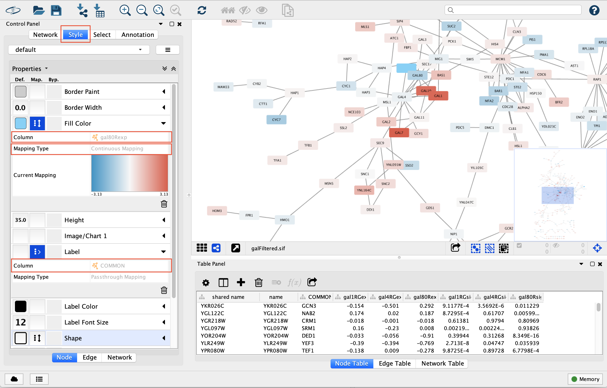
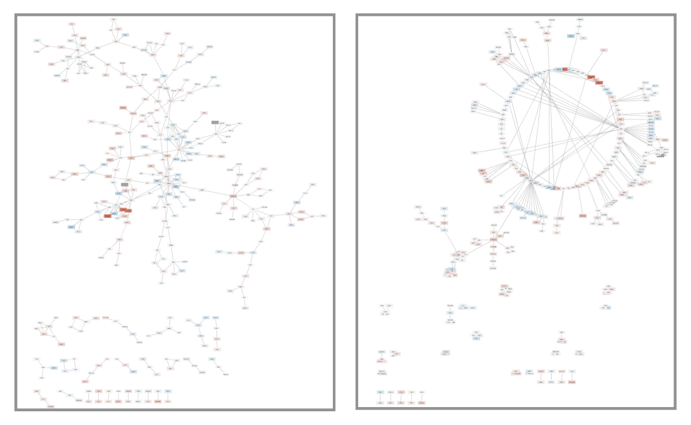

Class 17:
================
Yi Fu
5/28/2019

First, let’s check if “RCy3”, “igraph”, “RColorBrewer”, “ggraph”,
“bio3d” packages are installed. And then, load the packages.

``` r
library(RCy3)
library(igraph)
library(RColorBrewer)
library(ggraph)
```

You can download Cytoscape [here](http://cytoscape.org).

## 1\. Cytoscape

Launch Cytoscape a new window and import data to Cytoscape using the
following:

> **File \> Import \> Network from File…** and choose
> **data/galFiltered.sif**

> **File \> Import \> Table from File…** and choose
> **data/galExpData.csv**


Now let’s set the visual attributes of the nodes (labels and colors) in
our network according to the expression data we have just imported. To
do this, open the **Style** panel.

1.  select **COMMON** for **Column** under **Label**

2.  select **gal80Rexp** for **Column** under **Fill Color**

3.  select **Continuous Mapping** for **Column** under **Fill Color**

4.  select **gal80Rsig** for **Column** under **Shape**



5.1 select **Continuous Mapping** for **Column** under **Shape**, and
double-click **Current Mapping**, which is blank right now. This will
pop-up a new window.

5.2 click the **Add** button, and double-click on the left node icon,
which is a circle right now. Choose the **Rectangle** shape and click
the **Apply** button

5.3 click on the **black triangle** and move the slider to the left,
move it to the lower value of 0.05, our threshold for significance


6.  select **Layout \> Circular Layout.** to change to a circular-laid
    graph.



Zoom into this portion of the network and find the three dark red
(i.e. highly induced) nodes. Notice that these nodes are in the same
region of the graph. Also, there are two nodes that interact with all
three red nodes: **GAL4** (YPL248C) and **GAL11** (YOL051W).

Let’s select these two nodes and their immediate neighbors.

1.  click on **GAL4** (YPL248C)

2.  extend the selection by holding down the **shift** key and clicking
    on **GAL11** (YOL051W)

3.  select their neighbors by pressing **Cmd-6** on a Mac (“Select \>
    Nodes \> First Neighbors of Selected Nodes \> Undirected”)

4.  create a new network by selecting “File \> New Network \> Selected
    nodes, all edges”


Our data show precisely this:

  - Both nodes (**GAL4** and **GAL11**) show fairly small changes in
    expression, and neither change is statistically significant: they
    are rendered as light-colored circles.

  - These slight changes in expression suggest that the critical change
    affecting the red nodes (**GAL1**, **GAL7** and **GAL10**) might be
    somewhere else in the network, and not due to either **GAL4** or
    **GAL11**.

  - Note that our network shows that **GAL4** interacts with **GAL80**
    (YML051W), which shows a significant level of repression: it is
    depicted as a blue rectangle.

  - Note that while **GAL80** shows evidence of significant repression,
    most nodes interacting with **GAL4** show significant levels of
    induction: they are rendered as red rectangles.

  - **GAL11** is a general transcription co-factor with many
    interactions

To save the graph for reading into other software such as R, use “File
\> Export \> Network to File…”.

## 2\. Use Cytoscape in R

Let’s check if we can talk to cytoscape

``` r
cytoscapePing()
```

    ## [1] "You are connected to Cytoscape!"

We can test things further by making a small network and sending it to
Cytoscape.

``` r
g = makeSimpleIgraph()
createNetworkFromIgraph(g, "myGraph")
```

    ## Loading data...
    ## Applying default style...
    ## Applying preferred layout...

    ## networkSUID 
    ##        1537

We can simply plot the graph

``` r
plot(g)
```

<!-- -->

Or We can include this Cytoscape rendered network image in our report.

``` r
fig <- exportImage(filename="demo", type="png", height=350)
```

    ## Warning: This file already exists. A Cytoscape popup 
    ##                 will be generated to confirm overwrite.

``` r
knitr::include_graphics("./demo.png")
```

<!-- -->

Cytoscape provides a number of canned visual
    styles.

``` r
getVisualStyleNames()
```

    ##  [1] "Curved"               "Sample2"              "Big Labels"          
    ##  [4] "Minimal"              "Directed"             "default"             
    ##  [7] "Universe"             "Marquee"              "BioPAX"              
    ## [10] "size_rank"            "BioPAX_SIF"           "Sample3"             
    ## [13] "default black"        "Gradient1"            "Nested Network Style"
    ## [16] "Ripple"               "Solid"                "Sample1"

``` r
setVisualStyle("Marquee")
```

    ##                 message 
    ## "Visual Style applied."

We can again include this Cytoscape rendered network image in our
report.

``` r
fig <- exportImage(filename="demo_marquee", type="png", height=350)
```

    ## Warning: This file already exists. A Cytoscape popup 
    ##                 will be generated to confirm overwrite.

``` r
knitr::include_graphics("./demo_marquee.png")
```

<!-- -->

``` r
prok_vir_cor <- read.delim("./data/virus_prok_cor_abundant.tsv", stringsAsFactors = FALSE)
head(prok_vir_cor)
```

    ##       Var1          Var2    weight
    ## 1  ph_1061 AACY020068177 0.8555342
    ## 2  ph_1258 AACY020207233 0.8055750
    ## 3  ph_3164 AACY020207233 0.8122517
    ## 4  ph_1033 AACY020255495 0.8487498
    ## 5 ph_10996 AACY020255495 0.8734617
    ## 6 ph_11038 AACY020255495 0.8740782

``` r
g <- graph.data.frame(prok_vir_cor, directed = FALSE)
plot(g)
```

<!-- -->

Lets turn off text labels

``` r
plot(g, vertex.label=NA)
```

<!-- -->

Make the vertex much smaller

``` r
plot(g, vertex.size=3, vertex.label=NA)
```

<!-- -->

``` r
ggraph(g, layout = 'auto') +
  geom_edge_link(alpha = 0.25) +
  geom_node_point(color="steelblue") +
  theme_graph()
```

    ## Using `nicely` as default layout

<!-- -->

Send this network to Cytoscape.

``` r
createNetworkFromIgraph(g,"myIgraph")
```

    ## Loading data...
    ## Applying default style...
    ## Applying preferred layout...

    ## networkSUID 
    ##        1565

Community structure detection algorithms try to find dense subgraphs
within larger network graphs (i.e. clusters of well connected nodes that
are densely connected themselves but sparsely connected to other nodes
outside the
    cluster).

``` r
cb = cluster_edge_betweenness(g)
```

    ## Warning in cluster_edge_betweenness(g): At community.c:460 :Membership
    ## vector will be selected based on the lowest modularity score.

    ## Warning in cluster_edge_betweenness(g): At community.c:467 :Modularity
    ## calculation with weighted edge betweenness community detection might not
    ## make sense -- modularity treats edge weights as similarities while edge
    ## betwenness treats them as distances

``` r
plot(cb, y=g, vertex.label=NA,  vertex.size=3)
```

<!-- -->

``` r
d <- degree(g)
hist(d, breaks=30, col="lightblue", main ="Node Degree Distribution")
```

<!-- -->

``` r
plot( degree_distribution(g), type="h" )
```

<!-- -->

## Centrality analysis

``` r
bac_id_affi <- read.delim("./data/prok_tax_from_silva.tsv", stringsAsFactors = FALSE)
head(bac_id_affi)
```

    ##    Accession_ID  Kingdom         Phylum          Class             Order
    ## 1 AACY020068177 Bacteria    Chloroflexi   SAR202 clade marine metagenome
    ## 2 AACY020125842  Archaea  Euryarchaeota Thermoplasmata Thermoplasmatales
    ## 3 AACY020187844  Archaea  Euryarchaeota Thermoplasmata Thermoplasmatales
    ## 4 AACY020105546 Bacteria Actinobacteria Actinobacteria             PeM15
    ## 5 AACY020281370  Archaea  Euryarchaeota Thermoplasmata Thermoplasmatales
    ## 6 AACY020147130  Archaea  Euryarchaeota Thermoplasmata Thermoplasmatales
    ##              Family             Genus Species
    ## 1              <NA>              <NA>    <NA>
    ## 2   Marine Group II marine metagenome    <NA>
    ## 3   Marine Group II marine metagenome    <NA>
    ## 4 marine metagenome              <NA>    <NA>
    ## 5   Marine Group II marine metagenome    <NA>
    ## 6   Marine Group II marine metagenome    <NA>
