```{r setup, include=FALSE}
knitr::opts_chunk$set(echo = TRUE)
```

First, let's check if "GenomicDataCommons", "TCGAbiolinks", "maftools", "bio3d" package are installed. And then, load the packages.
```{r include=FALSE}
if (!require("GenomicDataCommons")) {
  BiocManager::install("GenomicDataCommons")
}
if (!require("TCGAbiolinks")) {
  BiocManager::install("TCGAbiolinks") 
}
if (!require("maftools")) {
  BiocManager::install("maftools")
}
if (!require("bio3d")) {
  install.packages("bio3d")
}
```

```{r}
library(GenomicDataCommons)
library(TCGAbiolinks)
library(maftools)
library(bio3d)
```

We are also going to use these websites:

> [NCI GDC](https://portal.gdc.cancer.gov)

> [IEDB HLA binding prediction](http://tools.iedb.org/mhci/)

> [Muscle](https://www.ebi.ac.uk/Tools/msa/muscle/) (optional)

## 1. National Cancer Institute Genomic Data Commons

The National Cancer Institute (NCI) in the U.S. established the [Genomic Data Commons (GDC)](https://portal.gdc.cancer.gov) for sharing cancer genomics data-sets. 

Here is what its web portal looks like. Let's try with p53.

  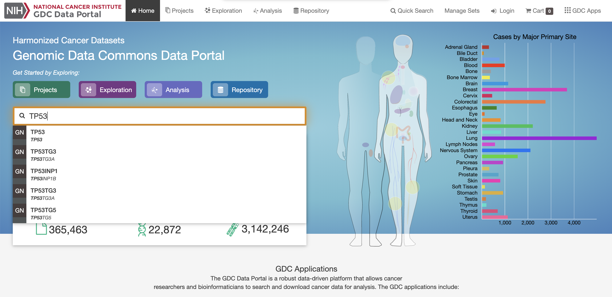

Here are the results.

  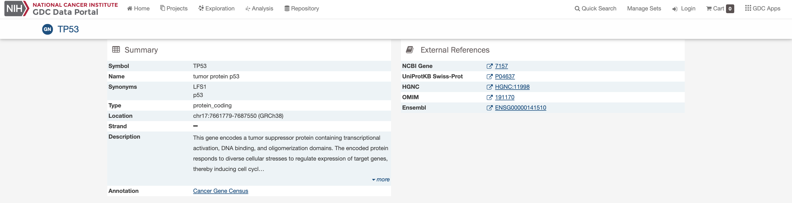
  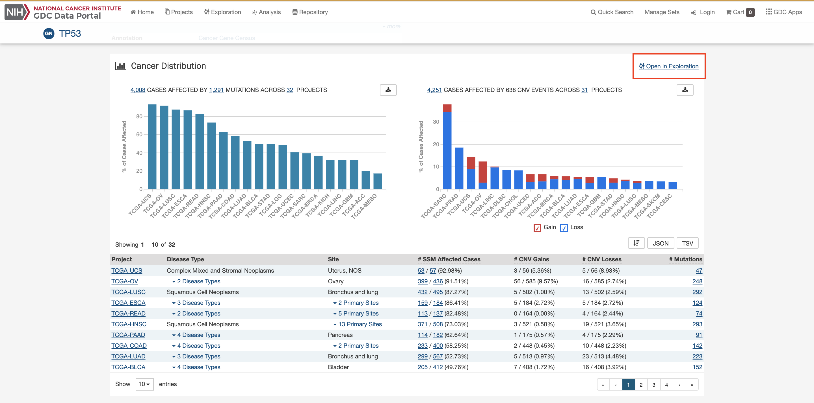
  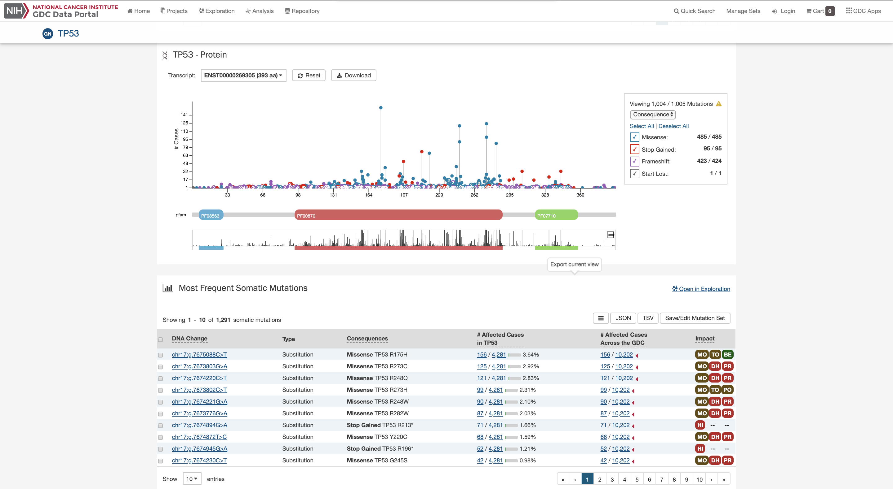

And click **Open in Exploration** to explore more information.

  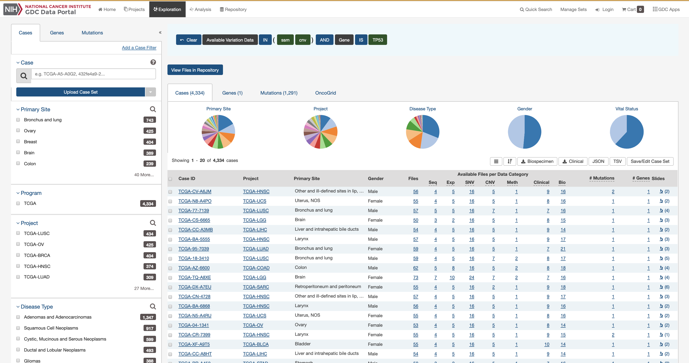

## 2. Useful R packages

### 2A. *GenomicDataCommons* package

First check on GDC status:
```{r}
GenomicDataCommons::status()
```

Let's find the number of cases/patients across different projects within the GDC. This is included in *case()*, *facet()* and *aggregations()* functions act to group all cases by the project id and then count them up.
```{r}
cases = cases() %>% facet("project.project_id") %>% aggregations()
cases = cases$project.project_id
```

Let's plot the number of cases per project, and highlight "TCGA-PAAD".
```{r}
col = rep("lightblue", nrow(cases))
col[which(cases$key=="TCGA-PAAD")] = "red"

par(mar=c(9,4,1,2))  
barplot(cases$doc_count, names.arg=cases$key, log="y", col=col, las=2)
```

### 2B. *TCGAbiolinks* package

Let's find all gene expression data files for all pancreatic cancer patients.
```{r message=FALSE}
query = GDCquery(project="TCGA-PAAD",
                 data.category="Transcriptome Profiling",
                 data.type="Gene Expression Quantification")
ans = getResults(query)
```

As of May 2019, there are 546 RNA-Seq data files.
```{r}
nrow(ans)
```

### 2C. *maftools* package

Let's focus on MAF files and store the MAF file contents in a dataframe.
```{r results="hide", message=FALSE}
maf = GDCquery_Maf(tumor="PAAD", pipelines="mutect");
variant = read.maf(maf=maf, verbose=FALSE)
```

Here is the summary of the maf objects.
```{r}
plotmafSummary(variant)
```

Here is the oncoplot, which tells mutation information, by specifying *top* or *genes* arguments.
```{r}
oncoplot(maf=variant, top=10)
oncostrip(maf=variant, genes=c("KRAS", "TP53"))
```

Or if we are interested in one specific gene, then we can call *lollipopPlot()*. Here are two examples.
```{r}
lollipopPlot(maf=variant, gene='KRAS')
lollipopPlot(maf=variant, gene='TP53')
```

## 3. Cancer Immunotherapy

[Cancer Vaccine and Immunotherapy](https://www.historyofvaccines.org/content/articles/cancer-vaccines-and-immunotherapy) is a merging topic in cancer treatment field. The tumor specific mutations that could potentially be used for vaccine development.

In order to achieve that, Comparison of DNA sequences from tumor tissue and normal tissues, but **NOT human genome**, is important to ensure that the detected differences are somatic mutations, but **NOT germline mutations**. And, subsequent analysis is to determine whether the mutated region fall into protein coding regions and change the encoded amino acid.

### 3A. Protein sequences from healthy and tumor tissue

The following sequences resulted from such an NGS analysis of patient healthy and tumor tissue. The FASTA file is saved in the data folder as **lecture18_sequences.fa**.

<font face="Courier">

> \>P53_wt Cellular tumor antigen p53 - Healthy Tissue         
MEEPQSDPSVEPPLSQETFSDLWKLLPENNVLSPLPSQAMDDLMLSPDDIEQWFTEDPGP   
DEAPRMPEAAPPVAPAPAAPTPAAPAPAPSWPLSSSVPSQKTYQGSYGFRLGFLHSGTAK   
SVTCTYSPALNKMFCQLAKTCPVQLWVDSTPPPGTRVRAMAIYKQSQHMTEVVRRCPHHE   
RCSDSDGLAPPQHLIRVEGNLRVEYLDDRNTFRHSVVVPYEPPEVGSDCTTIHYNYMCNS   
SCMGGMNRRPILTIITLEDSSGNLLGRNSFEVRVCACPGRDRRTEEENLRKKGEPHHELP   
PGSTKRALPNNTSSSPQPKKKPLDGEYFTLQIRGRERFEMFRELNEALELKDAQAGKEPG   
GSRAHSSHLKSKKGQSTSRHKKLMFKTEGPDSD                              

> \>P53_mutant Cellular tumor antigen p53 - Tumor Tissue       
MEEPQSDPSVEPPLSQETFSDLWKLLPENNVLSPLPSQAMLDLMLSPDDIEQWFTEDPGP   
DEAPWMPEAAPPVAPAPAAPTPAAPAPAPSWPLSSSVPSQKTYQGSYGFRLGFLHSGTAK   
SVTCTYSPALNKMFCQLAKTCPVQLWVDSTPPPGTRVRAMAIYKQSQHMTEVVRRCPHHE   
RCSDSDGLAPPQHLIRVEGNLRVEYLDDRNTFVHSVVVPYEPPEVGSDCTTIHYNYMCNS   
SCMGGMNRRPILTIITLEV                                            

</font>

#### Using [Muscle](https://www.ebi.ac.uk/Tools/msa/muscle/)

Here is the input.

  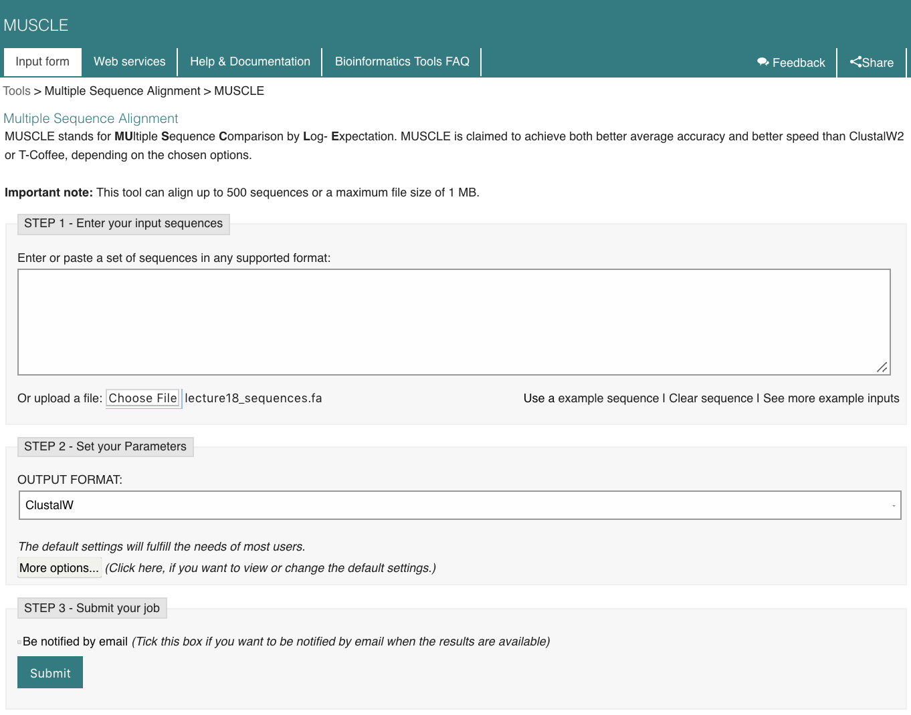

Here is the result.

  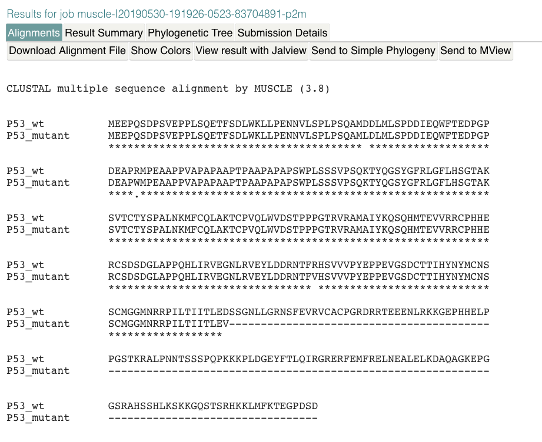

#### Using *bio3d* package

The **lecture18_sequences.fa** contains the above sequences.
```{r}
seqs = read.fasta("data/lecture18_sequences.fa")
# align these sequences if residue position correspondences have not been correctly mapped
#seqs = seqaln(seqs)
```

Let's take a look at the aligned sequences. This should be the same as Muscle results as above.
```{r}
seqs
```

Calculate positional identity scores. This allows us to identify mismatches (< 1).
```{r}
ide = conserv(seqs$ali, method="identity")
ide
```

Let's find mismatches and gap positions from the analysis. 
```{r}
mismatch = which(ide < 1)
gaps = gap.inspect(seqs)
```

After that, we are able to find the mutated positions and corresponding amino acid.
```{r}
mutant.sites = mismatch[mismatch %in% gaps$f.inds]
mutant.names = paste0(seqs$ali["P53_wt",mutant.sites], mutant.sites, seqs$ali["P53_mutant",mutant.sites])
cbind(mutant.sites, mutant.names)
```

Now, let's get the sequences with all possible 9-mers in mutant sequence, and save it to **subsequences.fa** in the data folder.
```{r}
start.position = mutant.sites - 8
end.position = mutant.sites + 8

store.seqs = matrix("", nrow=length(mutant.sites), ncol=17)
rownames(store.seqs) = mutant.names

for(i in 1:length(mutant.sites)) {
  temp = seqs$ali["P53_mutant",start.position[i]:end.position[i]]
  store.seqs[i,] = c(temp[temp!="-"],rep("",sum(temp=="-")))
}

write.fasta(seqs=store.seqs, ids=mutant.names, file="data/subsequences.fa")
```

### 3B. Patient HLA typing results and HLA binding prediction

To prioritize which of the mutations in a tumor should be included in a vaccine, they can be scanned for those resulting in mutated peptides that bind [HLA](https://en.wikipedia.org/wiki/Human_leukocyte_antigen) molecules of the patient with high affinity. We will here use algorithms developed by [IEDB HLA binding prediction](http://tools.iedb.org/mhci/). 

**subsequences.fa** is generated from above and shown below.

<font face="Courier">

> \>D41L                                                     
SPLPSQAMLDLMLSPDD                                            
\>R65W                                                       
DPGPDEAPWMPEAAPPV                                            
\>R213V                                                      
YLDDRNTFVHSVVVPYE                                            
\>D259V                                                      
ILTIITLEV                                                    

</font>

Here is the input.

  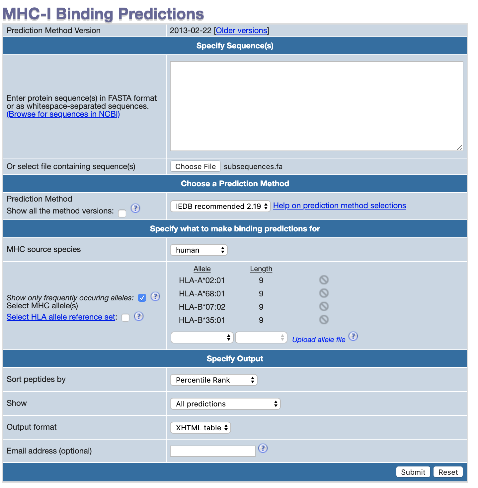

Here is the result. And more are stored in **result.csv** in the data folder.

  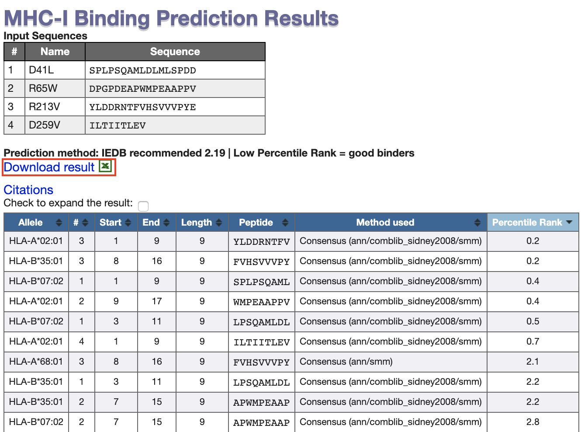

### 3C. Identifying tumor specific peptides

We can see the 

<font face="Courier">

> \>HLA-A0201_top_pep                                   
YLDDRNTFV                                               
\>HLA-A6801_HLA-B3501_top_pep                           
FVHSVVVPY                                               
\>HLA-B0702_top_pep                                     
SPLPSQAML                                               

</font>

Here is the input.

  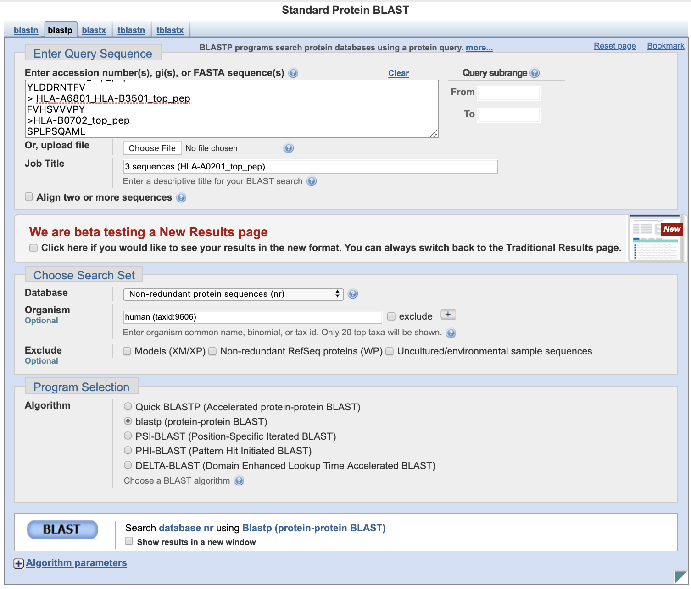
  
Here are the results for **HLA-A0201_top_pep**.

  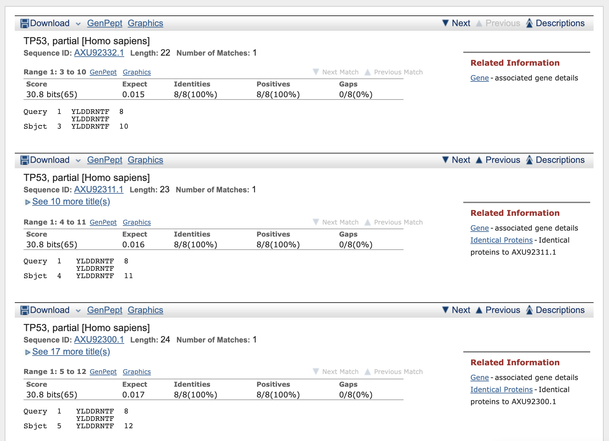

Here are the results for **HLA-A6801_HLA-B3501_top_pep**.

  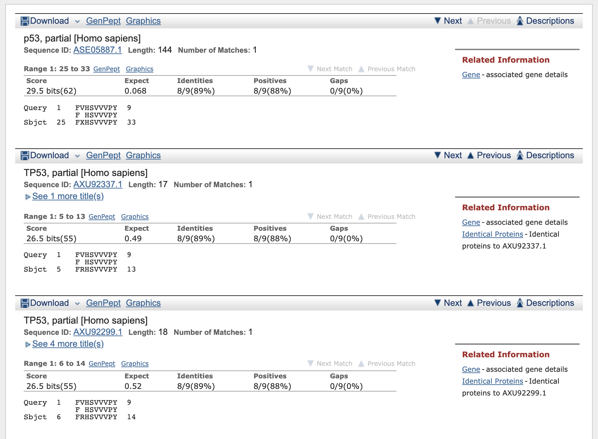
  
Here are the results for **HLA-B0702_top_pep**.

  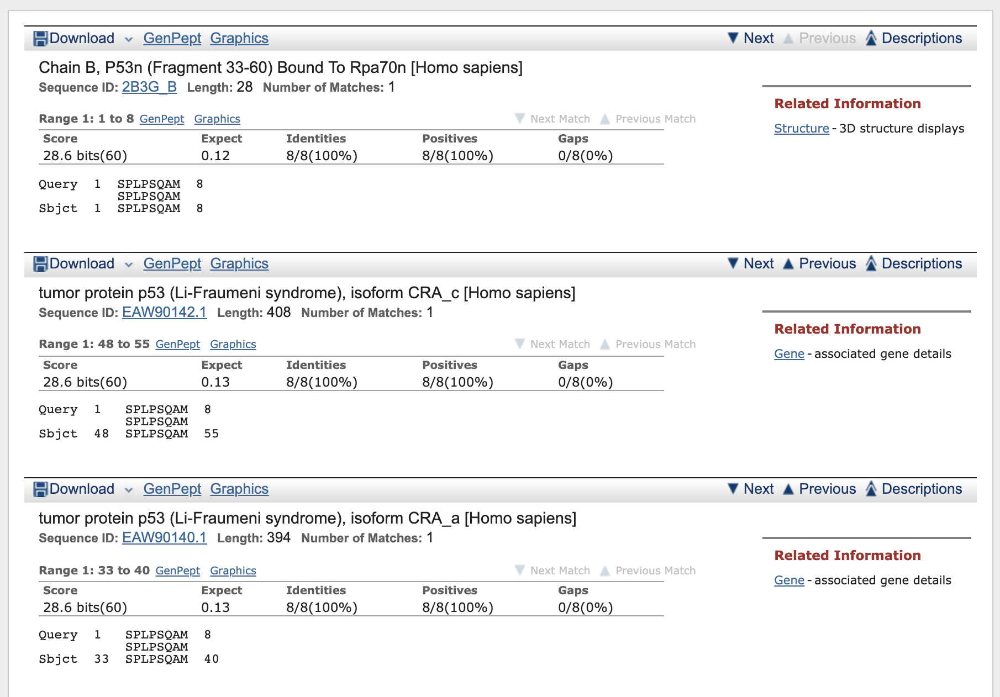
  
Conclusion, we should probably choose **FVHSVVVPY** peptide.