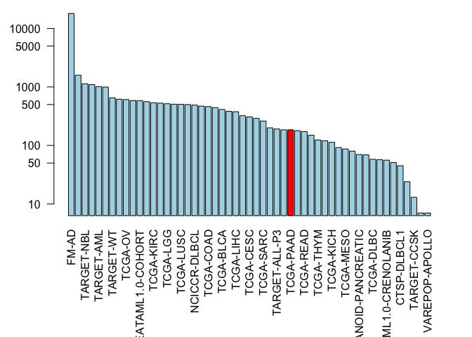
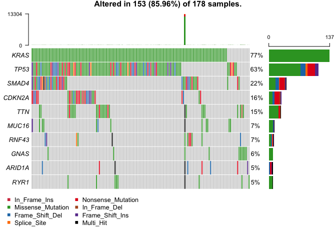
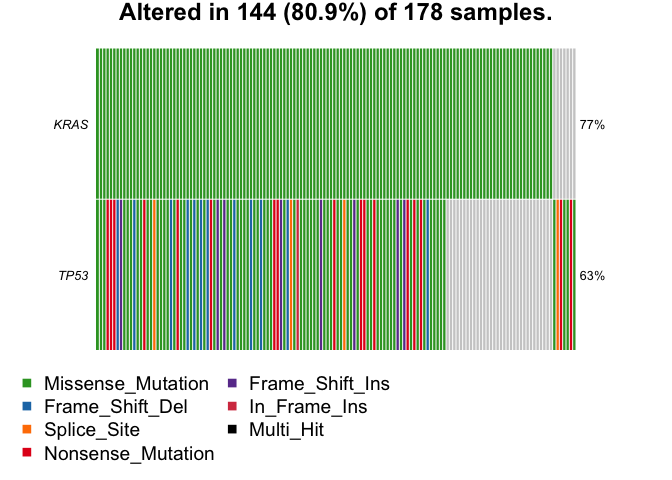
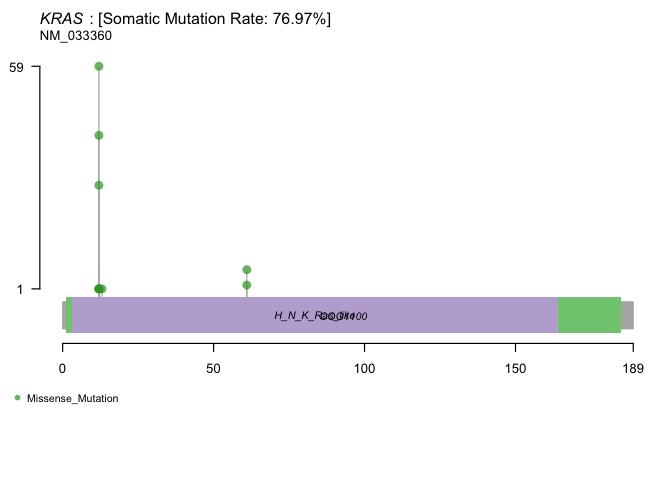
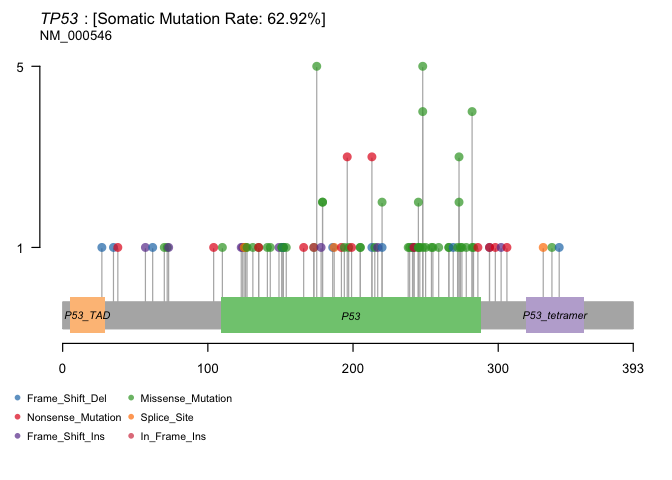

Class 18: Cancer genomics
================
Yi Fu
5/30/2019

First, let’s check if “GenomicDataCommons”, “TCGAbiolinks”, “maftools”,
“bio3d” package are installed. And then, load the packages.

``` r
library(GenomicDataCommons)
library(TCGAbiolinks)
library(maftools)
library(bio3d)
```

We are also going to use these websites:

> [NCI GDC](https://portal.gdc.cancer.gov)

> [IEDB HLA binding prediction](http://tools.iedb.org/mhci/)

> [Muscle](https://www.ebi.ac.uk/Tools/msa/muscle/) (optional)

## 1\. National Cancer Institute Genomic Data Commons

The National Cancer Institute (NCI) in the U.S. established the [Genomic
Data Commons (GDC)](https://portal.gdc.cancer.gov) for sharing cancer
genomics data-sets.

Here is what its web portal looks like. Let’s try with p53.


Here are the results.


And click **Open in Exploration** to explore more information.


## 2\. Useful R packages

### 2A. *GenomicDataCommons* package

First check on GDC status:

``` r
GenomicDataCommons::status()
```

    ## $commit
    ## [1] "e588f035feefee17f562b3a1bc2816c49a2b2b19"
    ## 
    ## $data_release
    ## [1] "Data Release 16.0 - March 26, 2019"
    ## 
    ## $status
    ## [1] "OK"
    ## 
    ## $tag
    ## [1] "1.20.0"
    ## 
    ## $version
    ## [1] 1

Let’s find the number of cases/patients across different projects within
the GDC. This is included in *case()*, *facet()* and *aggregations()*
functions act to group all cases by the project id and then count them
up.

``` r
cases = cases() %>% facet("project.project_id") %>% aggregations()
cases = cases$project.project_id
```

Let’s plot the number of cases per project, and highlight “TCGA-PAAD”.

``` r
col = rep("lightblue", nrow(cases))
col[which(cases$key=="TCGA-PAAD")] = "red"

par(mar=c(9,4,1,2))  
barplot(cases$doc_count, names.arg=cases$key, log="y", col=col, las=2)
```

<!-- -->

### 2B. *TCGAbiolinks* package

Let’s find all gene expression data files for all pancreatic cancer
patients.

``` r
query = GDCquery(project="TCGA-PAAD",
                 data.category="Transcriptome Profiling",
                 data.type="Gene Expression Quantification")
ans = getResults(query)
```

As of May 2019, there are 546 RNA-Seq data files.

``` r
nrow(ans)
```

    ## [1] 546

### 2C. *maftools* package

Let’s focus on MAF files and store the MAF file contents in a dataframe.

``` r
maf = GDCquery_Maf(tumor="PAAD", pipelines="mutect");
variant = read.maf(maf=maf, verbose=FALSE)
```

Here is the summary of the maf objects.

``` r
plotmafSummary(variant)
```

<!-- -->

Here is the oncoplot, which tells mutation information, by specifying
*top* or *genes* arguments.

``` r
oncoplot(maf=variant, top=10)
```

<!-- -->

``` r
oncostrip(maf=variant, genes=c("KRAS", "TP53"))
```

<!-- -->

Or if we are interested in one specific gene, then we can call
*lollipopPlot()*. Here are two
    examples.

``` r
lollipopPlot(maf=variant, gene='KRAS')
```

    ## Assuming protein change information are stored under column HGVSp_Short. Use argument AACol to override if necessary.

    ## 2 transcripts available. Use arguments refSeqID or proteinID to manually specify tx name.

    ##    HGNC refseq.ID protein.ID aa.length
    ## 1: KRAS NM_004985  NP_004976       188
    ## 2: KRAS NM_033360  NP_203524       189

    ## Using longer transcript NM_033360 for now.

<!-- -->

``` r
lollipopPlot(maf=variant, gene='TP53')
```

    ## Assuming protein change information are stored under column HGVSp_Short. Use argument AACol to override if necessary.

    ## 8 transcripts available. Use arguments refSeqID or proteinID to manually specify tx name.

    ##    HGNC    refseq.ID   protein.ID aa.length
    ## 1: TP53    NM_000546    NP_000537       393
    ## 2: TP53 NM_001126112 NP_001119584       393
    ## 3: TP53 NM_001126118 NP_001119590       354
    ## 4: TP53 NM_001126115 NP_001119587       261
    ## 5: TP53 NM_001126113 NP_001119585       346
    ## 6: TP53 NM_001126117 NP_001119589       214
    ## 7: TP53 NM_001126114 NP_001119586       341
    ## 8: TP53 NM_001126116 NP_001119588       209

    ## Using longer transcript NM_000546 for now.

<!-- -->

## 3\. Cancer Immunotherapy

[Cancer Vaccine and
Immunotherapy](https://www.historyofvaccines.org/content/articles/cancer-vaccines-and-immunotherapy)
is a merging topic in cancer treatment field. The tumor specific
mutations that could potentially be used for vaccine development.

In order to achieve that, Comparison of DNA sequences from tumor tissue
and normal tissues, but **NOT human genome**, is important to ensure
that the detected differences are somatic mutations, but **NOT germline
mutations**. And, subsequent analysis is to determine whether the
mutated region fall into protein coding regions and change the encoded
amino acid.

### 3A. Protein sequences from healthy and tumor tissue

The following sequences resulted from such an NGS analysis of patient
healthy and tumor tissue. The FASTA file is saved in the data folder as
**lecture18\_sequences.fa**.

<font face="Courier">

> \>P53\_wt Cellular tumor antigen p53 - Healthy Tissue  
> MEEPQSDPSVEPPLSQETFSDLWKLLPENNVLSPLPSQAMDDLMLSPDDIEQWFTEDPGP  
> DEAPRMPEAAPPVAPAPAAPTPAAPAPAPSWPLSSSVPSQKTYQGSYGFRLGFLHSGTAK  
> SVTCTYSPALNKMFCQLAKTCPVQLWVDSTPPPGTRVRAMAIYKQSQHMTEVVRRCPHHE  
> RCSDSDGLAPPQHLIRVEGNLRVEYLDDRNTFRHSVVVPYEPPEVGSDCTTIHYNYMCNS  
> SCMGGMNRRPILTIITLEDSSGNLLGRNSFEVRVCACPGRDRRTEEENLRKKGEPHHELP  
> PGSTKRALPNNTSSSPQPKKKPLDGEYFTLQIRGRERFEMFRELNEALELKDAQAGKEPG  
> GSRAHSSHLKSKKGQSTSRHKKLMFKTEGPDSD

> \>P53\_mutant Cellular tumor antigen p53 - Tumor Tissue  
> MEEPQSDPSVEPPLSQETFSDLWKLLPENNVLSPLPSQAMLDLMLSPDDIEQWFTEDPGP  
> DEAPWMPEAAPPVAPAPAAPTPAAPAPAPSWPLSSSVPSQKTYQGSYGFRLGFLHSGTAK  
> SVTCTYSPALNKMFCQLAKTCPVQLWVDSTPPPGTRVRAMAIYKQSQHMTEVVRRCPHHE  
> RCSDSDGLAPPQHLIRVEGNLRVEYLDDRNTFVHSVVVPYEPPEVGSDCTTIHYNYMCNS  
> SCMGGMNRRPILTIITLEV

</font>

#### Using [Muscle](https://www.ebi.ac.uk/Tools/msa/muscle/)

Here is the input.


Here is the result.


#### Using *bio3d* package

The **lecture18\_sequences.fa** contains the above sequences.

``` r
seqs = read.fasta("data/lecture18_sequences.fa")
# align these sequences if residue position correspondences have not been correctly mapped
#seqs = seqaln(seqs)
```

Let’s take a look at the aligned sequences. This should be the same as
Muscle results as
    above.

``` r
seqs
```

    ##              1        .         .         .         .         .         60 
    ## P53_wt       MEEPQSDPSVEPPLSQETFSDLWKLLPENNVLSPLPSQAMDDLMLSPDDIEQWFTEDPGP
    ## P53_mutant   MEEPQSDPSVEPPLSQETFSDLWKLLPENNVLSPLPSQAMLDLMLSPDDIEQWFTEDPGP
    ##              **************************************** ******************* 
    ##              1        .         .         .         .         .         60 
    ## 
    ##             61        .         .         .         .         .         120 
    ## P53_wt       DEAPRMPEAAPPVAPAPAAPTPAAPAPAPSWPLSSSVPSQKTYQGSYGFRLGFLHSGTAK
    ## P53_mutant   DEAPWMPEAAPPVAPAPAAPTPAAPAPAPSWPLSSSVPSQKTYQGSYGFRLGFLHSGTAK
    ##              **** ******************************************************* 
    ##             61        .         .         .         .         .         120 
    ## 
    ##            121        .         .         .         .         .         180 
    ## P53_wt       SVTCTYSPALNKMFCQLAKTCPVQLWVDSTPPPGTRVRAMAIYKQSQHMTEVVRRCPHHE
    ## P53_mutant   SVTCTYSPALNKMFCQLAKTCPVQLWVDSTPPPGTRVRAMAIYKQSQHMTEVVRRCPHHE
    ##              ************************************************************ 
    ##            121        .         .         .         .         .         180 
    ## 
    ##            181        .         .         .         .         .         240 
    ## P53_wt       RCSDSDGLAPPQHLIRVEGNLRVEYLDDRNTFRHSVVVPYEPPEVGSDCTTIHYNYMCNS
    ## P53_mutant   RCSDSDGLAPPQHLIRVEGNLRVEYLDDRNTFVHSVVVPYEPPEVGSDCTTIHYNYMCNS
    ##              ******************************** *************************** 
    ##            181        .         .         .         .         .         240 
    ## 
    ##            241        .         .         .         .         .         300 
    ## P53_wt       SCMGGMNRRPILTIITLEDSSGNLLGRNSFEVRVCACPGRDRRTEEENLRKKGEPHHELP
    ## P53_mutant   SCMGGMNRRPILTIITLEV-----------------------------------------
    ##              ******************                                           
    ##            241        .         .         .         .         .         300 
    ## 
    ##            301        .         .         .         .         .         360 
    ## P53_wt       PGSTKRALPNNTSSSPQPKKKPLDGEYFTLQIRGRERFEMFRELNEALELKDAQAGKEPG
    ## P53_mutant   ------------------------------------------------------------
    ##                                                                           
    ##            301        .         .         .         .         .         360 
    ## 
    ##            361        .         .         .  393 
    ## P53_wt       GSRAHSSHLKSKKGQSTSRHKKLMFKTEGPDSD
    ## P53_mutant   ---------------------------------
    ##                                                
    ##            361        .         .         .  393 
    ## 
    ## Call:
    ##   read.fasta(file = "data/lecture18_sequences.fa")
    ## 
    ## Class:
    ##   fasta
    ## 
    ## Alignment dimensions:
    ##   2 sequence rows; 393 position columns (259 non-gap, 134 gap) 
    ## 
    ## + attr: id, ali, call

Calculate positional identity scores. This allows us to identify
mismatches (\< 1).

``` r
ide = conserv(seqs$ali, method="identity")
ide
```

    ##   [1] 1.0 1.0 1.0 1.0 1.0 1.0 1.0 1.0 1.0 1.0 1.0 1.0 1.0 1.0 1.0 1.0 1.0
    ##  [18] 1.0 1.0 1.0 1.0 1.0 1.0 1.0 1.0 1.0 1.0 1.0 1.0 1.0 1.0 1.0 1.0 1.0
    ##  [35] 1.0 1.0 1.0 1.0 1.0 1.0 0.5 1.0 1.0 1.0 1.0 1.0 1.0 1.0 1.0 1.0 1.0
    ##  [52] 1.0 1.0 1.0 1.0 1.0 1.0 1.0 1.0 1.0 1.0 1.0 1.0 1.0 0.5 1.0 1.0 1.0
    ##  [69] 1.0 1.0 1.0 1.0 1.0 1.0 1.0 1.0 1.0 1.0 1.0 1.0 1.0 1.0 1.0 1.0 1.0
    ##  [86] 1.0 1.0 1.0 1.0 1.0 1.0 1.0 1.0 1.0 1.0 1.0 1.0 1.0 1.0 1.0 1.0 1.0
    ## [103] 1.0 1.0 1.0 1.0 1.0 1.0 1.0 1.0 1.0 1.0 1.0 1.0 1.0 1.0 1.0 1.0 1.0
    ## [120] 1.0 1.0 1.0 1.0 1.0 1.0 1.0 1.0 1.0 1.0 1.0 1.0 1.0 1.0 1.0 1.0 1.0
    ## [137] 1.0 1.0 1.0 1.0 1.0 1.0 1.0 1.0 1.0 1.0 1.0 1.0 1.0 1.0 1.0 1.0 1.0
    ## [154] 1.0 1.0 1.0 1.0 1.0 1.0 1.0 1.0 1.0 1.0 1.0 1.0 1.0 1.0 1.0 1.0 1.0
    ## [171] 1.0 1.0 1.0 1.0 1.0 1.0 1.0 1.0 1.0 1.0 1.0 1.0 1.0 1.0 1.0 1.0 1.0
    ## [188] 1.0 1.0 1.0 1.0 1.0 1.0 1.0 1.0 1.0 1.0 1.0 1.0 1.0 1.0 1.0 1.0 1.0
    ## [205] 1.0 1.0 1.0 1.0 1.0 1.0 1.0 1.0 0.5 1.0 1.0 1.0 1.0 1.0 1.0 1.0 1.0
    ## [222] 1.0 1.0 1.0 1.0 1.0 1.0 1.0 1.0 1.0 1.0 1.0 1.0 1.0 1.0 1.0 1.0 1.0
    ## [239] 1.0 1.0 1.0 1.0 1.0 1.0 1.0 1.0 1.0 1.0 1.0 1.0 1.0 1.0 1.0 1.0 1.0
    ## [256] 1.0 1.0 1.0 0.5 0.5 0.5 0.5 0.5 0.5 0.5 0.5 0.5 0.5 0.5 0.5 0.5 0.5
    ## [273] 0.5 0.5 0.5 0.5 0.5 0.5 0.5 0.5 0.5 0.5 0.5 0.5 0.5 0.5 0.5 0.5 0.5
    ## [290] 0.5 0.5 0.5 0.5 0.5 0.5 0.5 0.5 0.5 0.5 0.5 0.5 0.5 0.5 0.5 0.5 0.5
    ## [307] 0.5 0.5 0.5 0.5 0.5 0.5 0.5 0.5 0.5 0.5 0.5 0.5 0.5 0.5 0.5 0.5 0.5
    ## [324] 0.5 0.5 0.5 0.5 0.5 0.5 0.5 0.5 0.5 0.5 0.5 0.5 0.5 0.5 0.5 0.5 0.5
    ## [341] 0.5 0.5 0.5 0.5 0.5 0.5 0.5 0.5 0.5 0.5 0.5 0.5 0.5 0.5 0.5 0.5 0.5
    ## [358] 0.5 0.5 0.5 0.5 0.5 0.5 0.5 0.5 0.5 0.5 0.5 0.5 0.5 0.5 0.5 0.5 0.5
    ## [375] 0.5 0.5 0.5 0.5 0.5 0.5 0.5 0.5 0.5 0.5 0.5 0.5 0.5 0.5 0.5 0.5 0.5
    ## [392] 0.5 0.5

Let’s find mismatches and gap positions from the analysis.

``` r
mismatch = which(ide < 1)
gaps = gap.inspect(seqs)
```

After that, we are able to find the mutated positions and corresponding
amino acid.

``` r
mutant.sites = mismatch[mismatch %in% gaps$f.inds]
mutant.names = paste0(seqs$ali["P53_wt",mutant.sites], mutant.sites, seqs$ali["P53_mutant",mutant.sites])
cbind(mutant.sites, mutant.names)
```

    ##      mutant.sites mutant.names
    ## [1,] "41"         "D41L"      
    ## [2,] "65"         "R65W"      
    ## [3,] "213"        "R213V"     
    ## [4,] "259"        "D259V"

Now, let’s get the sequences with all possible 9-mers in mutant
sequence, and save it to **subsequences.fa** in the data folder.

``` r
start.position = mutant.sites - 8
end.position = mutant.sites + 8

store.seqs = matrix("", nrow=length(mutant.sites), ncol=17)
rownames(store.seqs) = mutant.names

for(i in 1:length(mutant.sites)) {
  temp = seqs$ali["P53_mutant",start.position[i]:end.position[i]]
  store.seqs[i,] = c(temp[temp!="-"],rep("",sum(temp=="-")))
}

write.fasta(seqs=store.seqs, ids=mutant.names, file="data/subsequences.fa")
```

### 3B. Patient HLA typing results and HLA binding prediction

To prioritize which of the mutations in a tumor should be included in a
vaccine, they can be scanned for those resulting in mutated peptides
that bind [HLA](https://en.wikipedia.org/wiki/Human_leukocyte_antigen)
molecules of the patient with high affinity. We will here use algorithms
developed by [IEDB HLA binding prediction](http://tools.iedb.org/mhci/).

**subsequences.fa** is generated from above and shown below.

<font face="Courier">

> \>D41L  
> SPLPSQAMLDLMLSPDD  
> \>R65W  
> DPGPDEAPWMPEAAPPV  
> \>R213V  
> YLDDRNTFVHSVVVPYE  
> \>D259V  
> ILTIITLEV

</font>

Here is the input.


Here is the result. And more are stored in **result.csv** in the data
folder.


### 3C. Identifying tumor specific peptides

We can see the

<font face="Courier">

> \>HLA-A0201\_top\_pep  
> YLDDRNTFV  
> \>HLA-A6801\_HLA-B3501\_top\_pep  
> FVHSVVVPY  
> \>HLA-B0702\_top\_pep  
> SPLPSQAML

</font>

Here is the input.


Here are the results for **HLA-A0201\_top\_pep**.


Here are the results for **HLA-A6801\_HLA-B3501\_top\_pep**.


Here are the results for **HLA-B0702\_top\_pep**.


Conclusion, we should probably choose **FVHSVVVPY** peptide.
